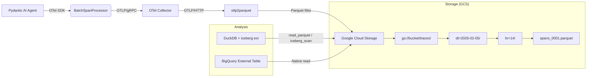

# Backlog: Observability Lakehouse Pipeline (GCS + Parquet + DuckDB)

**Status:** Backlog (not implemented)
**Date:** 2026-02-05
**Context:** Future migration path from local SQLite telemetry to cloud-based observability

## 1. Overview

Migrate co-cli's OTel trace storage from the current local `SQLiteSpanExporter` to a cloud-based observability lakehouse. The pipeline uses an OTel Collector as a lightweight relay, converts spans to Parquet via `otlp2parquet`, and stores them on GCS with an optional Apache Iceberg catalog. Consumption uses DuckDB locally or BigQuery externally.

### 1.1 Goals
*   **Zero managed infrastructure:** No hosted collectors, APM vendors, or databases to operate.
*   **Cost efficiency:** Pay only for GCS storage + local CPU (DuckDB) or BigQuery scan slots.
*   **Vendor neutrality:** Standard OTel wire protocol (OTLP); standard Parquet storage.
*   **Query performance:** Columnar Parquet + partition pruning = sub-second daily aggregations in DuckDB.
*   **Backward compatible:** Local SQLite exporter remains the default; cloud pipeline is opt-in via `Settings`.

### 1.2 Current State
Co-cli uses `SQLiteSpanExporter` (`co_cli/telemetry.py`) writing to `~/.local/share/co-cli/co-cli.db`. This works well for single-user local development. The cloud pipeline is for when traces need to persist beyond the local machine or be shared across environments.

## 2. Architecture



### 2.1 Component Roles

| Component | Role | Why not skip it? |
|:---|:---|:---|
| **OTel SDK** (`main.py`) | Generates spans via `Agent.instrument_all()` | Already implemented. No change needed. |
| **OTel Collector** (sidecar) | Batching, retry, sampling, routing | CNCF best practice. Decouples app from export destination. Enables tail sampling. |
| **otlp2parquet** | Receives OTLP, writes Parquet to GCS | Parquet is ~90% smaller than NDJSON. Columnar format enables partition/column pruning. |
| **GCS** | Durable object storage | Cheapest tier. Compatible with DuckDB, BigQuery, Spark. |
| **DuckDB** | Ad-hoc local queries | Reads Parquet and Iceberg natively. `otlp` extension for raw OTLP files. |

## 3. Data Design

### 3.1 File Format
*   **Format:** Apache Parquet (columnar, compressed).
*   **Compression:** Snappy (default from `otlp2parquet`; good balance of speed and ratio).
*   **Schema:** Strongly typed columns from the OTel data model — not a custom JSON schema.

### 3.2 Partitioning
Hive-style partitioning on GCS, managed by `otlp2parquet`:

```
gs://{bucket}/traces/dt={YYYY-MM-DD}/hr={HH}/spans_{sequence}.parquet
```

**Example:**
*   `gs://co-cli-traces/traces/dt=2026-02-05/hr=09/spans_0001.parquet`
*   `gs://co-cli-traces/traces/dt=2026-02-05/hr=10/spans_0002.parquet`

DuckDB and BigQuery automatically prune partitions — a query filtered to `dt = '2026-02-05'` skips all other date folders entirely.

### 3.3 Parquet Schema (OTel Spans)
`otlp2parquet` outputs columns following the ClickHouse OTel schema:

| Column | Type | Source |
|:---|:---|:---|
| `TraceId` | STRING | `span.context.trace_id` (hex) |
| `SpanId` | STRING | `span.context.span_id` (hex) |
| `ParentSpanId` | STRING | `span.parent.span_id` (hex) |
| `SpanName` | STRING | `span.name` |
| `SpanKind` | STRING | `INTERNAL`, `CLIENT`, `SERVER` |
| `ServiceName` | STRING | `resource.service.name` |
| `Duration` | INT64 | Nanoseconds |
| `StatusCode` | STRING | `OK`, `ERROR`, `UNSET` |
| `StatusMessage` | STRING | Error description |
| `SpanAttributes` | MAP<STRING, STRING> | `span.attributes` |
| `ResourceAttributes` | MAP<STRING, STRING> | `span.resource.attributes` |
| `Events.Name` | LIST<STRING> | Event names |
| `Events.Attributes` | LIST<MAP> | Event attributes |
| `Timestamp` | TIMESTAMP | `span.start_time` |

### 3.4 Optional: Apache Iceberg
For production scale (100k+ spans/day), wrap the Parquet files in an Iceberg table:
*   **Schema evolution** without rewriting history.
*   **Compaction** merges small files automatically.
*   **Time travel** queries ("show me traces from 2 hours ago").
*   **Snapshot isolation** for concurrent reads/writes.

`otlp2parquet` supports writing directly to Iceberg catalogs.

## 4. Implementation

### 4.1 OTel Collector Configuration
Run a minimal Collector as a local sidecar (Docker or binary). It receives OTLP from the SDK and forwards to `otlp2parquet`.

```yaml
# otel-collector-config.yaml
receivers:
  otlp:
    protocols:
      grpc:
        endpoint: "0.0.0.0:4317"

processors:
  batch:
    send_batch_size: 512
    timeout: 5s

exporters:
  otlphttp:
    endpoint: "http://localhost:4318"

service:
  pipelines:
    traces:
      receivers: [otlp]
      processors: [batch]
      exporters: [otlphttp]
```

### 4.2 otlp2parquet
Receives OTLP/HTTP from the Collector and writes Parquet to GCS.

```bash
# Install
cargo install otlp2parquet

# Run (writes Parquet to GCS with Hive partitioning)
otlp2parquet \
  --listen 0.0.0.0:4318 \
  --output gs://co-cli-traces/traces/ \
  --partition-by "dt=%Y-%m-%d/hr=%H"
```

### 4.3 Application Integration (`main.py`)
The SDK setup stays nearly identical. The only change is adding an `OTLPSpanExporter` alongside the existing `SQLiteSpanExporter`.

```python
from opentelemetry.sdk.trace import TracerProvider
from opentelemetry.sdk.trace.export import BatchSpanProcessor
from opentelemetry.sdk.resources import Resource
from opentelemetry.exporter.otlp.proto.grpc.trace_exporter import OTLPSpanExporter
from pydantic_ai import Agent
from pydantic_ai.models.instrumented import InstrumentationSettings

from co_cli.telemetry import SQLiteSpanExporter
from co_cli.config import settings

resource = Resource.create({
    "service.name": "co-cli",
    "service.version": "0.1.0",
})
tracer_provider = TracerProvider(resource=resource)

# Local SQLite (always on — existing behavior)
tracer_provider.add_span_processor(BatchSpanProcessor(SQLiteSpanExporter()))

# Cloud export (opt-in via settings)
if settings.otel_collector_endpoint:
    cloud_exporter = OTLPSpanExporter(endpoint=settings.otel_collector_endpoint)
    tracer_provider.add_span_processor(BatchSpanProcessor(cloud_exporter))

Agent.instrument_all(InstrumentationSettings(
    tracer_provider=tracer_provider,
    version=3,
))
```

### 4.4 Settings Addition (`co_cli/config.py`)
New optional field:

```python
class Settings(BaseModel):
    # ... existing fields ...
    otel_collector_endpoint: Optional[str] = Field(default=None)
    # e.g. "http://localhost:4317" — when set, enables cloud export
```

Env var: `OTEL_COLLECTOR_ENDPOINT` (follows OTel env var conventions).

## 5. Consumption (DuckDB)

### 5.1 Setup

```sql
INSTALL httpfs;
LOAD httpfs;

-- GCS via S3-compatible API (HMAC keys)
SET s3_region = 'auto';
SET s3_endpoint = 'storage.googleapis.com';
SET s3_access_key_id = 'GOOG...';
SET s3_secret_access_key = '...';
```

### 5.2 Queries

**Find all errors today** — Parquet + partition pruning, no full scan:

```sql
SELECT
    SpanName,
    ServiceName,
    Duration / 1e6 as duration_ms,
    StatusMessage
FROM read_parquet('s3://co-cli-traces/traces/**/*.parquet', hive_partitioning=true)
WHERE dt = strftime(today(), '%Y-%m-%d')
  AND StatusCode = 'ERROR';
```

**Token usage aggregation:**

```sql
SELECT
    dt,
    hr,
    sum(cast(SpanAttributes['gen_ai.usage.input_tokens'] as int)) as total_input,
    sum(cast(SpanAttributes['gen_ai.usage.output_tokens'] as int)) as total_output
FROM read_parquet('s3://co-cli-traces/traces/**/*.parquet', hive_partitioning=true)
WHERE dt >= '2026-02-01'
GROUP BY 1, 2
ORDER BY 1 DESC, 2 DESC;
```

**Using the DuckDB `otlp` extension** (alternative — reads raw OTLP files directly):

```sql
INSTALL otlp FROM community;
LOAD otlp;

SELECT * FROM read_otlp_traces('s3://co-cli-traces/raw/**/*.jsonl');
```

### 5.3 Iceberg Queries (if using Iceberg catalog)

```sql
INSTALL iceberg;
LOAD iceberg;

SELECT SpanName, Duration / 1e6 as duration_ms
FROM iceberg_scan('s3://co-cli-traces/iceberg/traces')
WHERE StatusCode = 'ERROR';
```

## 6. Deployment Options

| Scenario | Collector | otlp2parquet | Storage |
|:---|:---|:---|:---|
| **Dev (current)** | None | None | SQLite (local) |
| **Dev + cloud** | Docker sidecar | Local binary | GCS bucket |
| **Production** | Cloud Run service | Cloud Run service | GCS + Iceberg |

## 7. Cost Estimate (1M spans/month)

| Component | Cost |
|:---|:---|
| GCS storage (Parquet, ~50MB compressed) | ~$0.001/month |
| otlp2parquet compute (Cloud Run) | ~$0.50/month |
| DuckDB queries | $0 (local CPU) |
| BigQuery on-demand (if needed) | ~$0.25/TB scanned |
| **Total** | **< $1/month** |

## 8. References

*   [otlp2parquet](https://github.com/smithclay/otlp2parquet) — OTLP to Parquet converter
*   [Cheap OTel Lakehouses](https://clay.fyi/blog/cheap-opentelemetry-lakehouses-parquet-duckdb-iceberg/) — Parquet + DuckDB + Iceberg pattern
*   [DuckDB otlp extension](https://duckdb.org/community_extensions/extensions/otlp) — Native OTel trace reading
*   [OTel Collector](https://opentelemetry.io/docs/collector/) — CNCF recommended relay
*   [CNCF: Collector vs Agent (Feb 2026)](https://www.cncf.io/blog/2026/02/02/opentelemetry-collector-vs-agent-how-to-choose-the-right-telemetry-approach/)
*   [OTel GenAI Semantic Conventions](https://opentelemetry.io/docs/specs/semconv/gen-ai/)
*   [Apache Iceberg for Observability](https://www.infoworld.com/article/4066477/why-observability-needs-apache-iceberg.html)
