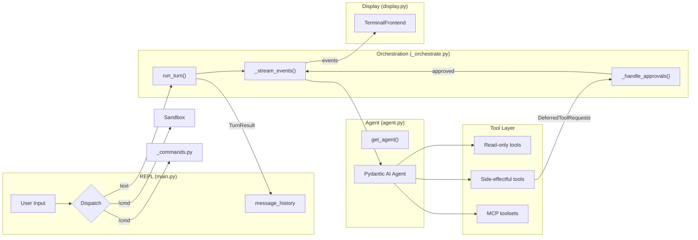

# Design: Agent Loop

## 1. What & How

The agent loop is the core orchestration layer. It connects the REPL (user input), the pydantic-ai Agent (LLM + tools), and the terminal display (Rich). Three modules collaborate:

- **`agent.py`** — `get_agent()` factory: model selection, tool registration, system prompt
- **`_orchestrate.py`** — `run_turn()` state machine: streaming, approval chaining, error handling, interrupt patching
- **`main.py`** — REPL: input dispatch, session lifecycle, context history

`CoDeps` (in `deps.py`) is the runtime dependency dataclass injected into every tool via `RunContext[CoDeps]`. `FrontendProtocol` (in `_orchestrate.py`) abstracts all display — `TerminalFrontend` (Rich/prompt-toolkit) and `RecordingFrontend` (tests) implement it.



## 2. Core Logic

### Agent Factory (`get_agent`)

Returns `(agent, model_settings, tool_names)`. Selects the LLM model based on `settings.llm_provider`, registers all tools, and returns provider-specific `ModelSettings`.

```
get_agent(all_approval, web_policy, mcp_servers) → (agent, model_settings, tool_names):
    if provider == "gemini":
        model = "google-gla:{gemini_model}"
    else:  # ollama
        model = OpenAIChatModel(ollama_model, OpenAIProvider(ollama_host))
        model_settings = ModelSettings(temperature, top_p, max_tokens)

    system_prompt = get_system_prompt(provider, personality, model_name)

    agent = Agent(
        model, deps_type=CoDeps,
        system_prompt, retries=tool_retries,
        output_type=[str, DeferredToolRequests],
        history_processors=[truncate_tool_returns, truncate_history_window],
    )

    # Side-effectful tools — require human approval
    for tool in [run_shell_command, create_email_draft, send_slack_message, save_memory]:
        agent.tool(tool, requires_approval=True)

    # Read-only tools — auto-execute (unless all_approval for eval)
    for tool in [recall_memory, list_memories, search_notes, list_notes, ...]:
        agent.tool(tool, requires_approval=all_approval)

    # Web tools — approval controlled by web_policy
    agent.tool(web_search, requires_approval=(policy.search == "ask"))
    agent.tool(web_fetch, requires_approval=(policy.fetch == "ask"))

    # MCP toolsets — connect external tool servers (auto-prefixed)
    for name, config in mcp_servers:
        agent.tool_set(MCPServerStdio(config), prefix=name)

    return agent, model_settings, tool_names
```

**Tool classification:**

| Category | Registration | Approval |
|----------|-------------|----------|
| Side-effectful | `requires_approval=True` | Chat loop prompts `[y/n/a(yolo)]` via `DeferredToolRequests` |
| Read-only | `requires_approval=all_approval` | None normally; `all_approval=True` forces deferred (for eval) |
| Web tools | `requires_approval=(policy == "ask")` | Controlled by `web_policy.search` / `web_policy.fetch` |
| MCP tools | `approval` per server config | `"auto"` → requires approval; `"never"` → trusted |

**`all_approval` parameter:** When `get_agent(all_approval=True)` is called, all tools return `DeferredToolRequests` without executing. Used by the eval framework to extract tool name and args without triggering `ModelRetry` loops from missing credentials.

See [DESIGN-03-llm-models.md](DESIGN-03-llm-models.md) for model configuration details.

### CoDeps (Runtime Dependencies)

Flat dataclass injected into every tool via `RunContext[CoDeps]`. Contains runtime resources, NOT config objects — `Settings` creates resources in `main.py`, then injects scalar values here.

```
CoDeps:
    # --- Runtime resources ---
    sandbox: SandboxProtocol          # Docker or subprocess backend
    auto_confirm: bool                # Session-level yolo mode
    session_id: str                   # Unique per session (uuid4)
    slack_client: Any                 # slack_sdk.WebClient at runtime
    google_creds: Any                 # Cached credentials (lazy-resolved)

    # --- Tool config (flat scalars from Settings) ---
    obsidian_vault_path: Path | None  # Obsidian vault location
    google_credentials_path: str      # OAuth token path
    shell_safe_commands: list[str]    # Auto-approved command prefixes
    sandbox_max_timeout: int          # Hard ceiling (default 600)
    brave_search_api_key: str         # Brave Search API key
    web_fetch_allowed_domains: list   # Domain allowlist
    web_fetch_blocked_domains: list   # Domain blocklist
    web_policy: WebPolicy             # search/fetch policy (allow/ask/deny)

    # --- Memory config ---
    memory_max_count: int             # Max stored memories (default 200)
    memory_dedup_window_days: int     # Dedup time window (default 7)
    memory_dedup_threshold: int       # Similarity 0-100 (default 85)
    memory_decay_strategy: str        # "summarize" or "cut" (default "summarize")
    memory_decay_percentage: float    # Decay ratio 0.0-1.0 (default 0.2)

    # --- History governance ---
    max_history_messages: int         # Sliding window threshold (default 40)
    tool_output_trim_chars: int       # Truncate old outputs (default 2000)
    summarization_model: str          # LLM for summarization (or use agent model)

    # --- Mutable per-session state ---
    drive_page_tokens: dict           # Pagination state per query
```

**Dependency flow:**

```
main.py: create_deps()
    → CoDeps(sandbox, vault_path, google_credentials_path, ...)
    ↓
run_turn(agent, user_input, deps=deps, ...)
    → Agent passes deps to tool calls
    ↓
tool(ctx: RunContext[CoDeps])
    → ctx.deps.sandbox, ctx.deps.google_creds, ...
```

### Multi-Session State Design

pydantic-ai separates state into three tiers:

| Tier | Scope | Lifetime | Where | Example |
|------|-------|----------|-------|---------|
| **Agent config** | Process | Entire process | `Agent(...)` constructor | Model name, system prompt, tool registrations |
| **Session deps** | Session | One REPL loop | `RunContext.deps` (`CoDeps`) | Sandbox handle, Google creds, page tokens |
| **Run state** | Single run | One `run_turn()` call | `result.state` / `ctx.state` | Per-turn counter (if needed) |

**Critical invariant:** Mutable per-session state belongs in `CoDeps`, never in module globals. `main.py:create_deps()` instantiates one `CoDeps` per chat session. Every `run_turn()` within that session receives the same `CoDeps` instance, so tools accumulate state (like page tokens) across turns. Two sessions get separate `CoDeps` instances with independent state.

### Chat Session Lifecycle

```
chat_loop():
    agent, model_settings, tool_names = get_agent(
        web_policy=settings.web_policy, mcp_servers=settings.mcp_servers)
    deps = create_deps()
    frontend = TerminalFrontend()
    message_history = []

    async with agent:                     # connects MCP servers
        loop:
            user_input = prompt_async()   # prompt-toolkit with tab completion

            dispatch user_input:
                "exit"/"quit"  → break
                empty/blank    → continue
                "!cmd"         → sandbox.run_command(cmd) — direct shell, no LLM
                "/command"     → dispatch_command() — slash command, no LLM
                anything else  → run_turn() — LLM inference

            turn_result = run_turn(agent, user_input, deps, message_history,
                                   model_settings, frontend, max_request_limit,
                                   http_retries, verbose)
            message_history = turn_result.messages

    finally:
        deps.sandbox.cleanup()
```

**MCP fallback:** If entering the agent context fails (MCP server unavailable), the chat loop recreates the agent without MCP and continues with native tools only.

### Orchestration State Machine (`run_turn`)

`run_turn()` is the async entry point for a single user turn. It handles streaming, approval chaining, provider error retry, and interrupt recovery. Returns `TurnResult(messages, output, usage, interrupted, streamed_text)`.

```
run_turn(agent, user_input, deps, message_history, ...) → TurnResult:
    usage_limits = UsageLimits(request_limit=max_request_limit)

    retry_loop (up to http_retries):
        try:
            result, streamed_text = _stream_events(agent, user_input,
                                                    deps, message_history,
                                                    usage_limits, frontend)

            # Approval chaining — may loop if LLM chains multiple side-effects
            while result.output is DeferredToolRequests:
                approvals = _handle_approvals(result.output, deps, frontend)
                result, streamed_text = _stream_events(agent, approvals,
                                                        usage_limits, frontend)

            if not streamed_text:
                frontend.on_final_output(result.output)

            return TurnResult(messages=result.all_messages(), ...)

        except ProviderError as e:
            action = classify_provider_error(e)
            match action:
                REFLECT  → inject error into history, continue retry loop
                BACKOFF  → sleep(backoff_delay), continue retry loop
                ABORT    → display error, return empty TurnResult

        except (KeyboardInterrupt, CancelledError):
            messages = _patch_dangling_tool_calls(result.all_messages())
            return TurnResult(messages, interrupted=True)
```

**Why `while`, not `if` for approvals:** A resumed `_stream_events()` with approved tool results may itself produce another `DeferredToolRequests` — for example, when the LLM chains two side-effectful calls. Each round needs its own approval cycle.

**Per-turn budget accounting:** A single `UsageLimits` is created once before the retry loop and shared across the initial `_stream_events()`, every deferred-approval resume, and HTTP 400 reflection retries. pydantic-ai accumulates internally and checks the cumulative total against the same limit. This prevents a turn with N approval hops from getting N × budget.

### Streaming (`_stream_events`)

Wraps `agent.run_stream_events()` and dispatches event types to frontend callbacks:

```
_stream_events(agent, input, deps, history, usage_limits, frontend) → (result, streamed_text):
    text_buffer = ""
    last_render = 0

    async for event in agent.run_stream_events(input, deps, history, usage_limits):
        match event:
            TextPartDelta:
                text_buffer += delta
                if now - last_render > 50ms:       # 20 FPS throttle
                    frontend.on_text_delta(text_buffer)
                    last_render = now

            ThinkingPartDelta:
                if verbose:
                    thinking_buffer += delta
                    frontend.on_thinking_delta(thinking_buffer)
                else:
                    continue

            FunctionToolCallEvent:
                flush text_buffer if pending
                frontend.on_tool_call(name, args)

            FunctionToolResultEvent:
                frontend.on_tool_result(title, content)

            AgentRunResultEvent:
                captured_result = event.result

    frontend.on_text_commit(text_buffer)
    return captured_result, text_buffer
```

**Text rendering:** Rich `Live` + `Markdown` with a fixed 50ms (20 FPS) throttle. Accumulate-and-rerender — each update re-parses the full buffer as Markdown. No two-zone split; co-cli's terse responses don't need it.

**Thinking display (`--verbose`):** Thinking deltas accumulate into a separate buffer, rendered in a `Panel(border_style="thinking")`. When the first text or tool event arrives, the thinking panel flushes and the loop transitions to normal handling. Default mode discards thinking events.

**Streaming API choice:** `run_stream_events()` was selected over `run_stream()` (incompatible with `output_type=[str, DeferredToolRequests]`), `iter()` (3-4x more code), and `run()` + callback (splits display state).

### Deferred Approval Pattern

Side-effectful tools use pydantic-ai's `requires_approval=True` + `DeferredToolRequests`. Approval logic lives in the orchestrator, not inside tools.

```
_handle_approvals(deferred_requests, deps, frontend) → approved_results:
    for each tool_call in deferred_requests:
        if deps.auto_confirm:
            approve
        elif is_safe_command(tool_call, deps.shell_safe_commands):
            approve                            # safe-prefix auto-approval
        else:
            choice = frontend.prompt_approval(description)  # y/n/a
            match choice:
                "y" → approve
                "a" → deps.auto_confirm = True, approve     # session yolo
                "n" → ToolDenied("User denied this action")
    return approved_results
```

**Denial flow:** The LLM sees a structured `ToolDenied` message and can reason about it (suggest alternatives).

**Session yolo flow:** Picking `a` sets `deps.auto_confirm = True` — all subsequent approvals in the session are auto-approved.

### FrontendProtocol

`@runtime_checkable` protocol abstracting display + interaction. Decouples orchestration from terminal rendering.

| Method | Purpose |
|--------|---------|
| `on_text_delta(accumulated)` | Incremental Markdown render |
| `on_text_commit(final)` | Final render + tear down Live |
| `on_thinking_delta(accumulated)` | Thinking panel (verbose) |
| `on_thinking_commit(final)` | Final thinking panel |
| `on_tool_call(name, args_display)` | Dim annotation |
| `on_tool_result(title, content)` | Panel for result |
| `on_status(message)` | Status messages |
| `on_final_output(text)` | Fallback Markdown render |
| `prompt_approval(description) → str` | y/n/a prompt |
| `cleanup()` | Exception teardown |

**Implementations:** `TerminalFrontend` (Rich/prompt-toolkit, in `display.py`), `RecordingFrontend` (tests).

### Input Dispatch

Input is dispatched in priority order — first match wins:

```
user_input
  ├─ "exit"/"quit"  → break (end session)
  ├─ empty/blank    → continue (ignore)
  ├─ "!cmd"         → sandbox.run_command(cmd) — direct shell, no LLM
  ├─ "/command"     → dispatch_command() — slash command, no LLM
  └─ anything else  → run_turn() — LLM inference with streaming
```

### Slash Commands (`_commands.py`)

Local REPL commands that bypass the LLM and execute instantly. Explicit `dict` registry, no decorators.

**Handler return convention:** `None` → display-only command, history unchanged. `list` → new history to rebind (e.g. `/clear` returns `[]`, `/compact` returns summarized history).

| Command | Effect |
|---------|--------|
| `/help` | Print table of all commands |
| `/clear` | Empty conversation history |
| `/status` | System health check |
| `/tools` | List registered tool names |
| `/history` | Show turn/message totals |
| `/compact` | LLM-summarise history (see [DESIGN-07](DESIGN-07-context-governance.md)) |
| `/yolo` | Toggle `deps.auto_confirm` |
| `/model` | Show/switch current model (Ollama only) |
| `/forget <id>` | Delete memory by ID |

### Provider Error Handling

Provider errors are classified via `classify_provider_error()` (in `_provider_errors.py`) and dispatched by `run_turn()`:

| Status | Action | Behavior |
|--------|--------|----------|
| 400 | `REFLECT` | Inject error body into history, re-run so model self-corrects |
| 401, 403 | `ABORT` | Print error, end turn |
| 404 | `ABORT` | Model not found, end turn |
| 429 | `BACKOFF_RETRY` | Parse `Retry-After` (default 3s), exponential backoff, retry |
| 5xx | `BACKOFF_RETRY` | Wait 2s base, exponential backoff, retry |
| Network/timeout | `BACKOFF_RETRY` | Wait 2s base, exponential backoff, retry |

All retries capped at `settings.model_http_retries` (default 2). Backoff delay capped at 30s.

### Tool Error Classification

Tool errors are classified via `classify_google_error()` / `_classify_slack_error()` (in `tools/_errors.py`) and dispatched through `handle_tool_error()`:

| Kind | Behavior | Example |
|------|----------|---------|
| `TERMINAL` | Return `{"display": ..., "error": True}` — model sees error, picks alternative | Auth failure, API not enabled |
| `TRANSIENT` | Raise `ModelRetry` — model retries the call | Rate limit (429), server error (5xx) |
| `MISUSE` | Raise `ModelRetry` with hint — model corrects parameters | Bad resource ID (404) |

### Interrupt Handling

**Dangling tool call patching:** When Ctrl+C fires during `_stream_events()`, the LLM may have been mid-tool-call. `_patch_dangling_tool_calls()` scans the last message — if it's a `ModelResponse` with `ToolCallPart`s but no matching `ToolReturnPart`, it appends a synthetic `ModelRequest` with `ToolReturnPart`(s) carrying "Interrupted by user."

**Signal handling:** Python 3.11+ `asyncio.run()` delivers `CancelledError` instead of `KeyboardInterrupt` in async code. `run_turn()` catches both. For the synchronous approval prompt, `TerminalFrontend.prompt_approval()` temporarily restores Python's default SIGINT handler during `Prompt.ask()`, then restores asyncio's handler in `finally`.

**Exit handling:**

| Context | Action | Result |
|---------|--------|--------|
| During `run_turn()` | Ctrl+C | Cancels operation, patches dangling tool calls, returns to prompt |
| During approval prompt | Ctrl+C | Cancels approval, returns to prompt |
| At prompt (1st) | Ctrl+C | "Press Ctrl+C again to exit" |
| At prompt (2nd within 2s) | Ctrl+C | Exits session |
| At prompt (2nd after 2s) | Ctrl+C | Treated as new 1st press (timeout reset) |
| Anywhere | Ctrl+D | Exits immediately |

### System Prompt Assembly

The system prompt is composed by `get_system_prompt(provider, personality, model_name)` in `prompts/__init__.py`. Composition order (later sections have higher precedence):

1. **Behavioral aspects** — tier-selected subset from `prompts/aspects/` (response style, tool output, pagination)
2. **Model counter-steering** — model-specific quirk corrections from `prompts/model_quirks.py`
3. **Personality** — tier-dependent: Tier 1 skips, Tier 2 style-only, Tier 3+ full character
4. **Internal knowledge** — markdown files from `~/.config/co-cli/knowledge/` and `.co-cli/knowledge/`
5. **Project instructions** — from `.co-cli/instructions.md`

See [DESIGN-14-memory-lifecycle-system.md](DESIGN-14-memory-lifecycle-system.md) for knowledge loading details.

### Eval Framework

The eval suite (`scripts/eval_tool_calling.py`) measures tool-calling quality using `get_agent(all_approval=True)` so every tool call returns `DeferredToolRequests` without executing.

**Scoring dimensions:** `tool_selection`, `arg_extraction`, `refusal`, `error_recovery`.

**Golden cases:** `evals/tool_calling.jsonl` (~26 JSONL lines). Each case specifies `expect_tool`, `expect_args`, and `arg_match` mode (`exact` or `subset`).

**Baseline comparison:** Auto-discovers `evals/baseline-*.json` and shows a model comparison matrix. Degradation beyond `--max-degradation` (default 10pp) fails the run.

### CLI Commands

| Command | Description |
|---------|-------------|
| `co chat` | Interactive REPL (`--verbose` streams thinking tokens) |
| `co status` | System health check |
| `co tail` | Real-time span viewer |
| `co logs` | Telemetry dashboard (Datasette) |
| `co traces` | Visual span tree (HTML) |

### REPL Features

| Feature | Implementation |
|---------|---------------|
| History | Saved to `~/.local/share/co-cli/history.txt` |
| Spinner | "Co is thinking..." shown before streaming starts |
| Streaming | Text rendered incrementally via Rich `Live` + `Markdown` (~20 FPS) |
| Fallback | If streaming produced no text, final result rendered as Markdown |
| Tab completion | `WordCompleter` for `/command` names |

## 3. Config

Settings relevant to the agent loop. Full settings inventory in `co_cli/config.py`.

| Setting | Env Var | Default | Purpose |
|---------|---------|---------|---------|
| `llm_provider` | `LLM_PROVIDER` | `"gemini"` | Provider selection (`gemini` or `ollama`) |
| `personality` | `CO_CLI_PERSONALITY` | `"finch"` | Personality preset for system prompt |
| `tool_retries` | `CO_CLI_TOOL_RETRIES` | `3` | Agent-level retry budget for all tools |
| `max_request_limit` | `CO_CLI_MAX_REQUEST_LIMIT` | `25` | Caps LLM round-trips per user turn |
| `model_http_retries` | `CO_CLI_MODEL_HTTP_RETRIES` | `2` | Max provider error retries per turn |
| `max_history_messages` | `CO_CLI_MAX_HISTORY_MESSAGES` | `40` | Sliding window threshold |
| `tool_output_trim_chars` | `CO_CLI_TOOL_OUTPUT_TRIM_CHARS` | `2000` | Truncate old tool outputs |
| `summarization_model` | `CO_CLI_SUMMARIZATION_MODEL` | `""` | LLM for summarization (or use agent model) |
| `memory_max_count` | `CO_CLI_MEMORY_MAX_COUNT` | `200` | Max stored memories |
| `mcp_servers` | `CO_CLI_MCP_SERVERS` | 3 defaults | MCP server configurations (JSON) |

## 4. Files

| File | Purpose |
|------|---------|
| `co_cli/agent.py` | `get_agent()` factory — model selection, tool registration, MCP wiring |
| `co_cli/deps.py` | `CoDeps` dataclass — runtime dependencies injected via `RunContext` |
| `co_cli/config.py` | `Settings` + `MCPServerConfig` — Pydantic config from `settings.json` + env vars |
| `co_cli/main.py` | CLI entry point, `chat_loop()`, `create_deps()`, OTel setup |
| `co_cli/_orchestrate.py` | `FrontendProtocol`, `TurnResult`, `run_turn()`, `_stream_events()`, `_handle_approvals()` |
| `co_cli/_provider_errors.py` | `ProviderErrorAction`, `classify_provider_error()`, `_parse_retry_after()` |
| `co_cli/display.py` | Themed Rich Console, semantic styles, `TerminalFrontend` |
| `co_cli/_commands.py` | Slash command registry, handlers, `dispatch()` |
| `co_cli/_approval.py` | Shell safe-command classification (`_is_safe_command`) |
| `co_cli/_history.py` | `truncate_tool_returns`, `truncate_history_window`, `summarize_messages` |
| `co_cli/prompts/__init__.py` | `get_system_prompt()` — personality, aspects, counter-steering, knowledge |
| `co_cli/tools/_errors.py` | `ToolErrorKind`, `classify_google_error()`, `handle_tool_error()`, `terminal_error()` |
| `scripts/eval_tool_calling.py` | Eval runner — golden case scoring, model tagging, baseline comparison |
