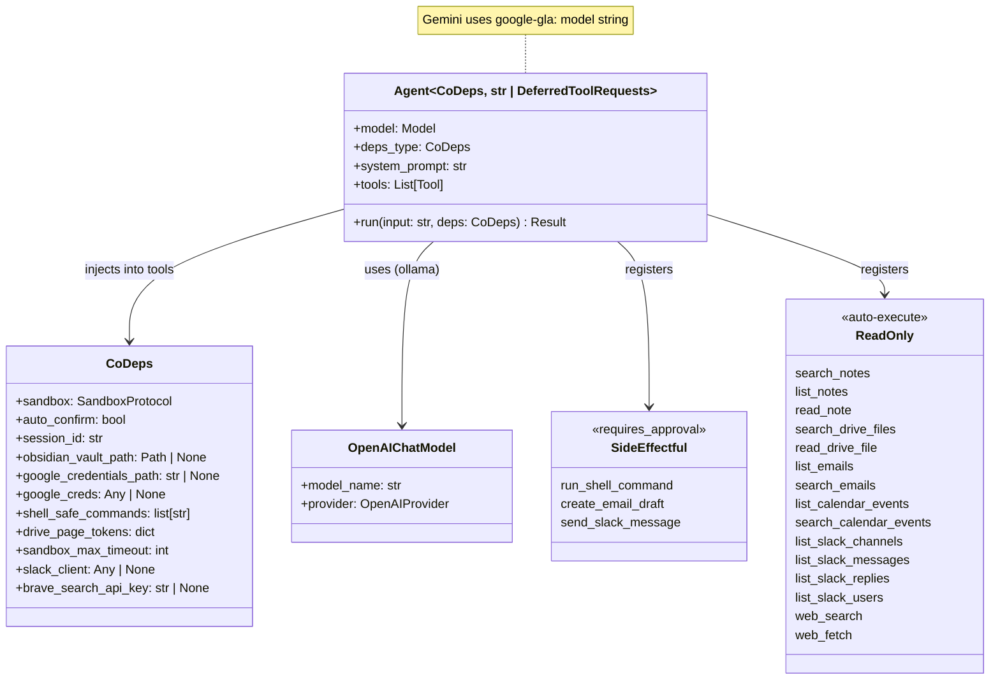

# Design: Agent & Dependencies

## 1. What & How

The agent factory (`get_agent()`) creates the pydantic-ai Agent with LLM model selection, tool registration, and system prompt. `CoDeps` is the runtime dependency dataclass injected into every tool via `RunContext[CoDeps]`. Together they form the core orchestration layer between the chat loop and tool execution.



## 2. Core Logic

### Factory Function: `get_agent()`

Returns `(agent, model_settings, tool_names)`. Selects the LLM model based on `settings.llm_provider`, registers all tools, and returns provider-specific `ModelSettings` (see [DESIGN-03-llm-models.md](DESIGN-03-llm-models.md) for model details).

```python
def get_agent(
    *,
    all_approval: bool = False,
) -> tuple[Agent[CoDeps, str | DeferredToolRequests], ModelSettings | None, list[str]]:
    provider_name = settings.llm_provider.lower()
    model_settings: ModelSettings | None = None

    if provider_name == "gemini":
        os.environ["GEMINI_API_KEY"] = settings.gemini_api_key
        model = f"google-gla:{settings.gemini_model}"
    else:
        # Ollama via OpenAI-compatible API
        provider = OpenAIProvider(base_url=f"{ollama_host}/v1", api_key="ollama")
        model = OpenAIChatModel(model_name, provider)
        model_settings = ModelSettings(temperature=0.7, top_p=1.0, max_tokens=16384)

    agent: Agent[CoDeps, str | DeferredToolRequests] = Agent(
        model,
        deps_type=CoDeps,
        system_prompt=system_prompt,
        retries=settings.tool_retries,
        output_type=[str, DeferredToolRequests],
        history_processors=[truncate_tool_returns, truncate_history_window],
    )

    # Side-effectful tools — require human approval via DeferredToolRequests
    agent.tool(run_shell_command, requires_approval=True)
    agent.tool(create_email_draft, requires_approval=True)
    agent.tool(send_slack_message, requires_approval=True)

    # Read-only tools — no approval needed (unless all_approval for eval)
    agent.tool(search_notes, requires_approval=all_approval)
    agent.tool(list_notes, requires_approval=all_approval)
    # ... remaining read-only tools
    agent.tool(web_search, requires_approval=all_approval)
    agent.tool(web_fetch, requires_approval=all_approval)

    tool_names = [fn.__name__ for fn in [run_shell_command, ..., web_fetch]]
    return agent, model_settings, tool_names
```

### Tool Registration Pattern

Tools are classified as side-effectful (requires user approval) or read-only (auto-execute):

| Category | Registration | Approval |
|----------|-------------|----------|
| Side-effectful | `agent.tool(fn, requires_approval=True)` | Chat loop prompts `[y/n/a(yolo)]` via `DeferredToolRequests` |
| Read-only | `agent.tool(fn, requires_approval=all_approval)` | None normally; `all_approval=True` forces deferred (for eval) |

**`all_approval` parameter:** When `get_agent(all_approval=True)` is called, all tools (including read-only) are registered with `requires_approval=True`. Every tool call returns `DeferredToolRequests` without executing. Used by the eval framework to extract tool name and args without triggering `ModelRetry` loops from missing credentials.

### System Prompt

```
You are Co, a CLI assistant running in the user's terminal.

### Response Style
- Be terse: users want results, not explanations
- On success: show the output, then a brief note if needed
- On error: show the error, suggest a fix

### Tool Output
- Most tools return a dict with a `display` field — show the `display` value verbatim
- Never reformat, summarize, or drop URLs from tool output
- If the result has `has_more=true`, tell the user more results are available

### Tool Usage
- Use tools proactively to complete tasks
- Chain operations: read before modifying, test after changing
- Shell commands run in a Docker sandbox mounted at /workspace

### Pagination
- When a tool result has has_more=true, more results are available
- If the user asks for "more", "next", or "next 10", call the same tool with the same query and page incremented by 1
- Do NOT say "no more results" unless you called the tool and has_more was false
```

### CoDeps: Runtime Dependency Dataclass

```python
@dataclass
class CoDeps:
    sandbox: SandboxProtocol
    auto_confirm: bool = False
    session_id: str = ""
    obsidian_vault_path: Path | None = None
    google_credentials_path: str | None = None
    google_creds: Any | None = field(default=None, repr=False)  # Cached credentials
    _google_creds_resolved: bool = field(default=False, repr=False, init=False)
    shell_safe_commands: list[str] = field(default_factory=list)
    drive_page_tokens: dict[str, list[str]] = field(default_factory=dict)
    sandbox_max_timeout: int = 600
    slack_client: Any | None = None  # slack_sdk.WebClient at runtime
    brave_search_api_key: str | None = None  # Brave Search API key for web tools
```

**Design principle:** `CoDeps` contains runtime resources, NOT config objects. `Settings` creates resources in `main.py`, then injects here.

**Dependency flow:**

```
main.py: create_deps()          →  CoDeps(sandbox, vault_path, google_credentials_path, slack_client, ...)
    ↓
_stream_agent_run(agent, user_input, deps=deps) →  Agent passes deps to tool calls
    ↓
tool(ctx: RunContext[CoDeps])    →  ctx.deps.sandbox, ctx.deps.google_creds, etc.
```

### Multi-Session State Design

pydantic-ai separates state into three tiers:

| Tier | Scope | Lifetime | Where | Example |
|------|-------|----------|-------|---------|
| **Agent config** | Process | Entire process | `Agent(...)` constructor, module constants | Model name, system prompt, tool registrations |
| **Session deps** | Session | One REPL loop (`create_deps()` → `sandbox.cleanup()`) | `RunContext.deps` (`CoDeps`) | Sandbox handle, Google creds (lazy-cached), page tokens |
| **Run state** | Single run | One `_stream_agent_run()` call | `result.state` / `ctx.state` (pydantic-graph) | Per-turn counter (if needed) |

**Critical invariant: mutable per-session state belongs in `CoDeps`, never in module globals.** Module-level variables are process-scoped — they persist across sessions and are shared by all concurrent sessions in the same process.

`CoDeps` is the session boundary. `main.py:create_deps()` instantiates one `CoDeps` per chat session. Every `_stream_agent_run()` call within that session receives the same `CoDeps` instance, so tools accumulate state (like page tokens) across turns. But two sessions get separate `CoDeps` instances with independent state.

```
Process (one Python interpreter)
├── Module globals          ← shared, immutable config only
│   ├── Agent instance
│   └── Tool registrations
│
├── Session A
│   └── CoDeps instance A   ← mutable state lives here
│       ├── sandbox A
│       ├── drive_page_tokens: {"report": ["tok1", "tok2"]}
│       └── ...
│
└── Session B
    └── CoDeps instance B   ← independent, no cross-contamination
        ├── sandbox B
        ├── drive_page_tokens: {}    ← fresh, empty
        └── ...
```

Mutable fields use `field(default_factory=...)` so each `CoDeps` gets its own empty collection. When the session ends, the `CoDeps` instance is garbage-collected along with all its accumulated state.

## 3. Config

LLM provider settings are managed in `get_agent()` and documented in [DESIGN-03-llm-models.md](DESIGN-03-llm-models.md).

| Setting | Env Var | Default | Purpose |
|---------|---------|---------|---------|
| `llm_provider` | `LLM_PROVIDER` | `"gemini"` | Provider selection (`gemini` or `ollama`) |
| `tool_retries` | `CO_CLI_TOOL_RETRIES` | `3` | Agent-level retry budget for all tools |

## 4. Files

| File | Purpose |
|------|---------|
| `co_cli/agent.py` | `get_agent()` factory — model selection, tool registration, system prompt |
| `co_cli/deps.py` | `CoDeps` dataclass — runtime dependencies injected via `RunContext` |
