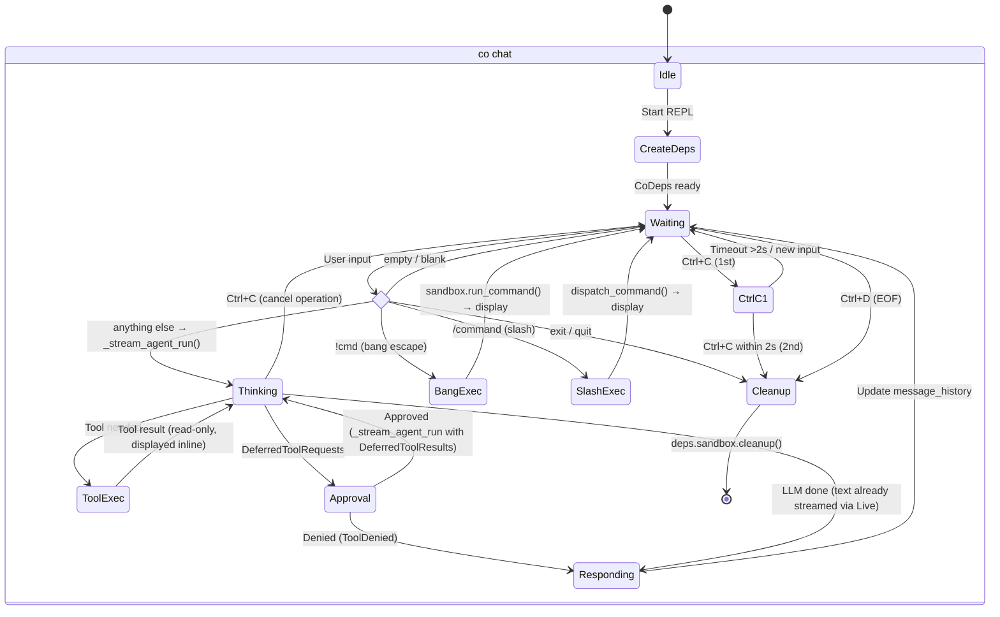
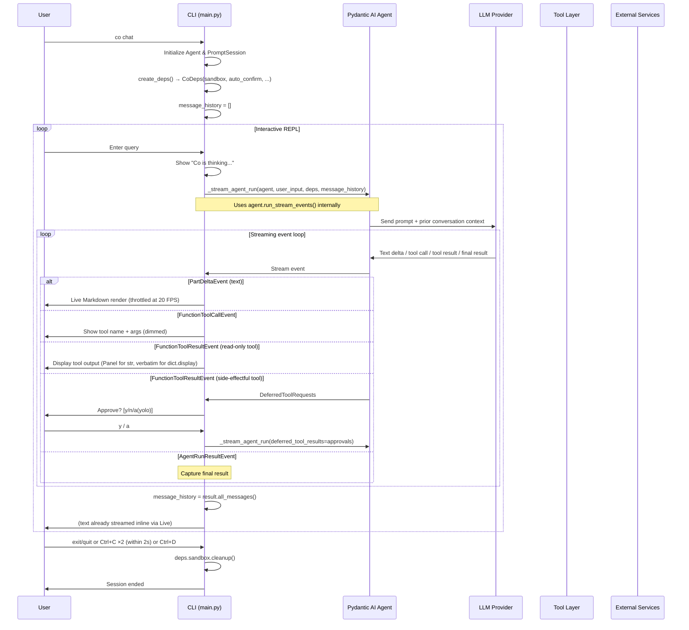
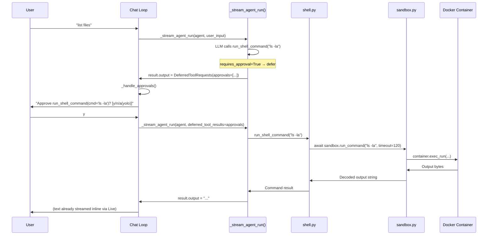

# Design: Chat Loop

## 1. What & How

The chat loop in `main.py` is the REPL orchestrator: it streams agent responses, handles deferred tool approval, dispatches slash commands, manages conversation memory, and handles interrupts. It uses `agent.run_stream_events()` for real-time output rendering via Rich `Live` + `Markdown`.



## 2. Core Logic

### Chat Session Flow



### Chat Loop Pseudocode

```
chat_loop():
    agent, model_settings, tool_names = get_agent()
    deps = create_deps()
    info = get_status(tool_count=len(tool_names))
    display_welcome_banner(info)
    message_history = []

    loop:
        result, streamed_text = _stream_agent_run(agent, user_input, deps, message_history)

        while result.output is DeferredToolRequests:   # loop — resumed run may trigger more
            result, streamed_text = _handle_approvals(agent, deps, result)  # [y/n/a] prompt

        message_history = result.all_messages()
        if not streamed_text:         # fallback — only when streaming produced no text
            display(Markdown(result.output))

    finally:
        deps.sandbox.cleanup()
```

**Why `while`, not `if`:** A resumed `_stream_agent_run()` with approved tool results may itself produce another `DeferredToolRequests` — for example, when the LLM chains two side-effectful calls (e.g. user says "cd to /workspace and ls"). Each round needs its own approval cycle.

### Deferred Approval Pattern

Side-effectful tools (`run_shell_command`, `create_email_draft`, `send_slack_message`) use pydantic-ai's `requires_approval=True` + `DeferredToolRequests` pattern. Approval lives in the chat loop, not inside tools.



**Denial flow:** When the user picks `n`, the chat loop sends `ToolDenied("User denied this action")`. The LLM sees the structured denial and can reason about it (e.g. suggest an alternative command).

**Session yolo flow:** When the user picks `a`, `deps.auto_confirm` is set to `True`. All subsequent approvals in the session are auto-approved without prompting.

### Streaming Architecture (`_stream_agent_run`)

`_stream_agent_run()` wraps `agent.run_stream_events()` and dispatches four event types inline:

- **Text deltas** — accumulated into a buffer, rendered as `rich.Markdown` inside `rich.Live` with 20 FPS throttle (`_RENDER_INTERVAL = 0.05`). Uses `auto_refresh=False` with manual `refresh()` for precise throttle control.
- **Text commit** — before any tool event, `Live` is flushed (update + refresh + stop) to prevent interleaving Markdown with tool output. Buffer and render state are reset.
- **Tool calls** — dim annotation showing tool name and arguments (shell commands show the `cmd` value).
- **Tool results** — `Panel` for shell output (string content), verbatim for structured tools (dict with `display` field).
- **Result** — captured from `AgentRunResultEvent` as the final return value.
- **Cancellation cleanup** — `finally` block calls `Live.stop()` on interrupt to restore terminal state.

**Signature:** `_stream_agent_run(agent, *, user_input, deps, message_history, model_settings, usage_limits, deferred_tool_results)` — `usage_limits` is a parameter (not read from `settings`). The `settings.max_request_limit` read happens only in `chat_loop`.

**Returns:** `(result, streamed_text)` — the caller uses `streamed_text` to skip `Markdown(result.output)` when text was already rendered during streaming.

#### Streaming API Decision

Four pydantic-ai streaming APIs were evaluated:

| API | Verdict | Reason |
|-----|---------|--------|
| `run_stream()` | **Disqualified** | Treats first output match as final — incompatible with `output_type=[str, DeferredToolRequests]` |
| `iter()` | Overkill | 3-4x more code for the same outcome |
| `run()` + `event_stream_handler` | Equivalent | Callback ergonomics split display state |
| **`run_stream_events()`** | **Selected** | Flat async iterable, works with deferred tools, inline display state |

#### Markdown Rendering

`rich.Live` + `rich.Markdown` with a fixed 50ms (20 FPS) throttle. Accumulate-and-rerender: each throttled update re-parses the full buffer as Markdown. No two-zone split (scrollback + live region) — co-cli's terse responses don't need it.

<details>
<summary>Peer analysis — streaming approaches</summary>

| System | Stack | Approach | Throttle | Two-Zone Split |
|--------|-------|----------|----------|----------------|
| **Aider** (Python) | `rich.Live` + `rich.Markdown` | Accumulate buffer, full re-render on each chunk | Adaptive: `min(max(render_time*10, 1/20), 2)` | Yes — last 6 lines in Live, rest printed to scrollback |
| **Codex** (Rust) | `pulldown_cmark` + ratatui | Newline-gated: render on `\n`, hold partial lines | Adaptive: queue depth (8 lines) or age (120ms) | Yes — committed lines + animation queue |
| **Gemini CLI** (TS) | Custom parser + Ink `<Static>` | Accumulate, split at safe Markdown boundaries | React render cycle | Yes — `<Static>` for completed, pending for streaming |
| **OpenCode** (TS) | `marked` + `morphdom` | Accumulate, DOM diff on each update | Fixed 100ms | Yes — morphdom patches only changed nodes |

</details>

### Input Dispatch

Input is dispatched in priority order — first match wins:

```
user_input
  ├─ "exit"/"quit"  → break (end session)
  ├─ empty/blank    → continue (ignore)
  ├─ "!cmd"         → sandbox.run_command(cmd) — direct shell, no LLM
  ├─ "/command"     → dispatch_command() — slash command, no LLM
  └─ anything else  → _stream_agent_run() — LLM inference with streaming
```

### Slash Commands (`_commands.py`)

Local REPL commands that bypass the LLM and execute instantly. Explicit `dict` registry, no decorators.

```python
@dataclass(frozen=True)
class CommandContext:
    message_history: list[Any]
    deps: Any          # CoDeps
    agent: Any         # Agent[CoDeps, ...]
    tool_names: list[str]

@dataclass(frozen=True)
class SlashCommand:
    name: str
    description: str
    handler: Callable[[CommandContext, str], Awaitable[list[Any] | None]]

COMMANDS: dict[str, SlashCommand] = { ... }  # explicit registry
```

**Handler return convention:** `None` → display-only command, history unchanged. `list` → new history to rebind (e.g. `/clear` returns `[]`, `/compact` returns summarized history).

| Command | Effect |
|---------|--------|
| `/help` | Print table of all commands |
| `/clear` | Empty conversation history |
| `/status` | System health check |
| `/tools` | List registered tool names |
| `/history` | Show turn/message totals |
| `/compact` | LLM-summarise history (see [DESIGN-06-conversation-memory.md](DESIGN-06-conversation-memory.md)) |
| `/yolo` | Toggle `deps.auto_confirm` |

### HTTP 400 Error Reflection

Small quantized models (e.g. glm-4.7-flash:q8_0 via Ollama) sometimes produce malformed tool-call JSON that the provider rejects with HTTP 400. pydantic-ai raises `ModelHTTPError` which is not covered by the agent's `retries` budget (that only governs `ModelRetry` inside tools).

The chat loop catches `ModelHTTPError` with `status_code == 400` and uses **reflection** rather than blind retry — aligned with the converged pattern from Codex, Aider, Gemini-CLI, and OpenCode (all classify 400 as non-retryable; recovery uses error feedback to the model):

1. Catch `ModelHTTPError` where `status_code == 400`
2. Inject a `ModelRequest` with `UserPromptPart` containing the error body into conversation history
3. Re-run `_stream_agent_run()` with `user_input=None` so the model sees the error and self-corrects
4. Cap at `settings.model_http_retries` attempts (default 2), then re-raise to the outer handler

Non-400 HTTP errors (429, 5xx) are not caught here — they propagate to the generic `except Exception` handler.

### Interrupt Handling

#### Dangling Tool Call Patching

When Ctrl+C fires during `_stream_agent_run()`, the LLM may have been mid-tool-call. `_patch_dangling_tool_calls()` scans the last message in history — if it's a `ModelResponse` with `ToolCallPart`s but no matching `ToolReturnPart`, the function appends a synthetic `ModelRequest` with `ToolReturnPart`(s) carrying an "Interrupted by user." error message.

```python
def _patch_dangling_tool_calls(messages, error_message="Interrupted by user."):
    last_msg = messages[-1]
    if last_msg.kind != "response":
        return messages
    tool_calls = [p for p in last_msg.parts if isinstance(p, ToolCallPart)]
    if not tool_calls:
        return messages
    return_parts = [
        ToolReturnPart(tool_name=tc.tool_name, tool_call_id=tc.tool_call_id, content=error_message)
        for tc in tool_calls
    ]
    return messages + [ModelRequest(parts=return_parts)]
```

#### Signal Handling (asyncio SIGINT)

Python 3.11+ `asyncio.run()` delivers `asyncio.CancelledError` instead of `KeyboardInterrupt` in async code. Two problems and their solutions:

**Problem 1 — Async code:** SIGINT delivers `CancelledError`, not `KeyboardInterrupt`.
**Solution:** Catch both: `except (KeyboardInterrupt, asyncio.CancelledError)`

**Problem 2 — Synchronous approval prompt:** `Prompt.ask()` → `input()` is synchronous; `CancelledError` cannot be injected into C-level `input()`.
**Solution:** Temporarily restore Python's default SIGINT handler during approval, then restore asyncio's handler:

```python
async def _handle_approvals(agent, deps, result, model_settings):
    prev_handler = signal.getsignal(signal.SIGINT)
    signal.signal(signal.SIGINT, signal.default_int_handler)
    try:
        for call in result.output.approvals:
            ...  # Prompt.ask() — Ctrl-C raises KeyboardInterrupt normally
    finally:
        signal.signal(signal.SIGINT, prev_handler)
```

**Interrupt points:**

| Phase | Code style | SIGINT delivers | Caught by |
|-------|-----------|-----------------|-----------|
| `_stream_agent_run()` | async | `CancelledError` | Inner `except (KeyboardInterrupt, CancelledError)` |
| Approval `Prompt.ask()` | sync (handler swapped) | `KeyboardInterrupt` | Same inner except block |
| `session.prompt_async()` | async (prompt_toolkit) | `CancelledError` | Outer except (double-tap logic) |
| After task cancellation | `asyncio.run()` top-level | `KeyboardInterrupt` | Safety-net in `chat()` |

#### Exit Handling (double Ctrl+C)

| Context | Action | Result |
|---------|--------|--------|
| During `_stream_agent_run()` | Ctrl+C | Cancels operation, patches dangling tool calls, returns to prompt |
| During approval prompt | Ctrl+C | Cancels approval, returns to prompt |
| At prompt | Ctrl+C (1st) | Prints "Press Ctrl+C again to exit" |
| At prompt | Ctrl+C (2nd within 2s) | Exits session |
| At prompt | Ctrl+C (2nd after 2s) | Treated as new 1st press (timeout reset) |
| Anywhere | Ctrl+D (EOF) | Exits immediately |

### Conversation Memory Integration

Each turn's full message history is accumulated via `result.all_messages()` and passed to the next `_stream_agent_run()` call. Two history processors run automatically before each model request — see [DESIGN-06-conversation-memory.md](DESIGN-06-conversation-memory.md) for details.

### REPL Features

| Feature | Implementation |
|---------|---------------|
| History | Saved to `~/.local/share/co-cli/history.txt` |
| Spinner | "Co is thinking..." shown before streaming starts |
| Streaming | Text rendered incrementally via Rich `Live` + `Markdown` (~20 FPS throttle) |
| Fallback | If streaming produced no text, final `result.output` rendered as Rich `Markdown` |
| Tab completion | `WordCompleter` with `complete_while_typing=False` for `/command` names |

### CLI Commands

| Command | Description | Implementation |
|---------|-------------|----------------|
| `co chat` | Interactive REPL | `asyncio.run(chat_loop())` |
| `co status` | System health check | Displays Rich table |
| `co tail` | Real-time span viewer | Polls SQLite, prints with Rich |
| `co logs` | Telemetry dashboard | Launches Datasette |
| `co traces` | Visual span tree (HTML) | Generates static HTML |

## 3. Config

| Setting | Env Var | Default | Purpose |
|---------|---------|---------|---------|
| `max_request_limit` | `CO_CLI_MAX_REQUEST_LIMIT` | `25` | Caps LLM round-trips per user turn (loop guard) |
| `model_http_retries` | `CO_CLI_MODEL_HTTP_RETRIES` | `2` | Max reflection attempts when model produces malformed tool-call JSON (HTTP 400) |

## 4. Files

| File | Purpose |
|------|---------|
| `co_cli/main.py` | CLI entry point, chat loop, `_stream_agent_run()`, `_handle_approvals()`, OTel setup |
| `co_cli/_commands.py` | Slash command registry, handlers, and `dispatch()` for the REPL |
| `co_cli/_approval.py` | Shell safe-command classification (`_is_safe_command`) |

## References

- [pydantic-ai Agents docs — streaming APIs](https://ai.pydantic.dev/agent/)
- [pydantic-ai Deferred tools docs](https://ai.pydantic.dev/deferred-tools/)
