# Design: Chat Loop

## 1. What & How

The chat loop in `main.py` is the REPL orchestrator: it dispatches slash commands, manages conversation memory, and handles interrupts. The LLM turn — streaming, approval chaining, and provider error handling — is delegated to `run_turn()` in `_orchestrate.py`, which communicates with the terminal through the `FrontendProtocol` abstraction. `TerminalFrontend` in `display.py` implements that protocol using Rich `Live` + `Markdown`.

```mermaid
stateDiagram-v2
    [*] --> Idle

    state "co chat" as Chat {
        Idle --> CreateDeps: Start REPL
        CreateDeps --> Waiting: CoDeps ready

        state Dispatch <<choice>>
        Waiting --> Dispatch: User input

        Dispatch --> Cleanup: exit / quit
        Dispatch --> Waiting: empty / blank
        Dispatch --> BangExec: !cmd (bang escape)
        Dispatch --> SlashExec: /command (slash)
        Dispatch --> Thinking: anything else → run_turn()

        BangExec --> Waiting: sandbox.run_command() → display
        SlashExec --> Waiting: dispatch_command() → display

        Thinking --> ToolExec: Tool needed
        ToolExec --> Thinking: Tool result (read-only, displayed inline)
        Thinking --> Approval: DeferredToolRequests
        Approval --> Thinking: Approved (_stream_events with DeferredToolResults)
        Approval --> Responding: Denied (ToolDenied)
        Thinking --> Responding: LLM done (text already streamed via Live)
        Responding --> Waiting: Update message_history
        Thinking --> Waiting: Ctrl+C (cancel operation)

        Waiting --> CtrlC1: Ctrl+C (1st)
        CtrlC1 --> Cleanup: Ctrl+C within 2s (2nd)
        CtrlC1 --> Waiting: Timeout >2s / new input
        Waiting --> Cleanup: Ctrl+D (EOF)
        Cleanup --> [*]: deps.sandbox.cleanup()
    }
```



## 2. Core Logic

### Chat Session Flow


### Chat Loop Pseudocode

```
chat_loop():
    agent, model_settings, tool_names = get_agent(web_policy=settings.web_policy)
    deps = create_deps()
    frontend = TerminalFrontend()
    message_history = []

    loop:
        frontend.on_status("Co is thinking...")
        turn_result = run_turn(agent, user_input, deps, message_history,
                               model_settings, frontend=frontend,
                               max_request_limit, http_retries, verbose)
        message_history = turn_result.messages

    finally:
        deps.sandbox.cleanup()
```

The full orchestration state machine (streaming, approval chaining, provider error handling, interrupt patching) lives in `run_turn()`. See the Orchestration section below.

**Why `while`, not `if` (inside run_turn):** A resumed `_stream_events()` with approved tool results may itself produce another `DeferredToolRequests` — for example, when the LLM chains two side-effectful calls (e.g. user says "cd to /workspace and ls"). Each round needs its own approval cycle.

### Per-Turn Budget Accounting

A single `UsageLimits(request_limit=settings.max_request_limit)` is created **once** before the retry/reflection loop and shared across the initial `_stream_events()` call, every deferred-approval resume, and HTTP 400 reflection retries. After each hop, `result.usage()` is passed as the `usage` parameter to the next call — pydantic-ai accumulates internally and checks the cumulative total against the same `UsageLimits`. This prevents a turn with N approval hops from getting N × budget instead of one shared budget.

### Deferred Approval Pattern

Side-effectful tools (`run_shell_command`, `create_email_draft`, `send_slack_message`) use pydantic-ai's `requires_approval=True` + `DeferredToolRequests` pattern. Approval lives in the chat loop, not inside tools.


**Denial flow:** When the user picks `n`, the chat loop sends `ToolDenied("User denied this action")`. The LLM sees the structured denial and can reason about it (e.g. suggest an alternative command).

**Session yolo flow:** When the user picks `a`, `deps.auto_confirm` is set to `True`. All subsequent approvals in the session are auto-approved without prompting.

### Orchestration (`_orchestrate.py`)

The orchestration state machine is extracted from `main.py` into `_orchestrate.py` for testability. It contains:

- **`FrontendProtocol`** — `@runtime_checkable` protocol defining display + interaction callbacks. Implementations: `TerminalFrontend` (Rich/prompt-toolkit, in `display.py`), `RecordingFrontend` (tests).
- **`TurnResult`** — dataclass returned by `run_turn()`: `messages`, `output`, `usage`, `interrupted`, `streamed_text`.
- **`run_turn()`** — async orchestration entry point. Contains the inner retry loop (HTTP 400 reflection, 429/5xx backoff), approval chaining, and interrupt patching. Delegates all display to the frontend.
- **`_stream_events()`** — wraps `agent.run_stream_events()`, dispatches events to frontend callbacks.
- **`_handle_approvals()`** — iterates `DeferredToolRequests`, applies auto-confirm + safe-command logic, delegates interactive prompts to `frontend.prompt_approval()`.
- **`_patch_dangling_tool_calls()`** — moved verbatim from `main.py`.

### FrontendProtocol

| Method | Purpose |
|--------|---------|
| `on_text_delta(accumulated)` | Incremental Markdown render |
| `on_text_commit(final)` | Final render + tear down Live |
| `on_thinking_delta(accumulated)` | Thinking panel (verbose) |
| `on_thinking_commit(final)` | Final thinking panel |
| `on_tool_call(name, args_display)` | Dim annotation |
| `on_tool_result(title, content)` | Panel for result |
| `on_status(message)` | Status messages |
| `on_final_output(text)` | Fallback Markdown render |
| `prompt_approval(description) → str` | y/n/a prompt |
| `cleanup()` | Exception teardown |

### Streaming Architecture (`_stream_events`)

`_stream_events()` wraps `agent.run_stream_events()` and dispatches event types to frontend callbacks:

- **Text deltas** — accumulated into a buffer, `frontend.on_text_delta()` called at 20 FPS throttle (`_RENDER_INTERVAL = 0.05`).
- **Text commit** — before any tool event, `frontend.on_text_commit()` flushes the buffer to prevent interleaving Markdown with tool output.
- **Tool calls** — `frontend.on_tool_call()` with tool name and arguments (shell commands show the `cmd` value).
- **Tool results** — `frontend.on_tool_result()` with title and content.
- **Result** — captured from `AgentRunResultEvent` as the final return value.
- **Cancellation cleanup** — `finally` block calls `frontend.cleanup()` on interrupt.

**Returns:** `(result, streamed_text)` — `run_turn()` uses `streamed_text` to call `frontend.on_final_output()` when streaming produced no text.

#### Streaming API Decision

Four pydantic-ai streaming APIs were evaluated:

| API | Verdict | Reason |
|-----|---------|--------|
| `run_stream()` | **Disqualified** | Treats first output match as final — incompatible with `output_type=[str, DeferredToolRequests]` |
| `iter()` | Overkill | 3-4x more code for the same outcome |
| `run()` + `event_stream_handler` | Equivalent | Callback ergonomics split display state |
| **`run_stream_events()`** | **Selected** | Flat async iterable, works with deferred tools, inline display state |

#### Markdown Rendering

`rich.Live` + `rich.Markdown` with a fixed 50ms (20 FPS) throttle. Accumulate-and-rerender: each throttled update re-parses the full buffer as Markdown. No two-zone split (scrollback + live region) — co-cli's terse responses don't need it.

#### Peer Analysis — Streaming Approaches

| System | Stack | Approach | Throttle | Two-Zone Split |
|--------|-------|----------|----------|----------------|
| **Aider** (Python) | `rich.Live` + `rich.Markdown` | Accumulate buffer, full re-render on each chunk | Adaptive: `min(max(render_time*10, 1/20), 2)` | Yes — last 6 lines in Live, rest printed to scrollback |
| **Codex** (Rust) | `pulldown_cmark` + ratatui | Newline-gated: render on `\n`, hold partial lines | Adaptive: queue depth (8 lines) or age (120ms) | Yes — committed lines + animation queue |
| **Gemini CLI** (TS) | Custom parser + Ink `<Static>` | Accumulate, split at safe Markdown boundaries | React render cycle | Yes — `<Static>` for completed, pending for streaming |
| **OpenCode** (TS) | `marked` + `morphdom` | Accumulate, DOM diff on each update | Fixed 100ms | Yes — morphdom patches only changed nodes |

### Thinking Display (`--verbose`)

The streaming loop handles `ThinkingPartDelta` events from pydantic-ai. Gated behind `--verbose` / `-v` on `co chat`:

- **Verbose mode:** Thinking deltas accumulate into `thinking_buffer`, rendered progressively in a `Panel(border_style="thinking")` via a second `Live` instance (same 20 FPS throttle). When the first `TextPartDelta` or tool event arrives, the thinking panel is flushed (final render + stop) and the loop transitions to normal text/tool handling.
- **Default mode:** `ThinkingPartDelta` events are discarded (`continue`). The "Co is thinking..." status line provides awareness without content noise.

Pseudocode for the thinking→text transition:

```
if event is ThinkingPartDelta:
    if not verbose: continue
    thinking_buffer += delta
    render thinking_live Panel every 50ms

if event is TextPartDelta or ToolCallEvent or ToolResultEvent:
    if thinking_live or thinking_buffer:
        flush thinking_live (final render + stop)
        reset thinking_buffer
    # proceed with existing text/tool handling
```

The `thinking` semantic style (`dim italic` in both themes) is defined in `display.py`.

### Input Dispatch

Input is dispatched in priority order — first match wins:

```
user_input
  ├─ "exit"/"quit"  → break (end session)
  ├─ empty/blank    → continue (ignore)
  ├─ "!cmd"         → sandbox.run_command(cmd) — direct shell, no LLM
  ├─ "/command"     → dispatch_command() — slash command, no LLM
  └─ anything else  → run_turn() — LLM inference with streaming
```

### Slash Commands (`_commands.py`)

Local REPL commands that bypass the LLM and execute instantly. Explicit `dict` registry, no decorators.

```python
@dataclass(frozen=True)
class CommandContext:
    message_history: list[Any]
    deps: Any          # CoDeps
    agent: Any         # Agent[CoDeps, ...]
    tool_names: list[str]

@dataclass(frozen=True)
class SlashCommand:
    name: str
    description: str
    handler: Callable[[CommandContext, str], Awaitable[list[Any] | None]]

COMMANDS: dict[str, SlashCommand] = { ... }  # explicit registry
```

**Handler return convention:** `None` → display-only command, history unchanged. `list` → new history to rebind (e.g. `/clear` returns `[]`, `/compact` returns summarized history).

| Command | Effect |
|---------|--------|
| `/help` | Print table of all commands |
| `/clear` | Empty conversation history |
| `/status` | System health check |
| `/tools` | List registered tool names |
| `/history` | Show turn/message totals |
| `/compact` | LLM-summarise history (see [DESIGN-06-conversation-memory.md](DESIGN-06-conversation-memory.md)) |
| `/yolo` | Toggle `deps.auto_confirm` |
| `/model` | Show/switch current model (Ollama only) |

### Provider Error Handling

Provider errors are classified in `_provider_errors.py` via `classify_provider_error()` and dispatched by `run_turn()`:

| Status | Action | Behavior |
|--------|--------|----------|
| 400 | `REFLECT` | Inject error body into history, re-run so model self-corrects |
| 401, 403 | `ABORT` | Print error, end turn |
| 404 | `ABORT` | Model not found, end turn |
| 429 | `BACKOFF_RETRY` | Parse `Retry-After` (default 3s), exponential backoff, retry |
| 5xx | `BACKOFF_RETRY` | Wait 2s base, exponential backoff, retry |
| Network/timeout | `BACKOFF_RETRY` | Wait 2s base, exponential backoff, retry |

All retries are capped at `settings.model_http_retries` (default 2). Backoff delay is capped at 30s. The HTTP 400 **reflection** pattern (inject error, re-run) is aligned with the converged approach from Codex, Aider, Gemini-CLI, and OpenCode.

### Tool Error Classification

Tool errors are classified in `tools/_errors.py` via `classify_google_error()` and `handle_tool_error()`:

| Kind | Behavior | Example |
|------|----------|---------|
| `TERMINAL` | Return `{"display": ..., "error": True}` — model sees error, picks alternative | Auth failure, API not enabled |
| `TRANSIENT` | Raise `ModelRetry` — model retries the call | Rate limit (429), server error (5xx) |
| `MISUSE` | Raise `ModelRetry` with hint — model corrects parameters | Bad resource ID (404) |

Google and Slack tools dispatch through this shared classification. Slack has a local `_classify_slack_error()` that maps Slack-specific error codes to `ToolErrorKind`. Shell uses tool-local `RuntimeError` → `ModelRetry` mapping in `tools/shell.py`.

### Interrupt Handling

#### Dangling Tool Call Patching

When Ctrl+C fires during `_stream_events()`, the LLM may have been mid-tool-call. `_patch_dangling_tool_calls()` (in `_orchestrate.py`) scans the last message in history — if it's a `ModelResponse` with `ToolCallPart`s but no matching `ToolReturnPart`, the function appends a synthetic `ModelRequest` with `ToolReturnPart`(s) carrying an "Interrupted by user." error message.

```python
def _patch_dangling_tool_calls(messages, error_message="Interrupted by user."):
    last_msg = messages[-1]
    if last_msg.kind != "response":
        return messages
    tool_calls = [p for p in last_msg.parts if isinstance(p, ToolCallPart)]
    if not tool_calls:
        return messages
    return_parts = [
        ToolReturnPart(tool_name=tc.tool_name, tool_call_id=tc.tool_call_id, content=error_message)
        for tc in tool_calls
    ]
    return messages + [ModelRequest(parts=return_parts)]
```

#### Signal Handling (asyncio SIGINT)

Python 3.11+ `asyncio.run()` delivers `asyncio.CancelledError` instead of `KeyboardInterrupt` in async code. Two problems and their solutions:

**Problem 1 — Async code:** SIGINT delivers `CancelledError`, not `KeyboardInterrupt`.
**Solution:** Catch both: `except (KeyboardInterrupt, asyncio.CancelledError)`

**Problem 2 — Synchronous approval prompt:** `Prompt.ask()` → `input()` is synchronous; `CancelledError` cannot be injected into C-level `input()`.
**Solution:** `TerminalFrontend.prompt_approval()` temporarily restores Python's default SIGINT handler during the synchronous `Prompt.ask()` call, then restores asyncio's handler in `finally`.

**Interrupt points:**

| Phase | Code style | SIGINT delivers | Caught by |
|-------|-----------|-----------------|-----------|
| `_stream_events()` | async | `CancelledError` | `run_turn()` except block |
| Approval `prompt_approval()` | sync (handler swapped) | `KeyboardInterrupt` | `run_turn()` except block |
| `session.prompt_async()` | async (prompt_toolkit) | `CancelledError` | Outer except (double-tap logic) |
| After task cancellation | `asyncio.run()` top-level | `KeyboardInterrupt` | Safety-net in `chat()` |

#### Exit Handling (double Ctrl+C)

| Context | Action | Result |
|---------|--------|--------|
| During `run_turn()` | Ctrl+C | Cancels operation, patches dangling tool calls, returns to prompt |
| During approval prompt | Ctrl+C | Cancels approval, returns to prompt |
| At prompt | Ctrl+C (1st) | Prints "Press Ctrl+C again to exit" |
| At prompt | Ctrl+C (2nd within 2s) | Exits session |
| At prompt | Ctrl+C (2nd after 2s) | Treated as new 1st press (timeout reset) |
| Anywhere | Ctrl+D (EOF) | Exits immediately |

### Conversation Memory Integration

Each turn's full message history is accumulated via `turn_result.messages` and passed to the next `run_turn()` call. Two history processors run automatically before each model request — see [DESIGN-06-conversation-memory.md](DESIGN-06-conversation-memory.md) for details.

### REPL Features

| Feature | Implementation |
|---------|---------------|
| History | Saved to `~/.local/share/co-cli/history.txt` |
| Spinner | "Co is thinking..." shown before streaming starts |
| Streaming | Text rendered incrementally via Rich `Live` + `Markdown` (~20 FPS throttle) |
| Fallback | If streaming produced no text, final `result.output` rendered as Rich `Markdown` |
| Tab completion | `WordCompleter` with `complete_while_typing=False` for `/command` names |

### CLI Commands

| Command | Description | Implementation |
|---------|-------------|----------------|
| `co chat` | Interactive REPL (`--verbose` streams thinking tokens) | `asyncio.run(chat_loop())` |
| `co status` | System health check | Displays Rich table |
| `co tail` | Real-time span viewer | Polls SQLite, prints with Rich |
| `co logs` | Telemetry dashboard | Launches Datasette |
| `co traces` | Visual span tree (HTML) | Generates static HTML |

## 3. Config

| Setting | Env Var | Default | Purpose |
|---------|---------|---------|---------|
| `max_request_limit` | `CO_CLI_MAX_REQUEST_LIMIT` | `25` | Caps LLM round-trips per user turn (loop guard) |
| `model_http_retries` | `CO_CLI_MODEL_HTTP_RETRIES` | `2` | Max provider error retries per turn (400 reflection, 429/5xx backoff, network) |

## 4. Files

| File | Purpose |
|------|---------|
| `co_cli/main.py` | CLI entry point, chat loop, OTel setup |
| `co_cli/_orchestrate.py` | `FrontendProtocol`, `TurnResult`, `run_turn()`, `_stream_events()`, `_handle_approvals()`, `_patch_dangling_tool_calls()` |
| `co_cli/_provider_errors.py` | `ProviderErrorAction`, `classify_provider_error()`, `_parse_retry_after()` |
| `co_cli/display.py` | Themed Rich Console, semantic styles, `TerminalFrontend` |
| `co_cli/tools/_errors.py` | `ToolErrorKind`, `classify_google_error()`, `handle_tool_error()`, `terminal_error()` |
| `co_cli/_commands.py` | Slash command registry, handlers, and `dispatch()` for the REPL |
| `co_cli/_approval.py` | Shell safe-command classification (`_is_safe_command`) |

## References

- [pydantic-ai Agents docs — streaming APIs](https://ai.pydantic.dev/agent/)
- [pydantic-ai Deferred tools docs](https://ai.pydantic.dev/deferred-tools/)
