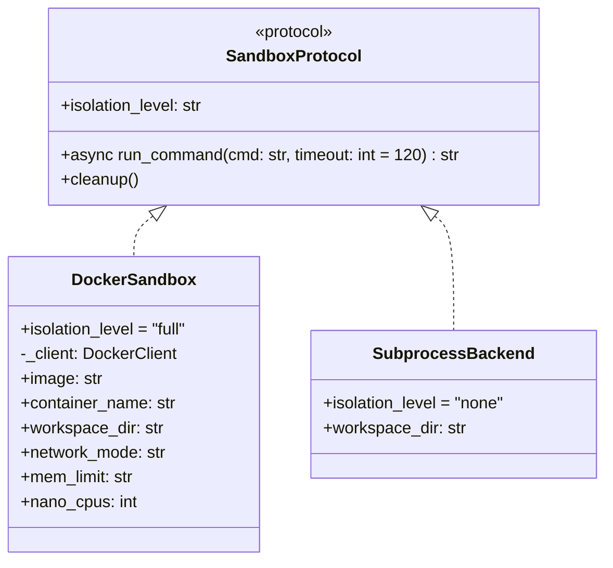

# Design: Shell Tool & Sandbox

**Synced:** v0.3.4

## 1. What & How

The shell tool executes user commands in an isolated execution environment, protecting the host system while maintaining access to the user's working directory. Uses a protocol-based backend architecture — Docker provides full isolation (primary), with a subprocess fallback for environments without Docker. The tool and its callers are backend-agnostic via `SandboxProtocol`.

```
┌─────────────────────────────────────────────────────────────────┐
│                         Co CLI                                   │
│                                                                  │
│  User: "list files"                                             │
│         │                                                        │
│         ▼                                                        │
│  ┌─────────────────┐                                            │
│  │   Agent.run()   │                                            │
│  │   deps=CoDeps   │                                            │
│  └────────┬────────┘                                            │
│           │ tool call: run_shell_command(cmd="ls -la")          │
│           ▼                                                      │
│  ┌─────────────────────────────────────────────────────────┐    │
│  │              run_shell_command()                         │    │
│  │  1. Deferred approval (chat loop, not tool)             │    │
│  │  2. Delegate to sandbox                                  │    │
│  └────────┬────────────────────────────────────────────────┘    │
└───────────┼──────────────────────────────────────────────────────┘
            │
            ▼
┌─────────────────────────────────────────────────────────────────┐
│                      Docker Container                            │
│  ┌─────────────────────────────────────────────────────────┐    │
│  │  /workspace  ◀──── bind mount ────▶  Host $(pwd)        │    │
│  └─────────────────────────────────────────────────────────┘    │
└─────────────────────────────────────────────────────────────────┘
```

## 2. Core Logic

### Shell Tool

The tool delegates to the sandbox and raises `ModelRetry` on errors so the LLM can self-correct. Confirmation is NOT a tool responsibility — it is registered with `requires_approval=True` and the chat loop handles the `[y/n/a(yolo)]` prompt via `DeferredToolRequests`.

```python
async def run_shell_command(ctx: RunContext[CoDeps], cmd: str, timeout: int = 120) -> str:
    effective = min(timeout, ctx.deps.sandbox_max_timeout)
    try:
        return await ctx.deps.sandbox.run_command(cmd, timeout=effective)
    except Exception as e:
        raise ModelRetry(f"Command failed ({e})")
```

### Safe-Prefix Auto-Approval

Shell commands matching a configurable safe-prefix list are auto-approved silently, skipping the `[y/n/a]` prompt. Only active when `isolation_level != "none"` — subprocess fallback requires approval for all commands. This is a UX convenience, not a security boundary — the sandbox is the security layer.

```python
def _is_safe_command(cmd: str, safe_commands: list[str]) -> bool:
    # Reject shell chaining, redirection, and backgrounding
    if any(op in cmd for op in [";", "&", "|", ">", "<", "`", "$(", "\n"]):
        return False
    for prefix in sorted(safe_commands, key=len, reverse=True):
        if cmd == prefix or cmd.startswith(prefix + " "):
            return True
    return False
```

### Sandbox Protocol & Backends



| Level | Backend | Safe-prefix auto-approve | Approval prompt |
|-------|---------|-------------------------|-----------------|
| `"full"` | Docker | Yes | `[y/n/a]` |
| `"none"` | Subprocess | No — all commands require approval | `[y/n/a]` |

### Docker Backend

**Container lifecycle:** Lazy creation on first tool call, reuse across session, cleanup on exit.

```
Container States:
  (none) → first command → ensure_container() → Container Ready
    ├── Command 1, 2, ... N (all reuse same container)
    └── Session End → cleanup() → stop() + remove()
```

**Container hardening:**

| Parameter | Value | Purpose |
|-----------|-------|---------|
| `name` | `co-runner-{session_id[:8]}` | Session-scoped, avoids collisions |
| `image` | `co-cli-sandbox` | Custom image with dev tools |
| `user` | `1000:1000` | Non-root execution |
| `network_mode` | `none` (configurable) | No network by default |
| `mem_limit` | `1g` (configurable) | OOM-kill at 1 GB |
| `nano_cpus` | `1_000_000_000` (configurable) | 1 CPU core |
| `pids_limit` | `256` | Fork bomb prevention |
| `cap_drop` | `["ALL"]` | Drop all Linux capabilities |
| `security_opt` | `["no-new-privileges"]` | Prevent setuid/setgid escalation |

**Command execution:** Commands are wrapped in `timeout N sh -c '{cmd}'` inside the container, with `asyncio.wait_for(..., timeout=N+5)` as a Python-side safety net. Both layers run in parallel — the in-container kill fires first under normal conditions.

**Timeout: LLM-controlled, three layers:**

| Layer | Controls | Default |
|-------|----------|---------|
| Tool parameter (`timeout`) | LLM chooses per call, visible in tool schema | 120s |
| Hard ceiling (`sandbox_max_timeout`) | Settings-level cap, LLM cannot exceed | 600s |
| System prompt | Instructs LLM to set appropriate timeouts | N/A |

**stdout/stderr:** Merged (`2>&1`) — the LLM doesn't need to distinguish. `PYTHONUNBUFFERED=1` ensures partial output is captured on timeout.

### Subprocess Backend

Fallback when Docker is unavailable. Uses `restricted_env()` (strips dangerous env vars like `MANPAGER`, `LD_PRELOAD`, forces `PAGER=cat`) and `kill_process_tree()` (SIGTERM → 200ms → SIGKILL via `os.killpg()`).

### Security Model

```
┌─────────────────────────────────────────────────────────────────┐
│                        HOST SYSTEM                               │
│  PROTECTED: ~/.ssh/, ~/.config/, /etc/, Docker socket            │
│  EXPOSED (read-write): Current working directory only            │
└─────────────────────────────────────────────────────────────────┘
                              │ bind mount (rw)
                              ▼
┌─────────────────────────────────────────────────────────────────┐
│                      CONTAINER                                   │
│  /workspace/ ◀── Only this is accessible                        │
│  Hardening: Non-root, no network, mem/cpu/pid limits,           │
│             cap_drop=ALL, no-new-privileges                      │
└─────────────────────────────────────────────────────────────────┘
```

### Output Control

Shell output reaches the user through two paths:

| Path | Trigger | Approval | LLM Involved |
|------|---------|----------|--------------|
| Agent-mediated | Natural language prompt | `[y/n/a]` via `DeferredToolRequests` | Yes |
| Direct (`!`) | `!cmd` prefix in REPL | None (user typed it) | No |

Both display raw output in a Rich `Panel` with `border_style="shell"`.

### Error Scenarios

| Scenario | Detection | Handling |
|----------|-----------|----------|
| Docker not running | `docker.from_env()` fails | `RuntimeError` |
| Command fails | Non-zero exit code | `RuntimeError` with exit code + output |
| Command timeout | Exit code 124 or `asyncio.TimeoutError` | `RuntimeError` with partial output |
| Stale container | Found but stopped | Auto-restart via `container.start()` |

<details>
<summary>Cross-system research (Feb 2026)</summary>

**Sandbox isolation comparison:**

| System | Sandbox | FS isolation | Network | Env sanitization |
|--------|---------|-------------|---------|-----------------|
| **Codex CLI** | bwrap (Linux), Seatbelt (macOS) | Read-only root + writable workspace | Seccomp denies socket/connect | Clean sandbox env |
| **Gemini CLI** | Docker/Podman, Seatbelt (macOS) | Container with RW workspace | Container network isolation | `sanitizeEnvironment()` |
| **Co CLI** | Docker, subprocess fallback | RW workspace bind | `network_mode="none"` | Clean container env / `restricted_env()` |

**No-sandbox comparison:**

| System | Command analysis | Pattern learning |
|--------|-----------------|-----------------|
| **OpenCode** | Tree-sitter bash AST | Arity-based: 137 prefixes |
| **Gemini CLI** | Tree-sitter bash AST | Root command prefix saved |
| **Claude Code** | Hook-based (`PreToolUse`) | User-configured rules |
| **Co CLI** | Prefix match + chaining rejection | None |

</details>

## 3. Config

| Setting | Env Var | Default | Description |
|---------|--------|---------|-------------|
| `docker_image` | `CO_CLI_DOCKER_IMAGE` | `co-cli-sandbox` | Container image |
| `auto_confirm` | `CO_CLI_AUTO_CONFIRM` | `false` | Skip prompts |
| `shell_safe_commands` | `CO_CLI_SHELL_SAFE_COMMANDS` | `["ls", "cat", ...]` | Auto-approved prefixes (comma-separated env) |
| `sandbox_backend` | `CO_CLI_SANDBOX_BACKEND` | `"auto"` | `"auto"` / `"docker"` / `"subprocess"` |
| `sandbox_max_timeout` | `CO_CLI_SANDBOX_MAX_TIMEOUT` | `600` | Hard ceiling for per-command timeout (seconds) |
| `sandbox_network` | `CO_CLI_SANDBOX_NETWORK` | `"none"` | Container network mode |
| `sandbox_mem_limit` | `CO_CLI_SANDBOX_MEM_LIMIT` | `"1g"` | Container memory limit |
| `sandbox_cpus` | `CO_CLI_SANDBOX_CPUS` | `1` | Container CPU cores |

## 4. Files

| File | Purpose |
|------|---------|
| `co_cli/tools/shell.py` | Tool function — delegates to sandbox, `ModelRetry` on error |
| `co_cli/sandbox.py` | Sandbox protocol + Docker backend + subprocess backend |
| `co_cli/_approval.py` | Safe-command classification for auto-approval |
| `co_cli/_sandbox_env.py` | `restricted_env()` and `kill_process_tree()` for subprocess backend |
| `co_cli/deps.py` | CoDeps — holds sandbox instance and `sandbox_max_timeout` |
| `co_cli/config.py` | Sandbox settings |
| `Dockerfile.sandbox` | Custom image build (python:3.12-slim + dev tools) |
