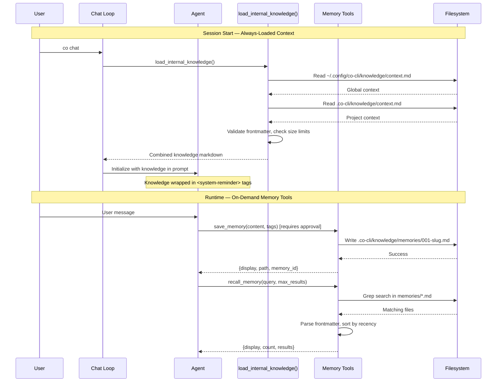

# Design: Knowledge System

## 1. What & How

The Knowledge System provides persistent memory and context across Co sessions using markdown files with YAML frontmatter. It supports two mechanisms:

1. **Always-loaded context** — Static knowledge files injected into system prompt at session start (constant per session, not selective, not subject to DESIGN-07 history management)
2. **On-demand memories** — Searchable memories retrieved via agent tools and returned as tool messages (selective, part of message history, subject to DESIGN-07 trimming)

**File Structure:**
- Global context: `~/.config/co-cli/knowledge/context.md` (3 KiB budget)
- Project context: `.co-cli/knowledge/context.md` (7 KiB budget, overrides global)
- Memories: `.co-cli/knowledge/memories/*.md` (agent-searchable via grep+frontmatter)

**Design principle:** Start with grep-based search (MVP <200 memories), evolve to SQLite FTS5 for scale, eventual hybrid search with vectors.



## 2. Core Logic

### Knowledge Loading Flow (Session Start)

**`load_internal_knowledge() → str | None`** (sync, file I/O)

Called once per session from `co_cli/prompts/__init__.py:get_system_prompt()`. Loads and combines context files:

```
function load_internal_knowledge():
    sections = []

    # Global context (3 KiB budget)
    global_path = ~/.config/co-cli/knowledge/context.md
    if global_path exists:
        content = read_file(global_path)
        frontmatter, body = parse_frontmatter(content)
        if frontmatter exists:
            validate_context_frontmatter(frontmatter)  # requires: version, updated
        if body not empty:
            sections.append(("Global Context", body))

    # Project context (7 KiB budget, overrides global)
    project_path = .co-cli/knowledge/context.md
    if project_path exists:
        content = read_file(project_path)
        frontmatter, body = parse_frontmatter(content)
        if frontmatter exists:
            validate_context_frontmatter(frontmatter)
        if body not empty:
            sections.append(("Project Context", body))

    if sections empty:
        return None

    # Combine sections with markdown headers
    combined = "## Internal Knowledge\n\n"
    for title, body in sections:
        combined += "### {title}\n\n{body}\n\n"

    # Size validation (10 KiB warn, 20 KiB error)
    size = byte_length(combined)
    if size > 20 KiB:
        stderr("ERROR: Knowledge size {size} exceeds 20 KiB. Truncating.")
        combined = truncate_at_byte_boundary(combined, 20 KiB)
    else if size > 10 KiB:
        stderr("WARNING: Knowledge size {size} exceeds 10 KiB target.")

    return combined
```

**Injection point:** Positioned in prompt after personality template, before project instructions (CLAUDE.md).

**Format:** Wrapped in `<system-reminder>` tags for recency bias — signals to model this is system-provided context.

**Graceful degradation:** If no files exist, returns `None` and system prompt omits knowledge section.

### Memory Tools (On-Demand)

#### save_memory(ctx, content, tags) → dict

**Purpose:** Persist a memory to `.co-cli/knowledge/memories/` with auto-generated ID.

**Requires approval:** Side-effect tool (writes files).

```
function save_memory(content, tags):
    # Auto-generate sequential ID
    memory_id = _next_memory_id()  # scan existing files, return max(id)+1

    # Slugify for filename (first 50 chars, lowercase, hyphens)
    slug = slugify(content[:50])  # "User prefers async" → "user-prefers-async"
    filename = f"{memory_id:03d}-{slug}.md"  # "001-user-prefers-async.md"

    # Build frontmatter
    frontmatter = {
        "id": memory_id,
        "created": now_iso8601_utc(),  # "2026-02-10T09:00:00+00:00"
        "tags": tags or [],
        "source": "user-told"
    }

    # Write markdown with YAML frontmatter
    md_content = f"---\n{yaml_dump(frontmatter)}\n---\n\n{content.strip()}\n"
    memory_dir = .co-cli/knowledge/memories/
    ensure_dir_exists(memory_dir)
    write_file(memory_dir / filename, md_content)

    return {
        "display": f"✓ Saved memory {memory_id}: {filename}\nLocation: {filepath}",
        "path": str(filepath),
        "memory_id": memory_id
    }
```

**ID collision handling:** Uses `max(existing_ids) + 1` — auto-resolves collisions if user manually creates files.

**Filename uniqueness:** Slug is derived from content, but ID prefix ensures uniqueness.

#### recall_memory(ctx, query, max_results=5) → dict

**Purpose:** Search memories by keyword (content + tags).

**Read-only:** No approval needed.

```
function recall_memory(query, max_results):
    memory_dir = .co-cli/knowledge/memories/
    results = []
    query_lower = query.lowercase()

    for each file in memory_dir/*.md:
        content = read_file(file)
        frontmatter, body = parse_frontmatter(content)
        validate_memory_frontmatter(frontmatter)  # requires: id, created

        # Case-insensitive search in body and tags
        tags = frontmatter.get("tags", [])
        body_match = query_lower in body.lowercase()
        tag_match = any(query_lower in tag.lowercase() for tag in tags)

        if body_match or tag_match:
            results.append({
                "id": frontmatter["id"],
                "content": body.strip(),
                "tags": tags,
                "created": frontmatter["created"],
                "path": str(file)
            })

    # Sort by recency (most recent first)
    results.sort(key=lambda r: r["created"], reverse=True)
    results = results[:max_results]

    # Format display as markdown
    if results empty:
        display = f"No memories found matching '{query}'"
    else:
        display = f"Found {len(results)} memories matching '{query}':\n\n"
        for r in results:
            display += f"**Memory {r['id']}** (created {r['created'][:10]})\n"
            if r["tags"]:
                display += f"Tags: {', '.join(r['tags'])}\n"
            display += f"{r['content']}\n\n"

    return {
        "display": display,
        "count": len(results),
        "results": results
    }
```

**Search scope:** File body content + tags array (case-insensitive substring match).

**Sorting:** By `created` timestamp descending — most recent matches first.

#### list_memories(ctx) → dict

**Purpose:** List all memories with IDs, first-line summaries, and metadata.

**Read-only:** No approval needed.

```
function list_memories():
    memory_dir = .co-cli/knowledge/memories/
    if not memory_dir.exists():
        return {"display": "No memories saved yet.", "count": 0, "memories": []}

    memories = []
    for each file in memory_dir/*.md:
        content = read_file(file)
        frontmatter, body = parse_frontmatter(content)
        validate_memory_frontmatter(frontmatter)

        # Extract first line as summary (max 80 chars)
        first_line = body.strip().split("\n")[0]
        summary = first_line[:77] + "..." if len(first_line) > 80 else first_line

        memories.append({
            "id": frontmatter["id"],
            "created": frontmatter["created"],
            "tags": frontmatter.get("tags", []),
            "summary": summary
        })

    if memories empty:
        return {"display": "No memories found.", "count": 0, "memories": []}

    # Sort by ID ascending
    memories.sort(key=lambda m: m["id"])

    # Format display
    display = f"Total memories: {len(memories)}\n\n"
    for m in memories:
        tags_str = f" [{', '.join(m['tags'])}]" if m["tags"] else ""
        display += f"**{m['id']:03d}** ({m['created'][:10]}){tags_str}: {m['summary']}\n"

    return {
        "display": display,
        "count": len(memories),
        "memories": memories
    }
```

### Frontmatter Validation

**Context files** (`context.md`) require:

| Field | Type | Description |
|-------|------|-------------|
| `version` | `int` | Schema version (currently 1) |
| `updated` | `str` | ISO8601 timestamp (YYYY-MM-DDTHH:MM:SS) |

**Memory files** (`memories/*.md`) require:

| Field | Type | Description |
|-------|------|-------------|
| `id` | `int` | Sequential memory ID |
| `created` | `str` | ISO8601 timestamp with timezone |

**Optional fields:**
- `tags: list[str]` — Categorization tags
- `source: str` — Provenance (e.g., `"user-told"`, `"extracted"`)

**Validation behavior:**
- Missing required fields → `ValueError` raised
- Invalid field types → `ValueError` with field name
- Invalid timestamp format → `ValueError` with format guidance
- Malformed YAML → Skip file, log warning (graceful degradation)

### Search Evolution Roadmap

| Phase | Approach | Capacity | Performance |
|-------|----------|----------|-------------|
| **Phase 1c** (MVP) | grep + frontmatter scan | <200 memories | O(n) linear scan |
| **Phase 2a** | SQLite FTS5 keyword search | <10K memories | O(log n) index lookup |
| **Phase 3** | Hybrid: vectors + FTS5 + reranker | 10K+ memories | Semantic + keyword |

**Design decision:** Start simple (grep), evolve as corpus grows. Grep is sufficient for individual users; SQLite FTS5 scales to team-size knowledge bases; vectors for future semantic search.

**Backward compatibility:** File format remains stable — migration to FTS5/vectors only adds indices, no file structure changes.

### Error Handling

| Error Scenario | Behavior | Recovery |
|----------------|----------|----------|
| Missing frontmatter | Log warning, skip file | Continue with other files |
| Malformed YAML | Log warning with line number, skip file | Manual fix by user |
| Invalid frontmatter fields | Raise `ValueError` with field name | Manual fix by user |
| Knowledge >20 KiB | Log error to stderr, truncate at byte boundary | Trim context files |
| Knowledge 10-20 KiB | Warn to stderr | Consider trimming |
| Memory ID collision | Auto-resolve with `max(ids)+1` | No user action needed |
| File I/O error | Log warning, continue | Graceful degradation |

**Philosophy:** Fail gracefully on individual file errors, never crash the session. Invalid files are skipped with warnings.

### Security

**Path traversal:** No user-provided paths — all locations are fixed (XDG conventions + `.co-cli/` project dir).

**File permissions:** Standard filesystem ACLs — no special permissions needed. User's umask applies.

**Injection risk:** Knowledge wrapped in `<system-reminder>` tags and treated as system context (not user input). Agent instructions explicitly warn about prompt injection in knowledge files.

**Approval gate:** `save_memory` requires user approval before writing files — prevents accidental/malicious memory creation.

**Size limits:** Hard cap at 20 KiB prevents context overflow and excessive token usage.

### Comparison with DESIGN-07 (Conversation Memory)

Both systems manage conversational context, but serve different purposes:

| Aspect | DESIGN-14 Knowledge System | DESIGN-07 Conversation Memory |
|--------|----------------------------|-------------------------------|
| **Scope** | Cross-session, persistent | In-session, ephemeral |
| **Storage** | Markdown files (user-editable) | Message history (in-memory) |
| **Lifespan** | Permanent (until user deletes) | Until session ends |
| **Retrieval** | Explicit (agent tools) | Automatic (in message history) |
| **Content** | User preferences, facts, notes | Tool outputs, user messages |
| **Governance** | Size budgets (KiB), validation | Message count, tool output trimming |
| **Evolution** | grep → FTS5 → vectors | Summarisation with LLM |

**Analogy:** Knowledge system is long-term memory (disk), conversation memory is working memory (RAM).

**Prompt injection order** (`co_cli/prompts/__init__.py:get_system_prompt()`):
1. Base personality template
2. **Knowledge System context** ← Cross-session facts (DESIGN-14)
3. Project instructions (CLAUDE.md)
4. **Conversation history** ← In-session working memory (DESIGN-07)

**Why both?**
- **Knowledge System** prevents cross-session amnesia — agent remembers user preferences and project facts across restarts
- **Conversation Memory** prevents in-session context overflow — sliding window with summarization keeps recent context relevant
- **Complementary:** Knowledge provides foundation, conversation provides working context

**Injection mechanism & DESIGN-07 interaction:**

| Knowledge Type | Injected As | Subject to DESIGN-07? | Selective? |
|----------------|-------------|----------------------|------------|
| Always-loaded context (`context.md`) | System prompt component | ❌ No (not in message history) | ❌ No (every turn) |
| Memory tool outputs (`recall_memory`) | Tool return messages | ✅ Yes (tool output trimming) | ✅ Yes (on-demand) |

Context.md lives "above" the conversation (system-level, constant), memories live "in" the conversation (message-level, ephemeral).

## 3. Config

| Setting | Env Var | Default | Description |
|---------|---------|---------|-------------|
| Global context path | — | `~/.config/co-cli/knowledge/context.md` | User-wide always-loaded context (3 KiB budget) |
| Project context path | — | `.co-cli/knowledge/context.md` | Project-specific always-loaded context (7 KiB budget, overrides global) |
| Memory directory | — | `.co-cli/knowledge/memories/` | On-demand searchable memories |
| Size warning threshold | — | `10240` (10 KiB) | Warns when combined knowledge exceeds this |
| Size error threshold | — | `20480` (20 KiB) | Truncates knowledge at this limit |

**No env vars:** Paths are convention-based (XDG for global, `.co-cli/` for project). Size limits are compile-time constants in `co_cli/knowledge.py`.

**Rationale:** Fixed paths reduce configuration surface area and align with XDG standards. Size limits prevent context overflow.

## 4. Files

| File | Purpose |
|------|---------|
| `co_cli/knowledge.py` | `load_internal_knowledge()` — session start loader, size validation, context combining |
| `co_cli/_frontmatter.py` | YAML frontmatter parsing (`parse_frontmatter`, `strip_frontmatter`) and validation (`validate_context_frontmatter`, `validate_memory_frontmatter`) |
| `co_cli/tools/memory.py` | Memory agent tools (`save_memory`, `recall_memory`, `list_memories`) + helpers (`_next_memory_id`, `_slugify`, `_search_memories`) |
| `co_cli/prompts/__init__.py` | Prompt assembly with knowledge injection (calls `load_internal_knowledge()` in `get_system_prompt()`) |
| `co_cli/agent.py` | Tool registration (registers 3 memory tools: `save_memory`, `recall_memory`, `list_memories`) |
| `tests/test_knowledge.py` | Knowledge loading tests (10 tests, 89% coverage) |
| `tests/test_frontmatter.py` | Frontmatter parsing tests (18 tests, 90% coverage) |
| `tests/test_memory_tools.py` | Memory tool tests (14 tests, 88% coverage) |
| `tests/test_prompts.py` | Prompt integration tests (includes 3 knowledge injection tests) |
| `scripts/demo_knowledge_roundtrip.py` | End-to-end demo script (context loading, save/recall/list flow) |
| `docs/VERIFICATION-phase1c-demo-results.md` | Verification doc with test results and demo output |
| `docs/REVIEW-rundown-phase1c-knowledge-system.md` | Detailed implementation walkthrough |
