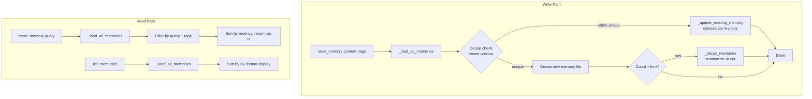

# Design: Memory Lifecycle Management

## 1. What & How

The Memory Lifecycle system provides persistent knowledge across Co sessions using markdown files with YAML frontmatter. Two mechanisms:

1. **Always-loaded context** — Static knowledge files injected into system prompt at session start (constant per session, not selective, not subject to DESIGN-07 history management)
2. **On-demand memories** — Searchable memories managed via agent tools with automatic dedup-on-write and size-based decay ("notes with gravity")

**Memory lifecycle:** write (dedup → consolidate or create → decay if limit exceeded) → read (search/list) → manage (forget/protect).

**File structure:**
- Global context: `~/.config/co-cli/knowledge/context.md` (3 KiB budget)
- Project context: `.co-cli/knowledge/context.md` (7 KiB budget, overrides global)
- Memories: `.co-cli/knowledge/memories/*.md` (agent-searchable, lifecycle-managed)

**Design principle:** Start with grep-based search (MVP <200 memories), evolve to SQLite FTS5 for scale, eventual hybrid search with vectors.



## 2. Core Logic

### Context Loading (Session Start)

**`load_internal_knowledge() → str | None`** — called once per session from `get_system_prompt()`. Loads global + project context files, validates frontmatter, checks size limits (warn at 10 KiB, truncate at 20 KiB). Returns combined markdown wrapped in `<system-reminder>` tags.

Positioned in prompt after personality template, before project instructions (CLAUDE.md). Returns `None` if no files exist (graceful degradation).

### Single File Scanner

All memory operations use `_load_all_memories(memory_dir) → list[MemoryEntry]`. Scans `*.md` files once, parses frontmatter, validates, returns typed dataclass entries. Invalid files skipped with warning. All other operations filter from this result — no re-scanning.

```
@dataclass MemoryEntry:
    id: int, path: Path, content: str, tags: list[str],
    created: str, updated: str | None, decay_protected: bool
```

### Memory Write Path

**`save_memory(ctx, content, tags)`** — single load, no re-scanning:

```
function save_memory(content, tags):
    memories = _load_all_memories(memory_dir)

    # 1. Dedup: filter recent window, check similarity
    recent = filter memories by created >= (now - window_days), limit 10
    is_dup, match, similarity = _check_duplicate(content, recent, threshold)
    if is_dup: return _update_existing_memory(match, content, tags)

    # 2. Create: next_id = max(ids) + 1, write file
    write markdown with frontmatter {id, created, tags, source, auto_category}

    # 3. Decay: if len(memories) + 1 > max_count → trigger
    if over limit: _decay_memories(ctx, memory_dir, all_memories)
```

**Dedup mechanics:** RapidFuzz `fuzz.token_sort_ratio()` for token-based similarity (handles word reordering better than plain `ratio()`). Recent window (default 7 days, max 10) keeps checks O(10). Threshold default 85% catches typos and rephrasing. Match returns `MemoryEntry` with path — no re-scanning for consolidation.

**Consolidation (`_update_existing_memory`):** Takes `MemoryEntry` directly (path already known). Merges tags (union), sets `updated` timestamp, removes legacy `consolidation_reason` field, rewrites file in-place.

### Decay Mechanics

Triggered when memory count exceeds `memory_max_count` (default 200). Decays `memory_decay_percentage` (default 20%) of oldest unprotected memories.

**Strategies:**
- **summarize** (default): Concatenate oldest N memories into 1 consolidated file tagged `["_consolidated", "_auto_decay"]`, delete originals. Preserves information. MVP uses concatenation, not LLM.
- **cut**: Delete oldest N memories permanently. No consolidation.

Protected memories (`decay_protected: true`) excluded from decay candidates.

### Memory Read Path

**`recall_memory(ctx, query, max_results=5)`** — loads all memories, filters by case-insensitive substring match in content and tags, sorts by recency (newest first).

**`list_memories(ctx)`** — loads all memories, sorts by ID, shows lifecycle indicators: count/limit, date ranges for consolidated (created → updated), `🔒` for protected, `[category]` from tags.

### Memory Management

**`/forget <id>`** — slash command deletes memory file by ID prefix glob.

**`decay_protected: true`** — frontmatter flag prevents decay. Must be set manually (edit file or future `/protect` command).

### Frontmatter Schema

**Context files** (`context.md`):

| Field | Type | Required | Description |
|-------|------|----------|-------------|
| `version` | `int` | Yes | Schema version |
| `updated` | `str` | Yes | ISO8601 timestamp |

**Memory files** (`memories/*.md`):

| Field | Type | Required | Description |
|-------|------|----------|-------------|
| `id` | `int` | Yes | Sequential memory ID |
| `created` | `str` | Yes | ISO8601 timestamp with timezone |
| `tags` | `list[str]` | No | Categorization tags |
| `source` | `str` | No | `"detected"` \| `"user-told"` \| `"auto_decay"` |
| `auto_category` | `str` | No | Primary signal type from tags |
| `updated` | `str` | No | ISO8601 timestamp (set on consolidation) |
| `decay_protected` | `bool` | No | Exclude from decay if true |

Legacy field `consolidation_reason` accepted in validation for backward compatibility but no longer written.

### Error Handling

| Error Scenario | Behavior | Recovery |
|----------------|----------|----------|
| Missing/malformed frontmatter | Log warning, skip file | Continue with other files |
| Invalid frontmatter fields | Raise `ValueError`, skip | Manual fix by user |
| Knowledge >20 KiB | Log error, truncate | Trim context files |
| Memory ID collision | Auto-resolve with `max(ids)+1` | No user action needed |
| File I/O error | Log warning, continue | Graceful degradation |

### Security

- **Approval gate:** `save_memory` requires user approval before writing files
- **Local storage only:** All data in `.co-cli/` project dir or `~/.config/co-cli/` (no cloud sync)
- **No secrets:** Prompt guidance warns against storing credentials
- **Path safety:** All paths are convention-based (XDG + `.co-cli/`), no user-provided paths
- **Size limits:** Hard cap at 20 KiB prevents context overflow

### Search Evolution Roadmap

| Phase | Approach | Capacity |
|-------|----------|----------|
| **Current** (MVP) | grep + frontmatter scan | <200 memories |
| **Future** | SQLite FTS5 keyword search | <10K memories |
| **Future** | Hybrid: vectors + FTS5 + reranker | 10K+ memories |

File format remains stable — migration only adds indices.

### Comparison with DESIGN-07 (Conversation Memory)

| Aspect | DESIGN-14 (Lifecycle) | DESIGN-07 (Conversation) |
|--------|----------------------|--------------------------|
| **Scope** | Cross-session, persistent | In-session, ephemeral |
| **Storage** | Markdown files | Message history (in-memory) |
| **Retrieval** | Explicit (agent tools) | Automatic (in history) |
| **Governance** | Size budgets, dedup, decay | Message count, trimming |

Context.md lives "above" the conversation (system-level), memories live "in" the conversation (message-level, ephemeral).

## 3. Config

### Context Paths

| Setting | Default | Description |
|---------|---------|-------------|
| Global context | `~/.config/co-cli/knowledge/context.md` | User-wide always-loaded context (3 KiB budget) |
| Project context | `.co-cli/knowledge/context.md` | Project-specific context (7 KiB budget) |
| Memory directory | `.co-cli/knowledge/memories/` | On-demand searchable memories |

### Memory Lifecycle Settings

| Setting | Env Var | Default | Description |
|---------|---------|---------|-------------|
| `memory_max_count` | `CO_CLI_MEMORY_MAX_COUNT` | `200` | Trigger decay when total exceeds this |
| `memory_dedup_window_days` | `CO_CLI_MEMORY_DEDUP_WINDOW_DAYS` | `7` | Dedup check window in days |
| `memory_dedup_threshold` | `CO_CLI_MEMORY_DEDUP_THRESHOLD` | `85` | Similarity % to consider duplicate (0-100) |
| `memory_decay_strategy` | `CO_CLI_MEMORY_DECAY_STRATEGY` | `"summarize"` | `"summarize"` \| `"cut"` |
| `memory_decay_percentage` | `CO_CLI_MEMORY_DECAY_PERCENTAGE` | `0.2` | Fraction of oldest to decay (0.0-1.0) |

## 4. Files

| File | Purpose |
|------|---------|
| `co_cli/knowledge.py` | `load_internal_knowledge()` — session start loader, size validation |
| `co_cli/_frontmatter.py` | YAML frontmatter parsing and validation |
| `co_cli/tools/memory.py` | Memory tools (`save_memory`, `recall_memory`, `list_memories`) + `MemoryEntry` dataclass + `_load_all_memories` scanner |
| `co_cli/config.py` | Memory lifecycle settings (5 settings) |
| `co_cli/_commands.py` | `/forget` slash command |
| `co_cli/agent.py` | Tool registration (3 memory tools) |
| `co_cli/prompts/__init__.py` | Prompt assembly with knowledge injection |
| `tests/test_memory_lifecycle.py` | Lifecycle tests (34 tests) |
| `tests/test_memory_tools.py` | Memory tool tests (14 tests) |
| `scripts/demo_memory_lifecycle.py` | Interactive lifecycle demo |
