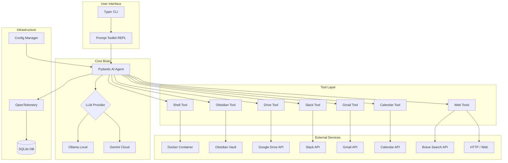

# Co CLI — System Design

**Synced:** v0.3.4
**Stack:** Python 3.12+, Pydantic AI, Ollama/Gemini, Docker, UV

Co is a personal AI assistant CLI — local-first (Ollama) or cloud (Gemini), sandboxed shell execution, OTel tracing to SQLite, human-in-the-loop approval for side effects.

## Architecture



### Component Docs

| Component | Doc | Summary |
|-----------|-----|---------|
| Agent & Dependencies | [DESIGN-01-agent.md](DESIGN-01-agent.md) | `get_agent()` factory, `CoDeps` dataclass, tool registration, multi-session state |
| Chat Loop | [DESIGN-02-chat-loop.md](DESIGN-02-chat-loop.md) | Streaming, deferred approval, slash commands, input dispatch, interrupt handling |
| LLM Models | [DESIGN-03-llm-models.md](DESIGN-03-llm-models.md) | Gemini/Ollama model selection, inference parameters |
| Telemetry | [DESIGN-04-otel-logging.md](DESIGN-04-otel-logging.md) | SQLite span exporter, WAL concurrency, trace viewers |
| Tail Viewer | [DESIGN-05-tail-viewer.md](DESIGN-05-tail-viewer.md) | Real-time span viewer (`co tail`) |
| Conversation Memory | [DESIGN-06-conversation-memory.md](DESIGN-06-conversation-memory.md) | History processors, sliding window, summarisation |
| Theming | [DESIGN-07-theming-ascii.md](DESIGN-07-theming-ascii.md) | Light/dark themes, ASCII banner, semantic styles |
| Shell Tool | [DESIGN-08-tool-shell.md](DESIGN-08-tool-shell.md) | Docker sandbox, subprocess fallback, safe-prefix auto-approval |
| Obsidian Tool | [DESIGN-09-tool-obsidian.md](DESIGN-09-tool-obsidian.md) | Vault search, path traversal protection |
| Google Tools | [DESIGN-10-tool-google.md](DESIGN-10-tool-google.md) | Drive, Gmail, Calendar — lazy auth, structured output |
| Slack Tool | [DESIGN-11-tool-slack.md](DESIGN-11-tool-slack.md) | Channel/message/user tools, send with approval |
| Web Tools | [DESIGN-12-tool-web-search.md](DESIGN-12-tool-web-search.md) | Brave Search + URL fetch, read-only |

## Cross-Cutting Concerns

### Configuration

XDG-compliant configuration with project-level overrides. Resolution order (highest wins):

1. Environment variables (`fill_from_env` model validator)
2. `.co-cli/settings.json` in cwd (project — shallow `|=` merge)
3. `~/.config/co-cli/settings.json` (user)
4. Default values (Pydantic `Field(default=...)`)

Project config is checked at `cwd/.co-cli/settings.json` only — no upward directory walk. `save()` always writes to the user-level file.

### Tool Conventions

All tools use `agent.tool()` with `RunContext[CoDeps]`. Zero `tool_plain()` remaining.

**Return convention:** Tools returning data for the user return `dict[str, Any]` with a `display` field (pre-formatted string with URLs baked in) and metadata fields (e.g. `count`, `has_more`). The system prompt instructs the LLM to show `display` verbatim. `_stream_agent_run()` renders tool returns inline as events arrive.

| Tool | Return type | Has `display`? | Metadata |
|------|------------|----------------|----------|
| `search_drive_files` | `dict` | Yes | `page`, `has_more` |
| `read_drive_file` | `str` | No | — |
| `list_emails` / `search_emails` | `dict` | Yes | `count` |
| `create_email_draft` | `str` | No | — |
| `list_calendar_events` / `search_calendar_events` | `dict` | Yes | `count` |
| `search_notes` | `dict` | Yes | `count`, `has_more` |
| `list_notes` | `dict` | Yes | `count` |
| `read_note` | `str` | No | — |
| `run_shell_command` | `str` | No | — |
| `send_slack_message` | `dict` | Yes | `channel`, `ts` |
| `list_slack_channels` / `list_slack_messages` | `dict` | Yes | `count`, `has_more` |
| `list_slack_replies` / `list_slack_users` | `dict` | Yes | `count`, `has_more` |
| `web_search` | `dict` | Yes | `results`, `count` |
| `web_fetch` | `dict` | Yes | `url`, `content_type`, `truncated` |

**Naming convention:** `verb_noun` with converged verb set: `read`, `list`, `search`, `create`, `send`, `run`. `web_search` and `web_fetch` use `web_` prefix to namespace web tools.

**ModelRetry convention:** `ModelRetry` = "you called this wrong, fix your parameters" (LLM can self-correct). Empty result = "query was fine, nothing matched" (return `{"count": 0}`).

**Retry budget:** Agent-level `retries=settings.tool_retries` (default 3). All tools inherit the same budget.

**Request limit:** `UsageLimits(request_limit=settings.max_request_limit)` (default 25) caps LLM round-trips per user turn.

### Approval Flow

Side-effectful tools are registered with `requires_approval=True`. The chat loop prompts `[y/n/a(yolo)]` via `DeferredToolRequests`. Tools contain only business logic — no UI imports. See [DESIGN-02-chat-loop.md](DESIGN-02-chat-loop.md) for the full approval sequence and [DESIGN-08-tool-shell.md](DESIGN-08-tool-shell.md) for safe-command auto-approval.

| Tool | Approval | Rationale |
|------|----------|-----------|
| `run_shell_command` | Yes | Arbitrary code execution. Safe-prefix commands auto-approved in Docker. |
| `create_email_draft` | Yes | Creates Gmail draft on user's behalf |
| `send_slack_message` | Yes | Sends message visible to others |
| All other tools | No | Read-only operations |

### Security Model

Four defense layers:

1. **Configuration** — Secrets in `settings.json` or env vars, no hardcoded keys, env vars override file values
2. **Confirmation** — Human-in-the-loop approval for shell commands, Slack messages, email drafts (see approval flow above)
3. **Isolation** — Docker sandbox with `cap_drop=ALL`, `no-new-privileges`, `pids_limit=256`, workspace-only mount (see [DESIGN-08-tool-shell.md](DESIGN-08-tool-shell.md))
4. **Input validation** — Path traversal protection in Obsidian tools, API scoping in Google/Slack tools

### Concurrency

Single-threaded, synchronous execution loop. Uses `await _stream_agent_run()` inside async loop — query N must complete before query N+1 begins. This prevents conversation history forking and avoids overloading Ollama (can't handle parallel inference on consumer hardware).

### XDG Directory Structure

```
~/.config/co-cli/
└── settings.json          # User configuration

~/.local/share/co-cli/
├── co-cli.db              # OpenTelemetry traces (SQLite)
└── history.txt            # REPL command history

<project-root>/
└── .co-cli/
    └── settings.json      # Project configuration (overrides user)
```

### Testing Policy

Functional tests only — no mocks or stubs. Tests must interact with real services and verify actual side effects. Docker must be running for shell/sandbox tests. Google tests resolve credentials automatically.

## Modules

| Module | Purpose |
|--------|---------|
| `main.py` | CLI entry point, chat loop, `_stream_agent_run()`, `_handle_approvals()`, OTel setup |
| `agent.py` | `get_agent()` factory — model selection, tool registration, system prompt |
| `deps.py` | `CoDeps` dataclass — runtime dependencies injected via `RunContext` |
| `config.py` | `Settings` (Pydantic BaseModel) from `settings.json` + env vars |
| `sandbox.py` | `SandboxProtocol` + backends (Docker, subprocess fallback) |
| `telemetry.py` | `SQLiteSpanExporter` — OTel spans to SQLite with WAL mode |
| `display.py` | Themed Rich Console, semantic styles, display helpers |
| `status.py` | `StatusInfo` dataclass + `get_status()` + `render_status_table()` |
| `banner.py` | ASCII art welcome banner |
| `_commands.py` | Slash command registry, handlers, `dispatch()` |
| `_history.py` | History processors and `summarize_messages()` |
| `_approval.py` | Shell safe-command classification |
| `tail.py` | Real-time span viewer (`co tail`) |
| `trace_viewer.py` | Static HTML trace viewer (`co traces`) |
| `google_auth.py` | Google credential resolution (ensure/get/cached) |
| `tools/shell.py` | `run_shell_command` — sandbox execution |
| `tools/obsidian.py` | `search_notes`, `list_notes`, `read_note` |
| `tools/google_drive.py` | `search_drive_files`, `read_drive_file` |
| `tools/google_gmail.py` | `list_emails`, `search_emails`, `create_email_draft` |
| `tools/google_calendar.py` | `list_calendar_events`, `search_calendar_events` |
| `tools/slack.py` | `send_slack_message`, `list_slack_channels`, `list_slack_messages`, `list_slack_replies`, `list_slack_users` |
| `tools/web.py` | `web_search`, `web_fetch` — Brave Search API + URL fetch |

## Dependencies

### Runtime

| Package | Version | Purpose |
|---------|---------|---------|
| `pydantic-ai` | ^1.52.0 | LLM orchestration |
| `typer` | ^0.21.1 | CLI framework |
| `rich` | ^14.3.2 | Terminal UI |
| `prompt-toolkit` | ^3.0.52 | Interactive REPL |
| `docker` | ^7.1.0 | Container management |
| `google-genai` | ^1.61.0 | Gemini API |
| `google-api-python-client` | ^2.189.0 | Drive/Gmail/Calendar |
| `google-auth-oauthlib` | ^1.2.4 | OAuth2 |
| `slack-sdk` | ^3.39.0 | Slack API |
| `opentelemetry-sdk` | ^1.39.1 | Tracing |
| `httpx` | ^0.28.1 | HTTP client (web tools) |
| `html2text` | ^2024.2.26 | HTML→markdown conversion (web_fetch) |
| `datasette` | ^0.65.2 | Telemetry dashboard |

### Development

| Package | Version | Purpose |
|---------|---------|---------|
| `pytest` | ^9.0.2 | Testing framework |
| `pytest-asyncio` | ^1.3.0 | Async test support |
