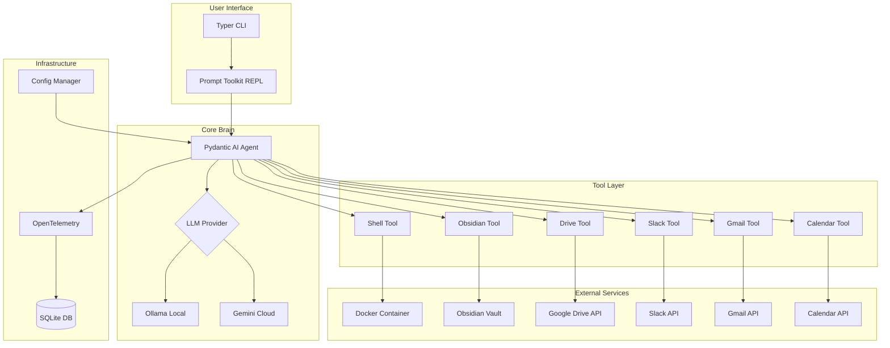
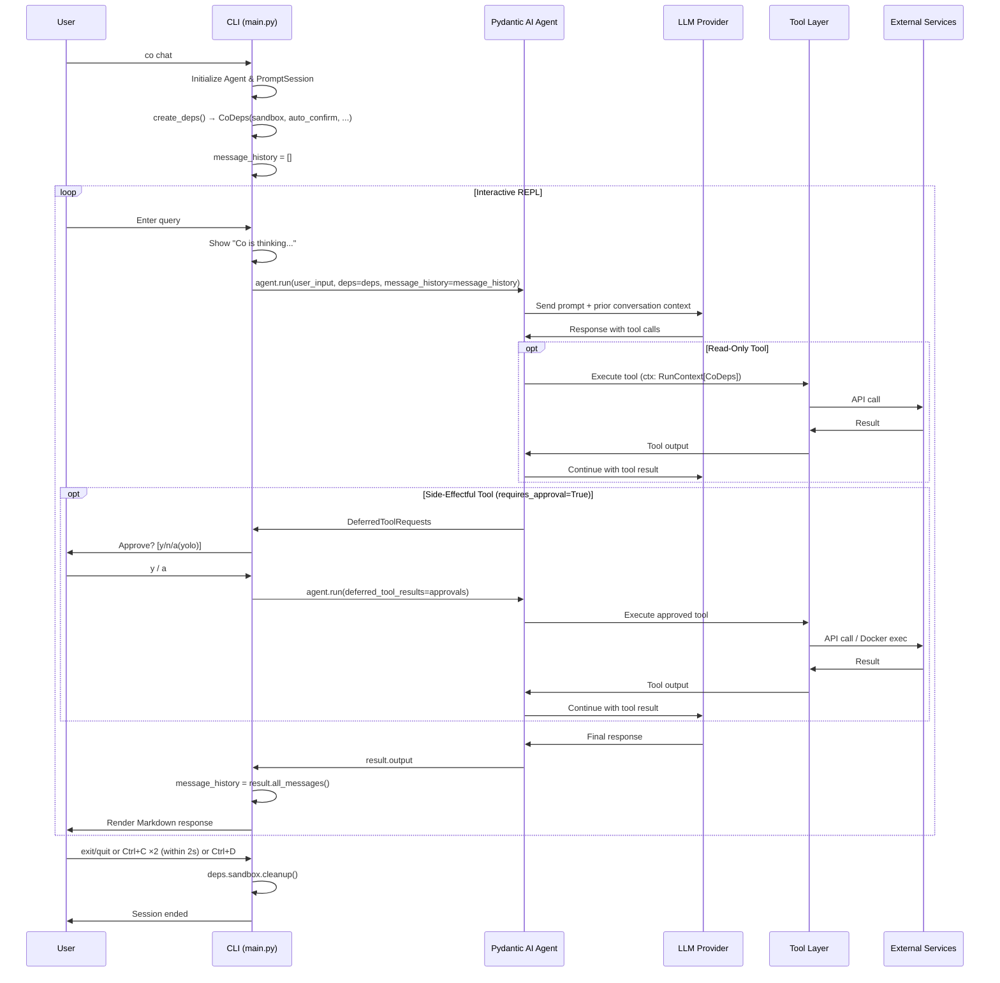
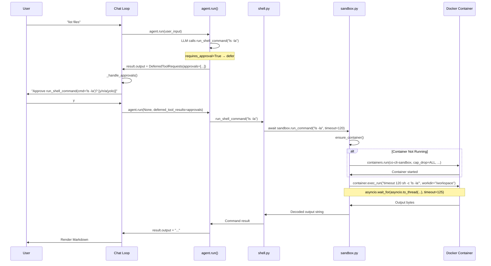
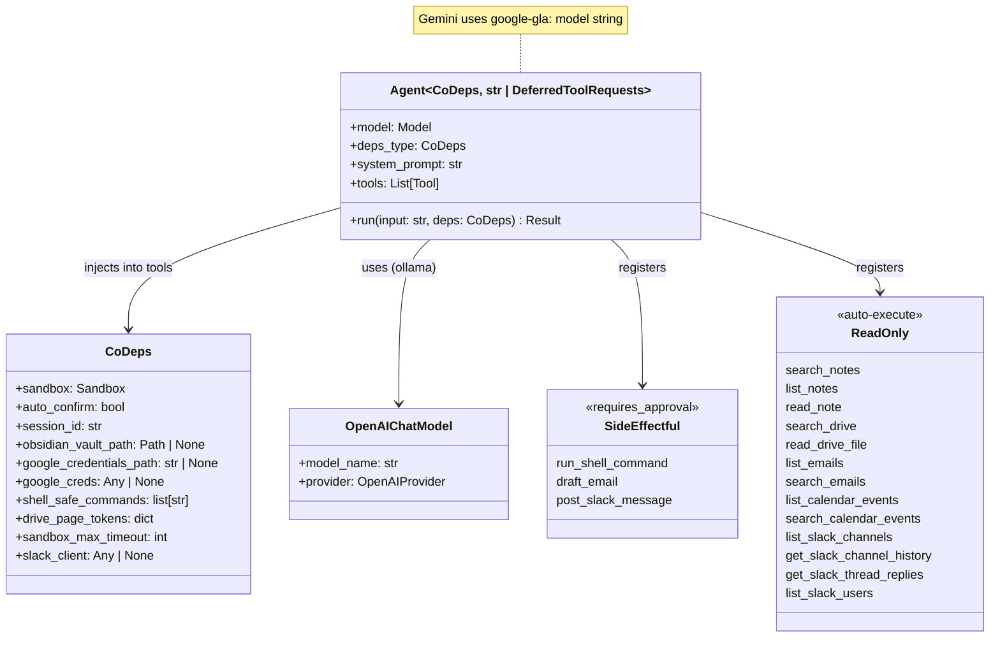
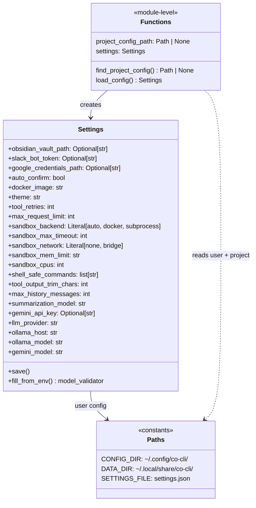
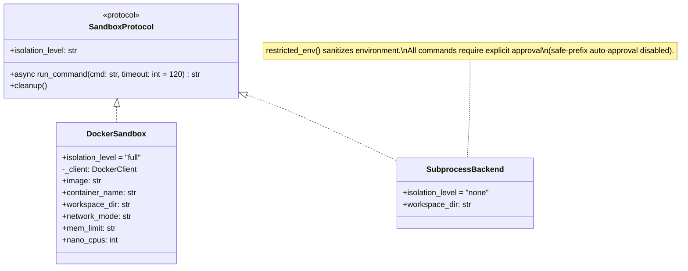
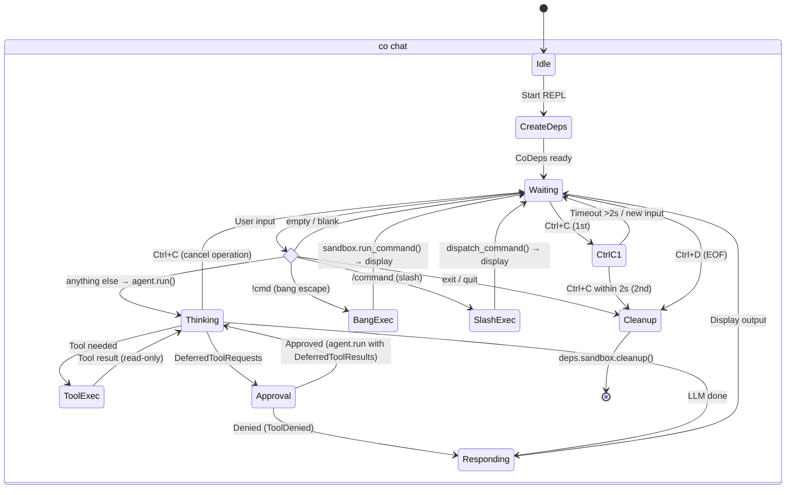
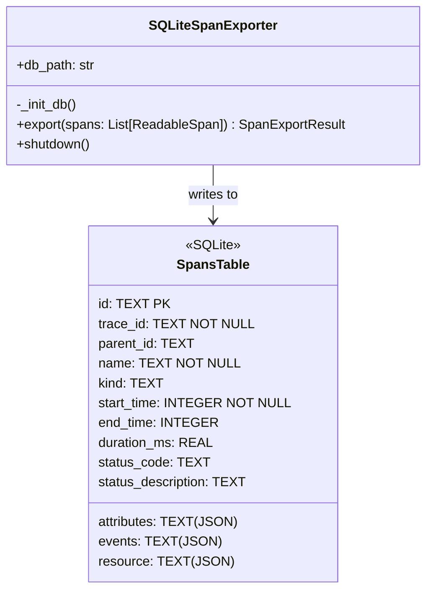
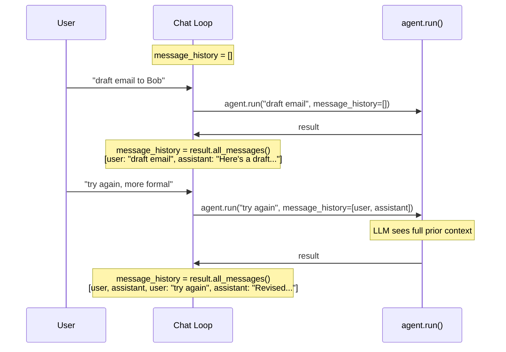
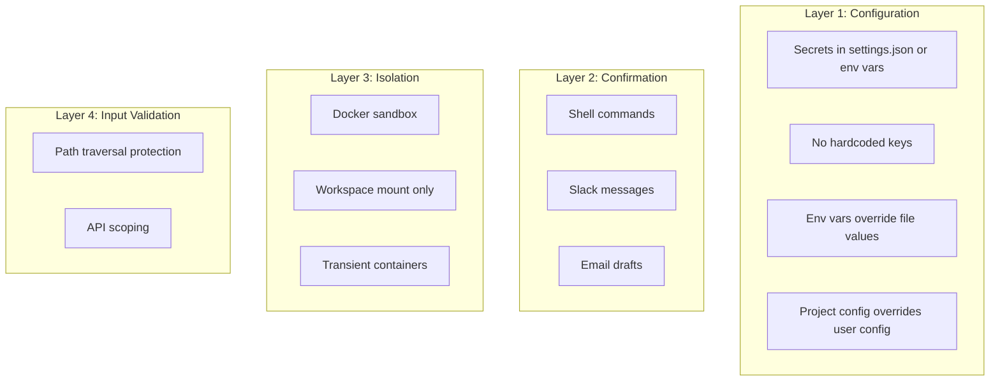

# Co CLI - System Design Document

**Version:** 1.2 (Feb 2026)
**Stack:** Python 3.12+, Pydantic AI, Ollama/Gemini, Docker, UV

---

## 1. System Overview

Co is a production-grade personal assistant CLI that combines local AI inference with cloud services. It provides a privacy-first, sandboxed environment for running AI-powered tasks.

### Design Principles

1. **Privacy-First**: Gemini (default) or local Ollama, all logs stored locally
2. **Safe Execution**: Docker sandbox for shell commands
3. **Observable**: Full OpenTelemetry tracing to local SQLite
4. **Human-in-the-Loop**: Confirmation required for high-risk actions

---

## 2. High-Level Architecture



---

## 3. Processing Flow

### 3.1 Chat Session Flow



### 3.2 Tool Execution Flow (Deferred Approval Pattern)

Side-effectful tools (`run_shell_command`, `draft_email`, `post_slack_message`) use pydantic-ai's `requires_approval=True` + `DeferredToolRequests` pattern. Approval lives in the chat loop, not inside tools.



**Denial flow:** When the user picks `n`, the chat loop sends `ToolDenied("User denied this action")`. The LLM sees the structured denial and can reason about it (e.g. suggest an alternative command).

**Session yolo flow:** When the user picks `a`, `deps.auto_confirm` is set to `True`. All subsequent approvals in the session are auto-approved without prompting.

---

## 4. Core Components

### 4.1 Agent (`co_cli/agent.py`)

The Agent is the central orchestrator that connects the LLM to tools. Uses `deps_type=CoDeps` for dependency injection into tools via `RunContext`.



**Factory Function: `get_agent()`**

```python
def get_agent() -> tuple[Agent[CoDeps, str | DeferredToolRequests], ModelSettings | None, list[str]]:
    provider_name = settings.llm_provider.lower()
    model_settings: ModelSettings | None = None

    if provider_name == "gemini":
        os.environ.setdefault("GEMINI_API_KEY", settings.gemini_api_key)
        model = f"google-gla:{settings.gemini_model}"
    else:
        # Ollama via OpenAI-compatible API
        provider = OpenAIProvider(base_url=f"{ollama_host}/v1", api_key="ollama")
        model = OpenAIChatModel(model_name, provider)
        model_settings = ModelSettings(temperature=0.7, top_p=1.0, max_tokens=16384)

    agent: Agent[CoDeps, str | DeferredToolRequests] = Agent(
        model,
        deps_type=CoDeps,
        system_prompt=system_prompt,
        retries=settings.tool_retries,
        output_type=[str, DeferredToolRequests],
    )

    # Side-effectful tools — require human approval via DeferredToolRequests
    agent.tool(run_shell_command, requires_approval=True)
    agent.tool(draft_email, requires_approval=True)
    agent.tool(post_slack_message, requires_approval=True)

    # Read-only tools — no approval needed
    agent.tool(search_notes)
    agent.tool(list_notes)
    # ... remaining read-only tools
    agent.tool(search_calendar_events)

    tool_names = [fn.__name__ for fn in [run_shell_command, ..., search_calendar_events]]
    return agent, model_settings, tool_names
```

**System Prompt:**
```
You are Co, a CLI assistant running in the user's terminal.

### Response Style
- Be terse: users want results, not explanations
- On success: show the output, then a brief note if needed
- On error: show the error, suggest a fix

### Tool Output
- Most tools return a dict with a `display` field — show the `display` value verbatim
- Never reformat, summarize, or drop URLs from tool output
- If the result has `has_more=true`, tell the user more results are available

### Tool Usage
- Use tools proactively to complete tasks
- Chain operations: read before modifying, test after changing
- Shell commands run in a Docker sandbox mounted at /workspace

### Pagination
- When a tool result has has_more=true, more results are available
- If the user asks for "more", "next", or "next 10", call the same tool with the same query and page incremented by 1
- Do NOT say "no more results" unless you called the tool and has_more was false
```

### 4.2 Configuration (`co_cli/config.py`)

XDG-compliant configuration management with project-level overrides and environment variable fallback.



**Configuration Resolution Order (highest wins):**
1. Environment variables (`fill_from_env` model validator — always overrides file values)
2. `.co-cli/settings.json` in cwd (project — shallow `|=` merge over user config)
3. `~/.config/co-cli/settings.json` (user)
4. Default values (hardcoded in Pydantic `Field(default=...)`)

Project config is checked at `cwd/.co-cli/settings.json` only — no upward directory walk. `find_project_config()` returns the path if the file exists, else `None`. Merge is shallow per-key (dict `|=`): a project key replaces the same user key entirely, matching Git/npm/Claude Code conventions. `save()` always writes to the user-level file.

**Environment Variable Mapping:**
| Setting | Env Var | Default |
|---------|---------|---------|
| `llm_provider` | `LLM_PROVIDER` | `"gemini"` |
| `gemini_api_key` | `GEMINI_API_KEY` | `None` |
| `gemini_model` | `GEMINI_MODEL` | `"gemini-2.0-flash"` |
| `ollama_host` | `OLLAMA_HOST` | `"http://localhost:11434"` |
| `ollama_model` | `OLLAMA_MODEL` | `"glm-4.7-flash:q8_0"` |
| `obsidian_vault_path` | `OBSIDIAN_VAULT_PATH` | `None` |
| `slack_bot_token` | `SLACK_BOT_TOKEN` | `None` |
| `google_credentials_path` | `GOOGLE_CREDENTIALS_PATH` | `None` |
| `auto_confirm` | `CO_CLI_AUTO_CONFIRM` | `false` |
| `docker_image` | `CO_CLI_DOCKER_IMAGE` | `"co-cli-sandbox"` |
| `theme` | `CO_CLI_THEME` | `"light"` |
| `tool_retries` | `CO_CLI_TOOL_RETRIES` | `3` |
| `max_request_limit` | `CO_CLI_MAX_REQUEST_LIMIT` | `25` |
| `sandbox_backend` | `CO_CLI_SANDBOX_BACKEND` | `"auto"` |
| `sandbox_max_timeout` | `CO_CLI_SANDBOX_MAX_TIMEOUT` | `600` |
| `sandbox_network` | `CO_CLI_SANDBOX_NETWORK` | `"none"` |
| `sandbox_mem_limit` | `CO_CLI_SANDBOX_MEM_LIMIT` | `"1g"` |
| `sandbox_cpus` | `CO_CLI_SANDBOX_CPUS` | `1` |
| `shell_safe_commands` | `CO_CLI_SHELL_SAFE_COMMANDS` | _(see config.py)_ |
| `tool_output_trim_chars` | `CO_CLI_TOOL_OUTPUT_TRIM_CHARS` | `2000` |
| `max_history_messages` | `CO_CLI_MAX_HISTORY_MESSAGES` | `40` |
| `summarization_model` | `CO_CLI_SUMMARIZATION_MODEL` | `""` |

### 4.3 Dependencies (`co_cli/deps.py`)

Runtime dependencies injected into tools via `RunContext[CoDeps]`. Settings creates these in `main.py`, tools access them via `ctx.deps`.

```python
@dataclass
class CoDeps:
    sandbox: SandboxProtocol
    auto_confirm: bool = False
    session_id: str = ""
    obsidian_vault_path: Path | None = None
    google_credentials_path: str | None = None
    google_creds: Any | None = field(default=None, repr=False)  # Cached credentials
    _google_creds_resolved: bool = field(default=False, repr=False, init=False)
    shell_safe_commands: list[str] = field(default_factory=list)
    drive_page_tokens: dict[str, list[str]] = field(default_factory=dict)
    sandbox_max_timeout: int = 600
    slack_client: Any | None = None  # slack_sdk.WebClient at runtime
```

**Design Principle:** `CoDeps` contains runtime resources, NOT config objects. `Settings` creates resources in `main.py`, then injects here.

**Dependency Flow:**

```
main.py: create_deps()          →  CoDeps(sandbox, vault_path, google_credentials_path, slack_client, ...)
    ↓
agent.run(user_input, deps=deps) →  Agent passes deps to tool calls
    ↓
tool(ctx: RunContext[CoDeps])    →  ctx.deps.sandbox, ctx.deps.google_creds, etc.
```

#### Multi-Session State Design (pydantic-ai pattern)

pydantic-ai separates state into three tiers:

| Tier | Scope | Lifetime | Where | Example |
|------|-------|----------|-------|---------|
| **Agent config** | Process | Entire process | `Agent(...)` constructor, module constants | Model name, system prompt, tool registrations |
| **Session deps** | Session | One REPL loop (`create_deps()` → `sandbox.cleanup()`) | `RunContext.deps` (`CoDeps`) | Sandbox handle, Google creds (lazy-cached), page tokens |
| **Run state** | Single run | One `agent.run()` call | `result.state` / `ctx.state` (pydantic-graph) | Per-turn counter (if needed) |

**Critical invariant: mutable per-session state belongs in `CoDeps`, never in module globals.** Module-level variables are process-scoped — they persist across sessions and are shared by all concurrent sessions in the same process.

`CoDeps` is the session boundary. `main.py:create_deps()` instantiates one `CoDeps` per chat session. Every `agent.run()` call within that session receives the same `CoDeps` instance, so tools accumulate state (like page tokens) across turns. But two sessions — whether concurrent or sequential — get separate `CoDeps` instances with independent state.

```
Process (one Python interpreter)
├── Module globals          ← shared, immutable config only
│   ├── Agent instance
│   └── Tool registrations
│
├── Session A
│   └── CoDeps instance A   ← mutable state lives here
│       ├── sandbox A
│       ├── drive_page_tokens: {"report": ["tok1", "tok2"]}
│       └── ...
│
└── Session B
    └── CoDeps instance B   ← independent, no cross-contamination
        ├── sandbox B
        ├── drive_page_tokens: {}    ← fresh, empty
        └── ...
```

Mutable fields use `field(default_factory=...)` so each `CoDeps` gets its own empty collection. The dict is keyed by query string, not session ID — the `CoDeps` instance *is* the session boundary, so no session key is needed. When the session ends, the `CoDeps` instance is garbage-collected along with all its accumulated state.

**Example — Drive pagination tokens:**

```python
# deps.py
drive_page_tokens: dict[str, list[str]] = field(default_factory=dict)

# google_drive.py — reads/writes via ctx.deps, never module global
tokens = ctx.deps.drive_page_tokens.get(query, [])
ctx.deps.drive_page_tokens[query] = []
```

### 4.4 Sandbox (`co_cli/sandbox.py`)

Protocol-based execution backends. Docker provides full isolation (primary); subprocess fallback when Docker is unavailable. See `docs/DESIGN-tool-shell.md` for full backend architecture.



**Docker backend (full isolation):**
- **Image:** `co-cli-sandbox` (configurable via `CO_CLI_DOCKER_IMAGE`)
- **Name:** `co-runner-{session_id[:8]}` (unique per session)
- **Volume:** Current working directory → `/workspace` (read-write)
- **Command:** `sh` (keeps container alive)
- **Security:** `cap_drop=ALL`, `no-new-privileges`, `pids_limit=256`, `user=1000:1000`
- **Resources:** Configurable `network_mode`, `mem_limit`, `nano_cpus`

**Subprocess backend (no isolation):**
- Fallback when Docker is unavailable. Uses `restricted_env()` and `kill_process_tree()`.
- All commands require explicit approval (safe-prefix auto-approval disabled).

**Lifecycle:**
1. On first tool call: Create container (Docker) or subprocess
2. On subsequent calls: Reuse existing container (Docker); fresh subprocess per command
3. On CLI exit: `sandbox.cleanup()` stops/removes container

### 4.5 CLI (`co_cli/main.py`)

Typer-based CLI. Owns dependency creation, lifecycle, and conversation memory.

#### Entry Point: How `co` Works

`pyproject.toml` declares a console script entry point:

```toml
[project.scripts]
co = "co_cli.main:app"
```

When `uv sync` runs, it generates `.venv/bin/co` — a small Python wrapper:

```python
#!/.../co-cli/.venv/bin/python3
import sys
from co_cli.main import app
if __name__ == "__main__":
    sys.exit(app())
```

This means `co` is not a compiled binary but an auto-generated script that calls the Typer `app()`. Two invocation methods:

| Method | Requires venv activated? |
|--------|--------------------------|
| `uv run co <cmd>` | No — uv activates the venv automatically |
| `co <cmd>` | Yes — `.venv/bin/` must be on `PATH` |


**Dependency Injection + Conversation Memory + Deferred Approvals:**

The chat loop has three responsibilities:
1. **Conversation memory** — accumulates `message_history` across turns via `result.all_messages()`
2. **Deferred approval** — when `result.output` is `DeferredToolRequests`, calls `_handle_approvals()` to prompt the user, then resumes the agent with `DeferredToolResults`
3. **Lifecycle** — creates `CoDeps` at session start, calls `sandbox.cleanup()` at session end

```
chat_loop():
    agent, model_settings, tool_names = get_agent()
    deps = create_deps()
    info = get_status(tool_count=len(tool_names))
    display_welcome_banner(info)
    message_history = []

    loop:
        result = agent.run(user_input, deps, message_history)

        while result.output is DeferredToolRequests:   # loop — resumed run may trigger more
            result = _handle_approvals(agent, deps, result)  # [y/n/a] prompt

        message_history = result.all_messages()
        display(result.output)

    finally:
        deps.sandbox.cleanup()
```

**Why `while`, not `if`:** A resumed `agent.run()` with approved tool results may itself produce another `DeferredToolRequests` — for example, when the LLM chains two side-effectful calls (e.g. user says "cd to /workspace and ls"). Each round needs its own approval cycle.

**Conversation Memory:** Each turn's full message history (user prompts, assistant responses, tool calls/results) is accumulated via `result.all_messages()` and passed to the next `agent.run()` call. This gives the LLM full context for follow-up queries like "try again" or "change the subject line". Memory is in-process only — it resets when the session ends.



**Commands:**

| Command | Description | Implementation |
|---------|-------------|----------------|
| `co chat` | Interactive REPL | `asyncio.run(chat_loop())` |
| `co status` | System health check | Displays Rich table |
| `co tail` | Real-time span viewer | Polls SQLite, prints with Rich (`tail.py`) |
| `co logs` | Telemetry dashboard | Launches Datasette |
| `co traces` | Visual span tree (HTML) | Generates static HTML (`trace_viewer.py`) |

**REPL Features:**
- History: Saved to `~/.local/share/co-cli/history.txt`
- Spinner: "Co is thinking..." during inference
- Output: Rendered as Rich Markdown
- Tab completion: `WordCompleter` with `complete_while_typing=False` for `/command` names

**REPL Input Flow:**

Input is dispatched in priority order — first match wins:

```
user_input
  ├─ "exit"/"quit"  → break (end session)
  ├─ empty/blank    → continue (ignore)
  ├─ "!cmd"         → sandbox.run_command(cmd) — direct shell, no LLM
  ├─ "/command"     → dispatch_command() — slash command, no LLM
  └─ anything else  → agent.run() — LLM inference
```

#### Slash Commands (`co_cli/_commands.py`)

Local REPL commands that bypass the LLM and execute instantly. Modeled after gemini-cli, Claude Code, and GitHub Copilot CLI conventions.

**Architecture:**

```python
@dataclass(frozen=True)
class CommandContext:
    message_history: list[Any]
    deps: Any          # CoDeps
    agent: Any         # Agent[CoDeps, ...]
    tool_names: list[str]

@dataclass(frozen=True)
class SlashCommand:
    name: str
    description: str
    handler: Callable[[CommandContext, str], Awaitable[list[Any] | None]]

COMMANDS: dict[str, SlashCommand] = { ... }  # explicit registry, no decorators

async def dispatch(raw_input: str, ctx: CommandContext) -> tuple[bool, list[Any] | None]:
    """Returns (handled, new_history). new_history is None if unchanged."""
```

**Handler return convention:**
- `None` → display-only command, history unchanged
- `list` → new history to rebind (e.g. `/clear` returns `[]`, `/compact` returns summarized history)

**Commands:**

| Command | Handler | Effect |
|---------|---------|--------|
| `/help` | `_cmd_help` | Print table of all commands from `COMMANDS` |
| `/clear` | `_cmd_clear` | Returns `[]` — empties conversation history |
| `/status` | `_cmd_status` | Calls `get_status()` + `render_status_table()` — same output as `co status` |
| `/tools` | `_cmd_tools` | Numbered list of registered agent tool names |
| `/history` | `_cmd_history` | Counts `ModelRequest` messages, shows turn/message totals |
| `/compact` | `_cmd_compact` | Calls `agent.run()` with summarization prompt, returns compacted history |
| `/yolo` | `_cmd_yolo` | Toggles `deps.auto_confirm` — same as picking `a` in approval prompt |

**Chat loop integration (`main.py`):**

```python
if user_input.startswith("/"):
    cmd_ctx = CommandContext(
        message_history=message_history, deps=deps,
        agent=agent, tool_names=tool_names,
    )
    handled, new_history = await dispatch_command(user_input, cmd_ctx)
    if handled:
        if new_history is not None:
            message_history = new_history
        continue
```

**Design decisions:**
- All handlers are async (uniform interface — only `/compact` currently awaits, but avoids refactoring when adding I/O commands)
- `CommandContext` is a frozen dataclass — clean grab-bag; adding fields doesn't break existing handlers
- Explicit `dict` registry, no decorators — 7 commands is small enough that grep-friendly explicitness wins
- Unknown commands print error + `/help` hint, return `(True, None)` — consumed but no side effects

**Exit Handling (double Ctrl+C pattern):**

Follows Node.js REPL / Aider / Gemini CLI conventions:

| Context | Action | Result |
|---------|--------|--------|
| During `agent.run()` | Ctrl+C | Cancels operation, patches dangling tool calls (§8.1), returns to prompt. Does **not** count toward exit. |
| During approval prompt | Ctrl+C | Cancels approval, patches dangling tool calls (§8.1), returns to prompt. Does **not** count toward exit. |
| At prompt | Ctrl+C (1st) | Prints "Press Ctrl+C again to exit" |
| At prompt | Ctrl+C (2nd within 2s) | Exits session |
| At prompt | Ctrl+C (2nd after 2s) | Treated as new 1st press (timeout reset) |
| Any input submitted | — | Resets the interrupt timer |
| Anywhere | Ctrl+D (EOF) | Exits immediately |

See §8.2 for signal-handling implementation details.

### 4.6 Telemetry (`co_cli/telemetry.py`)

OpenTelemetry traces exported to local SQLite. See `docs/DESIGN-otel-logging.md` for full design including WAL concurrency, span attribute reference, and viewer architecture. See `docs/DESIGN-tail-viewer.md` for the real-time span tail viewer.



**Schema:**
```sql
CREATE TABLE spans (
    id TEXT PRIMARY KEY,
    trace_id TEXT NOT NULL,
    parent_id TEXT,
    name TEXT NOT NULL,
    kind TEXT,
    start_time INTEGER NOT NULL,  -- nanoseconds epoch
    end_time INTEGER,
    duration_ms REAL,
    status_code TEXT,
    status_description TEXT,
    attributes TEXT,               -- JSON
    events TEXT,                   -- JSON array
    resource TEXT                  -- JSON (service.name, version)
)
```

---

## 5. Tool System

### 5.1 Tool Architecture

**Tool Registration:** All tools use `agent.tool()` with `RunContext[CoDeps]` pattern. Zero `tool_plain()` remaining. See the Agent + Tools class diagram in §4.1 for the full tool inventory and approval classification.

### 5.1.1 Tool Return Convention

Tools returning data for the user MUST return `dict[str, Any]` with a `display` field (pre-formatted string with URLs baked in) and metadata fields (e.g. `count`, `has_more`). The system prompt instructs the LLM to show `display` verbatim. `_display_tool_outputs()` in `main.py` renders tool returns **before** the LLM summary — `dict` with `display` is printed verbatim, `str` content is shown in a Rich Panel. This transport-layer separation ensures URLs, pagination hints, and formatting reach the user intact regardless of LLM reformatting.

**Tool Return Type Reference:**

| Tool | Return type | Has `display`? | Metadata fields |
|------|------------|----------------|-----------------|
| `search_drive` | `dict[str, Any]` | Yes — files with URLs, pagination | `page`, `has_more` |
| `read_drive_file` | `str` | No — raw file content | — |
| `list_emails` | `dict[str, Any]` | Yes — emails with Gmail links | `count` |
| `search_emails` | `dict[str, Any]` | Yes — emails with Gmail links | `count` |
| `draft_email` | `str` | No — confirmation message | — |
| `list_calendar_events` | `dict[str, Any]` | Yes — events with Meet/event links | `count` |
| `search_calendar_events` | `dict[str, Any]` | Yes — events with Meet/event links | `count` |
| `search_notes` | `dict[str, Any]` | Yes — files with snippets | `count`, `has_more` |
| `list_notes` | `dict[str, Any]` | Yes — file paths | `count` |
| `read_note` | `str` | No — raw note content | — |
| `run_shell_command` | `str` | No — command output | — |
| `post_slack_message` | `dict[str, Any]` | Yes — confirmation with TS | `channel`, `ts` |
| `list_slack_channels` | `dict[str, Any]` | Yes — channel list | `count`, `has_more` |
| `get_slack_channel_history` | `dict[str, Any]` | Yes — message history | `count`, `has_more` |
| `get_slack_thread_replies` | `dict[str, Any]` | Yes — thread replies | `count`, `has_more` |
| `list_slack_users` | `dict[str, Any]` | Yes — user list | `count`, `has_more` |

### 5.1.2 ModelRetry Convention

Cross-cutting principle for all tools:

- **`ModelRetry`** = "you called this wrong, fix your parameters" (LLM can self-correct)
- **Empty result** = "query was fine, nothing matched" (return `{"count": 0}`)

| Raise `ModelRetry` | Return empty result |
|---------------------|---------------------|
| Vault/service not configured | Search matched zero files |
| Malformed parameters | Time range had no events |
| Note/file not found (with available list) | List is genuinely empty |
| Shell command failed (with error output) | |

### 5.1.3 Tool Retry Budget

Agent-level `retries=settings.tool_retries` (default 3, configurable via `CO_CLI_TOOL_RETRIES`). All tools inherit the same budget. Safe for side-effectful tools because `requires_approval=True` gates each attempt.

### 5.1.4 Request Limit (Loop Guard)

`UsageLimits(request_limit=settings.max_request_limit)` (default 25, configurable via `CO_CLI_MAX_REQUEST_LIMIT`) caps LLM round-trips per user turn. Prevents infinite tool-call loops. `UsageLimitExceeded` is caught by the chat loop's `except Exception` block.

### 5.2 Shell Tool (`co_cli/tools/shell.py`)

Uses `RunContext[CoDeps]` + `requires_approval=True`. Approval is handled by the chat loop via `DeferredToolRequests`, not inside the tool. See `docs/DESIGN-tool-shell.md` for sandbox details.

```python
async def run_shell_command(ctx: RunContext[CoDeps], cmd: str, timeout: int = 120) -> str:
    """Execute a shell command in the sandbox (Docker or subprocess fallback).

    Args:
        cmd: The shell command to execute.
        timeout: Max seconds to wait (default 120). Capped by sandbox_max_timeout.
    """
    effective = min(timeout, ctx.deps.sandbox_max_timeout)
    try:
        return await ctx.deps.sandbox.run_command(cmd, timeout=effective)
    except Exception as e:
        raise ModelRetry(f"Command failed ({e})")
```

### 5.3 Obsidian Tools (`co_cli/tools/obsidian.py`)

Uses `RunContext[CoDeps]` + `ModelRetry` for self-healing. Returns `dict[str, Any]` with `display` field (consistent with all other tools). See `docs/DESIGN-tool-obsidian.md` for full design.

```python
def search_notes(ctx: RunContext[CoDeps], query: str, limit: int = 10) -> dict[str, Any]:
    """Multi-keyword AND search with word boundaries.
    Returns {"display": "...", "count": N, "has_more": false}.
    Empty results return count=0 (not ModelRetry)."""

def list_notes(ctx: RunContext[CoDeps], tag: str | None = None) -> dict[str, Any]:
    """List markdown notes, optionally filtered by tag.
    Returns {"display": "...", "count": N}."""

def read_note(ctx: RunContext[CoDeps], filename: str) -> str:
    """Read note content with path traversal protection.
    Returns raw content string (not dict — appropriate for file reads)."""
```

### 5.4 Drive Tool (`co_cli/tools/google_drive.py`)

Uses `RunContext[CoDeps]` + `ModelRetry`. Credentials are resolved lazily on first call via `get_cached_google_creds(ctx.deps)` — cached on the `CoDeps` instance for session lifecycle. The API service is built inline.

```python
def search_drive(ctx: RunContext[CoDeps], query: str, page: int = 1) -> dict[str, Any]:
    creds = get_cached_google_creds(ctx.deps)
    if not creds:
        raise ModelRetry("Google Drive not configured. ...")
    service = build("drive", "v3", credentials=creds)
    # API-level filter with ModelRetry on errors
```

### 5.5 Gmail Tool (`co_cli/tools/google_gmail.py`)

Uses `RunContext[CoDeps]` + `ModelRetry`. Same lazy credential pattern (`get_cached_google_creds(ctx.deps)`). `draft_email` is registered with `requires_approval=True` — approval handled by the chat loop. Read-only tools (`list_emails`, `search_emails`) execute without approval. See `docs/DESIGN-tool-google.md` for full design.

### 5.6 Calendar Tool (`co_cli/tools/google_calendar.py`)

Uses `RunContext[CoDeps]` + `ModelRetry`. Same lazy credential pattern (`get_cached_google_creds(ctx.deps)`). Read-only, no confirmation needed. See `docs/DESIGN-tool-google.md` for full design.

### 5.7 Slack Tool (`co_cli/tools/slack.py`)

Uses `RunContext[CoDeps]` + `ModelRetry`. `post_slack_message` is registered with `requires_approval=True` — approval handled by the chat loop. The remaining four tools are read-only. See `docs/DESIGN-tool-slack.md` for full design.

```python
def post_slack_message(ctx, channel, text) -> dict[str, Any]:
    """Send a message. Returns {"display": ..., "channel": ..., "ts": ...}."""

def list_slack_channels(ctx, limit=20, types="public_channel") -> dict[str, Any]:
    """List channels. Returns {"display": ..., "count": N, "has_more": bool}."""

def get_slack_channel_history(ctx, channel, limit=15) -> dict[str, Any]:
    """Recent messages. Returns {"display": ..., "count": N, "has_more": bool}."""

def get_slack_thread_replies(ctx, channel, thread_ts, limit=20) -> dict[str, Any]:
    """Thread replies. Returns {"display": ..., "count": N, "has_more": bool}."""

def list_slack_users(ctx, limit=30) -> dict[str, Any]:
    """Active users. Returns {"display": ..., "count": N, "has_more": bool}."""
```

### 5.8 Google Auth (`co_cli/google_auth.py`)

Infrastructure module (not a tool). Three functions for credential resolution:

```python
def ensure_google_credentials(credentials_path, scopes) -> Credentials | None:
    # Interactive: explicit path → token file → ADC → gcloud auth → None

def get_google_credentials(credentials_path, scopes) -> Credentials | None:
    # Non-interactive: explicit path → ADC fallback → None (for tests/CI)

def get_cached_google_creds(deps: CoDeps) -> Credentials | None:
    # Caches on deps instance: resolves once on first call via ensure_google_credentials()
    # All Google tools call this — avoids re-prompting for auth
```

**Runtime flow:** Tools call `get_cached_google_creds(ctx.deps)` → credentials are resolved once, cached on the `CoDeps` instance (`deps.google_creds` / `deps._google_creds_resolved`) → tools build API service objects inline with `build("drive", "v3", credentials=creds)`. Cache follows session lifecycle — no module-level globals.

**Cloud Tool Summary:**

| Tool | File | Service | Approval |
|------|------|---------|----------|
| `search_drive` | `google_drive.py` | Drive API v3 | No |
| `read_drive_file` | `google_drive.py` | Drive API v3 | No |
| `list_emails` | `google_gmail.py` | Gmail API v1 | No |
| `search_emails` | `google_gmail.py` | Gmail API v1 | No |
| `draft_email` | `google_gmail.py` | Gmail API v1 | `requires_approval=True` |
| `list_calendar_events` | `google_calendar.py` | Calendar API v3 | No |
| `search_calendar_events` | `google_calendar.py` | Calendar API v3 | No |
| `post_slack_message` | `slack.py` | Slack WebClient | `requires_approval=True` |
| `list_slack_channels` | `slack.py` | Slack WebClient | No |
| `get_slack_channel_history` | `slack.py` | Slack WebClient | No |
| `get_slack_thread_replies` | `slack.py` | Slack WebClient | No |
| `list_slack_users` | `slack.py` | Slack WebClient | No |

---

## 6. Concurrency Model

**Design:** Single-threaded, synchronous execution loop.

**Mechanism:**
- Prompt is disabled while agent is "thinking"
- Uses `await agent.run()` inside async loop
- Query N must complete before Query N+1 begins
- `message_history` is updated sequentially after each turn — no risk of forking

**Rationale:**
1. Prevents conversation history forking
2. Prevents overloading Ollama (can't handle parallel inference on consumer hardware)

---

## 7. Conversation Memory

See `docs/DESIGN-conversation-memory.md` for full design: peer landscape, processor architecture, summarisation, and session persistence roadmap.

### 7.1 Design

Each chat session maintains an in-process message history that accumulates across turns. This gives the LLM full conversational context for follow-ups like "try again", "change the subject", or "show me more".



### 7.2 Implementation

Uses pydantic-ai's built-in `message_history` parameter and `result.all_messages()` accessor:

```python
message_history = []
while True:
    result = await agent.run(
        user_input, deps=deps, message_history=message_history
    )
    message_history = result.all_messages()
```

**What's stored in `message_history`:**
- User prompts (`ModelRequest` with `UserPromptPart`)
- Assistant responses (`ModelResponse` with `TextPart`)
- Tool calls and their results (`ToolCallPart`, `ToolReturnPart`)
- System prompt is sent separately by the agent on each call, not in history

### 7.3 Scope & Limitations

| Aspect | Current Design |
|--------|---------------|
| **Lifetime** | In-process only — resets when the session ends |
| **Persistence** | None. History is not saved to disk or database. |
| **Size management** | Unbounded — grows with each turn. For long sessions, the LLM's context window is the natural limit. |
| **Cross-session** | Not supported. Each `co chat` invocation starts fresh. |
| **Concurrency** | Sequential updates only — single-threaded loop prevents forking (see §6). |

### 7.4 History Length Control

Two `history_processors` are registered on the agent (see `co_cli/_history.py`):

```python
agent = Agent(
    model,
    history_processors=[trim_old_tool_output, sliding_window],
)
```

**Processor 1 — `trim_old_tool_output` (sync, no I/O):**

Walks older messages (all except the last 2 — the current turn) and truncates `ToolReturnPart.content` exceeding `tool_output_trim_chars` (default 2000). Handles both `str` and `dict` content (JSON-serialises dicts before measuring). Preserves tool name and call ID so the model can still reference the tool call.

**Processor 2 — `sliding_window` (async, LLM call):**

When `len(messages)` exceeds `max_history_messages` (default 40):
1. **Keep head** — first run's messages (up to first `ModelResponse` with `TextPart`)
2. **Keep tail** — last `max_history_messages // 2` messages (minimum 4)
3. **Drop middle** — replaced by an LLM summary via `summarize_messages()`
4. **Fallback** — on LLM failure, inserts a static marker instead

The summary is injected as a valid `ModelRequest` with `UserPromptPart` at the splice point.

**Shared summarisation — `summarize_messages()`:**

Creates a disposable `Agent(model, output_type=str)` with no tools to prevent tool execution during summarisation. Used by both `sliding_window` and the `/compact` command.

**`/compact` refactored:**

Calls `summarize_messages()` with the primary model and builds a minimal 2-message history (summary request + ack response). No longer uses `agent.run()` which could trigger tools.

**Configuration:**

| Setting | Env Var | Default | Purpose |
|---------|---------|---------|---------|
| `tool_output_trim_chars` | `CO_CLI_TOOL_OUTPUT_TRIM_CHARS` | `2000` | Max chars per ToolReturnPart in older messages |
| `max_history_messages` | `CO_CLI_MAX_HISTORY_MESSAGES` | `40` | Sliding window threshold |
| `summarization_model` | `CO_CLI_SUMMARIZATION_MODEL` | `""` (primary) | Cheap model for auto-summarisation |

---

## 8. Interrupt Handling

### 8.1 Interrupt Recovery (Dangling Tool Call Patching)

When the user presses Ctrl+C during `agent.run()`, the LLM may have been mid-tool-call. If `message_history` contains a `ModelResponse` with a `ToolCallPart` but no matching `ToolReturnPart`, the next `agent.run()` call would fail because the LLM sees an unanswered tool call.

**Mitigation:** `_patch_dangling_tool_calls()` scans the last message in history after a `KeyboardInterrupt`. If it's a `ModelResponse` containing `ToolCallPart`s, the function appends a synthetic `ModelRequest` with `ToolReturnPart`(s) carrying an "Interrupted by user." error message.

```python
def _patch_dangling_tool_calls(messages, error_message="Interrupted by user."):
    last_msg = messages[-1]
    if last_msg.kind != "response":
        return messages
    tool_calls = [p for p in last_msg.parts if isinstance(p, ToolCallPart)]
    if not tool_calls:
        return messages
    return_parts = [
        ToolReturnPart(tool_name=tc.tool_name, tool_call_id=tc.tool_call_id, content=error_message)
        for tc in tool_calls
    ]
    return messages + [ModelRequest(parts=return_parts)]
```

**Why this works:** Wrapping `ToolReturnPart`s in a `ModelRequest` is the same pattern pydantic-ai uses internally in `_agent_graph.py:_handle_final_result()`, which explicitly comments: *"To allow this message history to be used in a future run without dangling tool calls, append a new ModelRequest using the tool returns and retries."*

**Current behavior note:** `agent.run()` copies the input list (`list(message_history)`), so on `KeyboardInterrupt` the original `message_history` is unchanged from the previous successful turn — no dangling calls exist. The patch is defensive: it protects against future adoption of `agent.iter()` or streaming where partial state may leak into the caller's list.

### 8.2 Signal Handling (asyncio SIGINT)

Python 3.11+ `asyncio.run()` installs a custom SIGINT handler that **cancels the main task** instead of raising `KeyboardInterrupt` directly. This has two consequences for the chat loop:

**Problem 1 — Async code (`agent.run()`):** SIGINT delivers `asyncio.CancelledError`, not `KeyboardInterrupt`. If only `KeyboardInterrupt` is caught, the `CancelledError` propagates uncaught, the process exits, and `asyncio.run()` re-raises `KeyboardInterrupt` at the top level.

**Solution:** Catch both exceptions everywhere an interrupt can land:

```python
except (KeyboardInterrupt, asyncio.CancelledError):
    msgs = result.all_messages() if result else message_history
    message_history = _patch_dangling_tool_calls(msgs)  # §8.1
    console.print("\n[dim]Interrupted.[/dim]")
```

A safety-net `except KeyboardInterrupt: pass` wraps `asyncio.run()` itself, in case cancellation propagates past the chat loop.

**Problem 2 — Synchronous code (`Prompt.ask()` in approval flow):** The approval prompt uses Rich's synchronous `Prompt.ask()` → `input()`. asyncio's SIGINT handler calls `task.cancel()`, but `CancelledError` cannot be injected into synchronous C-level `input()` — the process hangs.

**Solution:** Temporarily restore Python's default SIGINT handler during the synchronous approval prompt, then restore asyncio's handler before resuming async work:

```python
async def _handle_approvals(agent, deps, result, model_settings):
    prev_handler = signal.getsignal(signal.SIGINT)
    signal.signal(signal.SIGINT, signal.default_int_handler)
    try:
        for call in result.output.approvals:
            ...  # Prompt.ask() — Ctrl-C raises KeyboardInterrupt normally
    finally:
        signal.signal(signal.SIGINT, prev_handler)

    return await agent.run(...)  # async — uses asyncio's handler
```

**Interrupt points and exception types:**

| Phase | Code style | SIGINT delivers | Caught by |
|-------|-----------|-----------------|-----------|
| `agent.run()` | async | `CancelledError` | Inner `except (KeyboardInterrupt, CancelledError)` |
| Approval `Prompt.ask()` | sync (handler swapped) | `KeyboardInterrupt` | Same inner except block |
| `session.prompt_async()` | async (prompt_toolkit) | `CancelledError` | Outer except (double-tap logic) |
| After task cancellation | `asyncio.run()` top-level | `KeyboardInterrupt` | Safety-net in `chat()` |

**E2E validation:** `scripts/e2e_ctrl_c.py` spawns `co chat` in a PTY, delivers SIGINT at both the approval prompt and during `agent.run()`, and asserts the process survives and returns to the `Co ❯` prompt.

---

## 9. Security Model


### 9.1 Defense Layers



### 9.2 High-Risk Tool Confirmation (Deferred Approval)

Side-effectful tools are registered with `requires_approval=True`. When the LLM calls one, `agent.run()` returns a `DeferredToolRequests` object instead of executing the tool. The chat loop's `_handle_approvals()` prompts the user with `[y/n/a(yolo)]` for each pending call, then resumes the agent with `DeferredToolResults`.

**Key design properties:**
- **Separation of concerns:** Tools contain only business logic — no UI imports, no prompt calls
- **LLM-visible denials:** Denied calls return `ToolDenied(message)`, giving the LLM a structured signal to reason about (vs opaque `"cancelled by user"` strings)
- **Session yolo:** Picking `a` sets `deps.auto_confirm = True`, auto-approving all subsequent calls in the session
- **Testability:** Tests can pass `DeferredToolResults` programmatically without a TTY
- **Chained approvals:** The approval loop uses `while`, not `if` — a resumed run can itself produce more `DeferredToolRequests` when the LLM chains multiple side-effectful calls

**`ToolCallPart.args` type handling:** pydantic-ai's `ToolCallPart.args` is typed `str | dict[str, Any] | None`. Some model providers send args as a JSON string rather than a parsed dict. The approval prompt formatter must handle all three variants (`json.loads` for `str`, `{}` for `None`) before calling `.items()`.

**Safe-command auto-approval:** Shell commands matching a configurable safe-prefix list (`shell_safe_commands` in Settings/CoDeps) are auto-approved silently, skipping the `[y/n/a]` prompt. Only active when `isolation_level != "none"` — subprocess fallback requires approval for all commands. This is a UX convenience, not a security boundary — the sandbox is the security layer. The `_is_safe_command()` helper in `_approval.py` checks prefix match and rejects shell operators (`;`, `&`, `|`, `>`, `<`, `` ` ``, `$(`, `\n`) to force approval on composed, redirected, or backgrounded commands. Single-char matching catches doubled forms (`&&`, `>>`, `<<`, `||`).

**Approval classification:**

| Tool | Approval | Rationale |
|------|----------|-----------|
| `run_shell_command` | `requires_approval=True` | Arbitrary code execution in sandbox. Safe-prefix commands auto-approved. |
| `draft_email` | `requires_approval=True` | Creates Gmail draft on user's behalf |
| `post_slack_message` | `requires_approval=True` | Sends message visible to others |
| All other tools | None | Read-only operations |

**Bypass for Testing:** Set `auto_confirm: true` in settings.

### 9.3 Path Traversal Protection (Obsidian)

```python
safe_path = (vault / filename).resolve()
if not safe_path.is_relative_to(vault.resolve()):
    raise ModelRetry("Access denied: path is outside the vault.")
```

---

## 10. Data Flow

### 10.1 XDG Directory Structure

```
~/.config/co-cli/
└── settings.json          # User configuration

~/.local/share/co-cli/
├── co-cli.db              # OpenTelemetry traces (SQLite)
└── history.txt            # REPL command history

<project-root>/
└── .co-cli/
    └── settings.json      # Project configuration (overrides user)
```

### 10.2 External Service Integration

See the architecture diagram in §2 for service connections.

---

## 11. Testing Policy

### Functional Testing Only

**Rules:**
1. All tests MUST be functional/integration tests
2. NO `unittest.mock`, fakes, or stubs
3. Tests must interact with real services
4. Verify actual side effects, not function calls

**Example Test Pattern:**
```python
# GOOD: Verify real side effect
def test_sandbox_execution():
    sandbox = Sandbox()
    result = sandbox.run_command("echo hello")
    assert "hello" in result

# BAD: Mock verification
def test_sandbox_execution():
    mock_container.exec_run.assert_called_with("echo hello")
```

---

## 12. Dependencies

### Runtime

| Package | Version | Purpose |
|---------|---------|---------|
| `pydantic-ai` | ^1.52.0 | LLM orchestration |
| `typer` | ^0.21.1 | CLI framework |
| `rich` | ^14.3.2 | Terminal UI |
| `prompt-toolkit` | ^3.0.52 | Interactive REPL |
| `docker` | ^7.1.0 | Container management |
| `google-genai` | ^1.61.0 | Gemini API |
| `google-api-python-client` | ^2.189.0 | Drive/Gmail/Calendar |
| `google-auth-oauthlib` | ^1.2.4 | OAuth2 |
| `slack-sdk` | ^3.39.0 | Slack API |
| `opentelemetry-sdk` | ^1.39.1 | Tracing |
| `datasette` | ^0.65.2 | Telemetry dashboard |

### Development

| Package | Version | Purpose |
|---------|---------|---------|
| `pytest` | ^9.0.2 | Testing framework |
| `pytest-asyncio` | ^1.3.0 | Async test support |

---

## 13. Module Summary

| Module | Purpose |
|--------|---------|
| `main.py` | CLI entry point, chat loop, `_handle_approvals()`, OTel setup |
| `agent.py` | `get_agent()` factory — model selection, tool registration, system prompt. Returns `(agent, model_settings, tool_names)` |
| `deps.py` | `CoDeps` dataclass — runtime dependencies injected via `RunContext` |
| `config.py` | `Settings` (Pydantic BaseModel) from `settings.json` + env vars |
| `sandbox.py` | `SandboxProtocol` + backends (Docker, subprocess fallback) |
| `telemetry.py` | `SQLiteSpanExporter` — OTel spans to SQLite with WAL mode |
| `display.py` | Themed Rich Console, `set_theme()` for runtime switching, semantic styles, display helpers |
| `status.py` | `StatusInfo` dataclass + `get_status()` + `render_status_table()` — health probes and shared table rendering |
| `banner.py` | ASCII art welcome banner, consumes `StatusInfo` for display |
| `_commands.py` | Slash command registry, handlers, and `dispatch()` for the REPL |
| `_history.py` | History processors (`trim_old_tool_output`, `sliding_window`) and `summarize_messages()` |
| `tail.py` | Real-time span viewer (`co tail`) |
| `trace_viewer.py` | Static HTML trace viewer (`co traces`) |
| `google_auth.py` | Google credential resolution (ensure/get/cached) — tools resolve lazily |
| `_approval.py` | Shell safe-command classification (`_is_safe_command`) |
| `tools/shell.py` | `run_shell_command` — sandbox execution, `requires_approval=True` |
| `tools/obsidian.py` | `search_notes`, `list_notes`, `read_note` — vault search |
| `tools/google_drive.py` | `search_drive`, `read_drive_file` — Drive API |
| `tools/google_gmail.py` | `list_emails`, `search_emails`, `draft_email` — Gmail API |
| `tools/google_calendar.py` | `list_calendar_events`, `search_calendar_events` — Calendar API |
| `tools/slack.py` | `post_slack_message`, `list_slack_channels`, `get_slack_channel_history`, `get_slack_thread_replies`, `list_slack_users` — Slack WebClient |
