# Co CLI - System Design Document

**Version:** 1.2 (Feb 2026)
**Stack:** Python 3.12+, Pydantic AI, Ollama/Gemini, Docker, UV

---

## 1. System Overview

Co is a production-grade personal assistant CLI that combines local AI inference with cloud services. It provides a privacy-first, sandboxed environment for running AI-powered tasks.

### Design Principles

1. **Privacy-First**: Local LLM (Ollama) by default, all logs stored locally
2. **Safe Execution**: Docker sandbox for shell commands
3. **Observable**: Full OpenTelemetry tracing to local SQLite
4. **Human-in-the-Loop**: Confirmation required for high-risk actions

---

## 2. High-Level Architecture

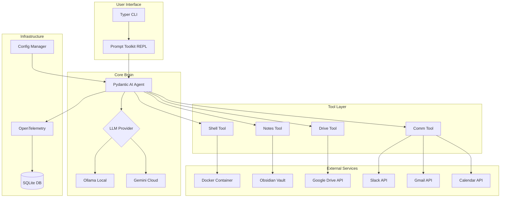

---

## 3. Processing Flow

### 3.1 Chat Session Flow

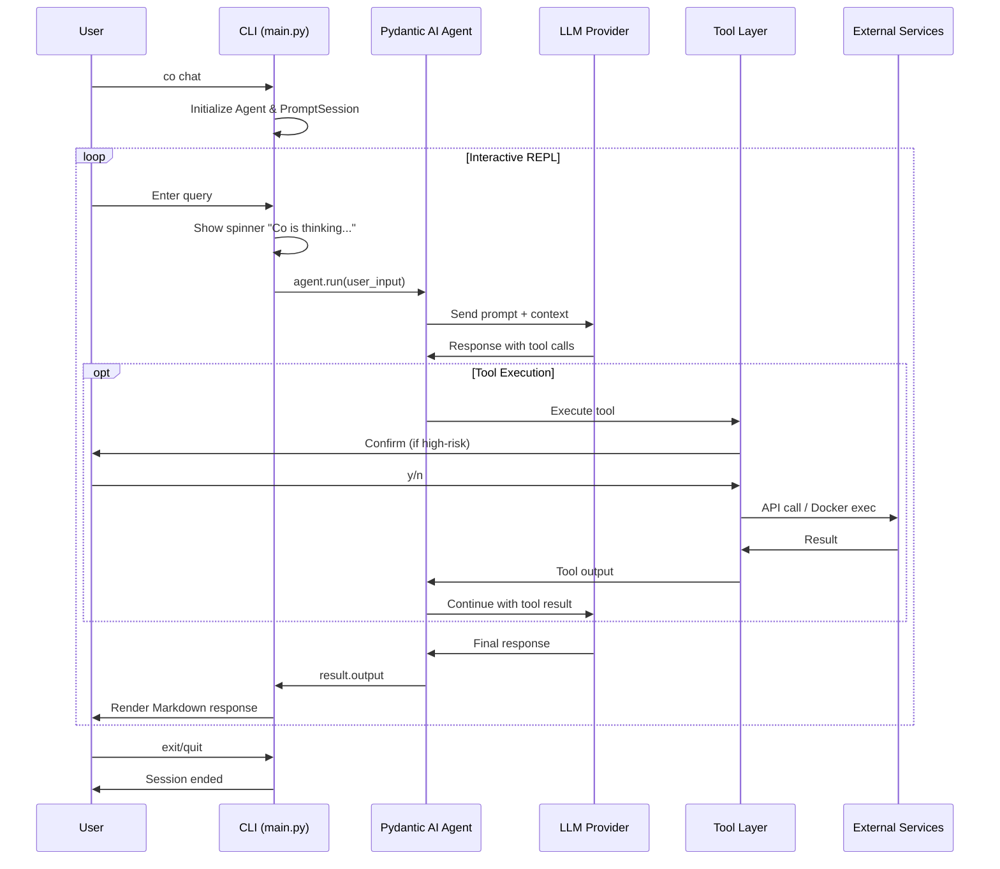

### 3.2 Tool Execution Flow (Shell Example)

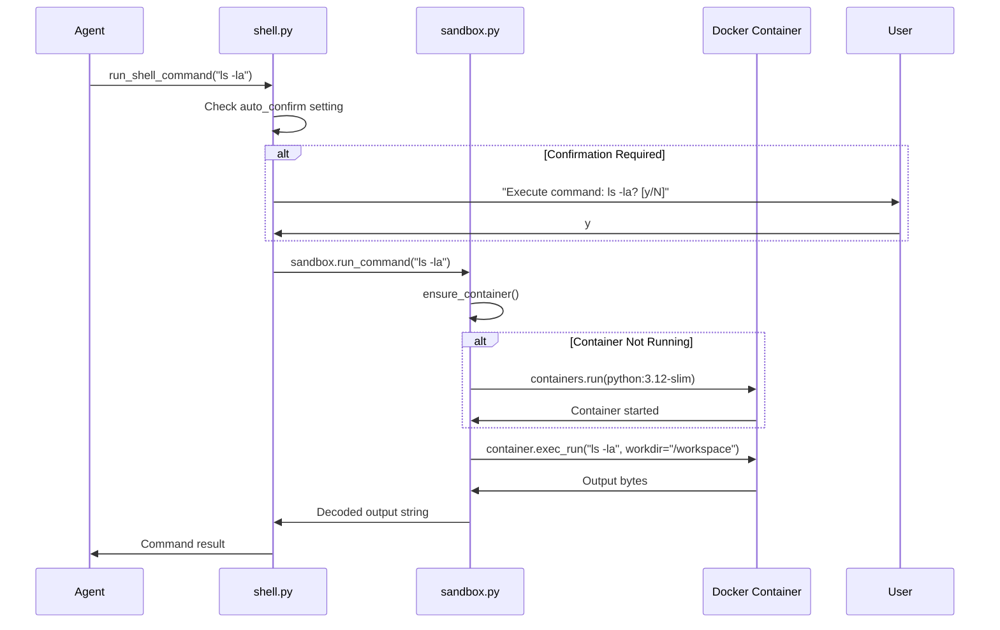

---

## 4. Core Components

### 4.1 Agent (`co_cli/agent.py`)

The Agent is the central orchestrator that connects the LLM to tools.

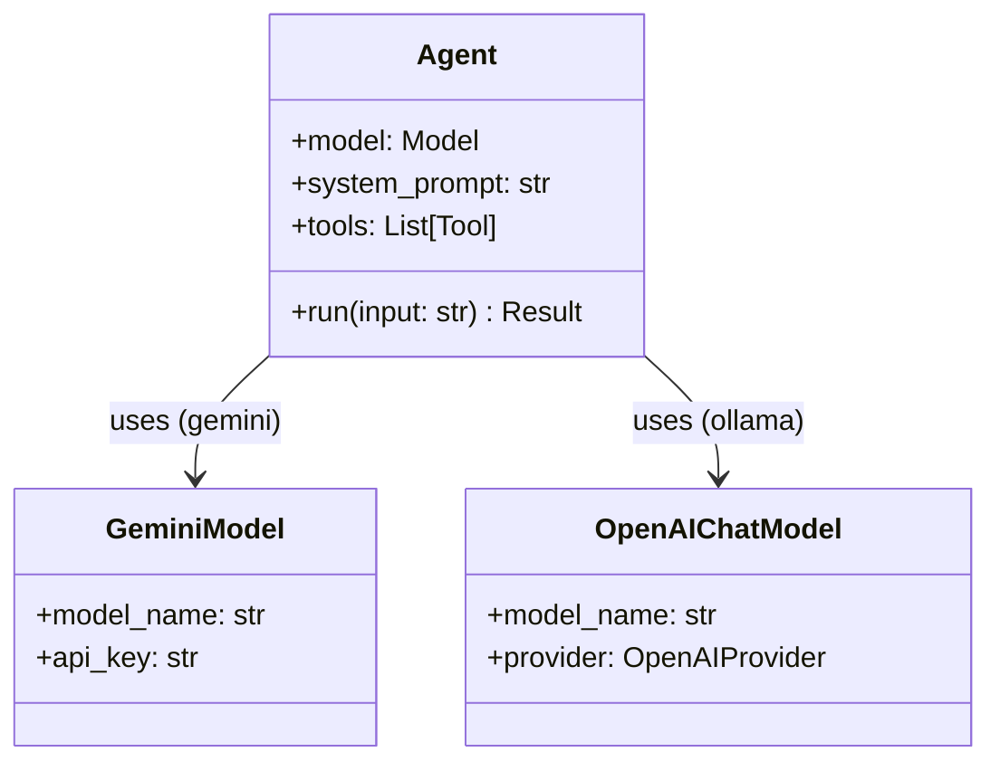

**Factory Function: `get_agent()`**

```python
def get_agent() -> Agent:
    # 1. Read provider from settings
    provider_name = settings.llm_provider.lower()

    # 2. Initialize appropriate model
    if provider_name == "gemini":
        model = GeminiModel(model_name, api_key)
    else:
        # Ollama via OpenAI-compatible API
        provider = OpenAIProvider(base_url=f"{ollama_host}/v1")
        model = OpenAIChatModel(model_name, provider)

    # 3. Create agent with system prompt
    agent = Agent(model, system_prompt="You are Co...")

    # 4. Register all tools
    agent.tool_plain(run_shell_command)
    agent.tool_plain(list_notes)
    # ... more tools

    return agent
```

**System Prompt:**
```
You are Co, a sarcastic but hyper-competent AI assistant.
You provide concise, useful, and occasionally opinionated help.
You have access to a sandboxed shell tool, local Obsidian notes,
Google Drive, Slack, and Google Workspace (Gmail, Calendar).
```

### 4.2 Configuration (`co_cli/config.py`)

XDG-compliant configuration management with environment variable fallback.

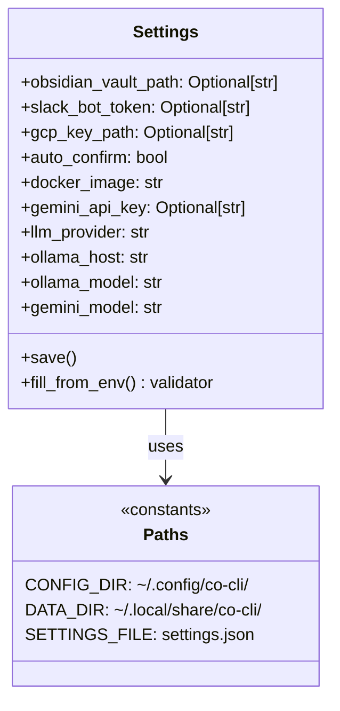

**Configuration Resolution Order:**
1. `~/.config/co-cli/settings.json` (primary)
2. Environment variables (fallback)
3. Default values (hardcoded)

**Environment Variable Mapping:**
| Setting | Env Var | Default |
|---------|---------|---------|
| `llm_provider` | `LLM_PROVIDER` | `"gemini"` |
| `gemini_api_key` | `GEMINI_API_KEY` | `None` |
| `gemini_model` | `GEMINI_MODEL` | `"gemini-2.0-flash"` |
| `ollama_host` | `OLLAMA_HOST` | `"http://localhost:11434"` |
| `ollama_model` | `OLLAMA_MODEL` | `"llama3"` |
| `obsidian_vault_path` | `OBSIDIAN_VAULT_PATH` | `None` |
| `slack_bot_token` | `SLACK_BOT_TOKEN` | `None` |
| `gcp_key_path` | `GCP_KEY_PATH` | `None` |
| `auto_confirm` | `CO_CLI_AUTO_CONFIRM` | `false` |
| `docker_image` | `CO_CLI_DOCKER_IMAGE` | `"python:3.12-slim"` |

### 4.3 Sandbox (`co_cli/sandbox.py`)

Docker-based isolation for safe command execution.

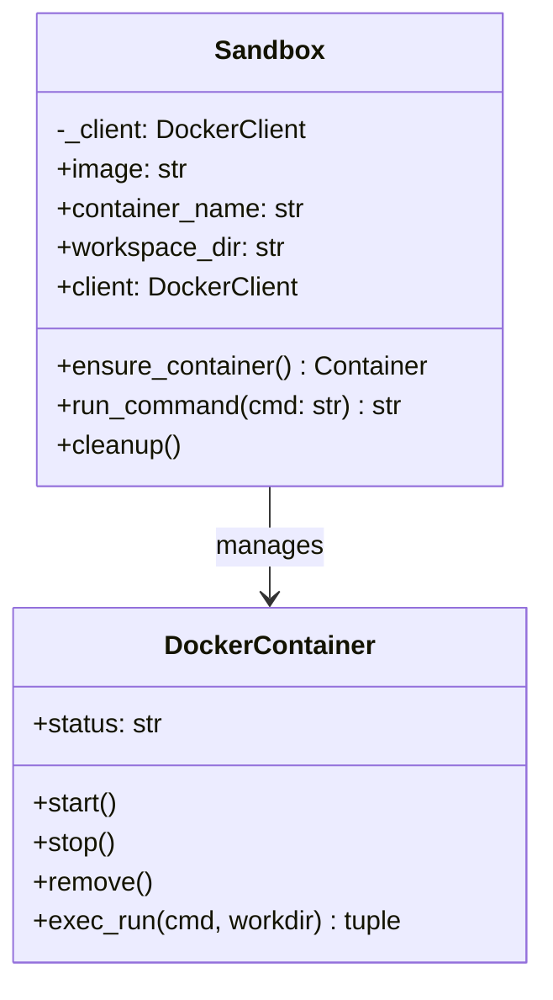

**Container Configuration:**
- **Image:** `python:3.12-slim` (configurable)
- **Name:** `co-runner`
- **Volume:** Current working directory → `/workspace` (read-write)
- **Command:** `sh` (keeps container alive)

**Lifecycle:**
1. On first tool call: Create container if not exists
2. On subsequent calls: Reuse existing container
3. On CLI exit: Container remains for reuse (manual cleanup via `sandbox.cleanup()`)

### 4.4 CLI (`co_cli/main.py`)

Typer-based CLI with three main commands.

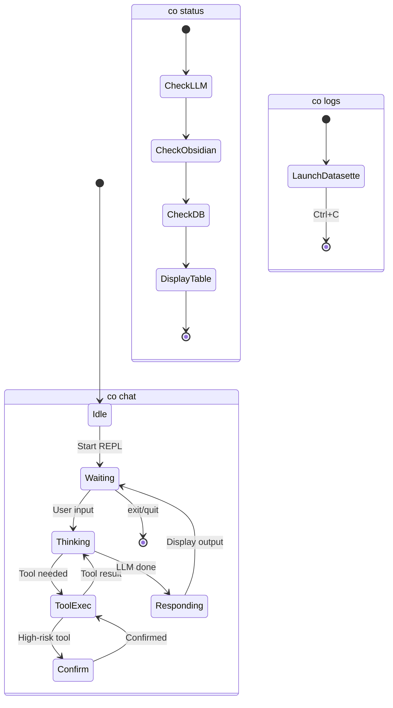

**Commands:**

| Command | Description | Implementation |
|---------|-------------|----------------|
| `co chat` | Interactive REPL | `asyncio.run(chat_loop())` |
| `co status` | System health check | Displays Rich table |
| `co logs` | Telemetry dashboard | Launches Datasette |

**REPL Features:**
- History: Saved to `~/.local/share/co-cli/history.txt`
- Spinner: "Co is thinking..." during inference
- Output: Rendered as Rich Markdown

### 4.5 Telemetry (`co_cli/telemetry.py`)

OpenTelemetry traces exported to local SQLite.

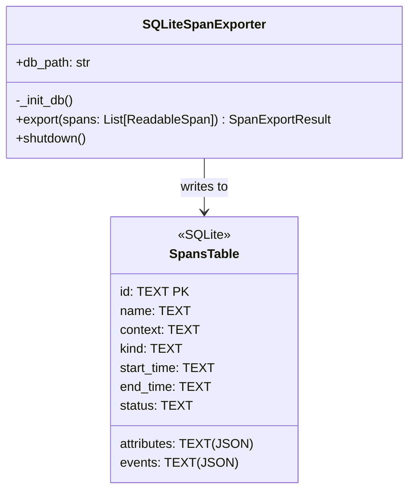

**Schema:**
```sql
CREATE TABLE spans (
    id TEXT PRIMARY KEY,
    name TEXT,
    context TEXT,
    kind TEXT,
    start_time TEXT,
    end_time TEXT,
    attributes TEXT,  -- JSON
    events TEXT,      -- JSON
    status TEXT
)
```

---

## 5. Tool System

### 5.1 Tool Architecture

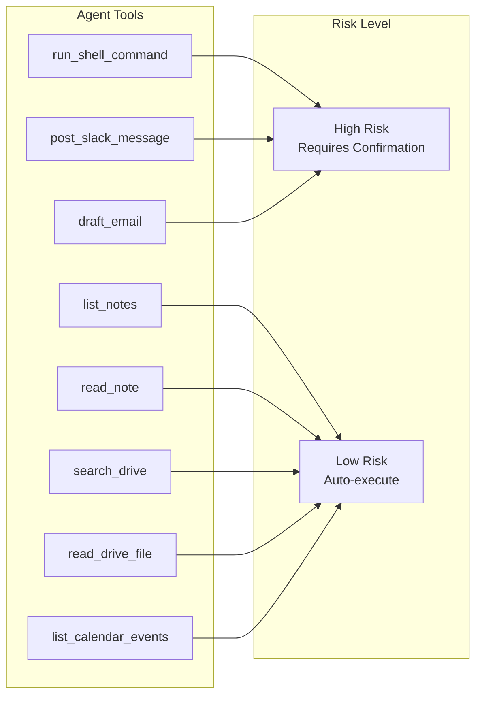

### 5.2 Shell Tool (`co_cli/tools/shell.py`)

```python
def run_shell_command(cmd: str) -> str:
    """Execute a shell command inside a sandboxed Docker container."""
    # 1. Confirmation check
    if not settings.auto_confirm:
        if not typer.confirm(f"Execute command: {cmd}?"):
            return "Command cancelled by user."

    # 2. Execute in sandbox
    return sandbox.run_command(cmd)
```

### 5.3 Notes Tool (`co_cli/tools/notes.py`)

```python
def list_notes(tag: Optional[str] = None) -> List[str]:
    """List markdown notes, optionally filtered by tag."""
    # Glob search: vault_path/**/*.md
    # If tag provided: filter by content containing tag

def read_note(filename: str) -> str:
    """Read note content with directory traversal protection."""
    # Sanitize path with os.path.normpath
    # Verify path starts with vault_path
```

### 5.4 Drive Tool (`co_cli/tools/drive.py`)

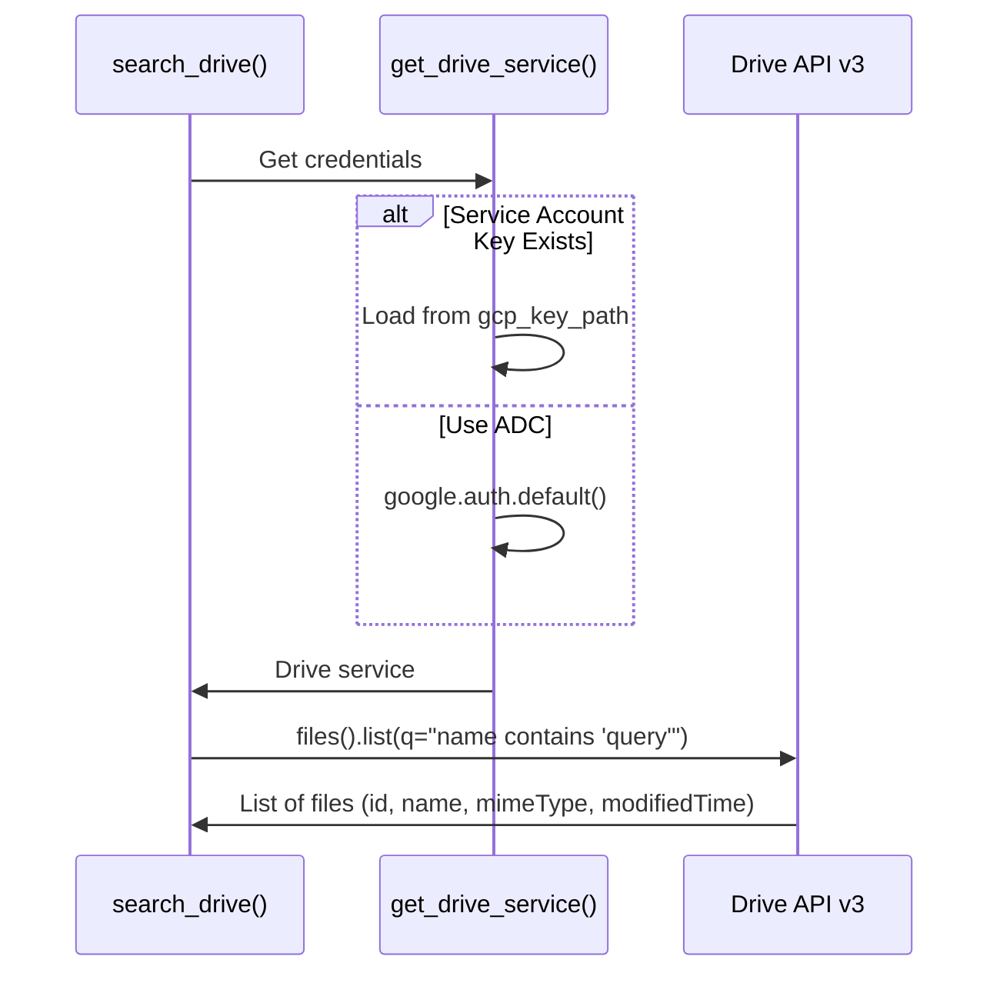

**Hybrid Search Strategy:**
1. **API-Level Filter:** Use Drive API `q` parameter for keyword/metadata filtering
2. **Result:** Returns top 10 matches (no semantic re-ranking in current impl)

### 5.5 Communication Tools (`co_cli/tools/comm.py`)

| Tool | Service | Auth | Confirmation |
|------|---------|------|--------------|
| `post_slack_message` | Slack WebClient | Bot Token | Required |
| `draft_email` | Gmail API | GCP Key/ADC | Required |
| `list_calendar_events` | Calendar API | GCP Key/ADC | Not required |

---

## 6. Concurrency Model

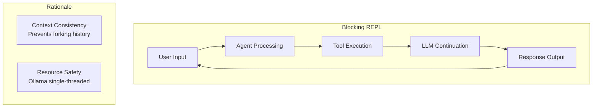

**Design:** Single-threaded, synchronous execution loop.

**Mechanism:**
- Prompt is disabled while agent is "thinking"
- Uses `await agent.run()` inside async loop
- Query N must complete before Query N+1 begins

**Rationale:**
1. Prevents conversation history forking
2. Prevents overloading Ollama (can't handle parallel inference on consumer hardware)

---

## 7. Security Model

### 7.1 Defense Layers

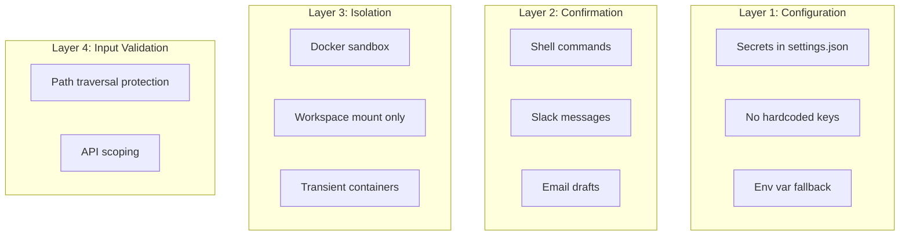

### 7.2 High-Risk Tool Confirmation

```python
# Pattern used in all high-risk tools
if not settings.auto_confirm:
    if not typer.confirm(f"Execute: {action}?", default=False):
        return "Action cancelled by user."
```

**Bypass for Testing:** Set `auto_confirm: true` in settings.

### 7.3 Path Traversal Protection (Notes)

```python
safe_path = os.path.normpath(os.path.join(vault_path, filename))
if not safe_path.startswith(os.path.abspath(vault_path)):
    return "Error: Access denied. File is outside the vault."
```

---

## 8. Data Flow

### 8.1 XDG Directory Structure

```
~/.config/co-cli/
└── settings.json          # User configuration

~/.local/share/co-cli/
├── co-cli.db              # OpenTelemetry traces (SQLite)
└── history.txt            # REPL command history
```

### 8.2 External Service Integration

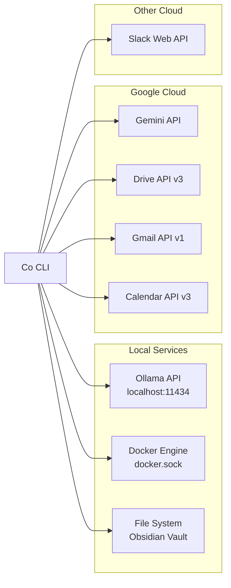

---

## 9. Testing Policy

### Functional Testing Only

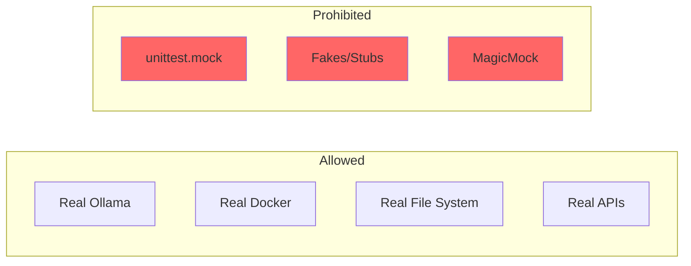

**Rules:**
1. All tests MUST be functional/integration tests
2. NO `unittest.mock`, fakes, or stubs
3. Tests must interact with real services
4. Verify actual side effects, not function calls

**Example Test Pattern:**
```python
# GOOD: Verify real side effect
def test_sandbox_execution():
    sandbox = Sandbox()
    result = sandbox.run_command("echo hello")
    assert "hello" in result

# BAD: Mock verification
def test_sandbox_execution():
    mock_container.exec_run.assert_called_with("echo hello")
```

---

## 10. Dependencies

### Runtime

| Package | Version | Purpose |
|---------|---------|---------|
| `pydantic-ai` | ^1.52.0 | LLM orchestration |
| `typer` | ^0.21.1 | CLI framework |
| `rich` | ^14.3.2 | Terminal UI |
| `prompt-toolkit` | ^3.0.52 | Interactive REPL |
| `docker` | ^7.1.0 | Container management |
| `google-genai` | ^1.61.0 | Gemini API |
| `google-api-python-client` | ^2.189.0 | Drive/Gmail/Calendar |
| `google-auth-oauthlib` | ^1.2.4 | OAuth2 |
| `slack-sdk` | ^3.39.0 | Slack API |
| `opentelemetry-sdk` | ^1.39.1 | Tracing |
| `datasette` | ^0.65.2 | Telemetry dashboard |
| `platformdirs` | ^4.0.0 | XDG paths |

### Development

| Package | Version | Purpose |
|---------|---------|---------|
| `pytest` | ^9.0.2 | Testing framework |
| `pytest-asyncio` | ^1.3.0 | Async test support |

---

## 11. Implementation Status

| Phase | Component | Status |
|-------|-----------|--------|
| 1 | CLI Skeleton + LLM Connection | ✅ Complete |
| 2 | Docker Sandbox | ✅ Complete |
| 3 | Obsidian Notes Tool | ✅ Complete |
| 4 | Google Drive Tool | ✅ Complete |
| 5 | Slack/Gmail/Calendar Tools | ✅ Complete |
| 6 | Telemetry + Datasette | ✅ Complete |
| 7 | Dual-Engine (Gemini) | ✅ Complete |
| 8 | XDG Configuration | ✅ Complete |
| 9 | Functional Testing | ✅ Complete |
