# Co CLI - System Design Document

**Version:** 1.2 (Feb 2026)
**Stack:** Python 3.12+, Pydantic AI, Ollama/Gemini, Docker, UV

---

## 1. System Overview

Co is a production-grade personal assistant CLI that combines local AI inference with cloud services. It provides a privacy-first, sandboxed environment for running AI-powered tasks.

### Design Principles

1. **Privacy-First**: Local LLM (Ollama) by default, all logs stored locally
2. **Safe Execution**: Docker sandbox for shell commands
3. **Observable**: Full OpenTelemetry tracing to local SQLite
4. **Human-in-the-Loop**: Confirmation required for high-risk actions

---

## 2. High-Level Architecture

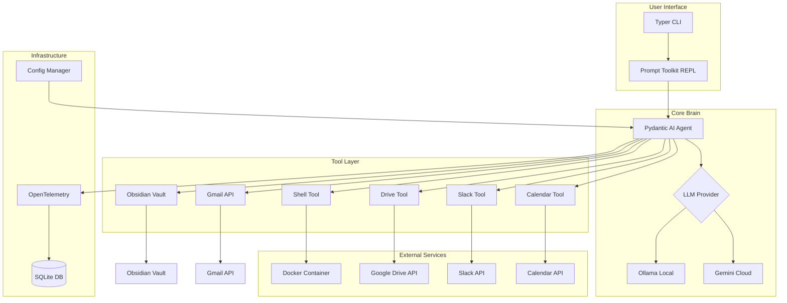

---

## 3. Processing Flow

### 3.1 Chat Session Flow

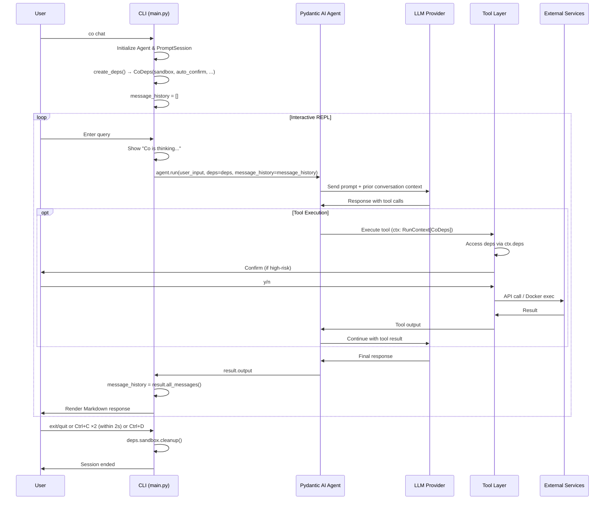

### 3.2 Tool Execution Flow (Shell Example)

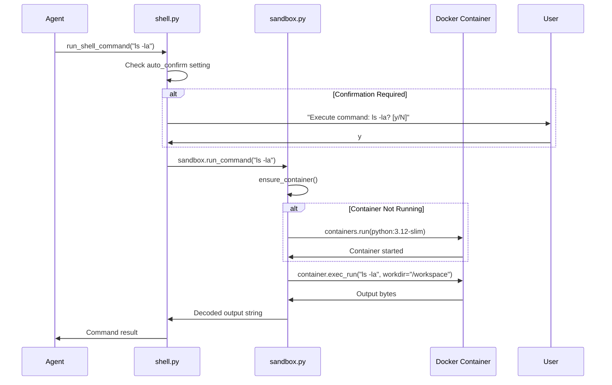

---

## 4. Core Components

### 4.1 Agent (`co_cli/agent.py`)

The Agent is the central orchestrator that connects the LLM to tools. Uses `deps_type=CoDeps` for dependency injection into tools via `RunContext`.

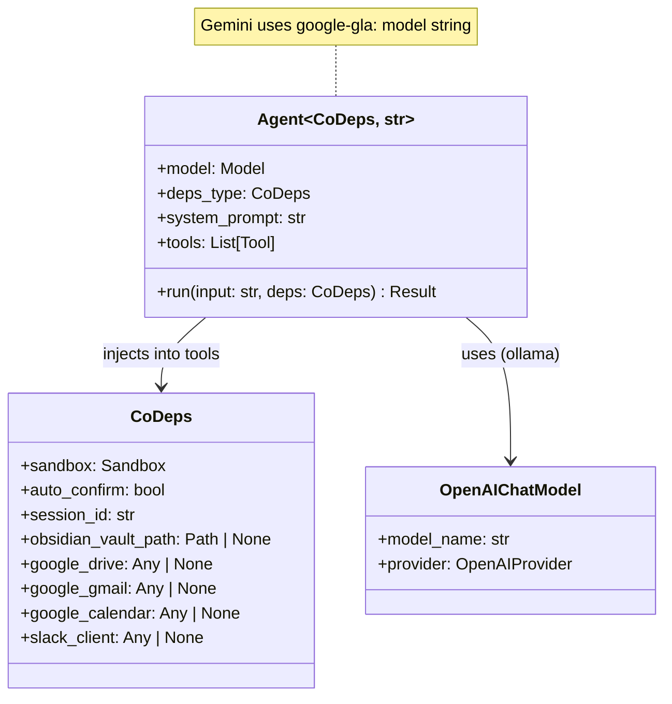

**Factory Function: `get_agent()`**

```python
def get_agent() -> Agent[CoDeps, str]:
    provider_name = settings.llm_provider.lower()

    if provider_name == "gemini":
        # Model string format — pydantic-ai resolves via GEMINI_API_KEY env var
        os.environ.setdefault("GEMINI_API_KEY", settings.gemini_api_key)
        model = f"google-gla:{settings.gemini_model}"
    else:
        # Ollama via OpenAI-compatible API
        provider = OpenAIProvider(base_url=f"{ollama_host}/v1", api_key="ollama")
        model = OpenAIChatModel(model_name, provider)

    agent: Agent[CoDeps, str] = Agent(
        model,
        deps_type=CoDeps,
        system_prompt="You are Co, a CLI assistant...",
    )

    # All tools use RunContext[CoDeps] pattern (Batch 1-4: complete)
    agent.tool(run_shell_command)
    agent.tool(search_notes)
    agent.tool(list_notes)
    agent.tool(read_note)
    agent.tool(search_drive)
    agent.tool(read_drive_file)
    agent.tool(list_emails)
    agent.tool(search_emails)
    agent.tool(draft_email)
    agent.tool(list_calendar_events)
    agent.tool(search_calendar_events)
    agent.tool(post_slack_message)

    return agent
```

**System Prompt:**
```
You are Co, a CLI assistant running in the user's terminal.
- Show tool output directly — don't summarize or paraphrase
- Be terse: users want results, not explanations
- Shell commands run in a Docker sandbox mounted at /workspace
```

### 4.2 Configuration (`co_cli/config.py`)

XDG-compliant configuration management with environment variable fallback.

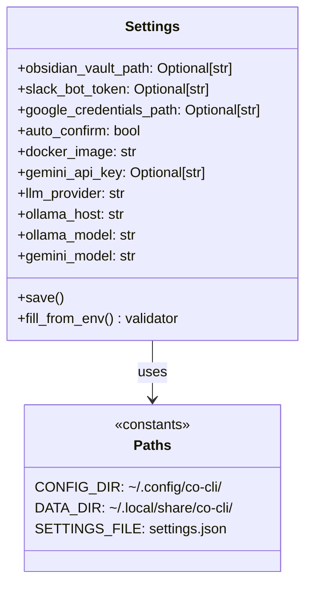

**Configuration Resolution Order:**
1. `~/.config/co-cli/settings.json` (primary)
2. Environment variables (fallback)
3. Default values (hardcoded)

**Environment Variable Mapping:**
| Setting | Env Var | Default |
|---------|---------|---------|
| `llm_provider` | `LLM_PROVIDER` | `"gemini"` |
| `gemini_api_key` | `GEMINI_API_KEY` | `None` |
| `gemini_model` | `GEMINI_MODEL` | `"gemini-2.0-flash"` |
| `ollama_host` | `OLLAMA_HOST` | `"http://localhost:11434"` |
| `ollama_model` | `OLLAMA_MODEL` | `"llama3"` |
| `obsidian_vault_path` | `OBSIDIAN_VAULT_PATH` | `None` |
| `slack_bot_token` | `SLACK_BOT_TOKEN` | `None` |
| `google_credentials_path` | `GOOGLE_CREDENTIALS_PATH` | `None` |
| `auto_confirm` | `CO_CLI_AUTO_CONFIRM` | `false` |
| `docker_image` | `CO_CLI_DOCKER_IMAGE` | `"python:3.12-slim"` |

### 4.3 Dependencies (`co_cli/deps.py`)

Runtime dependencies injected into tools via `RunContext[CoDeps]`. Settings creates these in `main.py`, tools access them via `ctx.deps`.

```python
@dataclass
class CoDeps:
    sandbox: Sandbox
    auto_confirm: bool = False
    session_id: str = ""
    obsidian_vault_path: Path | None = None
    google_drive: Any | None = None
    google_gmail: Any | None = None
    google_calendar: Any | None = None
    slack_client: Any | None = None
```

**Design Principle:** `CoDeps` contains runtime resources, NOT config objects. `Settings` creates resources in `main.py`, then injects here.

**Dependency Flow:**

```
main.py: create_deps()          →  CoDeps(sandbox, vault_path, google_drive, slack_client, ...)
    ↓
agent.run(user_input, deps=deps) →  Agent passes deps to tool calls
    ↓
tool(ctx: RunContext[CoDeps])    →  ctx.deps.sandbox, ctx.deps.google_drive, etc.
```

### 4.4 Sandbox (`co_cli/sandbox.py`)

Docker-based isolation for safe command execution.

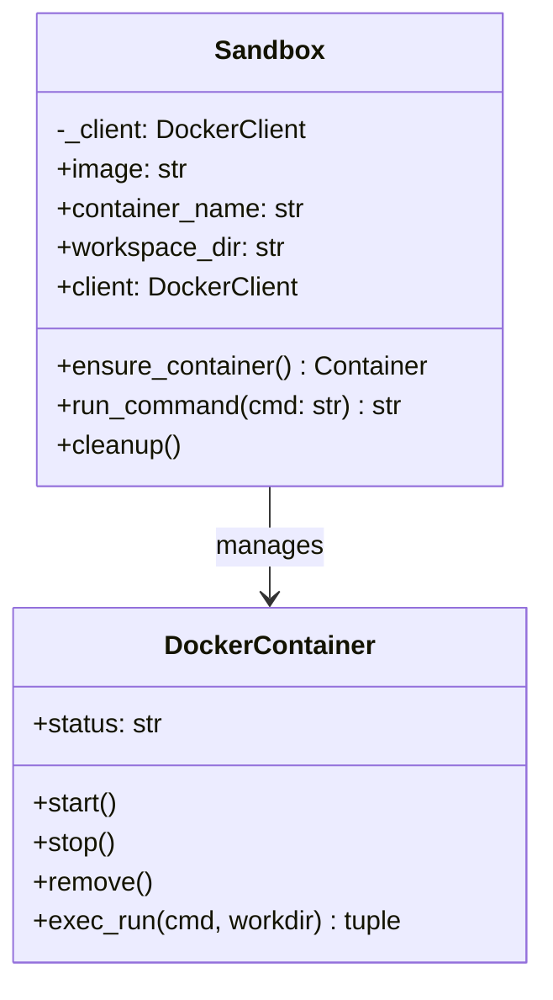

**Container Configuration:**
- **Image:** `python:3.12-slim` (configurable)
- **Name:** `co-runner`
- **Volume:** Current working directory → `/workspace` (read-write)
- **Command:** `sh` (keeps container alive)

**Lifecycle:**
1. On first tool call: Create container if not exists
2. On subsequent calls: Reuse existing container
3. On CLI exit: Container remains for reuse (manual cleanup via `sandbox.cleanup()`)

### 4.5 CLI (`co_cli/main.py`)

Typer-based CLI with three main commands. Owns dependency creation, lifecycle, and conversation memory.

**Dependency Injection + Conversation Memory:**

```python
async def chat_loop():
    agent = get_agent()
    deps = create_deps()  # Settings → CoDeps
    message_history = []  # Accumulates across turns
    try:
        while True:
            result = await agent.run(
                user_input, deps=deps, message_history=message_history
            )
            message_history = result.all_messages()  # Carry full context forward
            console.print(Markdown(result.output))
    finally:
        deps.sandbox.cleanup()  # Container teardown
```

**Conversation Memory:** Each turn's full message history (user prompts, assistant responses, tool calls/results) is accumulated via `result.all_messages()` and passed to the next `agent.run()` call. This gives the LLM full context for follow-up queries like "try again" or "change the subject line". Memory is in-process only — it resets when the session ends.

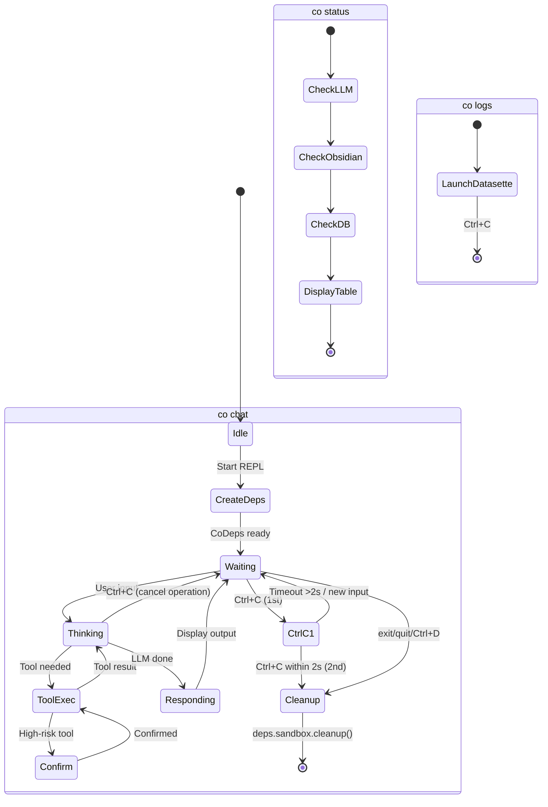

**Commands:**

| Command | Description | Implementation |
|---------|-------------|----------------|
| `co chat` | Interactive REPL | `asyncio.run(chat_loop())` |
| `co status` | System health check | Displays Rich table |
| `co logs` | Telemetry dashboard | Launches Datasette |

**REPL Features:**
- History: Saved to `~/.local/share/co-cli/history.txt`
- Spinner: "Co is thinking..." during inference
- Output: Rendered as Rich Markdown

**Exit Handling (double Ctrl+C pattern):**

Follows Node.js REPL / Aider / Gemini CLI conventions:

| Context | Action | Result |
|---------|--------|--------|
| During `agent.run()` | Ctrl+C | Cancels operation, patches dangling tool calls (§7.6), returns to prompt. Does **not** count toward exit. |
| At prompt | Ctrl+C (1st) | Prints "Press Ctrl+C again to exit" |
| At prompt | Ctrl+C (2nd within 2s) | Exits session |
| At prompt | Ctrl+C (2nd after 2s) | Treated as new 1st press (timeout reset) |
| Any input submitted | — | Resets the interrupt timer |
| Anywhere | Ctrl+D (EOF) | Exits immediately |

### 4.6 Telemetry (`co_cli/telemetry.py`)

OpenTelemetry traces exported to local SQLite.

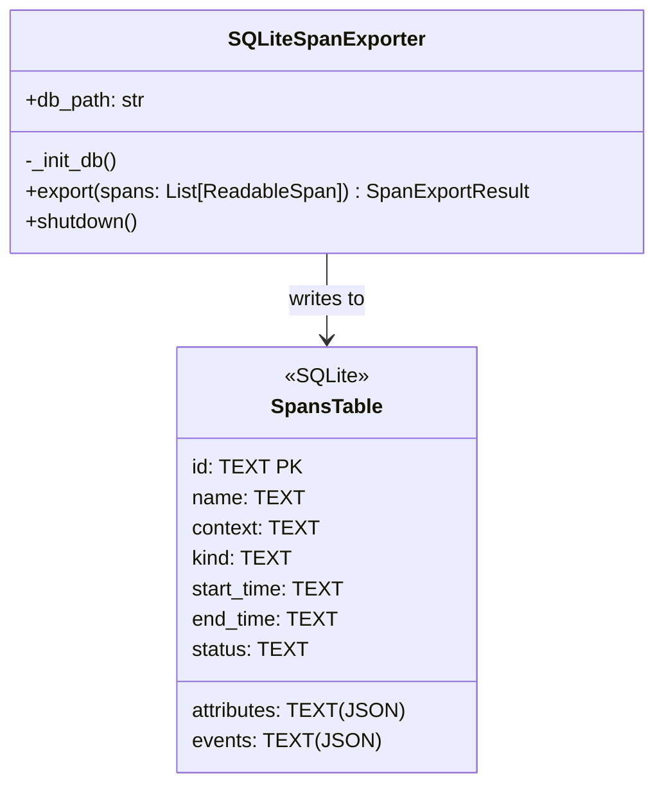

**Schema:**
```sql
CREATE TABLE spans (
    id TEXT PRIMARY KEY,
    name TEXT,
    context TEXT,
    kind TEXT,
    start_time TEXT,
    end_time TEXT,
    attributes TEXT,  -- JSON
    events TEXT,      -- JSON
    status TEXT
)
```

---

## 5. Tool System

### 5.1 Tool Architecture

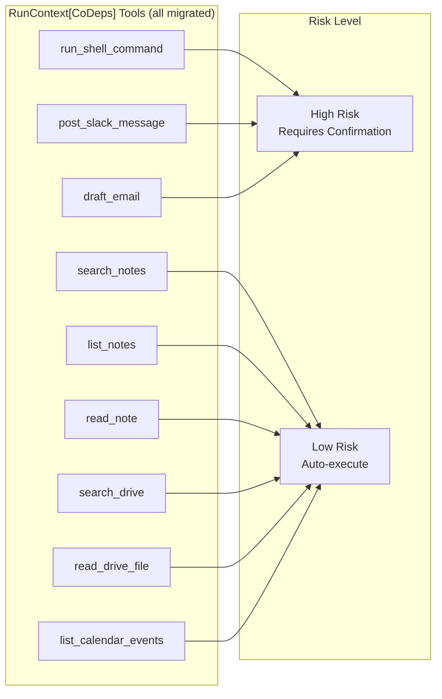

**Tool Registration:** All tools use `agent.tool()` with `RunContext[CoDeps]` pattern. Zero `tool_plain()` remaining.

### 5.2 Shell Tool (`co_cli/tools/shell.py`)

Uses `RunContext[CoDeps]` pattern. See `docs/DESIGN-tool-shell-sandbox.md` for full design.

```python
def run_shell_command(ctx: RunContext[CoDeps], cmd: str) -> str:
    """Execute a shell command in a sandboxed Docker container."""
    if not ctx.deps.auto_confirm:
        if not Confirm.ask(f"Execute command: {cmd}?"):
            return "Command cancelled by user."
    return ctx.deps.sandbox.run_command(cmd)
```

### 5.3 Obsidian Tools (`co_cli/tools/obsidian.py`)

Uses `RunContext[CoDeps]` + `ModelRetry` for self-healing. See `docs/DESIGN-tool-obsidian.md` for full design.

```python
def search_notes(ctx: RunContext[CoDeps], query: str, limit: int = 10) -> list[dict]:
    """Multi-keyword AND search with word boundaries."""
    vault = ctx.deps.obsidian_vault_path
    if not vault or not vault.exists():
        raise ModelRetry("Obsidian vault not configured.")
    # ... regex search with snippets ...

def list_notes(ctx: RunContext[CoDeps], tag: str | None = None) -> list[str]:
    """List markdown notes, optionally filtered by tag."""

def read_note(ctx: RunContext[CoDeps], filename: str) -> str:
    """Read note content with path traversal protection."""
    # Uses pathlib .resolve() + .is_relative_to() for safety
```

### 5.4 Drive Tool (`co_cli/tools/google_drive.py`)

Uses `RunContext[CoDeps]` + `ModelRetry`. Auth is handled at startup via `google_auth.py` → `create_deps()`.

```python
def search_drive(ctx: RunContext[CoDeps], query: str) -> list[dict]:
    service = ctx.deps.google_drive
    if not service:
        raise ModelRetry("Google Drive not configured.")
    # API-level filter with ModelRetry on errors
```

### 5.5 Gmail Tool (`co_cli/tools/google_gmail.py`)

Uses `RunContext[CoDeps]` + `ModelRetry` + `rich.prompt.Confirm` for human-in-the-loop.

### 5.6 Calendar Tool (`co_cli/tools/google_calendar.py`)

Uses `RunContext[CoDeps]` + `ModelRetry`. Read-only, no confirmation needed.

### 5.7 Slack Tool (`co_cli/tools/slack.py`)

Uses `RunContext[CoDeps]` + `ModelRetry` + `rich.prompt.Confirm` for human-in-the-loop.

### 5.8 Google Auth (`co_cli/google_auth.py`)

Infrastructure module (not a tool). Single factory function used by `create_deps()`:

```python
def get_google_credentials(credentials_path, scopes) -> Any | None:
    # Authorized user file → ADC fallback → None
def build_google_service(service_name, version, credentials) -> Any | None:
    # Credentials → service client (or None)
```

**Cloud Tool Summary:**

| Tool | File | Service | Confirmation |
|------|------|---------|--------------|
| `search_drive` | `google_drive.py` | Drive API v3 | No |
| `read_drive_file` | `google_drive.py` | Drive API v3 | No |
| `draft_email` | `google_gmail.py` | Gmail API v1 | Yes |
| `list_calendar_events` | `google_calendar.py` | Calendar API v3 | No |
| `post_slack_message` | `slack.py` | Slack WebClient | Yes |

---

## 6. Concurrency Model

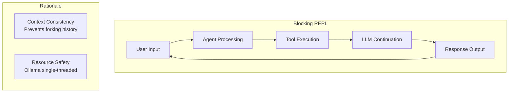

**Design:** Single-threaded, synchronous execution loop.

**Mechanism:**
- Prompt is disabled while agent is "thinking"
- Uses `await agent.run()` inside async loop
- Query N must complete before Query N+1 begins
- `message_history` is updated sequentially after each turn — no risk of forking

**Rationale:**
1. Prevents conversation history forking
2. Prevents overloading Ollama (can't handle parallel inference on consumer hardware)

---

## 7. Conversation Memory

### 7.1 Design

Each chat session maintains an in-process message history that accumulates across turns. This gives the LLM full conversational context for follow-ups like "try again", "change the subject", or "show me more".

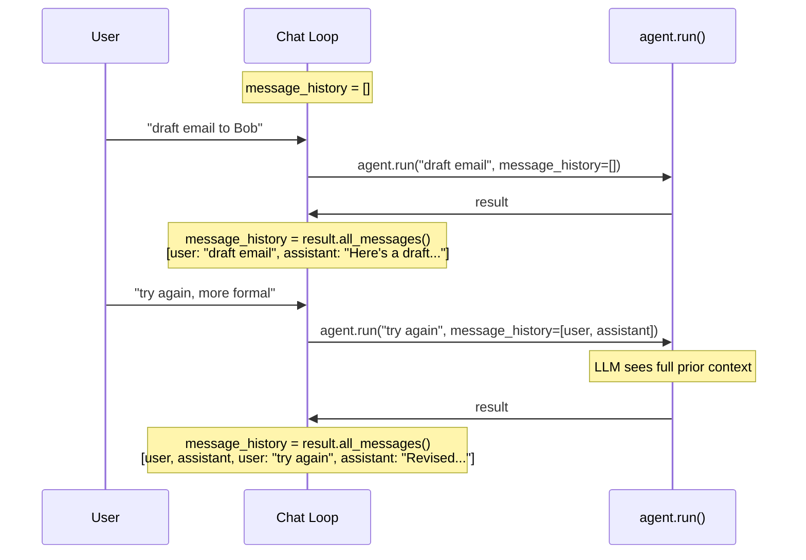

### 7.2 Implementation

Uses pydantic-ai's built-in `message_history` parameter and `result.all_messages()` accessor:

```python
message_history = []
while True:
    result = await agent.run(
        user_input, deps=deps, message_history=message_history
    )
    message_history = result.all_messages()
```

**What's stored in `message_history`:**
- User prompts (`ModelRequest` with `UserPromptPart`)
- Assistant responses (`ModelResponse` with `TextPart`)
- Tool calls and their results (`ToolCallPart`, `ToolReturnPart`)
- System prompt is sent separately by the agent on each call, not in history

### 7.3 Scope & Limitations

| Aspect | Current Design |
|--------|---------------|
| **Lifetime** | In-process only — resets when the session ends |
| **Persistence** | None. History is not saved to disk or database. |
| **Size management** | Unbounded — grows with each turn. For long sessions, the LLM's context window is the natural limit. |
| **Cross-session** | Not supported. Each `co chat` invocation starts fresh. |
| **Concurrency** | Sequential updates only — single-threaded loop prevents forking (see §6). |

### 7.4 History Length Control

Pydantic-ai provides `history_processors` — a list of callables that transform `message_history` before sending to the model. There is **no built-in max length, sliding window, or summarization**. If history exceeds the LLM's context window, the API call fails.

**Available hook:**

```python
from pydantic_ai import Agent, RunContext
from pydantic_ai.messages import ModelMessage

def trim_history(messages: list[ModelMessage]) -> list[ModelMessage]:
    """Keep first 2 messages (system setup) + last N messages."""
    MAX_MESSAGES = 20
    if len(messages) > MAX_MESSAGES:
        return messages[:2] + messages[-(MAX_MESSAGES - 2):]
    return messages

agent = Agent(model, history_processors=[trim_history])
```

**Current co-cli status:** No `history_processors` configured — history is unbounded. For typical interactive sessions (< 50 turns) this is fine. A processor should be added when long sessions become common.

### 7.5 Interrupt Recovery (Dangling Tool Call Patching)

When the user presses Ctrl+C during `agent.run()`, the LLM may have been mid-tool-call. If `message_history` contains a `ModelResponse` with a `ToolCallPart` but no matching `ToolReturnPart`, the next `agent.run()` call would fail because the LLM sees an unanswered tool call.

**Mitigation:** `_patch_dangling_tool_calls()` scans the last message in history after a `KeyboardInterrupt`. If it's a `ModelResponse` containing `ToolCallPart`s, the function appends a synthetic `ModelRequest` with `ToolReturnPart`(s) carrying an "Interrupted by user." error message.

```python
def _patch_dangling_tool_calls(messages, error_message="Interrupted by user."):
    last_msg = messages[-1]
    if last_msg.kind != "response":
        return messages
    tool_calls = [p for p in last_msg.parts if isinstance(p, ToolCallPart)]
    if not tool_calls:
        return messages
    return_parts = [
        ToolReturnPart(tool_name=tc.tool_name, tool_call_id=tc.tool_call_id, content=error_message)
        for tc in tool_calls
    ]
    return messages + [ModelRequest(parts=return_parts)]
```

**Why this works:** Wrapping `ToolReturnPart`s in a `ModelRequest` is the same pattern pydantic-ai uses internally in `_agent_graph.py:_handle_final_result()`, which explicitly comments: *"To allow this message history to be used in a future run without dangling tool calls, append a new ModelRequest using the tool returns and retries."*

**Current behavior note:** `agent.run()` copies the input list (`list(message_history)`), so on `KeyboardInterrupt` the original `message_history` is unchanged from the previous successful turn — no dangling calls exist. The patch is defensive: it protects against future adoption of `agent.iter()` or streaming where partial state may leak into the caller's list.

### 7.6 Future Considerations

- **Sliding window**: Register a `history_processor` with message count or token-based trimming
- **Persistence**: Save history to SQLite (alongside OTel traces) to enable session resume
- **Tool output trimming**: Large tool outputs (e.g., file contents) could be summarized in history to save context space

---

## 8. Security Model


### 8.1 Defense Layers

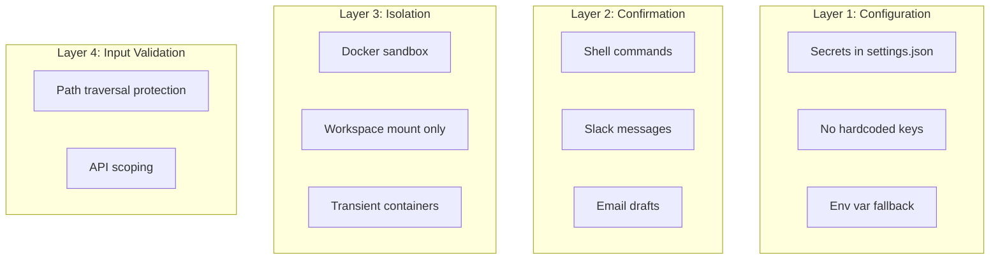

### 8.2 High-Risk Tool Confirmation

```python
# All tools use RunContext pattern
if not ctx.deps.auto_confirm:
    if not Confirm.ask(f"Execute: {action}?", default=False, console=_console):
        return "Action cancelled by user."
```

**Bypass for Testing:** Set `auto_confirm: true` in settings.

### 8.3 Path Traversal Protection (Obsidian)

```python
safe_path = (vault / filename).resolve()
if not safe_path.is_relative_to(vault.resolve()):
    raise ModelRetry("Access denied: path is outside the vault.")
```

---

## 9. Data Flow

### 9.1 XDG Directory Structure

```
~/.config/co-cli/
└── settings.json          # User configuration

~/.local/share/co-cli/
├── co-cli.db              # OpenTelemetry traces (SQLite)
└── history.txt            # REPL command history
```

### 9.2 External Service Integration

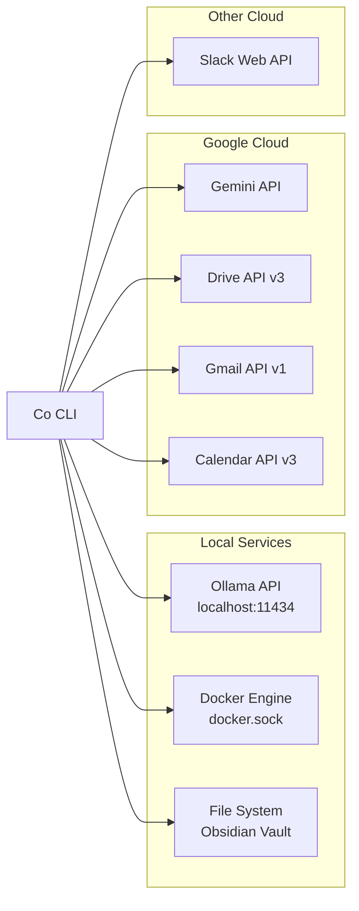

---

## 10. Testing Policy

### Functional Testing Only

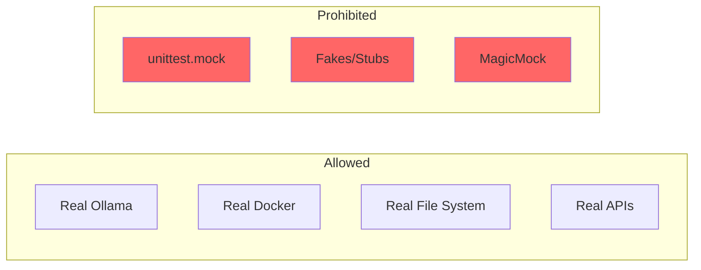

**Rules:**
1. All tests MUST be functional/integration tests
2. NO `unittest.mock`, fakes, or stubs
3. Tests must interact with real services
4. Verify actual side effects, not function calls

**Example Test Pattern:**
```python
# GOOD: Verify real side effect
def test_sandbox_execution():
    sandbox = Sandbox()
    result = sandbox.run_command("echo hello")
    assert "hello" in result

# BAD: Mock verification
def test_sandbox_execution():
    mock_container.exec_run.assert_called_with("echo hello")
```

---

## 11. Dependencies

### Runtime

| Package | Version | Purpose |
|---------|---------|---------|
| `pydantic-ai` | ^1.52.0 | LLM orchestration |
| `typer` | ^0.21.1 | CLI framework |
| `rich` | ^14.3.2 | Terminal UI |
| `prompt-toolkit` | ^3.0.52 | Interactive REPL |
| `docker` | ^7.1.0 | Container management |
| `google-genai` | ^1.61.0 | Gemini API |
| `google-api-python-client` | ^2.189.0 | Drive/Gmail/Calendar |
| `google-auth-oauthlib` | ^1.2.4 | OAuth2 |
| `slack-sdk` | ^3.39.0 | Slack API |
| `opentelemetry-sdk` | ^1.39.1 | Tracing |
| `datasette` | ^0.65.2 | Telemetry dashboard |

### Development

| Package | Version | Purpose |
|---------|---------|---------|
| `pytest` | ^9.0.2 | Testing framework |
| `pytest-asyncio` | ^1.3.0 | Async test support |

---

## 12. Implementation Status

### Features

| Phase | Component | Status |
|-------|-----------|--------|
| 1 | CLI Skeleton + LLM Connection | ✅ Complete |
| 2 | Docker Sandbox | ✅ Complete |
| 3 | Obsidian Notes Tool | ✅ Complete |
| 4 | Google Drive Tool | ✅ Complete |
| 5 | Slack/Gmail/Calendar Tools | ✅ Complete |
| 6 | Telemetry + Datasette | ✅ Complete |
| 7 | Dual-Engine (Gemini) | ✅ Complete |
| 8 | XDG Configuration | ✅ Complete |
| 9 | Functional Testing | ✅ Complete |

### Pydantic AI Best Practices Migration

| Batch | Focus | Status |
|-------|-------|--------|
| 1 | Shell tool + CoDeps foundation (`deps.py`, `RunContext`, `create_deps()`) | ✅ Complete |
| 2 | Obsidian tools (`ModelRetry`, `obsidian_vault_path` in deps) | ✅ Complete |
| 3-4 | Google tools + Slack (`google_auth.py`, all tools → `RunContext`, `comm.py` deleted) | ✅ Complete |
| 5 | Cleanup: zero `tool_plain()`, zero global `settings` in tools, `tools/__init__.py` docstring-only | ✅ Complete |
| 6 | `requires_approval=True` + `DeferredToolRequests` | ⬜ Deferred |

See `docs/TODO-approval-flow.md` for remaining migration details.
