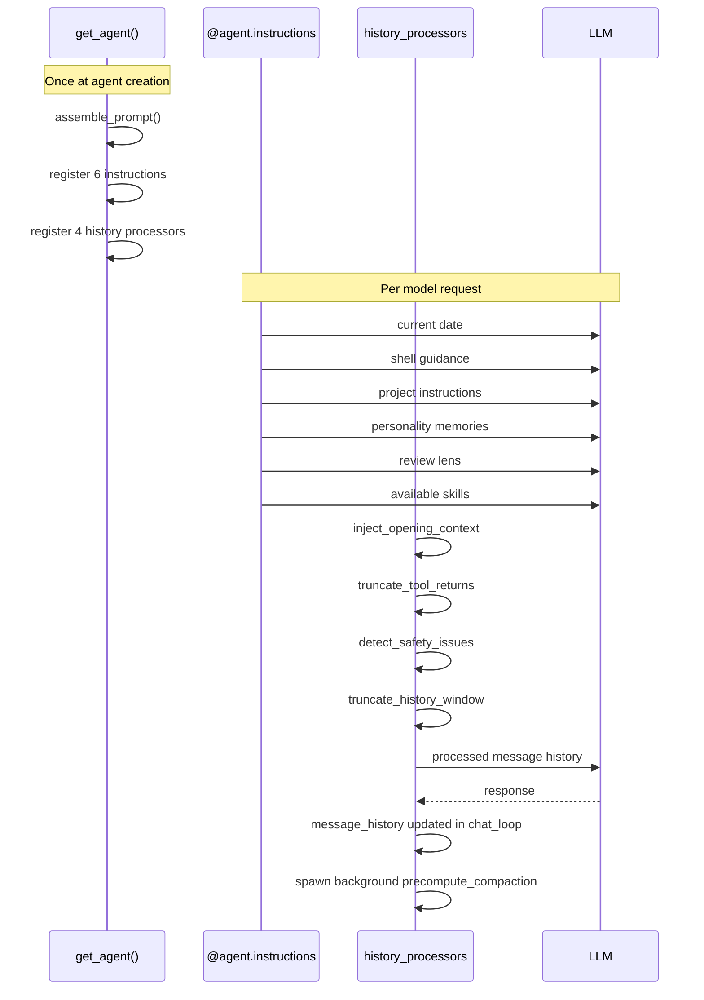

# Design: Context Engineering

## 1. What & How

This doc is the canonical spec for co-cli's context engineering layer: static prompt assembly at agent creation, per-request instruction layering, history processor transforms, context-budget controls, and message-history lifecycle over a session.

Scope boundary:
- In scope: prompt composition, per-turn context injection, memory/context recall injection, tool-output trimming, safety interventions in history, summarization/compaction, and history repair.
- Out of scope: overall system architecture in [DESIGN-system.md](DESIGN-system.md), end-to-end turn orchestration and approval mechanics in [DESIGN-core-loop.md](DESIGN-core-loop.md), and personality content design in [DESIGN-personality.md](DESIGN-personality.md).

## 2. Component in System Architecture

```mermaid
graph TD
    U[User input] --> C[chat_loop main.py]
    C --> O[run_turn _orchestrate.py]
    O --> A[agent.run_stream_events]

    GA[get_agent agent.py] --> SP[assemble_prompt static]
    GA --> INS[@agent.instructions per request]
    GA --> HP[history_processors]

    SP --> A
    INS --> A
    HP --> A

    HP --> M[recall_memory]
    HP --> S[summary agent]

    A --> T[tool calls]
    T --> AP[_handle_approvals]
    AP --> A

    A --> H[message_history]
    H --> C
```

Upstream dependencies:
- `co_cli/agent.py` builds the agent, static system prompt, and per-request instruction layers.
- `co_cli/prompts/__init__.py` assembles soul, rules, examples, and model quirks.
- `co_cli/deps.py` and `co_cli/config.py` provide runtime state and context-governance thresholds.
- `co_cli/main.py` owns session message history and precomputed compaction task joins/spawns.

Downstream consumers:
- The main agent consumes the static prompt, per-request instructions, and processed history before every model request.
- Slash commands such as `/compact`, `/clear`, `/history`, and `/new` mutate or inspect the same history model.

Cross-component touchpoints:
- Memory retrieval is delegated to `recall_memory` and injected back as prompt context.
- Provider/model selection for summarization follows `role_models["summarization"]` and falls back to the primary model. See [DESIGN-llm-models.md](DESIGN-llm-models.md).
- Approval re-entry and streamed tool preambles are executed in [DESIGN-core-loop.md](DESIGN-core-loop.md), but depend on the same history integrity guarantees described here.

## 3. Flows



### Static prompt assembly

`get_agent()` calls `assemble_prompt()` once and passes the result to `Agent(system_prompt=...)`.

Assembly order:

```text
1. Build soul block in get_agent():
   load_soul_seed(personality)
   load_character_memories(personality, memory_dir)
   load_soul_mindsets(personality)

2. assemble_prompt(provider, model_name, soul_seed, soul_examples):
   prepend soul block
   append rules/NN_*.md in numeric order
   append souls/{role}/examples.md when present
   append quirks/{provider}/{model}.md when present
```

Static contents:
- Soul seed: identity declaration, traits, and "Never" constraints.
- Character base memories: planted, decay-protected grounding.
- All six mindset files for the active role.
- Ordered behavioral rules from `prompts/rules/*.md`.
- Optional examples and model-specific counter-steering.

Failure and fallback behavior:
- Missing optional examples or quirks are ignored.
- Rule filenames must validate as contiguous `NN_*` ordering; invalid rule structure is treated as prompt-assembly failure at agent build time.

### Per-request instruction layers

Six `@agent.instructions` functions run before every model request and append conditional system-prompt material in registration order.

```text
1. add_current_date
2. add_shell_guidance
3. add_project_instructions
4. add_personality_memories
5. inject_personality_critique
6. add_available_skills
```

Behavior:
- `add_current_date`: always injects the current date.
- `add_shell_guidance`: always reminds the model that shell approval is gated.
- `add_project_instructions`: injects `.co-cli/instructions.md` when present.
- `add_personality_memories`: loads up to five `personality-context` memories by recency.
- `inject_personality_critique`: injects the role critique lens when configured.
- `add_available_skills`: injects `/name - description` entries from `skill_registry`, capped at 2 KB.

Failure and fallback behavior:
- Any layer with missing or empty source material contributes nothing.
- Skill injection is truncated rather than allowing registry size to consume the context budget.

### History processor chain

The registered processor order is:

```text
[inject_opening_context, truncate_tool_returns, detect_safety_issues, truncate_history_window]
```

#### `inject_opening_context`

On a new user turn, this processor performs proactive memory recall and appends a sibling `SystemPromptPart` containing relevant memories.

```text
detect new user prompt
call recall_memory(user_text, max_results=3)
re-rank with temporal decay
touch matched memory timestamps
append "Relevant memories:\n..."
```

Fallback:
- If no memories match, history is unchanged.

#### `truncate_tool_returns`

This trims large older `ToolReturnPart` payloads while protecting the most recent two messages.

```text
for each older ToolReturnPart:
  if len(content) > tool_output_trim_chars:
    replace with truncated marker
```

Fallback:
- `tool_output_trim_chars = 0` disables this processor.

#### `detect_safety_issues`

This injects guardrail prompt parts when the model appears stuck in a doom loop or shell-reflection spiral.

```text
hash current ToolCallPart payloads
if repeated >= doom_loop_threshold:
  inject doom-loop intervention
if consecutive shell errors >= max_reflections:
  inject shell-reflection intervention
```

Fallback:
- If no intervention threshold is hit, history is unchanged.

#### `truncate_history_window`

This is the sliding-window summarization processor used when message count or estimated token budget exceeds thresholds.

```text
trigger when:
  len(messages) > max_history_messages
  OR estimated tokens > 85% budget

split history into head + dropped middle + tail
reuse precomputed summary when valid
else summarize dropped middle with summarization model
inject summary marker between head and tail
```

Fallback:
- If summarization fails, inject a static trim marker instead of failing the turn.
- If no summarization model is configured, use the primary model.

### Session history lifecycle

`chat_loop` owns `message_history` as a plain list and passes it to `run_turn()` each cycle.

Normal cycle:

```text
1. start with empty or restored message_history
2. join any pending precompute_compaction task
3. call run_turn(...)
4. replace message_history with turn_result.messages
5. spawn a new precompute_compaction task
```

Background precompute thresholds:
- Message count greater than 80% of `max_history_messages`
- Estimated token count greater than 70% of the internal token budget

Interrupt repair:

```text
scan all messages for ToolCallPart without matching ToolReturnPart
append synthetic ToolReturnPart("Interrupted by user.")
append abort marker
```

Approval interaction:
- Approved tools add natural `ToolCallPart` and `ToolReturnPart` pairs on resume.
- Denied tools receive synthetic `ToolDenied` results so history remains structurally valid.
- Mid-approval interrupts rely on the same dangling-call repair path.

### Slash command effects

| Command | Effect on history |
|---------|-------------------|
| `/clear` | Resets history to `[]` |
| `/compact` | Replaces history with a compacted two-message summary exchange |
| `/history` | Read-only inspection; no mutation |
| `/new` | Summarizes recent history to session memory, then clears history |

## 4. Core Logic

Design rules:
- The static prompt defines durable identity and behavior policy.
- Per-request instructions inject small, current, and conditional context.
- Knowledge and most memory remain tool-loaded rather than embedded in the base prompt.
- History processors are the primary mechanism for protecting context budget without changing visible user intent.
- History integrity is mandatory: every tool call in stored history must have a matching terminal result or a synthetic repair record.

Data and contract notes:
- `message_history` is the canonical turn transcript stored across the session.
- `deps.runtime.precomputed_compaction` caches a summary only when it still matches the current history snapshot.
- `deps.runtime.opening_ctx_state` debounces proactive recall across a user turn.
- `deps.runtime.safety_state` is reset per turn and tracks repeated tool-call and shell-error patterns.

Known limitations:
- Token estimation uses a simple chars-to-token heuristic rather than provider-native token counting.
- Context-budget thresholds assume a fixed internal budget and are not dynamically model-window aware.
- Personality learned-context injection is recency-based and not semantic-ranked.

## 5. Config

| Setting | Env Var | Default | Description |
|---------|---------|---------|-------------|
| `max_request_limit` | `CO_CLI_MAX_REQUEST_LIMIT` | `50` | Max model requests per user turn (`UsageLimits.request_limit`) |
| `model_http_retries` | `CO_CLI_MODEL_HTTP_RETRIES` | `2` | Provider/network retry budget per turn |
| `doom_loop_threshold` | `CO_CLI_DOOM_LOOP_THRESHOLD` | `3` | Consecutive identical tool calls before intervention |
| `max_reflections` | `CO_CLI_MAX_REFLECTIONS` | `3` | Consecutive shell error threshold before intervention |
| `tool_retries` | `CO_CLI_TOOL_RETRIES` | `3` | Agent-level tool retry limit |
| `tool_output_trim_chars` | `CO_CLI_TOOL_OUTPUT_TRIM_CHARS` | `2000` | Max chars per older `ToolReturnPart`; `0` disables trimming |
| `max_history_messages` | `CO_CLI_MAX_HISTORY_MESSAGES` | `40` | Message-count trigger for sliding-window compaction; `0` disables |
| `role_models["summarization"]` | `CO_MODEL_ROLE_SUMMARIZATION` | `[]` | Summarization model chain; head used for auto-compaction, fallback is primary |
| `personality` | `CO_CLI_PERSONALITY` | `"finch"` | Personality preset used for soul content and learned-context injection |
| `session_ttl_minutes` | `CO_SESSION_TTL_MINUTES` | `60` | Session persistence TTL in minutes |
| `role_models` | `CO_MODEL_ROLE_REASONING`, `CO_MODEL_ROLE_CODING`, `CO_MODEL_ROLE_RESEARCH`, `CO_MODEL_ROLE_ANALYSIS` | provider default for `reasoning` | Role model chains; `reasoning` is the main-agent role |

## 6. Files

| File | Purpose |
|------|---------|
| `co_cli/agent.py` | Agent factory, static prompt assembly call, per-request `@agent.instructions` layers |
| `co_cli/prompts/__init__.py` | Static prompt assembly from soul, rules, examples, and quirks |
| `co_cli/prompts/model_quirks.py` | Model-specific counter-steering and inference metadata |
| `co_cli/_history.py` | History processors, summarization, and context-governance logic |
| `co_cli/_orchestrate.py` | Stream handling, approval resume path, and interrupt repair helpers |
| `co_cli/main.py` | Session loop, slash dispatch, history ownership, and background compaction trigger |
| `co_cli/_commands.py` | Slash command handlers that inspect or rewrite history |
| `co_cli/_session.py` | Session persistence and compaction count tracking |
| `co_cli/config.py` | Context-governance settings and model-role configuration |
| `co_cli/deps.py` | Runtime state consumed by instructions and history processors |
| `docs/DESIGN-system.md` | System-level architecture and integration map |
| `docs/DESIGN-core-loop.md` | End-to-end turn execution, approval loop, and streaming behavior |
| `docs/DESIGN-personality.md` | Personality content sources and injection semantics |
| `docs/DESIGN-llm-models.md` | Provider/model selection and summarization model configuration |
| `tests/test_history.py` | Functional coverage for processors, summarization, and `/compact` |
