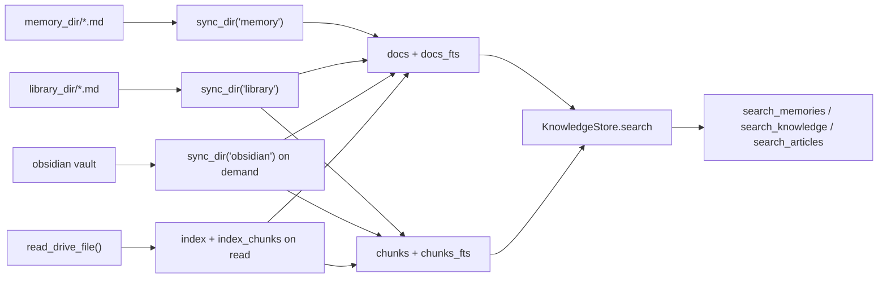

# Co CLI — Context & Session Design

Covers how co-cli assembles prompt context, governs in-session history, persists sessions and transcripts, and routes knowledge retrieval. Startup sequencing lives in [DESIGN-system.md](DESIGN-system.md), one-turn orchestration in [DESIGN-core-loop.md](DESIGN-core-loop.md), tool contracts in [DESIGN-tools.md](DESIGN-tools.md).

## 1. What & How

The agent has no persistent state in model weights. Context is split across three layers with different lifecycles:

- **Static instructions**: assembled once at agent construction
- **Dynamic instruction layers**: evaluated fresh on every model request
- **Message history**: transformed before every request by ordered history processors

Persistent context lives outside the model:

- workspace-local memories in `.co-cli/memory/`
- character memories and mindsets in `co_cli/prompts/personalities/souls/{role}/` (read-only system assets)
- user-global articles in `library_dir`
- session metadata and append-only transcripts in `.co-cli/sessions/`
- a rebuildable `KnowledgeStore` at `knowledge_db_path`

```mermaid
flowchart TD
    subgraph Build["agent construction"]
        Static[build_static_instructions]
        MainAgent[build_agent]
        Static --> MainAgent
    end

    subgraph MainRequest["main-agent request"]
        Dynamic[@agent.instructions]
        Processors[history processors 1..5]
        Model[model request]
        Dynamic --> Processors --> Model
    end

    subgraph ResumeRequest["task-agent resume"]
        ResumeModel[resume request]
    end

    Finalize[_finalize_turn]

    subgraph Storage["persistent stores"]
        Memories[".co-cli/memory/*.md"]
        Library["library_dir/*.md"]
        Sessions[".co-cli/sessions/*.json + *.jsonl"]
        Index["KnowledgeStore / co-cli-search.db"]
    end

    MainAgent --> MainRequest
    TaskAgent --> ResumeRequest
    Model --> Finalize
    ResumeModel --> Finalize
    Finalize --> Sessions
    Finalize --> Memories
    Memories --> Index
    Library --> Index
```

## 2. Core Logic

### 2.1 Prompt Layers

**Static instructions** — `build_static_instructions()` assembles in fixed order:

1. Soul seed from `souls/{role}/seed.md`
2. Character memories from `co_cli/prompts/personalities/souls/{role}/memories/*.md` (read-only system assets)
3. Mindsets from `co_cli/prompts/personalities/souls/{role}/mindsets/{task_type}.md`
4. Numbered rules from `co_cli/prompts/rules/NN_rule_id.md` (contiguous from 01, unique prefixes)
5. Examples from `souls/{role}/examples.md` (optional)
6. Model-specific counter-steering
7. Critique appended as `## Review lens` (optional)

Each personality role is fully self-contained under `souls/{role}/`. Adding a role requires only a new directory — no Python changes.

**Dynamic instruction layers** — registered in `build_agent()`, evaluated fresh per request:

| Layer | Condition | Content |
| --- | --- | --- |
| `add_current_date` | always | `Today is YYYY-MM-DD.` |
| `add_shell_guidance` | always | shell approval/reminder text |
| `add_project_instructions` | `.co-cli/instructions.md` exists | full file contents |
| `add_always_on_memories` | `always_on=True` entries exist | `Standing context:` block, capped by `memory_injection_max_chars` |
| `add_personality_memories` | `config.personality` is set | top 5 `personality-context` memories as `## Learned Context` |
| `add_category_awareness_prompt` | deferred tools registered in tool_index | category-level prompt listing available capabilities via `search_tools` (~100 tokens) |

These layers are not persisted into `message_history`.

**Approval resume** — the SDK skips `ModelRequestNode` entirely on the `deferred_tool_results` path, so resume segments run on the main agent with zero additional tokens. No separate agent is needed.

### 2.2 History Governance

Five history processors run in this exact order:

| Processor | Behavior |
| --- | --- |
| `truncate_tool_results` | clears older `ToolReturnPart` content per tool type; keeps 5 most recent per type; always protects last user turn |
| `compact_assistant_responses` | caps older `TextPart`/`ThinkingPart` to 2,500 chars with 20/80 head/tail retention; uses `_find_last_turn_start()` boundary, not turn grouping |
| `detect_safety_issues` | detects identical-tool-call streaks and shell-error streaks; injects system warning at threshold |
| `inject_opening_context` | once per new user turn, recalls top-3 memories matching user message as trailing `SystemPromptPart` |
| `summarize_history_window` | when history exceeds compaction threshold, keeps head + summary marker + tail; summarizer uses structured template (Goal, Key Decisions, Working Set, Progress, Next Steps) |

**Compaction** is budget-driven: `resolve_compaction_budget()` uses reasoning model context window, `llm.num_ctx` override, or 100K fallback. Triggers at 85% of budget. `_gather_compaction_context()` enriches the summarizer with file paths from `ToolCallPart.args`, pending todos, always-on memories, and prior summary text detected by the `[Summary of` prefix (capped at 4K chars). `_build_summarizer_prompt()` assembles the final prompt as: template → context addendum → personality addendum (personality always last).

LLM summarization falls back to a static marker when model registry is absent, failure count ≥ 3, or the summarizer call fails.

**Overflow recovery** — `_is_context_overflow()` detects context-length errors by requiring both status 400/413 AND a body pattern match (coerces `e.body` via `str()` for OpenAI dict / Ollama str). On match, `emergency_compact()` performs a non-LLM fallback: keep first + last turn groups, drop middle, insert static trim marker. At most once per foreground turn; never falls through to the 400 reformulation handler.

### 2.3 Session & Transcript Persistence

Session identity, metadata, and conversation transcripts are managed as paired files under `.co-cli/sessions/`:

```text
.co-cli/sessions/
├── {session-id}.json      ← metadata (session_id, created_at, last_used_at, compaction_count)
└── {session-id}.jsonl     ← append-only transcript (one ModelMessage per line)
```

**Startup** — `restore_session()` scans `*.json` by mtime, validates session IDs as UUIDs (path traversal guard), and restores the most recent. If none found, creates a new session. The REPL shows a `/resume` hint when a prior transcript exists.

**Per-turn persistence** — `_finalize_turn()` is the single write point:

1. `touch_session()` updates `last_used_at`, `save_session()` overwrites the `.json`
2. `append_transcript()` appends new messages (positional tail slice) to the `.jsonl`
3. Signal detection runs on clean turns
4. Compaction state updated

The transcript writer is stateless — it derives the file path from `deps.session.session_id` on every call. When `/new` rotates the ID, the next write goes to a new file automatically.

**Transcript format** — JSONL, each line is a single-element list serialized via pydantic-ai's `ModelMessagesTypeAdapter`. Preserves all discriminated union part types across round-trip.

**Transcript loading** (`/resume`) — `load_transcript()` reads the full `.jsonl`, skips malformed lines with a warning.

**Session rotation** (`/new`) — summarizes current session into a `session_summary` memory artifact, creates fresh session ID, returns empty history. The REPL loop detects the session ID divergence and syncs `session_data` from the new `.json` file.

**Session resume** (`/resume`) — `list_sessions()` presents an interactive picker (title from first user prompt, message count from JSONL line count). Selection loads transcript and swaps `deps.session.session_id`.

**Dual-track state** — session identity lives in two synchronized locations: `deps.session.session_id` (in-memory, used by transcript writer and telemetry) and `session_data` (local var in REPL loop, used by `touch_session()`/`save_session()`). The REPL loop syncs them after any `/new` or `/resume` by reloading from disk.

**Session ID in telemetry** — carried in OTel spans, agent run metadata, and sub-agent metadata. Sub-agents receive a fresh session ID, not the parent's.

**Security** — session IDs are UUID-validated before path construction (rejects crafted IDs). Files are `chmod 0o600`. No user input in paths — IDs are generated internally, `/resume` uses an interactive picker.

**Behavioral constraints:**
- Transcripts are append-only — never rewritten, never truncated
- `/clear` clears in-memory history only — transcript unaffected
- No TTL on sessions — permanent until manually deleted
- Startup always begins with empty `message_history`; `/resume` is explicit
- No concurrent-instance safety (future: file lock or PID guard)

### 2.4 Memory & Article Storage

Persistent knowledge is flat Markdown files with YAML frontmatter.

| Store | Path | Contents |
| --- | --- | --- |
| memory | `deps.memory_dir` (`.co-cli/memory/`) | conversation-derived memories and session-summary artifacts |
| articles | `deps.library_dir` | saved external references and fetched docs |

**Frontmatter schema** — `validate_memory_frontmatter()` enforces:

| Field | Type | Notes |
| --- | --- | --- |
| `id` | `int \| str` | new writes use UUID strings |
| `kind` | `"memory" \| "article"` | defaults to `"memory"` |
| `created` | ISO8601 string | required |
| `updated` | ISO8601 string | optional |
| `tags` | `list[str]` | filtering and search |
| `provenance` | `detected \| user-told \| planted \| auto_decay \| web-fetch \| session` | strict enum |
| `auto_category` | `str \| null` | warns on unknown values |
| `certainty` | `str \| null` | warns on unknown values |
| `related` | `list[str] \| null` | one-hop links by slug |
| `artifact_type` | `str \| null` | `session_summary` |
| `origin_url` | `str \| null` | article source URL |
| `decay_protected` | `bool` | retention exemption |
| `always_on` | `bool` | standing prompt injection |
| `read_only` | `bool` | `/forget` deletion guard |

**Memory write lifecycle** — all writes route through `persist_memory()`, which acts as an upsert:

```text
persist_memory()
  -> acquire resource lock on memory_dir path
  -> upsert check (when resolved model available and title not preset):
     -> build manifest of existing memories (100 most recent, one line each)
     -> _memory_save_agent decides SAVE_NEW or UPDATE(slug)
     -> UPDATE: overwrite_memory() replaces body, merges tags, refreshes frontmatter, reindexes
  -> SAVE_NEW: write new markdown file + index in KnowledgeStore
  -> release lock
  -> enforce_retention() if memory_max_count exceeded (cut oldest non-protected)
```

The memory save agent (`_save.py`) is a singleton `Agent[None, SaveResult]` following the same pattern as `_signal_agent` and `_summarizer_agent`. It receives the candidate content + manifest and returns a structured decision. Zero context debt on the main agent. Falls back to SAVE_NEW on timeout or error.

The resource lock (`memory:persist`) serialises concurrent callers (explicit save + auto-signal). `on_failure="skip"` (auto-signal path) returns `action="skipped"` on lock conflict; `on_failure="add"` (explicit path) raises `ResourceBusyError` for model retry.

Retention applies to `kind="memory"` only; articles are not part of the memory cap.

**Auto-signal saves** — after a clean foreground turn, `analyze_for_signals()` extracts at most one signal (currently `correction` or `preference`). High-confidence saves automatically; low-confidence asks the user. `inject=True` adds the `personality-context` tag.

**Session-summary artifacts** — `/new` creates a memory with `provenance="session"` and `artifact_type="session_summary"`. These are excluded from normal recall/search.

**Articles** — `save_article()` stores external references with `kind="article"`, `decay_protected=True`, and dedup by exact `origin_url`.

### 2.5 Knowledge Index & Retrieval

`KnowledgeStore` is a single SQLite-backed derived index at `knowledge_db_path`.



| Structure | Role |
| --- | --- |
| `docs` + `docs_fts` | document-level records; memory retrieval uses this leg |
| `chunks` + `chunks_fts` | chunk-level records for non-memory sources |
| `embedding_cache` | cached embeddings keyed by provider, model, content hash |
| `docs_vec_{dims}` / `chunks_vec_{dims}` | hybrid-mode sqlite-vec tables |

Memory is never chunked. Bootstrap syncs memory and library dirs; Obsidian syncs lazily inside `search_knowledge()`; Drive files index after fetch.

| Entry point | Default scope | Notes |
| --- | --- | --- |
| `recall_memory()` | memory only | one-hop `related` expansion, composite relevance/decay scoring, excludes `session_summary` |
| `search_memories()` | memory only | ranked search |
| `search_articles()` | library articles only | summary-level index |
| `search_knowledge()` | `["library", "obsidian", "drive"]` | `source="memory"` is explicit override |

| Backend | Behavior |
| --- | --- |
| `grep` | file-based fallback, no `KnowledgeStore` |
| `fts5` | BM25 over `docs_fts` and `chunks_fts` |
| `hybrid` | FTS + vector, RRF merge, optional TEI or LLM reranking |

### 2.6 Delegation & Background Tasks

**Inline sub-agents** return structured metadata (`run_id`, `role`, `model_name`, `requests_used`, `request_limit`, `scope`) plus domain-specific payload. `/history` reconstructs delegation history from `ToolReturnPart`s.

**Background tasks** — `start_background_task` stores state in `deps.session.background_tasks`. Each `BackgroundTaskState` tracks task ID, command, status, timestamps, exit code, and output ring buffer (`deque(maxlen=500)`). Session-scoped in memory only.

**Oversized tool output** — when display text exceeds 50,000 chars, `persist_if_oversized()` writes to `.co-cli/tool-results/` and returns a placeholder with path, length, and 2K preview.

## 3. Config

### Prompt & History

| Setting | Env Var | Default | Description |
| --- | --- | --- | --- |
| `personality` | `CO_CLI_PERSONALITY` | `tars` | personality for static prompt assembly and memory injection |
| `doom_loop_threshold` | `CO_CLI_DOOM_LOOP_THRESHOLD` | `3` | identical-tool-call streak for warning injection |
| `max_reflections` | `CO_CLI_MAX_REFLECTIONS` | `3` | shell-error streak for reflection-cap injection |
| `llm.num_ctx` | `LLM_NUM_CTX` | `262144` | Ollama context budget for compaction |

### Session

| Setting | Env Var | Default | Description |
| --- | --- | --- | --- |
| `deps.sessions_dir` | n/a | `<cwd>/.co-cli/sessions` | workspace-relative; resolved onto `CoDeps`, not configurable via settings |

### Memory

| Setting | Env Var | Default | Description |
| --- | --- | --- | --- |
| `memory.max_count` | `CO_CLI_MEMORY_MAX_COUNT` | `200` | memory-only retention cap |
| `memory.recall_half_life_days` | `CO_MEMORY_RECALL_HALF_LIFE_DAYS` | `30` | age decay in recall scoring |
| `memory.auto_save_tags` | `CO_CLI_MEMORY_AUTO_SAVE_TAGS` | `["correction", "preference"]` | tags for auto-signal saving |
| `memory.injection_max_chars` | `CO_CLI_MEMORY_INJECTION_MAX_CHARS` | `2000` | cap for always-on and recalled injection |

### Knowledge

| Setting | Env Var | Default | Description |
| --- | --- | --- | --- |
| `obsidian_vault_path` | `OBSIDIAN_VAULT_PATH` | `None` | optional Obsidian vault |
| `library_path` | `CO_LIBRARY_PATH` | `None` | override for `library_dir` |
| `knowledge.search_backend` | `CO_KNOWLEDGE_SEARCH_BACKEND` | `hybrid` | `grep`, `fts5`, or `hybrid` |
| `knowledge.embedding_provider` | `CO_KNOWLEDGE_EMBEDDING_PROVIDER` | `tei` | embedding provider |
| `knowledge.embedding_model` | `CO_KNOWLEDGE_EMBEDDING_MODEL` | `embeddinggemma` | embedding model |
| `knowledge.embedding_dims` | `CO_KNOWLEDGE_EMBEDDING_DIMS` | `1024` | embedding dimension |
| `knowledge.embed_api_url` | `CO_KNOWLEDGE_EMBED_API_URL` | `http://127.0.0.1:8283` | embedding service URL |
| `knowledge.cross_encoder_reranker_url` | `CO_KNOWLEDGE_CROSS_ENCODER_RERANKER_URL` | `http://127.0.0.1:8282` | TEI reranker URL |
| `knowledge.llm_reranker` | — | `None` | optional LLM reranker |
| `knowledge.chunk_size` | `CO_CLI_KNOWLEDGE_CHUNK_SIZE` | `600` | chunk size for non-memory sources |
| `knowledge.chunk_overlap` | `CO_CLI_KNOWLEDGE_CHUNK_OVERLAP` | `80` | overlap between chunks |

### Delegation

| Setting | Env Var | Default | Description |
| --- | --- | --- | --- |
| `subagent.scope_chars` | `CO_CLI_SUBAGENT_SCOPE_CHARS` | `120` | scope prefix length in sub-agent outputs |
| `subagent.max_requests_coder` | `CO_CLI_SUBAGENT_MAX_REQUESTS_CODER` | `10` | coding sub-agent budget |
| `subagent.max_requests_research` | `CO_CLI_SUBAGENT_MAX_REQUESTS_RESEARCH` | `10` | research sub-agent budget |
| `subagent.max_requests_analysis` | `CO_CLI_SUBAGENT_MAX_REQUESTS_ANALYSIS` | `8` | analysis sub-agent budget |
| `subagent.max_requests_thinking` | `CO_CLI_SUBAGENT_MAX_REQUESTS_THINKING` | `3` | reasoning sub-agent budget |

## 4. Files

| File | Purpose |
| --- | --- |
| `co_cli/agent.py` | main-agent and task-agent construction; instruction registration |
| `co_cli/prompts/_assembly.py` | static instruction assembly and rule validation |
| `co_cli/prompts/personalities/_loader.py` | soul seed, mindset, character memory, examples, critique loading |
| `co_cli/prompts/personalities/_injector.py` | per-turn `personality-context` memory injection |
| `co_cli/prompts/personalities/_validator.py` | personality discovery and file validation |
| `co_cli/context/_history.py` | history processors, compaction boundaries, emergency compaction, context enrichment |
| `co_cli/context/summarization.py` | summarizer agent, compaction budget, token estimation |
| `co_cli/context/session.py` | session metadata: create, load, save, find latest, touch, UUID validation |
| `co_cli/context/transcript.py` | JSONL transcript: append, load, list sessions, title extraction |
| `co_cli/context/_deferred_tool_prompt.py` | `build_category_awareness_prompt()` — category-level prompt for deferred tool discovery |
| `co_cli/tools/tool_result_storage.py` | oversized tool-result persistence |
| `co_cli/context/types.py` | `MemoryRecallState` and `SafetyState` |
| `co_cli/memory/_lifecycle.py` | unified memory write lifecycle |
| `co_cli/memory/_save.py` | singleton memory save agent, manifest builder, overwrite_memory |
| `co_cli/memory/_retention.py` | cut-only memory retention |
| `co_cli/memory/_extractor.py` | post-turn memory extraction and admission |
| `co_cli/knowledge/_frontmatter.py` | frontmatter parsing and validation |
| `co_cli/knowledge/_store.py` | SQLite schema, indexing, backend routing, hybrid merge, reranking, sync |
| `co_cli/tools/memory.py` | memory load, recall, search, update, append, always-on loading |
| `co_cli/tools/articles.py` | article save/search/read plus cross-source `search_knowledge()` |
| `co_cli/tools/google_drive.py` | Drive fetch plus opportunistic index/chunk caching |
| `co_cli/tools/subagent.py` | inline sub-agent tools and result metadata |
| `co_cli/tools/background.py` | session-scoped background task state and subprocess monitor |
| `co_cli/tools/tool_output.py` | `ToolReturn` construction and optional oversized-result persistence |
| `co_cli/commands/_commands.py` | `/resume`, `/compact`, `/new`, `/sessions`, `/history`, task-control |
| `co_cli/bootstrap/core.py` | knowledge backend discovery, store sync, session restore |
| `co_cli/main.py` | `_finalize_turn()` persistence, `_chat_loop()` session-data sync |
