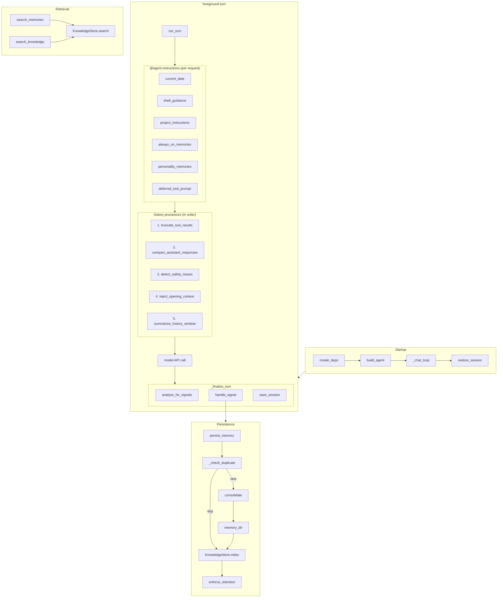

# Co CLI — Agentic Context Design

This doc covers the persistent and injected context layers that shape what the agent knows: **System Prompt**, **Conversation History**, **Memory**, and **Knowledge**, plus the operator-facing delegation metadata the session keeps alongside them. The per-turn execution loop, approval resumes, retries, and detailed history-processor behavior live in [DESIGN-core-loop.md](DESIGN-core-loop.md). Tool contracts for memory and knowledge tools live in [DESIGN-tools.md](DESIGN-tools.md).

## 1. What & How

The agent has no persistent state in model weights. Carry-forward context is split by lifecycle and consumer:

- **System prompt**: the highest-priority behavioral contract. A static scaffold is assembled once at startup, then runtime instruction layers are evaluated fresh on each request. Neither is subject to history compaction.
- **Conversation history**: the in-session message list passed to the model on each foreground turn. History processors run in a fixed order: trim old tool output, cap large assistant responses, detect safety issues, recall relevant memory, then compact long transcripts with context enrichment. Messages are persisted to JSONL transcript and can be restored via `/resume`.
- **Memory**: conversation-derived facts, corrections, preferences, and session-summary artifacts stored as YAML-frontmatter markdown under `ctx.deps.config.memory_dir` (`.co-cli/memory/` in normal startup). Writes enter one lifecycle entrypoint: recent-window dedup may update and reindex an existing file, non-duplicate writes may optionally consolidate against recent memories, and only surviving ADD paths create a new file that is then indexed and subject to retention.
- **Knowledge index**: a derived SQLite search index over memories, library articles, Obsidian notes, and Drive documents cached after `read_drive_file()`. It is rebuildable and searched through `search_memories` for memory-only recall or `search_knowledge` for cross-source retrieval; `search_knowledge` defaults to non-memory sources unless `source="memory"` is requested explicitly.
- **Delegation metadata**: inline subagent provenance is carried in `ToolReturnPart.content`; background task state lives in `ctx.deps.session.background_tasks`. These support operator inspection but are not a separate recalled context layer.

```text
Agent construction (once per session)
  build_static_instructions()   — assembles all 7 sections in explicit order: soul seed, character memories, mindsets, rules (strict numbered order), examples, counter-steering, critique; fails on no rule files, invalid filenames, gaps, or duplicates
  Agent(instructions=...)       — static prompt stored on agent at construction; runtime @agent.instructions layers are registered afterward

Per-request dynamic layers (@agent.instructions — evaluated fresh, never accumulated)
  add_current_date()            — ISO date string
  add_shell_guidance()          — shell approval policy reminder
  add_project_instructions()    — .co-cli/instructions.md content (if present)
  add_always_on_memories()      — always_on=True memories as standing context
  add_personality_memories()    — personality-continuity memories
  add_deferred_tool_prompt()    — deferred tool awareness + discovery prompt (instructs model to call search_tools)

Conversation-history governance (main agent only)
  truncate_tool_results()         — content-clear compactable tool results by per-tool-type recency (keep 5 most recent per type)
  compact_assistant_responses()   — cap large TextPart/ThinkingPart in older ModelResponse messages (2.5K chars)
  detect_safety_issues()          — doom-loop detection + shell reflection cap
  inject_opening_context()        — recall_memory() against current user message; inject as SystemPromptPart
  summarize_history_window()      — compact to head + summary marker + tail when over threshold; context enrichment injected

After each foreground turn
  _finalize_turn()
    -> analyze_for_signals() then handle_signal() on clean turns only
    -> touch_session() then save_session()

Session persistence
  restore_session()
    -> find_latest_session(sessions_dir) by mtime; else new_session() and attempt save_session()
  .co-cli/sessions/{session-id}.json  — session_id, created_at, last_used_at, compaction_count
  .co-cli/sessions/{session-id}.jsonl — JSONL transcript (append-only, one ModelMessage per line)
  message_history                     — appended to .jsonl per turn; loaded on /resume via load_transcript()

Memory write path
  persist_memory()
    -> dedup check (recent-window fuzzy match)
       -> duplicate: update existing memory file + KnowledgeStore.index()
       -> non-duplicate: optional LLM consolidation plan
          -> may UPDATE existing memory file
          -> may DELETE unprotected memory file
          -> may return without creating a new entry
    -> write markdown file to memory_dir when a new entry is needed
    -> KnowledgeStore.index()
    -> enforce_retention() when memory_max_count is exceeded
       -> KnowledgeStore.remove_stale() for retention-deleted memory files

Knowledge search path
  search_memories()
    -> KnowledgeStore.search(source="memory", kind="memory")
       -> memory docs leg (docs_fts; docs_vec + RRF in hybrid mode)
       -> optional TEI or LLM reranking
  search_knowledge()
    -> KnowledgeStore.search(source=["library","obsidian","drive"] by default)
       -> non-memory chunks leg (chunks_fts; chunks_vec in hybrid mode)
       -> explicit source="memory" routes to the memory docs leg
       -> RRF merge when hybrid
       -> optional TEI or LLM reranking

Delegation metadata
  run_*_subagent
    -> ToolReturn includes run_id, role, model_name, requests_used, request_limit, scope
  start_background_task
    -> session.background_tasks[task_id] stores command, cwd, description, status, timestamps, exit code, output ring buffer, process handle
```



## 2. Core Logic

### Static Instructions

**Static scaffold**

`build_agent()` assembles static instructions once via `build_static_instructions()` in `prompts/_assembly.py`. Assembly order is strict:

1. Soul seed from `co_cli/prompts/personalities/souls/<role>/seed.md`
2. Character memories from `co_cli/prompts/personalities/souls/<role>/memories/*.md` (read-only system assets)
3. Mindsets from `co_cli/prompts/personalities/souls/<role>/mindsets/<task_type>.md`
4. Behavioral rules from `co_cli/prompts/rules/NN_rule_id.md`, loaded in contiguous numeric order
5. Soul examples from `co_cli/prompts/personalities/souls/<role>/examples.md`
6. Model-specific counter-steering from `co_cli/prompts/model_quirks/`
7. Soul critique appended as a trailing `## Review lens` block from `co_cli/prompts/personalities/souls/<role>/critique.md`

When no personality is configured, only numbered rules are guaranteed to participate. Model-specific counter-steering is added only when `model_name` is non-empty.

**Runtime instruction layers**

`build_agent()` registers six `@agent.instructions` callbacks. pydantic-ai evaluates them fresh on every model request:

| Layer | Condition | Content |
|-------|-----------|---------|
| `add_current_date` | always | `Today is YYYY-MM-DD.` |
| `add_shell_guidance` | always | Shell approval policy reminder |
| `add_project_instructions` | `.co-cli/instructions.md` exists | Full file contents |
| `add_always_on_memories` | `always_on=True` memories exist | Standing context block, capped by `memory_injection_max_chars` |
| `add_personality_memories` | personality configured | Relationship-continuity memories from the personality injector |
| `add_deferred_tool_prompt` | deferred tools exist or discovery needed | Deferred tool awareness; instructs model to call `search_tools` to unlock additional tools |

The static instructions and these runtime instruction layers are not written into `message_history`, so `summarize_history_window()` does not operate on them.

**Task agent**

`build_task_agent()` uses a fixed `_TASK_AGENT_SYSTEM_PROMPT` string, omits history processors and per-request instruction layers, and keeps the same toolsets as the main agent. It exists to resume already-approved deferred tool calls without paying the full main-agent context cost.

### Conversation History

Conversation history is the ephemeral transcript passed into each foreground turn. The main agent registers five history processors in this order:

1. `truncate_tool_results`
2. `compact_assistant_responses`
3. `detect_safety_issues`
4. `inject_opening_context`
5. `summarize_history_window`

This doc treats them as the context-governance layer. Their exact execution contract, retry boundaries, and approval interaction live in [DESIGN-core-loop.md](DESIGN-core-loop.md).

**Session persistence**

- `deps.config.session_path` stores session metadata: `session_id`, `created_at`, `last_used_at`, `compaction_count`.
- `message_history` is appended to a JSONL transcript (`.co-cli/sessions/{session-id}.jsonl`) after each turn. On `/resume`, `load_transcript()` restores the message list from JSONL, skipping messages before the last compact boundary for files >5MB (threshold: `SKIP_PRECOMPACT_THRESHOLD`). Files >50MB are rejected entirely (`MAX_TRANSCRIPT_READ_BYTES`).
- On normal restart without `/resume`, the session metadata is restored but message history starts fresh. Memories and session-summary artifacts remain in the memory store for recall.

**Compaction**

When `summarize_history_window()` triggers (token count > 85% of budget), it gathers side-channel context via `_gather_compaction_context()` (file working set from `ToolCallPart.args`, pending session todos, always-on memories, prior-summary text from dropped messages — capped at 4K chars), then calls `summarize_messages()` inline with `context=` to generate a structured summary of the dropped middle section. The summarizer uses a sectioned template (Goal, Key Decisions, Working Set, Progress, Next Steps) assembled by `_build_summarizer_prompt()`. The circuit breaker (`compaction_failure_count` on `CoRuntimeState`) skips the LLM call after 3 consecutive failures and falls back to a static marker. When `model_registry` is absent (sub-agents, tests), the static marker is used directly without incrementing the failure counter.

Design constraints:

- **Prompt, not parser.** The structured template is a request to the LLM — the output is free-form. If the model ignores the sections, the summary still works. No post-hoc parsing or validation.
- **Context enrichment is best-effort and capped.** Missing sources (no todos, no always-on memories, no file paths) never block summarization — `_gather_compaction_context()` returns `None` when empty. The assembled context string is hard-capped at 4K chars to prevent the summarizer itself from hitting token limits.
- **Prior-summary detection.** When a prior compaction summary exists in the dropped messages (detected by scanning for the `"[Summary of"` prefix on `UserPromptPart.content`), it is appended to the context enrichment so the summarizer can integrate rather than re-summarize blindly. The template includes an explicit integration instruction.
- **Prompt assembly order.** `_build_summarizer_prompt()` assembles: template → context addendum (`## Additional Context`) → personality addendum. Personality is always last — it modifies tone, while context provides factual input. When `context` is `None` or empty, the context addendum is omitted.
- **In-place mutation.** Both `truncate_tool_results` and `compact_assistant_responses` mutate message parts in-place. This is acceptable because the REPL's `message_history` is overwritten with `turn_result.messages` each turn, and transcript writes only new messages per turn.

Token counting uses real provider-reported `input_tokens` from the most recent `ModelResponse` as the primary source. When no usage data is available, it falls back to `total_chars // 4`. The compaction budget is resolved by `resolve_compaction_budget()`: model spec `context_window − max_tokens` (with `llm_num_ctx` overriding for Ollama) → `llm_num_ctx` when Ollama OpenAI-compat is active → `100,000` fallback.

**Overflow recovery**

When `run_turn()` catches a `ModelHTTPError`, `_is_context_overflow()` checks whether it is a context-length error: status code must be 400 or 413 AND the body must contain a context-length pattern (`"prompt is too long"`, `"context_length_exceeded"`, or `"maximum context length"`). Both conditions must match — bare 400 without a context-length message falls through to the tool-reformulation handler. Body is coerced via `str(e.body)` before matching because `ModelHTTPError.body` is typed `object | None` (OpenAI sends `dict`, Ollama may send `str`).

On match, `emergency_compact()` runs: it calls `group_by_turn()` on the current history and returns `None` if ≤2 groups (nothing safe to drop). Otherwise it keeps the first group + a static marker + the last group. Recovery is one-shot — on second overflow after a successful compact, or when compaction is impossible, the error is terminal. The overflow handler resolves completely and never falls through to the 400 reformulation handler.

**Tool output management**

Two distinct mechanisms handle tool output size:

1. **At return time** (`tool_output.py` → `persist_if_oversized()`): tool results >50K chars are saved to disk as content-addressed files under `.co-cli/tool-results/`, and a 2K-char preview placeholder is returned to the model. This is per-result, at the moment the tool returns.

2. **In history** (`truncate_tool_results`): compactable tool results older than the 5 most recent per tool type are content-cleared with a static placeholder `"[tool result cleared — older than 5 most recent calls]"`. This runs before every model API call as processor #1. Compactable tools: `read_file`, `run_shell_command`, `find_in_files`, `list_directory`, `web_search`, `web_fetch`. The last turn (from the last `UserPromptPart` onward) is always protected.

3. **Assistant response capping** (`compact_assistant_responses`): caps large assistant text in older messages. Runs as processor #2.

```text
boundary = reverse scan for last ModelRequest with UserPromptPart
if boundary == 0: return (single turn — nothing to cap)

for each ModelResponse in messages[:boundary]:
    for each TextPart or ThinkingPart:
        if len(content) > 2500:
            content = head(20%) + "[...truncated...]" + tail(80%)
            (in-place mutation — no new object, no list rebuild)

skip: ToolCallPart (args needed for file path extraction), ToolReturnPart, UserPromptPart
```

Protection boundary uses `_find_last_turn_start()` — a single reverse scan, no turn grouping. Per-message operation aligned with gemini-cli's `enforceMessageSizeLimits` (same 2.5K cap for older messages). The 20/80 head/tail ratio (aligned with gemini-cli's `truncateProportionally`) preserves conclusions and final code over preamble.

### Memory

**Write path**

All memory saves route through `persist_memory()` in `memory/_lifecycle.py`, whether they come from the explicit `save_memory` tool or the post-turn signal detector:

1. Create `memory_dir` if needed, load all items for ID allocation, and load memory-only entries for dedup and consolidation candidates
2. When `title is None`, check recent memories within `memory_dedup_window_days` using `_check_duplicate()`
3. If a duplicate is found, call `_update_existing_memory()` and re-index it when `knowledge_store` is available
4. Otherwise, when a resolved model is available, run `consolidate()` against the top `memory_consolidation_top_k` recent memories and apply the resulting plan with `apply_plan_atomically()`
5. If the consolidation plan contains no `ADD` action and is non-empty, return without writing a new entry
6. Validate `artifact_type` when one was provided
7. Write the new markdown file
8. Index it immediately when `KnowledgeStore` is available
9. If `memory_max_count` is exceeded, run `enforce_retention()` and then `remove_stale()` when `KnowledgeStore` is available

Consolidation timeouts are policy-dependent: explicit saves fall back to ADD, while auto-signal saves can skip the write.

**Auto-signal path**

After a clean foreground turn, `analyze_for_signals()` builds a plain-text window from recent `User:` / `Co:` lines and extracts structured `correction` or `preference` candidates. `handle_signal()` then:

- rejects tags outside `memory_auto_save_tags`
- auto-saves high-confidence signals with `on_failure="skip"`
- prompts the user for low-confidence signals before saving

**Recall path**

Recall is split in two:

1. `add_always_on_memories()` injects up to five `always_on=True` memories as a standing instruction layer every request.
2. `inject_opening_context()` runs once per new user turn, calls `recall_memory(query, max_results=3)`, and appends the formatted result as a trailing `SystemPromptPart`.

`MemoryRecallState` debounces recall to once per user turn and tracks counters (`recall_count`, `model_request_count`, `last_recall_user_turn`). The decay policy governed by `memory_recall_half_life_days` lives inside `recall_memory()` scoring, not in the history processor itself.

**Frontmatter schema**

| Field | Type | Notes |
|-------|------|-------|
| `id` | int | Sequential across memories and articles |
| `kind` | `"memory"` \| `"article"` | Default: `"memory"` |
| `created` | ISO8601 | Set at write time |
| `updated` | ISO8601 \| None | Set on updates |
| `tags` | list[str] | Lowercase tags for filtering/search |
| `provenance` | str | `detected` \| `user-told` \| `planted` \| `auto_decay` \| `web-fetch` \| `session` |
| `auto_category` | str \| None | `preference` \| `correction` \| `decision` \| `context` \| `pattern` \| `character`; loader warns on unknown literals rather than rejecting them |
| `certainty` | str | `high` / `medium` / `low` heuristic; loader warns on unknown literals rather than rejecting them |
| `decay_protected` | bool | Exempt from retention eviction |
| `always_on` | bool | Injected every turn by `add_always_on_memories()` |
| `related` | list[str] \| None | One-hop relationship links by slug |
| `artifact_type` | `"session_summary"` \| None | Structural artifact marker |
| `origin_url` | str \| None | Used by article records |

`validate_memory_frontmatter()` enforces required fields and types. It is strict for `provenance`, but intentionally lenient for some optional enum-like fields today: unknown `auto_category`, `certainty`, and `artifact_type` values are logged and tolerated instead of raising.

### Knowledge Index

`KnowledgeStore` in `knowledge/_store.py` is one SQLite database at `knowledge_db_path` (default `co-cli-search.db`) with two retrieval legs:

- `docs` + `docs_fts`: document rows for all indexed sources; the memory retrieval path uses this leg directly
- `chunks` + `chunks_fts`: chunk rows for non-memory sources such as library articles, Obsidian notes, and Drive docs

Hybrid mode adds `docs_vec_*` and `chunks_vec_*` sqlite-vec tables and merges BM25 plus vector retrieval with Reciprocal Rank Fusion. If hybrid cannot initialize, bootstrap degrades to `fts5`, then to `grep`.

Optional reranking happens after retrieval:

- TEI cross-encoder via `knowledge_cross_encoder_reranker_url`
- LLM reranker via `knowledge_llm_reranker`

Knowledge sync runs once at session start inside `create_deps()`. It syncs memory and library directories immediately (hash-based, skips unchanged files); Obsidian is synced lazily before `search_knowledge()` when needed, and Drive documents are indexed as they are read.

**Source routing in `search_knowledge()`**

| `source` param | Effective scope |
|---------------|-----------------|
| `None` (default) | `["library", "obsidian", "drive"]` |
| `"library"` | local article records |
| `"memory"` | memory records through the `docs_fts` leg |
| `"obsidian"` | Obsidian notes |
| `"drive"` | indexed Drive docs |

In grep fallback mode, only library and memory searches are supported.

### Delegation Metadata

Delegation provenance is captured in live session structures, not in a separate work-record store.

- Inline subagents return `ToolReturn` payloads that include `run_id`, `role`, `model_name`, `requests_used`, `request_limit`, and `scope`. Each subagent type adds domain-specific fields (e.g., coding: `summary`, `diff_preview`, `files_touched`, `confidence`; research: `summary`, `sources`, `confidence`).
- `truncate_tool_results()` content-clears compactable tool results by per-tool-type recency (keeping 5 most recent per type). Non-compactable tools (including subagent results) pass through intact, so delegation identity keys survive.
- Background tasks are tracked in `ctx.deps.session.background_tasks` as `BackgroundTaskState` objects with command, cwd, status (`running`/`completed`/`failed`/`cancelled`), timestamps, exit code, and an in-memory ring buffer of recent output (capped at 500 lines).

The operator surface reads those live structures directly: `/history` scans transcript `ToolReturnPart`s for `run_*_subagent` and `start_background_task`, and `/tasks` reads `session.background_tasks`.

## 3. Config

### System Prompt

| Setting | Env Var | Default | Description |
|---------|---------|---------|-------------|
| `personality` | `CO_CLI_PERSONALITY` | `"finch"` | Soul directory name under `souls/`; enables identity, examples, critique, and personality-memory layers |

### Conversation History

| Setting | Env Var | Default | Description |
|---------|---------|---------|-------------|
| `doom_loop_threshold` | `CO_CLI_DOOM_LOOP_THRESHOLD` | `3` | Contiguous same-call streak threshold for doom-loop safety injection |
| `max_reflections` | `CO_CLI_MAX_REFLECTIONS` | `3` | Shell-error reflection cap enforced by `detect_safety_issues()` |
| `llm_num_ctx` | `LLM_NUM_CTX` | `262144` | Ollama OpenAI context budget used by token-based compaction thresholds; may be overridden at bootstrap Step 2b with the runtime Modelfile value probed from `/api/show` |

### Memory

| Setting | Env Var | Default | Description |
|---------|---------|---------|-------------|
| `memory_max_count` | `CO_CLI_MEMORY_MAX_COUNT` | `200` | Max memory entries before retention runs |
| `memory_dedup_window_days` | `CO_CLI_MEMORY_DEDUP_WINDOW_DAYS` | `7` | Lookback window for duplicate candidates |
| `memory_dedup_threshold` | `CO_CLI_MEMORY_DEDUP_THRESHOLD` | `85` | Similarity percentage above which content is treated as a duplicate |
| `memory_recall_half_life_days` | `CO_MEMORY_RECALL_HALF_LIFE_DAYS` | `30` | Half-life used by `recall_memory()` scoring for non-protected memories |
| `memory_consolidation_top_k` | `CO_MEMORY_CONSOLIDATION_TOP_K` | `5` | Recent memories sent to the consolidator |
| `memory_consolidation_timeout_seconds` | `CO_MEMORY_CONSOLIDATION_TIMEOUT_SECONDS` | `20` | Max wait for LLM consolidation before fallback |
| `memory_auto_save_tags` | `CO_CLI_MEMORY_AUTO_SAVE_TAGS` | `["correction","preference"]` | Tags eligible for post-turn auto-save handling |
| `memory_injection_max_chars` | `CO_CLI_MEMORY_INJECTION_MAX_CHARS` | `2000` | Max chars injected for always-on and recalled memory blocks |

### Delegation Metadata

| Setting | Env Var | Default | Description |
|---------|---------|---------|-------------|
| `subagent_scope_chars` | `CO_CLI_SUBAGENT_SCOPE_CHARS` | `120` | Max task/query prefix stored in subagent result `scope` metadata |
| `subagent_max_requests_coder` | `CO_CLI_SUBAGENT_MAX_REQUESTS_CODER` | `10` | Default request budget when `run_coding_subagent(max_requests=0)` |
| `subagent_max_requests_research` | `CO_CLI_SUBAGENT_MAX_REQUESTS_RESEARCH` | `10` | Default request budget when `run_research_subagent(max_requests=0)` |
| `subagent_max_requests_analysis` | `CO_CLI_SUBAGENT_MAX_REQUESTS_ANALYSIS` | `8` | Default request budget when `run_analysis_subagent(max_requests=0)` |
| `subagent_max_requests_thinking` | `CO_CLI_SUBAGENT_MAX_REQUESTS_THINKING` | `3` | Default request budget when `run_reasoning_subagent(max_requests=0)` |

### Knowledge

| Setting | Env Var | Default | Description |
|---------|---------|---------|-------------|
| `obsidian_vault_path` | `OBSIDIAN_VAULT_PATH` | `None` | Vault path synced lazily by `search_knowledge()` for Obsidian results |
| `library_path` | `CO_LIBRARY_PATH` | `None` | Optional override for `library_dir`; when unset, `CoConfig.from_settings()` falls back to `DATA_DIR / "library"` |
| `knowledge_search_backend` | `CO_KNOWLEDGE_SEARCH_BACKEND` | `hybrid` | Requested search mode: `hybrid` \| `fts5` \| `grep` |
| `knowledge_embedding_provider` | `CO_KNOWLEDGE_EMBEDDING_PROVIDER` | `tei` | Embedding provider: `tei` \| `ollama` \| `gemini` \| `none` |
| `knowledge_embedding_model` | `CO_KNOWLEDGE_EMBEDDING_MODEL` | `embeddinggemma` | Embedding model name |
| `knowledge_embedding_dims` | `CO_KNOWLEDGE_EMBEDDING_DIMS` | `1024` | Embedding vector dimension |
| `knowledge_embed_api_url` | `CO_KNOWLEDGE_EMBED_API_URL` | `http://127.0.0.1:8283` | Embedder service URL |
| `knowledge_cross_encoder_reranker_url` | `CO_KNOWLEDGE_CROSS_ENCODER_RERANKER_URL` | `http://127.0.0.1:8282` | TEI cross-encoder reranker URL |
| `knowledge_llm_reranker` | `—` | `None` | Optional `ModelConfig` used for LLM reranking when no TEI reranker is active |
| `knowledge_chunk_size` | `CO_CLI_KNOWLEDGE_CHUNK_SIZE` | `600` | Chunk token size for non-memory sources |
| `knowledge_chunk_overlap` | `CO_CLI_KNOWLEDGE_CHUNK_OVERLAP` | `80` | Overlap tokens between adjacent chunks |

## 4. Files

| File | Purpose |
|------|---------|
| `co_cli/prompts/_assembly.py` | `build_static_instructions()` — assembles all 7 static instruction sections in explicit order |
| `co_cli/prompts/rules/` | Numbered behavioral rule files loaded in strict order |
| `co_cli/prompts/personalities/_loader.py` | Soul seed, character memories, mindsets, examples, and critique loaders |
| `co_cli/prompts/personalities/_injector.py` | Personality-continuity memory injection for the runtime instruction layer |
| `co_cli/prompts/model_quirks/_loader.py` | Provider/model-specific counter-steering overrides |
| `co_cli/agent.py` | Main/task agent factories, `@agent.instructions` layer registration, history processor registration, tool filter logic |
| `co_cli/context/_history.py` | History processors: `truncate_tool_results`, `compact_assistant_responses`, `detect_safety_issues`, `inject_opening_context`, `summarize_history_window`. Context enrichment (`_gather_compaction_context`), emergency compaction (`emergency_compact`), turn grouping (`group_by_turn`, `TurnGroup`, `groups_to_messages`) |
| `co_cli/context/_tool_result_storage.py` | Persistence for oversized tool results (>50K chars): `persist_if_oversized()` writes content-addressed files, returns 2K preview |
| `co_cli/context/_summarization.py` | `summarize_messages`, `_build_summarizer_prompt`, `resolve_compaction_budget`, `estimate_message_tokens`, `latest_response_input_tokens` — shared by history processor and `/compact` |
| `co_cli/context/_session.py` | Session JSON persistence: `new_session`, `save_session`, `load_session`, `find_latest_session`, `touch_session`, `increment_compaction` |
| `co_cli/context/_transcript.py` | JSONL transcript: `append_messages`, `write_compact_boundary`, `load_transcript` with boundary-skip for resume |
| `co_cli/context/_session_browser.py` | `list_sessions`, `SessionSummary` — session listing via mtime + head-read title extraction |
| `co_cli/context/_deferred_tool_prompt.py` | `build_deferred_tool_prompt` — generates the progressive tool discovery prompt for `add_deferred_tool_prompt()` |
| `co_cli/context/_types.py` | `MemoryRecallState` (recall_count, model_request_count, last_recall_user_turn), `SafetyState` (doom_loop_injected, reflection_injected) |
| `co_cli/memory/_lifecycle.py` | `persist_memory()` write pipeline |
| `co_cli/memory/_consolidator.py` | LLM-driven `ConsolidationPlan` generation |
| `co_cli/memory/_retention.py` | Retention enforcement for over-cap memory sets |
| `co_cli/memory/_signal_detector.py` | Post-turn signal extraction (`analyze_for_signals`) and admission handling (`handle_signal`) |
| `co_cli/knowledge/_store.py` | `KnowledgeStore` SQLite schema, sync, search, vector merge, and reranking hooks |
| `co_cli/knowledge/_frontmatter.py` | Frontmatter parsing/validation and `ArtifactTypeEnum` |
| `co_cli/knowledge/_chunker.py` | Chunking for non-memory sources |
| `co_cli/knowledge/_embedder.py` | Embedding-provider adapters |
| `co_cli/knowledge/_reranker.py` | TEI and LLM reranker adapters |
| `co_cli/tools/memory.py` | `recall_memory`, `search_memories`, and memory file helpers |
| `co_cli/tools/articles.py` | `search_knowledge`, article persistence, and article-detail retrieval |
| `co_cli/tools/tool_output.py` | `tool_output()` helper: `ToolReturn` construction with display/metadata separation; calls `persist_if_oversized()` for >50K content |
| `co_cli/tools/subagent.py` | Inline subagent tools that emit `run_id`, `role`, `model_name`, usage metadata, and domain-specific fields |
| `co_cli/tools/_background.py` | `BackgroundTaskState` dataclass and subprocess monitor (`spawn_task`, `_monitor`, `kill_task`) |
| `co_cli/tools/task_control.py` | Background task tools over `session.background_tasks` |
| `co_cli/bootstrap/_bootstrap.py` | `create_deps()` (knowledge store init + sync) and `restore_session()` |
| `co_cli/commands/_commands.py` | `/history` and `/tasks` slash commands over live delegation/background-task state |
