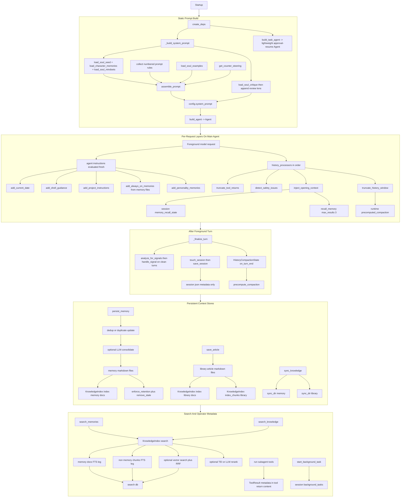

# Co CLI — Agentic Context Design

This doc covers the persistent and injected context layers that shape what the agent knows: **System Prompt**, **Conversation History**, **Memory**, and **Knowledge**, plus the operator-facing delegation metadata the session keeps alongside them. The per-turn execution loop, approval resumes, retries, and detailed history-processor behavior live in [DESIGN-core-loop.md](DESIGN-core-loop.md). Tool contracts for memory and knowledge tools live in [DESIGN-tools.md](DESIGN-tools.md).

## 1. What & How

The agent has no persistent state in model weights. Carry-forward context is split by lifecycle and consumer:

- **System prompt**: the highest-priority behavioral contract. A static scaffold is assembled once at startup, then runtime instruction layers are evaluated fresh on each request. Neither is subject to history compaction.
- **Conversation history**: the in-session message list passed to the model on each foreground turn. History processors trim old tool output, inject recalled memory, add safety nudges, and compact long transcripts. The message list itself is process memory only.
- **Memory**: conversation-derived facts, corrections, preferences, and session-summary artifacts stored as YAML-frontmatter markdown under `.co-cli/memory/`. Writes flow through one lifecycle pipeline: dedup, optional consolidation, write, index, retention.
- **Knowledge index**: a derived SQLite search index over memories, library articles, Obsidian notes, and Drive documents. It is rebuildable and searched through `search_knowledge` or `search_memories`, depending on the source.
- **Delegation metadata**: inline subagent provenance is carried in `ToolReturnPart.content`; background task state lives in `ctx.deps.session.background_tasks`. These support operator inspection but are not a separate recalled context layer.

```text
Agent construction (once per session)
  _build_system_prompt()        — soul seed + character memories + mindsets + rules + examples + counter-steering, then critique appended as Review lens
  assemble_prompt()             — strict numbered rule order (rules/NN_*.md); fails on missing rules, invalid filenames, gaps, or duplicates
  Agent(instructions=...)       — static prompt stored on agent at construction; runtime @agent.instructions layers are registered afterward

Per-request dynamic layers (@agent.instructions — evaluated fresh, never accumulated)
  add_current_date()            — ISO date string
  add_shell_guidance()          — shell approval policy reminder
  add_project_instructions()    — .co-cli/instructions.md content (if present)
  add_always_on_memories()      — always_on=True memories as standing context
  add_personality_memories()    — personality-continuity memories

Conversation-history governance (main agent only)
  truncate_tool_returns()       — trim old ToolReturnPart.content > tool_output_trim_chars
  detect_safety_issues()        — doom-loop detection + shell reflection cap
  inject_opening_context()      — recall_memory() against current user message; inject as SystemPromptPart
  truncate_history_window()     — compact to head + summary marker + tail when over threshold

After each turn
  precompute_compaction()       — if history is near the threshold, summarize the future middle eagerly
  HistoryCompactionState        — owns the background asyncio.Task; harvested on next on_turn_start()
  analyze_for_signals()         — LLM scan for correction/preference signals

Session persistence
  .co-cli/session.json          — session_id, created_at, last_used_at, compaction_count
  is_fresh(ttl_minutes)         — restores session_id within TTL; new session on expiry
  message_history               — not persisted to disk

Memory write path
  persist_memory()
    -> dedup check (recent-window fuzzy match)
    -> optional LLM consolidation
    -> write markdown file to memory_dir
    -> KnowledgeIndex.index()
    -> enforce_retention() when memory_max_count is exceeded

Knowledge search path
  search_knowledge() / search_memories()
    -> KnowledgeIndex.search()
       -> FTS5 BM25 (docs_fts / chunks_fts)
       -> optional sqlite-vec similarity (docs_vec / chunks_vec)
       -> optional TEI or LLM reranking
       -> RRF merge when hybrid

Delegation metadata
  run_*_subagent
    -> ToolResult includes run_id, role, model_name, requests_used, request_limit, scope
  start_background_task
    -> session.background_tasks[task_id] stores command, cwd, status, timestamps, exit code, output ring buffer
```



## 2. Core Logic

### System Prompt

**Static scaffold**

`create_deps()` builds `config.system_prompt` once via `_build_system_prompt()` in `prompts/_assembly.py`. Assembly order is strict:

1. Soul seed from `souls/<personality>/seed.md`
2. Character base memories from `souls/<personality>/character_memories.md`
3. Mindsets from `mindsets/<personality>/`
4. Behavioral rules from `prompts/rules/NN_rule_id.md`, loaded in contiguous numeric order
5. Soul examples from `souls/<personality>/examples.md`
6. Model-specific counter-steering from `prompts/model_quirks/`
7. Soul critique appended as a trailing `## Review lens` block

When no personality is configured, only rules and model counter-steering are guaranteed to participate. The shipped settings default is still `finch`; this no-personality path only applies when personality is explicitly unset or a `CoConfig` is constructed with `personality=None`.

**Runtime instruction layers**

`build_agent()` registers five `@agent.instructions` callbacks. pydantic-ai evaluates them fresh on every model request and concatenates them ahead of message history:

| Layer | Condition | Content |
|-------|-----------|---------|
| `add_current_date` | always | `Today is YYYY-MM-DD.` |
| `add_shell_guidance` | always | Shell approval policy reminder |
| `add_project_instructions` | `.co-cli/instructions.md` exists | Full file contents |
| `add_always_on_memories` | `always_on=True` memories exist | Standing context block, capped by `memory_injection_max_chars` |
| `add_personality_memories` | personality configured | Relationship-continuity memories from the personality injector |

The system prompt and instruction layers are provider-level context, not transcript entries, so `truncate_history_window()` never evicts them.

**Task agent**

`build_task_agent()` uses a fixed `_TASK_AGENT_SYSTEM_PROMPT` string and omits history processors and per-request instruction layers. It exists to resume already-approved deferred tool calls without paying the full main-agent context cost.

### Conversation History

Conversation history is the ephemeral transcript passed into each foreground turn. The main agent registers four history processors in this order:

1. `truncate_tool_returns`
2. `detect_safety_issues`
3. `inject_opening_context`
4. `truncate_history_window`

This doc treats them as the context-governance layer. Their exact execution contract, retry boundaries, and approval interaction live in [DESIGN-core-loop.md](DESIGN-core-loop.md).

Two persistence rules matter here:

1. `.co-cli/session.json` stores only session metadata: `session_id`, `created_at`, `last_used_at`, and `compaction_count`.
2. `message_history` itself is not written to disk. Restart continuity comes from the restored session ID, persisted memories, and any session-summary memory artifacts, not from replaying prior messages.

Compaction is intentionally split across turns. `precompute_compaction()` may summarize the future middle of the transcript in the background after turn `N`; on turn `N+1`, `truncate_history_window()` either uses that cached summary when the boundaries still match or falls back to a static trim marker. It does not perform an inline summarization call in the foreground request path.

Token counting uses real provider-reported `input_tokens` from the most recent `ModelResponse` as the primary source. When no usage data is available (local or custom models with no reporting), it falls back to a character-count estimate (`total_chars // 4`). The compaction budget is `llm_num_ctx` when `uses_ollama_openai()` and `llm_num_ctx > 0`; otherwise it is `100,000` tokens. The trigger fires when token count exceeds 85% of that budget, or when message count exceeds `max_history_messages` — whichever comes first.

### Memory

**Write path**

All memory saves route through `persist_memory()` in `memory/_lifecycle.py`, whether they come from the explicit `save_memory` tool or the post-turn signal detector:

1. Load recent memory candidates from `memory_dir`
2. Check for a duplicate within `memory_dedup_window_days` using fuzzy similarity
3. If a duplicate is found, update the existing file and re-index it
4. Otherwise, optionally run LLM consolidation against the top `memory_consolidation_top_k` recent memories
5. Write the new markdown file with validated frontmatter
6. Index it immediately into `KnowledgeIndex`
7. If `memory_max_count` is exceeded, run `enforce_retention()` and remove stale index entries

Consolidation timeouts are policy-dependent: explicit saves fall back to ADD, while auto-signal saves can skip the write.

**Auto-signal path**

After a clean foreground turn, `analyze_for_signals()` scans the recent transcript for `correction` or `preference` candidates. `handle_signal()` then:

- rejects tags outside `memory_auto_save_tags`
- auto-saves high-confidence signals with `on_failure="skip"`
- prompts the user for low-confidence signals before saving

**Recall path**

Recall is split in two:

1. `add_always_on_memories()` injects up to five `always_on=True` memories as a standing instruction layer every request.
2. `inject_opening_context()` runs once per new user turn, calls `recall_memory(query, max_results=3)`, and appends the formatted result as a trailing `SystemPromptPart`.

`MemoryRecallState` only debounces recall to once per user turn and tracks counters. The decay policy governed by `memory_recall_half_life_days` lives inside `recall_memory()` scoring, not in the history processor itself.

**Frontmatter schema**

| Field | Type | Notes |
|-------|------|-------|
| `id` | int | Sequential across memories and articles |
| `kind` | `"memory"` \| `"article"` | Default: `"memory"` |
| `created` | ISO8601 | Set at write time |
| `updated` | ISO8601 \| None | Set on updates |
| `tags` | list[str] | Lowercase tags for filtering/search |
| `provenance` | str | `detected` \| `user-told` \| `planted` \| `auto_decay` \| `web-fetch` \| `session` |
| `auto_category` | str \| None | `preference` \| `correction` \| `decision` \| `context` \| `pattern`; loader warns on unknown literals rather than rejecting them |
| `certainty` | str | `high` / `medium` / `low` heuristic; loader warns on unknown literals rather than rejecting them |
| `decay_protected` | bool | Exempt from retention eviction |
| `always_on` | bool | Injected every turn by `add_always_on_memories()` |
| `related` | list[str] \| None | One-hop relationship links by slug |
| `artifact_type` | `"session_summary"` \| None | Structural artifact marker |
| `origin_url` | str \| None | Used by article records |

`validate_memory_frontmatter()` enforces required fields and types, but it is intentionally lenient for some optional enum-like fields today: unknown `auto_category`, `certainty`, and `artifact_type` values are logged and tolerated instead of raising.

### Knowledge Index

`KnowledgeIndex` in `knowledge/_index_store.py` is one SQLite database (`search.db`) with two storage legs:

- `docs` + `docs_fts`: full-document indexing for memory-source records
- `chunks` + `chunks_fts`: chunked indexing for non-memory sources such as library articles, Obsidian notes, and Drive docs

Hybrid mode adds `docs_vec_*` and `chunks_vec_*` sqlite-vec tables and merges BM25 plus vector retrieval with Reciprocal Rank Fusion. If hybrid cannot initialize, bootstrap degrades to `fts5`, then to `grep`.

Optional reranking happens after retrieval:

- TEI cross-encoder via `knowledge_cross_encoder_reranker_url`
- LLM reranker via `knowledge_llm_reranker`

`sync_knowledge()` runs once at session start. It syncs memory and library directories immediately; Obsidian is synced lazily before `search_knowledge()` when needed, and Drive documents are indexed as they are read.

**Source routing in `search_knowledge()`**

| `source` param | Effective scope |
|---------------|-----------------|
| `None` (default) | `["library", "obsidian", "drive"]` |
| `"library"` | local article records |
| `"memory"` | memory records through the `docs_fts` leg |
| `"obsidian"` | Obsidian notes |
| `"drive"` | indexed Drive docs |

In grep fallback mode, only library and explicit memory searches are supported.

### Delegation Metadata

Delegation provenance is captured in live session structures, not in a separate work-record store.

- Inline subagents return `ToolResult` payloads that include `run_id`, `role`, `model_name`, `requests_used`, `request_limit`, and `scope`.
- `truncate_tool_returns()` only trims the `display` field for dict-shaped tool results, so those identity keys survive transcript trimming.
- Background tasks are tracked in `ctx.deps.session.background_tasks` as `BackgroundTaskState` objects with command, cwd, status, timestamps, exit code, and an in-memory ring buffer of recent output.

The operator surface reads those live structures directly: `/history` scans `ToolReturnPart`s in the transcript, and `/tasks` reads `session.background_tasks`.

## 3. Config

### System Prompt

| Setting | Env Var | Default | Description |
|---------|---------|---------|-------------|
| `personality` | `CO_CLI_PERSONALITY` | `"finch"` | Soul directory name under `souls/`; enables identity, examples, critique, and personality-memory layers |

### Conversation History

| Setting | Env Var | Default | Description |
|---------|---------|---------|-------------|
| `session_ttl_minutes` | `CO_SESSION_TTL_MINUTES` | `60` | Minutes since last use within which a session ID is restored |

### Memory

| Setting | Env Var | Default | Description |
|---------|---------|---------|-------------|
| `memory_max_count` | `CO_CLI_MEMORY_MAX_COUNT` | `200` | Max memory entries before retention runs |
| `memory_dedup_window_days` | `CO_CLI_MEMORY_DEDUP_WINDOW_DAYS` | `7` | Lookback window for duplicate candidates |
| `memory_dedup_threshold` | `CO_CLI_MEMORY_DEDUP_THRESHOLD` | `85` | Similarity percentage above which content is treated as a duplicate |
| `memory_recall_half_life_days` | `CO_MEMORY_RECALL_HALF_LIFE_DAYS` | `30` | Half-life used by `recall_memory()` scoring for non-protected memories |
| `memory_consolidation_top_k` | `CO_MEMORY_CONSOLIDATION_TOP_K` | `5` | Recent memories sent to the consolidator |
| `memory_consolidation_timeout_seconds` | `CO_MEMORY_CONSOLIDATION_TIMEOUT_SECONDS` | `20` | Max wait for LLM consolidation before fallback |
| `memory_auto_save_tags` | `CO_CLI_MEMORY_AUTO_SAVE_TAGS` | `["correction","preference"]` | Tags eligible for post-turn auto-save handling |
| `memory_injection_max_chars` | `CO_CLI_MEMORY_INJECTION_MAX_CHARS` | `2000` | Max chars injected for always-on and recalled memory blocks |

### Delegation Metadata

| Setting | Env Var | Default | Description |
|---------|---------|---------|-------------|
| `subagent_scope_chars` | `CO_CLI_SUBAGENT_SCOPE_CHARS` | `120` | Max task/query prefix stored in subagent result `scope` metadata |

### Knowledge

| Setting | Env Var | Default | Description |
|---------|---------|---------|-------------|
| `knowledge_search_backend` | `CO_KNOWLEDGE_SEARCH_BACKEND` | `hybrid` | Requested search mode: `hybrid` \| `fts5` \| `grep` |
| `knowledge_embedding_provider` | `CO_KNOWLEDGE_EMBEDDING_PROVIDER` | `tei` | Embedding provider: `tei` \| `ollama` \| `gemini` \| `none` |
| `knowledge_embedding_model` | `CO_KNOWLEDGE_EMBEDDING_MODEL` | `embeddinggemma` | Embedding model name |
| `knowledge_embedding_dims` | `CO_KNOWLEDGE_EMBEDDING_DIMS` | `1024` | Embedding vector dimension |
| `knowledge_embed_api_url` | `CO_KNOWLEDGE_EMBED_API_URL` | `http://127.0.0.1:8283` | Embedder service URL |
| `knowledge_cross_encoder_reranker_url` | `CO_KNOWLEDGE_CROSS_ENCODER_RERANKER_URL` | `http://127.0.0.1:8282` | TEI cross-encoder reranker URL |
| `knowledge_chunk_size` | `CO_CLI_KNOWLEDGE_CHUNK_SIZE` | `600` | Chunk token size for non-memory sources |
| `knowledge_chunk_overlap` | `CO_CLI_KNOWLEDGE_CHUNK_OVERLAP` | `80` | Overlap tokens between adjacent chunks |

## 4. Files

| File | Purpose |
|------|---------|
| `co_cli/prompts/_assembly.py` | `assemble_prompt()` and `_build_system_prompt()` for static prompt scaffold assembly |
| `co_cli/prompts/rules/` | Numbered behavioral rule files loaded in strict order |
| `co_cli/prompts/personalities/_loader.py` | Soul seed, character memories, mindsets, examples, and critique loaders |
| `co_cli/prompts/personalities/_injector.py` | Personality-continuity memory injection for the runtime instruction layer |
| `co_cli/prompts/model_quirks/` | Provider/model-specific counter-steering overrides |
| `co_cli/agent.py` | Main/task agent factories and `@agent.instructions` layer registration |
| `co_cli/context/_history.py` | History processors plus background compaction summarization and lifecycle |
| `co_cli/context/_session.py` | Session JSON persistence helpers |
| `co_cli/context/_types.py` | `CompactionResult`, `MemoryRecallState`, `SafetyState`, and `_CompactionBoundaries` |
| `co_cli/memory/_lifecycle.py` | `persist_memory()` write pipeline |
| `co_cli/memory/_consolidator.py` | LLM-driven `ConsolidationPlan` generation |
| `co_cli/memory/_retention.py` | Retention enforcement for over-cap memory sets |
| `co_cli/memory/_signal_detector.py` | Post-turn signal extraction and admission handling |
| `co_cli/knowledge/_index_store.py` | `KnowledgeIndex` SQLite schema, sync, search, vector merge, and reranking hooks |
| `co_cli/knowledge/_frontmatter.py` | Frontmatter parsing/validation and `ArtifactTypeEnum` |
| `co_cli/knowledge/_chunker.py` | Chunking for non-memory sources |
| `co_cli/knowledge/_embedder.py` | Embedding-provider adapters |
| `co_cli/knowledge/_reranker.py` | TEI and LLM reranker adapters |
| `co_cli/tools/memory.py` | `recall_memory`, `search_memories`, and memory file helpers |
| `co_cli/tools/articles.py` | `search_knowledge`, article persistence, and article-detail retrieval |
| `co_cli/tools/subagent.py` | Inline subagent tools that emit `run_id` and usage metadata |
| `co_cli/tools/_background.py` | Session-scoped `BackgroundTaskState` and subprocess monitor helpers |
| `co_cli/tools/task_control.py` | Background task tools over `session.background_tasks` |
| `co_cli/bootstrap/_bootstrap.py` | `sync_knowledge()` and `restore_session()` bootstrap the derived index and session identity |
| `co_cli/commands/_commands.py` | `/history` and `/tasks` slash commands over live delegation/background-task state |
