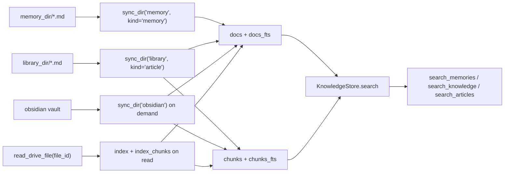

# Co CLI Context Design

This doc covers how `co-cli` assembles prompt context, governs in-session history, persists cross-session knowledge, and routes recall/search. Startup sequencing lives in [DESIGN-system.md](DESIGN-system.md), one-turn orchestration lives in [DESIGN-core-loop.md](DESIGN-core-loop.md), and tool contracts live in [DESIGN-tools.md](DESIGN-tools.md).

## 1. What & How

`co-cli` keeps model context split across three layers with different lifecycles:

- static instructions assembled once when the main agent is built
- dynamic instruction layers evaluated fresh on every model request
- message history transformed before every request by ordered history processors

Persistent context lives outside the model in flat Markdown files plus an optional derived SQLite index:

- workspace-local memories in `.co-cli/memory/`
- user-global articles in `library_dir`
- session metadata and append-only transcripts in `.co-cli/sessions/`
- a rebuildable `KnowledgeStore` at `knowledge_db_path`

```mermaid
flowchart TD
    subgraph Build["agent construction"]
        Static[build_static_instructions]
        MainAgent[build_agent]
        TaskAgent[build_task_agent]
        Static --> MainAgent
    end

    subgraph MainRequest["main-agent request"]
        Dynamic[@agent.instructions]
        Processors[history processors 1..5]
        Model[model request]
        Dynamic --> Processors --> Model
    end

    subgraph ResumeRequest["task-agent resume"]
        ResumeModel[resume request]
    end

    Finalize[_finalize_turn]

    subgraph Storage["persistent stores"]
        Memories[".co-cli/memory/*.md"]
        Library["library_dir/*.md"]
        Sessions[".co-cli/sessions/*.json + *.jsonl"]
        Index["KnowledgeStore / co-cli-search.db"]
    end

    MainAgent --> MainRequest
    TaskAgent --> ResumeRequest
    Model --> Finalize
    ResumeModel --> Finalize
    Finalize --> Sessions
    Finalize --> Memories
    Memories --> Index
    Library --> Index
```

## 2. Core Logic

### 2.1 Prompt Layers

`build_agent()` constructs the main foreground agent with a static scaffold plus six runtime instruction callbacks.

**Static instructions**

`build_static_instructions()` assembles these sections in fixed order:

1. soul seed
2. character memories
3. mindsets
4. numbered rules from `co_cli/prompts/rules/NN_rule_id.md`
5. examples
6. model-specific counter-steering
7. critique appended as `## Review lens`

Rules are validated before assembly: filenames must match `NN_rule_id.md`, numeric prefixes must be unique, and numbering must be contiguous from `01`.

**Dynamic instruction layers**

These callbacks are registered in `build_agent()` and evaluated fresh on every request:

| Layer | Condition | Content |
| --- | --- | --- |
| `add_current_date` | always | `Today is YYYY-MM-DD.` |
| `add_shell_guidance` | always | shell approval/reminder text |
| `add_project_instructions` | `.co-cli/instructions.md` exists | full file contents |
| `add_always_on_memories` | `always_on=True` entries exist in `memory_dir` | `Standing context:` block, capped by `memory_injection_max_chars` |
| `add_personality_memories` | `config.personality` is set | top 5 `personality-context` memories formatted as `## Learned Context`; loaded from `Path.cwd() / ".co-cli/memory"` |
| `add_deferred_tool_prompt` | undiscovered deferred tools exist | prompt telling the model to call `search_tools()` |

These prompt layers are not persisted into `message_history`.

**Task agent**

`build_task_agent()` builds the lightweight approval-resume surface:

- fixed short system prompt
- same toolsets as the main agent
- no history processors
- no date, project, always-on, personality, or deferred-tool instruction layers

### 2.2 History Governance

The main agent registers five history processors in this exact order:

1. `truncate_tool_results`
2. `compact_assistant_responses`
3. `detect_safety_issues`
4. `inject_opening_context`
5. `summarize_history_window`

| Processor | Behavior |
| --- | --- |
| `truncate_tool_results` | clears older `ToolReturnPart` content for `read_file`, `run_shell_command`, `find_in_files`, `list_directory`, `web_search`, and `web_fetch`; keeps the 5 most recent calls per tool type and always protects the last user turn |
| `compact_assistant_responses` | caps older `TextPart` and `ThinkingPart` content to 2,500 chars with proportional head/tail retention; protects the last user turn |
| `detect_safety_issues` | detects a contiguous streak of identical tool calls and a contiguous streak of shell errors; injects a system warning once per turn when `doom_loop_threshold` or `max_reflections` is reached |
| `inject_opening_context` | once per new user turn, calls `recall_memory(query=user_msg, max_results=3)` and appends matching memories as a trailing `SystemPromptPart` |
| `summarize_history_window` | when history exceeds the compaction threshold, keeps head + summary marker + tail and drops the middle section |

`detect_safety_issues()` and `inject_opening_context()` intentionally mutate `deps.runtime.safety_state` and `deps.session.memory_recall_state` because processor-local state would not survive approval-resume segments inside the same turn.

**Compaction**

Compaction is budget-driven:

```text
token_count =
  latest_response_input_tokens(messages)
  or estimate_message_tokens(messages)

budget =
  resolve_compaction_budget(config, model_registry)

if token_count > 0.85 * budget:
  compute head/tail boundaries
  summarize dropped middle section
  return head + summary marker + tail
```

`resolve_compaction_budget()` uses:

1. reasoning model `context_window - max_tokens`
2. `llm_num_ctx` override for `ollama-openai`
3. fallback `100_000`

`summarize_history_window()` uses `_gather_compaction_context()` to enrich the summarizer with:

- file paths extracted from `ToolCallPart.args`
- pending session todos
- always-on memories
- prior summary text already present in dropped messages

That enrichment is capped at 4,000 chars.

LLM summarization is skipped and replaced with a static marker when:

- `model_registry` is absent
- `deps.runtime.compaction_failure_count >= 3`
- the summarizer call fails with `ModelHTTPError` or `ModelAPIError`

**Overflow recovery**

When `run_turn()` detects a context-length HTTP error, `emergency_compact()` performs a non-LLM fallback:

- keep the first turn group
- drop the middle groups
- keep the last turn group
- insert a static trim marker

This overflow recovery is attempted at most once per foreground turn.

### 2.3 Session And Transcript Persistence

Session metadata and transcripts are separate.

**Session metadata**

`restore_session()` restores only the most recent session metadata file, not the transcript. `find_latest_session()` scans `.co-cli/sessions/*.json` by mtime and returns the first valid UUID-backed session.

Each session JSON stores:

- `session_id`
- `created_at`
- `last_used_at`
- `compaction_count`

**Transcript**

`append_messages()` writes `.co-cli/sessions/{session_id}.jsonl` as append-only JSONL. Each line is one serialized `ModelMessage`.

`load_transcript()` is used only by `/resume`. Its read policy is:

- if file size is `<= 5 MB`, load the full transcript
- if file size is `> 5 MB`, skip everything before the last compact-boundary marker
- if file size is `> 50 MB`, return no messages

Compact-boundary markers are written by `/compact` through `write_compact_boundary()`. Normal sliding-window compaction does not write transcript boundary markers.

**Slash-command context mutations**

| Command | Effect |
| --- | --- |
| `/resume` | loads a chosen transcript with `load_transcript()` and swaps `deps.session.session_id` |
| `/compact` | replaces the live transcript with a 2-message summary conversation and increments `compaction_count` |
| `/new` | summarizes the current session into a `session_summary` memory artifact, creates a new session ID, and starts with empty in-memory history |

### 2.4 Memory And Article Storage

Persistent knowledge is stored as flat Markdown files with YAML frontmatter.

| Store | Path | Typical contents |
| --- | --- | --- |
| memory store | `config.memory_dir` (`.co-cli/memory/`) | conversation-derived memories and session-summary artifacts |
| article store | `config.library_dir` | saved external references and fetched docs |

**Frontmatter schema**

`validate_memory_frontmatter()` enforces or validates these fields:

| Field | Type | Notes |
| --- | --- | --- |
| `id` | `int | str` | new memory and article writes use UUID strings |
| `kind` | `"memory" | "article"` | defaults to `"memory"` when absent |
| `title` | `str | null` | used mainly by articles |
| `created` | ISO8601 string | required |
| `updated` | ISO8601 string | optional |
| `tags` | `list[str]` | used for filtering and search |
| `provenance` | `detected | user-told | planted | auto_decay | web-fetch | session` | strict enum |
| `auto_category` | `str | null` | loader warns on unknown values |
| `certainty` | `str | null` | loader warns on unknown values |
| `related` | `list[str] | null` | one-hop links by slug |
| `artifact_type` | `str | null` | currently `session_summary` is used |
| `origin_url` | `str | null` | article source URL |
| `decay_protected` | `bool` | retention exemption |
| `always_on` | `bool` | standing prompt injection |

**Memory write lifecycle**

All memory writes route through `persist_memory()`:

```text
persist_memory()
  -> load current memory files
  -> duplicate check against recent memories when title is absent
     -> duplicate: update existing file and reindex
  -> optional LLM consolidation against recent top-K candidates
     -> may UPDATE existing entries
     -> may DELETE non-protected entries
     -> may return without ADD
  -> write new markdown file when an ADD remains
  -> index in KnowledgeStore when available
  -> enforce_retention() if memory_max_count is exceeded
```

Important details:

- duplicate detection is fuzzy and limited to recent memories inside `memory_dedup_window_days`
- LLM consolidation uses `memory_consolidation_top_k` candidates and `memory_consolidation_timeout_seconds`
- retention is cut-only: delete the oldest non-protected memory files until the count is under the cap
- retention applies to `kind="memory"` only; articles are not part of the memory cap

**Auto-signal saves**

After a clean foreground turn:

1. `analyze_for_signals()` builds a plain-text `User:` / `Co:` window from recent conversation lines
2. it extracts at most one `SignalResult`
3. `handle_signal()` enforces `memory_auto_save_tags`
4. high-confidence signals save automatically with `on_failure="skip"`
5. low-confidence signals ask the user first

The extractor currently recognizes only `correction` and `preference`. When `inject=True`, `handle_signal()` adds the `personality-context` tag.

**Session-summary artifacts**

`/new` creates a memory artifact with:

- `provenance="session"`
- timestamped `title`
- `artifact_type="session_summary"`

`recall_memory()` and `search_memories()` explicitly exclude these session-summary entries from normal recall/search results.

**Articles**

`save_article()` stores external reference material in `library_dir` with:

- `kind="article"`
- `origin_url`
- `provenance="web-fetch"`
- `decay_protected=True`

Article deduplication is by exact `origin_url`, not fuzzy content similarity.

### 2.5 Knowledge Index And Retrieval

`KnowledgeStore` is a single SQLite-backed derived index at `knowledge_db_path` (default `~/.local/share/co-cli/co-cli-search.db`).



**Schema and legs**

| Structure | Role |
| --- | --- |
| `docs` + `docs_fts` | document-level records for all sources; memory retrieval uses this leg directly |
| `chunks` + `chunks_fts` | chunk-level records for non-memory sources |
| `embedding_cache` | cached embeddings keyed by provider, model, and content hash |
| `docs_vec_{dims}` / `chunks_vec_{dims}` | hybrid-mode sqlite-vec tables |

Memory is never chunked. Non-memory sources may be chunked and indexed via `index_chunks()`.

**Bootstrap and degradation**

`create_deps()` resolves the effective knowledge backend with this fallback chain:

`hybrid -> fts5 -> grep`

Startup sync is:

- `sync_dir("memory", memory_dir, kind_filter="memory")`
- `sync_dir("library", library_dir, kind_filter="article")`

Additional indexing is lazy:

- Obsidian sync runs inside `search_knowledge()` when `obsidian_vault_path` is configured and the requested scope includes Obsidian
- Drive files are indexed only after `read_drive_file()` fetches the full file text

**Search routing**

| Entry point | Default scope | Notes |
| --- | --- | --- |
| `recall_memory()` | memory only | recall-oriented formatting, one-hop `related` expansion, composite relevance/decay scoring, excludes `session_summary` |
| `search_memories()` | memory only | ranked search API for memory entries |
| `search_articles()` | library articles only | summary-level article index |
| `search_knowledge()` | `["library", "obsidian", "drive"]` | memories are excluded by default; `source="memory"` is an explicit override |

**Backend behavior**

| Backend | Behavior |
| --- | --- |
| `grep` | no `KnowledgeStore`; supports only file-based memory/article fallback search |
| `fts5` | BM25 search over `docs_fts` and `chunks_fts` |
| `hybrid` | FTS + vector search, merged with RRF, then optional reranking |

Reranking is optional and provider-driven:

- TEI cross-encoder via `knowledge_cross_encoder_reranker_url`
- LLM reranker via `knowledge_llm_reranker`

`search_knowledge()` also computes a tool-layer confidence score for each result and flags heuristic contradictions within the result set.

### 2.6 Delegation And Background Task Context

Delegation state is session-local, not a separate persistent context store.

**Inline sub-agents**

Sub-agent tools return structured metadata including:

- `run_id`
- `role`
- `model_name`
- `requests_used`
- `request_limit`
- `scope`

Each tool also adds domain-specific payload fields such as `summary`, `sources`, `evidence`, `plan`, or `files_touched`.

`/history` reconstructs delegation history by scanning `ToolReturnPart`s from the current session transcript snapshot.

**Background tasks**

`start_background_task` and related task-control commands store state in `deps.session.background_tasks`.

Each `BackgroundTaskState` tracks:

- `task_id`
- `command`
- `cwd`
- `description`
- `status`
- `started_at`
- `completed_at`
- `exit_code`
- `output_lines` as a `deque(maxlen=500)`
- `cleanup_incomplete` / `cleanup_error`

Background task state is session-scoped in memory only.

**Oversized tool output**

When a tool calls `tool_output(..., ctx=ctx)` and the display text exceeds 50,000 chars, `persist_if_oversized()` writes the full output to `.co-cli/tool-results/` and returns a placeholder with:

- tool name
- persisted file path
- content length
- 2,000-char preview

This is separate from the history processor that later clears older compactable tool results by recency.

## 3. Config

### Prompt And History

| Setting | Env Var | Default | Description |
| --- | --- | --- | --- |
| `personality` | `CO_CLI_PERSONALITY` | `finch` | personality used by static prompt assembly and personality-memory injection |
| `doom_loop_threshold` | `CO_CLI_DOOM_LOOP_THRESHOLD` | `3` | identical-tool-call streak needed for doom-loop injection |
| `max_reflections` | `CO_CLI_MAX_REFLECTIONS` | `3` | consecutive shell-error streak needed for reflection-cap injection |
| `llm_num_ctx` | `LLM_NUM_CTX` | `262144` | Ollama context budget used by compaction budget resolution when applicable |

### Memory

| Setting | Env Var | Default | Description |
| --- | --- | --- | --- |
| `memory_max_count` | `CO_CLI_MEMORY_MAX_COUNT` | `200` | memory-only retention cap |
| `memory_dedup_window_days` | `CO_CLI_MEMORY_DEDUP_WINDOW_DAYS` | `7` | recent-window size for duplicate detection |
| `memory_dedup_threshold` | `CO_CLI_MEMORY_DEDUP_THRESHOLD` | `85` | fuzzy duplicate threshold |
| `memory_recall_half_life_days` | `CO_MEMORY_RECALL_HALF_LIFE_DAYS` | `30` | age decay factor used in memory recall scoring |
| `memory_consolidation_top_k` | `CO_MEMORY_CONSOLIDATION_TOP_K` | `5` | candidate count for LLM consolidation |
| `memory_consolidation_timeout_seconds` | `CO_MEMORY_CONSOLIDATION_TIMEOUT_SECONDS` | `20` | timeout for LLM consolidation |
| `memory_auto_save_tags` | `CO_CLI_MEMORY_AUTO_SAVE_TAGS` | `["correction", "preference"]` | tags eligible for auto-signal saving |
| `memory_injection_max_chars` | `CO_CLI_MEMORY_INJECTION_MAX_CHARS` | `2000` | cap for always-on and recalled memory injection |

### Knowledge

| Setting | Env Var | Default | Description |
| --- | --- | --- | --- |
| `obsidian_vault_path` | `OBSIDIAN_VAULT_PATH` | `None` | optional Obsidian vault synced on demand |
| `library_path` | `CO_LIBRARY_PATH` | `None` | optional override for `library_dir`; otherwise defaults to `DATA_DIR / "library"` |
| `knowledge_search_backend` | `CO_KNOWLEDGE_SEARCH_BACKEND` | `hybrid` | requested backend: `grep`, `fts5`, or `hybrid` |
| `knowledge_embedding_provider` | `CO_KNOWLEDGE_EMBEDDING_PROVIDER` | `tei` | embedding provider for hybrid mode |
| `knowledge_embedding_model` | `CO_KNOWLEDGE_EMBEDDING_MODEL` | `embeddinggemma` | embedding model name |
| `knowledge_embedding_dims` | `CO_KNOWLEDGE_EMBEDDING_DIMS` | `1024` | embedding dimension |
| `knowledge_embed_api_url` | `CO_KNOWLEDGE_EMBED_API_URL` | `http://127.0.0.1:8283` | embedding service URL |
| `knowledge_cross_encoder_reranker_url` | `CO_KNOWLEDGE_CROSS_ENCODER_RERANKER_URL` | `http://127.0.0.1:8282` | TEI reranker URL |
| `knowledge_llm_reranker` | `—` | `None` | optional LLM reranker config |
| `knowledge_chunk_size` | `CO_CLI_KNOWLEDGE_CHUNK_SIZE` | `600` | chunk size for non-memory sources |
| `knowledge_chunk_overlap` | `CO_CLI_KNOWLEDGE_CHUNK_OVERLAP` | `80` | overlap between adjacent chunks |

### Delegation

| Setting | Env Var | Default | Description |
| --- | --- | --- | --- |
| `subagent_scope_chars` | `CO_CLI_SUBAGENT_SCOPE_CHARS` | `120` | scope prefix length stored in sub-agent outputs |
| `subagent_max_requests_coder` | `CO_CLI_SUBAGENT_MAX_REQUESTS_CODER` | `10` | default request budget for coding sub-agents |
| `subagent_max_requests_research` | `CO_CLI_SUBAGENT_MAX_REQUESTS_RESEARCH` | `10` | default request budget for research sub-agents |
| `subagent_max_requests_analysis` | `CO_CLI_SUBAGENT_MAX_REQUESTS_ANALYSIS` | `8` | default request budget for analysis sub-agents |
| `subagent_max_requests_thinking` | `CO_CLI_SUBAGENT_MAX_REQUESTS_THINKING` | `3` | default request budget for reasoning sub-agents |

## 4. Files

| File | Purpose |
| --- | --- |
| `co_cli/agent.py` | main-agent and task-agent construction; runtime instruction registration |
| `co_cli/prompts/_assembly.py` | static instruction assembly and rule validation |
| `co_cli/prompts/personalities/_injector.py` | per-turn `personality-context` memory injection |
| `co_cli/context/_history.py` | history processors, compaction boundary logic, emergency compaction, context enrichment |
| `co_cli/context/_summarization.py` | summarizer agent, compaction budget resolution, token estimation |
| `co_cli/context/_session.py` | session metadata persistence |
| `co_cli/context/_transcript.py` | append-only JSONL transcript persistence and resume loading |
| `co_cli/context/_deferred_tool_prompt.py` | deferred-tool awareness prompt builder |
| `co_cli/context/_tool_result_storage.py` | oversized tool-result persistence |
| `co_cli/context/_types.py` | `MemoryRecallState` and `SafetyState` |
| `co_cli/memory/_lifecycle.py` | unified memory write lifecycle |
| `co_cli/memory/_consolidator.py` | LLM consolidation planning |
| `co_cli/memory/_retention.py` | cut-only memory retention |
| `co_cli/memory/_signal_detector.py` | post-turn signal extraction and admission |
| `co_cli/knowledge/_frontmatter.py` | frontmatter parsing and validation |
| `co_cli/knowledge/_store.py` | SQLite schema, indexing, backend routing, hybrid merge, reranking, and sync |
| `co_cli/tools/memory.py` | memory load helpers, recall, search, update, append, and always-on loading |
| `co_cli/tools/articles.py` | article save/search/read plus cross-source `search_knowledge()` |
| `co_cli/tools/google_drive.py` | Drive fetch plus opportunistic index/chunk caching |
| `co_cli/tools/subagent.py` | inline sub-agent tools and result metadata |
| `co_cli/tools/_background.py` | session-scoped background task state and subprocess monitor |
| `co_cli/tools/tool_output.py` | `ToolReturn` construction and optional oversized-result persistence |
| `co_cli/commands/_commands.py` | `/resume`, `/compact`, `/new`, `/history`, and task-control command behavior |
| `co_cli/bootstrap/_bootstrap.py` | knowledge backend discovery, store sync, and session restore |
