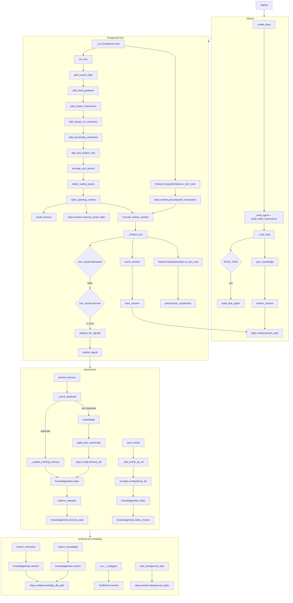

# Co CLI — Agentic Context Design

This doc covers the persistent and injected context layers that shape what the agent knows: **System Prompt**, **Conversation History**, **Memory**, and **Knowledge**, plus the operator-facing delegation metadata the session keeps alongside them. The per-turn execution loop, approval resumes, retries, and detailed history-processor behavior live in [DESIGN-core-loop.md](DESIGN-core-loop.md). Tool contracts for memory and knowledge tools live in [DESIGN-tools.md](DESIGN-tools.md).

## 1. What & How

The agent has no persistent state in model weights. Carry-forward context is split by lifecycle and consumer:

- **System prompt**: the highest-priority behavioral contract. A static scaffold is assembled once at startup, then runtime instruction layers are evaluated fresh on each request. Neither is subject to history compaction.
- **Conversation history**: the in-session message list passed to the model on each foreground turn. History processors run in a fixed order: trim old tool output, detect safety issues, recall relevant memory, then compact long transcripts. The message list itself is process memory only.
- **Memory**: conversation-derived facts, corrections, preferences, and session-summary artifacts stored as YAML-frontmatter markdown under `ctx.deps.config.memory_dir` (`.co-cli/memory/` in normal startup). Writes enter one lifecycle entrypoint: recent-window dedup may update and reindex an existing file, non-duplicate writes may optionally consolidate against recent memories, and only surviving ADD paths create a new file that is then indexed and subject to retention.
- **Knowledge index**: a derived SQLite search index over memories, library articles, Obsidian notes, and Drive documents cached after `read_drive_file()`. It is rebuildable and searched through `search_memories` for memory-only recall or `search_knowledge` for cross-source retrieval; `search_knowledge` defaults to non-memory sources unless `source="memory"` is requested explicitly.
- **Delegation metadata**: inline subagent provenance is carried in `ToolReturnPart.content`; background task state lives in `ctx.deps.session.background_tasks`. These support operator inspection but are not a separate recalled context layer.

```text
Agent construction (once per session)
  build_static_instructions()   — assembles all 7 sections in explicit order: soul seed, character memories, mindsets, rules (strict numbered order), examples, counter-steering, critique; fails on no rule files, invalid filenames, gaps, or duplicates
  Agent(instructions=...)       — static prompt stored on agent at construction; runtime @agent.instructions layers are registered afterward

Per-request dynamic layers (@agent.instructions — evaluated fresh, never accumulated)
  add_current_date()            — ISO date string
  add_shell_guidance()          — shell approval policy reminder
  add_project_instructions()    — .co-cli/instructions.md content (if present)
  add_always_on_memories()      — always_on=True memories as standing context
  add_personality_memories()    — personality-continuity memories
  add_tool_surface_hint()       — progressive tool surface description; instructs model to call search_tools

Conversation-history governance (main agent only)
  truncate_tool_returns()       — trim old ToolReturnPart.content > tool_output_trim_chars
  detect_safety_issues()        — doom-loop detection + shell reflection cap
  inject_opening_context()      — recall_memory() against current user message; inject as SystemPromptPart
  truncate_history_window()     — compact to head + summary marker + tail when over threshold

Turn-start compaction handoff
  HistoryCompactionState.on_turn_start()
    -> harvest completed precompute task into runtime.precomputed_compaction
    -> cancel stale unfinished task before run_turn()

After each foreground turn
  _finalize_turn()
    -> analyze_for_signals() then handle_signal() on clean turns only
    -> touch_session() then save_session()
    -> HistoryCompactionState.on_turn_end()
       -> precompute_compaction() in background for the next turn

Session persistence
  restore_session()
    -> load_session()
    -> is_fresh(ttl_minutes) restores session_id within TTL; else new_session() and attempt save_session()
  .co-cli/session.json          — session_id, created_at, last_used_at, compaction_count
  message_history               — not persisted to disk

Memory write path
  persist_memory()
    -> dedup check (recent-window fuzzy match)
       -> duplicate: update existing memory file + KnowledgeIndex.index()
       -> non-duplicate: optional LLM consolidation plan
          -> may UPDATE existing memory file
          -> may DELETE unprotected memory file
          -> may return without creating a new entry
    -> write markdown file to memory_dir when a new entry is needed
    -> KnowledgeIndex.index()
    -> enforce_retention() when memory_max_count is exceeded
       -> KnowledgeIndex.remove_stale() for retention-deleted memory files

Knowledge search path
  search_memories()
    -> KnowledgeIndex.search(source="memory", kind="memory")
       -> memory docs leg (docs_fts; docs_vec + RRF in hybrid mode)
       -> optional TEI or LLM reranking
  search_knowledge()
    -> KnowledgeIndex.search(source=["library","obsidian","drive"] by default)
       -> non-memory chunks leg (chunks_fts; chunks_vec in hybrid mode)
       -> explicit source="memory" routes to the memory docs leg
       -> RRF merge when hybrid
       -> optional TEI or LLM reranking

Delegation metadata
  run_*_subagent
    -> ToolResult includes run_id, role, model_name, requests_used, request_limit, scope
  start_background_task
    -> session.background_tasks[task_id] stores command, cwd, description, status, timestamps, exit code, output ring buffer, process handle
```



## 2. Core Logic

### Static Instructions

**Static scaffold**

`build_agent()` assembles static instructions once via `build_static_instructions()` in `prompts/_assembly.py`. Assembly order is strict:

1. Soul seed from `co_cli/prompts/personalities/souls/<role>/seed.md`
2. Character memories from files in `config.memory_dir` tagged with both `<role>` and `"character"`
3. Mindsets from `co_cli/prompts/personalities/mindsets/<role>/<task_type>.md`
4. Behavioral rules from `co_cli/prompts/rules/NN_rule_id.md`, loaded in contiguous numeric order
5. Soul examples from `co_cli/prompts/personalities/souls/<role>/examples.md`
6. Model-specific counter-steering from `co_cli/prompts/model_quirks/`
7. Soul critique appended as a trailing `## Review lens` block from `co_cli/prompts/personalities/souls/<role>/critique.md`

When no personality is configured, only numbered rules are guaranteed to participate. Model-specific counter-steering is added only when `model_name` is non-empty.

**Runtime instruction layers**

`build_agent()` registers six `@agent.instructions` callbacks. pydantic-ai evaluates them fresh on every model request:

| Layer | Condition | Content |
|-------|-----------|---------|
| `add_current_date` | always | `Today is YYYY-MM-DD.` |
| `add_shell_guidance` | always | Shell approval policy reminder |
| `add_project_instructions` | `.co-cli/instructions.md` exists | Full file contents |
| `add_always_on_memories` | `always_on=True` memories exist | Standing context block, capped by `memory_injection_max_chars` |
| `add_personality_memories` | personality configured | Relationship-continuity memories from the personality injector |
| `add_tool_surface_hint` | always | Description of progressive tool surface; instructs model to call `search_tools` to unlock additional tools |

The static instructions and these runtime instruction layers are not written into `message_history`, so `truncate_history_window()` does not operate on them.

**Task agent**

`build_task_agent()` uses a fixed `_TASK_AGENT_SYSTEM_PROMPT` string, omits history processors and per-request instruction layers, and keeps the same toolsets as the main agent. It exists to resume already-approved deferred tool calls without paying the full main-agent context cost.

### Conversation History

Conversation history is the ephemeral transcript passed into each foreground turn. The main agent registers four history processors in this order:

1. `truncate_tool_returns`
2. `detect_safety_issues`
3. `inject_opening_context`
4. `truncate_history_window`

This doc treats them as the context-governance layer. Their exact execution contract, retry boundaries, and approval interaction live in [DESIGN-core-loop.md](DESIGN-core-loop.md).

Two persistence rules matter here:

1. `deps.config.session_path` stores only session metadata: `session_id`, `created_at`, `last_used_at`, and `compaction_count`.
2. `message_history` itself is not written to disk. Restarts do not replay prior messages; only session metadata is restored, while memories and session-summary artifacts remain in the memory store.

Compaction is intentionally split across turns. `precompute_compaction()` may summarize the future middle of the transcript in the background after turn `N`; on turn `N+1`, `truncate_history_window()` either uses that cached summary when the boundaries still match or falls back to a static trim marker. It does not perform an inline summarization call in the foreground request path.

Token counting uses real provider-reported `input_tokens` from the most recent `ModelResponse` as the primary source. When no usage data is available (local or custom models with no reporting), it falls back to a character-count estimate (`total_chars // 4`). The compaction budget is `llm_num_ctx` when `uses_ollama_openai()` and `llm_num_ctx > 0`; otherwise it is `100,000` tokens. The trigger fires when token count exceeds 85% of that budget, or when message count exceeds `max_history_messages` — whichever comes first.

### Memory

**Write path**

All memory saves route through `persist_memory()` in `memory/_lifecycle.py`, whether they come from the explicit `save_memory` tool or the post-turn signal detector:

1. Create `memory_dir` if needed, load all items for ID allocation, and load memory-only entries for dedup and consolidation candidates
2. When `title is None`, check recent memories within `memory_dedup_window_days` using `_check_duplicate()`
3. If a duplicate is found, call `_update_existing_memory()` and re-index it when `knowledge_index` is available
4. Otherwise, when a resolved model is available, run `consolidate()` against the top `memory_consolidation_top_k` recent memories and apply the resulting plan with `apply_plan_atomically()`
5. If the consolidation plan contains no `ADD` action and is non-empty, return without writing a new entry
6. Validate `artifact_type` when one was provided
7. Write the new markdown file
8. Index it immediately when `KnowledgeIndex` is available
9. If `memory_max_count` is exceeded, run `enforce_retention()` and then `remove_stale()` when `KnowledgeIndex` is available

Consolidation timeouts are policy-dependent: explicit saves fall back to ADD, while auto-signal saves can skip the write.

**Auto-signal path**

After a clean foreground turn, `analyze_for_signals()` builds a plain-text window from recent `User:` / `Co:` lines and extracts structured `correction` or `preference` candidates. `handle_signal()` then:

- rejects tags outside `memory_auto_save_tags`
- auto-saves high-confidence signals with `on_failure="skip"`
- prompts the user for low-confidence signals before saving

**Recall path**

Recall is split in two:

1. `add_always_on_memories()` injects up to five `always_on=True` memories as a standing instruction layer every request.
2. `inject_opening_context()` runs once per new user turn, calls `recall_memory(query, max_results=3)`, and appends the formatted result as a trailing `SystemPromptPart`.

`MemoryRecallState` only debounces recall to once per user turn and tracks counters. The decay policy governed by `memory_recall_half_life_days` lives inside `recall_memory()` scoring, not in the history processor itself.

**Frontmatter schema**

| Field | Type | Notes |
|-------|------|-------|
| `id` | int | Sequential across memories and articles |
| `kind` | `"memory"` \| `"article"` | Default: `"memory"` |
| `created` | ISO8601 | Set at write time |
| `updated` | ISO8601 \| None | Set on updates |
| `tags` | list[str] | Lowercase tags for filtering/search |
| `provenance` | str | `detected` \| `user-told` \| `planted` \| `auto_decay` \| `web-fetch` \| `session` |
| `auto_category` | str \| None | `preference` \| `correction` \| `decision` \| `context` \| `pattern` \| `character`; loader warns on unknown literals rather than rejecting them |
| `certainty` | str | `high` / `medium` / `low` heuristic; loader warns on unknown literals rather than rejecting them |
| `decay_protected` | bool | Exempt from retention eviction |
| `always_on` | bool | Injected every turn by `add_always_on_memories()` |
| `related` | list[str] \| None | One-hop relationship links by slug |
| `artifact_type` | `"session_summary"` \| None | Structural artifact marker |
| `origin_url` | str \| None | Used by article records |

`validate_memory_frontmatter()` enforces required fields and types. It is strict for `provenance`, but intentionally lenient for some optional enum-like fields today: unknown `auto_category`, `certainty`, and `artifact_type` values are logged and tolerated instead of raising.

### Knowledge Index

`KnowledgeIndex` in `knowledge/_index_store.py` is one SQLite database at `knowledge_db_path` (default `co-cli-search.db`) with two retrieval legs:

- `docs` + `docs_fts`: document rows for all indexed sources; the memory retrieval path uses this leg directly
- `chunks` + `chunks_fts`: chunk rows for non-memory sources such as library articles, Obsidian notes, and Drive docs

Hybrid mode adds `docs_vec_*` and `chunks_vec_*` sqlite-vec tables and merges BM25 plus vector retrieval with Reciprocal Rank Fusion. If hybrid cannot initialize, bootstrap degrades to `fts5`, then to `grep`.

Optional reranking happens after retrieval:

- TEI cross-encoder via `knowledge_cross_encoder_reranker_url`
- LLM reranker via `knowledge_llm_reranker`

`sync_knowledge()` runs once at session start. It syncs memory and library directories immediately; Obsidian is synced lazily before `search_knowledge()` when needed, and Drive documents are indexed as they are read.

**Source routing in `search_knowledge()`**

| `source` param | Effective scope |
|---------------|-----------------|
| `None` (default) | `["library", "obsidian", "drive"]` |
| `"library"` | local article records |
| `"memory"` | memory records through the `docs_fts` leg |
| `"obsidian"` | Obsidian notes |
| `"drive"` | indexed Drive docs |

In grep fallback mode, only library and memory searches are supported.

### Delegation Metadata

Delegation provenance is captured in live session structures, not in a separate work-record store.

- Inline subagents return `ToolResult` payloads that include `run_id`, `role`, `model_name`, `requests_used`, `request_limit`, and `scope`.
- `truncate_tool_returns()` only trims the `display` field for dict-shaped tool results, so those identity keys survive transcript trimming.
- Background tasks are tracked in `ctx.deps.session.background_tasks` as `BackgroundTaskState` objects with command, cwd, status, timestamps, exit code, and an in-memory ring buffer of recent output.

The operator surface reads those live structures directly: `/history` scans transcript `ToolReturnPart`s for `run_*_subagent` and `start_background_task`, and `/tasks` reads `session.background_tasks`.

## 3. Config

### System Prompt

| Setting | Env Var | Default | Description |
|---------|---------|---------|-------------|
| `personality` | `CO_CLI_PERSONALITY` | `"finch"` | Soul directory name under `souls/`; enables identity, examples, critique, and personality-memory layers |

### Conversation History

| Setting | Env Var | Default | Description |
|---------|---------|---------|-------------|
| `session_ttl_minutes` | `CO_SESSION_TTL_MINUTES` | `60` | Minutes since last use within which a session ID is restored |
| `max_history_messages` | `CO_CLI_MAX_HISTORY_MESSAGES` | `40` | Message-count trigger for `truncate_history_window()` |
| `tool_output_trim_chars` | `CO_CLI_TOOL_OUTPUT_TRIM_CHARS` | `2000` | Max retained chars for older tool-return content before trimming |
| `doom_loop_threshold` | `CO_CLI_DOOM_LOOP_THRESHOLD` | `3` | Contiguous same-call streak threshold for doom-loop safety injection |
| `max_reflections` | `CO_CLI_MAX_REFLECTIONS` | `3` | Shell-error reflection cap enforced by `detect_safety_issues()` |
| `llm_num_ctx` | `LLM_NUM_CTX` | `262144` | Ollama OpenAI context budget used by token-based compaction thresholds when enabled |
| `model_http_retries` | `CO_CLI_MODEL_HTTP_RETRIES` | `2` | Retry budget for background compaction summarization |

### Memory

| Setting | Env Var | Default | Description |
|---------|---------|---------|-------------|
| `memory_max_count` | `CO_CLI_MEMORY_MAX_COUNT` | `200` | Max memory entries before retention runs |
| `memory_dedup_window_days` | `CO_CLI_MEMORY_DEDUP_WINDOW_DAYS` | `7` | Lookback window for duplicate candidates |
| `memory_dedup_threshold` | `CO_CLI_MEMORY_DEDUP_THRESHOLD` | `85` | Similarity percentage above which content is treated as a duplicate |
| `memory_recall_half_life_days` | `CO_MEMORY_RECALL_HALF_LIFE_DAYS` | `30` | Half-life used by `recall_memory()` scoring for non-protected memories |
| `memory_consolidation_top_k` | `CO_MEMORY_CONSOLIDATION_TOP_K` | `5` | Recent memories sent to the consolidator |
| `memory_consolidation_timeout_seconds` | `CO_MEMORY_CONSOLIDATION_TIMEOUT_SECONDS` | `20` | Max wait for LLM consolidation before fallback |
| `memory_auto_save_tags` | `CO_CLI_MEMORY_AUTO_SAVE_TAGS` | `["correction","preference"]` | Tags eligible for post-turn auto-save handling |
| `memory_injection_max_chars` | `CO_CLI_MEMORY_INJECTION_MAX_CHARS` | `2000` | Max chars injected for always-on and recalled memory blocks |

### Delegation Metadata

| Setting | Env Var | Default | Description |
|---------|---------|---------|-------------|
| `subagent_scope_chars` | `CO_CLI_SUBAGENT_SCOPE_CHARS` | `120` | Max task/query prefix stored in subagent result `scope` metadata |
| `subagent_max_requests_coder` | `CO_CLI_SUBAGENT_MAX_REQUESTS_CODER` | `10` | Default request budget when `run_coding_subagent(max_requests=0)` |
| `subagent_max_requests_research` | `CO_CLI_SUBAGENT_MAX_REQUESTS_RESEARCH` | `10` | Default request budget when `run_research_subagent(max_requests=0)` |
| `subagent_max_requests_analysis` | `CO_CLI_SUBAGENT_MAX_REQUESTS_ANALYSIS` | `8` | Default request budget when `run_analysis_subagent(max_requests=0)` |
| `subagent_max_requests_thinking` | `CO_CLI_SUBAGENT_MAX_REQUESTS_THINKING` | `3` | Default request budget when `run_reasoning_subagent(max_requests=0)` |

### Knowledge

| Setting | Env Var | Default | Description |
|---------|---------|---------|-------------|
| `obsidian_vault_path` | `OBSIDIAN_VAULT_PATH` | `None` | Vault path synced lazily by `search_knowledge()` for Obsidian results |
| `library_path` | `CO_LIBRARY_PATH` | `None` | Optional override for `library_dir`; when unset, `CoConfig.from_settings()` falls back to `DATA_DIR / "library"` |
| `knowledge_search_backend` | `CO_KNOWLEDGE_SEARCH_BACKEND` | `hybrid` | Requested search mode: `hybrid` \| `fts5` \| `grep` |
| `knowledge_embedding_provider` | `CO_KNOWLEDGE_EMBEDDING_PROVIDER` | `tei` | Embedding provider: `tei` \| `ollama` \| `gemini` \| `none` |
| `knowledge_embedding_model` | `CO_KNOWLEDGE_EMBEDDING_MODEL` | `embeddinggemma` | Embedding model name |
| `knowledge_embedding_dims` | `CO_KNOWLEDGE_EMBEDDING_DIMS` | `1024` | Embedding vector dimension |
| `knowledge_embed_api_url` | `CO_KNOWLEDGE_EMBED_API_URL` | `http://127.0.0.1:8283` | Embedder service URL |
| `knowledge_cross_encoder_reranker_url` | `CO_KNOWLEDGE_CROSS_ENCODER_RERANKER_URL` | `http://127.0.0.1:8282` | TEI cross-encoder reranker URL |
| `knowledge_llm_reranker` | `—` | `None` | Optional `ModelConfig` used for LLM reranking when no TEI reranker is active |
| `knowledge_chunk_size` | `CO_CLI_KNOWLEDGE_CHUNK_SIZE` | `600` | Chunk token size for non-memory sources |
| `knowledge_chunk_overlap` | `CO_CLI_KNOWLEDGE_CHUNK_OVERLAP` | `80` | Overlap tokens between adjacent chunks |

## 4. Files

| File | Purpose |
|------|---------|
| `co_cli/prompts/_assembly.py` | `build_static_instructions()` — single function assembling all 7 static instruction sections in explicit order |
| `co_cli/prompts/rules/` | Numbered behavioral rule files loaded in strict order |
| `co_cli/prompts/personalities/_loader.py` | Soul seed, character memories, mindsets, examples, and critique loaders |
| `co_cli/prompts/personalities/_injector.py` | Personality-continuity memory injection for the runtime instruction layer |
| `co_cli/prompts/model_quirks/` | Provider/model-specific counter-steering overrides |
| `co_cli/agent.py` | Main/task agent factories and `@agent.instructions` layer registration |
| `co_cli/context/_history.py` | History processors plus background compaction summarization and lifecycle |
| `co_cli/context/_session.py` | Session JSON persistence helpers |
| `co_cli/context/_types.py` | `CompactionResult`, `MemoryRecallState`, `SafetyState`, and `_CompactionBoundaries` |
| `co_cli/memory/_lifecycle.py` | `persist_memory()` write pipeline |
| `co_cli/memory/_consolidator.py` | LLM-driven `ConsolidationPlan` generation |
| `co_cli/memory/_retention.py` | Retention enforcement for over-cap memory sets |
| `co_cli/memory/_signal_detector.py` | Post-turn signal extraction and admission handling |
| `co_cli/knowledge/_index_store.py` | `KnowledgeIndex` SQLite schema, sync, search, vector merge, and reranking hooks |
| `co_cli/knowledge/_frontmatter.py` | Frontmatter parsing/validation and `ArtifactTypeEnum` |
| `co_cli/knowledge/_chunker.py` | Chunking for non-memory sources |
| `co_cli/knowledge/_embedder.py` | Embedding-provider adapters |
| `co_cli/knowledge/_reranker.py` | TEI and LLM reranker adapters |
| `co_cli/tools/memory.py` | `recall_memory`, `search_memories`, and memory file helpers |
| `co_cli/tools/articles.py` | `search_knowledge`, article persistence, and article-detail retrieval |
| `co_cli/tools/subagent.py` | Inline subagent tools that emit `run_id` and usage metadata |
| `co_cli/tools/_background.py` | Session-scoped `BackgroundTaskState` and subprocess monitor helpers |
| `co_cli/tools/task_control.py` | Background task tools over `session.background_tasks` |
| `co_cli/bootstrap/_bootstrap.py` | `sync_knowledge()` and `restore_session()` bootstrap the derived index and session identity |
| `co_cli/commands/_commands.py` | `/history` and `/tasks` slash commands over live delegation/background-task state |
