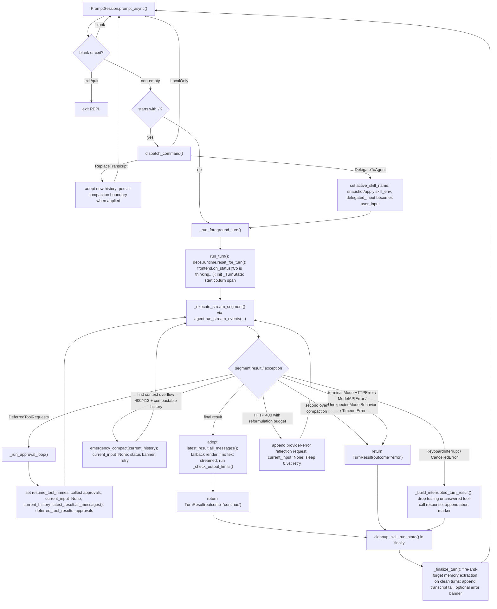

# Co CLI Core Loop Design

For top-level architecture and startup sequencing, see [DESIGN-system.md](DESIGN-system.md) and [DESIGN-flow-bootstrap.md](DESIGN-flow-bootstrap.md). This doc owns foreground-turn execution, approval resumes, retries, interrupts, and history-processor behavior. Persistent context layers and storage live in [DESIGN-context.md](DESIGN-context.md).

## 1. Foreground Turn Flow

This doc describes one complete foreground turn, from prompt input to post-turn finalization.



Execution owners:

| Owner | Responsibility |
| --- | --- |
| `_chat_loop()` | prompt input, blank/exit handling, slash dispatch, transcript replacement, and skill-env setup |
| `_run_foreground_turn()` | `run_turn()`, guaranteed skill-env cleanup, and post-turn finalization |
| `run_turn()` | one orchestrated LLM turn, including status updates, retries, approval resumes, output checks, and interrupt handling |
| `_execute_stream_segment()` | one `agent.run_stream_events(...)` segment plus frontend event delivery and usage merge |
| `_run_approval_loop()` | same-turn approval-resume cycle until output is no longer `DeferredToolRequests` |
| `_finalize_turn()` | clean-turn memory extraction, transcript append, and generic error banner |

Two boundary rules keep the loop legible:

- REPL-owned transcript state lives in `message_history` inside `main.py`
- orchestration never mutates REPL history in place; it returns a `TurnResult` with the next transcript snapshot

## 2. Core Logic

### 2.1 Turn Contract And State Ownership

`run_turn()` is the only public one-turn orchestration entrypoint. It returns:

| Field | Meaning |
| --- | --- |
| `outcome` | `"continue"` or `"error"` |
| `interrupted` | whether the turn ended due to interrupt/cancellation |
| `messages` | next transcript snapshot for the REPL |
| `output` | final model output object |
| `usage` | latest segment usage payload |
| `streamed_text` | whether visible assistant text was streamed live |

Turn-scoped mutable state is explicit in `_TurnState`:

| `_TurnState` field | Owner |
| --- | --- |
| `current_input` | current prompt text, or `None` for resume/retry hops |
| `current_history` | message list for the next segment call |
| `tool_reformat_budget` | HTTP 400 reformulation budget (app logic, not transport retry) |
| `latest_result` | most recent `AgentRunResult` from a completed segment |
| `latest_streamed_text` | last-segment streaming signal |
| `latest_usage` | last-segment usage payload |
| `tool_approval_decisions` | `DeferredToolResults` consumed by the next resume hop |
| `outcome` / `interrupted` | final turn outcome flags |

Cross-cutting turn state that lives on `deps.runtime` instead:

| `deps.runtime` field | Why it is not in `_TurnState` |
| --- | --- |
| `turn_usage` | authoritative per-turn accumulator shared across foreground and sub-agent tool calls |
| `safety_state` | owned by history processors, not by the orchestrator |
| `tool_progress_callback` | owned by `StreamRenderer` and active tool surfaces |
| `resume_tool_names` | set by `_run_approval_loop()` before each approval-resume segment; cleared after the loop exits; read by `_approval_resume_filter` |
| `compaction_failure_count` | cross-turn circuit breaker for inline compaction (>= 3 consecutive failures skips LLM) |
| `active_skill_name` | cross-function skill dispatch marker cleared after the turn |

### 2.2 Stream Segment Contract

`_execute_stream_segment()` owns exactly one `agent.run_stream_events(...)` call.

Inputs:

- `turn_state.current_input`
- `turn_state.current_history`
- `turn_state.tool_approval_decisions`
- `turn_state.latest_usage`
- selected agent surface: main agent for all passes (SDK skips `ModelRequestNode` on resume, so zero additional tokens)

Per-event handling:

| Event type | Behavior |
| --- | --- |
| `PartStartEvent` with `TextPart` / `ThinkingPart` | append buffered content into `StreamRenderer` |
| `PartDeltaEvent` with `TextPartDelta` / `ThinkingPartDelta` | append streamed deltas |
| `FinalResultEvent` / `PartEndEvent` | ignored for rendering; completion is defined by `AgentRunResultEvent` |
| `FunctionToolCallEvent` | flush buffered text/thinking, optionally show tool-start annotation, install progress callback |
| `FunctionToolResultEvent` | flush buffers, clear progress callback, render tool result panel when a `ToolReturnPart` exists |
| `AgentRunResultEvent` | store the final `AgentRunResult` object |

The event loop is wrapped in `asyncio.timeout(_LLM_SEGMENT_HANG_TIMEOUT_SECS)`. A `TimeoutError` from the guard propagates to `run_turn()`, which returns `TurnResult(outcome='error')` — no retry is attempted.

Normal-exit contract:

1. `renderer.finish()` flushes remaining thinking/text buffers.
2. `frontend.cleanup()` always runs in `finally`.
3. `turn_state.latest_result` must be non-`None`, otherwise `_execute_stream_segment()` raises `RuntimeError`.
4. `turn_state.latest_usage = result.usage()`
5. `turn_state.tool_approval_decisions = None`
6. `_merge_turn_usage()` adds the segment usage into `deps.runtime.turn_usage`

Reasoning display is purely a frontend concern:

| Mode | Behavior |
| --- | --- |
| `off` | thinking is discarded |
| `summary` | thinking is reduced to short status lines via `on_reasoning_progress()` |
| `full` | raw thinking is streamed and committed through the thinking surface |

### 2.3 Approval Flow

Approval deferral uses the native Pydantic-AI objects directly:

- `DeferredToolRequests` pauses a segment on approval-gated tool calls
- `_collect_deferred_tool_approvals()` turns those pending calls into `DeferredToolResults`
- `_run_approval_loop()` feeds that decision payload into the next segment

Approval collection sequence:

1. decode tool arguments with `decode_tool_args()`
2. resolve one `ApprovalSubject`
3. check `deps.session.session_approval_rules` for an exact `kind + value` match
4. otherwise prompt the user for `y`, `n`, or `a`
5. encode the decision into `DeferredToolResults`
6. optionally remember the scope when the user chose `a`
7. if denied, emit `logger.debug("tool_denied", tool_name, subject_kind, subject_value)`

Approval subject scopes:

| Tool shape | Subject kind | Remembered value |
| --- | --- | --- |
| `run_shell_command` | `shell` | first token of `cmd` |
| `write_file`, `edit_file` | `path` | parent directory |
| `web_fetch` | `domain` | parsed hostname |
| everything else, including MCP tools | `tool` | tool name |

Resume-loop behavior:

```text
# run_turn() — before first segment
# No explicit filter setup needed — _approval_resume_filter passes all
# during normal turns; SDK ToolSearchToolset handles deferred visibility.

# _run_approval_loop() — each resume hop
while latest_result.output is DeferredToolRequests:
  deps.runtime.resume_tool_names = frozenset(
      call.tool_name for call in approvals
  )
  approvals = _collect_deferred_tool_approvals(...)
  current_input = None
  current_history = latest_result.all_messages()
  tool_approval_decisions = approvals
  run next segment with main agent
clear deps.runtime.resume_tool_names
```

Important precision:

- `_approval_resume_filter` passes all during normal turns; narrows to `resume_tool_names` + `ALWAYS` tools during resume
- applies uniformly to native and MCP tools (all combined under one filter)
- approval resumes happen inside the same user turn; they are not a new REPL iteration

Shell approval remains split correctly:

- `run_shell_command()` decides `DENY`, `ALLOW`, or `REQUIRE_APPROVAL` from command shape
- only the `REQUIRE_APPROVAL` path reaches deferred approval handling
- denied shell commands never enter `_collect_deferred_tool_approvals()`

### 2.4 History Processors And Inline Compaction

The main agent is built with five history processors in this exact order:

1. `truncate_tool_results`
2. `compact_assistant_responses`
3. `detect_safety_issues`
4. `inject_opening_context`
5. `summarize_history_window`

Processor roles:

| Processor | Role |
| --- | --- |
| `truncate_tool_results` | content-clears compactable tool results by per-tool-type recency (keep 5 most recent per type); protects the last turn (from last `UserPromptPart` onward) |
| `compact_assistant_responses` | caps large `TextPart`/`ThinkingPart` in older `ModelResponse` messages at 2.5K chars with proportional head/tail truncation; protects the last turn (from last `UserPromptPart` onward); does not touch `ToolCallPart` args |
| `detect_safety_issues` | injects guardrails for doom loops and repeated shell failures |
| `inject_opening_context` | recalls memories and injects them as a trailing `SystemPromptPart` |
| `summarize_history_window` | replaces the middle of long histories with an inline LLM summary (with context enrichment) or static marker (circuit-breaker fallback) |

Ordering rationale:

- **#1–2 before #5**: truncation and response capping run before summarization. The summarizer sees partially cleared content but receives rich side-channel context (file working set from `ToolCallPart.args`, session todos, always-on memories) to compensate. This avoids architectural complexity (persistent history, non-destructive processors) while matching fork-cc's proven strategy.
- **#3 before #5**: `detect_safety_issues` scans recent tool calls for doom loops and shell error streaks. Running it before summarization ensures it scans the full un-compacted history — if summarization drops the middle first, streak evidence in the dropped slice would be missed.
- **#4 before #5**: `inject_opening_context` appends recalled memories at the tail, outside the summarizer's dropped slice. Placed before summarization to keep the costliest processor (LLM call) last.
- **All sync processors (#1–3) before async (#4–5)**: sync processors run inline with zero overhead. Async processors are awaited directly on the event loop.

Compaction behavior:

- `summarize_history_window()` gathers side-channel context via `_gather_compaction_context()` (file working set, todos, always-on memories, prior summaries — capped at 4K chars), then calls `summarize_messages()` inline with a structured template when compaction triggers
- it compacts when token count exceeds 85% of the budget
- token count is the real provider-reported `input_tokens` from the latest `ModelResponse`; when no usage is available it falls back to a character-count estimate (`total_chars // 4`)
- the budget is resolved by `resolve_compaction_budget()` in `context/summarization.py`: model's `context_window` from quirks (Ollama config overrides the spec), then `llm.num_ctx` when Ollama OpenAI-compat is active, then `100,000` tokens
- when `deps.model` is absent (sub-agents, tests), it uses a static marker directly without incrementing the failure counter
- a circuit breaker (`deps.runtime.compaction_failure_count`) skips the LLM call after 3 consecutive failures; on success the counter resets to 0
- a `[dim]Compacting conversation...[/dim]` indicator is shown before the LLM call

Memory recall is also per-turn, not sticky:

- `inject_opening_context()` stores counters in `deps.session.memory_recall_state`
- it recalls only once per new user turn
- failure to recall silently leaves history unchanged
- the recall logic itself lives in `tools/memory.py::_recall_for_context()` (internal — called by `inject_opening_context`, not registered as an agent tool)

### 2.5 Retries, Output Limits, Errors, And Interrupts

`run_turn()` owns app-level error handling. Transport-level retries (HTTP 429, 5xx, network errors) are delegated to the OpenAI SDK's built-in retry machinery and are not managed by `run_turn()`.

Error matrix:

| Condition | Behavior |
| --- | --- |
| HTTP 400/413 with context-length body pattern (`_is_context_overflow`) | one-shot `emergency_compact()` — keeps first + last turn group with static marker. Retry on success; terminal if ≤2 groups or second overflow. Never falls through to 400 reformulation. |
| HTTP 400 with reformat budget left (not context overflow) | append a reflection request describing the rejected tool call, set `current_input=None`, retry (app-level reformulation, not transport retry) |
| HTTP 400 with budget exhausted, or other terminal HTTP errors | set `outcome='error'` and return `_build_error_turn_result()` |
| `ModelAPIError` (network errors exhausted by SDK) | set `outcome='error'` and return `_build_error_turn_result()` |
| `TimeoutError` (segment hang guard) | no retry; set `outcome='error'` and return `_build_error_turn_result()` |
| `UnexpectedModelBehavior` | no retry; surface as a user-facing status message, set `outcome='error'` and return `_build_error_turn_result()` |
| `KeyboardInterrupt` / `CancelledError` | return `_build_interrupted_turn_result()` |

Output-limit diagnostics happen only after a successful final segment:

1. if `latest_result.response.finish_reason == "length"`, show a truncation status message
2. if the provider supports context-ratio tracking, compare `deps.runtime.turn_usage.input_tokens / deps.config.llm.num_ctx`
3. emit either a warning or overflow message based on `ctx_warn_threshold` and `ctx_overflow_threshold`

Interrupt handling is conservative:

- `KeyboardInterrupt` or `asyncio.CancelledError` returns `_build_interrupted_turn_result()`
- if the transcript ends with a `ModelResponse` containing unanswered `ToolCallPart`s, that response is dropped
- an abort marker `ModelRequest` is appended so the next turn knows the previous turn was interrupted and must verify state

### 2.6 Post-Turn Finalization In `main.py`

`_run_foreground_turn()` sequences the full wrapper around `run_turn()`:

1. `run_turn(...)`
2. `cleanup_skill_run_state(saved_env, deps)` in `finally`
3. `_finalize_turn(...)`

`_finalize_turn()` then performs the remaining non-orchestration work:

1. fire-and-forget memory extraction when the turn was clean (not interrupted, not `outcome == "error"`)
2. `append_messages()` — positional tail slice of new messages written to `deps.session.session_path`
3. print a generic error banner when `turn_result.outcome == "error"`

Skill dispatch is intentionally scoped to one delegated turn:

- `_chat_loop()` applies `skill_env` only for the delegated skill run
- `_cleanup_skill_run_state()` restores prior environment values and clears `deps.runtime.active_skill_name`
- finalization happens only after that restoration

### 2.7 Comparison Against Common Peer Patterns

The foreground loop still matches the common 2026 CLI-agent shape more than it diverges from it.

| Common pattern | `co` today | Design read |
| --- | --- | --- |
| one owned foreground turn executor | `run_turn()` | aligned |
| event-stream-driven rendering | `_execute_stream_segment()` + `StreamRenderer` | aligned |
| approvals outside most tool bodies | `_collect_deferred_tool_approvals()` / `_run_approval_loop()` | aligned |
| command-specific shell trust boundary | shell tool classifies allow/deny/ask itself | aligned and strong |
| error handling and interrupts owned by the loop | `run_turn()` | aligned |
| compaction as an inline concern with circuit breaker | `summarize_history_window()` with `compaction_failure_count` | aligned |
| isolated specialist contexts | sub-agents use `make_subagent_deps()` and stay outside the foreground loop | aligned |

The intentional simplification remains:

- no planner graph in the foreground turn
- no multi-turn queue inside the loop
- no approval memory persisted across sessions

## 3. Config

These settings most directly shape one-turn orchestration behavior. Context-storage and knowledge-index settings are documented in [DESIGN-context.md](DESIGN-context.md).

| Setting | Env Var | Default | Description |
| --- | --- | --- | --- |
| `tool_retries` | `CO_CLI_TOOL_RETRIES` | `3` | Per-tool retry count baked into agent/tool registration |
| `doom_loop_threshold` | `CO_CLI_DOOM_LOOP_THRESHOLD` | `3` | Identical tool-call streak threshold for doom-loop intervention |
| `max_reflections` | `CO_CLI_MAX_REFLECTIONS` | `3` | Consecutive shell-error streak threshold for reflection guardrail |
| `ctx_warn_threshold` | `CO_CTX_WARN_THRESHOLD` | `0.85` | Context-ratio warning threshold |
| `ctx_overflow_threshold` | `CO_CTX_OVERFLOW_THRESHOLD` | `1.0` | Context-ratio overflow threshold |
| `reasoning_display` | `CO_CLI_REASONING_DISPLAY` | `summary` | Thinking display mode for streamed turns |

## 4. Files

| File | Purpose |
| --- | --- |
| `co_cli/main.py` | REPL loop, slash routing, skill-env lifecycle, foreground-turn wrapper, and teardown |
| `co_cli/context/orchestrate.py` | `TurnResult`, `_TurnState`, stream execution, approval loop, error handling, output checks, and interrupt/error builders |
| `co_cli/context/_history.py` | history processors: tool-output trim, safety detection, memory injection, and sliding-window compaction trigger with circuit breaker |
| `co_cli/context/summarization.py` | `summarize_messages`, `resolve_compaction_budget`, and token-estimation helpers — shared by history processor and `/compact` |
| `co_cli/context/types.py` | shared `MemoryRecallState` and `SafetyState` dataclasses |
| `co_cli/agent.py` | main agent factory and native filtered toolset construction with per-tool loading policy |
| `co_cli/context/tool_approvals.py` | approval-subject resolution, remembered rule matching, and decision recording |
| `co_cli/tools/shell.py` | command-shape shell allow/deny/approval logic |
| `co_cli/display/_stream_renderer.py` | text/thinking buffering, reasoning reduction, and progress callback wiring |
| `co_cli/display/_core.py` | terminal frontend surfaces, tool panels, status rendering, and approval prompts |
| `co_cli/context/session.py` | session filename generation, latest-session discovery, migration from legacy format |
| `co_cli/context/skill_env.py` | skill-run environment save/restore and active-skill-name cleanup |
