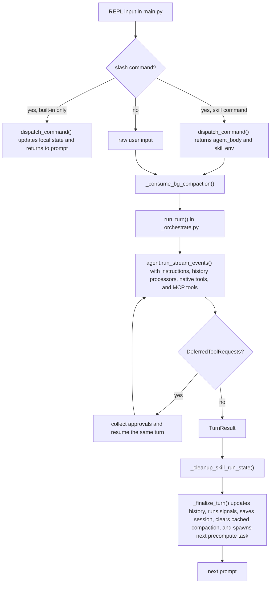
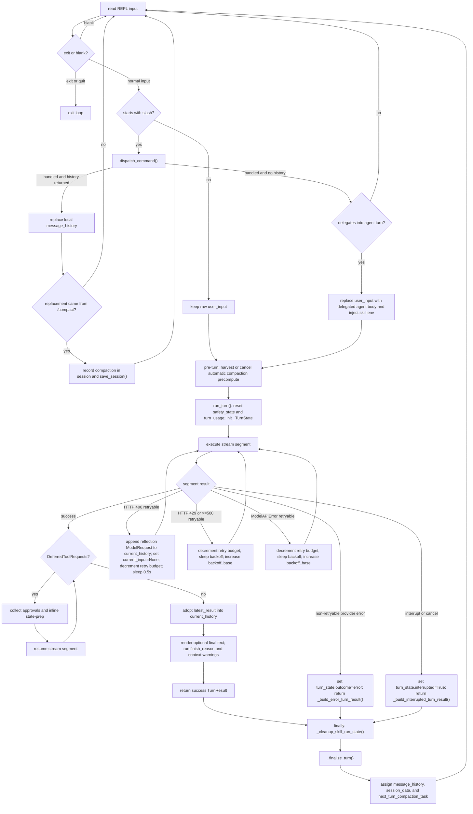
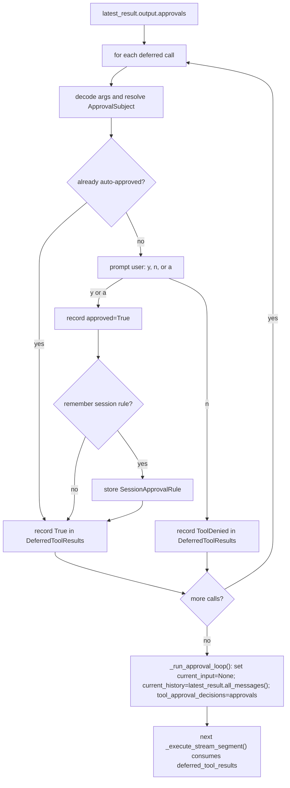

# Co CLI — Core Loop Design

> For top-level architecture and startup sequencing, see [DESIGN-system.md](DESIGN-system.md) and [DESIGN-bootstrap.md](DESIGN-bootstrap.md).

## 1. One-Turn Runtime Path

This section is a system-boundary view of one turn.

- `main.py` owns REPL input, slash-command dispatch, skill env injection and rollback, background-compaction harvest/spawn, session persistence, and post-turn hooks.
- `_orchestrate.py` owns one turn through `run_turn()`: reset turn-scoped state, open the `co.turn` span, stream segments, handle deferred approvals, apply provider retry policy, and return `TurnResult`.
- `_orchestrate.py` works on `_TurnState` and returns the next history snapshot; it does not mutate REPL-owned history directly.
- `agent.py` owns the agent runtime surface: instructions, history processors, native tools, and optional MCP toolsets.
- The diagram below shows module ownership and handoff points, not the detailed branch-by-branch `_chat_loop()` flow.



## 2. Core Logic

### 2.1 Main Turn Path

This diagram is the detailed control flow inside `_chat_loop()` in `main.py`.

- Read REPL input.
- Route built-in slash commands locally.
- Expand skill commands into synthetic user text.
- Treat unknown slash commands as handled locally: print an error and return to the prompt.
- For transcript-management slash commands, adopt the replacement transcript locally; `/compact` also records session metadata that a compaction occurred.
- Delegate the full foreground turn lifecycle to `_run_foreground_turn()`, which sequences: compaction harvest, `run_turn()`, `_cleanup_skill_run_state()` in `finally`, and `_finalize_turn()`. `_ChatTurnState` fields (`message_history`, `session_data`, `next_turn_compaction_task`) are mutated in-place by `_run_foreground_turn()` after `_finalize_turn()` completes.



Notes:
- Built-in slash commands never enter the agent turn.
- Built-in transcript-management commands may replace local `message_history` before any turn runs.
- `/compact` does the actual summarization inside `_cmd_compact()` and related history helpers; `increment_compaction()` is only local session bookkeeping after that replacement history is returned.
- Unknown slash commands are also handled locally: `dispatch_command()` prints an error and `_chat_loop()` continues without calling `run_turn()`.
- Skill slash commands are explicit delegation commands: they produce delegated agent input, inject skill env, and then enter `run_turn()`.
- The pre-turn compaction node is not input transformation; it is the point where `_chat_loop()` harvests or cancels the previous turn's background compaction task before entering a new turn.
- Retryable provider failures stay inside `run_turn()` and do not return control to `_chat_loop()`.
- Success, interrupted, and error `TurnResult` values all flow through `_cleanup_skill_run_state()` and `_finalize_turn()`.
- `TurnOutcome` is `Literal["continue", "error"]`. Both values are emitted by `run_turn()`.

Segment execution inside `run_turn()`:
- `_execute_stream_segment()` reads `_TurnState.current_input`, `current_history`, `tool_approval_decisions`, and `latest_usage`.
- It calls `agent.run_stream_events(...)` and delegates text/thinking buffering to `StreamRenderer`.
- Tool-call events flush buffered output, call `frontend.on_tool_start()`, and install progress callbacks.
- Tool-result events flush buffered output, clear progress callbacks, and call `frontend.on_tool_complete()`.
- `AgentRunResultEvent` provides the final result object for the segment.
- On exit, `StreamRenderer.finish()` flushes remaining buffers and `frontend.cleanup()` always runs.
- The function writes `latest_result`, `latest_streamed_text`, and `latest_usage` back into `_TurnState`, clears `tool_approval_decisions`, and merges `latest_usage` into `deps.runtime.turn_usage` via `_merge_turn_usage()`.

Processing outline for each segment:

```text
run_stream_events(...)
  -> text/thinking events delegated to StreamRenderer (throttled buffer + flush)
  -> tool-call event: StreamRenderer.flush_for_tool_output(), frontend.on_tool_start(), renderer.install_progress()
  -> tool-result event: StreamRenderer.flush_for_tool_output(), renderer.clear_progress(), frontend.on_tool_complete()
  -> AgentRunResultEvent stores the final result object
  -> function exit: StreamRenderer.finish() flushes remaining buffers, then frontend.cleanup()
  -> if no AgentRunResultEvent was observed, raise RuntimeError
  -> turn_state.latest_result, latest_streamed_text, latest_usage updated in-place; _merge_turn_usage() accumulates segment usage into deps.runtime.turn_usage
```

What `_execute_stream_segment()` does not do:
- no retry logic
- no approval decisions
- no conversation-history mutation beyond updating `turn_state`

### 2.2 Approval Flow

- `DeferredToolRequests` means the last segment paused on approval-gated tool calls.
- `DeferredToolResults` means Co’s approval decisions for those calls: allow=`True`, deny=`ToolDenied`.
- `DeferredToolResults` is not tool output. It is the decision payload passed into the next resumed `_execute_stream_segment()`.
- `_collect_deferred_tool_approvals()` handles one paused segment: decode args, resolve an `ApprovalSubject`, check session-scoped auto-approval, otherwise prompt the user, then record one approval result per tool call.
- `_run_approval_loop()` owns the resume cycle: while the latest segment still returns `DeferredToolRequests`, it collects approvals, sets `current_input = None`, promotes `latest_result.all_messages()` into `current_history`, stores `tool_approval_decisions`, and runs the next segment.



Current approval subject scopes:

| Tool shape | Subject kind | Stored value | Rememberable |
|---|---|---|---|
| `run_shell_command` | `shell` | first token of `cmd` | yes when non-empty |
| `write_file`, `edit_file` | `path` | `{tool_name}:{parent_dir}` | yes when path has a parent |
| `web_fetch` | `domain` | parsed hostname | yes when hostname exists |
| MCP tool with configured prefix | `mcp_tool` | `{prefix}:{tool_name}` | yes |
| anything else | `tool` | tool name | no |

Rules:
- `"a"` is session-scoped only. Rules live in `deps.session.session_approval_rules`.
- Auto-approval matching is exact on `kind + value`.
- `record_approval_choice()` decides whether an `"a"` answer also stores a session rule; rememberability is not a separate branch in `_collect_deferred_tool_approvals()`.
- Shell approval is command-dependent, so `run_shell_command()` classifies the command before deferred approval handling:

```text
evaluate_shell_command(cmd)
  DENY              -> return terminal_error immediately
  ALLOW             -> execute immediately
  REQUIRE_APPROVAL  -> if ctx.tool_call_approved then execute else raise ApprovalRequired
```

This keeps shell `DENY` and `ALLOW` inside the tool. `_collect_deferred_tool_approvals()` only handles shell calls that already raised `ApprovalRequired`.

### 2.3 History Processors And Background Compaction

The agent is built with four history processors in this order:
1. `truncate_tool_returns`
2. `detect_safety_issues`
3. `inject_opening_context`
4. `truncate_history_window`

`truncate_history_window()` compacts when either condition is true:

- `len(messages) > max_history_messages`
- estimated tokens exceed 85% of the internal default budget

Compaction keeps the first run in the head, keeps a recent tail, and replaces the middle with either:

- a cached precomputed summary from `ctx.deps.runtime.precomputed_compaction` when the cached `message_count`, `head_end`, and `tail_start` still match
- a static trim marker when no usable precomputed summary exists

No inline LLM summarization happens inside `truncate_history_window()`. `main.py` is responsible for harvesting the background task result before the next turn and for clearing `precomputed_compaction` after the turn completes.

Background compaction contract:

```text
after turn N:
  main.py spawns precompute_compaction(message_history, deps, primary_model)
  task may return None when history is not near the trigger, already past the trigger, or summarization fails

before turn N+1:
  main.py harvests completed task into deps.runtime.precomputed_compaction
  or cancels unfinished task

during turn N+1:
  truncate_history_window() may consume that cached result

after turn N+1:
  main.py clears deps.runtime.precomputed_compaction
```

### 2.4 Safety, Errors, And Interrupts

Safety and error handling are split across the loop:

| Concern | Owner | Behavior |
|---|---|---|
| doom-loop detection | `detect_safety_issues()` | injects a system prompt after repeated identical tool calls |
| shell reflection cap | `detect_safety_issues()` | injects a system prompt after repeated shell failures |
| HTTP 400 tool-call rejection with retries left | `run_turn()` | appends a reflection request to `current_history`, sets `current_input=None`, and retries |
| HTTP 429 or 5xx with retries left | `run_turn()` | sleeps with backoff, using `Retry-After` when available, then retries |
| `ModelAPIError` with retries left | `run_turn()` | sleeps with backoff and retries |
| unknown 4xx, auth/not-found errors, or exhausted retry budget | `run_turn()` | emits status and returns `TurnResult(outcome="error")` |
| `KeyboardInterrupt` / `CancelledError` during turn | `run_turn()` | truncates to last clean `ModelResponse`, appends an abort marker, returns `interrupted=True` |

Interrupt recovery invariant:
- the next turn must see history ending at a clean point, so the last `ModelResponse` is dropped if it contains any unanswered `ToolCallPart` entries before the abort marker is appended.

### 2.5 Post-Turn Hooks In `main.py`

`_chat_loop()` delegates the full foreground turn lifecycle to `_run_foreground_turn()`. That helper sequences two post-turn helpers:

- `_cleanup_skill_run_state(saved_env, deps)` — called in `finally` to restore saved env vars and clear `active_skill_env` / `active_skill_name`
- `_finalize_turn(turn_result, ...)` — called after env restore; performs the remaining steps:

1. replace `message_history` with `turn_result.messages`
2. if the turn was not interrupted and not an error, run `analyze_for_signals()` and `handle_signal()`
3. clear `deps.runtime.precomputed_compaction`
4. `touch_session()` and `save_session()`
5. spawn the next `precompute_compaction(...)` task via `_spawn_bg_compaction()`
6. if `outcome == "error"`, print a generic error banner

### 2.6 Comparison Against Common Peer Patterns

- Evaluate the current core loop against the shared patterns that recur across the reference systems, not against the largest feature set in any one peer.
- Across Codex, Claude Code, Gemini CLI, Aider, OpenClaw, pi-mono, Letta, Mem0, OpenCode, and nanobot, the common loop shape is still structurally simple:
1. one foreground user input enters one owned turn executor
2. the executor streams model output and tool activity incrementally
3. approvals are resolved at explicit boundaries outside most tool bodies
4. history is compacted or trimmed between turns, not by spawning an in-turn planner graph
5. retries and interrupts are handled by the loop owner, not scattered across tools
6. specialist or background work is bounded and isolated from the main foreground turn
- `co` matches that common shape more than it differs from it.
- The main loop remains REPL-owned.
- `run_turn()` stays a single-turn executor.
- Approvals resume inside the same turn.
- Compaction remains a background optimization rather than a second agent.

| Common pattern from reference systems | How `co` compares | Design read |
|---|---|---|
| Single foreground turn owner (`Codex`, `Claude Code`, `Aider`, `OpenCode`, `pi-mono`) | `main.py` owns REPL/session state and `_orchestrate.py` owns one turn | Aligned |
| Streaming-first execution (`Codex`, `Claude Code`, `Gemini CLI`, `OpenCode`) | `_execute_stream_segment()` is event-driven and frontend-facing | Aligned |
| Orchestration-owned approvals (`Codex`, `Claude Code`, `Aider`, `pi-mono`) | deferred approvals live in `_collect_deferred_tool_approvals()`; shell keeps only command classification inside the tool | Aligned |
| Command-specific shell trust boundary (`Codex`, `Claude Code`) | `run_shell_command()` classifies `DENY` / `ALLOW` / `REQUIRE_APPROVAL` before execution | Aligned and strong |
| Bounded retry and interrupt recovery in the loop (`Codex`, `Claude Code`, `OpenClaw`, `OpenCode`) | `run_turn()` owns provider retries, reflection retry, usage-limit handling, and clean interrupt truncation | Aligned |
| Compaction as a sidecar maintenance concern (`Claude Code`, `OpenClaw`, `pi-mono`, `nanobot`) | background precompute plus turn-time consumption keeps compaction out of the live turn | Aligned |
| Isolated specialist contexts rather than shared mutable subagents (`Claude Code`, `OpenClaw`, `pi-mono`) | sub-agents are isolated through `make_subagent_deps()` and are not part of the foreground loop | Aligned |
| Tighter typed memory models (`Letta`, `Mem0`) | core loop only injects recalled context and does not depend on typed memory blocks | Intentionally simpler than frontier memory systems |
| Event-driven multi-step task graphs (`Gemini CLI`, `OpenClaw`, `nanobot`) | foreground loop is still single-turn; long-running autonomy is mostly outside this path today | Deliberate non-adoption for MVP |

### 2.7 Over-Design Check

- Relative to the common baseline above, the current core loop has a few places where the design is heavier than the shared peer pattern requires.

| Area | Why it is heavier than the common pattern | Risk |
|---|---|---|
| `main.py` split ownership across REPL input, slash dispatch, skill env injection, background-compaction harvest/spawn, session persistence, and post-turn signal detection | Post-turn hooks extracted into `_finalize_turn()` and `_cleanup_skill_run_state()` helpers; full foreground lifecycle delegated to `_run_foreground_turn()`; three co-evolving locals grouped under `_ChatTurnState`. `_chat_loop()` is now a clean input loop with control-plane routing. | Remaining split is closer to the minimum needed for a single-turn loop |
| Turn state spread across `message_history`, `current_history`, `deps.runtime.precomputed_compaction`, background task state, and `_TurnState.latest_*` fields | The behavior is correct, but the number of moving pieces is above the minimum needed for a single-turn loop | Harder to reason about retries, resume points, and stale cached state |
| Approval subject taxonomy (`shell`, `path`, `domain`, `mcp_tool`, `tool`) plus exact-match remembered rules | More nuanced than the simpler allow-once / allow-session patterns seen in Aider and many CLI peers | Trust UX can become harder to explain than the underlying safety gain justifies |
| Post-turn hook chain in `_chat_loop()` | Signal detection, compaction cache clearing, session save, and next-turn precompute all happen after the core turn returns | The true loop boundary is less obvious in code and docs |
| `_execute_stream_segment()` stream-state adaptation and frontend rendering policy | Buffer throttling and flush policy extracted to `StreamRenderer` (`co_cli/display/_stream_renderer.py`). Tool display metadata extracted to `_display_hints.py`. `_execute_stream_segment()` now delegates both concerns, keeping only event routing. | Addressed — display changes and orchestration changes are now decoupled |

- Main loop-specific over-design signals today:
- `main.py`'s `_chat_loop()` is now an input loop with control-plane routing. The foreground turn lifecycle (compaction harvest, `run_turn()`, skill env cleanup, finalization) lives in `_run_foreground_turn()`. REPL input, slash dispatch, and skill env injection remain inline.
- The loop carries multiple state carriers for history and compaction, which increases semantic overhead even though each piece is individually reasonable.
- Approval remembering has grown more granular than the common peer baseline; the next improvement should be legibility, not more approval states.

- Areas that do **not** appear over-designed:
- Approval resume staying inside the same turn is consistent with the strongest peer patterns and avoids fake user-message hops.
- Background compaction precompute is lighter than the explicit compaction-agent designs discussed in earlier research and remains a pragmatic optimization.
- Shell approval classification inside the shell tool is justified because the trust decision depends on command shape, not just tool identity.

- Practical conclusion:
- keep the single-turn `run_turn()` contract
- keep orchestration-owned approvals
- keep compaction as a background sidecar
- reduce semantic surface in `main.py` and turn-state ownership before adding new loop abstractions such as task graphs, ACP orchestration, or richer approval classes

## 3. Config

| Setting | Env Var | Default | Description |
|---|---|---|---|

| `model_http_retries` | `CO_CLI_MODEL_HTTP_RETRIES` | `2` | Retry budget for provider and network errors |
| `doom_loop_threshold` | `CO_CLI_DOOM_LOOP_THRESHOLD` | `3` | Identical tool-call streak before doom-loop intervention |
| `max_reflections` | `CO_CLI_MAX_REFLECTIONS` | `3` | Consecutive shell-error streak before reflection-cap intervention |
| `tool_output_trim_chars` | `CO_CLI_TOOL_OUTPUT_TRIM_CHARS` | `2000` | Max chars retained for older tool returns |
| `max_history_messages` | `CO_CLI_MAX_HISTORY_MESSAGES` | `40` | Message-count threshold for sliding-window compaction |
| `ctx_warn_threshold` | `CO_CTX_WARN_THRESHOLD` | `0.85` | Context-ratio threshold for warning the user that prompt budget is getting tight |
| `ctx_overflow_threshold` | `CO_CTX_OVERFLOW_THRESHOLD` | `1.0` | Context-ratio threshold for warning that the provider likely truncated or overflowed input context |
| `session_ttl_minutes` | `CO_SESSION_TTL_MINUTES` | `60` | Session restore freshness window |
| `memory_injection_max_chars` | `CO_CLI_MEMORY_INJECTION_MAX_CHARS` | `2000` | Max chars injected into context from memory recall per turn |

## 4. Files

| File | Purpose |
|---|---|
| `co_cli/main.py` | REPL loop, slash dispatch, skill env injection, post-turn hooks, background compaction scheduling |
| `co_cli/context/_orchestrate.py` | `run_turn()` (single turn entrypoint, emits `co.turn` OTel span), `_execute_stream_segment()` (segment event loop, updates `_TurnState`), `_run_approval_loop()` (approval-resume cycle), `_collect_deferred_tool_approvals()`, `_build_interrupted_turn_result()` (truncate and abort-mark on interrupt), `_build_error_turn_result()` |
| `co_cli/agent.py` | Main agent construction: instructions, history processors, native tools, MCP toolsets |
| `co_cli/context/_history.py` | Opening-context injection, tool-output trimming, safety checks, sliding-window compaction, background precompute |
| `co_cli/tools/shell.py` | Command-dependent shell approval and execution path |
| `co_cli/tools/_tool_approvals.py` | Approval subject resolution, session rule matching, and approval recording |
| `co_cli/display/_stream_renderer.py` | `StreamRenderer`: text/thinking buffering, flush/throttle policy, progress callback wiring |
| `co_cli/tools/_display_hints.py` | Tool display metadata: args display key per tool, tool result format helper |
| `co_cli/commands/_commands.py` | Built-in slash commands, skill dispatch, and `/approvals` management |
| `co_cli/context/_session.py` | Session persistence helpers |
