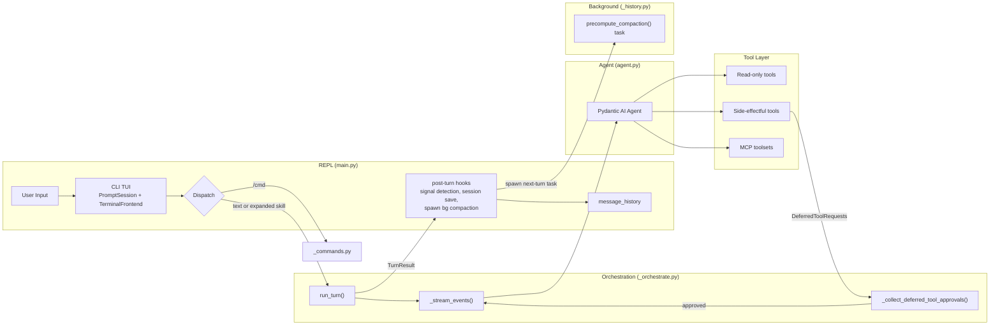
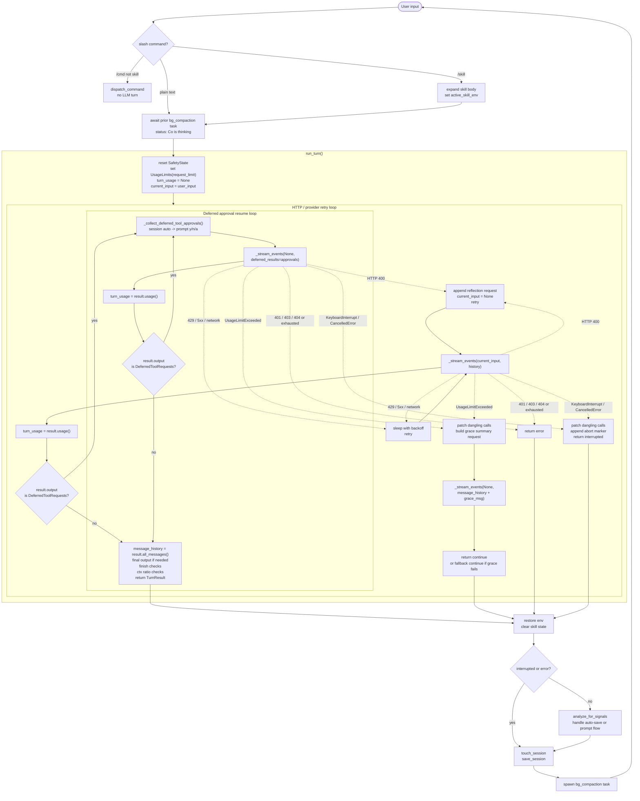
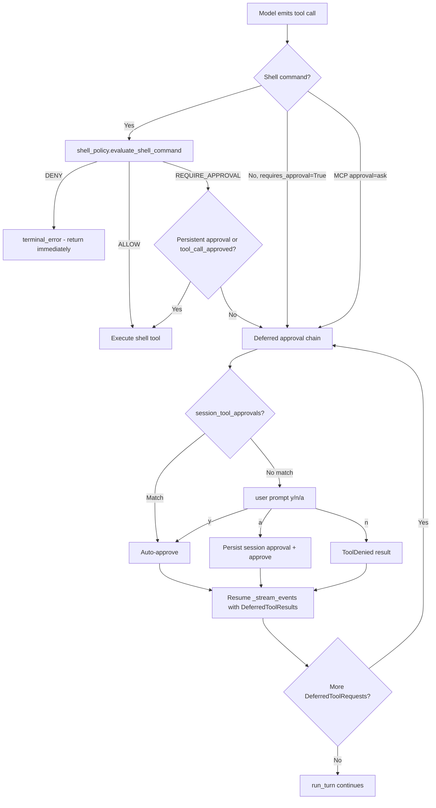

# Co CLI — Core Loop Design

> For system architecture and top-level contracts: [DESIGN-system.md](DESIGN-system.md).

## 1. What & How

This doc is the canonical design for the agent main loop. It covers what happens from the moment the interactive session starts accepting input through one user turn completing: slash-command dispatch, skill expansion, `run_turn()`, streaming, shell policy checks, approval flow interception, retries, interrupt recovery, post-turn hooks, and the runtime contracts that keep the loop stable across turns.

Scope boundary:
- In scope: `chat_loop()`, `run_turn()`, `_stream_events()`, `_collect_deferred_tool_approvals()`, shell approval gating, turn outcomes, runtime safety guards, REPL-facing control flow
- Out of scope: startup/bootstrap sequencing in [DESIGN-system-bootstrap.md](DESIGN-system-bootstrap.md), and broad system architecture in [DESIGN-system.md](DESIGN-system.md)

## 2. Component In System Architecture



Loop boundaries:
- Before the REPL can run a turn, startup must already have created `deps`, built the main `agent`, and loaded `message_history` plus `session_data`.
- During a turn, the core loop directly drives frontend rendering, deferred approval collection and resume, post-turn signal analysis, session persistence, and background compaction scheduling for the next turn.
- The core loop uses but does not define adjacent subsystems: shell approval classification lives in `run_shell_command()` and `_shell_policy.py`; prompt assembly and history processors are attached in `build_agent()`; `_collect_deferred_tool_approvals()` handles session auto-approvals and user prompts for deferred native or MCP tool calls.

## 3. Flows

### Main Loop Flow



### Ordered Turn Phases

1. `chat_loop()` receives raw user input.
2. Slash commands are dispatched immediately; non-skill commands bypass the LLM.
3. Skill commands expand into a synthetic user turn and stage temporary env vars.
4. Pre-turn bookkeeping waits for any prior background compaction task and stages any precomputed summary result for the next request.
5. `run_turn()` enters an outer provider-retry loop, makes one initial `_stream_events(...)` call, then may enter a nested approval-resume loop that makes additional `_stream_events(None, deferred_tool_results=...)` calls until the turn reaches a terminal result.
6. Post-turn hooks update session state, optionally persist memory signals, clear skill state, and launch background compaction.

Failure and fallback inline:
- provider/network failures are classified into reflection, backoff retry, or abort
- budget exhaustion triggers one grace turn rather than a hard stop
- interrupts patch dangling tool calls and recover to the prompt
- provider/network failures return `TurnResult(outcome="error")` after retries are exhausted

### Command Ownership Model

Slash commands are dispatched entirely by the CLI (`chat_loop()` in `main.py`) — the agent never dispatches a slash command. System-op commands (non-skill, e.g. `/status`, `/logs`) call services directly and return without entering an LLM turn; the agent does not see them. Delegation commands (skills) expand into a synthetic `agent_body` string that enters a normal agent turn as user text; the agent sees plain text, not a command token. The agent is not told which slash commands exist — that vocabulary is a CLI concern, not an agent concern, and the CLI is the authoritative responder to any unrecognised slash input.

### Approval Flow



Ordered approval phases:
1. A tool call is emitted by the model.
2. Shell commands first pass inline DENY/ALLOW checks in `run_shell_command()`.
3. If the shell policy result is `REQUIRE_APPROVAL`, the shell tool checks persistent exec approvals and `ctx.tool_call_approved`.
4. Deferred calls enter `_collect_deferred_tool_approvals()` and run the two-step decision chain: session auto-approval then user prompt.
5. `_collect_deferred_tool_approvals()` records the approval outcomes as `DeferredToolResults`.
6. `run_turn()` then resumes by calling `_stream_events(None, deferred_tool_results=...)` directly; co-cli does not insert any separate user-to-LLM step between the approval answer and the approved continuation.
7. The same turn can re-enter approval multiple times if the resumed run emits more deferred calls.

Failure and fallback inline:
- denied shell commands return a `terminal_error` immediately without prompting
- user denial yields a `ToolDenied` result in `DeferredToolResults`
- approval hops share the same turn budget and can still fail on usage exhaustion
- the resumed model continuation occurs after approval outcomes are handed back through `DeferredToolResults`, not as a separate co-cli approval-analysis prompt

## 4. Core Logic

### 4.1 Entry Conditions

Before the first loop iteration:
- startup has completed: `TaskRunner` + `create_deps()` + `build_agent(config=deps.config)` + inline wakeup steps (knowledge sync, session restore, skills report)
- `message_history` is the active conversation history
- `session_data` is loaded and held by `chat_loop()`
- `deps.runtime.safety_state` will be reset at the start of every `run_turn()`

### 4.2 Pre-Turn Setup In `chat_loop()`

`chat_loop()` does not hand raw REPL input directly to `run_turn()`. It first normalizes the input into one of three outcomes:

- built-in slash command: execute locally and do not start an LLM turn
- skill slash command: expand into synthetic turn input, stage temporary skill state, then enter the normal LLM turn
- plain text: use as-is for the normal LLM turn

This means skill dispatch is part of pre-turn setup, not a separate phase before it. Dispatch determines whether there is an LLM turn at all, and if there is, what the actual `user_input` for that turn should be.

Normalization path:

```text
result = dispatch_command(user_input)
if result.handled and result.agent_body is None:
    continue REPL loop  # no LLM turn
if result.agent_body is not None:
    user_input = result.agent_body
    _saved_env = current values for deps.session.active_skill_env keys
    os.environ.update(deps.session.active_skill_env)
```

Why the skill rewrite must happen before `run_turn()`:

- `run_turn()` must receive the expanded skill body, not the literal `/skill-name`
- any tool calls made during that turn must see the skill's temporary env vars already injected
- built-in slash commands must be filtered out before turn orchestration so they do not consume model budget or enter agent history as fake user turns

After input normalization, pre-turn setup completes by joining any finished background compaction work and staging the result for the next request:

```text
if bg_compaction_task exists:
    await it
    if it succeeded:
        deps.runtime.precomputed_compaction = result
    else:
        deps.runtime.precomputed_compaction = None

run_turn_with_fallback(...)  # thin wrapper; sets thinking status then calls run_turn()
```

Key invariant:
- skill env vars are temporary and must be cleared after the turn regardless of success or failure

### 4.3 `run_turn()` Entry And Retry Model

```text
deps.runtime.safety_state = SafetyState()
turn_limits = UsageLimits(request_limit=max_request_limit)
turn_usage = None
current_input = user_input

try:
    enter retry loop (up to model_http_retries):
        result = _stream_events(...)
        turn_usage = result.usage()

        while result.output is DeferredToolRequests:
            approvals = _collect_deferred_tool_approvals(result, deps, frontend)
            result, streamed_text = await _stream_events(None, deferred_results=approvals)
            turn_usage = result.usage()

        if non-streaming string result:
            frontend.on_final_output(result.output)

        if finish_reason == "length":
            frontend.on_status("Response may be truncated... Use /continue to extend.")

        check Ollama ctx ratio thresholds
        return TurnResult(...)
```

One `UsageLimits` object and the accumulated `turn_usage` span:
- the initial request
- all approval interception/resume hops
- provider retries inside the same turn

Approval hops do not reset the turn budget.

### 4.4 Streaming Phase In `_stream_events()`

`_stream_events()` is the adapter between the SDK event stream and the CLI frontend.

Its job is narrow:

- subscribe to `agent.run_stream_events(...)`
- translate each SDK event into frontend updates
- keep a small amount of per-call render state
- capture the final `AgentRunResult`
- return `(result, streamed_text)` to `run_turn()`

It does not make approval decisions, retry the model, or mutate conversation history. Those responsibilities stay in `run_turn()` and `_collect_deferred_tool_approvals()`.

Minimal mental model:

```text
agent emits stream events
-> _stream_events translates them into UI callbacks
-> when the SDK emits the final result event, capture it
-> flush any buffered text/thinking
-> return the final result object to run_turn()
```

`_StreamState` is per-call scratch state only. It tracks:

- buffered assistant text not yet rendered
- buffered thinking text when verbose mode is enabled
- render timestamps for throttling
- whether any visible assistant text was streamed

```text
text/thinking start or delta events
-> append to local buffers
-> render at a throttled cadence

tool call event
-> flush buffered text/thinking first
-> show "tool started"
-> install tool_progress_callback for that tool

tool result event
-> flush buffered text/thinking first
-> clear tool_progress_callback
-> show "tool completed"

final result event
-> store the final AgentRunResult object

function exit
-> flush remaining buffers
-> frontend.cleanup()
```

Why text/thinking buffers are flushed before tool events:

- the CLI should not interleave half-rendered assistant text with tool start/finish messages
- flushing preserves a stable order on screen: assistant output up to the tool call, then tool UI, then later assistant output

`tool_progress_callback` is turn-local runtime plumbing for long-running tools. When `FunctionToolCallEvent` arrives, `_stream_events()` binds the active `tool_call_id` into a callback that forwards progress messages to `frontend.on_tool_progress(tool_id, msg)`. When the corresponding `FunctionToolResultEvent` arrives, that callback is cleared.

Concrete example:

```text
assistant starts streaming text
-> model decides to call a tool
-> _stream_events flushes the partial assistant text
-> frontend shows tool start
-> tool emits progress updates through tool_progress_callback
-> frontend shows tool completion
-> assistant text resumes streaming
```

Important boundary:

- `_stream_events()` only observes and renders events
- the meaning of the final result still lives in `result.output`
- if `result.output` is `DeferredToolRequests`, `_stream_events()` does not resolve them; it simply returns that result to `run_turn()`

`run_stream_events()` is required because `DeferredToolRequests` is part of the output type; `run_stream()` and `iter()` are not compatible with this turn model.

### 4.5 Approval Flow Interception

Approval flow interception is the human-in-the-loop checkpoint for deferred tool calls inside a streamed turn.

```text
_stream_events(...) returns DeferredToolRequests
-> co-cli collects y / n / a decisions
-> run_turn() calls _stream_events(user_input=None, deferred_tool_results=...)
-> the same turn resumes
```

Applies to:

- native tools registered with `requires_approval=True`
- MCP tools on servers configured with `approval="ask"`
- shell commands that reach deferred approval instead of inline `ALLOW` or `DENY`

`_collect_deferred_tool_approvals()` applies a two-step chain per deferred call:

- if the tool is already session-auto-approved (user previously chose `"a"`), approve it
- otherwise prompt the user for `y / n / a`

Choice semantics:

- `y`: approve this call only
- `n`: deny this call
- `a`: auto-approve this tool for the rest of the REPL session

Boundaries:

- this is not a new turn
- the approval answer is not sent back as a chat message
- shell `DENY` and `ALLOW` happen before this path
- shell `"a"` stores a derived command-pattern approval instead of blanket shell approval

### 4.6 Shell-Specific Inline Policy Path

`run_shell_command()` enforces the approval gate before execution. These checks run synchronously inside the tool body.

Why the shell tool is not registered with blanket `requires_approval=True`:
- shell approval is command-dependent, not tool-dependent
- co-cli must inspect the concrete `cmd` first to distinguish `DENY`, `ALLOW`, and `REQUIRE_APPROVAL`
- if the tool were blanket-deferred at registration time, the SDK would request approval before the tool body ran, which would erase the inline `DENY` and `ALLOW` behavior
- the current pattern is therefore intentional: the shell tool is allowed to run far enough to classify the command, and only the `REQUIRE_APPROVAL` branch raises `ApprovalRequired`

```text
run_shell_command(ctx, cmd, timeout):

  1. Policy classification  (evaluate_shell_command via _shell_policy.py)
       blocks: control characters, heredoc (<<), env-injection VAR=$(...),
               absolute-path destruction (rm -rf /~)
       DENY  -> return terminal_error immediately
       ALLOW -> execute silently
       REQUIRE_APPROVAL -> continue below

  2. Persistent cross-session approvals  (_tool_approvals.py)
       is_shell_command_persistently_approved(cmd, ctx.deps)
       if approved -> execute
       if not approved and ctx.tool_call_approved -> execute
       if not approved and not ctx.tool_call_approved -> raise ApprovalRequired(metadata={"cmd": cmd})
```

The ALLOW classification itself comes from `_is_safe_command()` in `_approval.py`, which rejects shell chaining operators and validates the command against the configured safe-prefix list. `_shell_policy.py` imports and calls it.

This is not "self-approval" in the sense of bypassing approval. The tool is only self-classifying:
- `DENY` means block immediately
- `ALLOW` means no approval is needed for that command shape
- `REQUIRE_APPROVAL` means the tool raises `ApprovalRequired` and hands control back to the normal deferred approval loop

Pattern derivation:
- `derive_pattern(cmd)` collects the first three consecutive non-flag tokens, then appends ` *`
- example: `git commit -m "msg"` becomes `git commit *`
- bare `*` is never stored

When the user selects `"a"` for a shell command, `_collect_deferred_tool_approvals()` stores a new derived pattern through `remember_tool_approval()` in `_tool_approvals.py`. The approval prompt displays that derived pattern before the user answers.

### 4.7 Two-Step Decision Chain In `_collect_deferred_tool_approvals()`

`_collect_deferred_tool_approvals()` is the approval collector for deferred tool calls. Its job is simple:

- if the user already chose "always approve" for this tool in the current REPL session, do not prompt again
- otherwise ask the user now

This keeps the approval flow efficient without creating a new user turn. The approval answer is consumed locally by co-cli and converted into `DeferredToolResults`, which `run_turn()` passes back into the suspended tool-call flow.

The function iterates over each pending tool call in `result.output.approvals`. The checks run in order and stop at the first match. Arg decoding, prompt formatting, and approval persistence are delegated to `_tool_approvals.py`.

Ordered behavior:

1. Normalize the tool args into a dict.
2. Resolve the approval subject via `resolve_approval_subject(tool_name, args)` — maps to `ToolApprovalSubject` (direct tools) or `CommandPatternApprovalSubject` (shell meta-tool).
3. Check whether this subject is already auto-approved via `is_auto_approved(subject, deps)`.
4. If yes, approve immediately and skip the prompt.
5. If no, show a `y / n / a` approval prompt.
6. Record the result in `DeferredToolResults`.
7. If the user chose `"a"`, remember the approval using the subject-specific persistence rule described below.

```text
_collect_deferred_tool_approvals(result, deps, frontend):
    approvals = DeferredToolResults()

    for each call in result.output.approvals:
        args = decode_tool_args(call.args)                    # normalize str | dict | None → dict
        subject = resolve_approval_subject(call.tool_name, args)  # ToolApprovalSubject or CommandPatternApprovalSubject

        if is_auto_approved(subject, deps):
            approvals[call.tool_call_id] = True
            continue

        desc = format_tool_call_description(subject, args)   # includes shell pattern hint
        choice = frontend.prompt_approval(desc) if frontend else "n"

        record_approval_choice(
            approvals,
            tool_call_id=call.tool_call_id,
            approved=(choice in ("y", "a")),
            subject=subject, deps=deps,
            remember=(choice == "a"),
        )

    return approvals
```

What this function does not do:

- it does not evaluate shell safety rules
- it does not resume the model stream
- it does not create a new chat turn

The inline shell policy is never bypassed. `_collect_deferred_tool_approvals()` only sees shell commands that have already reached `ApprovalRequired`, after earlier `DENY` and `ALLOW` checks have already run.

### 4.8 `"a"` Persistence Semantics By Tool Class

| Tool class | `"a"` effect | Scope | Storage |
|------------|--------------|-------|---------|
| `run_shell_command` | `derive_pattern(cmd)` appended to exec approvals | Cross-session | `.co-cli/exec-approvals.json` |
| All other tools | `call.tool_name` added to `deps.session.session_tool_approvals` | Session-only | `CoDeps.session.session_tool_approvals` |

Shell patterns use fnmatch. `git commit *` matches any `git commit` invocation regardless of trailing arguments. Patterns are not deleted automatically; `/approvals clear [id]` manages them.

### 4.9 Approval Interception Loop And Budget Sharing

The `while result.output is DeferredToolRequests` loop in `run_turn()` supports multi-hop approval chains. A single user turn may require multiple rounds of approval if:
- the agent calls several tools requiring approval in parallel
- after one batch is approved and executed, the agent calls another tool requiring approval

Each hop collects approvals via `_collect_deferred_tool_approvals()` and then resumes the stream via `_stream_events()` directly. The outer `while isinstance(result.output, DeferredToolRequests)` loop in `run_turn()` is bounded only by the model's tool-call behavior.

Important boundary:
- each approval hop is a continuation of the same run, not a new user turn
- co-cli resumes with `user_input=None`, prior `message_history`, and `deferred_tool_results=...`
- the approval answer itself is not turned into a fresh LLM prompt

Token usage is accumulated across the initial run and all approval re-entries within a single turn:

```text
initial run: usage_limits passed in, accumulated_usage starts at 0
first resume: usage_limits unchanged, accumulated_usage += usage from initial run
second resume: accumulated_usage += usage from first resume
...
```

No budget reset occurs between approval hops. This prevents approval loops from becoming a budget bypass vector.

### 4.10 MCP Approval Inheritance

MCP tools use the same `DeferredToolRequests` pipeline. No separate MCP approval logic exists.

```text
Per-server config:
    approval = "ask"   -> server wrapped in ApprovalRequiredToolset
                          every tool call becomes a DeferredToolRequest
                          flows through _collect_deferred_tool_approvals() like a native tool

    approval = "auto"  -> server passed unwrapped
                          tool calls execute without prompting
```

`_is_safe_command()` does not apply to MCP tools.

### 4.11 Per-Turn Safety Guards

Three mechanisms shape turn safety, but they do not all live in `run_turn()` itself:

| Guard | Behavior |
|-------|----------|
| Doom loop detection | Identical tool-call hashes repeated `doom_loop_threshold` times cause an intervention prompt |
| Grace turn on budget exhaustion | `UsageLimitExceeded` triggers one final summary request with `request_limit=1`, then returns `TurnResult(outcome="continue")` |
| Shell reflection cap | Repeated shell-error retries past `max_reflections` inject a prompt telling the model to ask the user or change approach |

Implementation split:
- `run_turn()` resets `deps.runtime.safety_state = SafetyState()` at turn start.
- `detect_safety_issues()` in [`co_cli/context/_history.py`](../co_cli/context/_history.py) scans recent messages before each model request and may append one or two `SystemPromptPart` interventions.
- `UsageLimitExceeded` is handled directly inside `run_turn()` with a one-request grace summary attempt.

`SafetyState` is intentionally minimal:

```text
SafetyState(
    doom_loop_injected: bool = False,
    reflection_injected: bool = False,
)
```

The history processor logic:

```text
scan recent messages in reverse
track contiguous streak of identical ToolCallPart hashes
track contiguous streak of run_shell_command error returns

if doom streak >= doom_loop_threshold and not yet injected:
    append SystemPromptPart("You are repeating the same tool call...")

if shell-error streak >= max_reflections and not yet injected:
    append SystemPromptPart("Shell reflection limit reached...")
```

### 4.12 Provider Error Handling And Reasoning Fallback

Error classification drives retry behavior (handled inline in `run_turn()` via `except` clauses):

| Exception | Status | Action | Details |
|-----------|--------|--------|---------|
| `ModelHTTPError` | 400 | `REFLECT` | Inject error body as `ModelRequest`, set `current_input=None`, retry from history |
| `ModelHTTPError` | 401, 403, 404 | `ABORT` | Return `TurnResult(output=None, outcome="error")` |
| `ModelHTTPError` | 429 | `BACKOFF_RETRY` | Parse `Retry-After` when present, else use default delay |
| `ModelHTTPError` | 5xx | `BACKOFF_RETRY` | Progressive backoff |
| `ModelAPIError` | Network or timeout | `BACKOFF_RETRY` | Progressive backoff |

All retries are capped by `model_http_retries`.

`run_turn_with_fallback()` is currently just the REPL entry wrapper:
- emits `frontend.on_status("Co is thinking...")`
- forwards the call into `run_turn()` with config-derived retry and request-limit settings
- does not perform model-chain switching or secondary fallback behavior

### 4.13 Interrupt Recovery

On `KeyboardInterrupt` or `CancelledError`:

```text
msgs = result.all_messages() if result else message_history
_patch_dangling_tool_calls(msgs)
append abort marker explaining the previous turn was interrupted
return TurnResult(patched_messages, interrupted=True, outcome="continue")
```

Ctrl+C routing:

| Context | Result |
|---------|--------|
| During `run_turn()` streaming | Patch dangling calls and return to prompt |
| During approval prompt | Cancel approval and return to prompt |
| At REPL prompt, first press | Warn that a second Ctrl+C exits |
| At REPL prompt, second press within 2s | Exit session |
| Ctrl+D at prompt | Exit immediately |

### 4.14 Post-Turn Hooks

After `run_turn()` returns:

```text
message_history = turn_result.messages

finally:
    restore os.environ
    clear active_skill_env
    clear active_skill_name

if not interrupted and outcome != "error":
    analyze_for_signals(message_history, primary_model, services=deps.services)
    handle_signal(...)

deps.runtime.precomputed_compaction = None
touch_session(session_data)
save_session(session_path, session_data)
spawn bg_compaction_task = precompute_compaction(...)
```

Additional post-turn behavior:
- signal detection may persist memories based on confidence and user approval
- `.co-cli/session.json` is refreshed on every LLM turn

### 4.15 Failure Paths, Recovery, And Turn Outcome Contract

Approval-related failure paths:

| Condition | Outcome |
|-----------|---------|
| User responds `"n"` to any prompt | `ToolDenied` returned; the model may attempt an alternative |
| DENY policy match in shell tool | `terminal_error` dict returned immediately; no prompt shown |
| `ApprovalRequired` raised outside the chat loop | Unhandled exception; approval flow is a chat-loop mechanism |
| Budget exhausted mid-approval loop | `UsageLimitExceeded`; turn fails or falls into grace-turn handling depending on site |
| MCP server unreachable during approval resume | Provider/tool error path in `run_turn()` handles it as transient or terminal |

Recovery behavior:
- denial recovery happens in-model: the model receives the denied result and can change approach
- persistent shell approvals are managed by `/approvals list` and `/approvals clear [id]`
- session-level auto-approvals are in-memory only and reset when the REPL exits

`TurnOutcome = Literal["continue", "stop", "error", "compact"]`

| Outcome | Condition |
|---------|-----------|
| `"continue"` | Normal completion, grace turn, or interrupted turn |
| `"error"` | Unrecoverable provider or network failure after retries |
| `"stop"` | Reserved, not currently emitted |
| `"compact"` | Reserved, not currently emitted |

## 5. Config

| Setting | Env Var | Default | Description |
|---------|---------|---------|-------------|
| `max_request_limit` | `CO_CLI_MAX_REQUEST_LIMIT` | `50` | Max model requests per user turn |
| `model_http_retries` | `CO_CLI_MODEL_HTTP_RETRIES` | `2` | Provider or network retry budget per turn |
| `doom_loop_threshold` | `CO_CLI_DOOM_LOOP_THRESHOLD` | `3` | Consecutive identical tool calls before intervention |
| `max_reflections` | `CO_CLI_MAX_REFLECTIONS` | `3` | Consecutive shell error threshold before intervention |
| `tool_output_trim_chars` | `CO_CLI_TOOL_OUTPUT_TRIM_CHARS` | `2000` | Max chars per older tool return |
| `max_history_messages` | `CO_CLI_MAX_HISTORY_MESSAGES` | `40` | Message-count trigger for sliding-window compaction |
| `role_models["summarization"]` | `CO_MODEL_ROLE_SUMMARIZATION` | provider default (`qwen3.5:35b-a3b-think` with `reasoning_effort="none"` for `ollama-openai`; primary model for `gemini`) | Summarization model chain for compaction |
| `session_ttl_minutes` | `CO_SESSION_TTL_MINUTES` | `60` | Session persistence TTL |

## 6. Files

| File | Purpose |
|------|---------|
| `co_cli/main.py` | `chat_loop()`, REPL dispatch, background compaction trigger |
| `co_cli/context/_orchestrate.py` | `run_turn()`, `_stream_events()`, `_collect_deferred_tool_approvals()`, interrupt patching |
| `co_cli/tools/shell.py` | `run_shell_command()` inline DENY/ALLOW/persistent approval gate |
| `co_cli/tools/_shell_policy.py` | Shell DENY / ALLOW / REQUIRE_APPROVAL classification |
| `co_cli/tools/_approval.py` | Safe-prefix shell classification |
| `co_cli/tools/_exec_approvals.py` | Persistent shell approval pattern derivation and storage |
| `co_cli/tools/_tool_approvals.py` | Deferred approval helpers: `ApprovalSubject` types, `resolve_approval_subject()`, `is_auto_approved()`, `remember_tool_approval()`, `record_approval_choice()`, approval formatting |
| `co_cli/context/_history.py` | Compaction helpers and safety processors consulted during turns |
| `co_cli/commands/_commands.py` | Slash command handlers and skill dispatch |
| `co_cli/context/_session.py` | Session persistence touched on every completed turn |
| `co_cli/display.py` | `TerminalFrontend` implementation |
| `docs/DESIGN-system-bootstrap.md` | Startup work that must complete before the loop begins |
