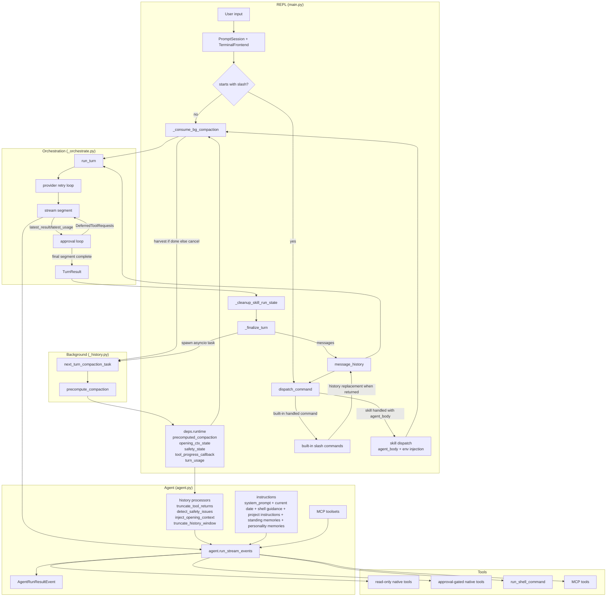
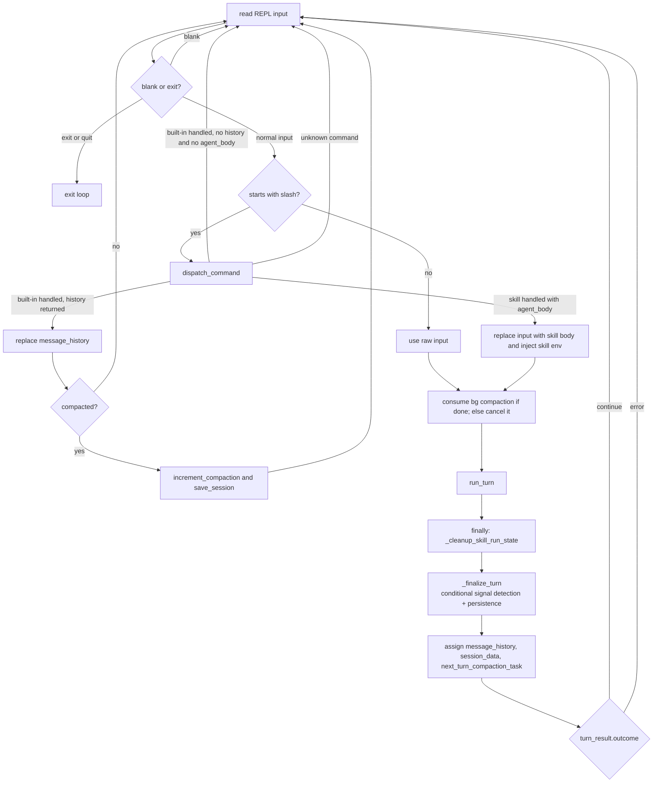
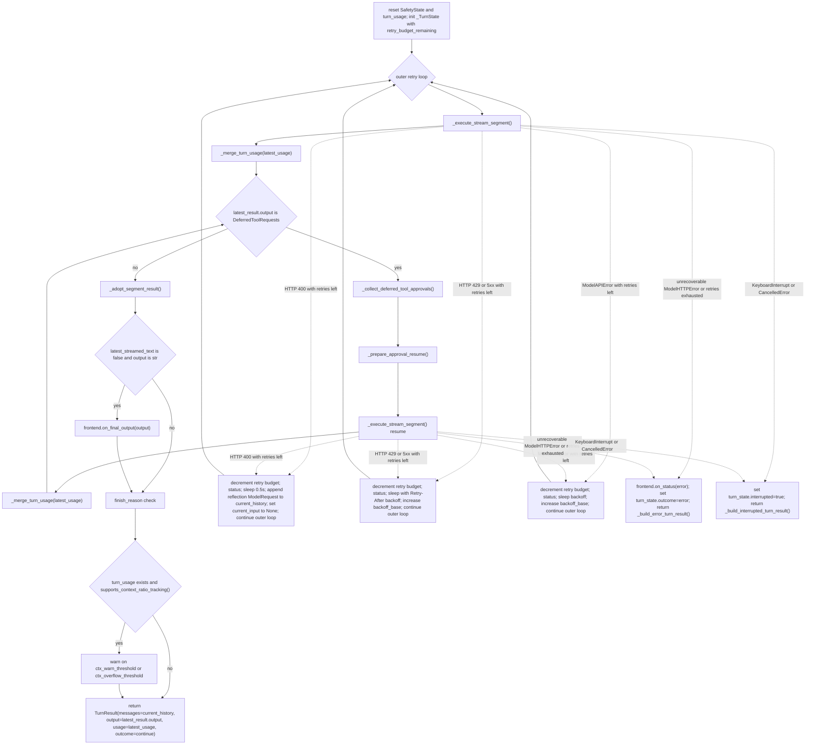

# Co CLI — Core Loop Design

> For top-level architecture and startup sequencing, see [DESIGN-system.md](DESIGN-system.md) and [DESIGN-bootstrap.md](DESIGN-bootstrap.md).

## 1. One-Turn Runtime Path

This doc describes the runtime path from one REPL input to one completed turn. The core loop lives in `co_cli/main.py` and `co_cli/context/_orchestrate.py`. `main.py` owns the REPL, slash-command dispatch, skill env injection and rollback, best-effort background-compaction harvest/spawn, session persistence, and post-turn signal detection. `run_turn()` is the single turn entrypoint. It resets turn-scoped runtime state, opens the `co.turn` span, streams one or more model segments, handles deferred approvals inside the same turn, applies provider retry policy, and returns a `TurnResult`. `_orchestrate.py` does not mutate REPL-owned history directly; it works through `_TurnState` and returns the next history snapshot to `main.py`. The agent itself is built in `co_cli/agent.py` with static prompt instructions, dynamic per-turn instruction layers, history processors, native tools, and optional MCP toolsets.



## 2. Core Logic

### 2.1 Main Turn Path

- Read REPL input.
- Route built-in slash commands locally.
- Expand skill commands into synthetic user text.
- Harvest completed background compaction if available; otherwise cancel the unfinished task.
- Call `run_turn()`.
- Always run `_cleanup_skill_run_state()` in `finally`.
- Run `_finalize_turn()` to update history, conditionally run signal detection, clear precomputed compaction, persist session state, spawn the next background compaction task, and show the generic error banner for `TurnResult(outcome="error")`.
- Assign the returned tuple back into `_chat_loop()` local variables only after `_finalize_turn()` completes.



Notes:
- Built-in slash commands never enter the agent turn.
- Built-in slash commands may still replace `message_history`; `/compact` also increments the compaction counter and saves the session immediately.
- Skill commands are expanded before `run_turn()` so the agent sees normal user text, not a slash token.
- `TurnOutcome` is `Literal["continue", "error"]`. Both values are emitted by `run_turn()`.

### 2.2 `run_turn()` State Machine

`run_turn()` in `_orchestrate.py` is the only public turn entrypoint.

Key points:
- It resets turn-scoped runtime state: `deps.runtime.safety_state` and `deps.runtime.turn_usage`.
- It shows `frontend.on_status("Co is thinking...")` before opening the `co.turn` span.
- It creates one `_TurnState` (with `retry_budget_remaining` from `deps.config.model_http_retries`) and one outer retry loop.
- Each segment runs through `_execute_stream_segment()`, then `_merge_turn_usage()` folds that segment into the per-turn accumulator.
- If the segment returns `DeferredToolRequests`, the same turn stays open: collect approvals, prepare resume state, and run another segment.
- On success, `_adopt_segment_result()` promotes `latest_result.all_messages()` into `current_history`, optional final text is rendered, finish-reason and context-ratio warnings run, and the function returns `TurnResult(outcome="continue")`.
- Unrecoverable provider errors and interrupts return early through dedicated branches.



Rules that matter:
- One `_TurnState.retry_budget_remaining` counter spans the full turn, including approval resumes and provider retries.
- HTTP 400 reflection retries append a `ModelRequest` to `current_history` and set `current_input = None`.
- Approval resume also uses `current_history`, after promoting `latest_result.all_messages()`.
- Success returns `messages=current_history`, `output=latest_result.output`, and `usage=latest_usage`.
- Approval answers never become separate chat messages.

### 2.3 `_execute_stream_segment()` Responsibilities

`_execute_stream_segment()` is the bridge between the turn-level loop in `run_turn()` and the segment-level event loop. It reads inputs from `_TurnState` (`current_input`, `current_history`, `tool_approval_decisions`, `latest_usage`), calls `agent.run_stream_events(...)`, delegates text/thinking buffering and flush policy to `StreamRenderer` (in `co_cli/display/_stream_renderer.py`), and routes tool lifecycle events to `TerminalFrontend` using display metadata from `co_cli/tools/_display_hints.py`. It captures the final `AgentRunResult`, calls `frontend.cleanup()` in `finally`, and writes results back into `_TurnState` (`latest_result`, `latest_streamed_text`, `latest_usage`). `tool_approval_decisions` is cleared (consumed) after each call.

Processing outline:

```text
run_stream_events(...)
  -> text/thinking events delegated to StreamRenderer (throttled buffer + flush)
  -> tool-call event: StreamRenderer.flush_for_tool_output(), frontend.on_tool_start(), renderer.install_progress()
  -> tool-result event: StreamRenderer.flush_for_tool_output(), renderer.clear_progress(), frontend.on_tool_complete()
  -> AgentRunResultEvent stores the final result object
  -> function exit: StreamRenderer.finish() flushes remaining buffers, then frontend.cleanup()
  -> if no AgentRunResultEvent was observed, raise RuntimeError
  -> turn_state.latest_result, latest_streamed_text, latest_usage updated in-place
```

What `_execute_stream_segment()` does not do:
- no retry logic
- no approval decisions
- no conversation-history mutation beyond updating `turn_state`

### 2.4 Approval Flow

Pydantic-ai uses two types for deferred approval:
- `DeferredToolRequests` — the pending approval-gated tool calls from the model
- `DeferredToolResults` — the approval decisions Co records (allow=`True`, deny=`ToolDenied`)

`DeferredToolResults` is **not** tool output. It is a decision payload consumed by the next `_execute_stream_segment()` call as `deferred_tool_results=`. Actual tool execution and the resulting `ToolReturnPart` output happen after the resumed segment runs.

Deferred approvals are collected only in `_collect_deferred_tool_approvals()`. This function iterates over `result.output.approvals`, decodes args, resolves an `ApprovalSubject`, checks session-scoped auto-approval, otherwise prompts the user, and records one entry per tool call in a `DeferredToolResults` object. `_prepare_approval_resume()` then clears `current_input`, promotes `latest_result.all_messages()` into `current_history`, stores that `DeferredToolResults` object on `_TurnState`, and the next `_execute_stream_segment()` consumes it as `deferred_tool_results=...`.

```mermaid
flowchart TD
    A[result.output.approvals] --> B[for each deferred call]
    B --> C[decode args]
    C --> D[resolve ApprovalSubject]
    D --> E{is_auto_approved?}
    E -->|yes| F[approvals.approvals[tool_call_id] = True]
    E -->|no| G[prompt user y n a]
    G -->|y| F
    G -->|n| H[approvals.approvals[tool_call_id] = ToolDenied]
    G -->|a and can_remember| I[record approved=True and store SessionApprovalRule]
    G -->|a and not rememberable| F
    F --> J{more deferred calls?}
    H --> J
    I --> J
    J -->|yes| B
    J -->|no| K[_prepare_approval_resume stores DeferredToolResults on _TurnState]
    K --> L[next _execute_stream_segment consumes deferred_tool_results]
```

Current approval subject scopes:

| Tool shape | Subject kind | Stored value | Rememberable |
|---|---|---|---|
| `run_shell_command` | `shell` | first token of `cmd` | yes when non-empty |
| `write_file`, `edit_file` | `path` | `{tool_name}:{parent_dir}` | yes when path has a parent |
| `web_fetch` | `domain` | parsed hostname | yes when hostname exists |
| MCP tool with configured prefix | `mcp_tool` | `{prefix}:{tool_name}` | yes |
| anything else | `tool` | tool name | no |

Rules:
- `"a"` is session-scoped only. Rules live in `deps.session.session_approval_rules`.
- Auto-approval matching is exact on `kind + value`.
- Shell `DENY` and `ALLOW` happen before this function. `_collect_deferred_tool_approvals()` only handles shell calls that already raised `ApprovalRequired`.

### 2.5 Shell Approval Path

`run_shell_command()` is registered without blanket `requires_approval=True` because approval depends on the concrete command. The tool evaluates the command first:

```text
evaluate_shell_command(cmd)
  DENY              -> return terminal_error immediately
  ALLOW             -> execute immediately
  REQUIRE_APPROVAL  -> if ctx.tool_call_approved then execute else raise ApprovalRequired
```

This keeps command-dependent `DENY` and `ALLOW` behavior inside the tool rather than forcing every shell call into the deferred approval path.

### 2.6 History Processors And Background Compaction

The agent is built with four history processors in this order:
1. `truncate_tool_returns`
2. `detect_safety_issues`
3. `inject_opening_context`
4. `truncate_history_window`

`truncate_history_window()` compacts when either condition is true:

- `len(messages) > max_history_messages`
- estimated tokens exceed 85% of the internal default budget

Compaction keeps the first run in the head, keeps a recent tail, and replaces the middle with either:

- a cached precomputed summary from `ctx.deps.runtime.precomputed_compaction` when the cached `message_count`, `head_end`, and `tail_start` still match
- a static trim marker when no usable precomputed summary exists

No inline LLM summarization happens inside `truncate_history_window()`. `main.py` is responsible for harvesting the background task result before the next turn and for clearing `precomputed_compaction` after the turn completes.

Background compaction contract:

```text
after turn N:
  main.py spawns precompute_compaction(message_history, deps, primary_model)
  task may return None when history is not near the trigger, already past the trigger, or summarization fails

before turn N+1:
  main.py harvests completed task into deps.runtime.precomputed_compaction
  or cancels unfinished task

during turn N+1:
  truncate_history_window() may consume that cached result

after turn N+1:
  main.py clears deps.runtime.precomputed_compaction
```

### 2.7 Safety, Errors, And Interrupts

Safety and error handling are split across the loop:

| Concern | Owner | Behavior |
|---|---|---|
| doom-loop detection | `detect_safety_issues()` | injects a system prompt after repeated identical tool calls |
| shell reflection cap | `detect_safety_issues()` | injects a system prompt after repeated shell failures |
| HTTP 400 tool-call rejection with retries left | `run_turn()` | appends a reflection request to `current_history`, sets `current_input=None`, and retries |
| HTTP 429 or 5xx with retries left | `run_turn()` | sleeps with backoff, using `Retry-After` when available, then retries |
| `ModelAPIError` with retries left | `run_turn()` | sleeps with backoff and retries |
| unknown 4xx, auth/not-found errors, or exhausted retry budget | `run_turn()` | emits status and returns `TurnResult(outcome="error")` |
| `KeyboardInterrupt` / `CancelledError` during turn | `run_turn()` | truncates to last clean `ModelResponse`, appends an abort marker, returns `interrupted=True` |

Interrupt recovery invariant:
- the next turn must see history ending at a clean point, so the last `ModelResponse` is dropped if it contains any unanswered `ToolCallPart` entries before the abort marker is appended.

### 2.8 Post-Turn Hooks In `main.py`

After `run_turn()` returns, `_chat_loop()` delegates post-turn finalization to two helpers:

- `_cleanup_skill_run_state(saved_env, deps)` — called in `finally` to restore saved env vars and clear `active_skill_env` / `active_skill_name`
- `_finalize_turn(turn_result, ...)` — called after env restore; performs the remaining steps:

1. replace `message_history` with `turn_result.messages`
2. if the turn was not interrupted and not an error, run `analyze_for_signals()` and `handle_signal()`
3. clear `deps.runtime.precomputed_compaction`
4. `touch_session()` and `save_session()`
5. spawn the next `precompute_compaction(...)` task via `_spawn_bg_compaction()`
6. if `outcome == "error"`, print a generic error banner

### 2.9 Comparison Against Common Peer Patterns

- Evaluate the current core loop against the shared patterns that recur across the reference systems, not against the largest feature set in any one peer.
- Across Codex, Claude Code, Gemini CLI, Aider, OpenClaw, pi-mono, Letta, Mem0, OpenCode, and nanobot, the common loop shape is still structurally simple:
1. one foreground user input enters one owned turn executor
2. the executor streams model output and tool activity incrementally
3. approvals are resolved at explicit boundaries outside most tool bodies
4. history is compacted or trimmed between turns, not by spawning an in-turn planner graph
5. retries and interrupts are handled by the loop owner, not scattered across tools
6. specialist or background work is bounded and isolated from the main foreground turn
- `co` matches that common shape more than it differs from it.
- The main loop remains REPL-owned.
- `run_turn()` stays a single-turn executor.
- Approvals resume inside the same turn.
- Compaction remains a background optimization rather than a second agent.

| Common pattern from reference systems | How `co` compares | Design read |
|---|---|---|
| Single foreground turn owner (`Codex`, `Claude Code`, `Aider`, `OpenCode`, `pi-mono`) | `main.py` owns REPL/session state and `_orchestrate.py` owns one turn | Aligned |
| Streaming-first execution (`Codex`, `Claude Code`, `Gemini CLI`, `OpenCode`) | `_execute_stream_segment()` is event-driven and frontend-facing | Aligned |
| Orchestration-owned approvals (`Codex`, `Claude Code`, `Aider`, `pi-mono`) | deferred approvals live in `_collect_deferred_tool_approvals()`; shell keeps only command classification inside the tool | Aligned |
| Command-specific shell trust boundary (`Codex`, `Claude Code`) | `run_shell_command()` classifies `DENY` / `ALLOW` / `REQUIRE_APPROVAL` before execution | Aligned and strong |
| Bounded retry and interrupt recovery in the loop (`Codex`, `Claude Code`, `OpenClaw`, `OpenCode`) | `run_turn()` owns provider retries, reflection retry, usage-limit handling, and clean interrupt truncation | Aligned |
| Compaction as a sidecar maintenance concern (`Claude Code`, `OpenClaw`, `pi-mono`, `nanobot`) | background precompute plus turn-time consumption keeps compaction out of the live turn | Aligned |
| Isolated specialist contexts rather than shared mutable subagents (`Claude Code`, `OpenClaw`, `pi-mono`) | sub-agents are isolated through `make_subagent_deps()` and are not part of the foreground loop | Aligned |
| Tighter typed memory models (`Letta`, `Mem0`) | core loop only injects recalled context and does not depend on typed memory blocks | Intentionally simpler than frontier memory systems |
| Event-driven multi-step task graphs (`Gemini CLI`, `OpenClaw`, `nanobot`) | foreground loop is still single-turn; long-running autonomy is mostly outside this path today | Deliberate non-adoption for MVP |

### 2.10 Over-Design Check

- Relative to the common baseline above, the current core loop has a few places where the design is heavier than the shared peer pattern requires.

| Area | Why it is heavier than the common pattern | Risk |
|---|---|---|
| `main.py` split ownership across REPL input, slash dispatch, skill env injection, background-compaction harvest/spawn, session persistence, and post-turn signal detection | Post-turn hooks extracted into `_finalize_turn()` and `_cleanup_skill_run_state()` helpers, reducing inline scope in `_chat_loop()`. Remaining split is still above the minimum needed for a single-turn loop. | Higher cognitive load when tracing one turn end-to-end |
| Turn state spread across `message_history`, `current_history`, `deps.runtime.precomputed_compaction`, background task state, and `_TurnState.latest_*` fields | The behavior is correct, but the number of moving pieces is above the minimum needed for a single-turn loop | Harder to reason about retries, resume points, and stale cached state |
| Approval subject taxonomy (`shell`, `path`, `domain`, `mcp_tool`, `tool`) plus exact-match remembered rules | More nuanced than the simpler allow-once / allow-session patterns seen in Aider and many CLI peers | Trust UX can become harder to explain than the underlying safety gain justifies |
| Post-turn hook chain in `_chat_loop()` | Signal detection, compaction cache clearing, session save, and next-turn precompute all happen after the core turn returns | The true loop boundary is less obvious in code and docs |
| `_execute_stream_segment()` stream-state adaptation and frontend rendering policy | Buffer throttling and flush policy extracted to `StreamRenderer` (`co_cli/display/_stream_renderer.py`). Tool display metadata extracted to `_display_hints.py`. `_execute_stream_segment()` now delegates both concerns, keeping only event routing. | Addressed — display changes and orchestration changes are now decoupled |

- Main loop-specific over-design signals today:
- `main.py` still carries some lifecycle work above the minimum; `_finalize_turn()` and `_cleanup_skill_run_state()` extracted the post-turn hook chain, but REPL input, slash dispatch, skill env injection, and compaction scheduling remain inline in `_chat_loop()`.
- The loop carries multiple state carriers for history and compaction, which increases semantic overhead even though each piece is individually reasonable.
- Approval remembering has grown more granular than the common peer baseline; the next improvement should be legibility, not more approval states.

- Areas that do **not** appear over-designed:
- Approval resume staying inside the same turn is consistent with the strongest peer patterns and avoids fake user-message hops.
- Background compaction precompute is lighter than the explicit compaction-agent designs discussed in earlier research and remains a pragmatic optimization.
- Shell approval classification inside the shell tool is justified because the trust decision depends on command shape, not just tool identity.

- Practical conclusion:
- keep the single-turn `run_turn()` contract
- keep orchestration-owned approvals
- keep compaction as a background sidecar
- reduce semantic surface in `main.py` and turn-state ownership before adding new loop abstractions such as task graphs, ACP orchestration, or richer approval classes

## 3. Config

| Setting | Env Var | Default | Description |
|---|---|---|---|

| `model_http_retries` | `CO_CLI_MODEL_HTTP_RETRIES` | `2` | Retry budget for provider and network errors |
| `doom_loop_threshold` | `CO_CLI_DOOM_LOOP_THRESHOLD` | `3` | Identical tool-call streak before doom-loop intervention |
| `max_reflections` | `CO_CLI_MAX_REFLECTIONS` | `3` | Consecutive shell-error streak before reflection-cap intervention |
| `tool_output_trim_chars` | `CO_CLI_TOOL_OUTPUT_TRIM_CHARS` | `2000` | Max chars retained for older tool returns |
| `max_history_messages` | `CO_CLI_MAX_HISTORY_MESSAGES` | `40` | Message-count threshold for sliding-window compaction |
| `ctx_warn_threshold` | `CO_CTX_WARN_THRESHOLD` | `0.85` | Context-ratio threshold for warning the user that prompt budget is getting tight |
| `ctx_overflow_threshold` | `CO_CTX_OVERFLOW_THRESHOLD` | `1.0` | Context-ratio threshold for warning that the provider likely truncated or overflowed input context |
| `session_ttl_minutes` | `CO_SESSION_TTL_MINUTES` | `60` | Session restore freshness window |
| `memory_injection_max_chars` | `CO_CLI_MEMORY_INJECTION_MAX_CHARS` | `2000` | Max chars injected into context from memory recall per turn |

## 4. Files

| File | Purpose |
|---|---|
| `co_cli/main.py` | REPL loop, slash dispatch, skill env injection, post-turn hooks, background compaction scheduling |
| `co_cli/context/_orchestrate.py` | `run_turn()` (single turn entrypoint, emits `co.turn` OTel span), `_execute_stream_segment()` (segment event loop, updates `_TurnState`), `_collect_deferred_tool_approvals()`, `_build_interrupted_turn_result()` (truncate and abort-mark on interrupt) |
| `co_cli/agent.py` | Main agent construction: instructions, history processors, native tools, MCP toolsets |
| `co_cli/context/_history.py` | Opening-context injection, tool-output trimming, safety checks, sliding-window compaction, background precompute |
| `co_cli/tools/shell.py` | Command-dependent shell approval and execution path |
| `co_cli/tools/_tool_approvals.py` | Approval subject resolution, session rule matching, and approval recording |
| `co_cli/display/_stream_renderer.py` | `StreamRenderer`: text/thinking buffering, flush/throttle policy, progress callback wiring |
| `co_cli/tools/_display_hints.py` | Tool display metadata: args display key per tool, tool result format helper |
| `co_cli/commands/_commands.py` | Built-in slash commands, skill dispatch, and `/approvals` management |
| `co_cli/context/_session.py` | Session persistence helpers |
