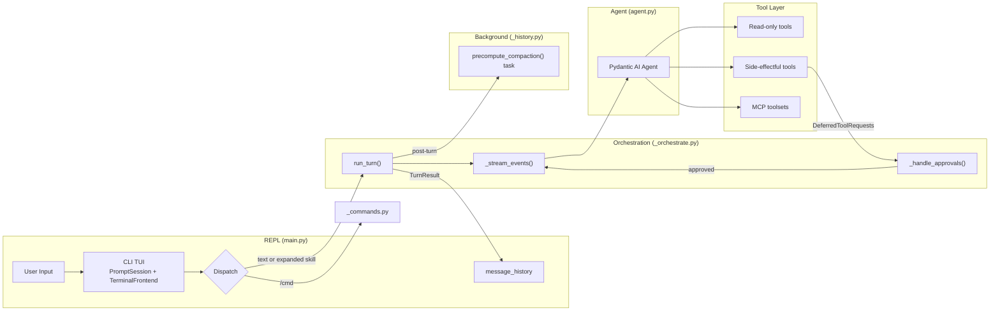
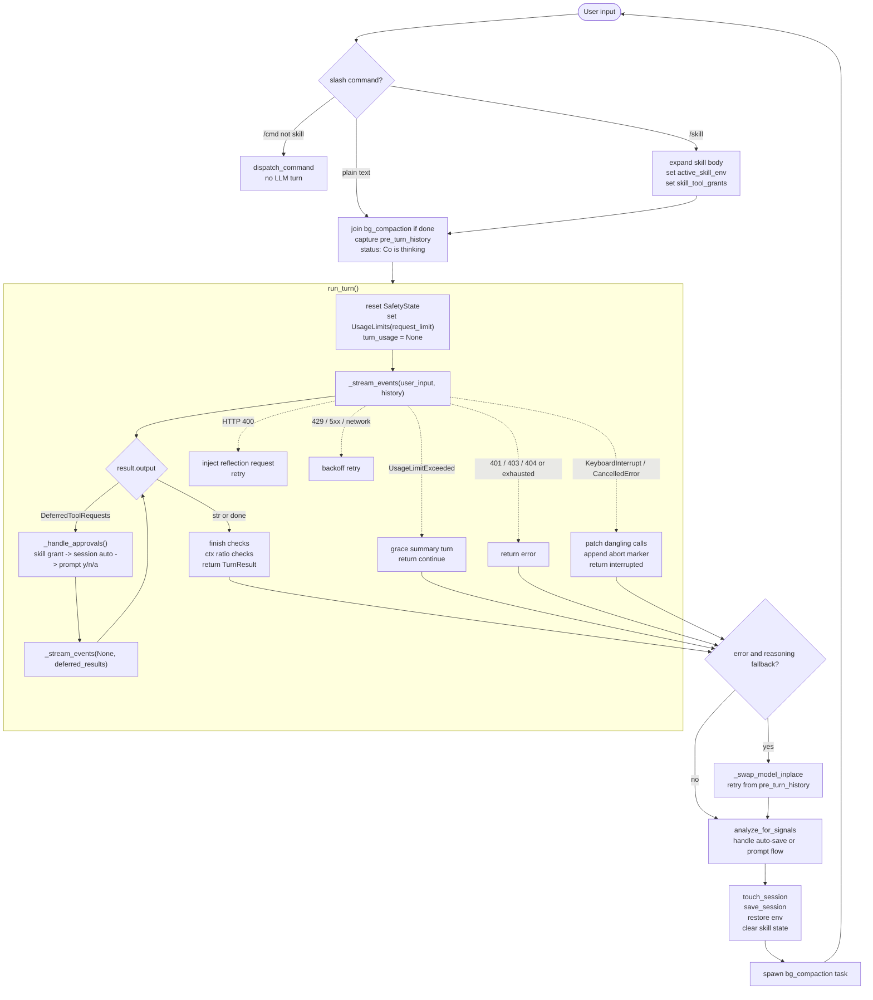
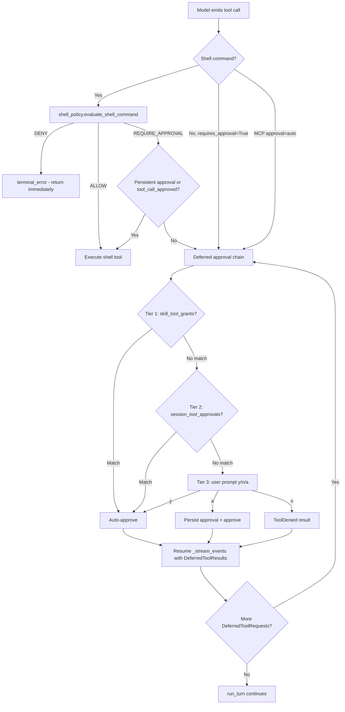

# Co CLI — Core Loop Design

> For system architecture and top-level contracts: [DESIGN-system.md](DESIGN-system.md).

## 1. What & How

This doc is the canonical design for the agent main loop. It covers what happens from the moment the interactive session starts accepting input through one user turn completing: slash-command dispatch, skill expansion, `run_turn()`, streaming, shell policy checks, approval re-entry, retries, interrupt recovery, post-turn hooks, and the runtime contracts that keep the loop stable across turns.

Scope boundary:
- In scope: `chat_loop()`, `run_turn()`, `_stream_events()`, `_handle_approvals()`, shell approval gating, turn outcomes, runtime safety guards, REPL-facing control flow
- Out of scope: startup/bootstrap sequencing in [DESIGN-system-bootstrap.md](DESIGN-system-bootstrap.md), and broad system architecture in [DESIGN-system.md](DESIGN-system.md)

## 2. Component In System Architecture



Upstream dependencies:
- startup has completed successfully
- `agent`, `model_settings`, and `CoDeps` are ready
- session data and message history exist

Downstream consumers:
- terminal frontend rendering
- memory signal persistence
- session persistence
- background compaction preparation

Cross-component touchpoints:
- approval classification originates in [DESIGN-system.md](DESIGN-system.md) and executes here
- prompt assembly and history processors are defined elsewhere but run through the turn loop here

Approval-specific touchpoints:
- `run_shell_command()` can deny, allow, or defer before orchestration sees the request
- MCP tools configured with approval wrapping enter the same deferred approval loop as native tools
- skill `allowed-tools` grants and session approvals feed directly into `_handle_approvals()`

## 3. Flows

### Main Loop Flow



### Ordered Turn Phases

1. `chat_loop()` receives raw user input.
2. Slash commands are dispatched immediately; non-skill commands bypass the LLM.
3. Skill commands expand into a synthetic user turn and stage temporary env/tool grants.
4. Pre-turn bookkeeping joins completed compaction work and snapshots history for retry/fallback.
5. `run_turn()` streams the agent response and loops through approval re-entry until a terminal result is reached.
6. Post-turn hooks update session state, optionally persist memory signals, clear skill state, and launch background compaction.

Failure and fallback inline:
- provider/network failures are classified into reflection, backoff retry, or abort
- budget exhaustion triggers one grace turn rather than a hard stop
- interrupts patch dangling tool calls and recover to the prompt
- same-provider reasoning fallback can swap to the next configured reasoning model

### Approval Flow



Ordered approval phases:
1. A tool call is emitted by the model.
2. Shell commands first pass inline DENY/ALLOW checks in `run_shell_command()`.
3. If the shell policy result is `REQUIRE_APPROVAL`, the shell tool checks persistent exec approvals and `ctx.tool_call_approved`.
4. Deferred calls enter `_handle_approvals()` and run the three-tier decision chain.
5. `_handle_approvals()` records the approval outcomes as `DeferredToolResults`.
6. `_handle_approvals()` then resumes `_stream_events(None, deferred_tool_results=...)` directly; co-cli does not insert any separate user-to-LLM step between the approval answer and the approved continuation.
7. The same turn can re-enter approval multiple times if the resumed run emits more deferred calls.

Failure and fallback inline:
- denied shell commands return a `terminal_error` immediately without prompting
- user denial yields a `ToolDenied` result in `DeferredToolResults`
- approval hops share the same turn budget and can still fail on usage exhaustion
- the resumed model continuation occurs after approval outcomes are handed back through `DeferredToolResults`, not as a separate co-cli approval-analysis prompt

## 4. Core Logic

### 4.1 Entry Conditions

Before the first loop iteration:
- startup has completed: `create_deps()` + `run_model_check()` + `get_agent()` + `run_bootstrap()`
- `message_history` is the active conversation history
- `session_data` is loaded and held by `chat_loop()`
- `deps.runtime.safety_state` will be reset at the start of every `run_turn()`

### 4.2 Pre-Turn Setup In `chat_loop()`

Before calling `run_turn()`:

```text
if bg_compaction_task is done:
    deps.runtime.precomputed_compaction = bg_compaction_task.result()

pre_turn_history = message_history

current_snapshot = _skills_snapshot(skills_dir)
if current_snapshot != _skills_watch_snapshot:
    reload skills
    refresh skill_registry and completer
    _skills_watch_snapshot = current_snapshot
```

Skill dispatch path:

```text
ctx = dispatch_command(user_input)
if ctx.skill_body:
    deps.session.active_skill_env = ctx.skill_env
    deps.session.skill_tool_grants = ctx.allowed_tools
    user_input = ctx.skill_body
```

Key invariant:
- skill env vars and allowed-tool grants are temporary and must be cleared after the turn regardless of success or failure

### 4.3 `run_turn()` Entry And Retry Model

```text
deps.runtime.safety_state = SafetyState()
turn_limits = UsageLimits(request_limit=max_request_limit)
turn_usage = None
current_input = user_input

enter retry loop (up to model_http_retries):
    result = _stream_events(...)
    turn_usage = result.usage()

    while result.output is DeferredToolRequests:
        result = _handle_approvals(...)
        turn_usage = result.usage()

    if non-streaming string result:
        frontend.on_final_output(result.output)

    if finish_reason == "length":
        frontend.on_status("Response may be truncated... Use /continue to extend.")

    check Ollama ctx ratio thresholds
    return TurnResult(...)
```

One `UsageLimits` object and the accumulated `turn_usage` span:
- the initial request
- all approval re-entry hops
- provider retries inside the same turn

Approval hops do not reset the turn budget.

### 4.4 Streaming Phase In `_stream_events()`

`_stream_events()` wraps `agent.run_stream_events()` and routes stream events to the frontend. `_StreamState` and pending shell command titles are per-call state.

```text
PartStartEvent(TextPart)      -> flush thinking panel, begin text accumulation
PartStartEvent(ThinkingPart)  -> accumulate when verbose
TextPartDelta                 -> throttle text rendering (~20 FPS)
ThinkingPartDelta             -> throttle thinking rendering when verbose
FunctionToolCallEvent         -> flush buffers, annotate tool call, maybe emit tool preamble
FunctionToolResultEvent       -> flush buffers, render string or display-bearing dict results
AgentRunResultEvent           -> capture final result object
finally                       -> frontend.cleanup()
```

Tool preamble injection fires at most once per `_stream_events()` call when the model emits no user-visible text before its first tool call. This prevents silent tool-first turns.

`run_stream_events()` is required because `DeferredToolRequests` is part of the output type; `run_stream()` and `iter()` are not compatible with this turn model.

### 4.5 Approval Re-Entry

Approval flow activates on any agent turn where at least one tool call is:
- a shell command that is neither inline-allowed nor already persistently approved
- a native tool registered with `requires_approval=True`
- an MCP tool on a server configured with `approval="auto"`

Required state:
- `CoDeps` is fully initialized
- `deps.session.session_tool_approvals` and `deps.session.skill_tool_grants` are populated for the current turn
- `deps.config.exec_approvals_path` resolves to `.co-cli/exec-approvals.json` when shell persistence is used

When the model emits `DeferredToolRequests`, `_handle_approvals()` resolves each request in order:

```text
for each deferred tool request:
    if allowed by active skill grant:
        auto-approve
    elif allowed by session auto-approval:
        auto-approve
    else:
        prompt user for y / n / a

build DeferredToolResults
return await _stream_events(None, deferred_results)
```

Approval-chain semantics:
- active skill grants only apply during the current skill-expanded turn
- session approvals persist for the current REPL session
- `"a"` can persist shell approval patterns to the approval store
- shell DENY and ALLOW decisions happen inside `run_shell_command()` before `_handle_approvals()` is involved

Clarification on the resume boundary:
- `_handle_approvals()` does not send the user's approval text back to the model as a new user message
- co-cli hands `DeferredToolResults` back to the SDK and resumes the same turn
- from the co-cli layer, the approved tool continuation happens without any extra app-level LLM decision step between approval input and the approved execution path
- the exact internal ordering between tool execution and model continuation after `DeferredToolResults` are passed back is SDK-managed, but the resulting tool outputs are what feed the continued turn

### 4.6 Shell-Specific Inline Policy Path

`run_shell_command()` enforces the approval gate before execution. These checks run synchronously inside the tool body.

Why the shell tool is not registered with blanket `requires_approval=True`:
- shell approval is command-dependent, not tool-dependent
- co-cli must inspect the concrete `cmd` first to distinguish `DENY`, `ALLOW`, and `REQUIRE_APPROVAL`
- if the tool were blanket-deferred at registration time, the SDK would request approval before the tool body ran, which would erase the inline `DENY` and `ALLOW` behavior
- the current pattern is therefore intentional: the shell tool is allowed to run far enough to classify the command, and only the `REQUIRE_APPROVAL` branch raises `ApprovalRequired`

```text
run_shell_command(ctx, cmd, timeout):

  1. Policy classification  (evaluate_shell_command via _shell_policy.py)
       blocks: control characters, heredoc (<<), env-injection VAR=$(...),
               absolute-path destruction (rm -rf /~)
       DENY  -> return terminal_error immediately
       ALLOW -> execute silently
       REQUIRE_APPROVAL -> continue below

  2. Persistent cross-session approvals  (_exec_approvals.py)
       find_approved(cmd, load_approvals(exec_approvals_path))
       if found -> update_last_used(); execute
       if not found and ctx.tool_call_approved -> execute
       if not found and not ctx.tool_call_approved -> raise ApprovalRequired(metadata={"cmd": cmd})
```

The ALLOW classification itself comes from `_is_safe_command()` inside `_shell_policy.py`, which rejects shell chaining operators and validates the command against the configured safe-prefix list.

This is not "self-approval" in the sense of bypassing approval. The tool is only self-classifying:
- `DENY` means block immediately
- `ALLOW` means no approval is needed for that command shape
- `REQUIRE_APPROVAL` means the tool raises `ApprovalRequired` and hands control back to the normal deferred approval loop

Pattern derivation:
- `derive_pattern(cmd)` collects the first three consecutive non-flag tokens, then appends ` *`
- example: `git commit -m "msg"` becomes `git commit *`
- bare `*` is never stored

When the user selects `"a"` for a shell command, `_handle_approvals()` stores a new derived pattern through `add_approval(...)`. The approval prompt displays that derived pattern before the user answers.

### 4.7 Three-Tier Decision Chain In `_handle_approvals()`

`_handle_approvals()` iterates over each pending tool call in `result.output.approvals`. The tiers run in order and the first match short-circuits.

```text
_handle_approvals(...):
    approvals = []

    for each call in result.output.approvals:
        args = json.loads(call.args) if str else call.args
        desc = format("{tool_name}(k=v, ...)")
        approved = False

        if call.tool_name in deps.session.skill_tool_grants:
            approved = True
        elif call.tool_name in deps.session.session_tool_approvals:
            approved = True

        if not approved:
            choice = frontend.prompt_approval(desc) if frontend is not None else "n"
            if choice == "y":
                approved = True
            elif choice == "a":
                approved = True
                if call.tool_name == "run_shell_command":
                    cmd = args["cmd"]
                    add_approval(deps.config.exec_approvals_path, cmd, call.tool_name)
                else:
                    deps.session.session_tool_approvals.add(call.tool_name)
            elif choice == "n":
                approvals.approvals[call.tool_call_id] = ToolDenied("User denied this action")
                continue

        approvals.approvals[call.tool_call_id] = approved
```

The inline shell policy is never bypassed by orchestration-level grants. `_handle_approvals()` only sees shell commands that have already reached `ApprovalRequired`.

### 4.8 `"a"` Persistence Semantics By Tool Class

| Tool class | `"a"` effect | Scope | Storage |
|------------|--------------|-------|---------|
| `run_shell_command` | `derive_pattern(cmd)` appended to exec approvals | Cross-session | `.co-cli/exec-approvals.json` |
| All other tools | `call.tool_name` added to `deps.session.session_tool_approvals` | Session-only | `CoDeps.session.session_tool_approvals` |

Shell patterns use fnmatch. `git commit *` matches any `git commit` invocation regardless of trailing arguments. Patterns are not deleted automatically; `/approvals clear [id]` manages them.

### 4.9 Approval Re-Entry Loop And Budget Sharing

The `while result.output is DeferredToolRequests` loop in `run_turn()` supports multi-hop approval chains. A single user turn may require multiple rounds of approval if:
- the agent calls several tools requiring approval in parallel
- after one batch is approved and executed, the agent calls another tool requiring approval

Each hop resumes the stream from inside `_handle_approvals()`. The outer `while isinstance(result.output, DeferredToolRequests)` loop in `run_turn()` is bounded only by the model's tool-call behavior.

Important boundary:
- each approval hop is a continuation of the same run, not a new user turn
- co-cli resumes with `user_input=None`, prior `message_history`, and `deferred_tool_results=...`
- the approval answer itself is not turned into a fresh LLM prompt

Token usage is accumulated across the initial run and all approval re-entries within a single turn:

```text
initial run: usage_limits passed in, accumulated_usage starts at 0
first re-entry: usage_limits unchanged, accumulated_usage += usage from initial run
second re-entry: accumulated_usage += usage from first re-entry
...
```

No budget reset occurs between approval hops. This prevents approval loops from becoming a budget bypass vector.

### 4.10 MCP Approval Inheritance

MCP tools use the same `DeferredToolRequests` pipeline. No separate MCP approval logic exists.

```text
Per-server config:
    approval = "auto"  -> server wrapped in ApprovalRequiredToolset
                          every tool call becomes a DeferredToolRequest
                          flows through _handle_approvals() like a native tool

    approval = "never" -> server passed unwrapped
                          tool calls execute without prompting
```

`_is_safe_command()` does not apply to MCP tools. If a skill's `allowed-tools` frontmatter lists the prefixed MCP tool name, Tier 1 grants auto-approval for that turn.

### 4.11 Per-Turn Safety Guards

Three mechanisms run every turn:

| Guard | Behavior |
|-------|----------|
| Doom loop detection | Identical tool-call hashes repeated `doom_loop_threshold` times cause an intervention prompt |
| Grace turn on budget exhaustion | `UsageLimitExceeded` triggers one final summary request with `request_limit=1`, then returns `TurnResult(outcome="continue")` |
| Shell reflection cap | Repeated shell-error retries past `max_reflections` inject a prompt telling the model to ask the user or change approach |

These guards are implemented through history processors and turn-scoped runtime state.

### 4.12 Provider Error Handling And Reasoning Fallback

`classify_provider_error()` drives retry behavior:

| Exception | Status | Action | Details |
|-----------|--------|--------|---------|
| `ModelHTTPError` | 400 | `REFLECT` | Inject error body as `ModelRequest`, set `current_input=None`, retry from history |
| `ModelHTTPError` | 401, 403, 404 | `ABORT` | Return `TurnResult(output=None, outcome="error")` |
| `ModelHTTPError` | 429 | `BACKOFF_RETRY` | Parse `Retry-After` when present, else use default delay |
| `ModelHTTPError` | 5xx | `BACKOFF_RETRY` | Progressive backoff |
| `ModelAPIError` | Network or timeout | `BACKOFF_RETRY` | Progressive backoff |

All retries are capped by `model_http_retries`.

Reasoning-chain fallback:

```text
if run_turn() returns outcome="error" and another reasoning model exists:
    pop failed reasoning model from head
    _swap_model_inplace(agent, new_head_model, provider, settings)
    retry run_turn once from pre_turn_history
```

The failed model is removed for the rest of the session. This is same-provider fallback, not multi-provider routing.

### 4.13 Interrupt Recovery

On `KeyboardInterrupt` or `CancelledError`:

```text
msgs = result.all_messages() if result else message_history
_patch_dangling_tool_calls(msgs)
append abort marker explaining the previous turn was interrupted
return TurnResult(patched_messages, interrupted=True, outcome="continue")
```

Ctrl+C routing:

| Context | Result |
|---------|--------|
| During `run_turn()` streaming | Patch dangling calls and return to prompt |
| During approval prompt | Cancel approval and return to prompt |
| At REPL prompt, first press | Warn that a second Ctrl+C exits |
| At REPL prompt, second press within 2s | Exit session |
| Ctrl+D at prompt | Exit immediately |

### 4.14 Post-Turn Hooks

After `run_turn()` returns:

```text
message_history = turn_result.messages

if outcome == "error" and reasoning chain has fallback:
    perform reasoning-chain advance

finally:
    restore os.environ
    clear active_skill_env
    clear skill_tool_grants

deps.runtime.precomputed_compaction = None
touch_session(session_data)
save_session(session_path, session_data)
spawn bg_compaction_task = precompute_compaction(...)
```

Additional post-turn behavior:
- signal detection may persist memories based on confidence and user approval
- `.co-cli/session.json` is refreshed on every LLM turn

### 4.15 Failure Paths, Recovery, And Turn Outcome Contract

Approval-related failure paths:

| Condition | Outcome |
|-----------|---------|
| User responds `"n"` to any prompt | `ToolDenied` returned; the model may attempt an alternative |
| DENY policy match in shell tool | `terminal_error` dict returned immediately; no prompt shown |
| `ApprovalRequired` raised outside the chat loop | Unhandled exception; approval flow is a chat-loop mechanism |
| Budget exhausted mid-approval loop | `UsageLimitExceeded`; turn fails or falls into grace-turn handling depending on site |
| MCP server unreachable during approval resume | Provider/tool error path in `run_turn()` handles it as transient or terminal |

Recovery behavior:
- denial recovery happens in-model: the model receives the denied result and can change approach
- persistent shell approvals are managed by `/approvals list` and `/approvals clear [id]`
- session-level auto-approvals are in-memory only and reset when the REPL exits

`TurnOutcome = Literal["continue", "stop", "error", "compact"]`

| Outcome | Condition |
|---------|-----------|
| `"continue"` | Normal completion, grace turn, or interrupted turn |
| `"error"` | Unrecoverable provider or network failure after retries |
| `"stop"` | Reserved, not currently emitted |
| `"compact"` | Reserved, not currently emitted |

## 5. Config

| Setting | Env Var | Default | Description |
|---------|---------|---------|-------------|
| `max_request_limit` | `CO_CLI_MAX_REQUEST_LIMIT` | `50` | Max model requests per user turn |
| `model_http_retries` | `CO_CLI_MODEL_HTTP_RETRIES` | `2` | Provider or network retry budget per turn |
| `doom_loop_threshold` | `CO_CLI_DOOM_LOOP_THRESHOLD` | `3` | Consecutive identical tool calls before intervention |
| `max_reflections` | `CO_CLI_MAX_REFLECTIONS` | `3` | Consecutive shell error threshold before intervention |
| `tool_output_trim_chars` | `CO_CLI_TOOL_OUTPUT_TRIM_CHARS` | `2000` | Max chars per older tool return |
| `max_history_messages` | `CO_CLI_MAX_HISTORY_MESSAGES` | `40` | Message-count trigger for sliding-window compaction |
| `role_models["summarization"]` | `CO_MODEL_ROLE_SUMMARIZATION` | `[]` | Summarization model chain for compaction |
| `session_ttl_minutes` | `CO_SESSION_TTL_MINUTES` | `60` | Session persistence TTL |

## 6. Files

| File | Purpose |
|------|---------|
| `co_cli/main.py` | `chat_loop()`, REPL dispatch, background compaction trigger |
| `co_cli/_orchestrate.py` | `run_turn()`, `_stream_events()`, `_handle_approvals()`, interrupt patching |
| `co_cli/tools/shell.py` | `run_shell_command()` inline DENY/ALLOW/persistent approval gate |
| `co_cli/_shell_policy.py` | Shell DENY / ALLOW / REQUIRE_APPROVAL classification |
| `co_cli/_approval.py` | Safe-prefix shell classification |
| `co_cli/_exec_approvals.py` | Persistent shell approval pattern derivation and storage |
| `co_cli/_history.py` | Compaction helpers and safety processors consulted during turns |
| `co_cli/_commands.py` | Slash command handlers and skill dispatch |
| `co_cli/_session.py` | Session persistence touched on every completed turn |
| `co_cli/display.py` | `TerminalFrontend` implementation |
| `docs/DESIGN-system-bootstrap.md` | Startup work that must complete before the loop begins |
| `docs/DESIGN-context-engineering.md` | Prompt composition, history processors, and compaction behavior |
