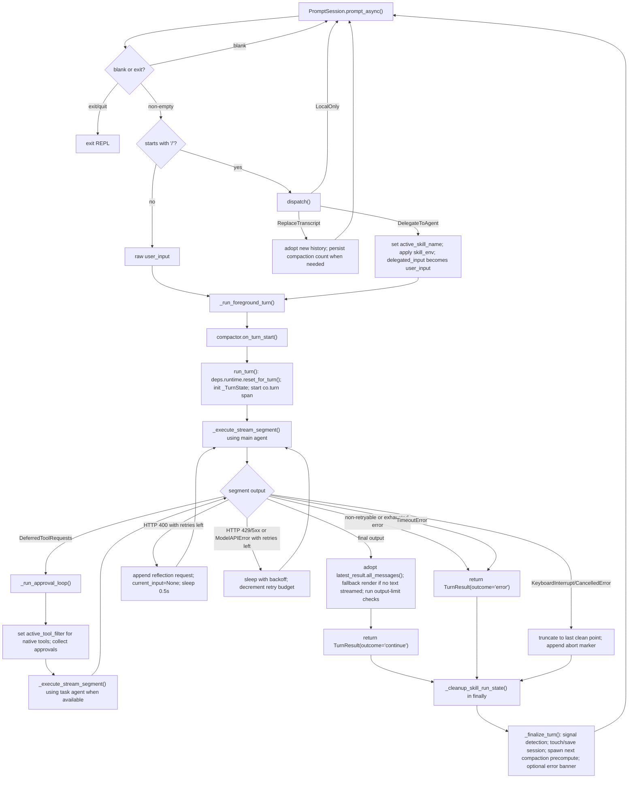

# Co CLI Core Loop Design

For top-level architecture and startup sequencing, see [DESIGN-system.md](DESIGN-system.md) and [DESIGN-bootstrap.md](DESIGN-bootstrap.md).

## 1. Foreground Turn Flow

This doc describes one complete foreground turn, from prompt input to post-turn finalization.



Execution owners:

| Owner | Responsibility |
| --- | --- |
| `_chat_loop()` | prompt input, blank/exit handling, slash dispatch, transcript replacement, and skill-env setup |
| `_run_foreground_turn()` | compaction harvest, `run_turn()`, guaranteed skill-env cleanup, and post-turn finalization |
| `run_turn()` | one orchestrated LLM turn, including retries, approval resumes, output checks, and interrupt handling |
| `_execute_stream_segment()` | one `agent.run_stream_events(...)` segment plus frontend event delivery |
| `_run_approval_loop()` | same-turn approval-resume cycle until output is no longer `DeferredToolRequests` |
| `_finalize_turn()` | history adoption, signal detection, session persistence, next-turn compaction spawn, and generic error banner |

Two boundary rules keep the loop legible:

- REPL-owned transcript state lives in `message_history` inside `main.py`
- orchestration never mutates REPL history in place; it returns a `TurnResult` with the next transcript snapshot

## 2. Core Logic

### 2.1 Turn Contract And State Ownership

`run_turn()` is the only public one-turn orchestration entrypoint. It returns:

| Field | Meaning |
| --- | --- |
| `outcome` | `"continue"` or `"error"` |
| `interrupted` | whether the turn ended due to interrupt/cancellation |
| `messages` | next transcript snapshot for the REPL |
| `output` | final model output object |
| `usage` | latest segment usage payload |
| `streamed_text` | whether visible assistant text was streamed live |

Turn-scoped mutable state is explicit in `_TurnState`:

| `_TurnState` field | Owner |
| --- | --- |
| `current_input` | current prompt text, or `None` for resume/retry hops |
| `current_history` | message list for the next segment call |
| `retry_budget_remaining` / `backoff_base` | provider retry policy |
| `latest_result` | most recent `AgentRunResult` from a completed segment |
| `latest_streamed_text` | last-segment streaming signal |
| `latest_usage` | last-segment usage payload |
| `tool_approval_decisions` | `DeferredToolResults` consumed by the next resume hop |
| `outcome` / `interrupted` | final turn outcome flags |

Cross-cutting turn state that lives on `deps.runtime` instead:

| `deps.runtime` field | Why it is not in `_TurnState` |
| --- | --- |
| `turn_usage` | authoritative per-turn accumulator shared across foreground and sub-agent tool calls |
| `safety_state` | owned by history processors, not by the orchestrator |
| `tool_progress_callback` | owned by `StreamRenderer` and active tool surfaces |
| `active_tool_filter` | read by the native filtered toolset during approval resumes |
| `precomputed_compaction` | cross-turn compaction cache managed by `HistoryCompactionState` |
| `active_skill_name` | cross-function skill dispatch marker cleared after the turn |

### 2.2 Stream Segment Contract

`_execute_stream_segment()` owns exactly one `agent.run_stream_events(...)` call.

Inputs:

- `turn_state.current_input`
- `turn_state.current_history`
- `turn_state.tool_approval_decisions`
- `turn_state.latest_usage`
- selected agent surface: main agent for the initial pass, task agent for resume hops when configured

Per-event handling:

| Event type | Behavior |
| --- | --- |
| `PartStartEvent` with `TextPart` / `ThinkingPart` | append buffered content into `StreamRenderer` |
| `PartDeltaEvent` with `TextPartDelta` / `ThinkingPartDelta` | append streamed deltas |
| `FinalResultEvent` / `PartEndEvent` | ignored for rendering; completion is defined by `AgentRunResultEvent` |
| `FunctionToolCallEvent` | flush buffered text/thinking, optionally show tool-start annotation, install progress callback |
| `FunctionToolResultEvent` | flush buffers, clear progress callback, render tool result panel when a `ToolReturnPart` exists |
| `AgentRunResultEvent` | store the final `AgentRunResult` object |

The event loop is wrapped in `asyncio.timeout(_LLM_SEGMENT_HANG_TIMEOUT_SECS)`. A `TimeoutError` from the guard propagates to `run_turn()`, which returns `TurnResult(outcome='error')` — no retry is attempted.

Normal-exit contract:

1. `renderer.finish()` flushes remaining thinking/text buffers.
2. `frontend.cleanup()` always runs in `finally`.
3. `turn_state.latest_result` must be non-`None`, otherwise `_execute_stream_segment()` raises `RuntimeError`.
4. `turn_state.latest_usage = result.usage()`
5. `turn_state.tool_approval_decisions = None`
6. `_merge_turn_usage()` adds the segment usage into `deps.runtime.turn_usage`

Reasoning display is purely a frontend concern:

| Mode | Behavior |
| --- | --- |
| `off` | thinking is discarded |
| `summary` | thinking is reduced to short status lines via `on_reasoning_progress()` |
| `full` | raw thinking is streamed and committed through the thinking surface |

### 2.3 Approval Flow

Approval deferral uses the native Pydantic-AI objects directly:

- `DeferredToolRequests` pauses a segment on approval-gated tool calls
- `_collect_deferred_tool_approvals()` turns those pending calls into `DeferredToolResults`
- `_run_approval_loop()` feeds that decision payload into the next segment

Approval collection sequence:

1. decode tool arguments with `decode_tool_args()`
2. resolve one `ApprovalSubject`
3. check `deps.session.session_approval_rules` for an exact `kind + value` match
4. otherwise prompt the user for `y`, `n`, or `a`
5. encode the decision into `DeferredToolResults`
6. optionally remember the scope when the user chose `a`

Approval subject scopes:

| Tool shape | Subject kind | Remembered value |
| --- | --- | --- |
| `run_shell_command` | `shell` | first token of `cmd` |
| `write_file`, `edit_file` | `path` | parent directory |
| `web_fetch` | `domain` | parsed hostname |
| everything else, including MCP tools | `tool` | tool name |

Resume-loop behavior:

```text
while latest_result.output is DeferredToolRequests:
  deps.runtime.active_tool_filter =
    deferred native tool names + _ALWAYS_ON_TOOL_NAMES
  approvals = _collect_deferred_tool_approvals(...)
  current_input = None
  current_history = latest_result.all_messages()
  tool_approval_decisions = approvals
  resume_agent = deps.services.task_agent or main agent
  run next segment
clear deps.runtime.active_tool_filter
```

Important precision:

- `active_tool_filter` narrows only the native `FilteredToolset`
- attached MCP toolsets are separate toolsets and are not filtered by this field
- approval resumes happen inside the same user turn; they are not a new REPL iteration

Shell approval remains split correctly:

- `run_shell_command()` decides `DENY`, `ALLOW`, or `REQUIRE_APPROVAL` from command shape
- only the `REQUIRE_APPROVAL` path reaches deferred approval handling
- denied shell commands never enter `_collect_deferred_tool_approvals()`

### 2.4 History Processors And Background Compaction

The main agent is built with four history processors in this exact order:

1. `truncate_tool_returns`
2. `detect_safety_issues`
3. `inject_opening_context`
4. `truncate_history_window`

Processor roles:

| Processor | Role |
| --- | --- |
| `truncate_tool_returns` | trims large older `ToolReturnPart` payloads but preserves the latest exchange |
| `detect_safety_issues` | injects guardrails for doom loops and repeated shell failures |
| `inject_opening_context` | recalls memories and injects them as a trailing `SystemPromptPart` |
| `truncate_history_window` | replaces the middle of long histories with a precomputed summary marker or static trim marker |

Compaction behavior after the refactor:

- `truncate_history_window()` does not call an LLM inline
- it compacts only when message count or estimated token count crosses its threshold
- it uses `deps.runtime.precomputed_compaction` only when the cached boundaries still match the current history
- if no valid cached result exists, it falls back to a static marker rather than doing synchronous summarization inside the request path

Background precompute path:

1. after turn `N`, `HistoryCompactionState.on_turn_end()` clears the old cache and spawns `precompute_compaction(history, deps, model)`
2. the background job runs only when the transcript is approaching the compaction threshold
3. `precompute_compaction()` uses the summarization role from `deps.services.model_registry`, falling back to the current primary model if needed
4. before turn `N+1`, `HistoryCompactionState.on_turn_start()` harvests the completed result or cancels a stale task
5. `truncate_history_window()` may consume that cached result during turn `N+1`

Memory recall is also per-turn, not sticky:

- `inject_opening_context()` stores counters in `deps.session.memory_recall_state`
- it recalls only once per new user turn
- failure to recall silently leaves history unchanged

### 2.5 Retries, Output Limits, Errors, And Interrupts

`run_turn()` owns provider-facing retries and final-turn diagnostics.

Retry matrix:

| Condition | Behavior |
| --- | --- |
| HTTP 400 with retries left | append a reflection request describing the rejected tool call, set `current_input=None`, retry |
| HTTP 429 or 5xx with retries left | sleep with backoff, honoring `Retry-After` when available, then retry |
| `ModelAPIError` with retries left | sleep with backoff, then retry |
| `TimeoutError` (segment hang guard) | no retry; set `outcome='error'` and return `_build_error_turn_result()` |
| unknown 4xx, auth/not-found, or exhausted budget | set `outcome='error'` and return `_build_error_turn_result()` |

Output-limit diagnostics happen only after a successful final segment:

1. if `latest_result.response.finish_reason == "length"`, show a truncation status message
2. if the provider supports context-ratio tracking, compare `deps.runtime.turn_usage.input_tokens / deps.config.llm_num_ctx`
3. emit either a warning or overflow message based on `ctx_warn_threshold` and `ctx_overflow_threshold`

Interrupt handling is conservative:

- `KeyboardInterrupt` or `asyncio.CancelledError` returns `_build_interrupted_turn_result()`
- if the transcript ends with a `ModelResponse` containing unanswered `ToolCallPart`s, that response is dropped
- an abort marker `ModelRequest` is appended so the next turn knows the previous turn was interrupted and must verify state

### 2.6 Post-Turn Finalization In `main.py`

`_run_foreground_turn()` sequences the full wrapper around `run_turn()`:

1. `compactor.on_turn_start(deps)`
2. `run_turn(...)`
3. `_cleanup_skill_run_state(saved_env, deps)` in `finally`
4. `_finalize_turn(...)`

`_finalize_turn()` then performs the remaining non-orchestration work:

1. adopt `turn_result.messages` as the next transcript
2. run memory signal detection only when the turn was clean:
   - not interrupted
   - not `outcome == "error"`
3. `touch_session()` and `save_session()`
4. `compactor.on_turn_end(next_history, deps, primary_model)`
5. print a generic error banner when `turn_result.outcome == "error"`

Skill dispatch is intentionally scoped to one delegated turn:

- `_chat_loop()` applies `skill_env` only for the delegated skill run
- `_cleanup_skill_run_state()` restores prior environment values and clears `deps.runtime.active_skill_name`
- finalization happens only after that restoration

### 2.7 Comparison Against Common Peer Patterns

The foreground loop still matches the common 2026 CLI-agent shape more than it diverges from it.

| Common pattern | `co` today | Design read |
| --- | --- | --- |
| one owned foreground turn executor | `run_turn()` | aligned |
| event-stream-driven rendering | `_execute_stream_segment()` + `StreamRenderer` | aligned |
| approvals outside most tool bodies | `_collect_deferred_tool_approvals()` / `_run_approval_loop()` | aligned |
| command-specific shell trust boundary | shell tool classifies allow/deny/ask itself | aligned and strong |
| retries and interrupts owned by the loop | `run_turn()` | aligned |
| compaction as a sidecar maintenance concern | `HistoryCompactionState` | aligned |
| isolated specialist contexts | sub-agents use `make_subagent_deps()` and stay outside the foreground loop | aligned |

The intentional simplification remains:

- no planner graph in the foreground turn
- no multi-turn queue inside the loop
- no inline summarization during history processing
- no approval memory persisted across sessions

## 3. Config

These settings most directly shape one-turn orchestration behavior.

| Setting | Env Var | Default | Description |
| --- | --- | --- | --- |
| `model_http_retries` | `CO_CLI_MODEL_HTTP_RETRIES` | `2` | Retry budget for provider HTTP and network failures |
| `tool_retries` | `CO_CLI_TOOL_RETRIES` | `3` | Per-tool retry count baked into agent/tool registration |
| `doom_loop_threshold` | `CO_CLI_DOOM_LOOP_THRESHOLD` | `3` | Identical tool-call streak threshold for doom-loop intervention |
| `max_reflections` | `CO_CLI_MAX_REFLECTIONS` | `3` | Consecutive shell-error streak threshold for reflection guardrail |
| `tool_output_trim_chars` | `CO_CLI_TOOL_OUTPUT_TRIM_CHARS` | `2000` | Trim threshold for older tool returns |
| `max_history_messages` | `CO_CLI_MAX_HISTORY_MESSAGES` | `40` | Message-count compaction trigger |
| `memory_injection_max_chars` | `CO_CLI_MEMORY_INJECTION_MAX_CHARS` | `2000` | Maximum chars injected from recalled memories |
| `ctx_warn_threshold` | `CO_CTX_WARN_THRESHOLD` | `0.85` | Context-ratio warning threshold |
| `ctx_overflow_threshold` | `CO_CTX_OVERFLOW_THRESHOLD` | `1.0` | Context-ratio overflow threshold |
| `reasoning_display` | `CO_CLI_REASONING_DISPLAY` | `summary` | Thinking display mode for streamed turns |
| `session_ttl_minutes` | `CO_SESSION_TTL_MINUTES` | `60` | Session freshness window for restore |

## 4. Files

| File | Purpose |
| --- | --- |
| `co_cli/main.py` | REPL loop, slash routing, skill-env lifecycle, foreground-turn wrapper, and teardown |
| `co_cli/context/_orchestrate.py` | `TurnResult`, `_TurnState`, stream execution, approval loop, retries, output checks, and interrupt/error builders |
| `co_cli/context/_history.py` | history processors, background compaction precompute, and `HistoryCompactionState` |
| `co_cli/context/_types.py` | shared `CompactionResult`, `MemoryRecallState`, and `SafetyState` dataclasses |
| `co_cli/agent.py` | main/task agent factories, `_ALWAYS_ON_TOOL_NAMES`, and native filtered toolset construction |
| `co_cli/tools/_tool_approvals.py` | approval-subject resolution, remembered rule matching, and decision recording |
| `co_cli/tools/shell.py` | command-shape shell allow/deny/approval logic |
| `co_cli/display/_stream_renderer.py` | text/thinking buffering, reasoning reduction, and progress callback wiring |
| `co_cli/display/_core.py` | terminal frontend surfaces, tool panels, status rendering, and approval prompts |
| `co_cli/context/_session.py` | session touch/save/increment helpers used after each turn |
| `co_cli/context/_skill_env.py` | skill-run environment save/restore and active-skill-name cleanup |
