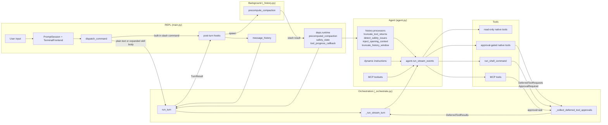
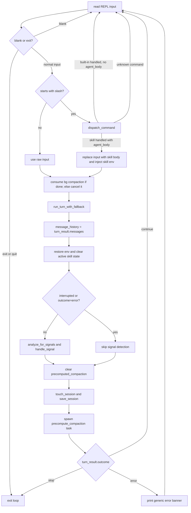
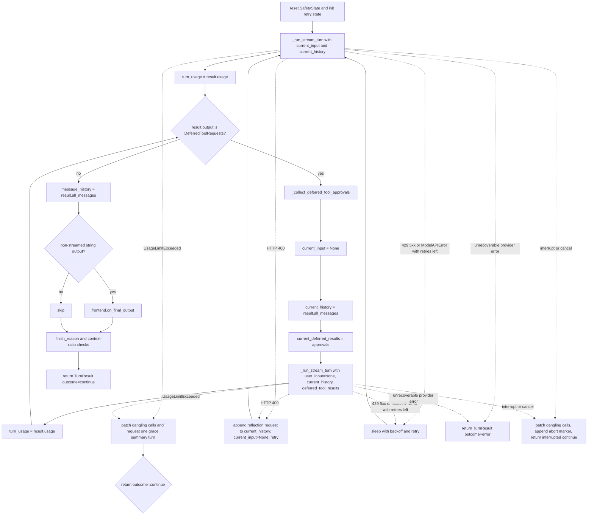
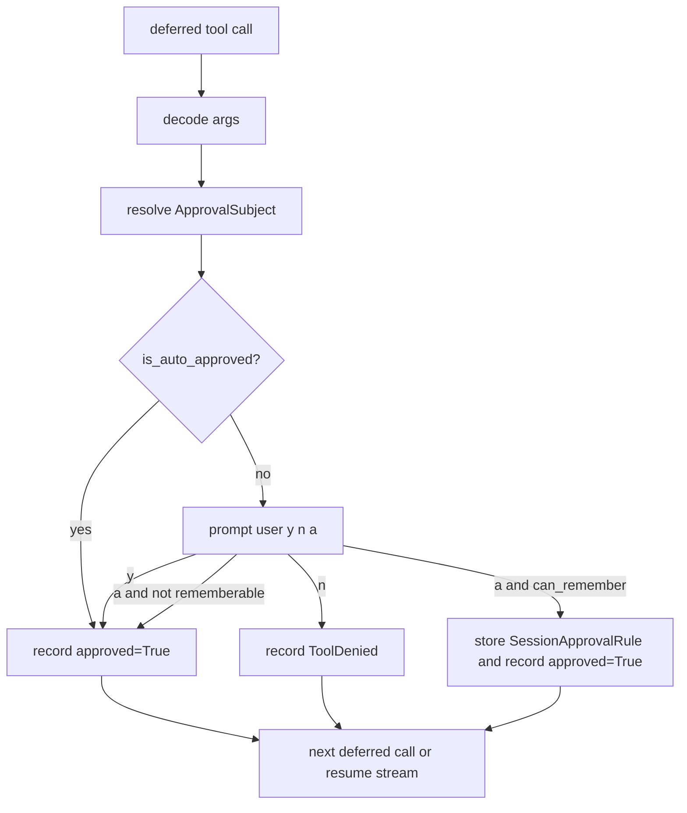

# Co CLI — Core Loop Design

> For top-level architecture and startup sequencing, see [DESIGN-system.md](DESIGN-system.md) and [DESIGN-system-bootstrap.md](DESIGN-system-bootstrap.md).

## 1. What & How

This doc describes the runtime path from one REPL input to one completed turn. The core loop lives in `co_cli/main.py` and `co_cli/context/_orchestrate.py`. `main.py` owns REPL state, slash-command dispatch, skill env injection, session persistence, signal detection, and background compaction scheduling. `_orchestrate.py` owns streamed agent execution, deferred approval collection, approval resume, retry handling, and interrupt recovery. The agent itself is built in `co_cli/agent.py` with dynamic instructions, history processors, native tools, and optional MCP toolsets.



## 2. Core Logic

### 2.1 Main Turn Path

The REPL loop in `main.py` reads input, routes slash commands locally, converts skill commands into synthetic user text, opportunistically harvests any completed background compaction result, then calls `run_turn_with_fallback()`. After the turn returns, it restores any temporary skill env vars, optionally runs signal detection, clears `deps.runtime.precomputed_compaction`, saves session state, spawns the next background compaction task, and branches on `turn_result.outcome`.



Notes:
- Built-in slash commands never enter the agent turn.
- Skill commands are expanded before `run_turn()` so the agent sees normal user text, not a slash token.
- The current `run_turn()` implementation returns `"continue"` and `"error"`; `"stop"` is checked by `main.py` but is not emitted by `_orchestrate.py` today.

### 2.2 `run_turn()` State Machine

`run_turn()` in `_orchestrate.py` owns one complete LLM turn. It resets turn-scoped safety state, initializes retry state, runs the first streamed segment, loops through approval resumption while `result.output` is `DeferredToolRequests`, and then returns a `TurnResult`. Provider errors, budget exhaustion, and interrupts are handled around the whole sequence.



Implementation rules:
- One `UsageLimits` object spans the entire turn, including approval resumes.
- `current_history`, not `message_history`, is the retry input after a reflected HTTP 400.
- Approval resume is part of the same turn. No approval answer is turned into a new chat message.

### 2.3 `_run_stream_turn()` Responsibilities

`_run_stream_turn()` is a stream adapter. It calls `agent.run_stream_events(...)`, forwards text, thinking, tool start, tool progress, and tool completion events to `TerminalFrontend`, captures the final `AgentRunResult`, flushes any buffered output, and returns `(result, streamed_text)`.

Processing outline:

```text
run_stream_events(...)
  -> text/thinking events update local render buffers
  -> tool-call event flushes buffers, announces tool start, installs tool_progress_callback
  -> tool-result event flushes buffers, clears tool_progress_callback, renders tool result
  -> AgentRunResultEvent stores the final result object
  -> function exit flushes any remaining buffers and calls frontend.cleanup()
```

What `_run_stream_turn()` does not do:
- no retry logic
- no approval decisions
- no conversation-history mutation beyond returning `result.all_messages()`

### 2.4 Approval Flow

Deferred approvals are collected only in `_collect_deferred_tool_approvals()`. This function iterates over `result.output.approvals`, decodes args, resolves an `ApprovalSubject`, checks session-scoped auto-approval, otherwise prompts the user, and records `DeferredToolResults`.



Current approval subject scopes:

| Tool shape | Subject kind | Stored value | Rememberable |
|---|---|---|---|
| `run_shell_command` | `shell` | first token of `cmd` | yes when non-empty |
| `write_file`, `edit_file` | `path` | `{tool_name}:{parent_dir}` | yes when path has a parent |
| `web_fetch` | `domain` | parsed hostname | yes when hostname exists |
| MCP tool with configured prefix | `mcp_tool` | `{prefix}:{tool_name}` | yes |
| anything else | `tool` | tool name | no |

Rules:
- `"a"` is session-scoped only. Rules live in `deps.session.session_approval_rules`.
- Auto-approval matching is exact on `kind + value`.
- Shell `DENY` and `ALLOW` happen before this function. `_collect_deferred_tool_approvals()` only handles shell calls that already raised `ApprovalRequired`.

### 2.5 Shell Approval Path

`run_shell_command()` is registered without blanket `requires_approval=True` because approval depends on the concrete command. The tool evaluates the command first:

```text
evaluate_shell_command(cmd)
  DENY              -> return terminal_error immediately
  ALLOW             -> execute immediately
  REQUIRE_APPROVAL  -> if ctx.tool_call_approved then execute else raise ApprovalRequired
```

This keeps command-dependent `DENY` and `ALLOW` behavior inside the tool rather than forcing every shell call into the deferred approval path.

### 2.6 History Processors And Background Compaction

The agent is built with four history processors in this order:
1. `truncate_tool_returns`
2. `detect_safety_issues`
3. `inject_opening_context`
4. `truncate_history_window`

`truncate_history_window()` checks `ctx.deps.runtime.precomputed_compaction`. If a background result exists and still matches the current message count and computed head/tail boundaries, it uses that cached summary. When no precomputed result is available, it inserts a static compaction marker — no inline summarization occurs. `main.py` is responsible for harvesting the background task result before the next turn and for clearing `precomputed_compaction` after the turn completes.

Background compaction contract:

```text
after turn N:
  main.py spawns precompute_compaction(message_history, deps, primary_model)

before turn N+1:
  main.py harvests completed task into deps.runtime.precomputed_compaction
  or cancels unfinished task

during turn N+1:
  truncate_history_window() may consume that cached result

after turn N+1:
  main.py clears deps.runtime.precomputed_compaction
```

### 2.7 Safety, Errors, And Interrupts

Safety and error handling are split across the loop:

| Concern | Owner | Behavior |
|---|---|---|
| doom-loop detection | `detect_safety_issues()` | injects a system prompt after repeated identical tool calls |
| shell reflection cap | `detect_safety_issues()` | injects a system prompt after repeated shell failures |
| request-budget exhaustion | `run_turn()` | performs one grace summary request with `request_limit=1` |
| HTTP 400 tool-call rejection | `run_turn()` | appends a reflection request to `current_history` and retries |
| 429, 5xx, network errors | `run_turn()` | retries with backoff until retry budget is exhausted |
| unrecoverable provider errors | `run_turn()` | returns `TurnResult(outcome="error")` |
| `KeyboardInterrupt` / `CancelledError` during turn | `run_turn()` | patches dangling tool calls, appends an abort marker, returns `interrupted=True` |

Interrupt recovery invariant:
- the next turn must see balanced tool call / tool return history, so `_patch_dangling_tool_calls()` runs before returning from an interrupted turn.

### 2.8 Post-Turn Hooks In `main.py`

After `run_turn_with_fallback()` returns, `_chat_loop()` does the rest of the turn-finalization work:

1. replace `message_history` with `turn_result.messages`
2. restore saved env vars and clear `active_skill_env` / `active_skill_name`
3. if the turn was not interrupted and not an error, run `analyze_for_signals()` and `handle_signal()`
4. clear `deps.runtime.precomputed_compaction`
5. `touch_session()` and `save_session()`
6. spawn the next `precompute_compaction(...)` task
7. if `outcome == "error"`, print a generic error banner

## 3. Config

| Setting | Env Var | Default | Description |
|---|---|---|---|
| `max_request_limit` | `CO_CLI_MAX_REQUEST_LIMIT` | `50` | Max provider requests allowed inside one user turn |
| `model_http_retries` | `CO_CLI_MODEL_HTTP_RETRIES` | `2` | Retry budget for provider and network errors |
| `doom_loop_threshold` | `CO_CLI_DOOM_LOOP_THRESHOLD` | `3` | Identical tool-call streak before doom-loop intervention |
| `max_reflections` | `CO_CLI_MAX_REFLECTIONS` | `3` | Consecutive shell-error streak before reflection-cap intervention |
| `tool_output_trim_chars` | `CO_CLI_TOOL_OUTPUT_TRIM_CHARS` | `2000` | Max chars retained for older tool returns |
| `max_history_messages` | `CO_CLI_MAX_HISTORY_MESSAGES` | `40` | Message-count threshold for sliding-window compaction |
| `session_ttl_minutes` | `CO_SESSION_TTL_MINUTES` | `60` | Session restore freshness window |
| `memory_injection_max_chars` | `CO_CLI_MEMORY_INJECTION_MAX_CHARS` | `2000` | Max chars injected into context from memory recall per turn |

## 4. Files

| File | Purpose |
|---|---|
| `co_cli/main.py` | REPL loop, slash dispatch, skill env injection, post-turn hooks, background compaction scheduling |
| `co_cli/context/_orchestrate.py` | `run_turn()`, `_run_stream_turn()`, `_collect_deferred_tool_approvals()`, interrupt patching |
| `co_cli/agent.py` | Main agent construction: instructions, history processors, native tools, MCP toolsets |
| `co_cli/context/_history.py` | Opening-context injection, tool-output trimming, safety checks, sliding-window compaction, background precompute |
| `co_cli/tools/shell.py` | Command-dependent shell approval and execution path |
| `co_cli/tools/_tool_approvals.py` | Approval subject resolution, session rule matching, and approval recording |
| `co_cli/commands/_commands.py` | Built-in slash commands, skill dispatch, and `/approvals` management |
| `co_cli/context/_session.py` | Session persistence helpers |
