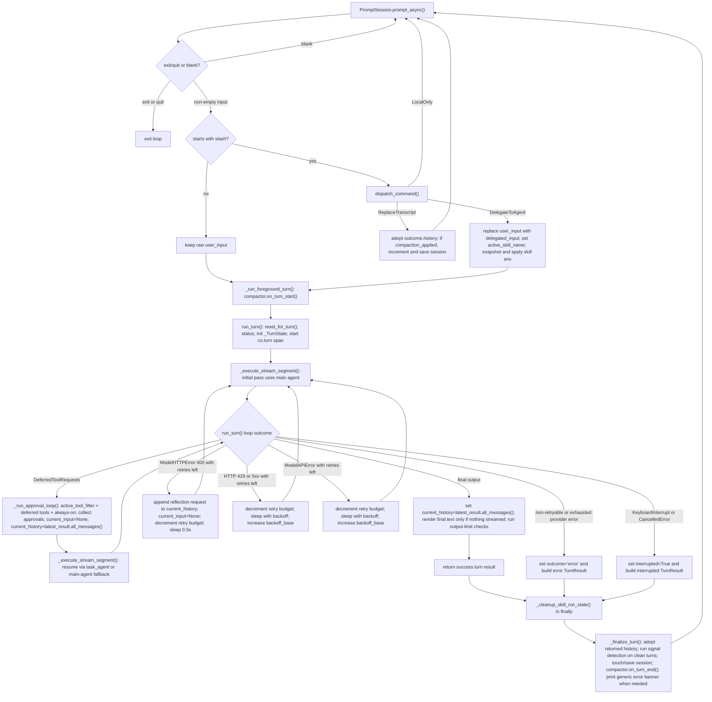
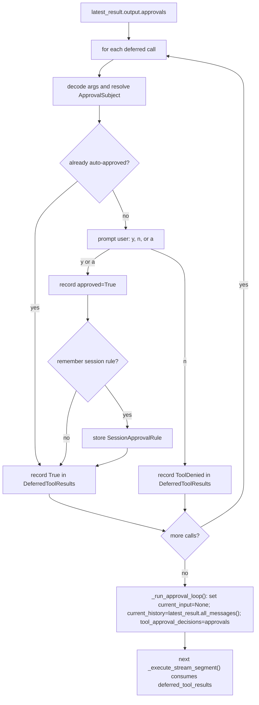

# Co CLI — Core Loop Design

> For top-level architecture and startup sequencing, see [DESIGN-system.md](DESIGN-system.md) and [DESIGN-bootstrap.md](DESIGN-bootstrap.md).

## 1. Foreground Turn Flow

This section describes one complete foreground turn, from REPL input to post-turn finalization.



Execution owners:
- `_chat_loop()` owns REPL control flow: prompt input, `exit`/blank handling, slash-command dispatch, transcript replacement, and deciding whether a slash command stays local or becomes agent input.
- `_run_foreground_turn()` owns the wrapper around one agent turn: `compactor.on_turn_start()`, `run_turn()`, guaranteed `_cleanup_skill_run_state()` in `finally`, then `_finalize_turn()`.
- `run_turn()` owns one orchestrated turn: `deps.runtime.reset_for_turn()`, the `"Co is thinking..."` status, `_TurnState`, stream-segment execution, deferred-approval resumes, provider retries, interrupt handling, output-limit warnings, and `TurnResult`.
- `_execute_stream_segment()` owns stream execution and frontend event delivery only. It does not own retries, approval prompts, or REPL history adoption.
- `_finalize_turn()` owns post-turn adoption of `turn_result.messages`, signal detection on clean turns, session touch/save, next-turn compaction scheduling, and the generic error banner.
- `agent.py` supplies two compatible execution surfaces over the same tool registry: the main agent for the initial pass and the task agent for approval resumes when configured.

State ownership:
- REPL transcript state is `message_history` in `_chat_loop()`.
- Turn-scoped orchestration state is `_TurnState` plus per-turn `deps.runtime` fields such as `turn_usage` and `active_tool_filter`.
- Cross-turn transient state is `deps.runtime.precomputed_compaction` and `deps.runtime.active_skill_name`.
- Session-scoped approval memory is `deps.session.session_approval_rules`.

Turn semantics:
- Slash-command handling stays in `_chat_loop()`. Only `DelegateToAgent` enters the agent-turn path; `LocalOnly` and `ReplaceTranscript` return directly to the prompt.
- Approval resume is an in-turn loop, not a new REPL iteration and not a separate worker flow.
- Background compaction is the only real sidecar path here: `on_turn_start()` harvests or cancels the previous precompute task, and `on_turn_end()` spawns the next one.
- `run_turn()` returns the next transcript snapshot; `_chat_loop()` adopts it only after `_finalize_turn()`. `_orchestrate.py` does not mutate REPL-owned `message_history` in place.
- Skill environment override is limited to one delegated turn: `_chat_loop()` snapshots and applies `skill_env`, `_cleanup_skill_run_state()` restores it in `finally`, and `_finalize_turn()` runs after that restoration.
- Task-agent routing is limited to approval-resume executions inside `_run_approval_loop()`. If a provider retry path fires, the next outer-loop attempt starts again from `_execute_stream_segment()` on the normal `run_turn()` path.

Stream-segment contract:
- `_execute_stream_segment()` reads `_TurnState.current_input`, `_TurnState.current_history`, `_TurnState.tool_approval_decisions`, and `_TurnState.latest_usage`.
- It calls `agent.run_stream_events(...)`; the initial pass uses the main agent, and approval resumes use `deps.services.task_agent` when available.
- `StreamRenderer` buffers text and thinking deltas. Tool-call and tool-result events flush buffered output before updating the frontend.
- `FunctionToolCallEvent` optionally calls `frontend.on_tool_start()` and installs the progress callback. `FunctionToolResultEvent` clears progress and calls `frontend.on_tool_complete()`.
- `AgentRunResultEvent` is the only valid source of the segment result object. If the stream ends without one, `_execute_stream_segment()` raises `RuntimeError`.
- On normal exit, `_execute_stream_segment()` stores `latest_result`, `latest_streamed_text`, and `latest_usage`, clears `tool_approval_decisions`, merges usage into `deps.runtime.turn_usage`, and always runs `frontend.cleanup()` in `finally`.

Per-segment processing outline:

```text
run_stream_events(...)
  -> text/thinking events delegated to StreamRenderer (throttled buffer + flush)
  -> tool-call event: StreamRenderer.flush_for_tool_output(), frontend.on_tool_start() (skipped in summary mode), renderer.install_progress()
  -> tool-result event: StreamRenderer.flush_for_tool_output(), renderer.clear_progress(), frontend.on_tool_complete()
  -> AgentRunResultEvent stores the final result object
  -> function exit: StreamRenderer.finish() flushes remaining buffers, then frontend.cleanup()
  -> if no AgentRunResultEvent was observed, raise RuntimeError
  -> turn_state.latest_result, latest_streamed_text, latest_usage updated in-place; _merge_turn_usage() accumulates segment usage into deps.runtime.turn_usage
```

What `_execute_stream_segment()` does not do:
- no retry logic
- no approval decisions
- no REPL history adoption beyond updating `_TurnState`

## 2. Core Logic

### 2.1 Approval Flow

- `DeferredToolRequests` means the last segment paused on approval-gated tool calls.
- `DeferredToolResults` means Co’s approval decisions for those calls: allow=`True`, deny=`ToolDenied`.
- `DeferredToolResults` is not tool output. It is the decision payload passed into the next resumed `_execute_stream_segment()`.
- `_collect_deferred_tool_approvals()` handles one paused segment: decode args, resolve an `ApprovalSubject`, check session-scoped auto-approval, otherwise prompt the user, then record one approval result per tool call.
- `_run_approval_loop()` owns the resume cycle: while the latest segment still returns `DeferredToolRequests`, it sets `deps.runtime.active_tool_filter` to the deferred tool names ∪ `_ALWAYS_ON_TOOL_NAMES` (narrowing schema context to only the tools needed for this hop), collects approvals, sets `current_input = None`, promotes `latest_result.all_messages()` into `current_history`, stores `tool_approval_decisions`, and runs the next segment. After the loop exits (output is no longer `DeferredToolRequests`), it clears `deps.runtime.active_tool_filter` back to `None`. Resume segments use `deps.services.task_agent` when available (short system prompt, `reasoning_effort: none`, same tools), falling back to the main agent when the task agent is not built.



Current approval subject scopes:

| Tool shape | Subject kind | Stored value | Rememberable |
|---|---|---|---|
| `run_shell_command` | `shell` | first token of `cmd` | yes when non-empty |
| `write_file`, `edit_file` | `path` | bare `parent_dir` (shared across both tools) | yes when path has a parent |
| `web_fetch` | `domain` | parsed hostname | yes when hostname exists |
| anything else (including MCP tools) | `tool` | tool name | yes when tool name is non-empty |

Rules:
- `"a"` is session-scoped only. Rules live in `deps.session.session_approval_rules`.
- Auto-approval matching is exact on `kind + value`.
- `record_approval_choice()` decides whether an `"a"` answer also stores a session rule; rememberability is not a separate branch in `_collect_deferred_tool_approvals()`.
- Shell approval is command-dependent, so `run_shell_command()` classifies the command before deferred approval handling:

```text
evaluate_shell_command(cmd)
  DENY              -> return terminal_error immediately
  ALLOW             -> execute immediately
  REQUIRE_APPROVAL  -> if ctx.tool_call_approved then execute else raise ApprovalRequired
```

This keeps shell `DENY` and `ALLOW` inside the tool. `_collect_deferred_tool_approvals()` only handles shell calls that already raised `ApprovalRequired`.

### 2.2 History Processors And Background Compaction

The agent is built with four history processors in this order:
1. `truncate_tool_returns`
2. `detect_safety_issues`
3. `inject_opening_context`
4. `truncate_history_window`

`truncate_history_window()` compacts when either condition is true:

- `len(messages) > max_history_messages`
- estimated tokens exceed 85% of the internal default budget

Compaction keeps the first run in the head, keeps a recent tail, and replaces the middle with either:

- a cached precomputed summary from `ctx.deps.runtime.precomputed_compaction` when the cached `message_count`, `head_end`, and `tail_start` still match
- a static trim marker when no usable precomputed summary exists

No inline LLM summarization happens inside `truncate_history_window()`. `HistoryCompactionState` is responsible for harvesting the background task result before the next turn and for clearing `precomputed_compaction` after the turn completes.

Background compaction contract:

```text
after turn N:
  compactor.on_turn_end() clears precomputed_compaction and spawns precompute_compaction(...)
  task may return None when history is not near the trigger, already past the trigger, or summarization fails

before turn N+1:
  compactor.on_turn_start() harvests completed task into deps.runtime.precomputed_compaction
  or cancels unfinished task

during turn N+1:
  truncate_history_window() may consume that cached result

after turn N+1 (via on_turn_end):
  precomputed_compaction cleared and next background task spawned
```

### 2.3 Safety, Errors, And Interrupts

Safety and error handling are split across the loop:

| Concern | Owner | Behavior |
|---|---|---|
| doom-loop detection | `detect_safety_issues()` | injects a system prompt after repeated identical tool calls |
| shell reflection cap | `detect_safety_issues()` | injects a system prompt after repeated shell failures |
| HTTP 400 tool-call rejection with retries left | `run_turn()` | appends a reflection request to `current_history`, sets `current_input=None`, and retries |
| HTTP 429 or 5xx with retries left | `run_turn()` | sleeps with backoff, using `Retry-After` when available, then retries |
| `ModelAPIError` with retries left | `run_turn()` | sleeps with backoff and retries |
| unknown 4xx, auth/not-found errors, or exhausted retry budget | `run_turn()` | emits status and returns `TurnResult(outcome="error")` |
| `KeyboardInterrupt` / `CancelledError` during turn | `run_turn()` | truncates to last clean `ModelResponse`, appends an abort marker, returns `interrupted=True` |

Interrupt recovery invariant:
- the next turn must see history ending at a clean point, so the last `ModelResponse` is dropped if it contains any unanswered `ToolCallPart` entries before the abort marker is appended.

### 2.4 Post-Turn Hooks In `main.py`

`_chat_loop()` delegates the full foreground turn lifecycle to `_run_foreground_turn()`. That helper sequences two post-turn helpers:

- `_cleanup_skill_run_state(saved_env, deps)` — called in `finally` to restore saved env vars and clear `active_skill_name`
- `_finalize_turn(turn_result, ...)` — called after env restore; performs the remaining steps:

1. replace `message_history` with `turn_result.messages`
2. if the turn was not interrupted and not an error, run `analyze_for_signals()` and `handle_signal()`
3. `touch_session()` and `save_session()`
4. `compactor.on_turn_end()` — clears `precomputed_compaction` and spawns the next background precompute task
5. if `outcome == "error"`, print a generic error banner

### 2.5 Comparison Against Common Peer Patterns

- Evaluate the current core loop against the shared patterns that recur across the reference systems, not against the largest feature set in any one peer.
- Across Codex, Claude Code, Gemini CLI, Aider, OpenClaw, pi-mono, Letta, Mem0, OpenCode, and nanobot, the common loop shape is still structurally simple:
1. one foreground user input enters one owned turn executor
2. the executor streams model output and tool activity incrementally
3. approvals are resolved at explicit boundaries outside most tool bodies
4. history is compacted or trimmed between turns, not by spawning an in-turn planner graph
5. retries and interrupts are handled by the loop owner, not scattered across tools
6. specialist or background work is bounded and isolated from the main foreground turn
- `co` matches that common shape more than it differs from it.
- The main loop remains REPL-owned.
- `run_turn()` stays a single-turn executor.
- Approvals resume inside the same turn.
- Compaction remains a background optimization rather than a second agent.

| Common pattern from reference systems | How `co` compares | Design read |
|---|---|---|
| Single foreground turn owner (`Codex`, `Claude Code`, `Aider`, `OpenCode`, `pi-mono`) | `main.py` owns REPL/session state and `_orchestrate.py` owns one turn | Aligned |
| Streaming-first execution (`Codex`, `Claude Code`, `Gemini CLI`, `OpenCode`) | `_execute_stream_segment()` is event-driven and frontend-facing | Aligned |
| Orchestration-owned approvals (`Codex`, `Claude Code`, `Aider`, `pi-mono`) | deferred approvals live in `_collect_deferred_tool_approvals()`; shell keeps only command classification inside the tool | Aligned |
| Command-specific shell trust boundary (`Codex`, `Claude Code`) | `run_shell_command()` classifies `DENY` / `ALLOW` / `REQUIRE_APPROVAL` before execution | Aligned and strong |
| Bounded retry and interrupt recovery in the loop (`Codex`, `Claude Code`, `OpenClaw`, `OpenCode`) | `run_turn()` owns provider retries, reflection retry, usage-limit handling, and clean interrupt truncation | Aligned |
| Compaction as a sidecar maintenance concern (`Claude Code`, `OpenClaw`, `pi-mono`, `nanobot`) | background precompute plus turn-time consumption keeps compaction out of the live turn | Aligned |
| Isolated specialist contexts rather than shared mutable subagents (`Claude Code`, `OpenClaw`, `pi-mono`) | sub-agents are isolated through `make_subagent_deps()` and are not part of the foreground loop | Aligned |
| Tighter typed memory models (`Letta`, `Mem0`) | core loop only injects recalled context and does not depend on typed memory blocks | Intentionally simpler than frontier memory systems |
| Event-driven multi-step task graphs (`Gemini CLI`, `OpenClaw`, `nanobot`) | foreground loop is still single-turn; long-running autonomy is mostly outside this path today | Deliberate non-adoption for MVP |

### 2.6 Over-Design Check

- Relative to the common baseline above, the current core loop has a few places where the design is heavier than the shared peer pattern requires.

| Area | Why it is heavier than the common pattern | Risk |
|---|---|---|
| `main.py` split ownership across REPL input, slash dispatch, skill env injection, background-compaction harvest/spawn, session persistence, and post-turn signal detection | Post-turn hooks extracted into `_finalize_turn()` and `_cleanup_skill_run_state()` helpers; full foreground lifecycle delegated to `_run_foreground_turn()`. Background compaction lifecycle moved to `HistoryCompactionState`. `_chat_loop()` is now a clean input loop with control-plane routing. | Remaining split is closer to the minimum needed for a single-turn loop |
| Turn state spread across `message_history`, `current_history`, `deps.runtime.precomputed_compaction`, background task state, and `_TurnState.latest_*` fields | The behavior is correct, but the number of moving pieces is above the minimum needed for a single-turn loop | Harder to reason about retries, resume points, and stale cached state |
| Approval subject taxonomy (`shell`, `path`, `domain`, `tool`) plus exact-match remembered rules | More nuanced than the simpler allow-once / allow-session patterns seen in Aider and many CLI peers | Trust UX can become harder to explain than the underlying safety gain justifies |
| Post-turn hook chain in `_chat_loop()` | Signal detection, compaction cache clearing, session save, and next-turn precompute all happen after the core turn returns | The true loop boundary is less obvious in code and docs |
| `_execute_stream_segment()` stream-state adaptation and frontend rendering policy | Buffer throttling and flush policy extracted to `StreamRenderer` (`co_cli/display/_stream_renderer.py`). Tool display metadata extracted to `_display_hints.py`. `_execute_stream_segment()` now delegates both concerns, keeping only event routing. | Addressed — display changes and orchestration changes are now decoupled |

- Main loop-specific over-design signals today:
- `main.py`'s `_chat_loop()` is now an input loop with control-plane routing. The foreground turn lifecycle (compaction harvest, `run_turn()`, skill env cleanup, finalization) lives in `_run_foreground_turn()`. REPL input, slash dispatch, and skill env injection remain inline.
- The loop carries multiple state carriers for history and compaction, which increases semantic overhead even though each piece is individually reasonable.
- Approval remembering has grown more granular than the common peer baseline; the next improvement should be legibility, not more approval states.

- Areas that do **not** appear over-designed:
- Approval resume staying inside the same turn is consistent with the strongest peer patterns and avoids fake user-message hops.
- Background compaction precompute is lighter than the explicit compaction-agent designs discussed in earlier research and remains a pragmatic optimization.
- Shell approval classification inside the shell tool is justified because the trust decision depends on command shape, not just tool identity.

- Practical conclusion:
- keep the single-turn `run_turn()` contract
- keep orchestration-owned approvals
- keep compaction as a background sidecar
- reduce semantic surface in `main.py` and turn-state ownership before adding new loop abstractions such as task graphs, ACP orchestration, or richer approval classes

## 3. Config

| Setting | Env Var | Default | Description |
|---|---|---|---|

| `model_http_retries` | `CO_CLI_MODEL_HTTP_RETRIES` | `2` | Retry budget for provider and network errors |
| `doom_loop_threshold` | `CO_CLI_DOOM_LOOP_THRESHOLD` | `3` | Identical tool-call streak before doom-loop intervention |
| `max_reflections` | `CO_CLI_MAX_REFLECTIONS` | `3` | Consecutive shell-error streak before reflection-cap intervention |
| `tool_output_trim_chars` | `CO_CLI_TOOL_OUTPUT_TRIM_CHARS` | `2000` | Max chars retained for older tool returns |
| `max_history_messages` | `CO_CLI_MAX_HISTORY_MESSAGES` | `40` | Message-count threshold for sliding-window compaction |
| `ctx_warn_threshold` | `CO_CTX_WARN_THRESHOLD` | `0.85` | Context-ratio threshold for warning the user that prompt budget is getting tight |
| `ctx_overflow_threshold` | `CO_CTX_OVERFLOW_THRESHOLD` | `1.0` | Context-ratio threshold for warning that the provider likely truncated or overflowed input context |
| `session_ttl_minutes` | `CO_SESSION_TTL_MINUTES` | `60` | Session restore freshness window |
| `memory_injection_max_chars` | `CO_CLI_MEMORY_INJECTION_MAX_CHARS` | `2000` | Max chars injected into context from memory recall per turn |
| `reasoning_display` | `CO_CLI_REASONING_DISPLAY` | `summary` | Reasoning display mode: `off` (hidden), `summary` (progress line), `full` (raw thinking) |

## 4. Files

| File | Purpose |
|---|---|
| `co_cli/main.py` | REPL loop, slash dispatch, skill env injection, post-turn hooks, background compaction scheduling |
| `co_cli/context/_orchestrate.py` | `run_turn()` (single turn entrypoint, emits `co.turn` OTel span), `_execute_stream_segment()` (segment event loop, updates `_TurnState`), `_run_approval_loop()` (approval-resume cycle — routes via `task_agent` when available), `_collect_deferred_tool_approvals()`, `_resolve_task_model_settings()` (looks up `ROLE_TASK` settings for resume routing), `_check_output_limits()` (finish-reason and context-overflow diagnostics after a completed turn), `_build_interrupted_turn_result()` (truncate and abort-mark on interrupt), `_build_error_turn_result()` |
| `co_cli/agent.py` | `build_agent()` (main agent: instructions, history processors, native tools, MCP toolsets), `build_task_agent()` (lightweight task agent for approval resume turns: same tools, no personality/date/project instructions/history processors), `_build_filtered_toolset()` (builds a `FilteredToolset` with conditional domain-tool registration and per-request `active_tool_filter` gating; returns toolset + approval map), `_ALWAYS_ON_TOOL_NAMES` (tools always visible even on narrowed resume turns), `_build_mcp_toolsets()` |
| `co_cli/context/_history.py` | Opening-context injection, tool-output trimming, safety checks, sliding-window compaction, background precompute |
| `co_cli/context/_types.py` | `_CompactionBoundaries`, `CompactionResult`, `MemoryRecallState`, `SafetyState` — shared type definitions extracted from `_history.py` to break the circular import with `deps.py` |
| `co_cli/tools/shell.py` | Command-dependent shell approval and execution path |
| `co_cli/tools/_tool_approvals.py` | Approval subject resolution, session rule matching, and approval recording |
| `co_cli/display/_core.py` | `Frontend` protocol, `TerminalFrontend` implementation: manages `Live` instances for streaming text, thinking, tool progress, and status surfaces; `active_surface()` returns the current surface name (`text`/`thinking`/`tool`/`status`/`none`), `active_tool_messages()` returns currently rendered tool labels, `active_status_text()` returns the text last set via `on_status` or `on_reasoning_progress` (or `None` when the status surface is cleared); `cleanup()` stops all live instances and clears `_status_text` |
| `co_cli/display/_stream_renderer.py` | `StreamRenderer`: text/thinking buffering, flush/throttle policy, progress callback wiring; supports `off`/`summary`/`full` reasoning display modes |
| `co_cli/tools/_display_hints.py` | Tool display metadata: args display key per tool, tool result format helper |
| `co_cli/commands/_commands.py` | Built-in slash commands, skill dispatch, and `/approvals` management |
| `co_cli/context/_session.py` | Session persistence helpers |
