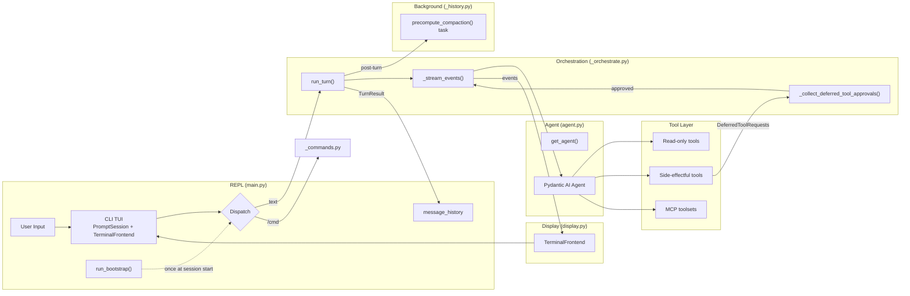
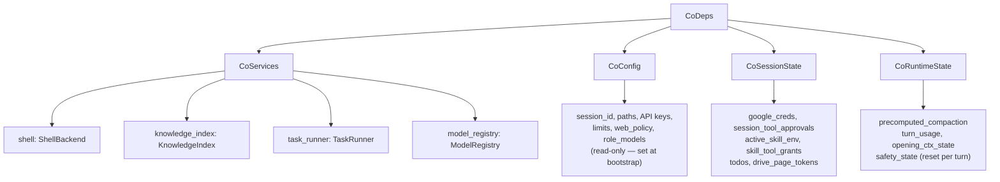

# Co CLI — Core Design

> For system overview, doc navigation, config reference, and module index: [DESIGN-index.md](DESIGN-index.md).

This doc covers the structural design of the system: agent factory, dependency injection (`CoDeps`), capability surface (native tools, skills, MCP extensions, sub-agents, approval boundary), tool conventions, memory and knowledge systems, session management, and security model.

**System Architecture**

```mermaid
graph TB
    subgraph User Interface
        CLI[Typer CLI]
        REPL[Prompt Toolkit REPL]
    end

    subgraph Core Brain
        Agent[Pydantic AI Agent]
        LLM{LLM Provider}
        Ollama[Ollama Local]
        Gemini[Gemini Cloud]
    end

    subgraph Tool Layer
        ToolShell[Shell Tool]
        ToolFiles[File Tools]
        ToolMemory[Memory/Article Tools]
        ToolTodo[Todo Tools]
        ToolDelegate[Delegation Tool]
        ToolCapabilities[Capabilities Tool]
        ToolObsidian[Obsidian Tool]
        ToolDrive[Drive Tool]
        ToolGmail[Gmail Tool]
        ToolCalendar[Calendar Tool]
        ToolWeb[Web Tools]
        ToolBackground[Background Task Tools]
        MCP[MCP Toolsets]
    end

    subgraph External Services
        ObsVault[Obsidian Vault]
        GDrive[Google Drive API]
        GmailAPI[Gmail API]
        GCal[Calendar API]
        BraveAPI[Brave Search API]
        HTTP[HTTP / Web]
        MCPServers[MCP Servers stdio/HTTP]
        Workspace[Workspace Filesystem]
        MemoryDir[.co-cli/memory]
        LibraryDir[~/.local/share/co-cli/library]
        TasksDir[.co-cli/tasks]
    end

    subgraph Infrastructure
        Config[Config Manager]
        Telemetry[OpenTelemetry]
        SQLite[(SQLite DB)]
    end

    CLI --> REPL
    REPL --> Agent
    Agent --> LLM
    LLM --> Ollama
    LLM --> Gemini

    Agent --> ToolShell
    Agent --> ToolFiles
    Agent --> ToolMemory
    Agent --> ToolTodo
    Agent --> ToolDelegate
    Agent --> ToolCapabilities
    Agent --> ToolObsidian
    Agent --> ToolDrive
    Agent --> ToolGmail
    Agent --> ToolCalendar
    Agent --> ToolWeb
    Agent --> ToolBackground

    ToolObsidian --> ObsVault
    ToolDrive --> GDrive
    ToolGmail --> GmailAPI
    ToolCalendar --> GCal
    ToolWeb --> BraveAPI
    ToolWeb --> HTTP
    ToolFiles --> Workspace
    ToolMemory --> MemoryDir
    ToolMemory --> LibraryDir
    ToolBackground --> TasksDir
    MCP --> MCPServers

    Config --> Agent
    Agent --> Telemetry
    Telemetry --> SQLite
```



**Runtime Orchestration Flow**



---

## 1. Agent Factory

`get_agent(all_approval, web_policy, mcp_servers, personality, model_name?) → (agent, model_settings, tool_names, tool_approval)`. Selects the LLM model, assembles the system prompt, registers tools with approval policies, and registers MCP toolsets.

```
get_agent(...) → (agent, model_settings, tool_names, tool_approval):
    resolve model from settings.llm_provider (gemini or ollama)
    load soul seed/examples/mindsets for active personality
    build system_prompt via assemble_prompt(provider, model_name, soul_seed, soul_examples)

    create Agent with:
        model, deps_type=CoDeps, system_prompt, retries=tool_retries
        output_type = [str, DeferredToolRequests]
        history_processors = [inject_opening_context, truncate_tool_returns,
                               detect_safety_issues, truncate_history_window]

    for each tool fn: register via _register(fn, requires_approval)
        → appends (fn.__name__, requires_approval) to tool_registry
    tool_names = [name for name, _ in tool_registry]
    tool_approval = {name: flag for name, flag in tool_registry}
    register MCP toolsets with per-server approval config
```

**History processors** — registered at agent construction, run before every model request:

| Processor | Role |
|-----------|------|
| `inject_opening_context` | Proactively recalls relevant memories and injects them into the message stream |
| `truncate_tool_returns` | Trims old tool outputs to preserve context budget |
| `detect_safety_issues` | Runtime guards: doom-loop detection, shell-error-streak detection |
| `truncate_history_window` | Applies sliding-window compaction for long sessions |

See [DESIGN-context-engineering.md](DESIGN-context-engineering.md) for the full processor chain and prompt assembly order.

See [DESIGN-llm-models.md](DESIGN-llm-models.md) for model configuration details.

---

## 2. CoDeps (Runtime Dependencies)

Nested dataclass injected into every tool via `RunContext[CoDeps]`. Split into four sub-dataclasses by responsibility — no `Settings` objects. `main.py:create_deps()` reads `Settings` once and populates these fields.



| Sub-dataclass | Field Group | Key Fields |
|---------------|-------------|------------|
| `CoServices` | Service handles | `shell` (ShellBackend), `knowledge_index` (KnowledgeIndex or None), `task_runner` (Any or None), `model_registry` (ModelRegistry or None) |
| `CoConfig` | Read-only config | `session_id`, `obsidian_vault_path`, `google_credentials_path`, `shell_safe_commands`, `shell_max_timeout` (600), `exec_approvals_path`, `skills_dir`, `memory_dir`, `library_dir`, `gemini_api_key`, `brave_search_api_key`, `web_policy`, `memory_max_count` (200), `memory_dedup_*`, `memory_auto_save_tags` (["correction","preference"]), `personality`, `personality_critique`, `max_history_messages` (40), `tool_output_trim_chars` (2000), `doom_loop_threshold` (3), `max_reflections` (3), `knowledge_search_backend` (`"fts5"` default), `knowledge_reranker_provider`, `knowledge_chunk_size` (600), `knowledge_chunk_overlap` (80), `role_models` (dict of role → `list[ModelEntry]`), `llm_provider`, `ollama_host`, `ollama_num_ctx`, `ctx_warn_threshold` (0.85), `ctx_overflow_threshold` (1.0), `model_http_retries` (2) |
| `CoSessionState` | Mutable session state | `google_creds` (lazy-resolved), `google_creds_resolved`, `session_tool_approvals` (per-tool session auto-approvals), `active_skill_env` (per-turn env overrides), `skill_tool_grants` (per-turn allowed-tools grants), `drive_page_tokens`, `session_todos`, `skill_registry` (list of skill dicts for system prompt) |
| `CoRuntimeState` | Mutable orchestration state | `precomputed_compaction` (background summary cache), `turn_usage` (RunUsage or None), `opening_ctx_state` (session-scoped), `safety_state` (turn-scoped, reset per turn) |

**`CoConfig.from_settings(s: Settings) → CoConfig`** — factory classmethod that copies all pure-copy fields from `Settings` into a new `CoConfig`. Intentionally excludes eight computed/session fields that must be resolved at bootstrap and applied via `dataclasses.replace()` afterward: `session_id` (generated UUID), `exec_approvals_path`, `skills_dir`, `memory_dir`, `library_dir` (all path-derived from XDG roots or CWD), `personality_critique` (loaded from file), `knowledge_search_backend` (probed at startup), and `mcp_count` (counted from server list). Callers must not assume these fields are populated by `from_settings()` — they are left at dataclass defaults and overridden by `main.py:create_deps()` using `dataclasses.replace()`.

Sub-agents created by delegation tools receive `make_subagent_deps(base)`: shares `services` and `config` by reference (safe — handles are stateless or thread-safe; config is read-only), but resets `session` and `runtime` to clean defaults so the sub-agent does not inherit the parent's approval grants, pagination tokens, todos, compaction cache, or turn usage.

---

## 3. System Capability Surface

The agent's effective capability is not the model alone. It is the interaction of registered native tools, skill overlays, MCP dynamic extensions, CoDeps service handles, and approval policy gates. The native tool inventory is explicitly enumerated — capability is declared, not inferred.

### 3.1 Native Tool Inventory

| Category | Tools | Approval |
|----------|-------|----------|
| Workspace & files | `list_directory`, `read_file`, `find_in_files`, `write_file`, `edit_file` | Read: auto. Writes: deferred |
| Shell | `run_shell_command` | Policy-classified: DENY / ALLOW / REQUIRE\_APPROVAL |
| Web | `web_search`, `web_fetch` | Policy-driven (`web_policy`); deferred when `all_approval=True` |
| Memory & knowledge | `save_memory`, `update_memory`, `append_memory`, `list_memories`, `search_memories`, `search_knowledge`, `save_article`, `read_article_detail` | Save: deferred. Update/append/read: conditional |
| Personal data (Obsidian) | `list_notes`, `read_note` | Conditional |
| Personal data (Google) | `search_drive_files`, `read_drive_file`, `list_emails`, `search_emails`, `create_email_draft`, `list_calendar_events`, `search_calendar_events` | Draft: deferred. Read tools: conditional |
| Background tasks | `start_background_task`, `check_task_status`, `cancel_background_task`, `list_background_tasks` | Start: deferred. Status/cancel/list: auto |
| Session utilities | `todo_write`, `todo_read`, `check_capabilities` | Conditional (todo); auto (capabilities) |
| Delegation | `delegate_coder`, `delegate_research`, `delegate_analysis` | Auto |

### 3.2 Delegated Sub-Agents

Sub-agents are specialist agents with a reduced tool surface and isolated deps (via `make_subagent_deps`). They do not inherit the parent's approvals, skill grants, or session state.

| Sub-agent | Tool surface | Notes |
|-----------|-------------|-------|
| Coder | `list_directory`, `read_file`, `find_in_files` | Read-only workspace; no shell, no web |
| Research | `web_search`, `web_fetch` | Web-only; no memory writes, no shell |
| Analysis | `search_knowledge`, `search_drive_files` | Knowledge/Drive read; no shell, no direct web |

See [DESIGN-tools-delegation.md](DESIGN-tools-delegation.md) for sub-agent design details.

### 3.3 MCP Extension Plane

MCP servers add a dynamic tool extension plane on top of the native surface. The MCP protocol defines three capability types:

| MCP capability | Co-cli concept | Status |
|----------------|----------------|--------|
| `tools` | Agent-callable tools — registered via `toolsets=` in `get_agent()` | Implemented |
| `prompts` | User-invocable skills — slash-command templates, `/skills`-dispatched | Deferred (pending pydantic-ai native prompts support) |
| `resources` | Read-only context injection | Out of scope |

MCP tools inherit the same orchestration and approval model as native tools. Per-server `approval` config (`"auto"` → deferred, `"never"` → trusted) controls the default approval tier.

**Pragmatic deferral for MCP prompts:** pydantic-ai's `MCPServerStdio` does not expose `list_prompts()` or `get_prompt()` at the Python API level. Implementing MCP prompts → skills requires bypassing the SDK — fragile against upgrades. Deferred until pydantic-ai adds native prompts support.

See [DESIGN-mcp-client.md](DESIGN-mcp-client.md) for transport configuration and approval inheritance details.

### 3.4 Skills as Capability Overlays

Skills are user-invocable slash-command workflows that expand into LLM turns. They orchestrate existing tools — they do not add new primitive capabilities. Skills can temporarily grant auto-approval for listed tools via `allowed-tools` during the turn they run. See §5 for the full skills surface.

### 3.5 Approval Boundary

The approval tier determines whether a tool executes immediately or requires user confirmation.

| Category | Approval | Rationale |
|----------|----------|-----------|
| Side-effectful (always) | Always deferred | `create_email_draft`, `save_memory`, `save_article`, `write_file`, `edit_file`, `start_background_task` |
| Shell (conditional) | Policy inside tool | `run_shell_command`: DENY → terminal_error, ALLOW → execute, else raises `ApprovalRequired` |
| Conditional via `all_approval` | Deferred only when `all_approval=True` | `update_memory`, `append_memory`, `todo_write`, `todo_read`, and read-heavy knowledge/Google/Obsidian tools |
| Always auto-execute | Never deferred | `check_capabilities`, `delegate_*`, `list_directory`, `read_file`, `find_in_files`, `check_task_status`, `cancel_background_task`, `list_background_tasks` |
| Web tools | Policy + eval driven | `web_policy.search` / `web_policy.fetch`: `"allow"` or `"ask"`; `all_approval=True` still forces defer |
| MCP tools (approval=auto) | Yes | External tools default to requiring approval |
| MCP tools (approval=never) | No | Explicitly trusted by user config |

See [DESIGN-tools-execution.md](DESIGN-tools-execution.md) for the three-tier approval decision chain.

### 3.6 Graceful Degradation

Capability is partly dynamic — the tool inventory is fixed, but effective power depends on what bootstrapped successfully:

- Knowledge backend resolves adaptively: `hybrid → fts5 → grep`
- MCP server failures degrade gracefully — main agent still runs without the extension tools
- Missing Google credentials keep integration tools registered but degraded
- `check_capabilities` exposes the active capability state so the agent can route around degraded integrations

---

## 4. Tool Surface

### Conventions

**Naming:** `verb_noun` pattern — `read`, `list`, `search`, `create`, `run`, `write`, `edit`. Namespaced families: `web_*`, `todo_*`. Delegation tools use explicit names: `delegate_coder`, `delegate_research`, `delegate_analysis`.

**Return type:** Tools returning data for the user return `dict[str, Any]` with a `display` field (pre-formatted string with URLs baked in) and metadata fields (e.g. `count`, `has_more`). The system prompt instructs the LLM to show `display` verbatim. Tools returning only status use `str | dict(error)`.

**Tool pattern:** All native tools use `agent.tool()` with `RunContext[CoDeps]`. Zero `tool_plain()` remaining. Settings are accessed via `ctx.deps.config`, services via `ctx.deps.services`, session state via `ctx.deps.session`.

### Error Classification

| Type | When to use | Effect |
|------|-------------|--------|
| `ModelRetry` | Wrong parameters — fixable by the LLM | Injects error, re-runs; LLM can self-correct |
| `terminal_error()` | Config error, missing credentials, unrecoverable | Returns `{"display": "...", "error": True}`; stops retry loop |
| `{"count": 0}` | Valid query, no matches | Empty result; not an error |

Per-integration error handlers (e.g. `_handle_drive_error`, `_handle_gmail_error`) plus shared helpers in `tools/_errors.py`.

### Request Budget

- **Tool retries:** `retries=settings.tool_retries` (default 3) at the agent level — all tools share the budget.
- **Request limit:** `UsageLimits(request_limit=settings.max_request_limit)` (default 50) caps LLM round-trips per user turn.
- **Provider errors:** `run_turn()` classifies via `classify_provider_error()`: HTTP 400 → reflection, 429/5xx/network → exponential backoff retry, 401/403/404 → abort. Retries capped at `settings.model_http_retries` (default 2).

See [DESIGN-tools.md](DESIGN-tools.md) for the full tool index and per-tool documentation.

---

## 5. Skills Surface

Skills are `.md` files invocable via `/skill-name` that expand into LLM turns. The key distinction from tools: **tools are agent-callable**; **skills are user-invocable**. Skills orchestrate existing tool capability — they do not add new primitive capabilities.

**Sources and precedence:** Package-default (`co_cli/skills/*.md`) and project-local (`.co-cli/skills/*.md`). Project-local overrides package-default on name collision, enabling project-specific workflow customization.

**Dispatch pipeline:**

```
/skill-name arg1 arg2
    → arg substitution into skill body
    → shell preprocess blocks evaluated (up to 3)
    → skill env vars staged to CoDeps.session.active_skill_env
    → allowed-tools copied to CoDeps.session.skill_tool_grants
    → expanded body submitted as next LLM user turn
    → env + grants cleared after turn completes
```

**Security boundary:** Skills support requires-gating (binaries, env vars, OS, settings), security scanning for suspicious shell patterns, and env-var blocking for dangerous names. However, skills can run shell preprocess commands and auto-approve listed tools — they are best understood as trusted local workflow extensions, not a sandboxed plugin system.

> **Skills design:** [DESIGN-skills.md](DESIGN-skills.md) — startup load, requires gates, dispatch path, env injection, allowed-tools grant, reload/watch, install/upgrade, security scan, and `SkillCommand` internals.

---

## 6. Memory System

Memory files are YAML-frontmatter markdown in `.co-cli/memory/` — per-project scope. They store conversation-derived facts, preferences, and decisions relevant to the current project context.

**Agent-facing tools:** `save_memory` (deferred), `update_memory`, `append_memory`, `list_memories`, `search_memories`, `search_knowledge` (primary cross-source search).

**Runtime injection:** The `inject_opening_context` history processor proactively recalls relevant memories before each turn and injects them as system context — personalization becomes active in ordinary use without requiring the model to call a memory tool at the start of every task.

**Write path:** Post-turn signal detector (`_signal_analyzer.py`) classifies conversation signals. High-confidence signals auto-save via `save_memory`; low-confidence signals surface for user approval. The write pipeline runs dedup → consolidation → write → retention.

> **Memory design:** [DESIGN-memory.md](DESIGN-memory.md) — frontmatter contract, signal detection, dedup, consolidation, write/edit/recall lifecycle, certainty scoring, retention, and runtime injection.

---

## 7. Knowledge System

`KnowledgeIndex` provides full-text and hybrid search across all knowledge sources. Sources: `.co-cli/memory/` (agent memories, project-local), `~/.local/share/co-cli/library/` (saved articles, user-global), Obsidian vault, and Google Drive (when configured).

**Primary retrieval tool:** `search_knowledge` — cross-source search, the agent's main knowledge access path. Library-specific tools: `save_article` (deferred), `read_article_detail`.

**Backend degradation chain:** `hybrid (FTS5 + sqlite-vec embeddings) → fts5 (BM25) → grep`. Resolved adaptively at bootstrap — the agent always has retrieval even if embedding initialization fails.

**Reranking:** Optional cross-encoder reranking via `local`, `ollama`, or `gemini` provider to improve result quality over raw BM25.

> **Knowledge design:** [DESIGN-knowledge.md](DESIGN-knowledge.md) — FTS5/hybrid retrieval, frontmatter schema, startup sync, article save flow, Obsidian/Drive indexing, fallback, and source namespace.

---

## 8. Session Management, REPL & CLI

### Session Lifecycle

Four phases run in order at startup, then the REPL loop takes over:

| Phase | Owner | What it does | Flow doc |
|-------|-------|-------------|----------|
| **Bootstrap** | `run_model_check()` in `_model_check.py` + `run_bootstrap()` in `_bootstrap.py` | Model dependency check (provider + models), knowledge sync, session restore (or create), skill count report, integration health sweep (Step 4) | [DESIGN-system-bootstrap.md](DESIGN-system-bootstrap.md) |
| **Chat loop** | `chat_loop()` in `main.py` | REPL input dispatch, pre/post-turn bookkeeping, skill-env lifecycle, reasoning-chain retry | [DESIGN-core-loop.md](DESIGN-core-loop.md) |
| **Turn** | `run_turn()` in `_orchestrate.py` | Streaming, approval chaining, provider retry/backoff, interrupt recovery → `TurnResult` | [DESIGN-core-loop.md](DESIGN-core-loop.md) |

### Multi-Session State

| Tier | Scope | Lifetime | Example |
|------|-------|----------|---------|
| **Agent config** | Process | Entire process | Model, system prompt, tool registrations |
| **Session deps** | Session | One REPL loop | `CoDeps`: shell, creds, page tokens |
| **Run state** | Single run | One `run_turn()` | Per-turn counter (if needed) |

**Invariant:** Tool/runtime mutable state is session-scoped in `CoDeps.session` (`drive_page_tokens`, approvals, todos) and `CoDeps.runtime` (processor state, compaction cache). `SKILL_COMMANDS` is a module-level registry in `_commands.py`, reloaded at session start.

### FrontendProtocol

`@runtime_checkable` protocol decoupling orchestration from terminal rendering.

| Method | Purpose |
|--------|---------|
| `on_text_delta(accumulated)` | Incremental Markdown render |
| `on_text_commit(final)` | Final render + tear down Live |
| `on_thinking_delta(accumulated)` | Thinking panel (verbose) |
| `on_thinking_commit(final)` | Final thinking panel |
| `on_tool_call(name, args_display)` | Dim annotation |
| `on_tool_result(title, content)` | Panel for result |
| `on_status(message)` | Status messages |
| `on_final_output(text)` | Fallback Markdown render |
| `prompt_approval(description) → str` | y/n/a prompt |
| `cleanup()` | Exception teardown |

Implementations: `TerminalFrontend` (Rich/prompt-toolkit, in `display.py`), `RecordingFrontend` (tests).

### CLI Commands

| Command | Description |
|---------|-------------|
| `co chat` | Interactive REPL (`--verbose` streams thinking tokens) |
| `co status` | System health check |
| `co tail` | Real-time span viewer |
| `co logs` | Telemetry dashboard (Datasette) |
| `co traces` | Visual span tree (HTML) |

### REPL Features

| Feature | Detail |
|---------|--------|
| History | `~/.local/share/co-cli/history.txt` |
| Spinner | "Co is thinking..." before streaming starts |
| Streaming | Rich `Live` + `Markdown` at ~20 FPS |
| Fallback | Final result rendered as Markdown if streaming produced no text |
| Tab completion | `WordCompleter` for built-in `/command` names + user-invocable skill names |

### Slash Commands

Local REPL commands — bypass the LLM, execute instantly. Explicit `dict` registry, no decorators. Handler returns `None` (display-only) or `list` (new history to rebind).

| Command | Effect |
|---------|--------|
| `/help` | Print table of all commands and user-invocable skills |
| `/clear` | Empty conversation history |
| `/new` | Checkpoint current session summary to memory and start fresh history |
| `/status [task_id]` | System health check, or detailed status/output for a background task |
| `/tools` | List registered tool names |
| `/history` | Show turn/message totals |
| `/compact` | LLM-summarise history |
| `/forget <id>` | Delete memory by ID |
| `/approvals [list\|clear [id]]` | Manage persistent exec approval patterns |
| `/checkpoint [label]` | Create a workspace snapshot (git stash or filesystem copy) |
| `/rewind [id]` | Restore a workspace snapshot (prompts `[y/N]` confirmation) |
| `/skills [list\|check\|install <path\|url>\|reload\|upgrade <name>]` | List/check/install/reload/upgrade skills |
| `/background <cmd>` | Run a shell command in the background; prints task_id immediately and returns to prompt |
| `/tasks [status]` | List background tasks, optionally filtered by status (pending/running/completed/failed/cancelled) |
| `/cancel <task_id>` | Cancel a running background task |

### Error Handling and Interrupt Recovery

Provider errors (HTTP 400/429/5xx, network), tool errors (`ModelRetry` vs `terminal_error`), and interrupt recovery (`_patch_dangling_tool_calls` + abort marker) are all part of the core turn flow.

> **Full spec:** [DESIGN-core-loop.md](DESIGN-core-loop.md) §4.12, §4.13 — provider error table, reasoning-chain advance on terminal error, tool error patterns, dangling call patching, Ctrl+C routing.

---

## 9. Security & Configuration

### Configuration

XDG-compliant configuration with project-level overrides. Resolution order (highest wins):

1. Environment variables (`fill_from_env` model validator)
2. `.co-cli/settings.json` in cwd (project — deep merge via `_deep_merge_settings`)
3. `~/.config/co-cli/settings.json` (user)
4. Default values (Pydantic `Field(default=...)`)

Project config is checked at `cwd/.co-cli/settings.json` only — no upward directory walk. `save()` always writes to the user-level file.

MCP servers are configured in `settings.json` under `mcp_servers` (dict of name → `MCPServerConfig`) or via `CO_CLI_MCP_SERVERS` env var (JSON). Each server specifies `command`, `args`, `timeout`, `env`, `approval` (`"auto"`|`"never"`), and optional `prefix`.

### Security Model

Five defense layers:

1. **Configuration** — Secrets in `settings.json` or env vars, no hardcoded keys, env vars override file values
2. **Confirmation** — Human-in-the-loop approval for high-impact side effects (shell, draft creation, memory/article save, file writes, background task start)
3. **Environment sanitization** — Allowlist-only env vars, forced safe pagers, process-group cleanup on timeout (see [DESIGN-tools-execution.md](DESIGN-tools-execution.md))
4. **Input validation** — Path traversal protection in Obsidian tools, API scoping in Google tools
5. **Security posture checks** — `check_security()` in `_status.py` runs when `co status` and `/status` are invoked: (1) user `settings.json` file permissions warn if not `0o600`, (2) project `settings.json` permissions warn if not `0o600`, (3) exec-approvals wildcard entries warn if a `"*"` catch-all pattern exists. Findings are `SecurityFinding(severity, check_id, detail, remediation)` dataclass instances, rendered via `render_security_findings()`.

### Concurrency

Turn execution is single-threaded for model calls (`await run_turn()` per input, no parallel LLM turns). Two asynchronous paths run alongside turns: (1) idle-time `precompute_compaction()` for history summarization prep, and (2) `TaskRunner` subprocess execution for `/background` tasks (bounded by `background_max_concurrent`).
