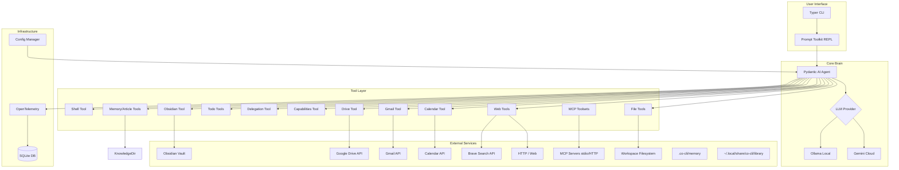
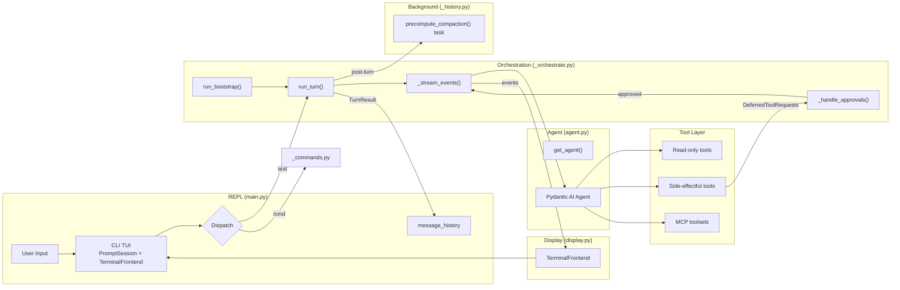

# Co CLI — System Design

## 1. What & How

**Stack:** Python 3.12+, Pydantic AI, Ollama/Gemini, UV

Co is a personal AI assistant CLI — local-first (Ollama) or cloud (Gemini), approval-gated shell execution, OTel tracing to SQLite, human-in-the-loop approval for side effects.

**Diagram 1: System Architecture**



The agent loop is the core orchestration layer. It connects the REPL (user input), the pydantic-ai Agent (LLM + tools), and the terminal display (Rich). Three modules collaborate:

- **`agent.py`** — `get_agent()` factory: model selection, tool registration, system prompt
- **`_orchestrate.py`** — `run_turn()` state machine: streaming, approval chaining, error handling, interrupt patching
- **`main.py`** — REPL: input dispatch, session lifecycle, context history

`CoDeps` (in `deps.py`) is the runtime dependency dataclass injected into every tool via `RunContext[CoDeps]`. `FrontendProtocol` (in `_orchestrate.py`) abstracts all display — `TerminalFrontend` (Rich/prompt-toolkit) and `RecordingFrontend` (tests) implement it.

**Diagram 2: Runtime Orchestration Flow**



### Component Docs (Dependency Order)

Read the core system in this order: `agents + orchestration -> deps -> tools -> knowledge -> memory -> skills -> config reference`.

| Order | Component | Doc | Summary |
|-------|-----------|-----|---------|
| 1 | Agents + Orchestration | [DESIGN-prompt-design.md](DESIGN-prompt-design.md) | Deep spec for `run_turn`, approval re-entry chain, tool preamble, safety policies, prompt-layer composition, context governance, history processors, compaction |
| 2 | Runtime Dependencies (`CoDeps`) | `DESIGN-core.md` (this doc) | Dependency injection model, runtime mutable state, session boundaries, startup bootstrap |
| 3 | Tools | [DESIGN-tools.md](DESIGN-tools.md) — [execution](DESIGN-tools-execution.md), [integrations](DESIGN-tools-integrations.md), [delegation](DESIGN-tools-delegation.md) | Shell, files, background, todo, capabilities, Obsidian, Google, web, memory, sub-agent delegation |
| 4 | Knowledge Substrate | [DESIGN-knowledge.md](DESIGN-knowledge.md) | Library + `search.db`: FTS5/hybrid retrieval, article lifecycle, Obsidian/Drive indexing |
| 5 | Memory Lifecycle | [DESIGN-memory.md](DESIGN-memory.md) | Agent memory: signal detection, dedup, consolidation, retention, runtime injection |
| 6 | Skills | [DESIGN-skills.md](DESIGN-skills.md) | Skills loader, dispatch, env injection, allowlists, security scanner, `/skills` commands |
| 7 | Config Reference | `DESIGN-core.md` Section 3 | Consolidated setting/env/default reference for runtime behavior |

Supporting docs:

| Component | Doc | Summary |
|-----------|-----|---------|
| LLM Models | [DESIGN-llm-models.md](DESIGN-llm-models.md) | Gemini/Ollama model selection, inference parameters, Ollama local setup, sub-agent model roles |
| Personality System | [DESIGN-personality.md](DESIGN-personality.md) | File-driven roles, 5 traits, structural per-turn injection, reasoning depth override |
| MCP Client | [DESIGN-mcp-client.md](DESIGN-mcp-client.md) | External tool servers via Model Context Protocol (stdio and HTTP transports, auto-prefixing, approval inheritance) |
| Logging & Tracking | [DESIGN-logging-and-tracking.md](DESIGN-logging-and-tracking.md) | SQLite span exporter, WAL concurrency, trace viewers, real-time `co tail` |
| Eval LLM-as-Judge | [DESIGN-eval-llm-judge.md](DESIGN-eval-llm-judge.md) | LLM-as-judge scoring for personality behavior evals — structured `{passed, reasoning}` verdict per check |

---

## 2. Core Logic

### Agent Factory (`get_agent`)

Returns `(agent, model_settings, tool_names, tool_approval)`. Selects LLM model based on provider, registers tools with approval policies, assembles the system prompt.

```
get_agent(all_approval, web_policy, mcp_servers, personality, model_name?) → (agent, model_settings, tool_names, tool_approval):
    resolve model from settings.llm_provider (gemini or ollama)
    load soul seed/examples/mindsets for active personality
    build system_prompt via assemble_prompt(provider, model_name, soul_seed, soul_examples)

    create Agent with:
        model, deps_type=CoDeps, system_prompt, retries=tool_retries
        output_type = [str, DeferredToolRequests]
        history_processors = [inject_opening_context, truncate_tool_returns,
                               detect_safety_issues, truncate_history_window]

    for each tool fn: register via _register(fn, requires_approval)
        → appends (fn.__name__, requires_approval) to tool_registry
    tool_names = [name for name, _ in tool_registry]
    tool_approval = {name: flag for name, flag in tool_registry}
    register MCP toolsets with per-server approval config
```

| Category | Approval | Notes |
|----------|----------|-------|
| Side-effectful (always) | Always deferred | `create_email_draft`, `save_memory`, `save_article`, `write_file`, `edit_file`, `start_background_task` |
| Shell (conditional) | Policy inside tool | `run_shell_command`: DENY → terminal_error, ALLOW → execute, else raises `ApprovalRequired` |
| Conditional via `all_approval` | Deferred only when `all_approval=True` | `update_memory`, `append_memory`, `todo_write`, `todo_read`, and read-heavy knowledge/Google/Obsidian tools |
| Always auto-execute (native) | Never deferred by `all_approval` | `check_capabilities`, `delegate_*`, `list_directory`, `read_file`, `find_in_files`, `check_task_status`, `cancel_background_task`, `list_background_tasks` |
| Web tools | Policy + eval driven | `web_policy.search` / `web_policy.fetch`: `"allow"` or `"ask"`; `all_approval=True` still forces defer |
| MCP tools | Per-server config | `"auto"` → deferred; `"never"` → trusted |

See [DESIGN-llm-models.md](DESIGN-llm-models.md) for model configuration details.

### CoDeps (Runtime Dependencies)

Flat dataclass injected into every tool via `RunContext[CoDeps]`. Contains runtime resources and scalar config — no `Settings` objects. `main.py:create_deps()` reads `Settings` once and injects values.

| Group | Fields |
|-------|--------|
| **Runtime resources** | `shell` (ShellBackend), `session_id` (uuid4), `google_creds` (lazy-resolved) |
| **Tool config** | `obsidian_vault_path`, `google_credentials_path`, `shell_safe_commands`, `shell_max_timeout` (600), `brave_search_api_key`, `web_fetch_allowed_domains`, `web_fetch_blocked_domains`, `web_policy`, `web_http_max_retries` (2), `web_http_backoff_base_seconds` (1.0), `web_http_backoff_max_seconds` (8.0), `web_http_jitter_ratio` (0.2), `exec_approvals_path` (persistent exec approvals JSON), `mcp_count` (0, MCP server count for capability introspection), `skills_dir` (project skills directory, set by `chat_loop()` to `.co-cli/skills`) |
| **Knowledge** | `knowledge_index` (KnowledgeIndex or None — initialized when `knowledge_search_backend` is `"fts5"` or `"hybrid"`, None when `"grep"`), `knowledge_search_backend` (`"grep"`, `"fts5"` default, `"hybrid"`), `knowledge_reranker_provider` (`"local"` default; `"none"`, `"ollama"`, `"gemini"`) |
| **Memory config** | `memory_max_count` (200), `memory_dedup_window_days` (7), `memory_dedup_threshold` (85), `memory_consolidation_top_k` (5), `memory_consolidation_timeout_seconds` (20), `memory_recall_half_life_days` (30, temporal decay half-life for FTS-backed recall scoring when backend is `"fts5"` or `"hybrid"`). Overflow retention is cut-only (oldest non-protected deleted). |
| **History governance** | `max_history_messages` (40), `tool_output_trim_chars` (2000), `model_roles["summarization"]` head (empty = primary model) |
| **Personality** | `personality` (role name), `personality_critique` (always-on review lens from `critique.md`) |
| **Skills** | `skill_registry` (list of skill dicts, populated by chat_loop; drives `add_available_skills` system prompt), `active_skill_env` (per-turn env overrides from `skill-env` frontmatter; set by `dispatch()`, cleared by `chat_loop()` `finally`), `active_skill_allowed_tools` (per-turn approval grants from `allowed-tools`; set by `dispatch()`, cleared after `run_turn()`) |
| **Model roles** | `model_roles` (dict mapping role names to ordered model lists; mandatory `reasoning` list for main-agent turns, optional `coding`/`research`/`analysis` lists for delegation; empty optional role list = disabled), `ollama_host` (Ollama server base URL, required for provider-aware sub-agent construction), `turn_usage` (`RunUsage \| None` — accumulates sub-agent request consumption across delegation tool calls in a single parent turn) |
| **LLM / overflow** | `llm_provider` (active LLM backend), `gemini_api_key` (injected from settings, used by `_preflight.py`), `ollama_num_ctx` (context window size — used for overflow detection), `ctx_warn_threshold` (0.85 — warn ratio), `ctx_overflow_threshold` (1.0 — overflow ratio) |
| **Approval risk** | `approval_risk_enabled` (False — enable risk classifier), `approval_auto_low_risk` (False — auto-approve low-risk calls when classifier enabled) |
| **Safety thresholds** | `doom_loop_threshold` (3), `max_reflections` (3) |
| **Mutable state** | `drive_page_tokens` (pagination state per query), `auto_approved_tools` (per-tool session approvals), `session_todos` (session task list), `precomputed_compaction` (background summary cache) |
| **Background tasks** | `task_runner` (`Any \| None`) — background task manager singleton; typed `Any` to avoid circular import with `background.py`; created in `main.py`, injected into CoDeps, accessed by slash command handlers and task_control tools |
| **Processor state** | `_opening_ctx_state` (session-scoped opening-context recall state), `_safety_state` (turn-scoped safety state reset per turn) |

### Multi-Session State Design

| Tier | Scope | Lifetime | Example |
|------|-------|----------|---------|
| **Agent config** | Process | Entire process | Model, system prompt, tool registrations |
| **Session deps** | Session | One REPL loop | `CoDeps`: shell, creds, page tokens |
| **Run state** | Single run | One `run_turn()` | Per-turn counter (if needed) |

**Invariant:** Tool/runtime mutable state is session-scoped in `CoDeps` (`drive_page_tokens`, approvals, todos, processor state). `SKILL_COMMANDS` is a module-level registry in `_commands.py`, reloaded at session start.

### Preflight Phase

Before the agent is created, `run_preflight(deps, frontend)` runs two resource checks in sequence. It is called after `create_deps()` and before `get_agent()` — the agent is never started if any check fails.

```
run_preflight(deps, frontend):
    result = _check_llm_provider(deps.llm_provider, deps.gemini_api_key, deps.ollama_host)
    if result.status == "error"   → raise RuntimeError(result.message)
    if result.status == "warning" → frontend.on_status(result.message)

    result = _check_model_availability(deps.llm_provider, deps.ollama_host, deps.model_roles)
    if result.status == "error"   → raise RuntimeError(result.message)
    if result.status == "warning" → frontend.on_status(result.message)
    if result.model_roles is not None → deps.model_roles = result.model_roles  ← apply mutation
```

**`_check_llm_provider(llm_provider, gemini_api_key, ollama_host) → PreflightResult`** — severity rules:
- `gemini` + key absent → `status="error"` (GEMINI_API_KEY not set — required for Gemini provider)
- `gemini` + key present → `status="ok"`
- `ollama` + server unreachable (`/api/tags`, 5s timeout) → `status="warning"` (soft fail)
- non-Gemini provider + Gemini key absent → `status="warning"` (Gemini-dependent features unavailable)

**`_check_model_availability(llm_provider, ollama_host, model_roles) → PreflightResult`** — Ollama-only, pure function:
- Non-Ollama provider → `status="ok"` immediately
- Ollama + server unreachable → `status="warning"` (soft fail)
- Reasoning chain: no installed model found → `status="error"` (fail-fast)
- Reasoning or optional chain pruned → `status="warning"`, updated chains returned in `result.model_roles`
- All models present → `status="ok"`, `result.model_roles = None` (no mutation needed)

**`PreflightResult`** — shared return type for both check functions:
- `ok: bool`, `status: str` ("ok" | "warning" | "error"), `message: str`
- `model_roles: dict[str, list[str]] | None` — set only by `_check_model_availability` when chains advance

**Extension model:** future checks (new provider support, connectivity probes, config validation) are added to `_preflight.py` only — no changes to `run_bootstrap` or `chat_loop`. `status.py` calls `_check_llm_provider` and `_check_model_availability` directly to populate `StatusInfo.llm_status` — no separate inline LLM probing.

Source: `co_cli/_preflight.py`

### Bootstrap Phase

After preflight, `run_bootstrap()` runs three startup steps in sequence, reporting each via `frontend.on_status()`:

```
run_bootstrap(deps, frontend, memory_dir, library_dir, session_path, session_ttl_minutes, n_skills):
    1. sync_knowledge
         if deps.knowledge_index and (memory_dir.exists() or library_dir.exists()):
             mem_count = sync_dir("memory", memory_dir, kind_filter="memory")
             art_count = sync_dir("library", library_dir, kind_filter="article")
             → reports "Knowledge synced — N item(s) (backend)"
         else:
             → reports "Knowledge index not available — skipped"
         → on error: closes index, sets deps.knowledge_index = None, reports failure

    2. restore_session
         session = load_session(session_path)
         if is_fresh(session, ttl_minutes):
             deps.session_id = session["session_id"]   ← restore for OTel continuity
             → reports "Session restored — {short_id}..."
         else:
             session = new_session()
             deps.session_id = session["session_id"]
             → reports "Session new — {short_id}..."

    3. skills_loaded
         → reports "{n_skills} skill(s) loaded"

    return session_data   ← used for touch/save/increment_compaction in the REPL loop
```

Source: `co_cli/_bootstrap.py`

### Session Lifecycle

Session identity persists across `co chat` restarts within the TTL window, enabling OTel trace continuity and future conversation resume.

```
_session.py functions:
    new_session()              → {session_id: uuid4.hex, created_at, last_used_at, compaction_count: 0}
    load_session(path)         → dict | None  (None if missing/unreadable)
    save_session(path, sess)   → writes JSON, chmod 0o600
    is_fresh(sess, ttl_min)    → True if last_used_at within ttl_minutes (future timestamps → True)
    touch_session(sess)        → new dict with last_used_at = now (immutable update)
    increment_compaction(sess) → new dict with compaction_count + 1
```

**Session dict fields:** `session_id` (UUID hex), `created_at` (ISO8601), `last_used_at` (ISO8601), `compaction_count` (int).

**Lifecycle in the chat loop:**
- After bootstrap: session_data held in `chat_loop` local state
- After each LLM turn: `touch_session()` + `save_session()`
- On `/compact`: `increment_compaction()` + `save_session()`
- On exit: no extra final save; cleanup only
- Storage: `.co-cli/session.json`, mode `0o600`

`deps.session_id` carries the restored or new session UUID — OTel spans are tagged with it for trace continuity across turns.

### Chat Session Lifecycle

```
chat_loop():
    frontend = TerminalFrontend()              ← step 0: hoisted; required by run_preflight
    deps = create_deps()                       ← step 1: deps first, task_runner=None
    deps.skills_dir = Path.cwd() / ".co-cli/skills"   ← set before preflight (needed by skills loader)
    run_preflight(deps, frontend)              ← step 2: ALL resource checks pre-agent; raises RuntimeError on error
    task_runner = TaskRunner(storage, max_concurrent, ...)
    deps.task_runner = task_runner             ← injected after creation
    skill_commands = _load_skills(deps.skills_dir, settings)
    SKILL_COMMANDS.clear(); SKILL_COMMANDS.update(skill_commands)   ← in-place update of module-level registry
    deps.skill_registry = [...]                ← excludes disable-model-invocation skills

    agent, model_settings, tool_names, _ = get_agent(
        web_policy=settings.web_policy,
        mcp_servers=settings.mcp_servers or None,
        personality=settings.personality,
        model_name=deps.model_roles["reasoning"][0],   ← post-preflight chain head
    )
    message_history = []

    async with agent via AsyncExitStack:       ← connects MCP servers
        if MCP init fails: rebuild agent without MCP using deps.model_roles["reasoning"][0]
        if MCP enabled: tool_names = _discover_mcp_tools(...)
        session_data = await run_bootstrap(deps, frontend, ...)
        display_welcome_banner(info)

        loop:
            if skills dir changed: reload skills + refresh completer
            user_input = prompt_async()        ← prompt-toolkit + tab completion

            dispatch:
                "exit"/"quit"  → break
                empty/blank    → continue
                "/command"     → dispatch_command()
                                  if ctx.skill_body:
                                      inject skill-env + allowed-tools grants
                                      user_input = ctx.skill_body → run_turn()
                                  else: continue (no LLM)
                anything else  → run_turn()

            if bg_compaction_task completed: deps.precomputed_compaction = result
            pre_turn_history = message_history
            message_history = turn_result.messages
            if turn_result.outcome == "error" and reasoning_chain has fallback:
                _swap_model_inplace(...) + retry once from pre_turn_history
            restore skill-env and clear active_skill_env/active_skill_allowed_tools in finally
            touch_session() + save_session()
            bg_compaction_task = precompute_compaction(...)

    finally: cancel bg task (if running), shutdown task_runner, close agent context, deps.shell.cleanup()
```

**MCP fallback:** If the agent context fails (MCP server unavailable), the chat loop recreates the agent without MCP and continues with native tools only.

### Orchestration State Machine (`run_turn`)

Single user turn: streaming → approval chaining → error retry → interrupt recovery. Returns `TurnResult(messages, output, usage, interrupted, streamed_text, outcome)`.

```
run_turn(agent, user_input, deps, message_history, ...) → TurnResult:
    deps._safety_state = SafetyState()       ← reset turn-scoped safety state
    turn_limits = UsageLimits(request_limit=max_request_limit)
    turn_usage = None
    current_input = user_input
    backoff_base = 1.0

    retry_loop (up to http_retries):
        try:
            result, streamed = _stream_events(agent, current_input, deps,
                message_history, turn_limits, usage=turn_usage, frontend)
            turn_usage = result.usage()

            while result.output is DeferredToolRequests:
                result, streamed = _handle_approvals(agent, deps, result,
                    model_settings, turn_limits, usage=turn_usage, frontend)
                turn_usage = result.usage()

            if not streamed and output is str:
                frontend.on_final_output(result.output)
            if result.response.finish_reason == "length":
                frontend.on_status("Response may be truncated … Use /continue to extend.")
            return TurnResult(messages=result.all_messages(), ...)

        except ModelHTTPError:
            action, msg, delay = classify_provider_error(e)
            REFLECT  → append error body as ModelRequest to history,
                       set current_input = None, continue
            BACKOFF  → sleep(delay * backoff^attempt), backoff *= 1.5, continue
            ABORT    → return TurnResult(output=None)

        except ModelAPIError:
            backoff retry or ABORT if exhausted

        except (KeyboardInterrupt, CancelledError):
            msgs = result.all_messages() if result else message_history
            patched = _patch_dangling_tool_calls(msgs)
            patched += [ModelRequest(UserPromptPart("The user interrupted ... verify state"))]
            return TurnResult(patched, interrupted=True, outcome="continue")
```

**Design notes:**

- **Approval `while` loop:** A resumed run may produce another `DeferredToolRequests` when the LLM chains multiple side-effectful calls. Each round needs its own approval cycle
- **Budget sharing:** One `UsageLimits` + accumulating `turn_usage` across streaming, approvals, and retries. Prevents N approval hops from getting N × budget
- **Reflection (400):** Error body injected into history as `ModelRequest`; `current_input` set to `None` so the next `_stream_events` resumes from history, letting the model self-correct
- **Progressive backoff:** Escalates by `backoff_base *= 1.5` per retry, capped at 30s. Applies to both `ModelHTTPError` (429/5xx) and `ModelAPIError` (network/timeout)
- **Safe message extraction:** `result` may be `None` if the exception fired before any result was captured — `result.all_messages() if result else message_history` preserves history
- **Finish reason detection:** `result.response.finish_reason` is the OTel-normalized value from `ModelResponse` (`"stop"`, `"length"`, `"content_filter"`, `"tool_call"`, `"error"`, or `None` when the provider does not report it). `AgentRunResult.response` is a property that iterates `all_messages()` in reverse and returns the last `ModelResponse`. On `"length"` (output token limit hit), `frontend.on_status()` emits a truncation warning; all other values are silent
- **`/continue` text:** `run_turn()` status strings currently suggest `/continue`, but `_commands.py` does not define a `/continue` slash command.

**Per-turn safety guards** — three mechanisms running independently of each other per turn:

**Doom loop detection** — `detect_safety_issues()` history processor in `_history.py` scans recent `ToolCallPart` entries for consecutive identical calls, hashed as `MD5(tool_name + json.dumps(args, sort_keys=True))`. If the same hash appears `doom_loop_threshold` (default 3) consecutive times, injects a system message: "You are repeating the same tool call. Try a different approach or explain why." Turn-scoped state lives on `deps._safety_state` and is reset at the start of `run_turn()`.

**Grace turn on budget exhaustion** — When `UsageLimits(request_limit=max_request_limit)` is exceeded mid-turn, pydantic-ai raises `UsageLimitExceeded`. `run_turn()` catches it and fires one additional `_stream_events()` with `request_limit=1`, injecting: "Turn limit reached. Summarize your progress." This gives the model a chance to produce partial results rather than silently truncating. If the grace turn fails, status advises to continue in a fresh prompt.

**Shell reflection** — `run_shell_command` raises `ModelRetry` for non-zero exits/timeouts/unexpected errors (permission failures return terminal `{"error": true}` instead). pydantic-ai's built-in retry mechanism handles re-entry — no orchestration-layer re-entry needed. `detect_safety_issues()` caps consecutive shell errors at `max_reflections` (default 3); on reaching the cap it injects: "Shell reflection limit reached. Ask the user for help or try a fundamentally different approach."

### Streaming (`_stream_events`)

Wraps `agent.run_stream_events()`, dispatches events to frontend. Transient state in `_StreamState` (text/thinking buffers, render timestamps) — fresh per call, no globals.

```
_stream_events(agent, input, deps, history, limits, frontend,
               deferred_tool_results=None) → (result, streamed_text):
    state = _StreamState()
    pending_cmds = {}                          ← shell cmd titles by tool_call_id

    try:
        for each event from agent.run_stream_events(...):
            PartStartEvent(TextPart)           → flush thinking, append text
            PartStartEvent(ThinkingPart)       → if verbose: append, else discard
            TextPartDelta                      → flush thinking, accumulate text,
                                                 throttled render at 50ms (20 FPS)
            ThinkingPartDelta                  → if verbose: accumulate + throttle
            FunctionToolCallEvent              → flush all buffers,
                                                 if shell: store cmd in pending_cmds,
                                                 frontend.on_tool_call(name, args)
            FunctionToolResultEvent            → flush all buffers,
                                                 if ToolReturnPart with str content:
                                                   show with cmd from pending_cmds as title
                                                 elif dict with "display" key:
                                                   show structured result
                                                 else: skip
            FinalResultEvent, PartEndEvent     → no-op (rendering continues after)
            AgentRunResultEvent                → capture result

        commit remaining text buffer
    finally: frontend.cleanup()
```

**Key transitions:** Thinking → text is a one-way flush: first text/tool event commits the thinking panel, then thinking buffer resets. `_flush_for_tool_output()` commits both buffers before any tool annotation or result panel, preventing interleaved output.

**API choice:** `run_stream_events()` over `run_stream()` (incompatible with `DeferredToolRequests` output type), `iter()` (3-4x more code), or `run()` + callback (splits display state).

### Deferred Approval (`_handle_approvals`)

Collects approval decisions for all pending tool calls, then resumes the agent.

```
_handle_approvals(agent, deps, result, model_settings, limits, frontend):
    for each call in result.output.approvals:
        parse args (json.loads if string)
        format description as "tool_name(k=v, ...)"

        # Shell DENY/ALLOW/persistent-approval decisions are made inside run_shell_command.
        # _handle_approvals only handles: skill grants, session auto-approve, risk, user prompt.

        if call.tool_name in deps.active_skill_allowed_tools:
            approve
        elif call.tool_name in deps.auto_approved_tools:
            approve
        elif approval_risk_enabled:
            risk = classify_tool_call(...)
            if risk == LOW and approval_auto_low_risk: approve
            elif risk == HIGH: desc = "[HIGH RISK] " + desc

        if not approved:
            choice = frontend.prompt_approval(desc)
            "y" → approve
            "a" → if shell: persist command pattern
                  else: add call.tool_name to deps.auto_approved_tools
            "n" → ToolDenied("User denied this action")

    return _stream_events(agent, user_input=None,
        message_history=result.all_messages(),
        deferred_tool_results=approvals, ...)
```

**Safe-command gate:** Commands matching the safe-prefix list are auto-approved. **Deny gate:** shell policy can hard-block unsafe command shapes. **Persistent shell approvals:** command patterns in `.co-cli/exec-approvals.json` auto-approve across sessions. **Skill grant tier:** `allowed-tools` from the active skill auto-approves listed tools for that turn. **Risk tier (optional):** low-risk calls auto-approve when classifier flags are enabled; high-risk calls are prompt-annotated. **Per-tool session approval:** `"a"` stores tool names in `deps.auto_approved_tools` for the current session.

### FrontendProtocol

`@runtime_checkable` protocol decoupling orchestration from terminal rendering.

| Method | Purpose |
|--------|---------|
| `on_text_delta(accumulated)` | Incremental Markdown render |
| `on_text_commit(final)` | Final render + tear down Live |
| `on_thinking_delta(accumulated)` | Thinking panel (verbose) |
| `on_thinking_commit(final)` | Final thinking panel |
| `on_tool_call(name, args_display)` | Dim annotation |
| `on_tool_result(title, content)` | Panel for result |
| `on_status(message)` | Status messages |
| `on_final_output(text)` | Fallback Markdown render |
| `prompt_approval(description) → str` | y/n/a prompt |
| `cleanup()` | Exception teardown |

Implementations: `TerminalFrontend` (Rich/prompt-toolkit, in `display.py`), `RecordingFrontend` (tests).

### Slash Commands (`_commands.py`)

Local REPL commands — bypass the LLM, execute instantly. Explicit `dict` registry, no decorators. Handler returns `None` (display-only) or `list` (new history to rebind).

| Command | Effect |
|---------|--------|
| `/help` | Print table of all commands and user-invocable skills |
| `/clear` | Empty conversation history |
| `/new` | Checkpoint current session summary to memory and start fresh history |
| `/status [task_id]` | System health check, or detailed status/output for a background task |
| `/tools` | List registered tool names |
| `/history` | Show turn/message totals |
| `/compact` | LLM-summarise history (see [Agentic Loop & Prompting](DESIGN-prompt-design.md)) |
| `/forget <id>` | Delete memory by ID |
| `/approvals [list\|clear [id]]` | Manage persistent exec approval patterns |
| `/checkpoint [label]` | Create a workspace snapshot (git stash or filesystem copy) |
| `/rewind [id]` | Restore a workspace snapshot (prompts `[y/N]` confirmation) |
| `/skills [list\|check\|install <path\|url>\|reload\|upgrade <name>]` | List/check/install/reload/upgrade skills |
| `/background <cmd>` | Run a shell command in the background; prints task_id immediately and returns to prompt |
| `/tasks [status]` | List background tasks, optionally filtered by status (pending/running/completed/failed/cancelled) |
| `/cancel <task_id>` | Cancel a running background task |

### Skills System

Skills are `.md` files that define LLM prompts or workflow templates invocable via `/name`. They extend the REPL without writing Python.

**Loading:** `_load_skills(project_skills_dir, settings)` — package-default skills (`co_cli/skills/*.md`) are loaded first, then project-local (`.co-cli/skills/*.md`); project overrides package-default on name collision. Reserved names (built-in command names) are skipped with a warning. Loaded skills are stored in the module-level `SKILL_COMMANDS` dict and a summary is written to `deps.skill_registry` for system prompt injection.

**`SkillCommand` dataclass:** `name`, `description`, `body`, `argument_hint`, `user_invocable`, `disable_model_invocation`, `requires`, `skill_env`, `allowed_tools`.

**`requires` gates** — evaluated at load time; skills failing a gate are silently skipped:
- `bins` — all listed binaries must exist on `PATH`
- `anyBins` — at least one listed binary must exist
- `env` — all listed env vars must be set
- `os` — `sys.platform` must start with one of the listed prefixes
- `settings` — named `Settings` fields must be non-None/non-empty

**Dispatch:** `/skill_name [args]` → `dispatch()` sets `ctx.skill_body`, `deps.active_skill_env`, and `deps.active_skill_allowed_tools` (from frontmatter) → `chat_loop` feeds `skill_body` as the user input into `run_turn()`.

**Argument substitution:** `$ARGUMENTS` (full args string), `$0` (skill name), `$1`, `$2`, ... (positional). If `$ARGUMENTS` is absent, args are appended to the body (backward-compat mode).

**Shell preprocessing:** Skill bodies support inline shell blocks `!\`...\``. `dispatch()` evaluates up to 3 blocks via `/bin/sh` (5s timeout each) and replaces each block with stdout before the LLM sees the skill body.

**Package-default skills:** shipped in `co_cli/skills/` — always available regardless of project. Currently ships `doctor.md`, which invokes `check_capabilities` to report active integrations.

**`disable_model_invocation: true`:** skill is user-invocable (appears in `/help`) but excluded from `deps.skill_registry`, so the LLM cannot invoke it directly.

**`skill-env` frontmatter:** `dict[str, str]` of env vars injected into `os.environ` for the LLM turn only. `chat_loop` saves the original values before injection and restores them in a `try/finally` after `run_turn()` completes (including `KeyboardInterrupt`). Blocked vars (`PATH`, `HOME`, `SHELL`, `PYTHONPATH`, etc.) are stripped at load time.

**`allowed-tools` frontmatter:** list of tool names that are auto-approved during that skill turn only. Grants are copied into `deps.active_skill_allowed_tools` during dispatch and always cleared after `run_turn()` so privileges do not leak into later turns.

**Security scan:** `_scan_skill_content()` runs on every skill file at load time (warning-only, logs to `logger.warning`) and again before `/skills install` (blocking — user must confirm). Detects credential exfiltration patterns, pipe-to-shell, destructive shell commands, and prompt injection.

**`/skills install <path|url>`:** copies a `.md` file from a local path or HTTP URL to `ctx.deps.skills_dir`, scans it, reloads `SKILL_COMMANDS`, and updates `deps.skill_registry` in-session without restart. URL fetches use `httpx` with a 10-second timeout; content-type must be `text/*`. URL installs embed `source-url` into the frontmatter. The tab-completer is updated live after install. **`/skills upgrade <name>`** re-fetches from the stored `source-url` and reinstalls without a confirmation prompt. **`/skills reload`** also updates the live completer. A file watcher in `chat_loop()` polls `.co-cli/skills/` mtimes before each prompt and silently reloads on change.

### Error Handling

**Provider errors** — two exception types in `run_turn()`:

| Exception | Status | Action | Behavior |
|-----------|--------|--------|----------|
| `ModelHTTPError` | 400 | `REFLECT` | Inject error body into history, `current_input=None`, re-run |
| `ModelHTTPError` | 401, 403, 404 | `ABORT` | Display error, end turn |
| `ModelHTTPError` | 429 | `BACKOFF_RETRY` | Parse `Retry-After` (default 3s), progressive backoff |
| `ModelHTTPError` | 5xx | `BACKOFF_RETRY` | 2s base, progressive backoff |
| `ModelAPIError` | Network/timeout | `BACKOFF_RETRY` | 2s base, progressive backoff |

All retries capped at `model_http_retries` (default 2). Backoff capped at 30s, escalation factor 1.5× per retry. Classified via `classify_provider_error()` in `_provider_errors.py`.

**Reasoning-chain advance on terminal error** — After `run_turn()` returns with `outcome="error"`, if `model_roles["reasoning"]` has more than one model, `chat_loop` removes the failed head model, swaps to the new head via `_swap_model_inplace(agent, model, provider, settings)`, and retries the full turn once from the original pre-turn history (`pre_turn_history`). This keeps one ordered role list as the only model-selection contract.

**Tool errors** — handled directly inside each tool/integration:

| Pattern | Behavior | Example |
|---------|----------|---------|
| Terminal config/auth error | Return `terminal_error({"display": ..., "error": true})` | Missing credentials path, permission denied |
| Retryable API/usage error | Raise `ModelRetry(...)` | 403/404/429/5xx from Google APIs |
| Successful empty result | Return normal empty payload (not retry) | `{"display": "No files found.", "count": 0}` |

### Interrupt Handling

**Dangling tool call patching:** On `KeyboardInterrupt` / `CancelledError`, `_patch_dangling_tool_calls()` scans *all* `ModelResponse` messages for `ToolCallPart` entries without a matching `ToolReturnPart`, then appends a single synthetic `ModelRequest` with `ToolReturnPart`(s) carrying "Interrupted by user." Full scan handles interrupts during multi-tool approval loops where earlier responses may have unmatched calls.

**Abort marker:** After patching, a second synthetic `ModelRequest` with `UserPromptPart` is appended to history (not displayed to user): "The user interrupted the previous turn. Some actions may be incomplete. Verify current state before continuing." This ensures the model on the next turn knows the previous turn was incomplete and does not repeat work or skip verification. (Pattern from Codex's `<turn_aborted>` marker insertion.)

**Signal handling:** `run_turn()` catches both `KeyboardInterrupt` and `CancelledError` (Python 3.11+ asyncio delivers the latter in async code). For the synchronous approval prompt, `TerminalFrontend.prompt_approval()` temporarily restores Python's default SIGINT handler during `Prompt.ask()`, then restores asyncio's handler in `finally`.

| Context | Ctrl+C Result |
|---------|---------------|
| During `run_turn()` | Patches dangling tool calls, returns to prompt |
| During approval prompt | Cancels approval, returns to prompt |
| At prompt (1st) | "Press Ctrl+C again to exit" |
| At prompt (2nd within 2s) | Exits session |
| At prompt (2nd after 2s) | Treated as new 1st press |
| Anywhere (Ctrl+D) | Exits immediately |

### System Prompt Assembly

Two-part structure — static base assembled once, per-turn layers appended before every model request.
Detailed loop/prompt rationale and safety-policy coupling live in [DESIGN-prompt-design.md](DESIGN-prompt-design.md).

**Static** (`assemble_prompt(provider, model_name, soul_seed, soul_examples)` in `prompts/__init__.py`):

1. **Soul seed + character base memories + mindsets** — identity anchor from `souls/{role}/seed.md`, personality memories from `.co-cli/memory/`, and static mindset blocks from `prompts/personalities/mindsets/{role}/*.md` (combined by `get_agent()`, placed first)
2. **Behavioral rules** — numbered rules from `prompts/rules/*.md` (strict contiguous order)
3. **Soul examples** — trigger→response patterns from `souls/{role}/examples.md` (when file exists, trailing rules)
4. **Model counter-steering** — quirk corrections from `prompts/quirks/{provider}/{model}.md` (when file exists)

**Per-turn** (`@agent.instructions` functions in `agent.py`):

5. **Current date** — always
6. **Shell guidance** — always
7. **Project instructions** — `.co-cli/instructions.md` (when file exists)
8. **Personality memories** — `## Learned Context` (when role is set)
9. **Review lens** — `## Review lens` from `souls/{role}/critique.md` (when role is set)
10. **Available skills** — `## Available Skills` listing `/name — description` entries from `skill_registry` (when non-empty; capped at 2 KB)

See [DESIGN-knowledge.md](DESIGN-knowledge.md) for knowledge loading details.

### Eval Framework

Tool-calling quality is covered in functional pytest via `tests/test_tool_calling_functional.py` (real `agent.run()` path). It validates `tool_selection`, `arg_extraction`, `refusal`, `intent` routing, and `error_recovery` with an enforced agentic Ollama model configuration.

### CLI Commands & REPL

| Command | Description |
|---------|-------------|
| `co chat` | Interactive REPL (`--verbose` streams thinking tokens) |
| `co status` | System health check |
| `co tail` | Real-time span viewer |
| `co logs` | Telemetry dashboard (Datasette) |
| `co traces` | Visual span tree (HTML) |

| REPL Feature | Detail |
|--------------|--------|
| History | `~/.local/share/co-cli/history.txt` |
| Spinner | "Co is thinking..." before streaming starts |
| Streaming | Rich `Live` + `Markdown` at ~20 FPS |
| Fallback | Final result rendered as Markdown if streaming produced no text |
| Tab completion | `WordCompleter` for built-in `/command` names + user-invocable skill names |

---

### Documentation Standards

All DESIGN docs use pseudocode to explain processing logic — never paste source code. This keeps docs readable, prevents staleness when code changes, and forces focus on intent over syntax. Each component doc follows the 4-section template: What & How, Core Logic, Config, Files.

### Configuration

XDG-compliant configuration with project-level overrides. Resolution order (highest wins):

1. Environment variables (`fill_from_env` model validator)
2. `.co-cli/settings.json` in cwd (project — shallow `|=` merge)
3. `~/.config/co-cli/settings.json` (user)
4. Default values (Pydantic `Field(default=...)`)

Project config is checked at `cwd/.co-cli/settings.json` only — no upward directory walk. `save()` always writes to the user-level file.

MCP servers are configured in `settings.json` under `mcp_servers` (dict of name → `MCPServerConfig`) or via `CO_CLI_MCP_SERVERS` env var (JSON). Each server specifies `command`, `args`, `timeout`, `env`, `approval` ("auto"|"never"), and optional `prefix`.

### MCP Capability Classification

The MCP protocol defines three capability types. Co-cli maps each to a distinct concept:

| MCP capability | Co-cli concept | Status |
|----------------|----------------|--------|
| `tools` | Agent-callable tools — registered via `toolsets=` in `get_agent()` | Implemented |
| `prompts` | User-invocable skills — slash-command templates, `/skills`-dispatched | Deferred |
| `resources` | Read-only context injection | Out of scope |

**Best-practice grounding:** The MCP spec defines `prompts` as "user-controlled templates for model interactions" — exactly what skills are. Treating all MCP output as tools conflates two different invocation models: agent-pulls-tool vs user-triggers-prompt. The classification above makes the intended mapping explicit and prevents callers from building on the wrong assumption.

**Pragmatic deferral:** pydantic-ai's `MCPServerStdio` does not expose `list_prompts()` or `get_prompt()` at the Python API level today. Implementing MCP prompts → skills requires either direct MCP transport access (bypassing the SDK) or monkey-patching the client — both are fragile against pydantic-ai upgrades. Implementation is deferred until pydantic-ai adds native prompts support. Transport layer isolation (bypassing the SDK to call prompts/list directly) is rejected — it crosses the SDK abstraction boundary and creates fragile coupling to MCP wire protocol internals.

### Tool Conventions

Native tools use `agent.tool()` with `RunContext[CoDeps]`. Zero `tool_plain()` remaining. External tools are provided by MCP servers configured in `settings.json` and connected as pydantic-ai MCP toolsets (`MCPServerStdio`, `MCPServerSSE`, or `MCPServerStreamableHTTP` depending on config).

**Return convention:** Tools returning data for the user return `dict[str, Any]` with a `display` field (pre-formatted string with URLs baked in) and metadata fields (e.g. `count`, `has_more`). The system prompt instructs the LLM to show `display` verbatim. `_stream_events()` renders tool returns inline as events arrive via `frontend.on_tool_result()`.

| Tool | Return type | Has `display`? | Metadata |
|------|------------|----------------|----------|
| `search_drive_files` | `dict` | Yes | `page`, `has_more` |
| `read_drive_file` | `str \| dict(error)` | No | — |
| `list_emails` / `search_emails` | `dict` | Yes | `count` |
| `create_email_draft` | `str \| dict(error)` | No | — |
| `list_calendar_events` / `search_calendar_events` | `dict` | Yes | `count` |
| `search_notes` | `dict` | Yes | `count`, `total`, `offset`, `limit`, `has_more` |
| `list_notes` | `dict` | Yes | `count`, `total`, `offset`, `limit`, `has_more` |
| `read_note` | `str` | No | — |
| `run_shell_command` | `str \| dict(error)` | No | — |
| `web_search` | `dict` | Yes | `results`, `count` |
| `web_fetch` | `dict` | Yes | `url`, `content_type`, `truncated` |

**Naming convention:** `verb_noun` (`read`, `list`, `search`, `create`, `run`, `write`, `edit`) plus namespaced families (`web_*`, `todo_*`). Delegation tools use explicit names (`delegate_coder`, `delegate_research`).

**Error classification:** Tools use per-integration handlers (for example `_handle_drive_error`, `_handle_gmail_error`, `_handle_calendar_error`) plus shared helpers in `tools/_errors.py` (`terminal_error`, `http_status_code`). Terminal failures return `{"display": "...", "error": True}`; retryable API/usage failures raise `ModelRetry`.

**ModelRetry convention:** `ModelRetry` = "you called this wrong, fix your parameters" (LLM can self-correct). Empty result = "query was fine, nothing matched" (return `{"count": 0}`). **Terminal config errors** (missing credentials, API not enabled) use `terminal_error()` which returns `{"display": "...", "error": True}` instead of `ModelRetry` — this stops the retry loop and lets the model route to an alternative tool.

**Retry budget:** Agent-level `retries=settings.tool_retries` (default 3). All tools inherit the same budget.

**Provider error handling:** `run_turn()` classifies provider errors via `classify_provider_error()`: HTTP 400 → reflection (inject error, re-run), 429/5xx/network → exponential backoff retry, 401/403/404 → abort. All retries capped at `settings.model_http_retries` (default 2).

**Request limit:** `UsageLimits(request_limit=settings.max_request_limit)` (default 50) caps LLM round-trips per user turn.

### Approval Flow

`_handle_approvals()` runs a shell policy + approval decision chain for each pending tool call. Tools contain only business logic — no UI imports. Registration policy has three buckets:
- always-approval side effects (`run_shell_command`, `create_email_draft`, `save_memory`, `save_article`, `write_file`, `edit_file`, `start_background_task`)
- conditional `all_approval` tools (`update_memory`, `append_memory`, `todo_*`, and read-heavy knowledge/Google/Obsidian tools)
- always-auto native tools (`check_capabilities`, `delegate_*`, local file read tools, task status/cancel/list)

**Approval chain (in order, first match wins):**

Shell commands are pre-screened by `shell_policy.evaluate_shell_command()` before entering the tier chain. This produces three decisions: `DENY` (hard block — e.g. control chars, heredoc injection, destructive `rm -rf /`), `ALLOW` (auto-approve — safe prefix match), or `REQUIRE_APPROVAL` (fall through to later tiers). Denied commands receive `ToolDenied` immediately without prompting.

1. **Safe-command allowlist** (`shell_policy.evaluate_shell_command()` → ALLOW) — shell-only. Read-only commands matching the configurable prefix list are auto-approved silently. Chaining operators (`;`, `&`, `|`, `>`, etc.) or injection patterns force REQUIRE_APPROVAL or DENY.
2. **Persistent cross-session approvals** (`_exec_approvals.find_approved()`) — shell-only. If the command matches a stored fnmatch pattern in `.co-cli/exec-approvals.json`, auto-approve and update `last_used_at`. Patterns are derived from previous `"a"` choices. Bare `"*"` pattern is blocked as a safety guard.
3. **Skill `allowed-tools` grants** (`deps.active_skill_allowed_tools`) — non-shell tools. If active skill frontmatter granted this tool, auto-approve for this turn.
4. **Per-session auto-approve** (`deps.auto_approved_tools`) — non-shell tools. If the user previously chose `"a"` for this tool name in the current session, auto-approve.
5. **Risk classifier (optional)** — when `approval_risk_enabled=true` and `approval_auto_low_risk=true`, LOW-risk calls from `_approval_risk.classify_tool_call()` auto-approve. HIGH-risk calls are prompt-labeled.
6. **User prompt** — `frontend.prompt_approval(desc)` → `[y/n/a]`. Denial sends `ToolDenied("User denied this action")` — LLM sees it and can suggest alternatives.

**What `"a"` (always) persists:**
- `run_shell_command`: derives a pattern (e.g. `"git commit *"`) and saves it to `.co-cli/exec-approvals.json` — **persists across sessions**
- All other tools: adds tool name to `deps.auto_approved_tools` — **session-only**

Stale exec approvals (older than 90 days by `last_used_at`) are pruned at `create_deps()` startup. `/approvals list` and `/approvals clear [id]` manage stored patterns.

| Tool | Approval | Rationale |
|------|----------|-----------|
| `run_shell_command` | Yes | Arbitrary code execution. Safe-prefix commands auto-approved. |
| `create_email_draft` | Yes | Creates Gmail draft on user's behalf |
| `start_background_task` | Yes | Starts long-running shell command in background |
| `save_memory` | Yes | Writes to `.co-cli/memory/` (project-local) |
| `save_article` | Yes | Writes to `~/.local/share/co-cli/library/` (user-global) |
| `write_file` | Yes | Writes files to the workspace |
| `edit_file` | Yes | Modifies existing workspace files |
| `update_memory` / `append_memory` / `todo_*` | Eval-only | Deferred only when `all_approval=True`; default runtime executes without approval |
| Knowledge/Google/Obsidian read tools | Eval-only | Deferred when `all_approval=True` to support approval-focused eval harnesses |
| MCP tools (approval=auto) | Yes | External tools default to requiring approval |
| MCP tools (approval=never) | No | Explicitly trusted by user config |
| Local read/delegation/task-inspection tools | No | `check_capabilities`, `delegate_*`, file-read, task status/cancel/list are auto-exec |

### Security Model

Five defense layers:

1. **Configuration** — Secrets in `settings.json` or env vars, no hardcoded keys, env vars override file values
2. **Confirmation** — Human-in-the-loop approval for high-impact side effects (shell, draft creation, memory/article save, file writes, background task start)
3. **Environment sanitization** — Allowlist-only env vars, forced safe pagers, process-group cleanup on timeout (see [DESIGN-tools-execution.md](DESIGN-tools-execution.md))
4. **Input validation** — Path traversal protection in Obsidian tools, API scoping in Google tools
5. **Security posture checks** — `check_security()` in `status.py` runs when `co status` and `/status` are invoked: (1) user `settings.json` file permissions warn if not `0o600`, (2) project `settings.json` permissions warn if not `0o600`, (3) exec-approvals wildcard entries warn if a `"*"` catch-all pattern exists. Findings are `SecurityFinding(severity, check_id, detail, remediation)` dataclass instances, rendered via `render_security_findings()`.

### Concurrency

Turn execution is single-threaded for model calls (`await run_turn()` per input, no parallel LLM turns). Two asynchronous paths run alongside turns: (1) idle-time `precompute_compaction()` for history summarization prep, and (2) `TaskRunner` subprocess execution for `/background` tasks (bounded by `background_max_concurrent`).

### XDG Directory Structure

```
~/.config/co-cli/
└── settings.json          # User configuration

~/.local/share/co-cli/
├── co-cli.db              # OpenTelemetry traces (SQLite)
├── search.db              # FTS5 / hybrid knowledge search index (rebuildable)
└── history.txt            # REPL command history

<project-root>/
└── .co-cli/
    ├── memory/            # Memory files (kind: memory); articles stored in ~/.local/share/co-cli/library/
    ├── skills/            # Project-local skill .md files (override package-default on name collision)
    ├── session.json       # Session persistence (mode 0o600): session_id, created_at, last_used_at, compaction_count
    ├── exec-approvals.json # Persistent exec approval patterns (mode 0o600)
    └── settings.json      # Project configuration (overrides user)
```

### Modules

| Layer | Module | Purpose |
|-------|--------|---------|
| 1. Agents + Orchestration | `main.py` | CLI entry point, chat loop, OTel setup, `create_deps()` |
| 1. Agents + Orchestration | `agent.py` | `get_agent()` factory — model selection, tool registration, system prompt |
| 1. Agents + Orchestration | `_orchestrate.py` | `FrontendProtocol`, `TurnResult`, `run_turn()`, `_stream_events()`, `_handle_approvals()` |
| 1. Agents + Orchestration | `_provider_errors.py` | `ProviderErrorAction`, `classify_provider_error()` — chat-loop error classification |
| 2. Runtime Deps + Session State | `deps.py` | `CoDeps` dataclass — runtime dependencies injected via `RunContext` |
| 2. Runtime Deps + Session State | `_preflight.py` | `run_preflight()`, `PreflightResult`, `_check_llm_provider()`, `_check_model_availability()` — pre-agent resource gate |
| 2. Runtime Deps + Session State | `_bootstrap.py` | `run_bootstrap()` — three startup steps: knowledge sync, session restore/create, skills count report |
| 2. Runtime Deps + Session State | `_session.py` | Session persistence: `new_session()`, `load_session()`, `save_session()`, `is_fresh()`, `touch_session()`, `increment_compaction()` |
| 2. Runtime Deps + Session State | `_history.py` | History processors and `summarize_messages()` |
| 2. Runtime Deps + Session State | `_exec_approvals.py` | Persistent exec approvals: `derive_pattern()`, `find_approved()`, `add_approval()`, `update_last_used()`, `prune_stale()` |
| 3. Tool Layer | `tools/shell.py` | `run_shell_command` — approval-gated shell execution |
| 3. Tool Layer | `tools/files.py` | Native file tools: `list_directory`, `read_file`, `find_in_files`, `write_file`, `edit_file` |
| 3. Tool Layer | `tools/delegation.py` | `delegate_coder`, `delegate_research`, `delegate_analysis` — read-only sub-agent delegation tools |
| 3. Tool Layer | `tools/todo.py` | Session todo tools: `todo_write`, `todo_read` |
| 3. Tool Layer | `tools/obsidian.py` | `search_notes`, `list_notes`, `read_note` |
| 3. Tool Layer | `tools/google_drive.py` | `search_drive_files`, `read_drive_file` |
| 3. Tool Layer | `tools/google_gmail.py` | `list_emails`, `search_emails`, `create_email_draft` |
| 3. Tool Layer | `tools/google_calendar.py` | `list_calendar_events`, `search_calendar_events` |
| 3. Tool Layer | `tools/web.py` | `web_search`, `web_fetch` — Brave Search API + URL fetch |
| 3. Tool Layer | `tools/capabilities.py` | `check_capabilities` — capability introspection tool (read-only, no approval) |
| 3. Tool Layer | `tools/task_control.py` | Background task tools: `start_background_task` (approval), `check_task_status`, `cancel_background_task`, `list_background_tasks` |
| 3. Tool Layer | `tools/_google_auth.py` | Google credential resolution (ensure/get/cached) |
| 3. Tool Layer | `tools/_errors.py` | Shared error helpers: `terminal_error()`, `http_status_code()` |
| 3. Tool Layer | `shell_backend.py` | `ShellBackend` — approval-gated subprocess execution |
| 3. Tool Layer | `shell_policy.py` | Shell policy engine: `evaluate_shell_command()` — DENY / ALLOW / REQUIRE_APPROVAL classification |
| 3. Tool Layer | `_approval.py` | Shell safe-command classification (`_is_safe_command`) |
| 3. Tool Layer | `_shell_env.py` | Shell env sanitizer + process-group kill helpers (`restricted_env`, `kill_process_tree`) |
| 3. Tool Layer | `_approval_risk.py` | Tool call risk classifier: `classify_tool_call()` → `ApprovalRisk` (LOW / MEDIUM / HIGH) |
| 3. Tool Layer | `background.py` | `TaskStatus` enum, `TaskStorage` (filesystem), `TaskRunner` (asyncio process manager) — background task execution |
| 3. Tool Layer | `workspace_checkpoint.py` | Workspace checkpoint + rewind: `create_checkpoint()`, `restore_checkpoint()` |
| 3. Tool Layer | `agents/__init__.py` | Sub-agent package init |
| 3. Tool Layer | `agents/_factory.py` | Provider-aware sub-agent model factory: `make_subagent_model(model_name, provider, ollama_host)` |
| 3. Tool Layer | `agents/coder.py` | Read-only coder sub-agent: `CoderResult`, `make_coder_agent(model_name, provider, ollama_host)` |
| 3. Tool Layer | `agents/research.py` | Read-only research sub-agent: `ResearchResult`, `make_research_agent(model_name, provider, ollama_host)` |
| 3. Tool Layer | `agents/analysis.py` | Read-only analysis sub-agent: `AnalysisResult`, `make_analysis_agent(model_name, provider, ollama_host)` |
| 4. Knowledge + Memory | `knowledge_index.py` | FTS5/hybrid index for memory/article/obsidian/drive search |
| 4. Knowledge + Memory | `tools/articles.py` | Article/knowledge tools: `save_article`, `search_knowledge`, `read_article_detail`, `recall_article` |
| 4. Knowledge + Memory | `memory_lifecycle.py` | Write entrypoint for all memory saves: dedup → consolidation → write → retention |
| 4. Knowledge + Memory | `memory_consolidator.py` | LLM-driven fact extraction and contradiction resolution |
| 4. Knowledge + Memory | `memory_retention.py` | Cut-only retention enforcement |
| 4. Knowledge + Memory | `tools/memory.py` | Memory recall/edit tools: `save_memory`, `recall_memory`, `search_memories`, `list_memories`, `update_memory`, `append_memory` |
| 4. Knowledge + Memory | `tools/personality.py` | Per-turn personality-context memory injector helper |
| 4. Knowledge + Memory | `_frontmatter.py` | YAML frontmatter parser for skills/knowledge markdown files |
| 4. Knowledge + Memory | `_signal_analyzer.py` | Post-turn signal detector for auto-memory capture |
| 5. Skills | `_commands.py` | Slash command registry, handlers, `dispatch()`, `_load_skills()`, `SkillCommand` |
| 5. Skills | `skills/` | Package-default skill `.md` files — always available; currently ships `doctor.md` |
| 6. Config + Infra Reference | `config.py` | `Settings` + `MCPServerConfig` (Pydantic BaseModel) from `settings.json` + env vars |
| 6. Config + Infra Reference | `display.py` | Themed Rich Console, semantic styles, display helpers, `TerminalFrontend` |
| 6. Config + Infra Reference | `status.py` | `StatusInfo` dataclass + `get_status()` + `render_status_table()` + `SecurityFinding` dataclass + `check_security()` + `render_security_findings()` |
| 6. Config + Infra Reference | `_telemetry.py` | `SQLiteSpanExporter` — OTel spans to SQLite with WAL mode |
| 6. Config + Infra Reference | `_tail.py` | Real-time span viewer (`co tail`) |
| 6. Config + Infra Reference | `_trace_viewer.py` | Static HTML trace viewer (`co traces`) |
| 6. Config + Infra Reference | `_banner.py` | ASCII art welcome banner |
| 6. Config + Infra Reference | `tests/test_tool_calling_functional.py` | Functional tool-calling gate — selection, args, refusal, intent routing, recovery |

---

## 3. Config Reference

Settings relevant to the agent loop. Full settings inventory in `co_cli/config.py`.

| Setting | Env Var | Default | Purpose |
|---------|---------|---------|---------|
| `theme` | `CO_CLI_THEME` | `"light"` | CLI theme selection |
| `obsidian_vault_path` | `OBSIDIAN_VAULT_PATH` | `null` | Obsidian vault root for notes tools |
| `brave_search_api_key` | `BRAVE_SEARCH_API_KEY` | `null` | Brave Search credential for `web_search` |
| `google_credentials_path` | `GOOGLE_CREDENTIALS_PATH` | `null` | Explicit OAuth credential path for Google tools |
| `personality` | `CO_CLI_PERSONALITY` | `"finch"` | Personality role name (per-turn injection) |
| `tool_retries` | `CO_CLI_TOOL_RETRIES` | `3` | Agent-level retry budget for all tools |
| `model_http_retries` | `CO_CLI_MODEL_HTTP_RETRIES` | `2` | Max provider error retries per turn |
| `max_request_limit` | `CO_CLI_MAX_REQUEST_LIMIT` | `50` | Caps LLM round-trips per user turn |
| `model_roles` | `CO_MODEL_ROLE_REASONING`, `CO_MODEL_ROLE_CODING`, `CO_MODEL_ROLE_RESEARCH`, `CO_MODEL_ROLE_ANALYSIS` | provider default for `reasoning` | Ordered model chains per role (`reasoning` required; other roles optional) |
| `llm_provider` | `LLM_PROVIDER` | `"ollama"` | Provider selection (`gemini` or `ollama`) |
| `gemini_api_key` | `GEMINI_API_KEY` | `null` | Gemini credential (required when provider is `gemini`) |
| `ollama_host` | `OLLAMA_HOST` | `"http://localhost:11434"` | Ollama server base URL |
| `ollama_num_ctx` | `OLLAMA_NUM_CTX` | `262144` | Configured Ollama context window hint |
| `ctx_warn_threshold` | `CO_CTX_WARN_THRESHOLD` | `0.85` | Warn ratio for context saturation |
| `ctx_overflow_threshold` | `CO_CTX_OVERFLOW_THRESHOLD` | `1.0` | Overflow ratio for context saturation |
| `doom_loop_threshold` | `CO_CLI_DOOM_LOOP_THRESHOLD` | `3` | Consecutive identical tool-call threshold for doom-loop warning |
| `max_reflections` | `CO_CLI_MAX_REFLECTIONS` | `3` | Consecutive shell-error threshold for reflection-cap warning |
| `max_history_messages` | `CO_CLI_MAX_HISTORY_MESSAGES` | `40` | Sliding window threshold |
| `tool_output_trim_chars` | `CO_CLI_TOOL_OUTPUT_TRIM_CHARS` | `2000` | Truncate old tool outputs |
| `model_roles["summarization"]` | `CO_MODEL_ROLE_SUMMARIZATION` | `[]` | Optional summarization model chain; head used for `/compact` and history compaction (empty = primary model) |
| `shell_max_timeout` | `CO_CLI_SHELL_MAX_TIMEOUT` | `600` | Hard cap for `run_shell_command` timeout seconds |
| `shell_safe_commands` | `CO_CLI_SHELL_SAFE_COMMANDS` | built-in list | Safe-prefix auto-approval allowlist |
| `web_policy.search` | `CO_CLI_WEB_POLICY_SEARCH` | `"allow"` | `web_search` policy (`allow`, `ask`, `deny`) |
| `web_policy.fetch` | `CO_CLI_WEB_POLICY_FETCH` | `"allow"` | `web_fetch` policy (`allow`, `ask`, `deny`) |
| `web_fetch_allowed_domains` | `CO_CLI_WEB_FETCH_ALLOWED_DOMAINS` | `[]` | Optional domain allowlist for `web_fetch` |
| `web_fetch_blocked_domains` | `CO_CLI_WEB_FETCH_BLOCKED_DOMAINS` | `[]` | Domain blocklist for `web_fetch` |
| `web_http_max_retries` | `CO_CLI_WEB_HTTP_MAX_RETRIES` | `2` | Max HTTP retries for `web_fetch` (exponential backoff) |
| `web_http_backoff_base_seconds` | `CO_CLI_WEB_HTTP_BACKOFF_BASE_SECONDS` | `1.0` | Base backoff interval (seconds) for `web_fetch` retries |
| `web_http_backoff_max_seconds` | `CO_CLI_WEB_HTTP_BACKOFF_MAX_SECONDS` | `8.0` | Max backoff cap (seconds) for `web_fetch` retries |
| `web_http_jitter_ratio` | `CO_CLI_WEB_HTTP_JITTER_RATIO` | `0.2` | Jitter fraction applied to backoff interval (0–1) |
| `knowledge_search_backend` | `CO_KNOWLEDGE_SEARCH_BACKEND` | `"fts5"` | Knowledge retrieval backend (`grep`, `fts5`, `hybrid`) |
| `knowledge_embedding_provider` | `CO_KNOWLEDGE_EMBEDDING_PROVIDER` | `"ollama"` | Embedding provider for hybrid retrieval |
| `knowledge_embedding_model` | `CO_KNOWLEDGE_EMBEDDING_MODEL` | `"embeddinggemma"` | Embedding model name |
| `knowledge_embedding_dims` | `CO_KNOWLEDGE_EMBEDDING_DIMS` | `256` | Embedding vector dimensionality |
| `knowledge_hybrid_vector_weight` | `—` | `0.7` | Hybrid retrieval vector-score weight |
| `knowledge_hybrid_text_weight` | `—` | `0.3` | Hybrid retrieval BM25-score weight |
| `knowledge_reranker_provider` | `CO_KNOWLEDGE_RERANKER_PROVIDER` | `"local"` | Reranker provider (`none`, `local`, `ollama`, `gemini`) |
| `knowledge_reranker_model` | `CO_KNOWLEDGE_RERANKER_MODEL` | `""` | Optional reranker model override |
| `memory_max_count` | `CO_CLI_MEMORY_MAX_COUNT` | `200` | Max stored memories |
| `memory_dedup_window_days` | `CO_CLI_MEMORY_DEDUP_WINDOW_DAYS` | `7` | Duplicate-detection lookback window |
| `memory_dedup_threshold` | `CO_CLI_MEMORY_DEDUP_THRESHOLD` | `85` | Fuzzy similarity threshold for dedup |
| `memory_consolidation_top_k` | `CO_MEMORY_CONSOLIDATION_TOP_K` | `5` | Recent memories considered for LLM consolidation |
| `memory_consolidation_timeout_seconds` | `CO_MEMORY_CONSOLIDATION_TIMEOUT_SECONDS` | `20` | Per-call timeout for consolidation LLM calls |
| `memory_recall_half_life_days` | `CO_MEMORY_RECALL_HALF_LIFE_DAYS` | `30` | Half-life (days) for temporal decay scoring in FTS-backed recall (`fts5` and `hybrid`) |
| `session_ttl_minutes` | `CO_SESSION_TTL_MINUTES` | `60` | Session persistence TTL (minutes) |
| `mcp_servers` | `CO_CLI_MCP_SERVERS` | 3 defaults | MCP server configurations (JSON) |
| `approval_risk_enabled` | `CO_CLI_APPROVAL_RISK_ENABLED` | `false` | Enable risk classifier for tool approval decisions |
| `approval_auto_low_risk` | `CO_CLI_APPROVAL_AUTO_LOW_RISK` | `false` | Auto-approve LOW-risk tool calls (requires `approval_risk_enabled`) |
| `background_max_concurrent` | `CO_BACKGROUND_MAX_CONCURRENT` | `5` | Max concurrent background tasks |
| `background_task_retention_days` | `CO_BACKGROUND_TASK_RETENTION_DAYS` | `7` | Days to keep completed/failed/cancelled task data |
| `background_auto_cleanup` | `CO_BACKGROUND_AUTO_CLEANUP` | `true` | Clean up old tasks on startup |
| `background_task_inactivity_timeout` | `CO_BACKGROUND_TASK_INACTIVITY_TIMEOUT` | `0` | Auto-cancel if no output for N seconds (0 = disabled) |

---

## 4. Files

| File | Purpose |
|------|---------|
| `co_cli/main.py` | CLI entry point, `chat_loop()`, `create_deps()`, OTel setup |
| `co_cli/agent.py` | `get_agent()` factory — model selection, tool registration, MCP wiring |
| `co_cli/_orchestrate.py` | `FrontendProtocol`, `TurnResult`, `run_turn()`, `_stream_events()`, `_handle_approvals()` |
| `co_cli/_provider_errors.py` | `ProviderErrorAction`, `classify_provider_error()`, `_parse_retry_after()` |
| `co_cli/deps.py` | `CoDeps` dataclass — runtime dependencies injected via `RunContext` |
| `co_cli/_preflight.py` | `run_preflight()`, `PreflightResult`, `_check_llm_provider()`, `_check_model_availability()` — pre-agent resource gate |
| `co_cli/_bootstrap.py` | `run_bootstrap()` — three startup steps: knowledge sync, session restore, skills count report |
| `co_cli/_session.py` | Session persistence functions: `new_session()`, `load_session()`, `save_session()`, `is_fresh()`, `touch_session()`, `increment_compaction()` |
| `co_cli/_exec_approvals.py` | Persistent exec approvals: `derive_pattern()`, `find_approved()`, `add_approval()`, `update_last_used()`, `prune_stale()` |
| `co_cli/_history.py` | `truncate_tool_returns`, `truncate_history_window`, `summarize_messages` |
| `co_cli/_commands.py` | Slash command registry, handlers, skill loader/dispatch, model swapping |
| `co_cli/config.py` | `Settings` + `MCPServerConfig` — merged project/user/env configuration |
| `co_cli/display.py` | Themed Rich Console, semantic styles, `TerminalFrontend` |
| `co_cli/status.py` | Health and security posture checks for `co status` and `/status` |
| `co_cli/shell_backend.py` | Subprocess execution backend for shell tool |
| `co_cli/shell_policy.py` | Shell policy engine (`DENY` / `ALLOW` / `REQUIRE_APPROVAL`) |
| `co_cli/_approval.py` | Shell safe-command classification (`_is_safe_command`) |
| `co_cli/_approval_risk.py` | Optional risk classifier for approval auto-decisions |
| `co_cli/_shell_env.py` | Env sanitization + process-tree termination for shell execution |
| `co_cli/background.py` | `TaskRunner` + `TaskStorage` for background subprocesses |
| `co_cli/workspace_checkpoint.py` | Workspace checkpoint/rewind operations |
| `co_cli/tools/shell.py` | `run_shell_command` tool |
| `co_cli/tools/files.py` | Native filesystem tools (`list/read/find/write/edit`) |
| `co_cli/tools/delegation.py` | `delegate_coder`, `delegate_research`, `delegate_analysis` |
| `co_cli/tools/task_control.py` | Background task tools (`start/check/cancel/list`) |
| `co_cli/tools/todo.py` | Session todo tools (`todo_write`, `todo_read`) |
| `co_cli/tools/articles.py` | Article save/search/detail tools |
| `co_cli/memory_lifecycle.py` | Memory write entrypoint: dedup → consolidation → write → retention |
| `co_cli/memory_consolidator.py` | LLM-driven fact extraction and contradiction resolution |
| `co_cli/memory_retention.py` | Cut-only retention enforcement |
| `co_cli/tools/memory.py` | Memory recall/edit tools and shared helpers |
| `co_cli/tools/personality.py` | Per-turn personality-context memory loader |
| `co_cli/tools/obsidian.py` | Obsidian search/read/list tools |
| `co_cli/tools/google_drive.py` | Google Drive search/read tools |
| `co_cli/tools/google_gmail.py` | Gmail list/search/draft tools |
| `co_cli/tools/google_calendar.py` | Calendar list/search tools |
| `co_cli/tools/web.py` | Web search and fetch tools |
| `co_cli/tools/capabilities.py` | `check_capabilities` — capability introspection tool |
| `co_cli/tools/_errors.py` | Shared tool error helpers: `terminal_error()`, `http_status_code()` |
| `co_cli/knowledge_index.py` | FTS5/hybrid knowledge index for memory/articles/obsidian/drive |
| `co_cli/_frontmatter.py` | YAML frontmatter parser for markdown-based skills/knowledge |
| `co_cli/_signal_analyzer.py` | Post-turn signal detector for auto-memory capture |
| `co_cli/skills/` | Package-default skill files shipped with the package (always available) |
| `co_cli/prompts/__init__.py` | `assemble_prompt()` — static prompt: instructions, rules, counter-steering |
| `tests/test_tool_calling_functional.py` | Functional tool-calling gate test |

### Dependencies

#### Runtime

| Package | Version | Purpose |
|---------|---------|---------|
| `pydantic-ai` | `==1.59.0` | LLM orchestration |
| `typer` | `>=0.21.1` | CLI framework |
| `rich` | `>=14.3.2` | Terminal UI |
| `prompt-toolkit` | `>=3.0.52` | Interactive REPL |
| `google-genai` | `>=1.61.0` | Gemini API |
| `google-api-python-client` | `>=2.189.0` | Drive/Gmail/Calendar |
| `google-auth-httplib2` | `>=0.3.0` | Google auth transport adapter |
| `google-auth-oauthlib` | `>=1.2.4` | OAuth2 |
| `opentelemetry-sdk` | `>=1.39.1` | Tracing |
| `httpx` | `>=0.28.1` | HTTP client (web tools) |
| `html2text` | `>=2025.4.15` | HTML→markdown conversion (web_fetch) |
| `datasette` | `>=0.65.2` | Telemetry dashboard |
| `datasette-pretty-json` | `>=0.3` | Datasette JSON rendering plugin |
| `rapidfuzz` | `>=3.14.3` | Fuzzy similarity for memory deduplication |
| `pysqlite3` | `>=0.6.0` | SQLite compatibility/runtime support |
| `sqlite-vec` | `>=0.1.6` | Vector search extension for hybrid knowledge backend |

#### Development

| Package | Version | Purpose |
|---------|---------|---------|
| `pytest` | `>=9.0.2` | Testing framework |
| `pytest-asyncio` | `>=1.3.0` | Async test support |
| `pytest-cov` | `>=7.0.0` | Coverage reporting |
