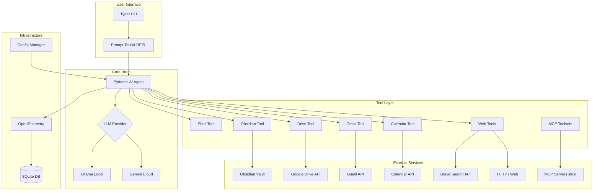
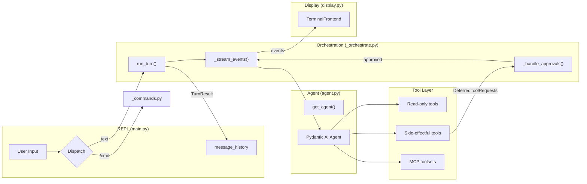

# Co CLI — System Design

## 1. What & How

**Stack:** Python 3.12+, Pydantic AI, Ollama/Gemini, UV

Co is a personal AI assistant CLI — local-first (Ollama) or cloud (Gemini), approval-gated shell execution, OTel tracing to SQLite, human-in-the-loop approval for side effects.



The agent loop is the core orchestration layer. It connects the REPL (user input), the pydantic-ai Agent (LLM + tools), and the terminal display (Rich). Three modules collaborate:

- **`agent.py`** — `get_agent()` factory: model selection, tool registration, system prompt
- **`_orchestrate.py`** — `run_turn()` state machine: streaming, approval chaining, error handling, interrupt patching
- **`main.py`** — REPL: input dispatch, session lifecycle, context history

`CoDeps` (in `deps.py`) is the runtime dependency dataclass injected into every tool via `RunContext[CoDeps]`. `FrontendProtocol` (in `_orchestrate.py`) abstracts all display — `TerminalFrontend` (Rich/prompt-toolkit) and `RecordingFrontend` (tests) implement it.



### Component Docs

| Component | Doc | Summary |
|-----------|-----|---------|
| Personality System | [DESIGN-02-personality.md](DESIGN-02-personality.md) | File-driven roles, 5 traits, structural per-turn injection, reasoning depth override |
| LLM Models | [DESIGN-llm-models.md](DESIGN-llm-models.md) | Gemini/Ollama model selection, inference parameters, Ollama local setup |
| Streaming Event Ordering | [DESIGN-04-streaming-event-ordering.md](DESIGN-04-streaming-event-ordering.md) | First-principles RCA and event-boundary design for robust streaming output |
| Logging & Tracking | [DESIGN-logging-and-tracking.md](DESIGN-logging-and-tracking.md) | SQLite span exporter, WAL concurrency, trace viewers, real-time `co tail` |
| Context Governance | [DESIGN-07-context-governance.md](DESIGN-07-context-governance.md) | History processors, sliding window, summarisation |
| Theming | [DESIGN-08-theming-ascii.md](DESIGN-08-theming-ascii.md) | Light/dark themes, ASCII banner, semantic styles |
| Knowledge System | [DESIGN-14-memory-lifecycle-system.md](DESIGN-14-memory-lifecycle-system.md) | Persistent knowledge and memory across sessions via markdown files. Includes proactive signal detection (preferences, corrections, decisions) and lifecycle management (dedup, consolidation, decay) |
| Tools | [DESIGN-tools.md](DESIGN-tools.md) | Memory, Shell, Obsidian, Google (Drive/Gmail/Calendar), Web (search + fetch) — all native tool implementations |
| MCP Client | [DESIGN-15-mcp-client.md](DESIGN-15-mcp-client.md) | External tool servers via Model Context Protocol (stdio transport, auto-prefixing, approval inheritance) |

---

## 2. Core Logic

### Agent Factory (`get_agent`)

Returns `(agent, model_settings, tool_names)`. Selects LLM model based on provider, registers tools with approval policies, assembles the system prompt.

```
get_agent(all_approval, web_policy, mcp_servers) → (agent, model_settings, tool_names):
    resolve model from settings.llm_provider (gemini or ollama)
    build system_prompt via assemble_prompt(provider, model_name)

    create Agent with:
        model, deps_type=CoDeps, system_prompt, retries=tool_retries
        output_type = [str, DeferredToolRequests]
        history_processors = [truncate_tool_returns, truncate_history_window]

    register side-effectful tools with requires_approval=True
    register read-only tools with requires_approval=all_approval
    register web tools with requires_approval=(policy == "ask")
    register MCP toolsets with per-server approval config
```

| Category | Approval | Notes |
|----------|----------|-------|
| Side-effectful | Always deferred | `run_shell_command`, `create_email_draft`, `save_memory` |
| Read-only | Auto-execute | `all_approval=True` forces deferred (for eval harness) |
| Web tools | Policy-driven | `web_policy.search` / `web_policy.fetch`: `"allow"` or `"ask"` |
| MCP tools | Per-server config | `"auto"` → deferred; `"never"` → trusted |

See [DESIGN-llm-models.md](DESIGN-llm-models.md) for model configuration details.

### CoDeps (Runtime Dependencies)

Flat dataclass injected into every tool via `RunContext[CoDeps]`. Contains runtime resources and scalar config — no `Settings` objects. `main.py:create_deps()` reads `Settings` once and injects values.

| Group | Fields |
|-------|--------|
| **Runtime resources** | `shell` (ShellBackend), `auto_confirm` (session yolo), `session_id` (uuid4), `google_creds` (lazy-resolved) |
| **Tool config** | `obsidian_vault_path`, `google_credentials_path`, `shell_safe_commands`, `shell_max_timeout` (600), `brave_search_api_key`, `web_fetch_allowed_domains`, `web_fetch_blocked_domains`, `web_policy` |
| **Memory config** | `memory_max_count` (200), `memory_dedup_window_days` (7), `memory_dedup_threshold` (85), `memory_decay_strategy` ("summarize"), `memory_decay_percentage` (0.2) |
| **History governance** | `max_history_messages` (40), `tool_output_trim_chars` (2000), `summarization_model` (empty = primary model) |
| **Mutable state** | `drive_page_tokens` (pagination state per query) |

### Multi-Session State Design

| Tier | Scope | Lifetime | Example |
|------|-------|----------|---------|
| **Agent config** | Process | Entire process | Model, system prompt, tool registrations |
| **Session deps** | Session | One REPL loop | `CoDeps`: shell, creds, page tokens |
| **Run state** | Single run | One `run_turn()` | Per-turn counter (if needed) |

**Invariant:** Mutable per-session state belongs in `CoDeps`, never in module globals. One `CoDeps` per chat session — tools accumulate state across turns within a session.

### Chat Session Lifecycle

```
chat_loop():
    agent, model_settings, tool_names = get_agent(web_policy, mcp_servers)
    deps = create_deps()
    frontend = TerminalFrontend()
    message_history = []

    async with agent:                          ← connects MCP servers
        loop:
            user_input = prompt_async()        ← prompt-toolkit + tab completion

            dispatch:
                "exit"/"quit"  → break
                empty/blank    → continue
                "/command"     → dispatch_command(), no LLM
                anything else  → run_turn()

            message_history = turn_result.messages

    finally: deps.shell.cleanup()
```

**MCP fallback:** If the agent context fails (MCP server unavailable), the chat loop recreates the agent without MCP and continues with native tools only.

### Orchestration State Machine (`run_turn`)

Single user turn: streaming → approval chaining → error retry → interrupt recovery. Returns `TurnResult(messages, output, usage, interrupted, streamed_text)`.

```
run_turn(agent, user_input, deps, message_history, ...) → TurnResult:
    turn_limits = UsageLimits(request_limit=max_request_limit)
    turn_usage = None
    current_input = user_input
    backoff_base = 1.0

    retry_loop (up to http_retries):
        try:
            result, streamed = _stream_events(agent, current_input, deps,
                message_history, turn_limits, usage=turn_usage, frontend)
            turn_usage = result.usage()

            while result.output is DeferredToolRequests:
                result, streamed = _handle_approvals(agent, deps, result,
                    model_settings, turn_limits, usage=turn_usage, frontend)
                turn_usage = result.usage()

            if not streamed and output is str:
                frontend.on_final_output(result.output)
            if result.response.finish_reason == "length":
                frontend.on_status("Response may be truncated … Use /continue to extend.")
            return TurnResult(messages=result.all_messages(), ...)

        except ModelHTTPError:
            action, msg, delay = classify_provider_error(e)
            REFLECT  → append error body as ModelRequest to history,
                       set current_input = None, continue
            BACKOFF  → sleep(delay * backoff^attempt), backoff *= 1.5, continue
            ABORT    → return TurnResult(output=None)

        except ModelAPIError:
            backoff retry or ABORT if exhausted

        except (KeyboardInterrupt, CancelledError):
            msgs = result.all_messages() if result else message_history
            return TurnResult(_patch_dangling_tool_calls(msgs), interrupted=True)
```

**Design notes:**

- **Approval `while` loop:** A resumed run may produce another `DeferredToolRequests` when the LLM chains multiple side-effectful calls. Each round needs its own approval cycle
- **Budget sharing:** One `UsageLimits` + accumulating `turn_usage` across streaming, approvals, and retries. Prevents N approval hops from getting N × budget
- **Reflection (400):** Error body injected into history as `ModelRequest`; `current_input` set to `None` so the next `_stream_events` resumes from history, letting the model self-correct
- **Progressive backoff:** Escalates by `backoff_base *= 1.5` per retry, capped at 30s. Applies to both `ModelHTTPError` (429/5xx) and `ModelAPIError` (network/timeout)
- **Safe message extraction:** `result` may be `None` if the exception fired before any result was captured — `result.all_messages() if result else message_history` preserves history
- **Finish reason detection:** `result.response.finish_reason` is the OTel-normalized value from `ModelResponse` (`"stop"`, `"length"`, `"content_filter"`, `"tool_call"`, `"error"`, or `None` when the provider does not report it). `AgentRunResult.response` is a property that iterates `all_messages()` in reverse and returns the last `ModelResponse`. On `"length"` (output token limit hit), `frontend.on_status()` emits a truncation warning; all other values are silent

**Per-turn safety guards** — three mechanisms running independently of each other per turn:

**Doom loop detection** — `detect_safety_issues()` history processor in `_history.py` scans recent `ToolCallPart` entries for consecutive identical calls, hashed as `MD5(tool_name + json.dumps(args, sort_keys=True))`. If the same hash appears `doom_loop_threshold` (default 3) consecutive times, injects a system message: "You are repeating the same tool call. Try a different approach or explain why." The model sees this on its next request. State is processor-local, created fresh per turn — no mutable counters on `CoDeps`. Converges with OpenCode (threshold 3) and Gemini CLI (threshold 5).

**Grace turn on budget exhaustion** — When `UsageLimits(request_limit=max_request_limit)` is exceeded mid-turn, pydantic-ai raises `UsageLimitExceeded`. `run_turn()` catches it and fires one additional `_stream_events()` with `request_limit=1`, injecting: "Turn limit reached. Summarize your progress." This gives the model a chance to produce partial results rather than silently truncating. If the grace turn itself produces tool calls instead of text, it is force-stopped. The user can `/continue` to resume with a fresh budget.

**Shell reflection** — `run_shell_command` raises `ModelRetry` on non-zero exit codes, feeding the error output back to the LLM as a tool result. pydantic-ai's built-in retry mechanism handles re-entry — no orchestration-layer re-entry needed. `detect_safety_issues()` caps consecutive shell errors at `max_reflections` (default 3); on reaching the cap it injects: "Shell reflection limit reached. Ask the user for help or try a fundamentally different approach." (Pattern from Aider's `max_reflections` mechanism.)

### Streaming (`_stream_events`)

Wraps `agent.run_stream_events()`, dispatches events to frontend. Transient state in `_StreamState` (text/thinking buffers, render timestamps) — fresh per call, no globals.

```
_stream_events(agent, input, deps, history, limits, frontend,
               deferred_tool_results=None) → (result, streamed_text):
    state = _StreamState()
    pending_cmds = {}                          ← shell cmd titles by tool_call_id

    try:
        for each event from agent.run_stream_events(...):
            PartStartEvent(TextPart)           → flush thinking, append text
            PartStartEvent(ThinkingPart)       → if verbose: append, else discard
            TextPartDelta                      → flush thinking, accumulate text,
                                                 throttled render at 50ms (20 FPS)
            ThinkingPartDelta                  → if verbose: accumulate + throttle
            FunctionToolCallEvent              → flush all buffers,
                                                 if shell: store cmd in pending_cmds,
                                                 frontend.on_tool_call(name, args)
            FunctionToolResultEvent            → flush all buffers,
                                                 if ToolReturnPart with str content:
                                                   show with cmd from pending_cmds as title
                                                 elif dict with "display" key:
                                                   show structured result
                                                 else: skip
            FinalResultEvent, PartEndEvent     → no-op (rendering continues after)
            AgentRunResultEvent                → capture result

        commit remaining text buffer
    finally: frontend.cleanup()
```

**Key transitions:** Thinking → text is a one-way flush: first text/tool event commits the thinking panel, then thinking buffer resets. `_flush_for_tool_output()` commits both buffers before any tool annotation or result panel, preventing interleaved output.

**API choice:** `run_stream_events()` over `run_stream()` (incompatible with `DeferredToolRequests` output type), `iter()` (3-4x more code), or `run()` + callback (splits display state).

### Deferred Approval (`_handle_approvals`)

Collects approval decisions for all pending tool calls, then resumes the agent.

```
_handle_approvals(agent, deps, result, model_settings, limits, frontend):
    for each call in result.output.approvals:
        parse args (json.loads if string)
        format description as "tool_name(k=v, ...)"

        if deps.auto_confirm → approve
        elif run_shell_command AND is_safe_command(cmd, shell_safe_commands) → approve
        else:
            choice = frontend.prompt_approval(desc)
            "y" → approve
            "a" → set deps.auto_confirm = True, approve
            "n" → ToolDenied("User denied this action")

    return _stream_events(agent, user_input=None,
        message_history=result.all_messages(),
        deferred_tool_results=approvals, ...)
```

**Safe-command gate:** Commands matching the safe-prefix list are auto-approved. **Denial:** LLM sees `ToolDenied` and can suggest alternatives. **Session yolo:** `"a"` sets `auto_confirm = True` for all subsequent calls in the session.

### FrontendProtocol

`@runtime_checkable` protocol decoupling orchestration from terminal rendering.

| Method | Purpose |
|--------|---------|
| `on_text_delta(accumulated)` | Incremental Markdown render |
| `on_text_commit(final)` | Final render + tear down Live |
| `on_thinking_delta(accumulated)` | Thinking panel (verbose) |
| `on_thinking_commit(final)` | Final thinking panel |
| `on_tool_call(name, args_display)` | Dim annotation |
| `on_tool_result(title, content)` | Panel for result |
| `on_status(message)` | Status messages |
| `on_final_output(text)` | Fallback Markdown render |
| `prompt_approval(description) → str` | y/n/a prompt |
| `cleanup()` | Exception teardown |

Implementations: `TerminalFrontend` (Rich/prompt-toolkit, in `display.py`), `RecordingFrontend` (tests).

### Slash Commands (`_commands.py`)

Local REPL commands — bypass the LLM, execute instantly. Explicit `dict` registry, no decorators. Handler returns `None` (display-only) or `list` (new history to rebind).

| Command | Effect |
|---------|--------|
| `/help` | Print table of all commands |
| `/clear` | Empty conversation history |
| `/status` | System health check |
| `/tools` | List registered tool names |
| `/history` | Show turn/message totals |
| `/compact` | LLM-summarise history (see [DESIGN-07](DESIGN-07-context-governance.md)) |
| `/yolo` | Toggle `deps.auto_confirm` |
| `/model` | Show/switch current model (Ollama only) |
| `/forget <id>` | Delete memory by ID |

### Error Handling

**Provider errors** — two exception types in `run_turn()`:

| Exception | Status | Action | Behavior |
|-----------|--------|--------|----------|
| `ModelHTTPError` | 400 | `REFLECT` | Inject error body into history, `current_input=None`, re-run |
| `ModelHTTPError` | 401, 403, 404 | `ABORT` | Display error, end turn |
| `ModelHTTPError` | 429 | `BACKOFF_RETRY` | Parse `Retry-After` (default 3s), progressive backoff |
| `ModelHTTPError` | 5xx | `BACKOFF_RETRY` | 2s base, progressive backoff |
| `ModelAPIError` | Network/timeout | `BACKOFF_RETRY` | 2s base, progressive backoff |

All retries capped at `model_http_retries` (default 2). Backoff capped at 30s, escalation factor 1.5× per retry. Classified via `classify_provider_error()` in `_provider_errors.py`.

**Tool errors** — classified inside tool functions via `handle_tool_error()` (`tools/_errors.py`):

| Kind | Behavior | Example |
|------|----------|---------|
| `TERMINAL` | Return error dict — model sees it, picks alternative | Auth failure, API not enabled |
| `TRANSIENT` | `ModelRetry` — model retries the call | Rate limit (429), server error (5xx) |
| `MISUSE` | `ModelRetry` with hint — model corrects parameters | Bad resource ID (404) |

### Interrupt Handling

**Dangling tool call patching:** On `KeyboardInterrupt` / `CancelledError`, `_patch_dangling_tool_calls()` scans *all* `ModelResponse` messages for `ToolCallPart` entries without a matching `ToolReturnPart`, then appends a single synthetic `ModelRequest` with `ToolReturnPart`(s) carrying "Interrupted by user." Full scan handles interrupts during multi-tool approval loops where earlier responses may have unmatched calls.

**Abort marker:** After patching, a second synthetic `ModelRequest` with `UserPromptPart` is appended to history (not displayed to user): "The user interrupted the previous turn. Some actions may be incomplete. Verify current state before continuing." This ensures the model on the next turn knows the previous turn was incomplete and does not repeat work or skip verification. (Pattern from Codex's `<turn_aborted>` marker insertion.)

**Signal handling:** `run_turn()` catches both `KeyboardInterrupt` and `CancelledError` (Python 3.11+ asyncio delivers the latter in async code). For the synchronous approval prompt, `TerminalFrontend.prompt_approval()` temporarily restores Python's default SIGINT handler during `Prompt.ask()`, then restores asyncio's handler in `finally`.

| Context | Ctrl+C Result |
|---------|---------------|
| During `run_turn()` | Patches dangling tool calls, returns to prompt |
| During approval prompt | Cancels approval, returns to prompt |
| At prompt (1st) | "Press Ctrl+C again to exit" |
| At prompt (2nd within 2s) | Exits session |
| At prompt (2nd after 2s) | Treated as new 1st press |
| Anywhere (Ctrl+D) | Exits immediately |

### System Prompt Assembly

Two-part structure — static base assembled once, per-turn layers appended before every model request.

**Static** (`assemble_prompt(provider, model_name)` in `prompts/__init__.py`):

1. **Instructions** — bootstrap identity from `prompts/instructions.md`
2. **Behavioral rules** — 5 rules from `prompts/rules/`
3. **Model counter-steering** — quirk corrections from `prompts/quirks/{provider}/{model}.md` (when file exists)

**Per-turn** (`@agent.system_prompt` functions in `agent.py`):

4. **Personality** — `## Soul` block via `compose_personality(role, depth)` (when role is set)
5. **Current date** — always
6. **Shell guidance** — always
7. **Project instructions** — `.co-cli/instructions.md` (when file exists)
8. **Personality memories** — `## Learned Context` (when role is set)

See [DESIGN-14-memory-lifecycle-system.md](DESIGN-14-memory-lifecycle-system.md) for knowledge loading details.

### Eval Framework

`scripts/eval_tool_calling.py` uses `get_agent(all_approval=True)` so every tool call returns `DeferredToolRequests` without executing. Scores: `tool_selection`, `arg_extraction`, `refusal`, `error_recovery`. Golden cases in `evals/tool_calling.jsonl` (~26 lines). Auto-discovers `evals/baseline-*.json` for model comparison; degradation beyond `--max-degradation` (default 10pp) fails the run.

### CLI Commands & REPL

| Command | Description |
|---------|-------------|
| `co chat` | Interactive REPL (`--verbose` streams thinking tokens) |
| `co status` | System health check |
| `co tail` | Real-time span viewer |
| `co logs` | Telemetry dashboard (Datasette) |
| `co traces` | Visual span tree (HTML) |

| REPL Feature | Detail |
|--------------|--------|
| History | `~/.local/share/co-cli/history.txt` |
| Spinner | "Co is thinking..." before streaming starts |
| Streaming | Rich `Live` + `Markdown` at ~20 FPS |
| Fallback | Final result rendered as Markdown if streaming produced no text |
| Tab completion | `WordCompleter` for `/command` names |

---

### Documentation Standards

All DESIGN docs use pseudocode to explain processing logic — never paste source code. This keeps docs readable, prevents staleness when code changes, and forces focus on intent over syntax. Each component doc follows the 4-section template: What & How, Core Logic, Config, Files.

### Configuration

XDG-compliant configuration with project-level overrides. Resolution order (highest wins):

1. Environment variables (`fill_from_env` model validator)
2. `.co-cli/settings.json` in cwd (project — shallow `|=` merge)
3. `~/.config/co-cli/settings.json` (user)
4. Default values (Pydantic `Field(default=...)`)

Project config is checked at `cwd/.co-cli/settings.json` only — no upward directory walk. `save()` always writes to the user-level file.

MCP servers are configured in `settings.json` under `mcp_servers` (dict of name → `MCPServerConfig`) or via `CO_CLI_MCP_SERVERS` env var (JSON). Each server specifies `command`, `args`, `timeout`, `env`, `approval` ("auto"|"never"), and optional `prefix`.

### Tool Conventions

Native tools use `agent.tool()` with `RunContext[CoDeps]`. Zero `tool_plain()` remaining. External tools are provided by MCP servers configured in `settings.json` and connected as pydantic-ai `MCPServerStdio` toolsets.

**Return convention:** Tools returning data for the user return `dict[str, Any]` with a `display` field (pre-formatted string with URLs baked in) and metadata fields (e.g. `count`, `has_more`). The system prompt instructs the LLM to show `display` verbatim. `_stream_events()` renders tool returns inline as events arrive via `frontend.on_tool_result()`.

| Tool | Return type | Has `display`? | Metadata |
|------|------------|----------------|----------|
| `search_drive_files` | `dict` | Yes | `page`, `has_more` |
| `read_drive_file` | `str` | No | — |
| `list_emails` / `search_emails` | `dict` | Yes | `count` |
| `create_email_draft` | `str` | No | — |
| `list_calendar_events` / `search_calendar_events` | `dict` | Yes | `count` |
| `search_notes` | `dict` | Yes | `count`, `has_more` |
| `list_notes` | `dict` | Yes | `count` |
| `read_note` | `str` | No | — |
| `run_shell_command` | `str` | No | — |
| `web_search` | `dict` | Yes | `results`, `count` |
| `web_fetch` | `dict` | Yes | `url`, `content_type`, `truncated` |

**Naming convention:** `verb_noun` with converged verb set: `read`, `list`, `search`, `create`, `send`, `run`. `web_search` and `web_fetch` use `web_` prefix to namespace web tools.

**Error classification:** Tool errors are classified into `ToolErrorKind` (TERMINAL, TRANSIENT, MISUSE) via `classify_google_error()` and dispatched through `handle_tool_error()`. TERMINAL returns `{"display": ..., "error": True}` (model picks alternative). TRANSIENT/MISUSE raise `ModelRetry` (model self-corrects). See `tools/_errors.py`.

**ModelRetry convention:** `ModelRetry` = "you called this wrong, fix your parameters" (LLM can self-correct). Empty result = "query was fine, nothing matched" (return `{"count": 0}`). **Terminal config errors** (missing credentials, API not enabled) use `terminal_error()` which returns `{"display": "...", "error": True}` instead of `ModelRetry` — this stops the retry loop and lets the model route to an alternative tool.

**Retry budget:** Agent-level `retries=settings.tool_retries` (default 3). All tools inherit the same budget.

**Provider error handling:** `run_turn()` classifies provider errors via `classify_provider_error()`: HTTP 400 → reflection (inject error, re-run), 429/5xx/network → exponential backoff retry, 401/403/404 → abort. All retries capped at `settings.model_http_retries` (default 2).

**Request limit:** `UsageLimits(request_limit=settings.max_request_limit)` (default 25) caps LLM round-trips per user turn.

### Approval Flow

Side-effectful tools are registered with `requires_approval=True`. The chat loop prompts `[y/n/a(yolo)]` via `DeferredToolRequests`. Tools contain only business logic — no UI imports. See [DESIGN-tools.md](DESIGN-tools.md) for safe-command auto-approval.

| Tool | Approval | Rationale |
|------|----------|-----------|
| `run_shell_command` | Yes | Arbitrary code execution. Safe-prefix commands auto-approved. |
| `create_email_draft` | Yes | Creates Gmail draft on user's behalf |
| MCP tools (approval=auto) | Yes | External tools default to requiring approval |
| MCP tools (approval=never) | No | Explicitly trusted by user config |
| All other native tools | No | Read-only operations |

### Security Model

Four defense layers:

1. **Configuration** — Secrets in `settings.json` or env vars, no hardcoded keys, env vars override file values
2. **Confirmation** — Human-in-the-loop approval for shell commands and email drafts (see approval flow above)
3. **Environment sanitization** — Allowlist-only env vars, forced safe pagers, process-group cleanup on timeout (see [DESIGN-tools.md](DESIGN-tools.md))
4. **Input validation** — Path traversal protection in Obsidian tools, API scoping in Google tools

### Concurrency

Single-threaded, synchronous execution loop. Uses `await run_turn()` inside the async loop — query N must complete before query N+1 begins. This prevents conversation history forking and avoids overloading Ollama (can't handle parallel inference on consumer hardware).

### XDG Directory Structure

```
~/.config/co-cli/
└── settings.json          # User configuration

~/.local/share/co-cli/
├── co-cli.db              # OpenTelemetry traces (SQLite)
└── history.txt            # REPL command history

<project-root>/
└── .co-cli/
    └── settings.json      # Project configuration (overrides user)
```

### Modules

| Module | Purpose |
|--------|---------|
| `main.py` | CLI entry point, chat loop, OTel setup |
| `_orchestrate.py` | `FrontendProtocol`, `TurnResult`, `run_turn()`, `_stream_events()`, `_handle_approvals()` |
| `_provider_errors.py` | `ProviderErrorAction`, `classify_provider_error()` — chat-loop error classification |
| `agent.py` | `get_agent()` factory — model selection, tool registration, system prompt |
| `deps.py` | `CoDeps` dataclass — runtime dependencies injected via `RunContext` |
| `config.py` | `Settings` + `MCPServerConfig` (Pydantic BaseModel) from `settings.json` + env vars |
| `shell_backend.py` | `ShellBackend` — approval-gated subprocess execution |
| `_telemetry.py` | `SQLiteSpanExporter` — OTel spans to SQLite with WAL mode |
| `display.py` | Themed Rich Console, semantic styles, display helpers, `TerminalFrontend` |
| `status.py` | `StatusInfo` dataclass + `get_status()` + `render_status_table()` |
| `_banner.py` | ASCII art welcome banner |
| `_commands.py` | Slash command registry, handlers, `dispatch()` |
| `_history.py` | History processors and `summarize_messages()` |
| `_approval.py` | Shell safe-command classification |
| `_tail.py` | Real-time span viewer (`co tail`) |
| `_trace_viewer.py` | Static HTML trace viewer (`co traces`) |
| `tools/_google_auth.py` | Google credential resolution (ensure/get/cached) |
| `tools/_errors.py` | `ToolErrorKind`, `classify_google_error()`, `handle_tool_error()`, `terminal_error()` |
| `tools/shell.py` | `run_shell_command` — approval-gated shell execution |
| `tools/obsidian.py` | `search_notes`, `list_notes`, `read_note` |
| `tools/google_drive.py` | `search_drive_files`, `read_drive_file` |
| `tools/google_gmail.py` | `list_emails`, `search_emails`, `create_email_draft` |
| `tools/google_calendar.py` | `list_calendar_events`, `search_calendar_events` |
| `tools/web.py` | `web_search`, `web_fetch` — Brave Search API + URL fetch |
| `scripts/eval_tool_calling.py` | Eval framework — golden case scoring, model tagging, multi-baseline comparison |

---

## 3. Config

Settings relevant to the agent loop. Full settings inventory in `co_cli/config.py`.

| Setting | Env Var | Default | Purpose |
|---------|---------|---------|---------|
| `llm_provider` | `LLM_PROVIDER` | `"gemini"` | Provider selection (`gemini` or `ollama`) |
| `personality` | `CO_CLI_PERSONALITY` | `"finch"` | Personality role name (per-turn injection) |
| `tool_retries` | `CO_CLI_TOOL_RETRIES` | `3` | Agent-level retry budget for all tools |
| `max_request_limit` | `CO_CLI_MAX_REQUEST_LIMIT` | `25` | Caps LLM round-trips per user turn |
| `model_http_retries` | `CO_CLI_MODEL_HTTP_RETRIES` | `2` | Max provider error retries per turn |
| `max_history_messages` | `CO_CLI_MAX_HISTORY_MESSAGES` | `40` | Sliding window threshold |
| `tool_output_trim_chars` | `CO_CLI_TOOL_OUTPUT_TRIM_CHARS` | `2000` | Truncate old tool outputs |
| `summarization_model` | `CO_CLI_SUMMARIZATION_MODEL` | `""` | LLM for summarization (or use agent model) |
| `memory_max_count` | `CO_CLI_MEMORY_MAX_COUNT` | `200` | Max stored memories |
| `mcp_servers` | `CO_CLI_MCP_SERVERS` | 3 defaults | MCP server configurations (JSON) |

---

## 4. Files

| File | Purpose |
|------|---------|
| `co_cli/agent.py` | `get_agent()` factory — model selection, tool registration, MCP wiring |
| `co_cli/deps.py` | `CoDeps` dataclass — runtime dependencies injected via `RunContext` |
| `co_cli/config.py` | `Settings` + `MCPServerConfig` — Pydantic config from `settings.json` + env vars |
| `co_cli/main.py` | CLI entry point, `chat_loop()`, `create_deps()`, OTel setup |
| `co_cli/_orchestrate.py` | `FrontendProtocol`, `TurnResult`, `run_turn()`, `_stream_events()`, `_handle_approvals()` |
| `co_cli/_provider_errors.py` | `ProviderErrorAction`, `classify_provider_error()`, `_parse_retry_after()` |
| `co_cli/display.py` | Themed Rich Console, semantic styles, `TerminalFrontend` |
| `co_cli/_commands.py` | Slash command registry, handlers, `dispatch()` |
| `co_cli/_approval.py` | Shell safe-command classification (`_is_safe_command`) |
| `co_cli/_history.py` | `truncate_tool_returns`, `truncate_history_window`, `summarize_messages` |
| `co_cli/prompts/__init__.py` | `assemble_prompt()` — static prompt: instructions, rules, counter-steering |
| `co_cli/tools/_errors.py` | `ToolErrorKind`, `classify_google_error()`, `handle_tool_error()`, `terminal_error()` |
| `scripts/eval_tool_calling.py` | Eval runner — golden case scoring, model tagging, baseline comparison |

### Dependencies

#### Runtime

| Package | Version | Purpose |
|---------|---------|---------|
| `pydantic-ai` | ^1.52.0 | LLM orchestration |
| `typer` | ^0.21.1 | CLI framework |
| `rich` | ^14.3.2 | Terminal UI |
| `prompt-toolkit` | ^3.0.52 | Interactive REPL |
| `google-genai` | ^1.61.0 | Gemini API |
| `google-api-python-client` | ^2.189.0 | Drive/Gmail/Calendar |
| `google-auth-httplib2` | ^0.3.0 | Google auth transport adapter |
| `google-auth-oauthlib` | ^1.2.4 | OAuth2 |
| `opentelemetry-sdk` | ^1.39.1 | Tracing |
| `httpx` | ^0.28.1 | HTTP client (web tools) |
| `html2text` | ^2025.4.15 | HTML→markdown conversion (web_fetch) |
| `datasette` | ^0.65.2 | Telemetry dashboard |
| `datasette-pretty-json` | ^0.3 | Datasette JSON rendering plugin |

#### Development

| Package | Version | Purpose |
|---------|---------|---------|
| `pytest` | ^9.0.2 | Testing framework |
| `pytest-asyncio` | ^1.3.0 | Async test support |
