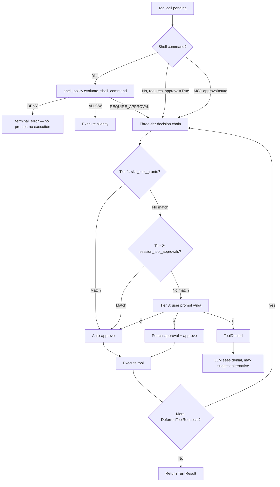

# Flow: Approval

Canonical description of the approval flow — when it triggers, how decisions are made, and how the agent loop resumes after user consent.



## Entry Conditions

Approval flow activates on any agent turn where at least one tool call is either:

- **Shell command** that does not match an ALLOW prefix and is not already in the cross-session persistent approvals list — `run_shell_command` raises `ApprovalRequired` internally.
- **Any other tool** registered with `requires_approval=True` — pydantic-ai defers it automatically before the tool body executes.
- **MCP tool** on a server configured with `approval="auto"` — wrapped in `ApprovalRequiredToolset`, deferred on every call.

Required state:
- `CoDeps` is fully initialized (deps injected into agent).
- `deps.session.session_tool_approvals` (set) and `deps.session.skill_tool_grants` (set) are populated for the current turn.
- `deps.config.exec_approvals_path` is resolvable (`.co-cli/exec-approvals.json` may not yet exist — first-write is lazy).

## Shell-Specific Inline Policy Path

`run_shell_command` enforces a three-tier internal policy **before** any deferral. These tiers run synchronously inside the tool body — they never surface as `DeferredToolRequests`.

```text
run_shell_command(ctx, cmd, timeout):

  1. Tier 1 — DENY  (evaluate_shell_command via _shell_policy.py)
       blocks: control characters, heredoc (<<), env-injection VAR=$(...),
               absolute-path destruction (rm -rf /~)
       result: return terminal_error immediately
               → model sees error dict, no approval prompt, no execution

  2. Tier 2 — ALLOW  (_is_safe_command in _approval.py)
       rejects: shell chaining operators (; & | > < ` $( \n)
       then prefix-matches against ctx.deps.config.shell_safe_commands (longest prefix first)
       result: fall through to execution silently

  3. Tier 3 — Persistent cross-session approvals  (_tool_approvals.py)
       is_shell_command_persistently_approved(cmd, deps)  ← fnmatch via find_approved + update_last_used
       if approved → fall through to execution
       if not approved AND ctx.tool_call_approved → fall through to execution
       if not approved AND NOT ctx.tool_call_approved → raise ApprovalRequired(metadata={"cmd": cmd})
```

Pattern derivation: `derive_pattern(cmd)` collects the first three consecutive non-flag tokens, then appends ` *`. Example: `git commit -m "msg"` → `git commit *`. Bare `"*"` is never stored as a pattern.

Note: when the user selects "a" for a shell command, the approval prompt displays the derived fnmatch pattern (e.g. `[always → will remember: git commit *]`) before the user answers, so the grant is informed.

DENY and ALLOW decisions are made entirely within the tool. `_collect_deferred_tool_approvals()` never sees shell commands that were denied or auto-allowed — only commands that reach `ApprovalRequired`.

## Deferred Tool Request Path

When the agent run returns a `DeferredToolRequests` output, `run_turn()` enters an approval loop:

```text
run_turn(agent, deps, user_input, ...):
    result = _stream_events(agent, user_input, ...)

    while result.output is DeferredToolRequests:
        decisions = await _collect_deferred_tool_approvals(result, deps, frontend)
        result, _ = await _stream_events(
            agent,
            user_input=None,
            message_history=result.all_messages(),
            deferred_tool_results=decisions,
            usage_limits=same_turn_limits,    ← shared budget, not reset
            usage=accumulated_usage,
        )

    return TurnResult from result
```

Each iteration of the while loop may itself return more `DeferredToolRequests` if the resumed run produces additional tool calls requiring approval. The loop terminates when the agent produces a non-deferred result (text completion, tool result, or error).

## Three-Tier Decision Chain

`_collect_deferred_tool_approvals()` iterates over each pending tool call in `result.output.approvals` and resolves a decision. The tiers run in order; the first match short-circuits.

```text
_collect_deferred_tool_approvals(result, deps, frontend) -> DeferredToolResults:
    approvals = DeferredToolResults()

    for each call in result.output.approvals:
        args = decode_tool_args(call.args)
        desc = format_tool_call_description(call.tool_name, args)
        approved = False
        remember = False

        # Tier 1: Skill allowed-tools grant
        if _check_skill_grant(call.tool_name, deps):
            approved = True

        # Tier 2: Per-session auto-approve
        elif is_session_auto_approved(call.tool_name, deps):
            approved = True

        # Tier 3: User prompt
        if not approved:
            choice = frontend.prompt_approval(desc)   ← "[y/n/a]"
            if choice == "y":
                approved = True
            elif choice == "a":
                approved = True
                remember = True   ← remember_tool_approval called via record_approval_choice
            elif choice == "n":
                record_approval_choice(approvals, approved=False, ...)
                continue

        record_approval_choice(approvals, approved=approved, remember=remember, ...)

    return approvals  ← DeferredToolResults; caller passes to _stream_events
```

Note: The inline shell policy (DENY/ALLOW/persistent) lives inside `run_shell_command` before any deferral. The three-tier decision chain (Tiers 1–3) lives in `_collect_deferred_tool_approvals()`. Shell safety policy is never bypassed by orchestration-level grants.

## "a" Persistence Semantics by Tool Class

| Tool class | "a" effect | Scope | Storage |
|------------|-----------|-------|---------|
| `run_shell_command` | `derive_pattern(cmd)` appended to exec-approvals | Cross-session | `.co-cli/exec-approvals.json` |
| All other tools | `call.tool_name` added to `deps.session.session_tool_approvals` | Session-only (in-memory) | `CoDeps.session.session_tool_approvals` set |

Shell patterns use fnmatch: `git commit *` matches any `git commit` invocation regardless of trailing arguments. Patterns are never deleted automatically — use `/approvals clear [id]` at the REPL to manage them.

## Approval Re-Entry Loop

The `while result.output is DeferredToolRequests` loop in `run_turn()` supports multi-hop approval chains. A single user turn may require multiple rounds of approval if:

- The agent calls several tools requiring approval in parallel.
- After one batch is approved and executed, the agent calls another tool requiring approval.

Each hop resumes the stream with the decisions from the previous hop. The loop is bounded by the agent's own tool-call behavior, not by a hard iteration cap.

## Budget Sharing Across Approval Hops

Token usage is accumulated across the initial run and all approval re-entries within a single turn:

```text
initial run:    usage_limits passed in, accumulated_usage starts at 0
first re-entry: usage_limits unchanged, accumulated_usage += usage from initial run
second re-entry: accumulated_usage += usage from first re-entry
...
```

No budget reset occurs between approval hops. If the total usage across all hops hits the turn limit, the run fails with a budget-exceeded error. This prevents approval loops from becoming a budget bypass vector.

## MCP Approval Inheritance

MCP tools use the same `DeferredToolRequests` pipeline — no MCP-specific approval logic exists.

```text
Per-server config (settings.json):
    approval = "auto"   → server wrapped in ApprovalRequiredToolset
                          every tool call from this server becomes a DeferredToolRequest
                          flows through _collect_deferred_tool_approvals() Tiers 1–3 like any native tool

    approval = "never"  → server passed unwrapped
                          all tool calls from this server execute without prompting
```

`_is_safe_command()` does not apply to MCP tools — shell safe-prefix matching is shell-only.

MCP tools are identified by their prefixed name (e.g. `github_create_issue`). If a skill's `allowed-tools` frontmatter lists the prefixed MCP tool name, Tier 1 grants auto-approval for that turn.

## Failure Paths

| Condition | Outcome |
|-----------|---------|
| User responds "n" to any prompt | `ToolDenied` exception raised; agent receives denial, may attempt alternative |
| DENY policy match in shell tool | `terminal_error` dict returned immediately; no prompt shown |
| `ApprovalRequired` raised but no chat loop present | Unhandled exception (approval flow is chat-loop only) |
| Budget exhausted mid-approval loop | `UsageLimitExceeded` raised; turn fails with error outcome |
| MCP server unreachable during approval resume | Pydantic-ai error; maps to `ToolErrorKind.TRANSIENT` or `TERMINAL` |

## Recovery and Fallback

- **Denial recovery:** The model receives a `ToolDenied` error result and may suggest an alternative approach or terminate the turn gracefully.
- **Persistent approval management:** `/approvals list` shows stored shell patterns; `/approvals clear [id]` removes them. No session-level auto-approve list is exposed — it resets on REPL exit.

## Owning Code

| File | Role |
|------|------|
| `co_cli/_orchestrate.py` | `run_turn()` approval loop, `_collect_deferred_tool_approvals()` three-tier chain |
| `co_cli/tools/shell.py` | `run_shell_command()` — inline DENY/ALLOW/persistent policy, `ApprovalRequired` raise |
| `co_cli/_shell_policy.py` | `evaluate_shell_command()` — DENY / ALLOW / REQUIRE_APPROVAL classification |
| `co_cli/_approval.py` | `_is_safe_command()` — safe-prefix classification |
| `co_cli/_exec_approvals.py` | `derive_pattern()`, `find_approved()`, `add_approval()`, `update_last_used()` — persistent shell approvals |
| `co_cli/_tool_approvals.py` | `is_shell_command_persistently_approved()`, `remember_tool_approval()`, `record_approval_choice()`, `format_tool_call_description()`, `approval_remember_hint()` — approval helpers centralized here |
| `co_cli/_commands.py` | `dispatch()` — sets `deps.session.skill_tool_grants` before LLM turn (Tier 1) |
| `co_cli/deps.py` | `CoSessionState.session_tool_approvals`, `CoSessionState.skill_tool_grants`; `CoConfig.exec_approvals_path` |
| `co_cli/agent.py` | Tool registration with `requires_approval` flags; MCP server approval wrapping |

## See Also

- [DESIGN-prompt-design.md](DESIGN-prompt-design.md) — Approval Re-Entry section: pseudocode and design invariants
- [DESIGN-core.md](DESIGN-core.md) — §3.5 Approval Boundary: trust tier table, approval classification
- [DESIGN-tools.md](DESIGN-tools.md) — Approval table and tool registration conventions
- [DESIGN-tools-execution.md](DESIGN-tools-execution.md) — Shell policy tiers and exec-approvals lifecycle
- [DESIGN-skills.md](DESIGN-skills.md) — `allowed-tools` frontmatter and skill dispatch
- [DESIGN-mcp-client.md](DESIGN-mcp-client.md) — MCP approval inheritance and `ApprovalRequiredToolset`
