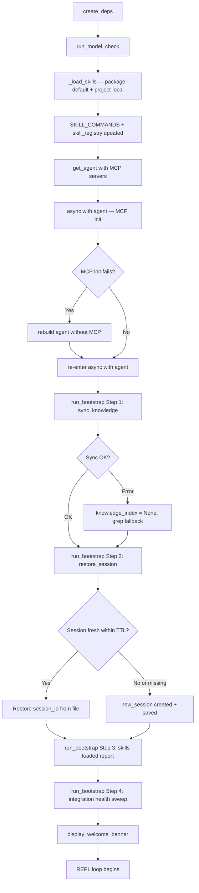

# Flow: Bootstrap

Canonical startup flow for co-cli — covers the full wakeup sequence from settings loading through `display_welcome_banner()`. The startup sequence includes settings loading, deps initialization (`create_deps()`), a model dependency check (pre-agent fail-fast gate), skills load, agent creation, MCP init, and the four-step bootstrap initialization sweep (knowledge sync, session restore, skills report, integration health).



## Settings Loading and Deps Initialization

### Settings Loading (`config.py`)

`Settings` is a Pydantic `BaseModel` built by `load_config()` and accessed via a lazy module-level singleton (`settings`). First access triggers `_ensure_dirs()` (creates `~/.config/co-cli/` and `~/.local/share/co-cli/` if missing), then `load_config()`.

**Three-layer merge** (later layers win):

```text
Layer 1: ~/.config/co-cli/settings.json          ← user config (base)
Layer 2: <cwd>/.co-cli/settings.json             ← project config (deep merge via _deep_merge_settings)
Layer 3: env vars (fill_from_env model_validator) ← highest precedence
```

`fill_from_env` runs as a `model_validator(mode='before')` — env vars are injected directly into the raw dict before Pydantic validation, so they override both config files.

**`role_models` defaults** are injected by `fill_from_env` for any role not explicitly set in config or env vars. Merge order: provider defaults supply missing roles → explicit config overrides defaults → env var overrides override config.
- `gemini`: reasoning chain only → `gemini-3-flash-preview`; all other roles empty (no gemini defaults for optional roles)
- `ollama`: all five roles populated with hardcoded defaults (`DEFAULT_OLLAMA_*` constants in `config.py`)

The `reasoning` role is validated post-construction: missing or empty → `ValueError` raised at startup.

**Singleton access pattern:**

```text
from co_cli.config import settings   ← lazy __getattr__ calls get_settings() on first access
                                        subsequent accesses return the cached _settings instance
```

`settings` is never re-created during a session. Mutations during startup (e.g. `settings.theme = theme` from CLI) write directly to the singleton.

---

### Deps Initialization (`create_deps()` in `main.py`)

`create_deps()` converts the `Settings` singleton into four grouped dataclasses (`CoServices`, `CoConfig`, `CoSessionState`, `CoRuntimeState`) assembled into `CoDeps`. No network I/O — all work is local filesystem and in-memory.

```text
create_deps():

    session_id = uuid4().hex

    vault_path = Path(settings.obsidian_vault_path) if set else None

    # Knowledge backend: adaptive degradation
    if configured "hybrid":
        try hybrid init → on failure try fts5 → on failure use grep (knowledge_index = None)
    if configured "fts5":
        try fts5 init → on failure use grep
    if configured "grep":
        use grep (knowledge_index = None)

    resolved_knowledge_backend = actual backend used (may differ from configured)

    personality_critique = load_soul_critique(settings.personality)

    exec_approvals_path = Path.cwd() / ".co-cli/exec-approvals.json"
    _prune_stale_approvals(exec_approvals_path, max_age_days=90)  ← side effect at session start

    memory_dir  = Path.cwd() / ".co-cli/memory"
    library_dir = Path(settings.library_path) if set else DATA_DIR / "library"

    services = CoServices(
        shell=ShellBackend(),
        knowledge_index=KnowledgeIndex instance or None,
        task_runner=None,   ← injected later in chat_loop after model check passes
    )

    config = dataclasses.replace(
        CoConfig.from_settings(settings),             ← canonical factory; copies all Settings fields
        session_id=session_id,
        exec_approvals_path=exec_approvals_path,
        memory_dir=memory_dir,
        library_dir=library_dir,
        skills_dir=Path.cwd() / ".co-cli/skills",
        personality_critique=personality_critique,
        knowledge_search_backend=resolved_knowledge_backend,  ← may differ from settings value
        mcp_count=len(settings.mcp_servers),
    )

    services.model_registry = ModelRegistry.from_config(config)  ← built here, inside create_deps()

    runtime = CoRuntimeState(
        opening_ctx_state=OpeningContextState(),
        safety_state=SafetyState(),
    )

    return CoDeps(services=services, config=config, runtime=runtime)
    # session=CoSessionState() is default-constructed (empty approvals, todos, etc.)
```

**Key transformation:** `settings.knowledge_search_backend` is the *configured* backend; `config.knowledge_search_backend` reflects the *resolved* backend after adaptive degradation. Tools always read from `ctx.deps.config.knowledge_search_backend`, never from `settings`.

### `CoDeps` Group Semantics

| Group | Type | Lifetime | Sub-agent inheritance |
|-------|------|----------|-----------------------|
| `services` | `CoServices` | Session | Shared by reference (`ShellBackend`, `KnowledgeIndex`, `TaskRunner` are stateless/thread-safe) |
| `config` | `CoConfig` | Session (read-only after bootstrap mutations) | Shared by reference |
| `session` | `CoSessionState` | Turn-scoped for sub-agents | Fresh `CoSessionState()` — sub-agents do not inherit approvals, creds, todos, or skill grants |
| `runtime` | `CoRuntimeState` | Turn-scoped | Fresh `CoRuntimeState()` — sub-agents do not inherit compaction cache or turn usage |

`make_subagent_deps(base)` in `deps.py` enforces this: shares `services` and `config` by reference, resets `session` and `runtime`.

The **session** group holds tool-visible mutable state: `google_creds`, `session_tool_approvals`, `skill_tool_grants`, `drive_page_tokens`, `session_todos`, `skill_registry`.

The **runtime** group holds orchestration-layer transient state: `precomputed_compaction`, `turn_usage`, `opening_ctx_state`, `safety_state`. Tools should not normally access runtime fields.

---

## Model Dependency Check

`run_model_check()` runs after `create_deps()` and before `get_agent()`. It is a blocking gate: a hard error raises `RuntimeError` and the session never starts; warnings are advisory and startup continues.

### Check sequence

```text
run_model_check(deps, frontend):
    provider_result = _check_llm_provider(...)
    if provider_result.status == "error":
        raise RuntimeError(provider_result.message)
    if provider_result.status == "warning":
        frontend.on_status(provider_result.message)

    model_result = _check_model_availability(...)
    if model_result.status == "error":
        raise RuntimeError(model_result.message)
    if model_result.status == "warning":
        frontend.on_status(model_result.message)
    if model_result.role_models is not None:
        deps.config.role_models = model_result.role_models   ← mutation applied here
```

**Check 1 — LLM provider** (`_check_llm_provider`): verifies that the configured provider has usable credentials. Gemini with no API key → hard error. Ollama unreachable → warning. Non-Gemini without Gemini key → warning.

**Check 2 — Model availability** (`_check_model_availability`): Ollama-only probe. Hits `/api/tags`, inspects installed models, prunes the reasoning chain to the first available model. No installed reasoning model → hard error. Chain advanced → warning + mutation.

### Hard vs soft failure

| Condition | Severity | Behavior |
|-----------|----------|----------|
| Gemini provider, key absent | Hard error | RuntimeError raised; session never starts |
| Reasoning chain fully unavailable (Ollama) | Hard error | RuntimeError raised; session never starts |
| Ollama unreachable (either check) | Warning | Status line shown; startup continues |
| Optional chain fully unavailable (Ollama) | Warning | Role disabled (`[]`); startup continues |

### PreflightResult return type

Both check functions return `PreflightResult`:

```text
PreflightResult:
    ok: bool
    status: str          "ok" | "warning" | "error"
    message: str
    role_models: dict[str, list[ModelEntry]] | None
                         set only by _check_model_availability when chains are pruned
                         None means: no mutation needed
```

### Chain pruning behavior (Ollama)

| Condition | Status | `role_models` in result |
|-----------|--------|------------------------|
| Non-Ollama provider | `ok` | `None` |
| Ollama unreachable | `warning` | `None` |
| No installed model for reasoning chain | `error` | `None` |
| One or more chains advanced | `warning` | Updated dict |
| All models present | `ok` | `None` |

When `_check_model_availability` returns `role_models`, `run_model_check()` writes it to `deps.config.role_models` before `get_agent()` is called. The pruned chain is what gets used — unavailable models are never passed to the agent.

### Extension model

New checks are added to `_model_check.py` only:
- Add a `_check_*` function with signature `(relevant_deps_fields...) → PreflightResult`.
- Call it in `run_model_check()` following the existing error/warning dispatch pattern.
- `run_bootstrap()` and `chat_loop()` require no changes.

`_status.py` calls `_check_llm_provider` and `_check_model_availability` directly as read-only probes to populate `StatusInfo.llm_status` for `co status`. These calls do not mutate deps and do not raise.

## Entry Conditions

Bootstrap runs once per `chat_loop()` startup after the model dependency check has passed:

- `run_model_check()` returned without raising — provider check and model chain check both passed.
- `TaskRunner` is initialized and injected into `deps.services.task_runner`.
- Skills are loaded (`_load_skills()`) and `SKILL_COMMANDS` is populated.
- `get_agent()` has returned an agent instance.
- `async with agent` (via `AsyncExitStack`) has been entered — MCP servers are connecting or connected.
- If MCP init fails, the agent has been rebuilt without MCP.

`run_bootstrap()` is called **inside** the `async with agent` block, after MCP servers are up (or the fallback agent is in place).

## Full Startup Sequence

```text
chat_loop():
    frontend = TerminalFrontend()
    deps = create_deps()                                    ← skills_dir set here via dataclasses.replace()
    run_model_check(deps, frontend)                     ← validates provider + models
    task_runner = TaskRunner(storage, max_concurrent, inactivity_timeout)
    deps.services.task_runner = task_runner

    skill_commands = _load_skills(deps.config.skills_dir, settings)
    SKILL_COMMANDS.clear()
    SKILL_COMMANDS.update(skill_commands)               ← module-level registry in-place update
    deps.session.skill_registry = [
        {"name": s.name, "description": s.description}
        for s in skill_commands.values()
        if s.description and not s.disable_model_invocation
    ]

    agent, model_settings, tool_names, _ = get_agent(
        web_policy=settings.web_policy,
        mcp_servers=settings.mcp_servers or None,
        personality=settings.personality,
        model_name=deps.config.role_models["reasoning"][0].model,
    )

    async with agent via AsyncExitStack:
        if MCP init fails:
            agent = get_agent(mcp_servers=None, ...)    ← fallback: no MCP
            re-enter async with agent
        if MCP enabled:
            tool_names = _discover_mcp_tools(agent, native_tool_names)

        session_data = await run_bootstrap(deps, frontend,
            memory_dir, library_dir, session_path,
            session_ttl_minutes, n_skills=len(skill_commands))

        display_welcome_banner(...)
        (begin REPL loop)
```

## MCP Init Fallback

Before `run_bootstrap()` is called, the MCP servers must be connected. If `AsyncExitStack` entry fails:

```text
try:
    await exit_stack.enter_async_context(agent)
except Exception:
    log warning
    agent = get_agent(mcp_servers=None, ...)     ← rebuild without MCP
    await exit_stack.enter_async_context(agent)  ← re-enter with native-only agent
    tool_names = native_tool_names               ← MCP tools not available
```

This ensures `run_bootstrap()` always runs — MCP failure does not abort the session.

## run_bootstrap: Four Steps

`run_bootstrap()` performs four sequential steps. Each step reports status via `frontend.on_status()`.

```text
run_bootstrap(deps, frontend, memory_dir, library_dir, session_path,
              session_ttl_minutes, n_skills) → session_data:

    Step 1: sync_knowledge
    Step 2: restore_session
    Step 3: skills_loaded_report
    Step 4: integration_health_sweep

    return session_data
```

### Step 1 — Knowledge Sync

```text
sync_knowledge:
    if deps.services.knowledge_index is not None AND (memory_dir.exists() OR library_dir.exists()):

        try:
            mem_count = knowledge_index.sync_dir(
                "memory", memory_dir, kind_filter="memory")

            art_count = knowledge_index.sync_dir(
                "library", library_dir, kind_filter="article")

            frontend.on_status(
                "Knowledge synced — {mem_count + art_count} item(s) ({backend})")

        except Exception:
            knowledge_index.close()
            deps.services.knowledge_index = None         ← disables FTS for the session
            frontend.on_status("Knowledge sync failed — index disabled")

    else:
        frontend.on_status("Knowledge index not available — skipped")
```

`sync_dir` is hash-based: files whose content hash matches the stored record are skipped. Only new or changed files are reindexed. Both memory (`.co-cli/memory/`) and library (`~/.local/share/co-cli/library/`) are synced using the same `sync_dir` call with a `kind_filter` to ensure only correctly-typed files are indexed to each source namespace.

On sync failure: `knowledge_index.close()` is called (releases the SQLite connection), `deps.services.knowledge_index` is set to `None`, and the session continues with grep fallback for all knowledge search operations.

`deps.services.knowledge_index` may already be `None` if `create_deps()` failed to initialize the backend (adaptive degradation at deps creation time). In that case, Step 1 skips entirely.

### Step 2 — Session Restore

```text
restore_session:
    session_data = load_session(session_path)    ← reads .co-cli/session.json; None if missing or unreadable

    if is_fresh(session_data, session_ttl_minutes):    ← is_fresh handles None; returns False when None
        deps.config.session_id = session_data["session_id"]  ← OTel continuity: same trace root
        frontend.on_status("Session restored — {session_id[:8]}...")
    else:
        session_data = new_session()             ← {session_id: uuid4.hex, created_at,
                                                      last_used_at, compaction_count: 0}
        deps.config.session_id = session_data["session_id"]
        save_session(session_path, session_data) ← chmod 0o600
        frontend.on_status("Session new — {session_id[:8]}...")

    return session_data                          ← held in chat_loop local state
```

Session freshness: `is_fresh(session, ttl_minutes)` compares `last_used_at` to `now()`. If `last_used_at` is in the future (clock skew), it is treated as fresh. If the TTL has elapsed, a new session is created.

`deps.config.session_id` carries the UUID for the remainder of the session. OTel spans are tagged with it so traces from a resumed session are grouped under the same session root.

**Session dict fields:** `session_id` (UUID hex), `created_at` (ISO8601), `last_used_at` (ISO8601), `compaction_count` (int).

The `session_data` dict returned by `run_bootstrap()` is held in `chat_loop` local state for the REPL loop:
- After each LLM turn: `touch_session(session_data)` + `save_session()`
- On `/compact`: `increment_compaction(session_data)` + `save_session()`
- On exit: no extra save; cleanup only

### Step 3 — Skills Loaded Report

```text
skills_loaded_report:
    frontend.on_status("{n_skills} skill(s) loaded")
```

No work is done in this step — skills were loaded before `get_agent()` was called. This step provides a visible confirmation that the skills loader ran and how many skills are available.

### Step 4 — Integration Health Sweep

```text
integration_health_sweep:
    try:
        result = run_doctor(deps)               ← checks google, obsidian, brave, MCP servers,
                                                   knowledge index, skills (from settings + deps)
        for line in result.summary_lines():
            frontend.on_status(line)            ← "  ✓ google — configured (token.json)", etc.
        span.set_attribute("has_errors", result.has_errors)
        span.set_attribute("has_warnings", result.has_warnings)
    except Exception as e:
        frontend.on_status("⚠ integration health check failed — {e}")
```

`run_doctor(deps)` reads integration config from the `settings` singleton and runtime state from `deps`. It checks: Google credentials (explicit path, token.json, ADC), Obsidian vault path, Brave API key, each MCP server command/url, knowledge index backend, and loaded skill count.

The sweep is always non-blocking: wrapped in try/except so any unexpected exception emits a single warning line and the session continues. `run_doctor` itself performs only `os.path.exists` and `shutil.which` calls — no network I/O, no subprocess, no raises on missing integrations.

## Skills Load (Pre-Bootstrap)

Skills are loaded before `get_agent()` and before `run_bootstrap()`. The sequence:

```text
skill_commands = _load_skills(deps.config.skills_dir, settings)
    pass 1: scan co_cli/skills/*.md        ← package-default skills
    pass 2: scan deps.config.skills_dir/*.md      ← project-local skills; override on name collision
    each file: parse YAML frontmatter, check requires, scan for security issues
    result: dict[str, SkillCommand]

SKILL_COMMANDS.clear()
SKILL_COMMANDS.update(skill_commands)      ← in-place update of module-level registry in _commands.py

deps.session.skill_registry = [
    {"name": s.name, "description": s.description}
    for s in skill_commands.values()
    if s.description and not s.disable_model_invocation   ← skills with disable_model_invocation excluded
]                                           ← fed into add_available_skills system prompt
```

Skills with `disable_model_invocation: true` are registered in `SKILL_COMMANDS` (the REPL will run them) but excluded from `deps.session.skill_registry` (the LLM does not know they exist). This prevents the model from autonomously invoking privileged or automation-only skills.

Live file watcher: before each REPL prompt, `.co-cli/skills/` mtimes are checked. If changed, `_load_skills()` runs again and `SKILL_COMMANDS` is updated without restart. The tab-completer is refreshed after reload.

## Knowledge Backend Resolution (Pre-Bootstrap)

`create_deps()` (before bootstrap) resolves the knowledge backend with adaptive degradation:

```text
configured "hybrid" → try hybrid init
    on failure → try fts5 init
        on failure → use "grep"

configured "fts5" → try fts5 init
    on failure → use "grep"

configured "grep" → use "grep"

deps.config.knowledge_search_backend = resolved backend
deps.services.knowledge_index = KnowledgeIndex instance, or None if "grep"
```

By the time `run_bootstrap()` runs, `deps.services.knowledge_index` is either a live `KnowledgeIndex` or `None`. Bootstrap Step 1 checks this and skips sync if `None`.

## Welcome Banner Boundary

`display_welcome_banner()` is called immediately after `run_bootstrap()` returns, still inside the `async with agent` block:

```text
session_data = await run_bootstrap(...)
display_welcome_banner(info)
# REPL loop begins
```

The welcome banner marks the boundary between startup and interactive use. All status messages from model check, bootstrap, and skills loading appear above it.

## State Mutations Summary

| Field | Set by | Value |
|-------|--------|-------|
| `deps.services.knowledge_index` | Step 1 (on error) | `None` — disables FTS for session |
| `deps.config.session_id` | Step 2 | Restored or new UUID hex |
| `deps.config.role_models` | Model dependency check (not bootstrap) | Pruned chain (if Ollama models missing) |
| `deps.services.model_registry` | `create_deps()` (deps initialization) | `ModelRegistry` built from `CoConfig` via `ModelRegistry.from_config(config)` |
| `deps.services.task_runner` | Pre-bootstrap (main.py) | `TaskRunner` instance |
| `deps.session.skill_registry` | Pre-bootstrap (main.py) | List of non-hidden skill dicts |
| `SKILL_COMMANDS` | Pre-bootstrap (main.py) | Module-level dict of all skills |
| *(none)* | Step 4 (read-only) | Integration health sweep — no state mutations; status lines emitted only |

## Failure Paths

| Condition | Outcome |
|-----------|---------|
| Knowledge sync raises exception | Index closed, `deps.services.knowledge_index = None`, grep fallback, session continues |
| Session file missing or unreadable | New session created, warning suppressed |
| Session TTL expired | New session created |
| MCP server connection fails | Agent rebuilt without MCP, bootstrap proceeds normally |
| Skills `_load_skills()` fails on one file | File skipped with log warning; other skills load normally |
| Integration health sweep raises (unexpected) | Warning line emitted, session continues — Step 4 is fully non-blocking |
| `run_bootstrap()` raises (unexpected) | Propagates out of `async with agent` block; session fails to start |

## Recovery and Fallback

- **Knowledge index unavailable:** All search tools fall back to grep-based search automatically. `deps.config.knowledge_search_backend` reflects the active backend. Re-enabling requires fixing the underlying SQLite issue and restarting.
- **MCP fallback:** Session continues with native tools only. User sees no MCP tools in `/tools`. Re-enabling requires fixing the MCP server and restarting.
- **Session corruption:** Delete `.co-cli/session.json` to force a fresh session. OTel trace continuity is lost but functionality is unaffected.

## Owning Code

| File | Role |
|------|------|
| `co_cli/_model_check.py` | `run_model_check()`, `_check_llm_provider()`, `_check_model_availability()`, `PreflightResult` — model dependency check gate |
| `co_cli/_bootstrap.py` | `run_bootstrap()` — four-step initialization |
| `co_cli/_doctor.py` | `run_doctor(deps)` — integration health checks called in Step 4 |
| `co_cli/_session.py` | `new_session()`, `load_session()`, `save_session()`, `is_fresh()`, `touch_session()`, `increment_compaction()` |
| `co_cli/main.py` | `create_deps()`, `chat_loop()` — dep instantiation with knowledge backend resolution, full startup sequence: model check → skills load → agent → MCP → bootstrap → banner |
| `co_cli/_commands.py` | `_load_skills()`, `_load_skill_file()`, `_check_requires()`, `_scan_skill_content()` — skills loader functions |
| `co_cli/deps.py` | `CoDeps`, `CoConfig`, `CoServices`, `CoSessionState`, `CoRuntimeState`, `make_subagent_deps()` — dep group definitions and sub-agent isolation |
| `co_cli/_knowledge_index.py` | `KnowledgeIndex.sync_dir()`, `KnowledgeIndex.close()` |

## See Also

- [DESIGN-doctor.md](DESIGN-doctor.md) — Doctor subsystem: check_* functions, DoctorResult schema, run_doctor entry point
- [DESIGN-core.md](DESIGN-core.md) — §8 Session Management: session lifecycle phases, multi-session state tiers
- [DESIGN-knowledge.md](DESIGN-knowledge.md) — Knowledge backend resolution, startup sync, source namespaces
- [DESIGN-skills.md](DESIGN-skills.md) — Skills loader, `_load_skills()`, `disable_model_invocation`, live reload
- [DESIGN-mcp-client.md](DESIGN-mcp-client.md) — MCP server lifecycle and fallback
