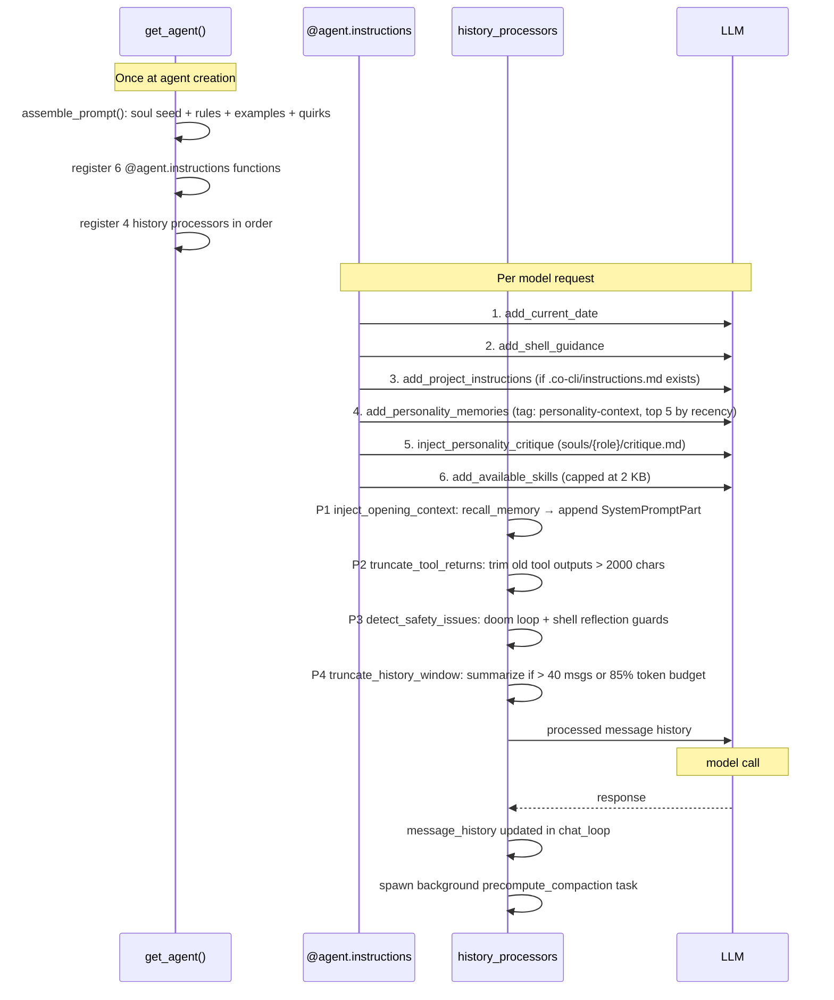

# Flow: Context Governance

Canonical flow for prompt assembly and history management — covering what is built once at agent
creation, what is injected per-turn, how history processors transform messages before every model
call, and how the chat loop maintains and repairs the message list over the session lifetime.



## Entry Conditions

- A new session has been started (`chat_loop` initialized).
- `get_agent()` has been called — agent and all processors are registered.
- `message_history` is either `[]` (fresh) or restored from a previous session.
- `CoDeps` is populated: `config.personality`, `config.memory_dir`, `session.skill_registry`, `runtime.precomputed_compaction`, etc.

---

## Part 1: Static Prompt Assembly (Once at Agent Creation)

`get_agent()` calls `assemble_prompt()` exactly once. The result is the immutable system prompt
passed to `Agent(system_prompt=...)`. It does not change between turns.

### Assembly order

```
1. Soul block (built in get_agent before passing to assemble_prompt):
     load_soul_seed(personality)          → identity declaration + Core traits + Never list
     load_character_memories(personality, memory_dir)
                                          → ## Character (decay_protected, planted memories)
     load_soul_mindsets(personality)      → ## Mindsets (all 6 task-type files, static)
     → combined soul_seed string

2. assemble_prompt(provider, model_name, soul_seed, soul_examples):
     prepend soul_seed                    ← placed first in all context windows
     for each rules/NN_*.md in numeric order:
         validate filename (NN_rule_id.md, contiguous from 01, no duplicates)
         append rule content
     if soul_examples present:
         append souls/{role}/examples.md  ← trailing rules; closest to task
     if quirks/{provider}/{model}.md exists:
         append "## Model-Specific Guidance\n\n" + body
     join all with "\n\n"
```

Contents baked in:
- Soul seed: identity declaration, trait essence, Never constraints
- Character base memories: scene/behavior grounding (provenance: planted, decay_protected: true)
- All 6 mindset files (technical, exploration, debugging, teaching, emotional, memory)
- 5 behavioral rules (01 Identity, 02 Safety, 03 Reasoning, 04 Tool Protocol, 05 Workflow)
- Optional examples: trigger-to-response patterns (trailing, maximizes pattern-match influence)
- Optional model quirks: counter-steering prose for known behavioral patterns

Nothing in the static prompt is per-turn. Mindsets are static — loaded once, present from Turn 1
without LLM classification.

---

## Part 2: Per-Turn Instruction Layers

Six `@agent.instructions` functions are registered at agent creation via `get_agent()`. pydantic-ai
evaluates all of them fresh before every model request, producing the per-turn system prompt
supplement. They run in registration order; functions returning empty string contribute nothing.

### Execution order and conditions

```
1. add_current_date        → always
   content: "Today is {date}."

2. add_shell_guidance      → always
   content: shell approval hint (reminds model approval gate exists)

3. add_project_instructions → when .co-cli/instructions.md exists
   content: full text of the project instructions file

4. add_personality_memories → when ctx.deps.config.personality is set
   calls _load_personality_memories():
     scan .co-cli/memory/*.md for tag "personality-context"
     sort by updated (or created) descending, take top 5
     format as "## Learned Context\n\n- {content}\n..."
   content: ## Learned Context section (session-to-session adaptation)

5. inject_personality_critique → when ctx.deps.config.personality_critique non-empty
   content: ## Review lens (from souls/{role}/critique.md, loaded at session start)
   always active when personality is set; provides self-evaluation lens every turn

6. add_available_skills → when ctx.deps.session.skill_registry non-empty
   content: "## Available Skills\n\n/name — description\n..."
   capped at 2 KB to prevent budget overflow from large skill registries
```

Total per-turn injection: ~100–1,000 chars depending on project instructions, learned context,
and skill registry size.

---

## Part 3: History Processor Chain

Four processors are registered at agent creation. pydantic-ai runs them in order before every
model request (both initial calls and approval re-entry resumptions).

### Processor registration order

```
[inject_opening_context, truncate_tool_returns, detect_safety_issues, truncate_history_window]
```

### Processor 1 — inject_opening_context

Runs as the first history processor. Performs proactive memory recall before the model sees
the conversation. Session-scoped state is stored on `ctx.deps.runtime.opening_ctx_state`
(type `OpeningContextState`) — initialized once in `create_deps()`, persists across turns
to debounce recall per user turn.

```
detect new user turn in messages (presence of new ModelRequest with UserPromptPart)
call internal recall_memory(user_message_text, max_results=3)
  → FTS5 BM25 search in .co-cli/memory/ (or grep fallback)
  → temporal decay rescoring on results
  → gravity: refresh updated timestamp on matched entries
if matches found:
  append new ModelRequest(SystemPromptPart("Relevant memories:\n<recall display>"))
  to end of message list (sibling message, not appended to existing user turn)
if no matches: messages unchanged
```

Side effects: recall_memory touches matched memory files (updates `updated` timestamp).

### Processor 2 — truncate_tool_returns (sync, no I/O)

Trims old tool outputs to prevent stale large results from consuming context budget.

```
walk all messages EXCEPT the last 2 (current turn is protected)
for each ToolReturnPart with content length > tool_output_trim_chars (default 2000):
  if content is dict: JSON-serialize to measure length
  replace content with: content[:threshold] + "\n[…truncated, {length} chars total]"
  preserve tool_name and tool_call_id
threshold = 0 → processor is disabled entirely
```

### Processor 3 — detect_safety_issues (async)

Guards against doom loops and shell reflection spirals. Turn-scoped state is stored on
`ctx.deps.runtime.safety_state` (type `SafetyState`) — reset to a fresh instance at the
start of every `run_turn()`.

```
hash current ToolCallPart payloads
if identical hash seen doom_loop_threshold consecutive times:
  inject intervention SystemPromptPart ("You appear to be repeating the same tool call...")
track consecutive shell errors
if consecutive shell errors >= max_reflections:
  inject intervention ("You have reflected on the same shell error multiple times...")
```

### Processor 4 — truncate_history_window (async, LLM call)

Sliding-window summarization. Triggered when history grows too large.

```
trigger conditions (either):
  len(messages) > max_history_messages (default 40)
  estimated token count > 85% of internal budget
    (estimate: total chars / 4; budget: 100k tokens)

if not triggered: return messages unchanged

split into three zones:
  head  = messages[0 .. head_end]  (first run, pinned)
         _find_first_run_end(): scan for first ModelResponse with TextPart
         head_end = that index (inclusive); = 0 if no text response found
  tail  = last max(4, max_history_messages // 2) messages
  dropped middle = everything between head and tail

check precomputed_compaction (from background task):
  if available AND history unchanged since precompute:
    use precomputed summary directly → skip LLM call
    clear deps.runtime.precomputed_compaction = None after consuming
  else:
    call summarize_messages(dropped, model=role_models["summarization"] head or primary)
      → creates fresh Agent(model, output_type=str) with zero tools
      → passes dropped as message_history
      → prompt uses: handoff framing + first-person voice + anti-injection guard
    on LLM success:
      inject ModelRequest(UserPromptPart("[Summary of N earlier messages]\n{summary}"))
    on LLM failure (any exception):
      inject ModelRequest(UserPromptPart("[Earlier conversation trimmed — N messages removed...]"))

return: head + [summary marker] + tail
```

Summarization model selection:

| Callsite | Model used |
|----------|------------|
| `truncate_history_window` (auto) | `role_models["summarization"]` head, fallback primary |
| `/compact` (manual) | primary model always (quality over cost) |

---

## Part 4: Message History Lifecycle

`chat_loop` in `main.py` owns `message_history` as a plain list. It is passed to and returned
from `run_turn()` each cycle.

### Normal turn cycle

```
session start:
  message_history = []  (or restored from session file if TTL not expired)

per user message:
  1. join background precompute task (if running):
       await pending_compaction_task
       write result to deps.runtime.precomputed_compaction (if finished)
       if not finished: deps.runtime.precomputed_compaction stays None → inline fallback
  2. call run_turn(agent, deps, message_history, user_input, ...)
       → history_processors run (all four, in order)
       → model request(s) made
       → approval loop if DeferredToolRequests
       → returns TurnResult
  3. message_history = turn_result.messages  (from result.all_messages())
  4. spawn precompute_compaction() as asyncio.Task (unconditional)
       task checks internally: if below threshold → no-op; if above → compute summary eagerly
       result stored in deps.runtime.precomputed_compaction after Task is joined next turn
```

### Background pre-computation trigger thresholds

```
precompute_compaction() fires computation when:
  message count > 80% of max_history_messages
  OR estimated token count > 70% of internal token budget

below thresholds: task returns None immediately (no-op, no LLM call)
```

### Interrupt patching

When `KeyboardInterrupt` or `CancelledError` fires mid-turn:

```
_patch_dangling_tool_calls(messages, error_message):
  scan ALL messages (not just last) for ToolCallPart entries
  find any without a matching ToolReturnPart (by tool_call_id)
  for each dangling call:
    append synthetic ModelRequest(ToolReturnPart(content="Interrupted by user."))
  append abort marker to history
  → history is structurally valid for next turn
```

Full scan covers multi-tool approval loops where earlier ModelResponse messages may also have
unmatched calls.

### DeferredToolRequests interaction

```
approved tools:
  _handle_approvals() resumes agent with DeferredToolResults
  pydantic-ai re-runs → ToolCallPart + ToolReturnPart pair added naturally

denied tools:
  ToolDenied("User denied this action") passed for the call ID
  pydantic-ai injects synthetic ToolReturnPart → history stays structurally valid

interrupted during approval loop:
  _patch_dangling_tool_calls() scans all messages, patches unmatched calls
```

---

## Part 5: Slash Command Effects on History

| Command | Effect on message_history |
|---------|--------------------------|
| `/clear` | Returns `[]` — complete reset. Session compaction count NOT incremented. |
| `/compact` | Calls summarization with primary model, returns 2-message history: `ModelRequest([Compacted conversation summary]\n{summary})` + `ModelResponse(Understood. I have the conversation context.)`. On empty history or failure: returns `None` (no-op). After success: `increment_compaction(session_data)` called. |
| `/history` | Read-only. Counts `ModelRequest` messages as user turns, displays turn count + total message count. Does not modify history. |
| `/new` | Session checkpoint: summarizes recent messages, writes to memory as session file, then clears history. Compaction guard (`_PERSONALITY_COMPACTION_ADDENDUM`) active — preserves personality moments in the summary. |

---

## Failure Paths

| Failure | Behavior |
|---------|----------|
| Summarization LLM call fails | Falls back to static marker: `[Earlier conversation trimmed — N messages removed]` |
| Background precompute not finished by next turn | `deps.runtime.precomputed_compaction` stays `None`; processor falls back to inline computation |
| Interrupt mid-approval loop | `_patch_dangling_tool_calls` patches all unmatched calls; turn ends with `outcome="continue"` |
| `inject_opening_context` recall finds nothing | Messages unchanged; no injection |
| Tool output trim disabled (`tool_output_trim_chars=0`) | Processor 2 is a no-op |
| History window disabled (`max_history_messages=0`) | Processor 4 message-count trigger disabled; token estimate trigger still applies |

---

## State Mutations

| Field | When mutated | By whom |
|-------|-------------|---------|
| `message_history` (chat_loop local) | After each turn, after `/clear`, after `/compact`, after `/new` | `chat_loop` in `main.py` |
| `deps.runtime.precomputed_compaction` | Written after background task join; cleared in `chat_loop` after turn (between signal detection and `touch_session`) — NOT inside `truncate_history_window` | `chat_loop` (write and clear) |
| Memory file `updated` timestamps | On every `inject_opening_context` recall (gravity) | `recall_memory` → `_touch_memory` |
| `deps.session.session_tool_approvals` | When user selects `"a"` for a non-shell tool | `_handle_approvals` in `_orchestrate.py` |

---

## Owning Code

| File | Role |
|------|------|
| `co_cli/_history.py` | All four history processors; `summarize_messages`; `_patch_dangling_tool_calls`; `_PERSONALITY_COMPACTION_ADDENDUM` |
| `co_cli/agent.py` | `get_agent`: static assembly call, `@agent.instructions` registration, processor registration order |
| `co_cli/prompts/__init__.py` | `assemble_prompt`: static prompt construction and rule file validation |
| `co_cli/prompts/personalities/_composer.py` | `load_soul_seed`, `load_soul_mindsets`, `load_soul_examples`, `load_character_memories` |
| `co_cli/main.py` | `chat_loop`: `message_history` ownership, background task spawn/join, precomputed_compaction wiring |
| `co_cli/_orchestrate.py` | `_patch_dangling_tool_calls`, approval re-entry loop |
| `co_cli/_commands.py` | `/clear`, `/compact`, `/history`, `/new` slash command handlers |
| `co_cli/tools/personality.py` | `_load_personality_memories` for `add_personality_memories` per-turn layer |

## See Also

- `docs/DESIGN-prompt-design.md` — canonical deep spec for loop behavior and prompt architecture
- `docs/DESIGN-memory.md` — memory lifecycle, `inject_opening_context` and `add_personality_memories` detail
- `docs/DESIGN-personality.md` — static assembly contents, per-turn layers, prompt budget measurements
