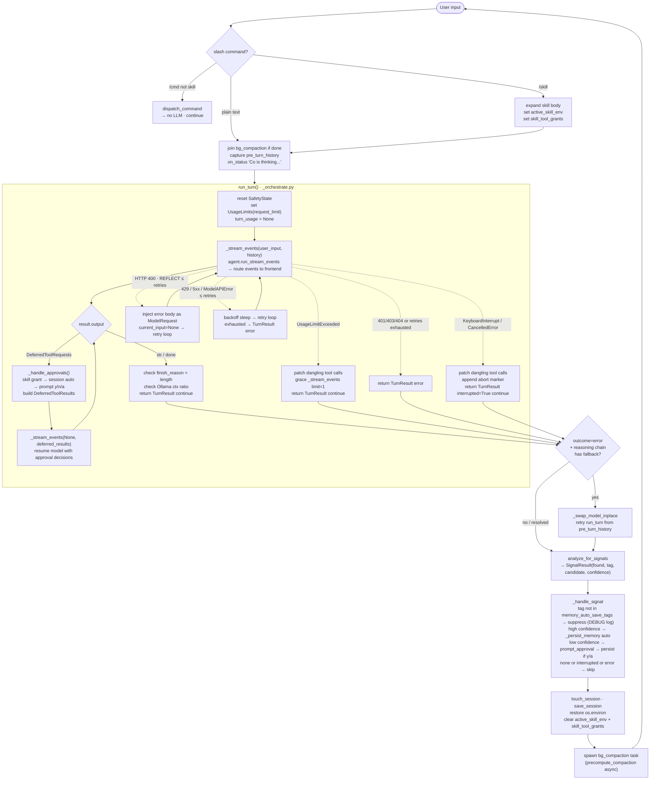

# Flow: Core Turn

Canonical doc for one complete user turn — from chat loop input dispatch through `run_turn`
streaming, approval chaining, error handling, interrupt recovery, and post-turn cleanup.

## 1. What & How

One user turn is the atomic unit of execution. The chat loop receives a user message, hands it
to `run_turn()`, which drives one full agentic cycle (stream → tool calls → approvals → result),
then returns control to the chat loop for post-turn bookkeeping.



## 2. Entry Conditions

- Session initialized: `create_deps()` + `run_model_check()` + `get_agent()` + `run_bootstrap()` complete
- `message_history: list[ModelMessage]` — current conversation history (may be empty)
- `user_input: str | None` — the user message; `None` on approval re-entry
- `deps.runtime.safety_state` will be reset to `SafetyState()` at start of `run_turn()`

## 3. Pre-Turn Setup (chat_loop)

Before calling `run_turn()`, `chat_loop` in `main.py` performs:

```text
if bg_compaction_task is done:
    deps.runtime.precomputed_compaction = bg_compaction_task.result()   ← join eagerly

pre_turn_history = message_history   ← snapshot for reasoning-chain retry

current_snapshot = _skills_snapshot(skills_dir)   ← dict{path: mtime} for each .md file
if current_snapshot != _skills_watch_snapshot:
    reload _load_skills() → SKILL_COMMANDS update + deps.session.skill_registry update + completer refresh
    _skills_watch_snapshot = current_snapshot
```

Skill dispatch (when input starts with `/skill-name`):
```text
ctx = dispatch_command(user_input)
if ctx.skill_body:
    deps.session.active_skill_env = ctx.skill_env
    deps.session.skill_tool_grants = ctx.allowed_tools
    user_input = ctx.skill_body      ← expanded body becomes the LLM input
```

## 4. run_turn Entry

`run_turn(agent, user_input, deps, message_history, model_settings, frontend, *, max_request_limit, http_retries, verbose) → TurnResult`

```text
deps.runtime.safety_state = SafetyState()       ← reset turn-scoped safety (doom loop, shell reflection)
turn_limits = UsageLimits(request_limit=max_request_limit)
turn_usage = None
current_input = user_input
backoff_base = 1.0

enter retry loop (up to model_http_retries):
    try:
        (result, streamed) = _stream_events(agent, current_input, deps,
                                            message_history, turn_limits,
                                            usage=turn_usage, frontend)
        turn_usage = result.usage()

        while result.output is DeferredToolRequests:
            (result, streamed) = _handle_approvals(agent, deps, result,
                                                   model_settings, turn_limits,
                                                   usage=turn_usage, frontend)
            turn_usage = result.usage()

        if not streamed and result.output is str:
            frontend.on_final_output(result.output)   ← non-streaming fallback

        if result.response.finish_reason == "length":
            frontend.on_status("Response may be truncated… Use /continue to extend.")

        check Ollama ctx ratio (skipped for Gemini):
            if ctx_ratio >= ctx_overflow_threshold:   ← hard overflow
                frontend.on_status("Context window nearly full — consider /compact")
            elif ctx_ratio >= ctx_warn_threshold:     ← soft warning
                frontend.on_status("Context window filling up")

        return TurnResult(messages=result.all_messages(), outcome=outcome, ...)

    except ModelHTTPError → see §6 Error Handling
    except ModelAPIError  → see §6 Error Handling
    except KeyboardInterrupt / CancelledError → see §7 Interrupt Recovery
```

**Budget sharing:** One `UsageLimits` object + accumulating `turn_usage` spans the initial stream,
all approval re-entries, and all retries. N approval hops do not get N × budget.

**Approval while-loop:** Each resumed run can produce another `DeferredToolRequests` when the LLM
chains multiple side-effectful calls. Each round gets its own approval cycle before the loop exits.

## 5. Streaming Phase (_stream_events)

`_stream_events` wraps `agent.run_stream_events()` and routes events to the frontend.
Transient state lives in `_StreamState` — fresh per call, no module-level globals.

```text
state = _StreamState()
pending_cmds = {}     ← shell command titles keyed by tool_call_id

for event in agent.run_stream_events(input, history, limits, deferred_tool_results):

    PartStartEvent(TextPart)      → flush thinking panel, begin accumulating text
    PartStartEvent(ThinkingPart)  → if verbose: accumulate; else discard

    TextPartDelta                 → flush thinking if pending, accumulate text,
                                    throttled render at 50 ms (20 FPS)
    ThinkingPartDelta             → if verbose: accumulate + throttle

    FunctionToolCallEvent         → flush all buffers
                                    if shell tool: store cmd title in pending_cmds
                                    frontend.on_tool_call(name, args_display)
                                    if no text yet: emit tool preamble (once per call)

    FunctionToolResultEvent       → flush all buffers
                                    if ToolReturnPart str: display with pending_cmd title
                                    elif dict with "display" key: display structured result
                                    else: skip (no display for internal results)

    AgentRunResultEvent           → capture result object

commit remaining text buffer
finally: frontend.cleanup()
```

**Tool preamble injection:** When the model emits no text before its first tool call,
`_stream_events` auto-injects a dim status message (`"Checking saved context…"`,
`"Looking up current sources."`, etc.) via `frontend.on_status()`. Fires at most once
per `_stream_events` call. Prevents silent UX gaps on tool-first turns.

**Thinking → text transition:** One-way flush — the first text or tool event commits and
resets the thinking panel. `_flush_for_tool_output()` commits both buffers before any tool
annotation to prevent interleaved output.

**API choice:** `run_stream_events()` is the only API compatible with `DeferredToolRequests`
as an output type. `run_stream()` and `iter()` cannot handle deferred output.

## 6. Per-Turn Safety Guards

Three independent mechanisms run every turn via history processors registered at agent creation.

### Doom Loop Detection

`detect_safety_issues()` in `_history.py` hashes recent `ToolCallPart` entries as
`MD5(tool_name + json.dumps(args, sort_keys=True))`. If the same hash appears
`doom_loop_threshold` (default 3) consecutive times, injects:

```text
system message: "You are repeating the same tool call. Try a different approach or explain why."
```

Turn-scoped state lives on `deps.runtime.safety_state`, reset at the start of every `run_turn()`.

### Grace Turn on Budget Exhaustion

When `UsageLimitExceeded` fires mid-turn:

```text
catch UsageLimitExceeded:
    fire one extra _stream_events(request_limit=1)
    inject: "Turn limit reached. Summarize your progress."
    if grace turn fails: frontend.on_status("Continue in a fresh prompt.")
    return TurnResult(outcome="continue")
```

### Shell Reflection Cap

`run_shell_command` raises `ModelRetry` for non-zero exits, timeouts, and unexpected errors.
`detect_safety_issues()` tracks consecutive shell errors and injects at `max_reflections` (default 3):

```text
system message: "Shell reflection limit reached. Ask the user for help or try a fundamentally different approach."
```

## 7. Error Handling (Provider Errors)

`classify_provider_error()` in `_provider_errors.py` drives the retry behavior:

| Exception | Status | Action | Details |
|-----------|--------|--------|---------|
| `ModelHTTPError` | 400 | `REFLECT` | Inject error body as `ModelRequest`; `current_input=None`; retry from history |
| `ModelHTTPError` | 401, 403, 404 | `ABORT` | Return `TurnResult(output=None, outcome="error")` |
| `ModelHTTPError` | 429 | `BACKOFF_RETRY` | Parse `Retry-After` (default 3s); progressive backoff |
| `ModelHTTPError` | 5xx | `BACKOFF_RETRY` | 2s base; progressive backoff |
| `ModelAPIError` | Network/timeout | `BACKOFF_RETRY` | 2s base; progressive backoff |

All retries capped at `model_http_retries` (default 2). Backoff cap: 30s, factor 1.5× per retry.

**Reflection (400):** Error body injected as `ModelRequest`; `current_input` set to `None` so the
next `_stream_events` call resumes from history, letting the model self-correct its tool JSON.

**Safe message extraction:** `result` may be `None` if the exception fired before any streaming
result was captured. Pattern: `result.all_messages() if result else message_history`.

### Reasoning-Chain Advance on Terminal Error

When `run_turn` returns `outcome="error"` and `role_models["reasoning"]` has more than one model:

```text
chat_loop:
    role_models["reasoning"].pop(0)             ← permanently removes head from the list
    _swap_model_inplace(agent, new_head_model, provider, settings)
    retry run_turn once from pre_turn_history   ← original pre-turn snapshot
    if retry succeeds: update message_history normally
    if retry also fails: present error to user
```

Same-provider only. The ordered `role_models["reasoning"]` list is permanently mutated — the
failed model is removed and subsequent turns in the session will use the new head. No parallel
providers or fallback routing is attempted.

## 8. Interrupt Recovery

On `KeyboardInterrupt` or `CancelledError` during `run_turn`:

```text
1. msgs = result.all_messages() if result else message_history
2. _patch_dangling_tool_calls(msgs):
       scan ALL ModelResponse messages for ToolCallPart with no matching ToolReturnPart
       append synthetic ModelRequest with ToolReturnPart("Interrupted by user.") for each
       (full scan handles interrupts during multi-tool approval loops)
3. append abort marker: ModelRequest(UserPromptPart(
       "The user interrupted the previous turn. Some actions may be incomplete.
        Verify current state before continuing."))
4. return TurnResult(patched_messages, interrupted=True, outcome="continue")
```

The abort marker ensures the model on the next turn knows the previous turn was incomplete.

**Ctrl+C signal routing:**

| Context | Result |
|---------|--------|
| During `run_turn()` streaming | Patches dangling calls, returns to prompt |
| During approval prompt | Cancels approval, returns to prompt |
| At REPL prompt (1st press) | "Press Ctrl+C again to exit" |
| At REPL prompt (2nd press within 2s) | Exits session |
| Ctrl+D anywhere at prompt | Exits immediately |

## 9. Post-Turn Hooks (chat_loop)

After `run_turn` returns:

```text
message_history = turn_result.messages

if turn_result.outcome == "error" and reasoning_chain has fallback:
    → reasoning-chain advance (see §7)

finally:
    os.environ restore from active_skill_env
    deps.session.active_skill_env.clear()
    deps.session.skill_tool_grants.clear()

deps.runtime.precomputed_compaction = None    ← clear stale precompute after signal detection

touch_session(session_data)
save_session(session_path, session_data)

bg_compaction_task = precompute_compaction(
    agent, deps, message_history, model_settings)   ← spawn unconditionally
```

**Session persistence:** `touch_session` + `save_session` run after every LLM turn, keeping the
`.co-cli/session.json` TTL fresh for session restore on next `co chat` invocation.

**Background compaction:** Spawned unconditionally after every turn. Checks internally whether
thresholds are met (80% message count OR 70% token estimate); returns `None` (no-op) if below.
Result joined at the start of the *next* turn's pre-turn setup.

**Skill-env restore:** `os.environ` and `deps.session.active_skill_env/skill_tool_grants` are
always restored in `finally`, including on `KeyboardInterrupt`. Skill privileges never leak into
the next turn.

## 10. Turn Outcome Contract

`TurnOutcome = Literal["continue", "stop", "error", "compact"]`

| Outcome | Condition |
|---------|-----------|
| `"continue"` | Normal text completion; budget grace turn; interrupted turn |
| `"error"` | Unrecoverable provider/network failure after all retries |
| `"stop"` | Reserved — explicit stop signal (not currently produced by run_turn) |
| `"compact"` | Reserved — explicit compaction trigger (not currently produced by run_turn) |

`chat_loop` uses this typed boundary to decide whether to retry (reasoning-chain advance on
`"error"`) or simply continue to the next prompt.

## Owning Code

| File | Role |
|------|------|
| `co_cli/main.py` | `chat_loop` — REPL, pre/post-turn setup, session lifecycle |
| `co_cli/_orchestrate.py` | `run_turn`, `_stream_events`, `_handle_approvals`, `_patch_dangling_tool_calls` |
| `co_cli/agent.py` | `get_agent` — model selection, tool registration, history processor registration |
| `co_cli/_history.py` | `detect_safety_issues`, `inject_opening_context`, `truncate_*` processors |
| `co_cli/_provider_errors.py` | `classify_provider_error` |
| `co_cli/_session.py` | `touch_session`, `save_session`, `is_fresh` |

## See Also

- [DESIGN-core.md](DESIGN-core.md) — §1 Agent Factory, §2 CoDeps field reference, §8 FrontendProtocol API and session lifecycle
- [DESIGN-prompt-design.md](DESIGN-prompt-design.md) — prompt architecture (static assembly, per-turn layers)
- [DESIGN-flow-approval.md](DESIGN-flow-approval.md) — full three-tier approval decision chain
- [DESIGN-flow-context-governance.md](DESIGN-flow-context-governance.md) — history processors, summarization, compaction detail
- [DESIGN-flow-bootstrap.md — Model Dependency Check](DESIGN-flow-bootstrap.md#model-dependency-check) — startup validation (runs before this flow is possible)
- [DESIGN-flow-bootstrap.md](DESIGN-flow-bootstrap.md) — startup initialization (runs before this flow is possible)
