# Flow: Knowledge Lifecycle

End-to-end lifecycle for the knowledge system — library article saves, startup sync, retrieval
across all source namespaces, and fallback/degradation behavior. The knowledge system handles
reference content (library articles, Obsidian notes, Google Drive docs); agent memory is a
separate subsystem covered in DESIGN-flow-memory-lifecycle.md.

```mermaid
flowchart TD
    subgraph Wakeup["Backend Resolution at Wakeup"]
        B1[configured knowledge_search_backend] -->|hybrid| B2[try KnowledgeIndex hybrid]
        B2 -->|fail| B3[try fts5]
        B3 -->|fail| B4[grep — knowledge_index = None]
        B1 -->|fts5| B3
        B1 -->|grep| B4
        B2 -->|ok| B5[hybrid active]
        B3 -->|ok| B6[fts5 active]
    end

    subgraph WriteArticle["Article Save — save_article"]
        A1[save_article called] --> A2{URL dedup: origin_url match?}
        A2 -->|Yes| A3[_consolidate_article — update in place, no new file]
        A2 -->|No| A4[Write new .md file to library_dir]
        A4 --> A5[knowledge_index.index source=library]
        A3 --> A5
        A5 --> A6[index_chunks — write paragraph chunks to chunks/chunks_fts]
    end

    subgraph Retrieve["Retrieval — search_knowledge"]
        Q1[search_knowledge query] --> Q2[Source resolution: library / obsidian / drive]
        Q2 --> Q3{Scope includes obsidian?}
        Q3 -->|Yes| Q4[pre-sync obsidian vault hash-based]
        Q4 --> Q5[FTS5/hybrid search or grep fallback]
        Q3 -->|No| Q5
        Q5 --> Q6[Confidence scoring: BM25 + decay + provenance]
        Q6 --> Q7[Contradiction detection: group by auto_category]
        Q7 --> Q8[Return dict with display field]
    end
```



## Entry Conditions

- Session startup: `create_deps()` has resolved the knowledge backend.
- `deps.services.knowledge_index` is initialized (fts5 or hybrid) or `None` (grep fallback).
- `deps.config.library_dir` points to `~/.local/share/co-cli/library/` (user-global, configurable).
- `deps.config.memory_dir` points to `.co-cli/memory/` (project-local).
- `search.db` is in the data directory alongside `library_dir`.

---

## Part 1: Backend Resolution at Wakeup

`create_deps()` resolves the knowledge backend before bootstrap sync, applying adaptive
degradation:

```
configured backend = knowledge_search_backend setting (default "fts5")

if configured = "hybrid":
  attempt to initialize KnowledgeIndex(mode="hybrid")
    → requires sqlite-vec extension + embedding provider
  on failure: downgrade to "fts5"
    attempt KnowledgeIndex(mode="fts5")
    on failure: downgrade to "grep"
      deps.services.knowledge_index = None

if configured = "fts5":
  attempt KnowledgeIndex(mode="fts5")
  on failure: downgrade to "grep"
    deps.services.knowledge_index = None

if configured = "grep":
  deps.services.knowledge_index = None  (intentional)

deps.config.knowledge_search_backend = resolved_backend  (written once, used for runtime consistency)
```

---

## Part 2: Startup Sync (Bootstrap)

`run_bootstrap()` syncs both knowledge directories. Knowledge sync is Step 1 of four bootstrap
steps (model verification is in `run_model_check()`, before bootstrap).

### Sync sequence

```
run_bootstrap(deps):

STEP 1a — Memory sync:
  knowledge_index.sync_dir(source="memory", directory=memory_dir, kind_filter="memory")
    recursive scan of .co-cli/memory/**/*.md
    kind_filter="memory": skip files whose frontmatter kind != "memory"
    for each file:
      compute hash of content
      if hash matches existing docs row: skip (no-op)
      else: index docs row (source, kind, path, title, content, tags, ...)
      (memory source: no chunk indexing — chunks are for non-memory sources only)
    remove_stale(source="memory", current_paths, directory=memory_dir):
      delete docs rows for files no longer present in memory_dir

STEP 1b — Library sync:
  knowledge_index.sync_dir(source="library", directory=library_dir, kind_filter="article")
    same mechanics as memory sync, kind_filter="article"
    for each changed file: index docs row, then call index_chunks() to write paragraph chunks
    scopes eviction to library_dir (prevents cross-directory row deletion)

on sync failure (any exception):
  close and disable knowledge_index for session
  deps.services.knowledge_index = None
  all subsequent tool calls fall back to grep
```

Hash-based change detection (`needs_reindex`) prevents unnecessary writes on unchanged files.

---

## Part 3: Article Save Flow (save_article)

Articles are explicitly saved via `save_article`. They are never auto-saved. Library scope is
user-global — all co instances on the machine share the same library.

### Write sequence

```
save_article(ctx, content, title=None, url=None, tags=None):

STEP 1 — URL dedup:
  if url (origin_url) provided:
    scan library_dir for files where frontmatter origin_url == url
    match found → _consolidate_article(existing_file, new_content, title, tags):
      replace body with new content
      replace title with new title (if provided)
      union-merge tags (deduplicated, lowercased)
      set updated timestamp
      preserve: id, created, provenance ("web-fetch"), decay_protected (true)
      reindex in knowledge_index.index(...)
      call index_chunks("library", path, chunk_text(new_content, ...)) to update chunks
      return (no new file written)

STEP 2 — New file write:
  ID = max existing ID across all files in library_dir + 1
    (avoids collision even if IDs are not contiguous)
  filename = "{article_id:03d}-{slug}.md"
  write frontmatter:
    id, created, kind: "article"
    origin_url (when provided)
    provenance: "web-fetch"
    decay_protected: true
    tags (normalized to lowercase)
    title (when provided)
    updated: null (set on re-save)
  write body = content

STEP 3 — FTS reindex:
  knowledge_index.index(source="library", path, title, content, tags, ...)
    when knowledge_index exists
  index_chunks("library", path, chunk_text(content, chunk_size, chunk_overlap))
    splits content into paragraph-boundary chunks and writes to chunks/chunks_fts
```

Articles have `decay_protected: true` — they are never auto-deleted by any retention process.
Unlike memories, articles have no `certainty` field (external content is not a user-state
assertion).

---

## Part 4: Index Write Triggers by Source

The knowledge index is updated from multiple paths beyond startup sync:

| Source | Write trigger | Stored docs.path |
|--------|--------------|-----------------|
| `memory` | `sync_dir` at bootstrap, `save_memory`, `update_memory`, `append_memory`, `/forget` eviction | Absolute filesystem path |
| `library` | `sync_dir` at bootstrap, `save_article` | Absolute filesystem path |
| `obsidian` | `search_notes` and `search_knowledge` (source=None or "obsidian") trigger `sync_dir` | Absolute filesystem path |
| `drive` | `read_drive_file` indexes content after fetch | Drive `file_id` (virtual path) |

Obsidian and Drive are indexed on-demand (at search/read time), not at startup.

---

## Part 5: Retrieval Flow (search_knowledge)

`search_knowledge` is the primary cross-source retrieval entrypoint registered as an agent tool.

### Retrieval sequence

```
search_knowledge(query, kind=None, source=None, limit=10,
                 tags=None, tag_match_mode="any",
                 created_after=None, created_before=None):

STEP 1 — Source resolution:
  source=None (default) → scope: ["library", "obsidian", "drive"]
    (memory excluded by default; use source="memory" or prefer search_memories)
  source="memory" → scope: ["memory"]
  source="obsidian" → scope: ["obsidian"]
  source="drive" → scope: ["drive"]
  source=list → scope: list (builds IN clause)

STEP 2 — Obsidian pre-sync (when scope includes obsidian):
  sync_dir("obsidian", obsidian_vault_path)
    if obsidian_vault_path is set
    hash-based: only changed/new files are reindexed

STEP 3a — With index (FTS5 or hybrid):
  FTS5 path:
    query tokenization: lowercase, stopwords removed, tokens len > 1, AND-joined
    if all tokens filtered → return empty (no search)
    source routing:
      memory sources  → docs_fts leg (memory is not chunked)
      non-memory sources (library, obsidian, drive) → chunks_fts leg (paragraph chunks)
      mixed/None scope → both legs, union by path, deduplicate keeping highest score
    score = 1 / (1 + abs(bm25_rank))
  Hybrid path (adds vector layer):
    generate embedding for query via knowledge_embedding_provider
    source routing mirrors FTS routing:
      memory → docs_vec; non-memory → chunks_vec
    merge via Reciprocal Rank Fusion (RRF, k=60): rank-based, not score-weighted
    on embedding failure: fall back to FTS5 results
  Reranker (when knowledge_reranker_provider != "none"):
    "local": fastembed cross-encoder (if installed); passthrough if not
    "ollama" / "gemini": listwise ranking via LLM prompt; map position to descending scores
    on reranker failure: use unranked candidate order (non-fatal)

STEP 3b — Without index (grep fallback):
  source=None or "library" → grep scan of library_dir
  source="memory" → grep scan of memory_dir
  source="obsidian" → return empty (obsidian requires index)
  source="drive" → return empty (drive requires index)
  result source field: "memory" for kind:memory results, "library" for kind:article results

STEP 4 — Confidence scoring (with index):
  confidence = 0.5 * score + 0.3 * decay + 0.2 * (prov_weight * certainty_mult)
  (see DESIGN-flow-memory-lifecycle.md Part 7 for formula details)

STEP 5 — Contradiction detection (with index):
  _detect_contradictions(results): group by auto_category, check negation pairs
  flagged results: prefix display "⚠ Conflict: ", set conflict=True

return: dict with display field + count, results list, source breakdown
```

### Internal retrieval adapters (not agent-registered)

| Function | Purpose | FTS or grep |
|---------|---------|-------------|
| `recall_memory(query, ...)` | Memory-only recall for `inject_opening_context` | Both |
| `recall_article(query, ...)` | Article summary retrieval (slug, title, url, snippet) | Both |
| `search_notes(query, ...)` | Obsidian multi-keyword search | FTS only |

These functions are not exposed to the LLM — they are called by history processors or other tools
internally.

---

## Part 6: Obsidian Sync and Note Access

The Obsidian source is synced on-demand at search time, not at bootstrap:

```
search_knowledge(source="obsidian" or source=None):
  → knowledge_index.sync_dir("obsidian", obsidian_vault_path)
    scan vault /**/*.md, hash-based change detection
    index new/changed files with source="obsidian"
    remove_stale rows for deleted files

list_notes(folder=None, tag=None):
  → no index sync; reads from knowledge_index directly (obsidian rows already indexed)
  → or filesystem scan if index unavailable

read_note(slug):
  → reads file directly from vault path; does not require index
```

`obsidian_vault_path` must be set (`OBSIDIAN_VAULT_PATH` env var or settings). Without it,
obsidian source returns empty results.

---

## Part 7: Google Drive Indexing

Drive docs are indexed opportunistically at read time:

```
read_drive_file(file_id):
  fetch content from Drive API
  knowledge_index.index(source="drive", path=file_id, content=text_content, ...)
  index_chunks("drive", file_id, chunk_text(text_content, chunk_size, chunk_overlap))
  return content

search_drive_files(query):
  Drive API text search → returns file metadata list
  does NOT index results (only read_drive_file indexes)
```

Drive content requires `google_credentials_path` to be set.

---

## Part 8: Fallback and Degradation

The knowledge system degrades gracefully at every level:

```
level 1 — wakeup degradation:
  hybrid → fts5 → grep (or fts5 → grep)
  deps.config.knowledge_search_backend records resolved level

level 2 — bootstrap sync failure:
  index closed and set to None for session
  all tools fall back to grep where supported

level 3 — per-source grep fallback:
  memory/library: grep scan of .md files
  obsidian: empty results (requires index)
  drive: empty results (requires index)

level 4 — hybrid embedding failure:
  graceful fallback to FTS5 lexical results
  no error raised to model

level 5 — reranker failure:
  graceful passthrough to unranked FTS/hybrid candidate order
  no error raised to model
```

The `knowledge_search_backend="grep"` setting forces grep mode permanently (skips index init).
Useful when sqlite-vec is unavailable or FTS is not needed.

---

## Part 9: Source Namespace and Scope Boundaries

| Source | Scope | Shared? | Auto-deleted? |
|--------|-------|---------|--------------|
| `memory` | Project-local (`.co-cli/memory/` under cwd) | No — each project has its own | Yes, by retention cap (non-protected) |
| `library` | User-global (`~/.local/share/co-cli/library/`) | Yes — all co instances on machine | No — `decay_protected: true` |
| `obsidian` | Vault path (configured) | Depends on vault location | No — external, co never deletes |
| `drive` | Google Drive account | Per Google credentials | No — external |

`search_knowledge` default scope excludes `memory`. This is intentional: memory is user-agent
state (preferences, corrections), not reference content. Use `search_memories` or pass
`source="memory"` explicitly when searching memories through the unified interface.

---

## Failure Paths

| Failure | Behavior |
|---------|----------|
| Backend init failure (hybrid or fts5) | Adaptive degradation; resolved backend written to `deps.config.knowledge_search_backend` |
| Bootstrap sync error | Index disabled for session; grep fallback throughout |
| Obsidian sync error on search | Search proceeds with stale index data (no abort) |
| All query tokens filtered by stopword removal | search_knowledge returns empty (no search attempted) |
| Drive credentials missing | `read_drive_file` returns error dict (terminal_error class) |
| `save_article` with duplicate URL | Consolidates in-place; no duplicate file |
| `read_article_detail` with ambiguous slug prefix | Returns first glob match; no deterministic disambiguation |
| Reranker unavailable (fastembed not installed) | Passthrough to unranked results |

---

## Owning Code

| File | Role |
|------|------|
| `co_cli/_knowledge_index.py` | Core index engine: schema, `sync_dir`, `index`, `index_chunks`, `remove`, `remove_chunks`, `remove_stale`, FTS/hybrid/rerank search |
| `co_cli/_chunker.py` | `chunk_text()` — paragraph-boundary chunker used by all non-memory index paths |
| `co_cli/tools/articles.py` | `save_article`, `recall_article`, `read_article_detail`, `search_knowledge` |
| `co_cli/tools/obsidian.py` | `list_notes`, `read_note`, `search_notes`; Obsidian `sync_dir` trigger |
| `co_cli/tools/google_drive.py` | Drive search/read; opportunistic index write on `read_drive_file` (index + index_chunks) |
| `co_cli/_bootstrap.py` | `run_bootstrap()`: startup `sync_dir` for memory and library |
| `co_cli/main.py` | `create_deps()`: backend resolution, `library_dir` path injection |
| `co_cli/config.py` | `library_path`, `knowledge_search_backend`, embedding/reranker settings, `knowledge_chunk_size`, `knowledge_chunk_overlap` |
| `co_cli/deps.py` | `CoConfig.library_dir`, `CoConfig.knowledge_search_backend`; `CoServices.knowledge_index` |
| `co_cli/_frontmatter.py` | Frontmatter parsing used by all knowledge files |

## See Also

- `docs/DESIGN-knowledge.md` — authoritative deep spec: `KnowledgeIndex` internals, FTS schema, hybrid merge, reranking
- `docs/DESIGN-system-bootstrap.md` — full startup sequence (canonical: model check + bootstrap)
- `docs/DESIGN-flow-memory-lifecycle.md` — memory write/recall/signal paths (distinct subsystem)
