# Flow: Memory Lifecycle

End-to-end lifecycle of agent memory — from write (persist_memory), through recall
(inject_opening_context), to post-turn signal detection, retention enforcement, and quality
classification. Memory is per-project agent state: facts learned through conversation,
distinct from library articles (external reference content).

```mermaid
flowchart TD
    subgraph Write["Write Path — persist_memory"]
        W1[persist_memory called] --> W2{Title provided?}
        W2 -->|Yes| W5[Skip dedup + consolidation]
        W2 -->|No| W3[Dedup scan: rapidfuzz token_sort_ratio]
        W3 -->|ratio ≥ 85| W4[_update_existing_memory — no new file written]
        W3 -->|below threshold| W6{Model provided?}
        W6 -->|Yes| W7[LLM consolidation: extract_facts → resolve plan]
        W6 -->|No| W5
        W7 --> W8{Plan has ADD action?}
        W8 -->|No| W9[return — no file written]
        W8 -->|Yes| W5
        W5 --> W10[Write new .md file with frontmatter]
        W10 --> W11[Retention cap: delete oldest if count > max]
        W11 --> W12[FTS reindex via knowledge_index.index]
    end

    subgraph Recall["Recall Path — inject_opening_context"]
        R1[history processor fires on new user turn] --> R2[recall_memory with user message]
        R2 -->|FTS5 or hybrid| R3[BM25 search + temporal decay rescore]
        R2 -->|grep fallback| R4[substring scan sorted by recency]
        R3 --> R5[dedup_pulled + gravity touch updated timestamp]
        R4 --> R5
        R5 --> R6[Append SystemPromptPart with recall results]
    end

    subgraph Signal["Post-Turn Signal Detection"]
        S1[analyze_for_signals after each turn] --> S2{Signal found?}
        S2 -->|high confidence| S3[auto-save via persist_memory on_failure=skip]
        S2 -->|low confidence| S4[prompt user: Save this? y/a/n]
        S4 -->|y or a| S3
        S4 -->|n| S5[drop — no save]
        S2 -->|none| S5
    end
```



## Entry Conditions

- Session started; `CoDeps` populated with `config.memory_dir`, `services.knowledge_index`, `config.memory_max_count`.
- `.co-cli/memory/` directory exists (created on first write).
- `deps.services.knowledge_index` is initialized (FTS5 or hybrid) or `None` (grep fallback).
- `deps.config.memory_dir` is scoped to `Path.cwd() / ".co-cli" / "memory"` — project-local.

---

## Part 1: Write Path — persist_memory

All memory writes route through `memory_lifecycle.persist_memory()`. The explicit `save_memory`
tool and the auto-signal post-turn save both use this function.

### Full write sequence

```
persist_memory(deps, content, tags, related, provenance, title, on_failure, model):

STEP 1 — Title-based shortcut (named checkpoints, e.g. /new):
  if title provided:
    skip dedup and LLM consolidation entirely
    filename = "{title}.md"
    go to STEP 3

STEP 2a — Dedup fast-path:
  load recent memories within memory_dedup_window_days (default 7), capped to 10
  for each candidate:
    compute rapidfuzz.token_sort_ratio(new_content, candidate_content)
    if ratio >= memory_dedup_threshold (default 85):
      _update_existing_memory(candidate):
        replace body with new content
        union-merge tags (deduplicated, lowercased)
        refresh updated timestamp
        re-classify certainty (keyword analysis)
        re-detect provenance and auto_category
        strip stale consolidation_reason
      reindex updated file if knowledge_index exists
      return (no new file written)

STEP 2b — LLM consolidation (when model argument provided):
  memory_consolidator two-phase pipeline:
    phase 1 (extract_facts): analyze new content + recent memories → candidate facts
    phase 2 (resolve): compare candidates → action plan (ADD / UPDATE / DELETE / NONE per entry)
  apply_plan_atomically(plan, deps):
    UPDATE action: touch matched entry (refresh updated, re-classify certainty; no content change)
    DELETE action: remove file (skipped silently for decay_protected entries)
    if plan contains no ADD action: return without writing new file
  on asyncio.TimeoutError:
    on_failure="add" → fall through to STEP 3
    on_failure="skip" → return without writing

STEP 3 — New file write:
  filename = "{memory_id:03d}-{slug}.md"
  write frontmatter + body:
    id, created, kind: "memory"
    provenance (detected | user-told | planted | session)
    certainty (classified by _classify_certainty)
    tags (normalized to lowercase)
    auto_category (LLM-assigned slug, when consolidation ran)
    title (when provided)
    related (slug list for one-hop traversal)
    (decay_protected is NOT set here — it is an article-only field set by save_article)

STEP 4 — Retention cap:
  if total memory count strictly > memory_max_count (default 200):
    delete oldest non-decay_protected entries by created timestamp
    cut until count == memory_max_count
    evict deleted entries from knowledge_index

STEP 5 — FTS reindex:
  knowledge_index.index(source="memory", path, ...) when knowledge_index exists
```

### on_failure semantics

| Caller | on_failure value | Timeout behavior |
|--------|-----------------|-----------------|
| `save_memory` tool (explicit) | `"add"` | Falls through to write a new file |
| Auto-signal save (post-turn) | `"skip"` | Silently drops the save |

---

## Part 2: Edit Paths

### update_memory(slug, old_content, new_content)

```
load memory file by slug match in memory_dir
guard: strip Read-tool line-number artifacts from old_content
normalize: expandtabs() before matching
require exactly one occurrence of old_content in body:
  zero occurrences → ValueError
  two+ occurrences → ValueError (ambiguous)
replace occurrence with new_content
set updated timestamp
rewrite file
reindex in knowledge_index
```

### append_memory(slug, content)

```
load memory file by slug match
append "\n" + content to end of body
set updated timestamp
rewrite file
reindex in knowledge_index
```

Both edit tools are registered without `requires_approval` — they write to existing files only
and are considered lower risk than creating new memories.

---

## Part 3: Recall Path — recall_memory (internal)

`recall_memory` is an internal function with `RunContext[CoDeps]` signature. It is NOT registered
as an agent tool — the LLM cannot invoke it directly. It is called only by `inject_opening_context`.

### Recall sequence

```
recall_memory(query, max_results=3, tags=None, tag_match_mode="any",
              created_after=None, created_before=None):

PATH A — FTS5 (when knowledge_index exists and backend = fts5 or hybrid):
  ranked BM25 search on docs_fts (title, content, tags)
  apply tag filters if provided (any or all mode)
  apply temporal filters if provided
  temporal decay rescoring:
    weight = exp(-ln(2) * age_days / half_life_days)  [default half_life: 30 days]
    decay_protected entries: exempt from decay rescoring
  sort by decay-weighted score descending

PATH B — Grep fallback (when knowledge_index is None or backend = grep):
  substring scan of .co-cli/memory/*.md
  sort by recency (updated or created descending)

POST-RETRIEVAL (both paths):
  _dedup_pulled(results):
    pairwise rapidfuzz similarity check on result content
    merge near-duplicate results; delete older duplicate file
    evict deleted file from knowledge_index via knowledge_index.remove()
  one-hop relation expansion:
    for each result with related field:
      load up to 5 linked slugs, add to result set (not scored, appended)
  gravity — _touch_memory():
    for each directly matched result:
      refresh updated frontmatter timestamp
      (does NOT touch relation-expanded entries)

return: list of recall results with display, content, tags, certainty, confidence fields
```

Recall is read+maintenance. Every call may mutate memory files via gravity and dedup deletion.
`decay_protected` entries are exempt from dedup deletion but still receive touch updates.

---

## Part 4: Runtime Injection

Two injection touchpoints bring memory into the model's context window before each turn.

### inject_opening_context (history processor, before every model request)

```
position in processor chain: first (runs before truncate_tool_returns)
trigger: detects new user turn (new ModelRequest with UserPromptPart)
action:
  call recall_memory(user_message_text, max_results=3)
  if matches:
    append new ModelRequest(SystemPromptPart("Relevant memories:\n<recall display>"))
    to END of message list (sibling message, not appended to existing user turn)
  if no matches: messages unchanged

side effects:
  gravity: matched memory files have updated timestamp refreshed
  dedup: near-duplicate results may be merged and older file deleted
```

### add_personality_memories (per-turn @agent.instructions layer)

```
called fresh before every model call (not a history processor)
_load_personality_memories() in tools/personality.py:
  scan Path.cwd() / ".co-cli" / "memory" for tag "personality-context"
    (note: hardcodes cwd path — not deps-aware, but functionally equivalent in normal use)
  sort by updated (or created) descending
  take top 5
  format: "## Learned Context\n\n- {content}\n- {content}\n..."

injected into per-turn system prompt instructions
returns empty string if no personality-context memories exist
```

These two injection points are independent: `inject_opening_context` is query-driven (FTS by
user message), `add_personality_memories` is tag-filtered (top-5 by recency).

---

## Part 5: Post-Turn Signal Detection

After each successful turn, `chat_loop` calls `analyze_for_signals()` (mini-agent in
`_signal_analyzer.py`). This is the automatic memory save path for detected preferences,
corrections, and behavioral signals.

### Signal detection sequence

```
analyze_for_signals(conversation_window, model):
  input: last up to 10 lines of User/Co exchange
  runs LLM mini-agent with signal_analyzer.md prompt
  output schema:
    {
      found: bool,
      candidate: str,        (fact text to save)
      tag: "correction" | "preference" | None,
      confidence: "high" | "low" | None,
      inject: bool           (whether to add personality-context tag)
    }

if found + confidence = "high":
  auto-save via persist_memory(on_failure="skip")
  tag list: [tag] + (["personality-context"] if inject=True)
  emit status: "Learned: {candidate}"

if found + confidence = "low":
  prompt user: "Save this? [y/a/n]: {candidate}"
  y or a → save via persist_memory(on_failure="skip")
  n → drop

if not found: no-op
```

Signal detection runs on every successful turn, regardless of whether the turn included tool
calls. The mini-agent has no tools — it analyzes text only.

---

## Part 6: Retention and Decay

### Retention cap (cut-only, no summarization)

```
triggered at end of persist_memory when:
  total memory count strictly > memory_max_count (default 200)

enforcement:
  load all memories from memory_dir
  sort by created ascending (oldest first)
  exclude decay_protected entries from cut candidates
  delete oldest until count == memory_max_count
  evict deleted entries from knowledge_index
  no replacement file or summary created (hard cut)
```

### Temporal decay on recall

Not a background process — decay is applied at recall time only:

```
for each FTS result in recall_memory:
  age_days = (now - memory.updated) / 86400
  decay_weight = exp(-ln(2) * age_days / half_life_days)
  scored result = original_bm25_score * decay_weight

decay_protected entries: exempt (weight = 1.0 regardless of age)
half_life_days default: 30 (configurable via CO_MEMORY_RECALL_HALF_LIFE_DAYS)
```

Limitation: decay reordering can suppress high-relevance old memories in favor of recent
low-relevance ones. BM25 lexical ordering is replaced by decay-weighted ordering.

---

## Part 7: Quality Classification

### Certainty classification (write-time)

`_classify_certainty(content)` runs on every write (new file and consolidation updates):

```
scan content for keyword patterns:
  "low" bucket: "I think", "maybe", "probably", "might", "not sure",
                "possibly", "I believe", "could be"
  "high" bucket: "always", "never", "definitely", "I always", "I never",
                 "I use", "I prefer", "I don't", "I do not"
  "medium" bucket: default when neither pattern matches

stored in: certainty frontmatter field + docs.certainty column in FTS index
```

### Confidence scoring (search-time, in search_knowledge and search_memories)

```
confidence = 0.5 * score + 0.3 * decay + 0.2 * (prov_weight * certainty_mult)

provenance weights:
  user-told=1.0, planted=0.8, detected=0.7, session=0.6,
  web-fetch=0.5, auto_decay=0.3, absent=0.5

certainty multipliers:
  high=1.0, medium=0.8, low=0.6, absent=0.8
```

### Contradiction detection (search_knowledge only)

```
_detect_contradictions(results):
  group results by auto_category
  for same-category pairs:
    check if a shared noun/verb appears with a negation marker in either result
    negation markers: "not", "no", "never", "don't", "do not", "stopped",
                      "changed", "no longer"
  flagged pairs: prefix display with "⚠ Conflict: ", set "conflict": True in result dict

called only in search_knowledge (tools/articles.py)
NOT called in search_memories (tools/memory.py) — neither FTS path nor grep fallback
```

---

## Failure Paths

| Failure | Behavior |
|---------|----------|
| LLM consolidation timeout | `on_failure="add"` → writes new file; `on_failure="skip"` → drops write |
| FTS index unavailable | Grep fallback in all recall and search paths |
| Dedup file deletion fails | Log warning; original file retained |
| Retention cap cannot delete decay_protected entries | Oldest non-protected cut; protected entries never removed by cap |
| Signal detector mini-agent fails | No save; no error shown to user (post-turn hook, non-blocking) |
| memory_dir does not exist | Created on first write |
| knowledge_index sync error at bootstrap | Index disabled for session; grep fallback throughout |

---

## State Mutations

| Mutation | Trigger | Location |
|---------|---------|----------|
| New `.co-cli/memory/*.md` file created | `persist_memory` STEP 3 | `_memory_lifecycle.py` |
| Existing memory file body replaced | Dedup fast-path `_update_existing_memory` | `_memory_lifecycle.py` |
| Memory file `updated` timestamp refreshed | Gravity touch on recall | `tools/memory.py` → `_touch_memory` |
| Memory file deleted | Retention cap cut or `/forget` | `_memory_retention.py` / `_commands.py` |
| `docs` row in `search.db` indexed | Any write or edit | `knowledge_index.index` |
| `docs` row in `search.db` deleted | Retention cut, `/forget`, dedup merge | `knowledge_index.remove` |

---

## Owning Code

| File | Role |
|------|------|
| `co_cli/_memory_lifecycle.py` | `persist_memory`: dedup → consolidation → write → retention cap |
| `co_cli/_memory_retention.py` | Cut-only retention: delete oldest non-protected until under cap |
| `co_cli/_memory_consolidator.py` | LLM-driven two-phase consolidation (extract_facts → resolve → apply_plan) |
| `co_cli/tools/memory.py` | `save_memory`, `search_memories`, `list_memories`, `update_memory`, `append_memory`; internal `recall_memory`; shared helpers |
| `co_cli/tools/personality.py` | `_load_personality_memories()` for per-turn `add_personality_memories` layer |
| `co_cli/_history.py` | `inject_opening_context` history processor |
| `co_cli/_signal_analyzer.py` | Post-turn signal detection mini-agent |
| `co_cli/_commands.py` | `/new` checkpoint, `/forget` delete |
| `co_cli/main.py` | Post-turn signal hook (`analyze_for_signals` call after each turn) |

## See Also

- `docs/DESIGN-memory.md` — authoritative deep spec for all memory lifecycle stages
- `docs/DESIGN-flow-context-governance.md` — history processor chain, injection touchpoints
- `docs/DESIGN-flow-knowledge-lifecycle.md` — library articles (distinct from memories)
