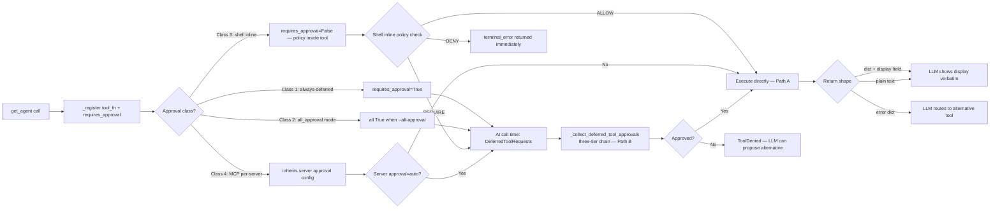

# Flow: Tools Lifecycle

Lifecycle doc for co-cli's tool subsystem — from registration at agent creation through model
exposure, approval classification, execution path dispatch, return shape contract, and error
handling. Covers all four tool families: native execution, integrations, delegation, and MCP.



## Entry Conditions

- `get_agent()` is called during session startup.
- `CoDeps` is fully populated with runtime scalars (API keys, paths, approval state, skill grants).
- MCP servers (if any) are initialized before tool registration.

---

## Part 1: Tool Registration

All native tools are registered via `_register(fn, requires_approval)` inside `get_agent()`.
No `tool_plain()` calls remain — every tool uses `agent.tool()` with `RunContext[CoDeps]`.

### Registration pattern

```
_register(tool_fn, requires_approval: bool):
  agent.tool(tool_fn, requires_approval=requires_approval)

get_agent() registers tools in groups:
  execution tools (shell, file, background, todo, capabilities)
  integration tools (memory, Obsidian, Google Drive/Gmail/Calendar, web)
  delegation tools (delegate_coder, delegate_research, delegate_analysis)
  MCP tools (auto-prefixed, per-server approval config)
```

`requires_approval` is set explicitly at registration time, not inferred. The flag tells
pydantic-ai whether to return a `DeferredToolRequests` or execute immediately.

### `get_agent` return contract

```
returns: (agent, model_settings, tool_names, tool_approval)
  tool_names:    list[str] — all registered tool names exposed to the model
  tool_approval: dict[str, bool] — per-tool approval flag for display/audit
```

---

## Part 2: Model-Facing API — Docstring as Contract

The model's only interface to a tool is its docstring. Tool schemas (name + docstring + parameter
types) are delivered as JSON in the API call body — separate from system prompt, never consuming
system prompt budget (~17,000 chars for 35 tools).

### Four-dimension docstring standard (D1–D4)

| Dim | Name | Required | Content |
|-----|------|----------|---------|
| D1 | What it does | Always | One action sentence — verb + object + return shape |
| D2 | What it returns | Always | Key fields, format, how to present to user |
| D3 | When/how to use | Unless nothing to say | Routing, alternatives, pagination, scope boundaries, fallback guidance |
| D4 | Caveats | Unless nothing to say | Limits, failure modes, silent failures, what NOT to do |

D3 sub-patterns (D3a–D3g) address cross-tool references, disambiguation, pagination, use-case
enumeration, scope boundaries, conditional behavior, and fallback guidance.

Violation anti-patterns: `AP1` pagination described as user-driven, `AP2` one-way routing refs,
`AP3` silent result caps undocumented, `AP4` framework params documented, `AP5` padding on simple
tools, `AP6` create-but-not-send not stated.

---

## Part 3: Approval Classification

Four classes of approval behavior, applied before any tool executes.

### Class 1 — Always deferred (requires_approval=True)

Tools registered with `requires_approval=True` always return `DeferredToolRequests` on first
invocation. The approval loop in `run_turn()` collects user decisions.

Tools: `save_memory`, `save_article`, `write_file`, `edit_file`, `start_background_task`,
`create_email_draft`.

### Class 2 — Conditional (all_approval mode)

When `all_approval=True` is passed to `get_agent()` (set by `--all-approval` CLI flag), ALL tools
are registered with `requires_approval=True`, regardless of their default setting. Used for
high-caution sessions.

### Class 3 — Shell with inline policy (requires_approval=False at registration)

`run_shell_command` is registered with `requires_approval=False`. Policy enforcement lives inside
the tool body, not at the registration boundary.

```
run_shell_command(cmd) internal policy check:
  check deps.exec_approvals (persistent patterns from .co-cli/exec-approvals.json):
    match? → ALLOW (execute without deferral)
  check safe_shell_commands prefix list:
    match? → ALLOW (auto-execute read-only commands)
  classify risk:
    DENY class (e.g. rm -rf /)? → terminal_error dict immediately
    otherwise → raise ApprovalRequired → deferred to chat loop [y/n/a]

"a" persistence for shell tools:
  derives fnmatch pattern (e.g. "git commit *")
  appends to .co-cli/exec-approvals.json → cross-session persistent
```

All other tools' `"a"` adds tool name to `deps.session.session_tool_approvals` — session-only.

### Class 4 — MCP with per-server config

MCP tools are auto-registered from external server definitions. Their approval flag inherits from
the server's configured approval mode. Each MCP tool name is auto-prefixed with the server name
to prevent collisions.

### Three-tier approval decision chain (per pending call in _collect_deferred_tool_approvals)

```
tier 1: skill allowed-tools grant
  check tool_name in deps.session.skill_tool_grants
  match → auto-approve (no prompt)

tier 2: session auto-approve
  check tool_name in deps.session.session_tool_approvals
  match → auto-approve (no prompt)

tier 3: user prompt
  frontend.prompt_approval(desc) → [y/n/a]
  y → approve once
  n → ToolDenied (synthetic ToolReturnPart injected, history stays valid)
  a → add to deps.session.session_tool_approvals (session) or exec-approvals.json (shell)
```

---

## Part 4: Execution Path Classes

### Path A — Read-only auto-execute

Registration: `requires_approval=False`. No deferral. Executes synchronously within `agent.run()`.

Tools: `web_search`, `web_fetch`, `read_file`, `list_directory`, `find_in_files`, `search_memories`,
`list_memories`, `update_memory`, `append_memory`, `read_note`, `search_knowledge`, `list_notes`,
`read_article_detail`, `todo_read`, `check_task_status`, `list_background_tasks`,
`cancel_background_task`, `check_capabilities`, `delegate_*` tools (delegation execution is
internal).

Note: `update_memory` and `append_memory` are registered with `requires_approval=False` (edit
existing files only, lower risk than creating new memories). They are only deferred when
`all_approval=True` is passed to `get_agent()` (eval/high-caution mode) — see Class 2 above.

### Path B — Side-effectful deferred

Registration: `requires_approval=True`. Returns `DeferredToolRequests`. Chat loop prompts user.
On approval: `run_turn()` calls `_stream_events(None, deferred_results=approvals)`. Tool executes.
On denial: `ToolDenied` injected, model sees synthetic return, can offer alternative.

Tools: `save_memory`, `save_article`, `write_file`, `edit_file`, `start_background_task`,
`create_email_draft`.

### Path C — Shell with inline policy (see Class 3 above)

Policy evaluated inside tool before any pydantic-ai deferral mechanism. Denial exits via
`terminal_error` without entering the approval loop. Deferral happens via `ApprovalRequired`
exception when policy says prompt.

### Path D — MCP with per-server config

MCP server definition specifies approval mode. `_orchestrate.py` applies per-server config
when handling `DeferredToolRequests` for MCP tools. Execution is proxied to the external server
via stdio transport. Timeout and error handling matches native tool conventions.

---

## Part 5: Return Shape Contract

### Standard return: dict[str, Any] with display field

```
{
  "display": "<pre-formatted string, shown verbatim to user>",
  "count": N,          ← metadata (optional, tool-specific)
  "has_more": bool,    ← pagination signal
  "next_page_token": str,  ← when paginated
  ... additional metadata fields
}
```

The `display` field is pre-formatted with URLs baked in. The model presents it verbatim or
uses metadata fields for follow-up pagination calls.

### Plain text return (exceptions)

Some tools intentionally return plain text (str) instead of a dict:
- `run_shell_command` success path
- `read_note`
- `read_drive_file`
- `create_email_draft`

### Error return

```
terminal_error(msg) → {"display": msg, "error": True}
```

The `"error": True` flag signals the model to stop looping and route to an alternative path
rather than retry the same call.

---

## Part 6: Error Classification

| Error type | Mechanism | When to use |
|-----------|-----------|-------------|
| `ModelRetry(msg)` | pydantic-ai retries the tool call (up to `tool_retries`) | Pre-request validation failures; transient operational failures where retry may succeed |
| `terminal_error(msg)` | Returns `{"display": ..., "error": True}`; no retry | Missing credentials, policy DENY, unsupported content type, resource not found — retrying the same call will not help |

pydantic-ai `tool_retries` default: 3.

---

## Part 7: Tool Families Overview

| Family | Doc | Tools |
|--------|-----|-------|
| Execution | DESIGN-tools-execution.md | `run_shell_command`, `read_file`, `write_file`, `edit_file`, `list_directory`, `find_in_files`, `start_background_task`, `check_task_status`, `list_background_tasks`, `cancel_background_task`, `todo_write`, `todo_read`, `check_capabilities` |
| Integrations | DESIGN-tools-integrations.md | `save_memory`, `search_memories`, `list_memories`, `update_memory`, `append_memory`, `save_article`, `search_knowledge`, `read_article_detail`, `list_notes`, `read_note`, `search_notes`, `search_drive_files`, `read_drive_file`, `search_emails`, `list_emails`, `create_email_draft`, `list_calendar_events`, `search_calendar_events`, `web_search`, `web_fetch` |
| Delegation | DESIGN-tools-delegation.md | `delegate_coder`, `delegate_research`, `delegate_analysis` |
| MCP | DESIGN-mcp-client.md | External server tools (auto-prefixed, per-server approval) |

### Debugging map

| Capability needed | Tool family | Entry point |
|------------------|-------------|-------------|
| Run a shell command | Execution | `run_shell_command` |
| Read/write workspace files | Execution | `read_file`, `write_file`, `edit_file` |
| Long-running subprocess | Execution | `start_background_task` → `check_task_status` |
| Save a user preference/decision | Integrations | `save_memory` (approval-gated) |
| Recall past context | Integrations | `search_memories` or (injected by `inject_opening_context`) |
| Save a reference article | Integrations | `save_article` (approval-gated) |
| Search all knowledge sources | Integrations | `search_knowledge` |
| Read Obsidian notes | Integrations | `search_notes` → `read_note` |
| Search/read Google Drive | Integrations | `search_drive_files` → `read_drive_file` |
| Web search + fetch | Integrations | `web_search` → `web_fetch` |
| Deep code analysis | Delegation | `delegate_coder` (requires `role_models["coding"]`) |
| Web research synthesis | Delegation | `delegate_research` (requires `role_models["research"]`) |
| Knowledge-base synthesis | Delegation | `delegate_analysis` (requires `role_models["analysis"]`) |

---

## Failure Paths

| Failure | Behavior |
|---------|----------|
| `ApprovalRequired` raised inside `run_shell_command` | Becomes `DeferredToolRequests`; chat loop prompts user |
| User denies approval | `ToolDenied` injected as synthetic `ToolReturnPart`; model can propose alternative |
| `ModelRetry` raised | pydantic-ai retries tool call up to `tool_retries` times |
| `terminal_error` returned | Model sees `{"error": True}` and stops retrying; routes to alternative |
| Delegation tool with empty `role_models` config | Returns error dict without raising; model reports capability disabled |
| MCP server unavailable | Tool call returns error; treated as `terminal_error` class |
| Tool output exceeds trim threshold in history | Trimmed by `truncate_tool_returns` processor on next turn (preserves tool_name/id) |

---

## Owning Code

| File | Role |
|------|------|
| `co_cli/tools/*.py` | All native tool implementations |
| `co_cli/agent.py` | `_register()` function, `get_agent()` tool registration loop, `tool_names` / `tool_approval` return |
| `co_cli/_orchestrate.py` | `_collect_deferred_tool_approvals()` three-tier decision chain, tool result display, `_check_skill_grant()` |
| `co_cli/_exec_approvals.py` | Persistent shell exec approvals: `derive_pattern`, `find_approved`, `add_approval` |
| `co_cli/deps.py` | `CoSessionState.session_tool_approvals`, `CoSessionState.skill_tool_grants`, `CoSessionState.active_skill_env`, `CoSessionState.session_todos` |

## See Also

- `docs/DESIGN-tools.md` — Common conventions, approval table, docstring standard, cross-tool routing
- `docs/DESIGN-tools-execution.md` — Shell tool policy, file tools, background tasks, todo
- `docs/DESIGN-tools-integrations.md` — Memory, Obsidian, Google, web tools
- `docs/DESIGN-tools-delegation.md` — Coder, research, analysis sub-agents
- `docs/DESIGN-flow-approval.md` — Approval flow detail (three-tier chain, persistence semantics)
