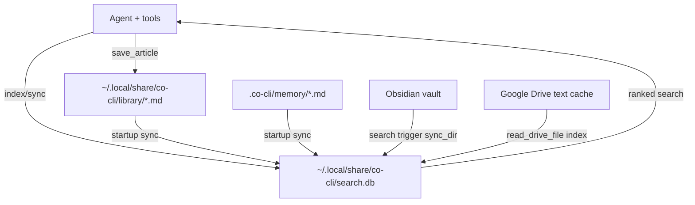

# Knowledge System

## 1. What & How

The knowledge system provides durable storage and ranked retrieval for reference material and external content. It has two layers: markdown files as source of truth (library articles in `~/.local/share/co-cli/library/`, Obsidian vault, Google Drive) and a derived SQLite search index (`search.db`) for ranked retrieval. A single `KnowledgeIndex` engine serves all sources under a unified source namespace.

Memory (agent state) is a separate subsystem documented in [DESIGN-memory.md](DESIGN-memory.md). The knowledge system handles the library and external sources only; memory tools route through their own write paths.

## 2. Core Logic

### 2.0 Source namespace

The `KnowledgeIndex` partitions all indexed content by `source` label:

| Source | Meaning | Storage |
|--------|---------|---------|
| `"memory"` | Agent memory — project-local, lifecycle-managed | `.co-cli/memory/*.md` |
| `"library"` | User-global library — saved references, shared across all co instances | `~/.local/share/co-cli/library/*.md` |
| `"obsidian"` | External vault — Obsidian notes | Obsidian vault path |
| `"drive"` | External cloud — Google Drive docs | Drive `file_id` (virtual path) |

Memory and library have distinct scopes: memory is per-project (`.co-cli/` under `cwd`), library is user-global (`~/.local/share/co-cli/library/`, configurable via `CO_LIBRARY_PATH`). See [DESIGN-memory.md](DESIGN-memory.md) for the memory lifecycle.

### 2.1 Article frontmatter schema

Articles (`kind: "article"`) use the following frontmatter fields:
- `id: int`, `created: ISO8601`
- `kind: "article"`
- `origin_url: str` — dedup key (URL equality check on save)
- `provenance: "web-fetch"` — always set to `web-fetch` on initial save
- `decay_protected: true` — never auto-deleted by retention cap
- `tags: list[str]`
- `title: str | null`
- `updated: ISO8601 | null` — set on re-save consolidation

No `certainty` field — articles are external reference content, not user-state assertions.

> **Full lifecycle spec:** [DESIGN-flow-knowledge-lifecycle.md](DESIGN-flow-knowledge-lifecycle.md) — backend resolution at wakeup (hybrid→fts5→grep degradation), startup sync sequence, article save/dedup write path, index write triggers by source, retrieval surfaces (`search_knowledge`, `read_article_detail`), Obsidian/Drive sources, failure and fallback behavior.

### 2.2 KnowledgeIndex internals

`KnowledgeIndex` schema:
- `docs` table: `source`, `kind`, `path`, `title`, `content`, `tags`, `created`, `updated`, `mtime`, `hash`, `provenance`, `certainty`, `category`, `chunk_id`. UNIQUE constraint is `(source, path, chunk_id)`.
- `docs_fts` virtual table (FTS5) indexes `title`, `content`, `tags`.
- FTS triggers keep `docs_fts` synchronized with `docs` on insert/update/delete.
- `embedding_cache`: generated embeddings keyed by `(provider, model, content_hash)`.
- Tag filtering is done in-process by string-splitting the space-separated `docs.tags` column; no junction table exists.
- Hybrid mode: `docs_vec` (`sqlite-vec`) stores vectors keyed by `rowid`.

Sync/index mechanics:
- Hash-based change detection (`needs_reindex`) prevents unchanged writes (anchored to `chunk_id=0`).
- `sync_dir(source, directory, kind_filter?)` recursively scans `**/*.md`. Optional `kind_filter` skips files whose frontmatter `kind` doesn't match.
- `remove_stale(source, current_paths, directory?)` deletes rows for disappeared files. Optional `directory` scope prevents sibling-folder eviction during partial syncs. Returns count of unique paths removed (not chunk rows).

Chunking:
- When `chunk_size > 0` and content exceeds `chunk_size` chars, `index()` splits content into overlapping windows (`step = chunk_size - chunk_overlap`). Each chunk is stored as a separate row with the same `path` and metadata but a unique `chunk_id` (0, 1, 2, …).
- `search()` deduplicates results by `path`, keeping the highest-scoring chunk per document — callers always receive at most one result per source path.
- `_fetch_reranker_texts()` fetches from `chunk_id=0` to ensure deterministic reranker input.

FTS query behavior:
- Query tokens are lowercased, stopwords removed, length > 1, AND-joined.
- If all tokens are filtered out, search returns empty.
- Tag filters are exact token membership checks against space-separated `docs.tags`.
- Temporal filters (`created_after`, `created_before`) filter `docs.created`.
- Tag match mode `"all"` requires all requested tags; `"any"` requires at least one.

Scoring:
- FTS BM25 rank converted to `score = 1 / (1 + abs(rank))`.
- Hybrid merge: `vector_weight * vec_score + text_weight * fts_score`.

Reranking:
- Provider options: `none`, `local`, `ollama`, `gemini`.
- `local` uses fastembed cross-encoder (if installed); graceful passthrough otherwise.
- `ollama` / `gemini` use listwise ranking prompts and map ranking position to descending scores.
- Reranker failures are non-fatal and fall back to unranked candidate order.

### 2.3 Known limitations

1. `read_article_detail` prefix fallback returns the first glob match without deterministic disambiguation when multiple articles share a slug prefix.
2. `save_article` dedup uses strict raw URL equality; equivalent normalized URLs can still produce duplicates.

## 3. Config

### 3.1 Knowledge retrieval settings

| Setting | Env Var | Default | Description |
|---------|---------|---------|-------------|
| `knowledge_search_backend` | `CO_KNOWLEDGE_SEARCH_BACKEND` | `"fts5"` | Retrieval backend: `grep`, `fts5`, `hybrid` |
| `knowledge_embedding_provider` | `CO_KNOWLEDGE_EMBEDDING_PROVIDER` | `"ollama"` | Embedding provider for hybrid mode: `ollama`, `gemini`, `none` |
| `knowledge_embedding_model` | `CO_KNOWLEDGE_EMBEDDING_MODEL` | `"embeddinggemma"` | Embedding model name sent to provider |
| `knowledge_embedding_dims` | `CO_KNOWLEDGE_EMBEDDING_DIMS` | `256` | Embedding dimensionality for `docs_vec` |
| `knowledge_hybrid_vector_weight` | (none) | `0.7` | Hybrid merge vector score weight; passed directly to `KnowledgeIndex.__init__()` |
| `knowledge_hybrid_text_weight` | (none) | `0.3` | Hybrid merge FTS score weight; passed directly to `KnowledgeIndex.__init__()` |
| `knowledge_reranker_provider` | `CO_KNOWLEDGE_RERANKER_PROVIDER` | `"local"` | Reranker provider: `none`, `local`, `ollama`, `gemini` |
| `knowledge_reranker_model` | `CO_KNOWLEDGE_RERANKER_MODEL` | `""` | Optional reranker model override |
| `knowledge_chunk_size` | `CO_CLI_KNOWLEDGE_CHUNK_SIZE` | `600` | Character window per chunk; 0 = disable chunking |
| `knowledge_chunk_overlap` | `CO_CLI_KNOWLEDGE_CHUNK_OVERLAP` | `80` | Character overlap between adjacent chunks |

### 3.2 Source enablement settings

| Setting | Env Var | Default | Description |
|---------|---------|---------|-------------|
| `library_path` | `CO_LIBRARY_PATH` | `~/.local/share/co-cli/library` | User-global library directory; override to share a library at a custom path. The effective default is resolved in `main.py::create_deps()` as `DATA_DIR / "library"`; the `library_dir` field in `deps.py` has a placeholder relative path (`.co-cli/library`) that is overridden at runtime. |
| `obsidian_vault_path` | `OBSIDIAN_VAULT_PATH` | `None` | Vault path for note indexing/search |
| `google_credentials_path` | `GOOGLE_CREDENTIALS_PATH` | `None` | Credential path for Drive access and indexing on read |

## 4. Files

| File | Purpose |
|------|---------|
| `co_cli/_knowledge_index.py` | Core index engine: schema, sync/index/remove/rebuild, FTS/hybrid/rerank search |
| `co_cli/tools/articles.py` | `save_article`, `recall_article`, `read_article_detail`, `search_knowledge` cross-source retrieval |
| `co_cli/tools/obsidian.py` | `list_notes`, `read_note`, `search_notes` plus index sync on search |
| `co_cli/tools/google_drive.py` | Drive search/read and opportunistic index writes on file read |
| `co_cli/_frontmatter.py` | Frontmatter parsing and validation used by all knowledge files |
| `co_cli/_bootstrap.py` | Startup sync: `sync_dir` for both `memory_dir` and `library_dir` |
| `co_cli/main.py` | Backend resolution, bootstrap sync, `library_dir` path injection |
| `co_cli/config.py` | `library_path` / `CO_LIBRARY_PATH` setting |
| `co_cli/deps.py` | `library_dir: Path`, `knowledge_search_backend` in `CoConfig`; `knowledge_index` in `CoServices` |
| `tests/test_knowledge_index.py` | Functional tests: schema, FTS, sync, hybrid, reranking, kind_filter |
| `tests/test_save_article.py` | Functional tests: save, recall, search_knowledge, contradiction detection, grep fallback |
| `tests/test_bootstrap.py` | Functional tests: startup sync, session restore, backend degradation |
