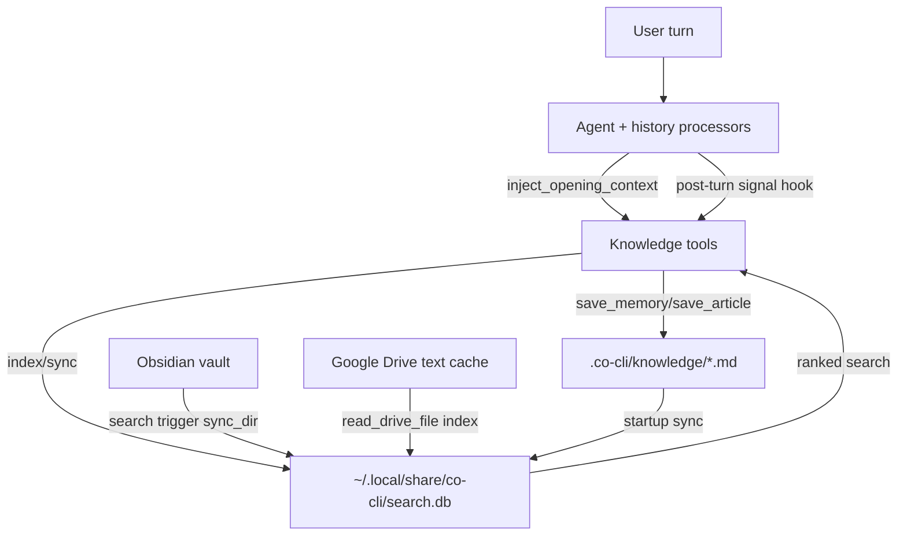

# Knowledge System

## 1. What & How

Co uses one unified knowledge substrate built from two layers: markdown files in `.co-cli/knowledge/` as source of truth, and a derived SQLite search index at `~/.local/share/co-cli/search.db` for ranked retrieval. The same substrate serves conversation memories (`kind: memory`), saved reference articles (`kind: article`), and externally indexed text (Obsidian and Drive) under a shared `KnowledgeIndex`.



## 2. Core Logic

### 2.1 Conceptual model

- Source-of-truth data: flat markdown files in `.co-cli/knowledge/`.
- File kinds:
  - `kind: memory` for user-state facts (preferences, corrections, decisions, context).
  - `kind: article` for externally fetched references.
- Search index: `KnowledgeIndex` (SQLite FTS5, optional hybrid vector + rerank) in `search.db`.
- External namespaces inside the index:
  - `source="memory"` for both memories and articles.
  - `source="obsidian"` for vault notes.
  - `source="drive"` for Drive file content indexed on read.

### 2.2 Storage and frontmatter contract

Knowledge files are parsed by `_frontmatter.parse_frontmatter()` and validated by `validate_memory_frontmatter()` when loaded through memory/article tools.

Required frontmatter fields for knowledge files loaded as memory/article entries:
- `id: int`
- `created: ISO8601 string`

Supported lifecycle and metadata fields:
- `kind: "memory" | "article"` (defaults to `memory` when absent)
- `origin_url: str | null` (article provenance URL)
- `provenance: detected | user-told | planted | web-fetch | session`
- `certainty: "high" | "medium" | "low"` (keyword-classified at write time for memories; absent for articles)
- `tags: list[str]`
- `auto_category: str | null`
- `updated: ISO8601 string | null`
- `consolidation_reason: str | null` (reason recorded when a memory is consolidated in-place; stripped during subsequent consolidation rewrites)
- `decay_protected: bool`
- `title: str | null`
- `related: list[str] | null`

### 2.3 Startup flow

- `create_deps()` resolves knowledge backend adaptively at wakeup:
  - configured `hybrid` -> fallback `fts5` on hybrid init failure -> fallback `grep` if FTS init also fails.
  - configured `fts5` -> fallback `grep` if FTS init fails.
  - resolved backend is written to `deps.knowledge_search_backend` for runtime consistency.
- `run_bootstrap()` then syncs markdown knowledge to the index:
  - If `deps.knowledge_index` exists and `.co-cli/knowledge` exists: `sync_dir("memory", knowledge_dir)`.
  - On sync failure: index is closed and disabled for the session (`deps.knowledge_index = None`), causing runtime fallback to grep-based retrieval.

Index write/sync triggers by source:

| Source | Trigger | Stored `docs.path` |
|--------|---------|--------------------|
| `memory` (memories + articles) | bootstrap `sync_dir`, `save_memory`, `save_article`, `update_memory`, `append_memory`, `/forget` eviction | absolute filesystem path |
| `obsidian` | `search_notes` and `search_knowledge` (when source is `None` or `obsidian`) call `sync_dir` | absolute filesystem path |
| `drive` | `read_drive_file` indexes content after fetch | Drive `file_id` |

### 2.4 KnowledgeIndex internals

`KnowledgeIndex` schema:
- `docs` table stores normalized metadata and content (`source`, `kind`, `path`, `title`, `content`, `tags`, `created`, `updated`, etc.).
- `docs_fts` virtual table (FTS5) indexes `title`, `content`, `tags`.
- FTS triggers keep `docs_fts` synchronized with `docs` on insert/update/delete.
- `embedding_cache` stores generated embeddings by `(provider, model, content_hash)`.
- Hybrid mode creates `docs_vec` (`sqlite-vec`) and stores vectors keyed by `rowid`.

Sync/index mechanics:
- Hash-based change detection (`needs_reindex`) prevents unchanged writes.
- `sync_dir()` recursively scans markdown (`**/*.md` by default).
- `remove_stale()` deletes rows whose files disappeared; optional `directory` scope prevents sibling-folder eviction during partial syncs.

FTS query behavior:
- Query tokens are lowercased, stopwords removed, tokens length `> 1`, and AND-joined.
- If all tokens are removed, search returns empty.
- Tag filters are exact token membership checks against space-separated tags.
- Temporal filters use `created_after` / `created_before` against `docs.created`.

Scoring:
- FTS BM25 rank is converted to `score = 1 / (1 + abs(rank))`.
- Hybrid merge score = `vector_weight * vec_score + text_weight * fts_score`.

Reranking:
- Provider options: `none`, `local`, `ollama`, `gemini`.
- `local` uses fastembed cross-encoder (if installed); otherwise graceful passthrough.
- `ollama` / `gemini` use listwise ranking prompts and map ranking position to descending scores.

### 2.5 Retrieval surfaces

Agent-registered retrieval tools:
- `search_knowledge(query, source?, kind?, tags?, created_after?, created_before?)`
- `list_memories(offset, limit, kind?)`
- `read_article_detail(slug)`

Internal retrieval adapters (not agent-registered):
- `recall_memory(...)`
- `recall_article(...)`
- `search_notes(...)`

#### `search_knowledge` behavior

- Primary cross-source retrieval entrypoint for model calls.
- With index enabled:
  - Optionally syncs Obsidian source before searching (`sync_dir("obsidian", vault_or_folder)` when source is `None` or `obsidian`).
  - Executes ranked index search across chosen source/kind filters.
- Without index:
  - Grep fallback only for `.co-cli/knowledge` files (`source="memory"` only).
  - `obsidian` and `drive` source filters return empty in fallback mode.

#### `recall_memory` behavior (internal)

Used by history processor `inject_opening_context` (not directly callable by the model).

Flow:
1. Search path:
   - FTS path when backend is `fts5`/`hybrid` and index exists.
   - Otherwise grep substring path.
2. Optional filters:
   - Tags (`any` or `all`).
   - `created_after` / `created_before`.
3. FTS candidate conversion to file entries.
4. Temporal decay rescoring (FTS path):
   - Weight from `_decay_multiplier(created, memory_recall_half_life_days)`.
   - `decay_protected` entries are exempt.
5. Dedup pulled results via `_dedup_pulled()`.
6. One-hop relation expansion (`related` slugs, max 5 extra).
7. Gravity touch: `_touch_memory()` updates `updated` timestamp on pulled direct matches.

Important side effect:
- Retrieval can mutate data (`updated` timestamps and dedup-on-read merges/deletes).

#### `recall_article` behavior (internal)

- FTS path if index exists and backend in `fts5`/`hybrid`.
- Grep fallback otherwise.
- Returns summary metadata (`article_id`, `title`, `origin_url`, tags, snippet, slug).
- Full content access is separated into `read_article_detail(slug)`.

### 2.6 Write and mutation surfaces

Agent-registered write tools:
- `save_memory` (requires approval)
- `save_article` (requires approval)
- `update_memory` / `append_memory` (default runtime: no approval; approval only in `all_approval` mode)

Non-tool write paths:
- post-turn signal auto-save in `main.py` via `memory_lifecycle.persist_memory`
- `/new` session checkpoint via `memory_lifecycle.persist_memory`
- `/forget` slash command file deletion + index eviction

#### `save_memory` + `persist_memory`

All write paths route through `memory_lifecycle.persist_memory()`:

`persist_memory(deps, content, tags, related, provenance, title, on_failure, model)` lifecycle:
1. Dedup fast-path: loads recent memories within `memory_dedup_window_days` (capped to 10), checks `rapidfuzz.token_sort_ratio` against candidate. If similarity >= `memory_dedup_threshold`, consolidates existing memory in-place (`updated`, merged tags) and returns.
2. LLM consolidation (when `model` is provided): calls `extract_facts` → `resolve` to produce an action plan (ADD/UPDATE/DELETE/NONE). Applies plan via `apply_plan_atomically`. If plan contains no ADD action, returns without writing a new file. On `asyncio.TimeoutError`: `on_failure="add"` falls through to write; `on_failure="skip"` returns without writing.
3. New file write: creates `{memory_id:03d}-slug.md` with normalized lowercase tags.
4. Retention cap: if total strictly exceeds `memory_max_count`, deletes oldest non-protected entries until under cap (cut-only, no summary creation).
5. FTS reindex for new/consolidated writes when index exists.

Special cases:
- `title` provided (`/new` checkpoints): dedup and consolidation skipped; filename is `{title}.md`.
- `on_failure="add"` (explicit `save_memory` tool): safe fallback to ADD on consolidation timeout.
- `on_failure="skip"` (auto-signal save): skip write on consolidation timeout.

#### Memory retention

Triggered inside `persist_memory` when total memories strictly exceeds `memory_max_count`.

Strategy: cut-only — delete oldest non-protected memories until total is within the cap. No summary-memory creation. No percentage-based decay mode.

#### Precision edits

- `update_memory(slug, old_content, new_content)`:
  - Guards against line-number artifacts.
  - Requires exactly one old-content match after tab normalization.
  - Sets `updated`, rewrites file, reindexes.
- `append_memory(slug, content)`:
  - Appends newline content, sets `updated`, reindexes.

#### `save_article`

- Dedup key: exact `origin_url` string match.
- First save creates `kind: article`, `provenance: web-fetch`, `decay_protected: true`.
- Duplicate URL save consolidates in place (updates content/title/tags/updated).
- Uses shared `.co-cli/knowledge` ID sequence.
- Reindexes after save/consolidation when index exists.

#### `/new` session checkpoint

- Summarizes recent session messages via `_index_session_summary()`.
- Persists summary with:
  - `tags: ["session"]`
  - `provenance: "session"`
  - `title: session-<UTC timestamp>`
- Clears chat history after checkpoint.

#### `/forget` deletion path

- Finds file by `{memory_id:03d}-*.md` (e.g. `005-*.md`) in `.co-cli/knowledge`.
- Deletes the matched file.
- Evicts index row via `knowledge_index.remove("memory", path)` when index exists.

### 2.7 Runtime knowledge injection components

#### Opening context injection (`inject_opening_context`)

Runs as a history processor before every model request:
- Detects new user turn.
- Calls internal `recall_memory(user_message, max_results=3)`.
- If matches exist, appends a `ModelRequest(parts=[SystemPromptPart(...)])`:
  - `Relevant memories:\n<recall display>`.

#### Personality memory injection (`add_personality_memories`)

Runs as `@agent.instructions` on every turn:
- Loads top 5 memories tagged `personality-context` by recency.
- Injects them as `## Learned Context` bullet list.

#### Post-turn signal detector (`analyze_for_signals`)

Runs after successful turns in `main.py`:
- Mini-agent analyzes last conversation window (up to 10 lines of User/Co text).
- Output schema: `{found, candidate, tag: Literal["correction", "preference"] | None, confidence: Literal["high", "low"] | None, inject: bool}`.
- High confidence:
  - Auto-saves immediately through `memory_lifecycle.persist_memory`.
  - Emits status `Learned: ...`.
- Low confidence:
  - Prompts user approval (`y/a` saves, `n` drops).
- If `inject=true`, tag list adds `personality-context` before save.

### 2.8 Retrieval quality signals

#### Write-time certainty classification

When a memory is saved via `persist_memory` (new save or consolidation), `_classify_certainty(content)` assigns a bucket to the `certainty` frontmatter field:
- `"low"` — hedging language detected ("I think", "maybe", "probably", "might", "not sure", "possibly", "I believe", "could be").
- `"high"` — assertive language detected ("always", "never", "definitely", "I always", "I never", "I use", "I prefer", "I don't", "I do not").
- `"medium"` — default when neither pattern matches.

The `certainty` value is also stored in the `docs` table (`certainty TEXT` column) so it is available to retrieval paths at search time. Articles are not certainty-classified (external content, not user assertions).

#### Confidence scoring (`search_knowledge`)

After FTS/hybrid retrieval, `search_knowledge` computes a composite `confidence: float` for each `SearchResult` using `_compute_confidence()` (tool layer, not index engine):

```
confidence = 0.5 * score + 0.3 * decay + 0.2 * (prov_weight * certainty_mult)
```

Where `decay = exp(-ln(2) * age_days / half_life_days)`, capped to `[0.0, 1.0]`.

Provenance weights: `user-told=1.0`, `planted=0.8`, `detected=0.7`, `session=0.6`, `web-fetch=0.5`, `auto_decay=0.3` (legacy), unknown/absent=`0.5`.
Certainty multipliers: `high=1.0`, `medium=0.8`, `low=0.6`, absent=`0.8`.

Confidence is surfaced in the `display` string as `(score: X.XXX, conf: X.XXX)` and in each result dict under the `confidence` key.

#### Contradiction detection (`search_knowledge`)

After confidence computation, `_detect_contradictions(results)` groups results by `category` and checks same-category pairs for opposing polarity using a 5-token window heuristic. If a shared noun/verb appears alongside a negation marker ("not", "no", "never", "don't", "do not", "stopped", "changed", "no longer", "don't use", "avoid") in either result's content, both are flagged.

Flagged results get a `⚠ Conflict: ` prefix in the display line and `"conflict": True` in their result dict. Non-conflicting results carry `"conflict": False` for schema consistency.

Limitation: heuristic window-based detection produces false positives on complex sentences. LLM-based detection is a Phase 2 enhancement.

### 2.9 Failure and fallback behavior

- Wakeup is adaptive: index initialization degrades `hybrid -> fts5 -> grep` (or `fts5 -> grep`) instead of hard-failing session startup.
- If bootstrap knowledge sync fails, index is disabled for the session and tools fall back to grep where supported.
- `search_knowledge` with no index supports memory/article search only; non-memory sources require index.
- Hybrid search gracefully falls back to lexical results when embedding generation/vector path fails.
- Reranker failures are non-fatal and fall back to unranked candidate order.

### 2.10 Current implementation issues detected in code scan

1. `/forget` matches `{memory_id:03d}-*.md` and can delete an `article` sharing that ID, not only memories.
2. `/forget` help text tells users to run `/list_memories`, but that slash command does not exist.
3. `recall_memory` FTS path reorders candidates by temporal decay weight only, which can suppress lexical relevance ordering from FTS.
4. `read_article_detail` prefix fallback returns the first glob match without deterministic disambiguation.
5. `save_article` dedup uses strict raw URL equality; equivalent normalized URLs can still produce duplicates.

## 3. Config

### 3.1 Knowledge retrieval settings

| Setting | Env Var | Default | Description |
|---------|---------|---------|-------------|
| `knowledge_search_backend` | `CO_KNOWLEDGE_SEARCH_BACKEND` | `"fts5"` | Retrieval backend: `grep`, `fts5`, `hybrid` |
| `knowledge_embedding_provider` | `CO_KNOWLEDGE_EMBEDDING_PROVIDER` | `"ollama"` | Embedding provider for hybrid mode: `ollama`, `gemini`, `none` |
| `knowledge_embedding_model` | `CO_KNOWLEDGE_EMBEDDING_MODEL` | `"embeddinggemma"` | Embedding model name sent to provider |
| `knowledge_embedding_dims` | `CO_KNOWLEDGE_EMBEDDING_DIMS` | `256` | Embedding dimensionality for `docs_vec` |
| `knowledge_hybrid_vector_weight` | (none) | `0.7` | Hybrid merge vector score weight. Note: bypasses `CoDeps` — passed directly into `KnowledgeIndex.__init__()` from `create_deps()`. |
| `knowledge_hybrid_text_weight` | (none) | `0.3` | Hybrid merge FTS score weight. Note: bypasses `CoDeps` — passed directly into `KnowledgeIndex.__init__()` from `create_deps()`. |
| `knowledge_reranker_provider` | `CO_KNOWLEDGE_RERANKER_PROVIDER` | `"local"` | Reranker provider: `none`, `local`, `ollama`, `gemini` |
| `knowledge_reranker_model` | `CO_KNOWLEDGE_RERANKER_MODEL` | `""` | Optional reranker model override |

### 3.2 Memory lifecycle settings

| Setting | Env Var | Default | Description |
|---------|---------|---------|-------------|
| `memory_max_count` | `CO_CLI_MEMORY_MAX_COUNT` | `200` | Memory capacity limit; retention cut triggers when total strictly exceeds this |
| `memory_dedup_window_days` | `CO_CLI_MEMORY_DEDUP_WINDOW_DAYS` | `7` | Recency window for write-time dedup candidate scan |
| `memory_dedup_threshold` | `CO_CLI_MEMORY_DEDUP_THRESHOLD` | `85` | Similarity threshold (0-100) for dedup consolidation |
| `memory_consolidation_top_k` | `CO_MEMORY_CONSOLIDATION_TOP_K` | `5` | Number of recent memories to consider for LLM consolidation |
| `memory_consolidation_timeout_seconds` | `CO_MEMORY_CONSOLIDATION_TIMEOUT_SECONDS` | `20` | Per-call timeout for consolidation LLM calls (extract_facts, resolve) |
| `memory_recall_half_life_days` | `CO_MEMORY_RECALL_HALF_LIFE_DAYS` | `30` | Half-life used by temporal decay rescoring in FTS recall path |

### 3.3 Source enablement settings

| Setting | Env Var | Default | Description |
|---------|---------|---------|-------------|
| `obsidian_vault_path` | `OBSIDIAN_VAULT_PATH` | `None` | Vault path for note indexing/search |
| `google_credentials_path` | `GOOGLE_CREDENTIALS_PATH` | `None` | Credential path for Drive access and indexing on read |

## 4. Files

| File | Purpose |
|------|---------|
| `co_cli/knowledge_index.py` | Core index engine: schema, sync/index/remove/rebuild, FTS/hybrid/rerank search |
| `co_cli/memory_lifecycle.py` | Write entrypoint for all memory save paths: dedup → consolidation → write → retention |
| `co_cli/memory_consolidator.py` | LLM-driven fact extraction and contradiction resolution (two-phase mini-agent) |
| `co_cli/memory_retention.py` | Cut-only retention enforcement: delete oldest non-protected until under cap |
| `co_cli/tools/memory.py` | Memory recall/list/edit tools and shared helpers (`_load_memories`, `_check_duplicate`, etc.) |
| `co_cli/tools/articles.py` | Article save/recall/detail and `search_knowledge` cross-source retrieval |
| `co_cli/tools/personality.py` | Loads `personality-context` memories for per-turn instruction injection |
| `co_cli/tools/obsidian.py` | Note search/list/read plus index sync on search |
| `co_cli/tools/google_drive.py` | Drive search/read and opportunistic index writes on file read |
| `co_cli/_frontmatter.py` | Frontmatter parsing and validation rules used by knowledge files |
| `co_cli/_bootstrap.py` | Startup knowledge sync: calls `sync_dir` on `.co-cli/knowledge` at session start |
| `co_cli/_history.py` | Opening-context recall injector and compaction logic |
| `co_cli/_signal_analyzer.py` | LLM mini-agent for post-turn signal detection |
| `co_cli/prompts/agents/signal_analyzer.md` | Signal classification policy prompt |
| `co_cli/main.py` | Runtime hooks: bootstrap sync, post-turn signal save, session checkpoint flow |
| `co_cli/_commands.py` | `/new` checkpoint and `/forget` delete flows affecting knowledge store |
| `co_cli/agent.py` | Agent factory and tool registration (agent-facing vs internal knowledge surfaces) |
| `co_cli/prompts/agents/memory_consolidator.md` | Two-phase prompt: fact extraction + contradiction resolution |
