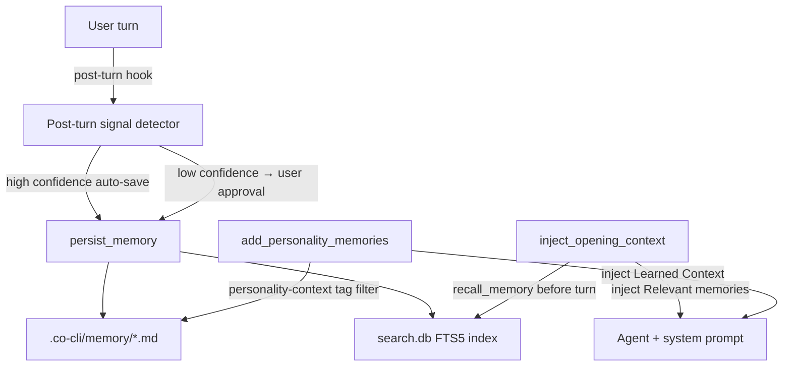

# Memory System

## 1. What & How

Agent memory is per-project agent state — facts the agent has learned through conversation (preferences, corrections, decisions, contextual signals). Memory files live in `.co-cli/memory/` (project-local), are lifecycle-managed (dedup → optional LLM consolidation → retention cap), and are proactively injected into context before each turn via history processors.



Memory is distinct from the library (articles). Memory is agent state about *this user in this project* — temporal, correctable, per-project. Articles are reference knowledge — curated, shared across projects. See [DESIGN-knowledge.md](DESIGN-knowledge.md) for the knowledge/library system.

## 2. Core Logic

### 2.0 Conceptual model

Memory files are the source of truth. They are plain markdown files with YAML frontmatter in `.co-cli/memory/`. A derived FTS5 index in `search.db` provides ranked retrieval. The lifecycle enforces:

- **Dedup on write**: near-duplicates consolidate in-place instead of creating a new file.
- **Optional LLM consolidation**: a two-phase mini-agent resolves contradictions and merges related facts.
- **Retention cap**: oldest non-protected memories are cut when total exceeds `memory_max_count`.
- **Temporal decay on recall**: recent memories score higher in FTS retrieval.
- **Gravity**: recalled memories get their `updated` timestamp refreshed (used for recency scoring).

Memory scope is project-local. Different projects (different `cwd`) have separate `.co-cli/memory/` directories and do not share memories.

### 2.1 Frontmatter contract

Memory files require:
- `id: int` — sequential file ID
- `created: ISO8601 string` — write timestamp

Supported lifecycle fields:
- `kind: "memory"` — explicit kind marker
- `provenance: detected | user-told | planted | session` — origin of the fact
- `certainty: "high" | "medium" | "low"` — keyword-classified at write time
- `tags: list[str]` — lowercase, used for routing and filtering
- `auto_category: str | null` — LLM-assigned category slug
- `updated: ISO8601 string | null` — set by consolidation, edits, or gravity
- `consolidation_reason: str | null` — recorded when consolidated; stripped on next rewrite
- `decay_protected: bool` — exempt from retention cut and decay rescoring
- `title: str | null` — used for named checkpoints (e.g. session files)
- `related: list[str] | null` — slug references for one-hop link traversal on recall

Certainty is not set for articles (external content is not a user-state assertion).

### 2.2 Write path: `persist_memory`

All memory writes route through `memory_lifecycle.persist_memory(deps, content, tags, related, provenance, title, on_failure, model)`:

1. **Dedup fast-path**: loads recent memories within `memory_dedup_window_days` (capped to 10). Checks `rapidfuzz.token_sort_ratio` against each candidate. If similarity >= `memory_dedup_threshold`, calls `_update_existing_memory`: replaces body with new content, union-merges tags, refreshes `updated`, re-classifies `certainty`, re-detects `provenance` and `auto_category`, strips stale `consolidation_reason`. Returns without writing a new file.

2. **LLM consolidation** (when `model` provided): calls `memory_consolidator` two-phase pipeline (`extract_facts` → `resolve`) to produce an action plan. Applies plan via `apply_plan_atomically`:
   - UPDATE: touches the matched entry (refreshes `updated`, re-classifies `certainty`; no content change).
   - DELETE: removes the file (skipped silently for `decay_protected` entries).
   - If plan contains no ADD action, returns without writing a new file.
   - On `asyncio.TimeoutError`: `on_failure="add"` falls through to write; `on_failure="skip"` returns without writing.

3. **New file write**: creates `{memory_id:03d}-slug.md` with frontmatter. Tags are normalized to lowercase.

4. **Retention cap**: if total strictly exceeds `memory_max_count`, deletes oldest non-protected entries (by `created`) until under cap. Cut-only — no summary creation.

5. **FTS reindex**: new and consolidated writes are reindexed when `knowledge_index` is set.

Special cases:
- `title` provided (e.g. `/new` checkpoints): dedup and consolidation skipped; filename is `{title}.md`.
- `on_failure="add"` (explicit `save_memory` tool): safe fallback to ADD on consolidation timeout.
- `on_failure="skip"` (auto-signal save): skip write on consolidation timeout.

### 2.3 Precision edits

**`update_memory(slug, old_content, new_content)`**:
- Guards against Read-tool line-number artifacts in `old_content`.
- Normalizes tabs via `expandtabs()` before matching.
- Requires exactly one occurrence of `old_content` in the body (ambiguous or missing → `ValueError`).
- Sets `updated`, rewrites file, reindexes.

**`append_memory(slug, content)`**:
- Appends a newline + `content` to end of body.
- Sets `updated`, reindexes.

### 2.4 `/new` session checkpoint

- Summarizes recent session messages via `_index_session_summary()`.
- Calls `persist_memory` with `title="session-<UTC timestamp>"`, `tags=["session"]`, `provenance="session"`.
- Dedup and LLM consolidation are skipped (title-based write path).
- Clears chat history after checkpoint.

### 2.5 `/forget` deletion

- Scans `deps.memory_dir` for `{memory_id:03d}-*.md`.
- Deletes the matched file.
- Evicts the index row via `knowledge_index.remove("memory", absolute_path)` when index exists.

### 2.6 Read paths

**`recall_memory(query, ...)` (internal)**

Defined with a `RunContext[CoDeps]` signature and called directly by `inject_opening_context`. It is intentionally NOT registered via `_register()` in `agent.py`, so the LLM cannot invoke it as a tool call.

1. FTS path (when `backend=fts5/hybrid` and index exists): ranked BM25 search.
2. Grep fallback otherwise: substring scan of `.co-cli/memory/`.
3. Optional tag filters (`any` or `all`), temporal filters (`created_after`/`created_before`).
4. Temporal decay rescoring (FTS path): weight = `exp(-ln(2) * age_days / half_life_days)`. `decay_protected` entries are exempt.
5. Dedup pulled results via `_dedup_pulled()` (merges near-duplicate results).
6. One-hop relation expansion: follows `related` slug references, adds up to 5 extra.
7. Gravity touch: `_touch_memory()` refreshes `updated` on directly matched entries.

#### Retrieval mutation contract

Recall is read+maintenance, not read-only. The following mutations occur on every
`recall_memory` call in both FTS and grep paths:

- `_touch_memory()`: refreshes the `updated` frontmatter timestamp on each directly matched entry.
- `_dedup_pulled()`: may merge and delete older duplicate entries; deleted files are also evicted
  from the FTS index via `knowledge_index.remove()`.

Runtime call chain:
  `inject_opening_context` → `recall_memory` → `_dedup_pulled` / `_touch_memory`

Both side effects are intentional lifecycle mechanics, not accidental write amplification.
`decay_protected` entries are exempt from dedup deletion but still receive touch updates.

**`search_memories(query, limit?)` (agent-registered)**

Dedicated memory search. Always `source="memory"`. FTS path when index available; grep fallback otherwise. Returns ranked results with confidence and conflict fields populated.

**`list_memories(offset, limit)` (agent-registered)**

Paginates `_load_memories(memory_dir)` — reads from `deps.memory_dir` only.

### 2.7 Runtime injection

**Opening context injection (`inject_opening_context`)**

History processor that runs before every model request:
- Detects new user turn.
- Calls internal `recall_memory(user_message, max_results=3)`.
- If matches exist, appends a new `ModelRequest(parts=[SystemPromptPart(...)])` to the end of the message list: `Relevant memories:\n<recall display>`. It is a sibling message, not a part added to the existing user turn.

**Personality memory injection (`add_personality_memories`)**

Runs as `@agent.instructions` on every turn:
- `_load_personality_memories()` in `tools/personality.py` hardcodes `Path.cwd() / ".co-cli" / "memory"` — it does not access `deps` at all. Functionally equivalent in normal operation since `main.py` sets `memory_dir` to the same path, but the function is not deps-aware.
- Loads top 5 memories tagged `personality-context` by recency.
- Injects them as `## Learned Context` bullet list in the system prompt.

### 2.8 Post-turn signal detection

Runs after successful turns in `main.py` via `analyze_for_signals()` (mini-agent):
- Analyzes last conversation window (up to 10 lines of User/Co text).
- Output schema: `{found, candidate, tag: "correction" | "preference" | None, confidence: "high" | "low" | None, inject: bool}`.
- **High confidence**: auto-saves via `persist_memory(on_failure="skip")`. Emits status `Learned: ...`.
- **Low confidence**: prompts user approval (`y/a` saves, `n` drops).
- If `inject=true`: adds `personality-context` to tag list before save.

### 2.9 Quality signals

**Write-time certainty classification**

When a memory is saved or consolidated, `_classify_certainty(content)` assigns a bucket:
- `"low"` — hedging language ("I think", "maybe", "probably", "might", "not sure", "possibly", "I believe", "could be").
- `"high"` — assertive language ("always", "never", "definitely", "I always", "I never", "I use", "I prefer", "I don't", "I do not").
- `"medium"` — default when neither pattern matches.

Stored in `certainty` frontmatter and in `docs.certainty` column for search-time use.

**Confidence scoring (`search_knowledge` / `search_memories`)**

After FTS/hybrid retrieval, a composite `confidence: float` is computed per result:

```
confidence = 0.5 * score + 0.3 * decay + 0.2 * (prov_weight * certainty_mult)
```

Where `decay = exp(-ln(2) * age_days / half_life_days)`, capped to `[0.0, 1.0]`.

Provenance weights: `user-told=1.0`, `planted=0.8`, `detected=0.7`, `session=0.6`, `web-fetch=0.5`, `auto_decay=0.3`, absent=`0.5`.
Certainty multipliers: `high=1.0`, `medium=0.8`, `low=0.6`, absent=`0.8`.

**Contradiction detection (`search_knowledge` only)**

After confidence computation, `_detect_contradictions(results)` groups results by `auto_category` and checks same-category pairs for opposing polarity using a 5-token window heuristic. If a shared noun/verb appears alongside a negation marker ("not", "no", "never", "don't", "do not", "stopped", "changed", "no longer") in either result's content, both are flagged. `_detect_contradictions` is called only in `search_knowledge` (`tools/articles.py`). `search_memories` (`tools/memory.py`) does not call it — neither the FTS path nor the grep fallback.

Flagged results get a `⚠ Conflict: ` prefix in the display line and `"conflict": True` in their result dict.

Limitation: heuristic window-based detection produces false positives on complex sentences.

### 2.10 Known limitations

1. `/forget` help text references `/list_memories`, which is not a slash command.
2. `recall_memory` FTS path reorders by temporal decay weight only, which can suppress lexical relevance ordering from BM25.

## 3. Config

| Setting | Env Var | Default | Description |
|---------|---------|---------|-------------|
| `memory_max_count` | `CO_CLI_MEMORY_MAX_COUNT` | `200` | Capacity limit; retention cut triggers when total strictly exceeds this |
| `memory_dedup_window_days` | `CO_CLI_MEMORY_DEDUP_WINDOW_DAYS` | `7` | Recency window for write-time dedup candidate scan |
| `memory_dedup_threshold` | `CO_CLI_MEMORY_DEDUP_THRESHOLD` | `85` | Similarity threshold (0–100) for dedup consolidation |
| `memory_consolidation_top_k` | `CO_MEMORY_CONSOLIDATION_TOP_K` | `5` | Recent memories considered for LLM consolidation |
| `memory_consolidation_timeout_seconds` | `CO_MEMORY_CONSOLIDATION_TIMEOUT_SECONDS` | `20` | Per-call timeout for consolidation LLM calls |
| `memory_recall_half_life_days` | `CO_MEMORY_RECALL_HALF_LIFE_DAYS` | `30` | Half-life (days) for temporal decay rescoring in FTS recall; `decay_protected` entries are exempt |

## 4. Files

| File | Purpose |
|------|---------|
| `co_cli/memory_lifecycle.py` | Write entrypoint: dedup → consolidation → write → retention cap |
| `co_cli/memory_consolidator.py` | LLM-driven fact extraction and contradiction resolution (two-phase mini-agent) |
| `co_cli/memory_retention.py` | Cut-only retention enforcement: delete oldest non-protected until under cap |
| `co_cli/tools/memory.py` | `save_memory`, `recall_memory`, `search_memories`, `list_memories`, `update_memory`, `append_memory` + shared helpers (`_load_memories`, `_check_duplicate`, etc.) |
| `co_cli/tools/personality.py` | Loads `personality-context` memories for per-turn instruction injection |
| `co_cli/_frontmatter.py` | Frontmatter parsing and validation for memory files |
| `co_cli/_history.py` | `inject_opening_context` history processor — proactive recall injection |
| `co_cli/_signal_analyzer.py` | LLM mini-agent for post-turn signal detection |
| `co_cli/prompts/agents/signal_analyzer.md` | Signal classification policy prompt |
| `co_cli/prompts/agents/memory_consolidator.md` | Two-phase consolidation prompt: fact extraction + contradiction resolution |
| `co_cli/_commands.py` | `/new` checkpoint and `/forget` delete flows |
| `co_cli/main.py` | Post-turn signal hook, bootstrap memory sync |
| `co_cli/agent.py` | Agent tool registration for memory surface |
| `co_cli/deps.py` | `memory_dir: Path`, memory scalar config fields in `CoDeps` |
| `tests/test_memory_lifecycle.py` | Functional tests: consolidation, dedup, retention, on_failure fallback |
| `tests/test_memory_decay.py` | Functional tests: retention cut, certainty, tag normalization |
| `tests/test_memory.py` | Functional tests: save, recall, gravity, dedup, precision edits, search |
