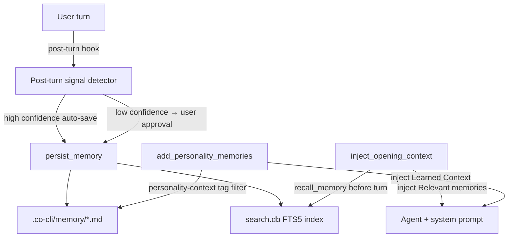

# Memory System

## 1. What & How

Agent memory is per-project agent state — facts the agent has learned through conversation (preferences, corrections, decisions, contextual signals). Memory files live in `.co-cli/memory/` (project-local), are lifecycle-managed (dedup → optional LLM consolidation → retention cap), and are proactively injected into context before each turn via history processors.

Memory is distinct from the library (articles). Memory is agent state about *this user in this project* — temporal, correctable, per-project. Articles are reference knowledge — curated, shared across projects. See [DESIGN-knowledge.md](DESIGN-knowledge.md) for the knowledge/library system.

## 2. Core Logic

### 2.0 Conceptual model

Memory files are the source of truth. They are plain markdown files with YAML frontmatter in `.co-cli/memory/`. A derived FTS5 index in `search.db` provides ranked retrieval. The lifecycle enforces:

- **Dedup on write**: near-duplicates consolidate in-place instead of creating a new file.
- **Optional LLM consolidation**: a two-phase mini-agent resolves contradictions and merges related facts.
- **Retention cap**: oldest non-protected memories are cut when total exceeds `memory_max_count`.
- **Temporal decay on recall**: recent memories score higher in FTS retrieval.
- **Gravity**: recalled memories get their `updated` timestamp refreshed (used for recency scoring).

Memory scope is project-local. Different projects (different `cwd`) have separate `.co-cli/memory/` directories and do not share memories.

### 2.1 Frontmatter contract

Memory files require:
- `id: int` — sequential file ID
- `created: ISO8601 string` — write timestamp

Supported lifecycle fields:
- `kind: "memory"` — explicit kind marker
- `provenance: detected | user-told | planted | session` — origin of the fact
- `certainty: "high" | "medium" | "low"` — keyword-classified at write time
- `tags: list[str]` — lowercase, used for routing and filtering
- `auto_category: str | null` — LLM-assigned category slug
- `updated: ISO8601 string | null` — set by consolidation, edits, or gravity
- `consolidation_reason: str | null` — recorded when consolidated; stripped on next rewrite
- `decay_protected: bool` — exempt from retention cut and decay rescoring
- `title: str | null` — used for named checkpoints (e.g. session files)
- `related: list[str] | null` — slug references for one-hop link traversal on recall

Certainty is not set for articles (external content is not a user-state assertion).

### 2.2 Lifecycle mechanics

> **Full spec:** [DESIGN-flow-memory-lifecycle.md](DESIGN-flow-memory-lifecycle.md) — write path (persist_memory step-by-step), precision edits (update_memory, append_memory), recall path (recall_memory FTS/grep, temporal decay, gravity, one-hop expansion), runtime injection (inject_opening_context + add_personality_memories), post-turn signal detection, retention enforcement, quality classification (certainty, confidence scoring, contradiction detection).

### 2.3 `/new` session checkpoint

- Summarizes recent session messages via `_index_session_summary()`.
- Calls `persist_memory` with `title="session-<UTC timestamp>"`, `tags=["session"]`, `provenance="session"`.
- Dedup and LLM consolidation are skipped (title-based write path).
- Clears chat history after checkpoint.

### 2.4 `/forget` deletion

- Scans `deps.config.memory_dir` for `{memory_id:03d}-*.md`.
- Deletes the matched file.
- Evicts the index row via `knowledge_index.remove("memory", absolute_path)` when index exists.

### 2.5 Known limitations

1. `/forget` help text references `/list_memories`, which is not a slash command.
2. `recall_memory` FTS path reorders by temporal decay weight only, which can suppress lexical relevance ordering from BM25.

## 3. Config

| Setting | Env Var | Default | Description |
|---------|---------|---------|-------------|
| `memory_max_count` | `CO_CLI_MEMORY_MAX_COUNT` | `200` | Capacity limit; retention cut triggers when total strictly exceeds this |
| `memory_dedup_window_days` | `CO_CLI_MEMORY_DEDUP_WINDOW_DAYS` | `7` | Recency window for write-time dedup candidate scan |
| `memory_dedup_threshold` | `CO_CLI_MEMORY_DEDUP_THRESHOLD` | `85` | Similarity threshold (0–100) for dedup consolidation |
| `memory_consolidation_top_k` | `CO_MEMORY_CONSOLIDATION_TOP_K` | `5` | Recent memories considered for LLM consolidation |
| `memory_consolidation_timeout_seconds` | `CO_MEMORY_CONSOLIDATION_TIMEOUT_SECONDS` | `20` | Per-call timeout for consolidation LLM calls |
| `memory_auto_save_tags` | `CO_CLI_MEMORY_AUTO_SAVE_TAGS` | `["correction","preference"]` | Allowlist of signal tags eligible for auto-save; empty list disables all auto-signal saves |
| `memory_recall_half_life_days` | `CO_MEMORY_RECALL_HALF_LIFE_DAYS` | `30` | Half-life (days) for temporal decay rescoring in FTS recall; `decay_protected` entries are exempt |

## 4. Files

| File | Purpose |
|------|---------|
| `co_cli/_memory_lifecycle.py` | Write entrypoint: dedup → consolidation → write → retention cap |
| `co_cli/_memory_consolidator.py` | LLM-driven fact extraction and contradiction resolution (two-phase mini-agent) |
| `co_cli/_memory_retention.py` | Cut-only retention enforcement: delete oldest non-protected until under cap |
| `co_cli/tools/memory.py` | `save_memory`, `recall_memory`, `search_memories`, `list_memories`, `update_memory`, `append_memory` + shared helpers (`_load_memories`, `_check_duplicate`, etc.) |
| `co_cli/tools/personality.py` | Loads `personality-context` memories for per-turn instruction injection |
| `co_cli/_frontmatter.py` | Frontmatter parsing and validation for memory files |
| `co_cli/_history.py` | `inject_opening_context` history processor — proactive recall injection |
| `co_cli/_signal_analyzer.py` | LLM mini-agent for post-turn signal detection |
| `co_cli/prompts/agents/signal_analyzer.md` | Signal classification policy prompt |
| `co_cli/prompts/agents/memory_consolidator.md` | Two-phase consolidation prompt: fact extraction + contradiction resolution |
| `co_cli/_commands.py` | `/new` checkpoint and `/forget` delete flows |
| `co_cli/main.py` | Post-turn signal hook, bootstrap memory sync |
| `co_cli/agent.py` | Agent tool registration for memory surface |
| `co_cli/deps.py` | `memory_dir: Path`, memory scalar config fields in `CoConfig` (accessed via `deps.config.*`) |
| `tests/test_memory_lifecycle.py` | Functional tests: consolidation, dedup, retention, on_failure fallback |
| `tests/test_memory_decay.py` | Functional tests: retention cut, certainty, tag normalization |
| `tests/test_memory.py` | Functional tests: save, recall, gravity, dedup, precision edits, search |
