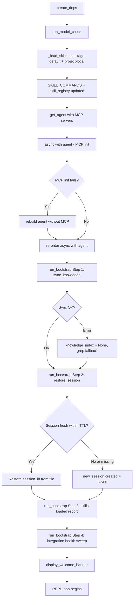

# Co CLI — System Bootstrap Design

Canonical startup flow for co-cli. This doc is the sole owner for startup and wakeup behavior, covering the full sequence from settings loading through `display_welcome_banner()`: settings loading, deps initialization (`create_deps()`), model dependency check, skills load, agent creation, MCP init, and the four-step bootstrap initialization sweep.



## 1. Settings Loading And Deps Initialization

### Settings Loading (`config.py`)

`Settings` is a Pydantic `BaseModel` built by `load_config()` and accessed via a lazy module-level singleton (`settings`). First access triggers `_ensure_dirs()` to create `~/.config/co-cli/` and `~/.local/share/co-cli/` if missing, then `load_config()`.

Three-layer merge, later layers win:

```text
Layer 1: ~/.config/co-cli/settings.json
Layer 2: <cwd>/.co-cli/settings.json via `_deep_merge_settings()`
Layer 3: env vars via fill_from_env model_validator
```

`fill_from_env` runs as `model_validator(mode='before')`, so env vars override both config files before validation.

`role_models` defaults:
- `gemini`: reasoning chain only -> `gemini-3-flash-preview`; all other roles empty
- `ollama`: all five roles populated with hardcoded defaults in `config.py`

Merge order is provider defaults for missing roles, then explicit config values, then env var overrides.

The `reasoning` role is validated post-construction. Missing or empty raises `ValueError` at startup.

Singleton access pattern:

```text
from co_cli.config import settings
```

First access resolves and caches `_settings`; later accesses reuse the singleton. Startup mutations such as `settings.theme = theme` modify that singleton in place.

### Deps Initialization (`create_deps()` In `main.py`)

`create_deps()` converts the `Settings` singleton into `CoServices`, `CoConfig`, `CoSessionState`, and `CoRuntimeState`, then assembles `CoDeps`. All work is local filesystem or in-memory. No network I/O occurs here.

```text
create_deps():
    session_id = uuid4().hex
    vault_path = Path(settings.obsidian_vault_path) if set else None

    if configured "hybrid":
        try hybrid init -> on failure try fts5 -> on failure use grep
    if configured "fts5":
        try fts5 init -> on failure use grep
    if configured "grep":
        use grep

    resolved_knowledge_backend = actual backend used
    personality_critique = load_soul_critique(settings.personality)

    exec_approvals_path = Path.cwd() / ".co-cli/exec-approvals.json"
    _prune_stale_approvals(exec_approvals_path, max_age_days=90)

    memory_dir = Path.cwd() / ".co-cli/memory"
    library_dir = Path(settings.library_path) if set else DATA_DIR / "library"

    config = dataclasses.replace(
        CoConfig.from_settings(settings),  # bulk copy for pure Settings-backed fields
        session_id=session_id,
        exec_approvals_path=exec_approvals_path,
        memory_dir=memory_dir,
        library_dir=library_dir,
        skills_dir=Path.cwd() / ".co-cli/skills",
        personality_critique=personality_critique,
        knowledge_search_backend=resolved_knowledge_backend,
        mcp_count=len(settings.mcp_servers),
    )

    registry = ModelRegistry.from_config(config)
    services = CoServices(shell=ShellBackend(), knowledge_index=..., task_runner=None,
                          model_registry=registry)
    runtime = CoRuntimeState(opening_ctx_state=OpeningContextState(), safety_state=SafetyState())

    return CoDeps(services=services, config=config, runtime=runtime)
```

Key transformation:
- `settings.knowledge_search_backend` is the configured backend
- `deps.config.knowledge_search_backend` is the resolved backend after degradation
- `CoConfig.from_settings()` copies pure config fields only; runtime-resolved and session-scoped fields are applied afterward via `dataclasses.replace()`

### `CoDeps` Group Semantics

| Group | Type | Lifetime | Sub-agent inheritance |
|-------|------|----------|-----------------------|
| `services` | `CoServices` | Session | Shared by reference |
| `config` | `CoConfig` | Session | Shared by reference |
| `session` | `CoSessionState` | Session, fresh for sub-agents | Reset for sub-agents |
| `runtime` | `CoRuntimeState` | Turn-scoped transient state | Reset for sub-agents |

The session group holds tool-visible mutable state such as approvals, todos, and skill grants. The runtime group holds orchestration-layer transient state such as compaction, usage, and safety state.

## 2. Model Dependency Check

`run_model_check()` runs after `create_deps()` and before `get_agent()`. It is a blocking gate: hard errors abort startup, warnings are advisory.

### Check Sequence

```text
run_model_check(deps, frontend):
    provider_result = _check_llm_provider(...)
    if provider_result.status == "error":
        raise RuntimeError(provider_result.message)
    if provider_result.status == "warning":
        frontend.on_status(provider_result.message)

    model_result = _check_model_availability(...)
    if model_result.status == "error":
        raise RuntimeError(model_result.message)
    if model_result.status == "warning":
        frontend.on_status(model_result.message)
    if model_result.role_models is not None:
        deps.config.role_models = model_result.role_models
```

Check semantics:
- `_check_llm_provider()` verifies provider credentials or reachability
- `_check_model_availability()` is Ollama-specific and prunes model chains to installed models

Hard vs soft failure:

| Condition | Severity | Behavior |
|-----------|----------|----------|
| Gemini provider with missing key | Hard error | `RuntimeError`; session never starts |
| Reasoning chain fully unavailable under Ollama | Hard error | `RuntimeError`; session never starts |
| Ollama unreachable | Warning | Status line shown; startup continues |
| Optional chain unavailable | Warning | Role disabled; startup continues |

`PreflightResult`:

```text
PreflightResult:
    ok: bool
    status: "ok" | "warning" | "error"
    message: str
    role_models: dict[str, list[ModelEntry]] | None
```

Chain pruning behavior:

| Condition | Status | `role_models` |
|-----------|--------|---------------|
| Non-Ollama provider | `ok` | `None` |
| Ollama unreachable | `warning` | `None` |
| No installed reasoning model | `error` | `None` |
| One or more chains advanced | `warning` | Updated dict |
| All models present | `ok` | `None` |

Extension rule:
- new bootstrap-time preflight checks are added to `_model_check.py`
- `run_bootstrap()` and `chat_loop()` should not need changes for a new read-only preflight

## 3. Entry Conditions

Bootstrap runs once per `chat_loop()` startup after the model dependency check has passed:

- `run_model_check()` returned without raising
- `TaskRunner` is initialized and injected into `deps.services.task_runner`
- skills are loaded and `SKILL_COMMANDS` is populated
- `get_agent()` has returned an agent instance
- `async with agent` has been entered, or the native-only fallback agent is in place after MCP failure

`run_bootstrap()` is called inside the `async with agent` block after MCP init has succeeded or degraded.

## 4. Full Startup Sequence

```text
chat_loop():
    frontend = TerminalFrontend()
    deps = create_deps()                                    ← skills_dir set here via dataclasses.replace()
    run_model_check(deps, frontend)

    task_runner = TaskRunner(storage, max_concurrent, inactivity_timeout,
                             auto_cleanup, retention_days)
    deps.services.task_runner = task_runner

    skill_commands = _load_skills(deps.config.skills_dir, settings)
    SKILL_COMMANDS.clear()
    SKILL_COMMANDS.update(skill_commands)
    deps.session.skill_registry = [
        {"name": s.name, "description": s.description}
        for s in skill_commands.values()
        if s.description and not s.disable_model_invocation
    ]

    agent, model_settings, tool_names, _ = get_agent(
        mcp_servers=mcp_servers,
        model_name=deps.config.role_models["reasoning"][0].model,
        config=deps.config,
    )

    async with agent via AsyncExitStack:
        if MCP init fails:
            agent = get_agent(mcp_servers=None, ...)
            re-enter async with agent
        if MCP enabled:
            tool_names = _discover_mcp_tools(agent, native_tool_names)

        session_data = await run_bootstrap(...)
        display_welcome_banner(...)
        begin REPL loop
```

### MCP Init Fallback

Before `run_bootstrap()` is called, MCP servers must be connected. If `AsyncExitStack` entry fails:

```text
try:
    await exit_stack.enter_async_context(agent)
except Exception:
    log warning
    agent = get_agent(mcp_servers=None, model_name=..., config=deps.config)
    await exit_stack.enter_async_context(agent)
    tool_names = native_tool_names
```

This ensures `run_bootstrap()` still runs. MCP failure does not abort the session.

## 5. `run_bootstrap()`: Four Steps

`run_bootstrap()` performs four sequential steps and reports status via `frontend.on_status()`.

```text
run_bootstrap(deps, frontend, memory_dir, library_dir, session_path,
              session_ttl_minutes, n_skills) -> session_data:
    Step 1: sync_knowledge
    Step 2: restore_session
    Step 3: skills_loaded_report
    Step 4: integration_health_sweep
    return session_data
```

### Step 1 - Knowledge Sync

```text
if deps.services.knowledge_index is not None and (memory_dir.exists() or library_dir.exists()):
    try:
        mem_count = knowledge_index.sync_dir("memory", memory_dir, kind_filter="memory")
        art_count = knowledge_index.sync_dir("library", library_dir, kind_filter="article")
        frontend.on_status("Knowledge synced ...")
    except Exception:
        knowledge_index.close()
        deps.services.knowledge_index = None
        frontend.on_status("Knowledge sync failed - index disabled")
else:
    frontend.on_status("Knowledge index not available - skipped")
```

Details:
- `sync_dir()` is hash-based and skips unchanged content
- both memory and library trees sync through the same API with source-specific `kind_filter`
- on failure, FTS is disabled for the session and the system continues with grep fallback

### Step 2 - Session Restore

```text
session_data = load_session(session_path)

if is_fresh(session_data, session_ttl_minutes):
    deps.config.session_id = session_data["session_id"]
    frontend.on_status("Session restored ...")
else:
    session_data = new_session()
    deps.config.session_id = session_data["session_id"]
    save_session(session_path, session_data)
    frontend.on_status("Session new ...")

return session_data
```

Session freshness uses `last_used_at` against current time. Future timestamps caused by clock skew are treated as fresh.

Session dict fields:
- `session_id`
- `created_at`
- `last_used_at`
- `compaction_count`

The returned `session_data` stays in `chat_loop()` local state and is reused for turn-by-turn persistence.
- After each completed LLM turn: `touch_session(session_data)` then `save_session()`
- On `/compact`: `increment_compaction(session_data)` then `save_session()`
- On exit: no extra save; cleanup only

### Step 3 - Skills Loaded Report

```text
frontend.on_status("{n_skills} skill(s) loaded")
```

This is a visibility step only. Skill loading already happened before agent creation.

### Step 4 - Integration Health Sweep

```text
try:
    result = run_doctor(deps)
    for line in result.summary_lines():
        frontend.on_status(line)
    span.set_attribute("has_errors", result.has_errors)
    span.set_attribute("has_warnings", result.has_warnings)
except Exception as e:
    frontend.on_status("integration health check failed ...")
```

`run_doctor(deps)` checks:
- Google credential sources
- Obsidian vault path
- Brave API key
- each MCP server command or URL
- knowledge backend state
- loaded skill count

The sweep is always non-blocking. It performs local checks only and should not do network I/O.

## 6. Pre-Bootstrap Subflows

### Skills Load

Skills load before `get_agent()` and before `run_bootstrap()`:

```text
skill_commands = _load_skills(deps.config.skills_dir, settings)
    pass 1: scan co_cli/skills/*.md
    pass 2: scan deps.config.skills_dir/*.md
    parse frontmatter, check requires, scan for security issues

SKILL_COMMANDS.clear()
SKILL_COMMANDS.update(skill_commands)

deps.session.skill_registry = [
    {"name": s.name, "description": s.description}
    for s in skill_commands.values()
    if s.description and not s.disable_model_invocation
]
```

`disable_model_invocation: true` skills stay available to the REPL but are hidden from the model-facing `skill_registry`.

Live skill reloading happens after startup in the main loop: before each REPL prompt, `.co-cli/skills/` mtimes are checked, `_load_skills()` reruns when files changed, and the tab-completer is refreshed. That post-startup path is covered in [DESIGN-core-loop.md](DESIGN-core-loop.md).

### Knowledge Backend Resolution

`create_deps()` resolves the knowledge backend before bootstrap:

```text
configured "hybrid" -> try hybrid -> fallback to fts5 -> fallback to grep
configured "fts5" -> try fts5 -> fallback to grep
configured "grep" -> use grep

deps.config.knowledge_search_backend = resolved backend
deps.services.knowledge_index = KnowledgeIndex instance or None
```

By the time `run_bootstrap()` runs, the system already knows whether FTS or grep is active.

## 7. Boundary, State Mutations, And Failure Paths

### Welcome Banner Boundary

`display_welcome_banner()` is called immediately after `run_bootstrap()` returns, still inside the `async with agent` block:

```text
session_data = await run_bootstrap(...)
display_welcome_banner(info)
begin REPL loop
```

The banner marks the boundary between startup and interactive use.
All status messages from model check, bootstrap, and skills loading appear above it.

### State Mutations Summary

| Field | Set by | Value |
|-------|--------|-------|
| `deps.services.knowledge_index` | Step 1 on error | `None` to disable FTS for the session |
| `deps.config.session_id` | Step 2 | Restored or new UUID hex |
| `deps.config.role_models` | Model dependency check | Pruned chain if Ollama models are missing |
| `deps.services.task_runner` | Pre-bootstrap in `main.py` | `TaskRunner` instance |
| `deps.services.model_registry` | `create_deps()` | `ModelRegistry` built from resolved `CoConfig` |
| `deps.session.skill_registry` | Pre-bootstrap in `main.py` | Non-hidden skill dicts |
| `SKILL_COMMANDS` | Pre-bootstrap in `main.py` | Module-level dict of all loaded skills |

### Failure Paths

| Condition | Outcome |
|-----------|---------|
| Knowledge sync raises | Index closed, `knowledge_index = None`, grep fallback, session continues |
| Session file missing or unreadable | New session created |
| Session TTL expired | New session created |
| MCP server connection fails | Agent rebuilt without MCP; bootstrap proceeds |
| One skill file fails to load | File skipped with warning; other skills still load |
| Integration sweep raises unexpectedly | Warning line emitted; session continues |
| `run_bootstrap()` raises unexpectedly | Propagates out; session fails to start |

### Recovery And Fallback

- Knowledge index unavailable: search tools fall back to grep-based search
- MCP unavailable: session continues with native tools only
- Session corruption: delete `.co-cli/session.json` to force a fresh session

## 8. Owning Code

| File | Role |
|------|------|
| `co_cli/_model_check.py` | Provider/model preflight gate and `PreflightResult` |
| `co_cli/_bootstrap.py` | `run_bootstrap()` four-step initialization |
| `co_cli/_doctor.py` | `run_doctor(deps)` integration checks used in Step 4 |
| `co_cli/_session.py` | Session helpers: new/load/save/touch/is_fresh/increment_compaction |
| `co_cli/main.py` | `create_deps()`, `chat_loop()`, startup assembly |
| `co_cli/_commands.py` | Skill loading helpers |
| `co_cli/deps.py` | `CoDeps` groups and sub-agent isolation |
| `co_cli/_knowledge_index.py` | `KnowledgeIndex.sync_dir()` and `close()` |

## 9. See Also

- [DESIGN-system.md](DESIGN-system.md) - system architecture and capability surface
- [DESIGN-core-loop.md](DESIGN-core-loop.md) - main loop and turn state machine
- [DESIGN-doctor.md](DESIGN-doctor.md) - doctor subsystem details
- [DESIGN-knowledge.md](DESIGN-knowledge.md) - retrieval backend and sync internals
- [DESIGN-skills.md](DESIGN-skills.md) - skill loader and security model
- [DESIGN-mcp-client.md](DESIGN-mcp-client.md) - MCP lifecycle and fallback
