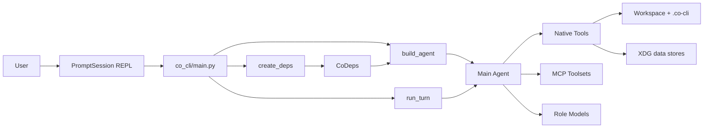

# Co CLI System Design

This doc describes the current runtime shape of `co-cli` as implemented today. It is intentionally narrower than the old version: startup lives in `DESIGN-bootstrap.md`, turn execution lives in `DESIGN-core-loop.md`, tool detail lives in `DESIGN-tools.md`, and skill loading/dispatch lives in `DESIGN-skills.md`.

## 1. What & How

`co-cli` is a local-first REPL around one main `pydantic_ai.Agent`. The running system is assembled in three stages:

1. `main.py` starts the CLI, telemetry, REPL, and session loop.
2. `create_deps()` builds a fully resolved `CoDeps` object, including prompt text, model registry, knowledge backend, background task runner, and startup degradation decisions.
3. `build_agent()` constructs the main agent from that `CoDeps.config`, adds dynamic per-turn instruction layers, and registers native tools plus configured MCP servers.



## 2. Core Logic

### Doc Map

Use the DESIGN docs with these ownership boundaries:

```text
DESIGN-system.md            top-level runtime shape, config/path summary, module map
├── DESIGN-core-loop.md         per-turn execution
├── DESIGN-bootstrap.md         startup assembly and recovery
├── DESIGN-tools.md             tool contracts and approval model
├── DESIGN-skills.md            skill loading and dispatch
├── DESIGN-llm-models.md        provider/model selection
└── DESIGN-observability.md     tracing and viewers
```

### Runtime Composition

The top-level runtime is owned by a small set of modules with clear boundaries:

| Module | Owns |
| --- | --- |
| `co_cli/main.py` | chat loop, slash command dispatch, MCP connection, background compaction, post-turn signal handling |
| `co_cli/bootstrap/_bootstrap.py` | resolved config, provider/model gate, knowledge backend fallback, reranker fallback, `TaskRunner`, session restore |
| `co_cli/agent.py` | agent construction, history processors, dynamic instructions, native tool registration, MCP server objects |
| `co_cli/deps.py` | dependency contract shared by the loop, tools, and sub-agents |
| `co_cli/context/_orchestrate.py` | per-turn execution and approval interception |

The system does not have a separate service container beyond `CoDeps`. That dataclass is the runtime contract.

### `CoDeps`

`CoDeps` is the single object passed to tools through `RunContext[CoDeps]`. It is grouped by responsibility:

```text
CoDeps
├── services  shared runtime handles
├── config    resolved read-only session config
├── session   mutable tool-visible session state
└── runtime   mutable orchestration state
```

At the system level, the important rule is ownership:
- `services` holds shared runtime handles
- `config` holds resolved read-only session config
- `session` holds mutable tool-visible state
- `runtime` holds mutable orchestration state

Sub-agents reuse `services` and `config`, but get fresh `session` and `runtime`.

See:
- `co_cli/deps.py` for the exact dataclasses and fields
- [DESIGN-tools.md](DESIGN-tools.md) for how tools use `CoDeps`
- [DESIGN-skills.md](DESIGN-skills.md) for the skill-related session fields

### Startup Boundary

`create_deps()` is the system assembly point. At the architecture level it does four jobs:

1. resolve settings into a cwd-aware session config
2. fail fast on primary model/provider misconfiguration
3. apply startup degradation decisions for reranking and knowledge backends
4. construct the shared runtime handles and initial processor state

See:
- [DESIGN-bootstrap.md](DESIGN-bootstrap.md) for startup order and fallback behavior
- [DESIGN-llm-models.md](DESIGN-llm-models.md) for provider and role-model rules

### Agent Construction

`build_agent()` turns the resolved system state into one main agent.

At the system boundary, three facts matter:

1. the static system prompt is already assembled before agent construction
2. the agent adds dynamic per-turn instruction layers on top of that base prompt
3. the agent registers native tools plus configured MCP toolsets

See:
- [DESIGN-tools.md](DESIGN-tools.md) for native tool registration and approval behavior
- [DESIGN-skills.md](DESIGN-skills.md) for skills, which are not registered as tools
- [DESIGN-core-loop.md](DESIGN-core-loop.md) for how the running agent is used per turn

### Capability Surface

The model-visible capability surface is the union of:

1. native tools registered in `build_agent()`
2. optional sub-agent tools gated by configured role models
3. configured MCP toolsets
4. slash-command-dispatched skill prompts that route back into the same main agent

This doc does not enumerate tool families or skill behavior in depth.

See:
- [DESIGN-tools.md](DESIGN-tools.md) for tool families, approvals, and return contracts
- [DESIGN-skills.md](DESIGN-skills.md) for skill loading and dispatch
- [DESIGN-bootstrap.md](DESIGN-bootstrap.md) for when MCP tools and skills become available in a live session

### Session and Persistence

The live session state is split across three places:

| Location | Purpose |
| --- | --- |
| `deps.session` | mutable in-memory state visible to tools and slash commands |
| `deps.runtime` | mutable in-memory orchestration state |
| `<cwd>/.co-cli/session.json` | persisted session id, timestamps, and compaction count across REPL restarts |

`main.py` restores or creates the persisted session after knowledge sync. It then updates the session timestamp after each completed turn.

### Data Stores

The current system writes to a small set of persistent stores:

| Store | Written by |
| --- | --- |
| `~/.local/share/co-cli/co-cli-logs.db` | `SQLiteSpanExporter` |
| `~/.local/share/co-cli/co-cli-search.db` | `KnowledgeIndex` |
| `<cwd>/.co-cli/memory/` | memory tools and memory lifecycle |
| configured library dir, default `~/.local/share/co-cli/library/` | article tools |
| `<cwd>/.co-cli/tasks/` | background task storage |
| `<cwd>/.co-cli/session.json` | session restore/touch logic |

### Configuration Precedence And Paths

`co_cli/config.py` is the only complete settings inventory. The current load order is:

```text
built-in defaults
→ ~/.config/co-cli/settings.json
→ <cwd>/.co-cli/settings.json
→ environment variables
```

Important resolved paths and stores:

| Path | Owned by | Purpose |
| --- | --- | --- |
| `~/.config/co-cli/settings.json` | `co_cli/config.py` | user-level config |
| `<cwd>/.co-cli/settings.json` | `co_cli/config.py` | project overrides |
| `<cwd>/.co-cli/memory/` | tools + memory lifecycle | project memory markdown |
| `~/.local/share/co-cli/library/` or configured `library_path` | article tools | global article store |
| `~/.local/share/co-cli/co-cli-search.db` | knowledge index | FTS5 / hybrid search DB |
| `~/.local/share/co-cli/co-cli-logs.db` | telemetry exporter | span storage |
| `<cwd>/.co-cli/session.json` | session layer | persisted session id and compaction count |
| `<cwd>/.co-cli/tasks/` | background task runner | task metadata and output |

## 3. Config

Full field definitions live in `co_cli/config.py`. The system layer depends on these groups:

| Setting Group | Used by |
| --- | --- |
| `role_models`, `llm_provider`, `llm_host`, `llm_api_key`, `llm_num_ctx` | bootstrap, model registry, agent construction |
| `personality` | prompt assembly |
| `mcp_servers` | agent construction and MCP connection |
| `knowledge_search_backend`, `knowledge_embedding_*`, `knowledge_cross_encoder_reranker_url`, `knowledge_llm_reranker` | bootstrap degradation and knowledge index |
| `memory_*` | history processors and memory lifecycle |
| `shell_safe_commands`, `shell_max_timeout` | shell policy |
| `web_policy`, `web_fetch_allowed_domains`, `web_fetch_blocked_domains`, `web_http_*` | web tools |
| `background_*` | task runner |
| `obsidian_vault_path`, `google_credentials_path`, `brave_search_api_key`, `library_path`, `theme` | integration and UX wiring |

Component-level setting semantics are owned elsewhere:
- [DESIGN-llm-models.md](DESIGN-llm-models.md) for provider and role-model settings
- [DESIGN-tools.md](DESIGN-tools.md) for tool-facing policy settings
- [DESIGN-bootstrap.md](DESIGN-bootstrap.md) for startup config resolution

## 4. Files

| File | Purpose |
| --- | --- |
| `co_cli/main.py` | top-level CLI and REPL runtime |
| `co_cli/bootstrap/_bootstrap.py` | dependency assembly and startup degradation |
| `co_cli/agent.py` | main agent factory and tool registration |
| `co_cli/deps.py` | grouped dependency dataclasses and sub-agent isolation |
| `co_cli/context/_orchestrate.py` | turn execution engine |
| `co_cli/context/_history.py` | compaction, opening context, and safety processors |
| `co_cli/bootstrap/_check.py` | health-check primitives used by bootstrap, status, and capability tools |
| `co_cli/bootstrap/_render_status.py` | status and security rendering |
| `co_cli/tools/` | native tool implementations and helpers |
| `co_cli/knowledge/` | indexing, chunking, frontmatter parsing, and reranking |
| `co_cli/memory/` | signal detection, consolidation, retention, and persistence |
| `co_cli/commands/_commands.py` | slash command registry, skill loading, and REPL command dispatch |
| `co_cli/observability/` | SQLite span export and trace viewers |
| `docs/DESIGN-bootstrap.md` | startup details intentionally kept out of this doc |
| `docs/DESIGN-core-loop.md` | turn-flow details intentionally kept out of this doc |
| `docs/DESIGN-tools.md` | tool-level details intentionally kept out of this doc |
| `docs/DESIGN-skills.md` | skill-level details intentionally kept out of this doc |
| `docs/DESIGN-llm-models.md` | provider and role-model details intentionally kept out of this doc |
| `docs/DESIGN-observability.md` | tracing details intentionally kept out of this doc |
