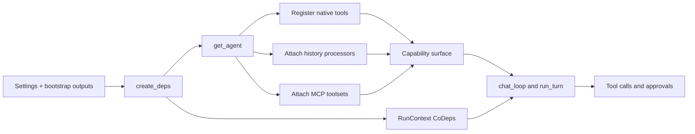
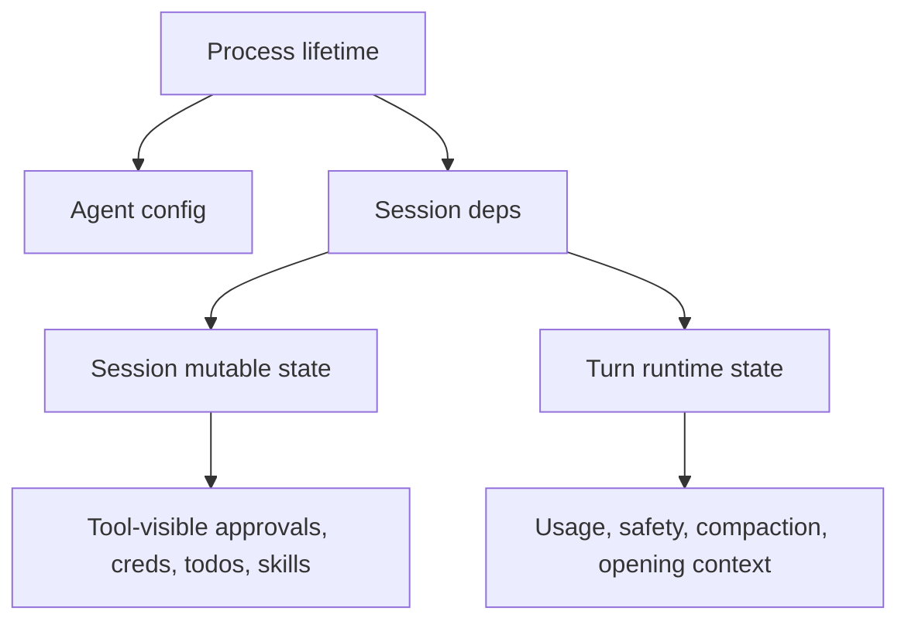
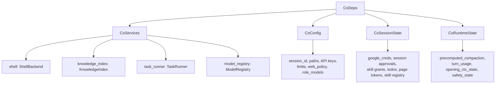

# Co CLI — System Design

> For doc navigation, config reference, and module index: [DESIGN-index.md](DESIGN-index.md).

## 1. What & How

This doc is the structural design of co-cli as a system. It defines the stable top-level architecture: the main agent factory, dependency injection via `CoDeps`, the capability surface exposed to the model, the trust and approval boundary, and the system-wide contracts that connect loop orchestration to subsystem docs.

Scope boundary:
- In scope: system topology, runtime dependency model, capability composition, tool and skill contracts, session-state tiers, security and config boundaries
- Out of scope: startup sequencing in [DESIGN-system-bootstrap.md](DESIGN-system-bootstrap.md), end-to-end turn execution in [DESIGN-core-loop.md](DESIGN-core-loop.md), and subsystem-owned lifecycle detail in the relevant subsystem docs

## 2. Component In System Architecture

### System Context

```mermaid
graph TB
    subgraph User Interface
        CLI[Typer CLI]
        REPL[Prompt Toolkit REPL]
    end

    subgraph Core Brain
        Agent[Pydantic AI Agent]
        LLM{LLM Provider}
        Ollama[Ollama Local]
        Gemini[Gemini Cloud]
    end

    subgraph Tool Layer
        ToolShell[Shell Tool]
        ToolFiles[File Tools]
        ToolMemory[Memory/Article Tools]
        ToolTodo[Todo Tools]
        ToolDelegate[Delegation Tool]
        ToolCapabilities[Capabilities Tool]
        ToolObsidian[Obsidian Tool]
        ToolDrive[Drive Tool]
        ToolGmail[Gmail Tool]
        ToolCalendar[Calendar Tool]
        ToolWeb[Web Tools]
        ToolBackground[Background Task Tools]
        MCP[MCP Toolsets]
    end

    subgraph External Services
        ObsVault[Obsidian Vault]
        GDrive[Google Drive API]
        GmailAPI[Gmail API]
        GCal[Calendar API]
        BraveAPI[Brave Search API]
        HTTP[HTTP / Web]
        MCPServers[MCP Servers stdio/HTTP]
        Workspace[Workspace Filesystem]
        MemoryDir[.co-cli/memory]
        LibraryDir[~/.local/share/co-cli/library]
        TasksDir[.co-cli/tasks]
    end

    subgraph Infrastructure
        Config[Config Manager]
        Telemetry[OpenTelemetry]
        SQLite[(SQLite DB)]
    end

    CLI --> REPL
    REPL --> Agent
    Agent --> LLM
    LLM --> Ollama
    LLM --> Gemini

    Agent --> ToolShell
    Agent --> ToolFiles
    Agent --> ToolMemory
    Agent --> ToolTodo
    Agent --> ToolDelegate
    Agent --> ToolCapabilities
    Agent --> ToolObsidian
    Agent --> ToolDrive
    Agent --> ToolGmail
    Agent --> ToolCalendar
    Agent --> ToolWeb
    Agent --> ToolBackground

    ToolObsidian --> ObsVault
    ToolDrive --> GDrive
    ToolGmail --> GmailAPI
    ToolCalendar --> GCal
    ToolWeb --> BraveAPI
    ToolWeb --> HTTP
    ToolFiles --> Workspace
    ToolMemory --> MemoryDir
    ToolMemory --> LibraryDir
    ToolBackground --> TasksDir
    MCP --> MCPServers

    Config --> Agent
    Agent --> Telemetry
    Telemetry --> SQLite
```



### Ownership Map

| Concern | Canonical doc |
|---------|---------------|
| Startup and bootstrap | [DESIGN-system-bootstrap.md](DESIGN-system-bootstrap.md) |
| Main chat loop and turn state machine | [DESIGN-core-loop.md](DESIGN-core-loop.md) |
| Approval decision chain | [DESIGN-core-loop.md](DESIGN-core-loop.md) |
| Prompt assembly and context engineering | [DESIGN-context-engineering.md](DESIGN-context-engineering.md) |
| Tool families and execution detail | [DESIGN-tools.md](DESIGN-tools.md) |
| Skills lifecycle | [DESIGN-skills.md](DESIGN-skills.md) |
| Memory lifecycle | [DESIGN-memory.md](DESIGN-memory.md) |
| Knowledge retrieval and indexing | [DESIGN-knowledge.md](DESIGN-knowledge.md) |

Upstream dependencies:
- `config.py` settings and provider/model configuration
- local workspace state, knowledge files, session files, approval store
- external integrations such as MCP, Brave, Google, and Obsidian

Downstream consumers:
- `chat_loop()` startup assembly and REPL runtime
- `run_turn()` orchestration and approval handling
- all native tools via `RunContext[CoDeps]`
- sub-agents created through delegation tools

Cross-component touchpoints:
- `CoDeps` is the shared runtime contract between agent, loop, and tools
- approval policy classification is declared at agent registration and executed in the loop
- memory, knowledge, skills, and MCP extend the capability surface without changing the main loop contract

## 3. Flows

### System Composition Flow



Ordered composition:
1. Bootstrap resolves settings, provider viability, knowledge backend, skill registry, and session identity.
2. `create_deps()` materializes grouped runtime state in `CoDeps`.
3. `get_agent()` selects the reasoning model, assembles the prompt, registers native tools, and registers MCP toolsets.
4. The resulting agent plus `CoDeps` define the model-visible capability surface.
5. [DESIGN-core-loop.md](DESIGN-core-loop.md) executes turns against that surface.

Failure and fallback inline:
- Missing optional integrations degrade the active capability surface rather than removing the agent itself.
- MCP init failure removes extension tools but keeps the native agent alive.
- Knowledge backend degradation preserves retrieval through grep fallback.

### Session-State Tier Flow



Rules:
1. Agent configuration is process-level and mostly immutable after creation.
2. `CoDeps.services` and `CoDeps.config` are session-level inputs shared across turns.
3. `CoDeps.session` stores mutable session state visible to tools.
4. `CoDeps.runtime` stores orchestration-layer transient state and resets per turn when required.
5. Sub-agents inherit `services` and `config`, but get fresh `session` and `runtime`.

## 4. Core Logic

### 4.1 Agent Factory

`get_agent(all_approval, web_policy, mcp_servers, personality, model_name?, config: CoConfig | None = None) -> (agent, model_settings, tool_names, tool_approval)` selects the LLM model, assembles the system prompt, registers tools with approval policies, and registers MCP toolsets.

```text
get_agent(...) -> (agent, model_settings, tool_names, tool_approval):
    _cfg = config if config is not None else settings
    resolve model from _cfg.llm_provider
    load soul seed/examples/mindsets for active personality
    build system_prompt via assemble_prompt(provider, model_name, soul_seed, soul_examples)

    create Agent with:
        model, deps_type=CoDeps, system_prompt, retries=tool_retries
        output_type = [str, DeferredToolRequests]
        history_processors = [inject_opening_context, truncate_tool_returns,
                               detect_safety_issues, truncate_history_window]

    for each tool fn: register via _register(fn, requires_approval)
        append (fn.__name__, requires_approval) to tool_registry

    tool_names = [name for name, _ in tool_registry]
    tool_approval = {name: flag for name, flag in tool_registry}
    register MCP toolsets with per-server approval config
```

History processors are attached at agent construction and run before every model request:

| Processor | Role |
|-----------|------|
| `inject_opening_context` | Proactively recalls relevant memories and injects them into the message stream |
| `truncate_tool_returns` | Trims old tool outputs to preserve context budget |
| `detect_safety_issues` | Runtime guards: doom-loop detection, shell-error-streak detection |
| `truncate_history_window` | Applies sliding-window compaction for long sessions |

See [DESIGN-context-engineering.md](DESIGN-context-engineering.md) for processor ordering and [DESIGN-llm-models.md](DESIGN-llm-models.md) for provider/model configuration.

### 4.2 `CoDeps` Runtime Contract

`CoDeps` is the nested dataclass injected into every tool via `RunContext[CoDeps]`. It is split into four grouped dataclasses by responsibility and never carries a raw `Settings` object.



| Sub-dataclass | Field group | Key fields |
|---------------|-------------|------------|
| `CoServices` | Service handles | `shell`, `knowledge_index`, `task_runner`, `model_registry` |
| `CoConfig` | Read-only config | `session_id`, paths, API keys, limits, `web_policy`, `role_models`, backend/config scalars |
| `CoSessionState` | Mutable session state | `google_creds`, `session_tool_approvals`, `active_skill_env`, `skill_tool_grants`, `drive_page_tokens`, `session_todos`, `skill_registry`, `tool_names`, `tool_approvals`, `active_skill_name` |
| `CoRuntimeState` | Mutable orchestration state | `precomputed_compaction`, `turn_usage`, `opening_ctx_state`, `safety_state` |

Sub-agent isolation:
- `make_subagent_deps(base)` shares `services` and `config` by reference
- `session` and `runtime` are reset to clean defaults
- sub-agents never inherit the parent agent's approvals, todos, pagination tokens, or compaction cache

### 4.3 System Capability Surface

The agent's effective capability is the interaction of native tools, skill overlays, MCP extensions, `CoDeps` service handles, and approval policy gates. Capability is declared explicitly.

#### Native Tool Inventory

| Category | Tools | Approval |
|----------|-------|----------|
| Workspace and files | `list_directory`, `read_file`, `find_in_files`, `write_file`, `edit_file` | Read auto; writes deferred |
| Shell | `run_shell_command` | Policy-classified: DENY / ALLOW / REQUIRE_APPROVAL |
| Web | `web_search`, `web_fetch` | Policy-driven by `web_policy`; deferred when `all_approval=True` |
| Memory and knowledge | `save_memory`, `update_memory`, `append_memory`, `list_memories`, `search_memories`, `search_knowledge`, `save_article`, `read_article_detail` | Save deferred; others conditional |
| Personal data: Obsidian | `list_notes`, `read_note` | Conditional |
| Personal data: Google | `search_drive_files`, `read_drive_file`, `list_emails`, `search_emails`, `create_email_draft`, `list_calendar_events`, `search_calendar_events` | Draft deferred; reads conditional |
| Background tasks | `start_background_task`, `check_task_status`, `cancel_background_task`, `list_background_tasks` | Start deferred; status/cancel/list auto |
| Session utilities | `todo_write`, `todo_read`, `check_capabilities` | Conditional for todo; auto for capabilities |
| Delegation | `delegate_coder`, `delegate_research`, `delegate_analysis` | Auto |

#### Delegated Sub-Agents

| Sub-agent | Tool surface | Notes |
|-----------|-------------|-------|
| Coder | `list_directory`, `read_file`, `find_in_files` | Read-only workspace; no shell, no web |
| Research | `web_search`, `web_fetch` | Web-only; no memory writes, no shell |
| Analysis | `search_knowledge`, `search_drive_files` | Knowledge and Drive read; no shell, no direct web |

See [DESIGN-tools-delegation.md](DESIGN-tools-delegation.md) for sub-agent details.

#### MCP Extension Plane

| MCP capability | Co-cli concept | Status |
|----------------|----------------|--------|
| `tools` | Agent-callable tools registered via `toolsets=` in `get_agent()` | Implemented |
| `prompts` | User-invocable skills | Deferred pending pydantic-ai native prompt support |
| `resources` | Read-only context injection | Out of scope |

MCP tools inherit the same orchestration and approval model as native tools. Per-server `approval` config (`"auto"` or `"never"`) controls the default trust tier.

See [DESIGN-mcp-client.md](DESIGN-mcp-client.md) for transport and approval inheritance.

#### Skills As Capability Overlays

Skills are user-invocable slash-command workflows that expand into LLM turns. They orchestrate existing tools and may temporarily grant auto-approval for listed tools during the turn they run. They do not add new primitive capabilities.

See [DESIGN-skills.md](DESIGN-skills.md) for loader, dispatch, and security details.

#### Approval Boundary

The approval tier determines whether a tool executes immediately or requires user confirmation.

| Category | Approval | Rationale |
|----------|----------|-----------|
| Side-effectful always | Always deferred | `create_email_draft`, `save_memory`, `save_article`, `write_file`, `edit_file`, `start_background_task` |
| Shell conditional | Policy inside tool | `run_shell_command`: DENY -> terminal error, ALLOW -> execute, else approval |
| Conditional via `all_approval` | Deferred only when `all_approval=True` | `update_memory`, `append_memory`, `todo_write`, `todo_read`, and read-heavy personal-data tools |
| Always auto-execute | Never deferred | `check_capabilities`, `delegate_*`, `list_directory`, `read_file`, `find_in_files`, task status/list/cancel |
| Web tools | Policy and eval driven | `web_policy.search` and `web_policy.fetch`: `allow` or `ask`; `all_approval=True` still forces defer |
| MCP tools with `approval=auto` | Deferred | External tools default to requiring approval |
| MCP tools with `approval=never` | Auto | Explicitly trusted by user config |

See [DESIGN-core-loop.md](DESIGN-core-loop.md) for the runtime approval decision chain.

#### Graceful Degradation

- Knowledge backend resolves adaptively: `hybrid -> fts5 -> grep`
- MCP server failures degrade gracefully and remove only extension tools
- Missing Google credentials keep integration tools registered but degraded
- `check_capabilities` exposes the active capability state so the model can route around degraded integrations

### 4.4 Tool Surface Contracts

Shared contracts for all native tools:

| Concern | Contract |
|---------|----------|
| Naming | `verb_noun` pattern; explicit family prefixes such as `web_*`, `todo_*`; delegation tools use explicit `delegate_*` names |
| Registration | All native tools use `agent.tool()` with `RunContext[CoDeps]` |
| Data access | Settings via `ctx.deps.config`, services via `ctx.deps.services`, session state via `ctx.deps.session` |
| Return shape | User-facing data tools return `dict[str, Any]` with `display` plus metadata fields |
| Error classes | `ModelRetry` for LLM-fixable params, `terminal_error()` for unrecoverable user-facing failure, empty result for valid no-match cases |
| Request budget | Shared tool retry budget comes from `tool_retries`; turn request budget comes from the main loop |

See [DESIGN-tools.md](DESIGN-tools.md) for the full tool index and per-family detail.

### 4.5 Memory And Knowledge In System Context

These subsystems are structurally part of the system capability surface but own their lifecycle documentation within their component docs.

Memory:
- Files are YAML-frontmatter markdown in `.co-cli/memory/`
- runtime injection happens through `inject_opening_context`; personalization asset design lives in [DESIGN-personalization.md](DESIGN-personalization.md)
- write path runs signal detection, dedup, consolidation, persistence, and retention

Knowledge:
- `KnowledgeIndex` provides cross-source retrieval
- sources include local knowledge, saved articles, Obsidian, and Google Drive when configured
- primary retrieval entrypoint is `search_knowledge`
- backend degradation chain is `hybrid -> fts5 -> grep`

See [DESIGN-memory.md](DESIGN-memory.md) and [DESIGN-knowledge.md](DESIGN-knowledge.md).

### 4.6 Session, Frontend, And CLI Structural Contracts

Session-state tiers:

| Tier | Scope | Lifetime | Example |
|------|-------|----------|---------|
| Agent config | Process | Entire process | Model, system prompt, tool registrations |
| Session deps | Session | One REPL loop | `CoDeps`: shell, creds, page tokens |
| Run state | Single run | One `run_turn()` | Per-turn usage and safety counters |

Frontend contract:

| Method | Purpose |
|--------|---------|
| `on_text_delta(accumulated)` | Incremental Markdown render |
| `on_text_commit(final)` | Final render and tear down Live |
| `on_thinking_delta(accumulated)` | Thinking panel when verbose |
| `on_thinking_commit(final)` | Final thinking panel |
| `on_tool_call(name, args_display)` | Tool call annotation |
| `on_tool_result(title, content)` | Result panel |
| `on_status(message)` | Status messages |
| `on_final_output(text)` | Fallback Markdown render |
| `prompt_approval(description) -> str` | y/n/a approval prompt |
| `cleanup()` | Exception teardown |

CLI command surface:
- `co chat`
- `co status`
- `co tail`
- `co logs`
- `co traces`

REPL slash-command surface:
- `/help`, `/clear`, `/new`, `/status`, `/tools`, `/history`, `/compact`
- `/forget`, `/approvals`, `/checkpoint`, `/rewind`
- `/skills`, `/background`, `/tasks`, `/cancel`

Execution sequencing for startup and one user turn lives in [DESIGN-system-bootstrap.md](DESIGN-system-bootstrap.md) and [DESIGN-core-loop.md](DESIGN-core-loop.md).

### 4.7 Security, Configuration, And Concurrency

Configuration precedence:
1. Environment variables
2. `.co-cli/settings.json` in the current working directory
3. `~/.config/co-cli/settings.json`
4. Built-in defaults

MCP servers are configured via `settings.json` or `CO_CLI_MCP_SERVERS` and specify `command`, `args`, `timeout`, `env`, `approval`, and optional `prefix`.

Security model:
1. Configuration: secrets in `settings.json` or env vars, never hardcoded
2. Confirmation: human approval for high-impact side effects
3. Environment sanitization: allowlist-only env vars, safe pagers, process-group cleanup on timeout
4. Input validation: path traversal protection and integration-specific scoping
5. Security posture checks: file permissions and wildcard approval warnings in `_status.py`

Concurrency model:
- model turns are single-threaded
- background compaction can run asynchronously between turns
- `TaskRunner` executes `/background` subprocesses with bounded concurrency

## 5. Config

This doc does not own the full settings table. Use [DESIGN-index.md](DESIGN-index.md) for the consolidated config reference, [DESIGN-llm-models.md](DESIGN-llm-models.md) for provider/model settings, and subsystem docs for family-specific settings.

System-relevant settings called out here:

| Setting | Env Var | Default | Description |
|---------|---------|---------|-------------|
| `llm_provider` | `LLM_PROVIDER` | `"ollama"` | Main provider selection |
| `role_models` | `CO_MODEL_ROLE_REASONING`, `CO_MODEL_ROLE_SUMMARIZATION`, `CO_MODEL_ROLE_CODING`, `CO_MODEL_ROLE_RESEARCH`, `CO_MODEL_ROLE_ANALYSIS` | provider defaults for all roles (ollama) or reasoning-only (gemini) | Role model chains |
| `tool_retries` | `CO_CLI_TOOL_RETRIES` | `3` | Shared tool retry budget |
| `model_http_retries` | `CO_CLI_MODEL_HTTP_RETRIES` | `2` | Provider/network retry budget per turn |
| `web_policy.search` | `CO_CLI_WEB_POLICY_SEARCH` | `"allow"` | `web_search` approval policy |
| `web_policy.fetch` | `CO_CLI_WEB_POLICY_FETCH` | `"allow"` | `web_fetch` approval policy |
| `knowledge_search_backend` | `CO_KNOWLEDGE_SEARCH_BACKEND` | `"fts5"` | Configured retrieval backend before fallback resolution |
| `session_ttl_minutes` | `CO_SESSION_TTL_MINUTES` | `60` | Session restore TTL |

## 6. Files

| File | Purpose |
|------|---------|
| `co_cli/agent.py` | `get_agent()`, prompt assembly wiring, native tool and MCP registration |
| `co_cli/deps.py` | `CoDeps` groups, sub-agent dependency isolation |
| `co_cli/main.py` | `create_deps()`, `chat_loop()`, startup assembly, REPL |
| `co_cli/_orchestrate.py` | `run_turn()`, `_stream_events()`, `_collect_deferred_tool_approvals()` |
| `co_cli/_history.py` | History processors and compaction |
| `co_cli/_startup_check.py` | `check_startup()` — provider/model preflight gate used during bootstrap |
| `co_cli/_model_check.py` | Backward-compat shim: `PreflightResult`, private check helpers — used only by `_status.py` |
| `co_cli/_commands.py` | Slash commands and skill dispatch surface |
| `co_cli/config.py` | Settings model and precedence rules |
| `co_cli/tools/` | Native tool families |
| `docs/DESIGN-system-bootstrap.md` | Canonical startup and bootstrap flow |
| `docs/DESIGN-core-loop.md` | Main loop and per-turn runtime state machine |
| `docs/DESIGN-tools.md` | Tool subsystem details |
| `docs/DESIGN-skills.md` | Skill subsystem details |
| `docs/DESIGN-memory.md` | Memory subsystem details |
| `docs/DESIGN-knowledge.md` | Knowledge subsystem details |
