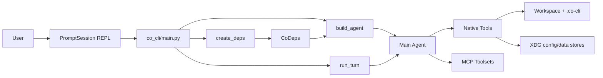

# Co CLI System Design

This doc covers the top-level runtime shape of `co-cli`. Startup details live in [DESIGN-bootstrap.md](DESIGN-bootstrap.md), per-turn execution lives in [DESIGN-core-loop.md](DESIGN-core-loop.md), tool details live in [DESIGN-tools.md](DESIGN-tools.md), and skill behavior lives in [DESIGN-skills.md](DESIGN-skills.md).

## 1. What & How

`co-cli` is a local-first REPL wrapped around one main `pydantic_ai.Agent`.

The runtime is assembled in this order:

1. `co_cli/main.py` starts the terminal app and REPL loop.
2. `create_deps()` builds one resolved `CoDeps` object for the session.
3. `build_agent()` turns that resolved state into the main agent, with native tools and optional MCP toolset definitions attached.
4. `main.py` completes session startup by entering MCP contexts, discovering MCP tools, loading skills, syncing knowledge, and restoring workspace session state.
5. each user turn goes through `run_turn()`, which streams output, pauses for approvals when needed, and returns the next conversation state.

```text
startup
  main.py
    -> create_deps()
    -> build_agent()
    -> connect MCP / discover MCP tools
    -> load skills / sync knowledge / restore session

turn execution
  main.py
    -> run_turn()
    -> agent.run_stream_events(...)
    -> tools and MCP calls
    -> updated history + session persistence
```



## 2. Core Logic

The running system has four layers:

1. `main.py` owns the terminal session and long-lived REPL state.
2. `CoDeps` is the runtime contract shared across the loop, tools, and sub-agents.
3. the main `Agent` is the model-facing surface: instructions, tools, and optional MCP toolsets.
4. tools and services touch the outside world: files, shell, search, memory, tasks, integrations.

`co-cli` does not have a separate dependency-injection container or service framework beyond `CoDeps`. Shared runtime state flows through `CoDeps`.

### Module Ownership

These modules are the top-level owners of runtime behavior:

| Module | Owns |
| --- | --- |
| `co_cli/main.py` | REPL loop, slash-command dispatch, startup sequencing, session persistence, background-compaction handoff |
| `co_cli/bootstrap/_bootstrap.py` | `create_deps()`, resolved config, startup degradation, service construction |
| `co_cli/agent.py` | `build_agent()` (main agent: dynamic instructions, native tool registration, MCP toolset attachment), `build_task_agent()` (lightweight task agent for approval resume turns), `_build_filtered_toolset()` (conditional domain-tool registration + per-request schema filtering via `active_tool_filter`), `_build_mcp_toolsets()` |
| `co_cli/deps.py` | the runtime contract shared by tools, loop code, and sub-agents |
| `co_cli/context/_orchestrate.py` | `run_turn()`, streaming segments, deferred approvals, retry behavior, turn result assembly |

### `CoDeps`: The Runtime Contract

`CoDeps` is the single dependency object passed into tools through `RunContext[CoDeps]`.

Its shape is grouped by ownership, not by feature:

```text
CoDeps
├── services      shared runtime handles
├── config        resolved read-only session config
├── capabilities  bootstrap-set tool discovery metadata
├── session       mutable session state visible to tools
└── runtime       mutable orchestration state for the current run
```

The practical rule is:

| Group | Holds |
| --- | --- |
| `services` | long-lived handles such as shell backend, knowledge index, model registry, task runner, task agent |
| `config` | resolved read-only settings for this session |
| `capabilities` | tool names, approval map, and MCP discovery errors — set during startup and shared by reference with sub-agents |
| `session` | mutable state that lasts across turns in the current REPL session |
| `runtime` | mutable state used by turn execution and orchestration internals |

Sub-agents share `services`, `config`, and `capabilities` by reference. `session` is partially inherited (credentials, approval rules) with isolated fields reset. `runtime` is always reset to a clean default.

For exact field definitions, see `co_cli/deps.py`.

### State Lifecycle Reference

The table below answers: when is each field set, who resets it, and what happens when a sub-agent is created?

**`CoCapabilityState` — `deps.capabilities`** (shared by reference with sub-agents)

| Field | Set by | Reset by | Sub-agent |
| --- | --- | --- | --- |
| `tool_names` | `main.py` startup (native tool registration + MCP discovery) | never | shared ref |
| `tool_approvals` | `main.py` startup (native tool registration) | never | shared ref |
| `mcp_discovery_errors` | `main.py` startup (MCP discovery) | never | shared ref |
| `skill_commands` | `main.py` startup (skill loader) | never | shared ref |
| `skill_registry` | `main.py` startup (skill loader) | never | shared ref |
| `slash_command_count` | `_chat_loop()` on each slash dispatch | never | shared ref |

**`CoSessionState` — `deps.session`** (partially inherited by sub-agents)

| Field | Set by | Reset by | Sub-agent |
| --- | --- | --- | --- |
| `google_creds` | `resolve_google_credentials()` tool | never | inherited (ref) |
| `google_creds_resolved` | `resolve_google_credentials()` tool | never | inherited |
| `session_approval_rules` | approval handler (`_collect_deferred_tool_approvals`) | never | inherited as copy — sub-agent grants do not leak to parent |
| `memory_recall_state` | `inject_opening_context` processor | never within session | fresh (default) |
| `drive_page_tokens` | Drive list tool | never | fresh (empty) |
| `session_todos` | todo tools | never | fresh (empty) |
| `session_id` | `restore_or_create_session()` at startup | never | fresh (empty) |

**`CoRuntimeState` — `deps.runtime`** (always reset for sub-agents)

| Field | Set by | Reset by | Sub-agent |
| --- | --- | --- | --- |
| `precomputed_compaction` | `HistoryCompactionState.on_turn_start()` harvest | `HistoryCompactionState.on_turn_end()` | fresh (None) |
| `turn_usage` | `run_turn()` init + `_merge_turn_usage()` per segment | `run_turn()` at turn start | fresh (None) |
| `tool_progress_callback` | `StreamRenderer.install_progress()` on tool start | `StreamRenderer.clear_progress()` on tool result; `run_turn()` finally | fresh (None) |
| `safety_state` | `run_turn()` at turn start | `run_turn()` at turn start | fresh (None) |
| `active_skill_name` | `_chat_loop()` before skill dispatch | `_cleanup_skill_run_state()` in finally | fresh (None) |

### Startup Boundary

`create_deps()` is the assembly point for the live system. At the system level, it does four jobs:

1. resolve settings into cwd-aware session config
2. fail fast on invalid primary model or provider setup
3. choose degraded-but-usable startup modes when reranking or knowledge backends are unavailable
4. build shared services and initial runtime state

`build_agent()` takes that resolved state and constructs the main agent: base prompt, dynamic instruction layers, native tools, and optional MCP toolset definitions. `build_task_agent()` is called immediately after with the `ROLE_TASK` resolved model to build the lightweight task agent stored in `deps.services.task_agent` for approval resume turns.

The key boundary is:

- `create_deps()` decides what runtime is available
- `build_agent()` creates the agent-attached capability surface
- `main.py` completes session startup by connecting MCP, discovering remote tools, loading skills, syncing knowledge, and restoring workspace session state from `<cwd>/.co-cli/session.json`

See [DESIGN-bootstrap.md](DESIGN-bootstrap.md) for startup order and [DESIGN-llm-models.md](DESIGN-llm-models.md) for provider and role-model rules.

### Capability Surface

There are two related capability layers:

1. the agent-attached capability surface created in `build_agent()`
2. the full session capability surface completed by startup orchestration in `main.py`

The agent-attached capability surface is the union of:

1. native tools registered in `build_agent()`
2. optional sub-agent tools gated by configured role models
3. configured MCP toolset definitions

The full session capability surface additionally includes:

1. connected and discovered MCP tools
2. loaded skills exposed through slash commands

The important distinction is that skills are not tools. A skill rewrites or expands input to the main agent; it does not register a new callable capability by itself. MCP is also multi-phase in this design: toolsets are attached during agent construction, then connections and remote tool discovery happen during session startup.

See [DESIGN-tools.md](DESIGN-tools.md) and [DESIGN-skills.md](DESIGN-skills.md).

### Persistent Stores

The running system writes to a small set of persistent stores:

| Store | Purpose | Writer |
| --- | --- | --- |
| `~/.local/share/co-cli/co-cli-logs.db` | telemetry spans | `SQLiteSpanExporter` |
| `~/.local/share/co-cli/co-cli-search.db` | knowledge search index | `KnowledgeIndex` |
| `<cwd>/.co-cli/memory/` | project-local memories | memory tools and memory lifecycle |
| configured library dir, default `~/.local/share/co-cli/library/` | article store | article tools |
| `<cwd>/.co-cli/tasks/` | background task state | task runner |
| `<cwd>/.co-cli/session.json` | persisted session metadata | session restore / touch logic |

### Config Resolution And Important Paths

`co_cli/config.py` is the source of truth for settings. The precedence order is:

```text
built-in defaults
-> ~/.config/co-cli/settings.json
-> <cwd>/.co-cli/settings.json
-> environment variables
```

Important paths at the system layer:

| Path | Purpose |
| --- | --- |
| `~/.config/co-cli/settings.json` | user-level config |
| `<cwd>/.co-cli/settings.json` | project override config |
| `<cwd>/.co-cli/memory/` | project memory markdown |
| `~/.local/share/co-cli/library/` or configured `library_path` | global article store |
| `~/.local/share/co-cli/co-cli-search.db` | FTS5 / hybrid search DB |
| `~/.local/share/co-cli/co-cli-logs.db` | trace storage |
| `<cwd>/.co-cli/session.json` | session persistence |
| `<cwd>/.co-cli/tasks/` | background task storage |

## 3. Config

Full field definitions live in `co_cli/config.py`. At the system level, these setting groups matter most:

| Setting Group | Used by |
| --- | --- |
| `role_models`, `llm_provider`, `llm_host`, `llm_api_key`, `llm_num_ctx` | startup model checks, model registry, agent construction |
| `personality` | prompt assembly |
| `mcp_servers` | MCP toolset construction and connection |
| `knowledge_search_backend`, `knowledge_embedding_*`, `knowledge_cross_encoder_reranker_url`, `knowledge_llm_reranker` | startup degradation and knowledge backend selection |
| `memory_*` | history processors and memory lifecycle |
| `shell_safe_commands`, `shell_max_timeout` | shell policy |
| `web_policy`, `web_fetch_allowed_domains`, `web_fetch_blocked_domains`, `web_http_*` | web tools |
| `background_*` | task runner |
| `obsidian_vault_path`, `google_credentials_path`, `brave_search_api_key`, `library_path`, `theme` | integration and UX wiring |

Detailed semantics are owned by component docs:

- [DESIGN-llm-models.md](DESIGN-llm-models.md) for providers and role models
- [DESIGN-tools.md](DESIGN-tools.md) for tool-facing policy settings
- [DESIGN-bootstrap.md](DESIGN-bootstrap.md) for startup config resolution

## 4. Files

| File | Purpose |
| --- | --- |
| `co_cli/main.py` | top-level CLI runtime and REPL loop |
| `co_cli/bootstrap/_bootstrap.py` | dependency assembly and startup degradation |
| `co_cli/agent.py` | main agent factory and tool registration |
| `co_cli/deps.py` | grouped dependency dataclasses and sub-agent isolation |
| `co_cli/context/_orchestrate.py` | turn execution engine |
| `co_cli/context/_history.py` | compaction, opening context, and safety processors |
| `co_cli/bootstrap/_check.py` | startup and health-check primitives |
| `co_cli/bootstrap/_render_status.py` | status rendering |
| `co_cli/tools/` | native tool implementations |
| `co_cli/knowledge/` | indexing, chunking, frontmatter parsing, and reranking |
| `co_cli/memory/` | signal detection, consolidation, retention, and persistence |
| `co_cli/commands/_commands.py` | slash-command registry, skill loading, and dispatch |
| `co_cli/observability/` | span export and trace viewers |
| `docs/DESIGN-bootstrap.md` | startup details |
| `docs/DESIGN-core-loop.md` | per-turn execution details |
| `docs/DESIGN-tools.md` | tool contracts and approval behavior |
| `docs/DESIGN-skills.md` | skill loading and dispatch |
| `docs/DESIGN-llm-models.md` | provider and role-model rules |
| `docs/DESIGN-observability.md` | tracing and viewer behavior |
