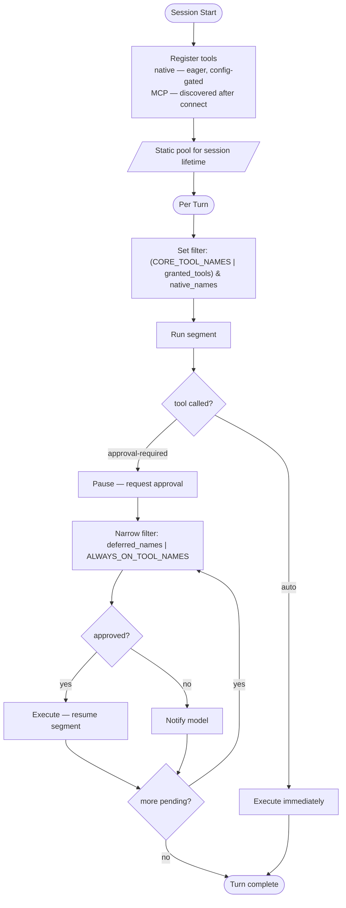

# Co CLI — Tools

> For system overview and approval boundary: [DESIGN-system.md](DESIGN-system.md). For the agent loop, orchestration, and approval flow: [DESIGN-core-loop.md](DESIGN-core-loop.md). For skill loading and slash-command dispatch: [DESIGN-skills.md](DESIGN-skills.md).

## 1. What & How

Native tools take `RunContext[CoDeps]` as their first argument and return `ToolResult` via `make_result()`. Registration is eager and config-gated: all eligible tools are added to a `FunctionToolset` at agent construction time; a `_filter` closure controls which schemas reach the LLM per API call. Main turns start with a 14-tool core surface (`CORE_TOOL_NAMES`); the model calls `search_tools()` to unlock additional tools into `deps.session.granted_tools` for the session. MCP tools extend the surface at session start and bypass the native filter.

```
tools/
  files.py           — workspace filesystem (list, read, find, write, edit)
  shell.py           — conditionally approved subprocess execution
  memory.py          — memory write/recall/edit
  articles.py        — knowledge article save and search
  obsidian.py        — Obsidian vault notes search and read
  google_drive.py    — Google Drive search and read
  google_gmail.py    — Gmail list, search, draft
  google_calendar.py — Calendar list and search
  web.py             — Brave Search + direct HTTP fetch
  task_control.py    — background task lifecycle
  todo.py            — session-scoped task list
  capabilities.py    — integration health introspection
  tool_search.py     — progressive tool discovery and session grants
  subagent.py        — sub-agent delegation tools
  _subagent_agents.py — result types + agent factories for delegation
```

## 2. Core Logic

### Registration

`_reg(fn, *, approval, family, integration, retries)` in `_build_filtered_toolset()` calls `FunctionToolset.add_function()`, records `tool_name → approval` in `tool_approvals`, and creates a `ToolConfig(name, source, family, approval, integration, description)` entry in `native_catalog`. Description is extracted from the function docstring first line. `_build_filtered_toolset()` returns `(filtered_toolset, tool_approvals, native_catalog)`.

The `FunctionToolset` is wrapped with `inner.filtered(_filter)`. `_filter` reads `deps.runtime.active_tool_filter` on every API call and passes only tools whose names are in that set. `compute_segment_filter()` in `_orchestrate.py` is the sole policy owner — it sets `active_tool_filter` before every segment.

**Tool surface split:**

- **Core** (`CORE_TOOL_NAMES`, 14 tools) — always visible on main turns; covers reads, web, execution, and `ALWAYS_ON_TOOL_NAMES`. No search needed.
- **Discoverable** (~15+ tools) — write tools, connectors, delegation, background tasks. Unlocked via `search_tools(query)`.

**Filter policy per segment type:**

```
main turn:        (CORE_TOOL_NAMES | deps.session.granted_tools) & native_names
approval-resume:  deferred_tool_names | ALWAYS_ON_TOOL_NAMES
```

`ALWAYS_ON_TOOL_NAMES = {check_capabilities, read_todos, write_todos, search_tools}` — always present including on approval-resume turns. These four are also members of `CORE_TOOL_NAMES`.

**Conditional registration gates** — tools excluded at construction when config is absent:

| Gate | Tools registered only when |
|------|--------------------------|
| `obsidian_vault_path` | `list_notes`, `search_notes`, `read_note` |
| `google_credentials_path` | all Drive, Gmail, Calendar tools |
| `ROLE_CODING` | `run_coding_subagent` |
| `ROLE_RESEARCH` | `run_research_subagent` |
| `ROLE_ANALYSIS` | `run_analysis_subagent` |
| `ROLE_REASONING` | `run_reasoning_subagent` |

**Retry tiers** — annotated at registration:

| Tier | `retries=` | Tools |
|------|-----------|-------|
| Write-once | 1 | `write_file`, `edit_file`, `save_memory`, `save_article`, `update_memory`, `append_memory`, `create_gmail_draft` |
| Network read | 3 | `web_search`, `web_fetch`, `list/search_gmail_emails`, `search/read_drive_file`, `list/search_calendar_events` |
| Default | `config.tool_retries` | all others |

---

### Tool Catalog

`*` = member of `ALWAYS_ON_TOOL_NAMES`. Conditional tools excluded when gate is absent.

| Family | Tool | Approval | Gate |
|--------|------|----------|------|
| workspace | `list_directory` | auto | — |
| workspace | `read_file` | auto | — |
| workspace | `find_in_files` | auto | — |
| workspace | `write_file` | deferred | — |
| workspace | `edit_file` | deferred | — |
| execution | `run_shell_command` | auto¹ | — |
| knowledge | `save_memory` | deferred | — |
| knowledge | `update_memory` | deferred | — |
| knowledge | `append_memory` | deferred | — |
| knowledge | `list_memories` | auto | — |
| knowledge | `search_memories` | auto | — |
| knowledge | `save_article` | deferred | — |
| knowledge | `read_article` | auto | — |
| knowledge | `search_articles` | auto | — |
| knowledge | `search_knowledge` | auto | — |
| web | `web_search` | auto | — |
| web | `web_fetch` | auto | — |
| connectors | `list_notes` | auto | `obsidian_vault_path` |
| connectors | `search_notes` | auto | `obsidian_vault_path` |
| connectors | `read_note` | auto | `obsidian_vault_path` |
| connectors | `search_drive_files` | auto | `google_credentials_path` |
| connectors | `read_drive_file` | auto | `google_credentials_path` |
| connectors | `list_gmail_emails` | auto | `google_credentials_path` |
| connectors | `search_gmail_emails` | auto | `google_credentials_path` |
| connectors | `create_gmail_draft` | deferred | `google_credentials_path` |
| connectors | `list_calendar_events` | auto | `google_credentials_path` |
| connectors | `search_calendar_events` | auto | `google_credentials_path` |
| delegation | `run_coding_subagent` | auto | `ROLE_CODING` |
| delegation | `run_research_subagent` | auto | `ROLE_RESEARCH` |
| delegation | `run_analysis_subagent` | auto | `ROLE_ANALYSIS` |
| delegation | `run_reasoning_subagent` | auto | `ROLE_REASONING` |
| workflow | `start_background_task` | deferred | — |
| workflow | `check_task_status` | auto | — |
| workflow | `cancel_background_task` | auto | — |
| workflow | `list_background_tasks` | auto | — |
| workflow | `write_todos` * | auto | — |
| workflow | `read_todos` * | auto | — |
| system | `check_capabilities` * | auto | — |
| system | `search_tools` * | auto | — |

**Unconditional pool (no integration gates):** 29 tools.
**Full pool (all gates active):** 39 tools.

¹ `run_shell_command` registered `auto`; DENY / ALLOW / REQUIRE_APPROVAL classification runs inside the tool body.

---

### Tool Lifecycle



**Startup call stack:**

```
build_agent(config, resolved)                              # agent.py
  ├─ _build_mcp_toolsets(config)                          # one toolset per mcp_servers entry
  ├─ _build_filtered_toolset(config)
  │    ├─ inner = FunctionToolset()
  │    ├─ _reg(fn, approval, family, integration, retries) # add_function() + ToolConfig entry
  │    └─ inner.filtered(_filter)                         # reads active_tool_filter per call
  └─ Agent(toolsets=[filtered_toolset] + mcp_toolsets)

initialize_session_capabilities()                          # _bootstrap.py
  └─ discover_mcp_tools()                                 # list_tools() per MCPServer
       └─ deps.capabilities.tool_catalog.update(mcp_catalog)
```

---

### Approval Model

#### Approval Classes

| Class | Condition | Examples |
|-------|-----------|---------|
| Always deferred | `requires_approval=True` | `write_file`, `edit_file`, `save_memory`, `save_article`, `update_memory`, `append_memory`, `start_background_task`, `create_gmail_draft` |
| Shell inline | Registered `auto`; command classified inside tool body | `run_shell_command` |
| Always auto | `requires_approval=False` | `list_directory`, `read_file`, `find_in_files`, `web_search`, `web_fetch`, `check_capabilities`, `search_tools`, `run_*_subagent`, all read-only knowledge/connector tools |

#### Approval Decision Chain

`_collect_deferred_tool_approvals()` resolves each pending call:

1. `decode_tool_args(call.args)` → dict; `resolve_approval_subject()` → `ApprovalSubject(tool_name, kind, value, display, can_remember)`
2. `is_auto_approved()` → match in `deps.session.session_approval_rules` → approve silently
3. No match: `frontend.prompt_approval()` → user `y` / `n` / `a`; `"a"` records `SessionApprovalRule` for the session lifetime

All session rules clear when the session ends.

#### Approval-Resume

When the model calls a deferred tool, pydantic-ai pauses and returns `DeferredToolRequests`. `_run_approval_loop()` drives the resume cycle: narrow filter → collect approvals → resume segment executes approved tools. Loop repeats until output is `str`. Denied tools notify the model without retrying. Filter on resume: `deferred_tool_names | ALWAYS_ON_TOOL_NAMES` — only the approved tool plus always-on tools are visible, cutting token cost per hop. The task agent (`ROLE_TASK`, `reasoning_effort: none`) is used on resume when available.

---

### Tool Result Contract

All user-facing native tools return `ToolResult` via `make_result(display, **metadata)`:
- `_kind` — `"tool_result"` discriminator
- `display` — pre-formatted string shown in the UI panel
- metadata fields: `count`, `path`, `task_id`, `granted`, etc.

Exceptions: `run_shell_command` and `read_drive_file` return raw `str`. MCP tools return raw JSON; `format_tool_result_for_display()` handles the `_kind`-absent case.

**Error handling:**

| Class | When to use |
|-------|------------|
| `terminal_error(msg)` | Unrecoverable failure (bad path, missing config). Model sees failure without retry. |
| `ModelRetry(msg)` | LLM-fixable error — bad params, transient failure. Triggers pydantic-ai retry up to `tool_retries`. |
| `ApprovalRequired(metadata=...)` | Tool needs user confirmation; triggers deferred approval path. |

**Progress reporting:** tools with meaningful latency emit staged updates via `ctx.deps.runtime.tool_progress_callback`. `_execute_stream_segment()` installs the callback on `FunctionToolCallEvent` and clears it on `FunctionToolResultEvent`. Tools never write to the terminal directly.

---

### MCP Tool Servers

Configured via `mcp_servers` in `settings.json`. `command`+`args` = stdio subprocess; `url` = remote HTTP (SSE or StreamableHTTP). `approval="ask"` defers all calls; `approval="auto"` executes immediately. MCP tools live in separate toolsets appended after the native filtered toolset and bypass `active_tool_filter`.

**Default servers** (gracefully skipped when `npx` is absent):

| Server | Prefix | Approval |
|--------|--------|---------|
| `github` | `github` | `ask` |
| `context7` | `context7` | `auto` |

---

### Tool Reference

#### Workspace (`tools/files.py`)

All paths resolved through `_resolve_workspace_path()` and verified against `workspace_root`. Path traversal raises `ValueError` → `terminal_error`.

| Tool | Key Parameters | Behavior |
|------|---------------|---------|
| `list_directory` | `path="."`, `pattern="*"`, `max_entries=200` | Lists dir contents filtered by glob; entries tagged `[dir]` or `[file]` |
| `read_file` | `path`, `start_line?`, `end_line?` | Reads content; optional 1-indexed line range |
| `find_in_files` | `pattern` (regex), `glob="**/*"`, `max_matches=50` | Regex search; skips binary files; returns `file:line: text` |
| `write_file` | `path`, `content` | Overwrites file; creates parent dirs; returns byte count |
| `edit_file` | `path`, `search`, `replacement`, `replace_all=False` | Exact-string replace; fails on ambiguous match unless `replace_all=True` |

#### Execution (`tools/shell.py`)

Three-stage classification before subprocess execution:

```
evaluate_shell_command(cmd, safe_commands)
    → DENY             → terminal_error
    → ALLOW            → ShellBackend.run_command() immediately
    → REQUIRE_APPROVAL → ctx.tool_call_approved? → execute : ApprovalRequired
```

`run_shell_command` runs in project cwd; stdout+stderr combined; `timeout` capped by `shell_max_timeout`; returns raw text. DENY patterns: `rm -rf /`, `dd if=`, `mkfs`, broad-scope kill signals.

#### Knowledge — Memory (`tools/memory.py`)

YAML-frontmatter markdown files in `.co-cli/memory/`. Search uses FTS5/hybrid when `knowledge_index` is available, grep fallback otherwise. `always_on=True` memories are injected as standing context every turn via `_load_always_on_memories()`.

| Tool | Key Parameters | Behavior |
|------|---------------|---------|
| `save_memory` | `content`, `tags?`, `related?`, `always_on=False` | Saves or consolidates via lifecycle dedup; returns `action="saved"` or `"consolidated"` |
| `update_memory` | `slug`, `old_content`, `new_content` | Surgical exact-passage replacement; rejects line-number artifacts |
| `append_memory` | `slug`, `content` | Appends to end of existing memory file |
| `list_memories` | `offset=0`, `limit=20`, `kind?` | Paginated inventory with lifecycle metadata and `has_more` |
| `search_memories` | `query`, `limit=10`, `tags?`, `tag_match_mode?`, `created_after?`, `created_before?` | FTS5/hybrid search; grep fallback |

#### Knowledge — Articles (`tools/articles.py`)

Decay-protected markdown files in `library_dir`. Never pruned by retention policy.

| Tool | Key Parameters | Behavior |
|------|---------------|---------|
| `save_article` | `content`, `title`, `origin_url`, `tags?`, `related?` | Saves to library; deduplicates by `origin_url` exact match |
| `search_articles` | `query`, `max_results=5`, `tags?`, `tag_match_mode?`, dates | Article-scoped search; returns summary index; use `read_article` for body |
| `read_article` | `slug` | Loads full article body by file stem |
| `search_knowledge` | `query`, `kind?`, `source?`, `limit=10`, `tags?`, dates | Unified cross-source search with confidence scoring and contradiction detection |

`search_knowledge` source routing: `None` (default) = library + obsidian + drive; `"library"` = local only; `"memory"` = memories; `"obsidian"` = vault; `"drive"` = indexed Drive docs.

#### Connectors — Obsidian (`tools/obsidian.py`)

Requires `obsidian_vault_path`. All paths validated against vault root.

| Tool | Key Parameters | Behavior |
|------|---------------|---------|
| `list_notes` | `tag?`, `offset=0`, `limit=20` | Paginated vault listing; alphabetical; `has_more` |
| `search_notes` | `query`, `limit=10`, `folder?`, `tag?` | AND-logic keyword search; syncs vault into FTS index on call; returns snippets |
| `read_note` | `filename` | Reads full note markdown; `ModelRetry` with available-notes hint on miss |

#### Connectors — Google (`tools/google_*.py`)

Requires `google_credentials_path`. Credentials resolved via `tools/_google_auth.py`. All Google tools use `retries=3` for transient connectivity failures.

| Tool | Key Parameters | Behavior |
|------|---------------|---------|
| `search_drive_files` | `query`, `page=1` | Searches My Drive in 10-item pages; pagination in `session.drive_page_tokens` |
| `read_drive_file` | `file_id` | Reads content; opportunistically indexes into knowledge search |
| `list_gmail_emails` | `max_results=5` | Recent messages with sender, subject, date, preview |
| `search_gmail_emails` | `query`, `max_results=5` | Gmail query syntax |
| `create_gmail_draft` | `to`, `subject`, `body` | Creates plain-text draft; does not send |
| `list_calendar_events` | `days_back=0`, `days_ahead=1`, `max_results=25` | Expands recurring events; UTC day window |
| `search_calendar_events` | `query`, `days_back=0`, `days_ahead=30`, `max_results=25` | Keyword search within time window |

#### Web (`tools/web.py`)

`web_fetch` domain policy: `web_fetch_blocked_domains` blocks by exact/subdomain match; `web_fetch_allowed_domains` is an optional allowlist. Private/internal targets blocked via `_url_safety.py`. Binary content-types return `terminal_error`.

| Tool | Key Parameters | Behavior |
|------|---------------|---------|
| `web_search` | `query`, `max_results=5`, `domains?` | Brave Search API; requires `BRAVE_SEARCH_API_KEY`; caps at 8 results; optional `site:` rewrite |
| `web_fetch` | `url` | HTTP GET; redirect following; 1 MB pre-decode limit; 100K char display cap; exponential backoff; Cloudflare fallback headers |

#### Delegation (`tools/subagent.py`)

Sub-agent tools spawn isolated agents via `make_subagent_deps(base)` — shared `services` + `config`, fresh `session` (no inherited `granted_tools`) + `runtime`, explicit `UsageLimits`. Child `RunUsage` merges back into the parent accumulator.

| Tool | Sub-agent surface | Behavior |
|------|------------------|---------|
| `run_coding_subagent` | `list_directory`, `read_file`, `find_in_files` | Read-only workspace analysis; returns `summary`, `diff_preview`, `files_touched`, `confidence` |
| `run_research_subagent` | `web_search`, `web_fetch` | Web-only research; retries once with rephrased query |
| `run_analysis_subagent` | `search_knowledge`, `search_drive_files` | Knowledge + Drive read; returns `conclusion`, `evidence`, `reasoning` |
| `run_reasoning_subagent` | none | Structured decomposition via reasoning model; returns `plan`, `steps`, `conclusion` |

#### Workflow (`tools/task_control.py`, `tools/todo.py`)

Background task lifecycle: `start` → `running` → `completed` / `failed` / `cancelled`. State in `session.background_tasks` (in-memory; not persisted across sessions).

| Tool | Key Parameters | Behavior |
|------|---------------|---------|
| `start_background_task` | `command`, `description`, `working_directory?` | Spawns subprocess via `spawn_task()`; returns `task_id` immediately |
| `check_task_status` | `task_id`, `tail_lines=20` | Status + exit code + last N output lines |
| `cancel_background_task` | `task_id` | Kills process group; marks cancelled |
| `list_background_tasks` | `status_filter?` | All tasks in session; optional status filter |
| `write_todos` | `todos: list[dict]` | Replaces full session todo list in `session.session_todos`; validates `status` and `priority` |
| `read_todos` | — | Returns current todo list |

#### System (`tools/capabilities.py`, `tools/tool_search.py`)

| Tool | Key Parameters | Behavior |
|------|---------------|---------|
| `check_capabilities` | — | Runs `check_runtime(deps)`; returns integration health, tool count, MCP server probes, reasoning model status. Emits staged progress via `tool_progress_callback`. Backing tool for `/doctor`. |
| `search_tools` | `query`, `max_results=8` | Keyword search over `tool_catalog` (name + description + family). Grants matched tools into `session.granted_tools`; tools in the current `active_tool_filter` report as `"already available"`. Returns match list with per-tool status. |

`search_tools` is the progressive-disclosure entry point: start with 14 core tools, call `search_tools("edit file")` to unlock `edit_file` for the session, call `search_tools("gmail")` to unlock Gmail tools, etc. Grants accumulate for the session; `/new` resets them.

---

## 3. Config

| Setting | Env Var | Default | Description |
|---------|---------|---------|-------------|
| `shell_max_timeout` | `CO_CLI_SHELL_MAX_TIMEOUT` | `600` | Hard cap for `run_shell_command` timeout (seconds) |
| `shell_safe_commands` | `CO_CLI_SHELL_SAFE_COMMANDS` | built-in list | Safe-prefix auto-approval allowlist for shell policy |
| `web_fetch_allowed_domains` | `CO_CLI_WEB_FETCH_ALLOWED_DOMAINS` | `[]` | Optional domain allowlist for `web_fetch` |
| `web_fetch_blocked_domains` | `CO_CLI_WEB_FETCH_BLOCKED_DOMAINS` | `[]` | Domain blocklist for `web_fetch` |
| `web_http_max_retries` | `CO_CLI_WEB_HTTP_MAX_RETRIES` | `2` | Max HTTP retries for `web_fetch` |
| `web_http_backoff_base_seconds` | `CO_CLI_WEB_HTTP_BACKOFF_BASE_SECONDS` | `1.0` | Base backoff interval (seconds) |
| `web_http_backoff_max_seconds` | `CO_CLI_WEB_HTTP_BACKOFF_MAX_SECONDS` | `8.0` | Max backoff cap (seconds) |
| `web_http_jitter_ratio` | `CO_CLI_WEB_HTTP_JITTER_RATIO` | `0.2` | Jitter fraction applied to backoff (0–1) |
| `brave_search_api_key` | `BRAVE_SEARCH_API_KEY` | `null` | Required for `web_search` |
| `obsidian_vault_path` | `OBSIDIAN_VAULT_PATH` | `null` | Registration gate for Obsidian tools |
| `google_credentials_path` | `GOOGLE_CREDENTIALS_PATH` | `null` | Registration gate for Google tools; OAuth token path |
| `library_path` | `CO_LIBRARY_PATH` | `null` | Article library directory override; resolved into `CoConfig.library_dir` |
| `mcp_servers` | `CO_CLI_MCP_SERVERS` | 2 defaults | MCP server map (JSON) |
| `tool_retries` | `CO_CLI_TOOL_RETRIES` | `3` | Agent-level default retry budget per tool call |
| `subagent_scope_chars` | `CO_CLI_SUBAGENT_SCOPE_CHARS` | `120` | Max chars of primary input captured as sub-agent `scope` |
| `subagent_max_requests_coder` | `CO_CLI_SUBAGENT_MAX_REQUESTS_CODER` | `10` | Max LLM requests per coder sub-agent run |
| `subagent_max_requests_research` | `CO_CLI_SUBAGENT_MAX_REQUESTS_RESEARCH` | `10` | Max LLM requests per research sub-agent run |
| `subagent_max_requests_analysis` | `CO_CLI_SUBAGENT_MAX_REQUESTS_ANALYSIS` | `8` | Max LLM requests per analysis sub-agent run |
| `subagent_max_requests_thinking` | `CO_CLI_SUBAGENT_MAX_REQUESTS_THINKING` | `3` | Max LLM requests per reasoning sub-agent run |

## 4. Files

| File | Purpose |
|------|---------|
| `co_cli/tools/files.py` | `list_directory`, `read_file`, `find_in_files`, `write_file`, `edit_file` |
| `co_cli/tools/shell.py` | `run_shell_command` — conditionally approved subprocess execution |
| `co_cli/tools/memory.py` | `save_memory`, `update_memory`, `append_memory`, `list_memories`, `search_memories` |
| `co_cli/tools/articles.py` | `save_article`, `search_articles`, `read_article`, `search_knowledge` |
| `co_cli/tools/obsidian.py` | `list_notes`, `search_notes`, `read_note` |
| `co_cli/tools/google_drive.py` | `search_drive_files`, `read_drive_file` |
| `co_cli/tools/google_gmail.py` | `list_gmail_emails`, `search_gmail_emails`, `create_gmail_draft` |
| `co_cli/tools/google_calendar.py` | `list_calendar_events`, `search_calendar_events` |
| `co_cli/tools/web.py` | `web_search`, `web_fetch` |
| `co_cli/tools/task_control.py` | `start_background_task`, `check_task_status`, `cancel_background_task`, `list_background_tasks` |
| `co_cli/tools/todo.py` | `write_todos`, `read_todos` |
| `co_cli/tools/capabilities.py` | `check_capabilities` |
| `co_cli/tools/tool_search.py` | `search_tools` — progressive tool discovery and session-grant mechanism |
| `co_cli/tools/subagent.py` | `run_coding_subagent`, `run_research_subagent`, `run_analysis_subagent`, `run_reasoning_subagent` |
| `co_cli/tools/_shell_policy.py` | `evaluate_shell_command()` — DENY / ALLOW / REQUIRE_APPROVAL classification |
| `co_cli/tools/_shell_backend.py` | `ShellBackend` — subprocess execution with process-group cleanup |
| `co_cli/tools/_shell_env.py` | `restricted_env()`, `kill_process_tree()` |
| `co_cli/tools/_approval.py` | `_is_safe_command()` — safe-prefix classification helper |
| `co_cli/tools/_display_hints.py` | `get_tool_start_args_display()`, `format_tool_result_for_display()` |
| `co_cli/tools/_tool_approvals.py` | `ApprovalSubject`, `resolve_approval_subject()`, `is_auto_approved()`, `remember_tool_approval()`, `record_approval_choice()`, `decode_tool_args()` |
| `co_cli/tools/_background.py` | `BackgroundTaskState`, `spawn_task()`, `kill_task()` |
| `co_cli/tools/_result.py` | `ToolResult`, `make_result()`, `ToolResultPayload` |
| `co_cli/tools/_errors.py` | `terminal_error()`, `http_status_code()` |
| `co_cli/tools/_google_auth.py` | Google credential resolution |
| `co_cli/tools/_subagent_agents.py` | `CoderResult`, `make_coder_agent()`, `ResearchResult`, `make_research_agent()`, `AnalysisResult`, `make_analysis_agent()`, `ThinkingResult`, `make_thinking_agent()` |
| `co_cli/_model_factory.py` | `ModelRegistry`, `ResolvedModel`, `build_model()` |
| `co_cli/agent.py` | `build_agent()`, `build_task_agent()`, `_build_filtered_toolset()`, `_build_mcp_toolsets()`, `discover_mcp_tools()`, `ALWAYS_ON_TOOL_NAMES`, `CORE_TOOL_NAMES`, `ToolConfig`, `AgentCapabilityResult` |
