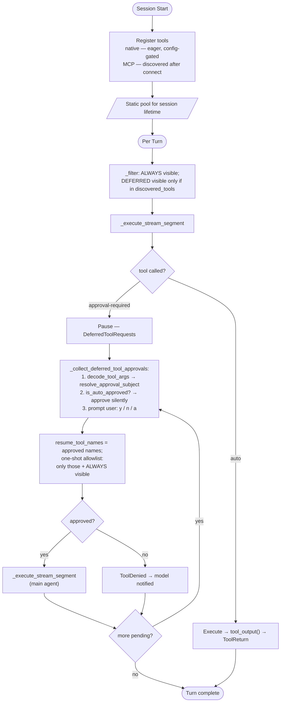

# Co CLI — Tools

> For system overview and approval boundary: [DESIGN-system.md](DESIGN-system.md). For the agent loop, orchestration, and approval flow: [DESIGN-core-loop.md](DESIGN-core-loop.md). For skill loading and slash-command dispatch: [DESIGN-skills.md](DESIGN-skills.md).

## 1. What & How

Native tools take `RunContext[CoDeps]` as their first argument and return `ToolReturn` (from `pydantic_ai.messages`) via `tool_output()`. Registration is eager and config-gated: all eligible tools are added to a `FunctionToolset` at agent construction time; a `_filter` closure controls which schemas reach the LLM per API call. Each tool carries a `LoadPolicy` enum (`ALWAYS` or `DEFERRED`) and a `ToolSource` enum (`NATIVE` or `MCP`). Always-loaded tools (15) are visible on turn one; deferred tools become callable only after the model calls `search_tools()` to discover them into `deps.session.discovered_tools`. MCP tools are normalized into `tool_index` with `load=LoadPolicy.DEFERRED` by default and follow the same visibility rule.

```
tools/
  files.py           — workspace filesystem (list, read, find, write, edit)
  shell.py           — conditionally approved subprocess execution
  memory.py          — memory write/recall/edit
  articles.py        — knowledge article save and search
  obsidian.py        — Obsidian vault notes search and read
  google_drive.py    — Google Drive search and read
  google_gmail.py    — Gmail list, search, draft
  google_calendar.py — Calendar list and search
  web.py             — Brave Search + direct HTTP fetch
  task_control.py    — background task lifecycle
  todo.py            — session-scoped task list
  capabilities.py    — integration health introspection
  tool_search.py     — progressive tool discovery and session grants
  subagent.py        — sub-agent delegation tools
  _subagent_builders.py — output types + agent factories for delegation
```

## 2. Core Logic

### Registration and Visibility

Registration, filtering, and progressive disclosure form a single pipeline:

```
build_agent()
  ├─ _build_filtered_toolset(config)
  │    ├─ FunctionToolset — register all tools via _reg()
  │    │    each _reg() produces a ToolInfo(load=ALWAYS | DEFERRED)
  │    └─ inner.filtered(_filter) — per-API-call visibility gate
  │         _filter checks: load==ALWAYS? OR name in discovered_tools? OR name in resume_tool_names?
  ├─ _build_mcp_toolsets(config) — one MCPServer* per mcp_servers entry
  └─ Agent(toolsets=[filtered] + mcp_toolsets)

create_deps()
  └─ discover_mcp_tools() — list_tools() per server → tool_index.update(mcp_index)
```

**Surface split:** 15 always-loaded (reads, web, shell, system) + ~24 deferred (writes, connectors, delegation, background). Deferred tools are announced by name via `build_deferred_tool_prompt` but schemas are not callable until the model calls `search_tools()`.

**Filter policy per segment type:**

```
normal turn:      entry.load == ALWAYS OR name in session.discovered_tools
                  (MCP tools not in tool_index pass through)
approval-resume:  name in resume_tool_names OR entry.load == ALWAYS
                  (all other tools hidden — cuts token cost per hop)
```

**State lifetime matters:**

- `session.discovered_tools` is session-scoped discovery state. Once `search_tools()` unlocks a deferred tool, that tool remains visible on later normal turns for the rest of the session. `/new` clears those discoveries.
- `runtime.resume_tool_names` is not discovery state. It is a one-shot per-resume allowlist used only while continuing an approval-gated segment.
- `resume_tool_names` is populated from the currently approved tool calls just before the resume segment runs, then cleared when the approval loop exits. It does not grant visibility on future turns.

**Conditional registration gates** — tools excluded at construction when config is absent:

| Gate | Tools registered only when |
|------|--------------------------|
| `obsidian_vault_path` | `list_notes`, `search_notes`, `read_note` |
| `google_credentials_path` | all Drive, Gmail, Calendar tools |

**Retry tiers** — annotated at registration:

| Tier | `retries=` | Tools |
|------|-----------|-------|
| Write-once | 1 | `write_file`, `edit_file`, `save_memory`, `save_article`, `update_memory`, `append_memory`, `create_gmail_draft` |
| Network read | 3 | `web_search`, `web_fetch`, `list/search_gmail_emails`, `search/read_drive_file`, `list/search_calendar_events` |
| Default | `config.tool_retries` | all others |

---

### Tool Lifecycle



**CoToolLifecycle capability** (registered via `capabilities=[CoToolLifecycle()]` in `build_agent()`) intercepts every tool execution with two hooks:

- `before_tool_execute` — resolves relative `path` args to absolute for file tools (`read_file`, `write_file`, `edit_file`, `list_directory`)
- `after_tool_execute` — enriches the SDK's `execute_tool` OTel span with `co.tool.source`, `co.tool.requires_approval`, `co.tool.result_size`; emits `logger.debug("tool_executed")`

Denial logging (`tool_denied`) is emitted in `_collect_deferred_tool_approvals()` when approval is rejected.

---

### Tool Result Contract

All tools return through a single gateway:

```
tool_output(display, *, ctx=None, **metadata) → ToolReturn
  ToolReturn(return_value=display, metadata=metadata_dict)
  → ToolReturnPart.content = display (string — model sees plain text)
  → ToolReturnPart.metadata = metadata_dict (app-side, not sent to LLM)
```

- `return_value` — the display string shown in the UI panel and seen by the model as plain text
- `metadata` — optional app-side fields (`count`, `path`, `task_id`, `granted`, `error`, etc.) accessible via `ToolReturnPart.metadata` but not sent to the LLM

Native tools always produce strings in `ToolReturnPart.content`; MCP tools produce dicts. `format_for_display()` dispatches on `isinstance(content, str)` vs `isinstance(content, dict)`.

**Error contract — three paths, each with different model visibility:**

| Mechanism | When | Model sees it? | Retries? |
|-----------|------|----------------|----------|
| `tool_error(msg, ctx=ctx)` | Terminal — won't fix itself (bad path, missing config) | Yes, as tool output with `error=True` | No |
| `ModelRetry(msg)` | Transient — might fix itself (bad params, rate limit) | Yes, as retry prompt | Yes, up to `tool_retries` |
| `ApprovalRequired(metadata=...)` | Needs user confirmation | No — triggers approval loop | N/A |

**Progress reporting:** tools with meaningful latency emit staged updates via `ctx.deps.runtime.tool_progress_callback`. The stream segment installs the callback on `FunctionToolCallEvent` and clears it on `FunctionToolResultEvent`. Tools never write to the terminal directly.

---

### Shell Policy

Three-stage classification before subprocess execution:

```
evaluate_shell_command(cmd, safe_commands)     # _shell_policy.py
    → DENY             → tool_error (blocked)
    → ALLOW            → ShellBackend.run_command() → tool_output(stdout+stderr, ctx=ctx)
    → REQUIRE_APPROVAL → ctx.tool_call_approved? → execute : ApprovalRequired
```

DENY tier (checked first): control characters, heredoc injection (`<<`), env-injection (`VAR=$(...)`), absolute-path destruction (`rm -rf /`). ALLOW tier: `_is_safe_command()` matches safe-prefix allowlist + arg validation (rejects path traversal, globs, shell chaining). Everything else: REQUIRE_APPROVAL.

---

### Approval Model

Three approval classes:

| Class | Condition | Examples |
|-------|-----------|---------|
| Always deferred | `requires_approval=True` | `write_file`, `edit_file`, `save_memory`, `save_article`, `update_memory`, `append_memory`, `start_background_task`, `create_gmail_draft` |
| Shell inline | Registered `auto`; classified inside tool body | `run_shell_command` |
| Always auto | `requires_approval=False` | reads, web, system, subagents, all read-only connector tools |

Approval subject scopes:

| Tool shape | Subject kind | Remembered value |
|-----------|-------------|-----------------|
| `run_shell_command` | `shell` | first token of `cmd` |
| `write_file`, `edit_file` | `path` | parent directory |
| `web_fetch` | `domain` | parsed hostname |
| everything else (including MCP) | `tool` | tool name |

User responds `y` (once) / `n` (deny) / `a` (always for this scope this session). Session rules clear when the session ends.

`resume_tool_names` is separate from those remembered approval scopes. Remembered approval scopes decide whether a future approval prompt can be skipped. `resume_tool_names` only constrains the immediate post-approval execution segment and is cleared right after that segment finishes.

---

### Concurrency Safety — Resource Locks

Approval controls permission; resource locks control correctness. When pydantic-ai dispatches multiple tool calls in parallel (or parent + subagent touch the same resource), read-modify-write tools must not corrupt data.

`ResourceLockStore` (`co_cli/tools/resource_lock.py`) is an in-process `asyncio.Lock` store keyed by resource identifier. Shared by reference across parent and subagents via `CoDeps.resource_locks`. Fail-fast: if the lock is held, the tool returns `tool_error()` immediately — no blocking, no silent overwrite.

| Tool | Lock key | Why |
|------|----------|-----|
| `edit_file` | resolved absolute path | read-modify-write; second edit reads stale content |
| `update_memory` | memory slug | read-modify-write on `.md` body |
| `append_memory` | memory slug | read-append-write on `.md` body |

Tools that do NOT need locking: `write_file` (blind overwrite, no read step), `save_memory` / `save_article` (UUID IDs eliminate IO conflict; dedup is best-effort under concurrency), `run_shell_command` (too broad to guard), `create_gmail_draft` (independent external resources).

---

### MCP Tool Servers

Configured via `mcp_servers` in `settings.json`. `command`+`args` = stdio subprocess; `url` = remote HTTP (SSE or StreamableHTTP). `approval="ask"` defers all calls; `approval="auto"` executes immediately. MCP tools are normalized into `tool_index` with `load=LoadPolicy.DEFERRED` after discovery and participate in the same visibility policy as native tools. MCP tools derive `integration` and `search_hint` from the server prefix.

**Default servers** (gracefully skipped when `npx` is absent):

| Server | Prefix | Approval |
|--------|--------|---------|
| `github` | `github` | `ask` |
| `context7` | `context7` | `auto` |

---

### Tool Catalog

Conditional tools excluded when gate is absent.

| Tool | Loading | Approval | Gate |
|------|---------|----------|------|
| `check_capabilities` | always | auto | — |
| `search_tools` | always | auto | — |
| `write_todos` | always | auto | — |
| `read_todos` | always | auto | — |
| `search_memories` | always | auto | — |
| `search_knowledge` | always | auto | — |
| `search_articles` | always | auto | — |
| `read_article` | always | auto | — |
| `list_memories` | always | auto | — |
| `list_directory` | always | auto | — |
| `read_file` | always | auto | — |
| `find_in_files` | always | auto | — |
| `web_search` | always | auto | — |
| `web_fetch` | always | auto | — |
| `run_shell_command` | always | auto¹ | — |
| `write_file` | deferred | deferred | — |
| `edit_file` | deferred | deferred | — |
| `save_memory` | deferred | deferred | — |
| `update_memory` | deferred | deferred | — |
| `append_memory` | deferred | deferred | — |
| `save_article` | deferred | deferred | — |
| `start_background_task` | deferred | deferred | — |
| `check_task_status` | deferred | auto | — |
| `cancel_background_task` | deferred | auto | — |
| `list_background_tasks` | deferred | auto | — |
| `run_coding_subagent` | deferred | auto | — |
| `run_research_subagent` | deferred | auto | — |
| `run_analysis_subagent` | deferred | auto | — |
| `run_reasoning_subagent` | deferred | auto | — |
| `list_notes` | deferred | auto | `obsidian_vault_path` |
| `search_notes` | deferred | auto | `obsidian_vault_path` |
| `read_note` | deferred | auto | `obsidian_vault_path` |
| `search_drive_files` | deferred | auto | `google_credentials_path` |
| `read_drive_file` | deferred | auto | `google_credentials_path` |
| `list_gmail_emails` | deferred | auto | `google_credentials_path` |
| `search_gmail_emails` | deferred | auto | `google_credentials_path` |
| `create_gmail_draft` | deferred | deferred | `google_credentials_path` |
| `list_calendar_events` | deferred | auto | `google_credentials_path` |
| `search_calendar_events` | deferred | auto | `google_credentials_path` |

**Unconditional pool (no integration gates):** 33 tools (15 always-loaded, 18 deferred).
**Full pool (all gates active):** 39 tools (15 always-loaded, 24 deferred).

¹ `run_shell_command` registered `auto`; DENY / ALLOW / REQUIRE_APPROVAL classification runs inside the tool body.

---

### Tool Reference

#### Workspace (`tools/files.py`)

All paths pre-resolved by `CoToolLifecycle.before_tool_execute` and verified against `workspace_root` by `_enforce_workspace_boundary()` (defense in depth). Path traversal raises `ValueError` → `tool_error`.

| Tool | Key Parameters | Behavior |
|------|---------------|---------|
| `list_directory` | `path="."`, `pattern="*"`, `max_entries=200` | Lists dir contents filtered by glob; entries tagged `[dir]` or `[file]`. Recursive patterns (`**`) sorted by mtime; tolerates broken symlinks |
| `read_file` | `path`, `start_line?`, `end_line?` | Returns `cat -n` numbered content (`{n:>6}\t{line}`); optional 1-indexed line range; returns error on binary files |
| `find_in_files` | `pattern` (regex), `glob="**/*"`, `max_matches=50` | Regex search; skips binary files; returns `file:line: text` |
| `write_file` | `path`, `content` | Overwrites file; creates parent dirs; returns byte count |
| `edit_file` | `path`, `search`, `replacement`, `replace_all=False` | Exact-string replace; fails on ambiguous match unless `replace_all=True` |

#### Knowledge — Memory (`tools/memory.py`)

YAML-frontmatter markdown files in `.co-cli/memory/`. Search uses FTS5/hybrid when `knowledge_store` is available, grep fallback otherwise. `always_on=True` memories are injected as standing context every turn via `load_always_on_memories()`.

| Tool | Key Parameters | Behavior |
|------|---------------|---------|
| `save_memory` | `content`, `tags?`, `related?`, `always_on=False` | Upsert via memory save agent; returns `action="saved"` or `"consolidated"` |
| `update_memory` | `slug`, `old_content`, `new_content` | Surgical exact-passage replacement; rejects line-number artifacts |
| `append_memory` | `slug`, `content` | Appends to end of existing memory file |
| `list_memories` | `offset=0`, `limit=20`, `kind?` | Paginated inventory with lifecycle metadata and `has_more` |
| `search_memories` | `query`, `limit=10`, `tags?`, `tag_match_mode?`, `created_after?`, `created_before?` | FTS5/hybrid search; grep fallback |

#### Knowledge — Articles (`tools/articles.py`)

Decay-protected markdown files in `library_dir`. Never pruned by retention policy.

| Tool | Key Parameters | Behavior |
|------|---------------|---------|
| `save_article` | `content`, `title`, `origin_url`, `tags?`, `related?` | Saves to library; deduplicates by `origin_url` exact match |
| `search_articles` | `query`, `max_results=5`, `tags?`, `tag_match_mode?`, dates | Article-scoped search; returns summary index; use `read_article` for body |
| `read_article` | `slug` | Loads full article body by file stem |
| `search_knowledge` | `query`, `kind?`, `source?`, `limit=10`, `tags?`, dates | Unified cross-source search with confidence scoring and contradiction detection |

`search_knowledge` source routing: `None` (default) = library + obsidian + drive; `"library"` = local only; `"memory"` = memories; `"obsidian"` = vault; `"drive"` = indexed Drive docs.

#### Connectors — Obsidian (`tools/obsidian.py`)

Requires `obsidian_vault_path`. All paths validated against vault root.

| Tool | Key Parameters | Behavior |
|------|---------------|---------|
| `list_notes` | `tag?`, `offset=0`, `limit=20` | Paginated vault listing; alphabetical; `has_more` |
| `search_notes` | `query`, `limit=10`, `folder?`, `tag?` | AND-logic keyword search; syncs vault into FTS index on call; returns snippets |
| `read_note` | `filename` | Reads full note markdown; `ModelRetry` with available-notes hint on miss |

#### Connectors — Google (`tools/google_*.py`)

Requires `google_credentials_path`. Credentials resolved via `tools/_google_auth.py`. All Google tools use `retries=3` for transient connectivity failures.

| Tool | Key Parameters | Behavior |
|------|---------------|---------|
| `search_drive_files` | `query`, `page=1` | Searches My Drive in 10-item pages; pagination in `session.drive_page_tokens` |
| `read_drive_file` | `file_id` | Reads content; opportunistically indexes into knowledge search |
| `list_gmail_emails` | `max_results=5` | Recent messages with sender, subject, date, preview |
| `search_gmail_emails` | `query`, `max_results=5` | Gmail query syntax |
| `create_gmail_draft` | `to`, `subject`, `body` | Creates plain-text draft; does not send |
| `list_calendar_events` | `days_back=0`, `days_ahead=1`, `max_results=25` | Expands recurring events; UTC day window |
| `search_calendar_events` | `query`, `days_back=0`, `days_ahead=30`, `max_results=25` | Keyword search within time window |

#### Web (`tools/web.py`)

`web_fetch` domain policy: `web_fetch_blocked_domains` blocks by exact/subdomain match; `web_fetch_allowed_domains` is an optional allowlist. Private/internal targets blocked via `_url_safety.py`. Binary content-types return `tool_error`.

| Tool | Key Parameters | Behavior |
|------|---------------|---------|
| `web_search` | `query`, `max_results=5`, `domains?` | Brave Search API; requires `BRAVE_SEARCH_API_KEY`; caps at 8 results; optional `site:` rewrite |
| `web_fetch` | `url` | HTTP GET; redirect following; 1 MB pre-decode limit; 100K char display cap; exponential backoff; Cloudflare fallback headers |

#### Delegation (`tools/subagent.py`)

Sub-agent tools use a dispatch-table architecture: `SUBAGENT_ROLES` maps role keys to `SubagentRoleConfig` (role constant, factory callable, config key, error/guard messages, behavioral flags). A single `_run_subagent()` function handles registry guard, model resolution, prompt scoping, tracing, attempt execution, and `tool_output()` formatting for all roles. Per-role display formatting lives in `_format_output()` via `match/case`. The 4 tool functions are thin wrappers (signature + docstring + one `return await _run_subagent(...)` call). Agents are spawned with isolated deps via `make_subagent_deps(base)` — shared `services` + `config`, fresh `session` + `runtime`, explicit `UsageLimits`. Child `RunUsage` merges back into the parent accumulator.

Role-specific behavioral flags: `retry_on_empty` (research only — retries with rephrased query when budget remains and result is empty), `input_prepend` (analysis only — prepends `inputs` as context to the question).

| Tool | Sub-agent surface | Behavior |
|------|------------------|---------|
| `run_coding_subagent` | `list_directory`, `read_file`, `find_in_files` | Read-only workspace analysis; returns `summary`, `diff_preview`, `files_touched`, `confidence` |
| `run_research_subagent` | `web_search`, `web_fetch` | Web-only research; retries once with rephrased query (`retry_on_empty`) |
| `run_analysis_subagent` | `search_knowledge`, `search_drive_files` | Knowledge + Drive read; prepends `inputs` as context (`input_prepend`); returns `conclusion`, `evidence`, `reasoning` |
| `run_reasoning_subagent` | none | Structured decomposition via reasoning model; returns `plan`, `steps`, `conclusion` |

#### Workflow (`tools/task_control.py`, `tools/todo.py`)

Background task lifecycle: `start` → `running` → `completed` / `failed` / `cancelled`. State in `session.background_tasks` (in-memory; not persisted across sessions).

| Tool | Key Parameters | Behavior |
|------|---------------|---------|
| `start_background_task` | `command`, `description`, `working_directory?` | Spawns subprocess via `spawn_task()`; returns `task_id` immediately |
| `check_task_status` | `task_id`, `tail_lines=20` | Status + exit code + last N output lines |
| `cancel_background_task` | `task_id` | Kills process group; marks cancelled |
| `list_background_tasks` | `status_filter?` | All tasks in session; optional status filter |
| `write_todos` | `todos: list[dict]` | Replaces full session todo list in `session.session_todos`; validates `status` and `priority` |
| `read_todos` | — | Returns current todo list |

#### System (`tools/capabilities.py`, `tools/tool_search.py`)

| Tool | Key Parameters | Behavior |
|------|---------------|---------|
| `check_capabilities` | — | Runs `check_runtime(deps)`; returns integration health, tool count, MCP server probes, reasoning model status. Emits staged progress via `tool_progress_callback`. Backing tool for `/doctor`. |
| `search_tools` | `query`, `max_results=8` | Keyword search over deferred tools in `tool_index` (name + description + integration + search_hint). Discovers matched tools into `session.discovered_tools`; always-loaded tools report as `"already available"`. Returns match list with per-tool status. |

`search_tools` is the progressive-disclosure entry point: start with 15 always-loaded tools, call `search_tools("edit file")` to unlock `edit_file` for the session, call `search_tools("gmail")` to unlock Gmail tools, etc. Discoveries accumulate for the session; `/new` resets them.

---

## 3. Config

| Setting | Env Var | Default | Description |
|---------|---------|---------|-------------|
| `shell.max_timeout` | `CO_CLI_SHELL_MAX_TIMEOUT` | `600` | Hard cap for `run_shell_command` timeout (seconds) |
| `shell.safe_commands` | `CO_CLI_SHELL_SAFE_COMMANDS` | built-in list | Safe-prefix auto-approval allowlist for shell policy |
| `web.fetch_allowed_domains` | `CO_CLI_WEB_FETCH_ALLOWED_DOMAINS` | `[]` | Optional domain allowlist for `web_fetch` |
| `web.fetch_blocked_domains` | `CO_CLI_WEB_FETCH_BLOCKED_DOMAINS` | `[]` | Domain blocklist for `web_fetch` |
| `web.http_max_retries` | `CO_CLI_WEB_HTTP_MAX_RETRIES` | `2` | Max HTTP retries for `web_fetch` |
| `web.http_backoff_base_seconds` | `CO_CLI_WEB_HTTP_BACKOFF_BASE_SECONDS` | `1.0` | Base backoff interval (seconds) |
| `web.http_backoff_max_seconds` | `CO_CLI_WEB_HTTP_BACKOFF_MAX_SECONDS` | `8.0` | Max backoff cap (seconds) |
| `web.http_jitter_ratio` | `CO_CLI_WEB_HTTP_JITTER_RATIO` | `0.2` | Jitter fraction applied to backoff (0–1) |
| `brave_search_api_key` | `BRAVE_SEARCH_API_KEY` | `null` | Required for `web_search` |
| `obsidian_vault_path` | `OBSIDIAN_VAULT_PATH` | `null` | Registration gate for Obsidian tools |
| `google_credentials_path` | `GOOGLE_CREDENTIALS_PATH` | `null` | Registration gate for Google tools; OAuth token path |
| `library_path` | `CO_LIBRARY_PATH` | `null` | Article library directory override; resolved into `deps.library_dir` |
| `mcp_servers` | `CO_CLI_MCP_SERVERS` | 2 defaults | MCP server map (JSON) |
| `tool_retries` | `CO_CLI_TOOL_RETRIES` | `3` | Agent-level default retry budget per tool call |
| `subagent.scope_chars` | `CO_CLI_SUBAGENT_SCOPE_CHARS` | `120` | Max chars of primary input captured as sub-agent `scope` |
| `subagent.max_requests_coder` | `CO_CLI_SUBAGENT_MAX_REQUESTS_CODER` | `10` | Max LLM requests per coder sub-agent run |
| `subagent.max_requests_research` | `CO_CLI_SUBAGENT_MAX_REQUESTS_RESEARCH` | `10` | Max LLM requests per research sub-agent run |
| `subagent.max_requests_analysis` | `CO_CLI_SUBAGENT_MAX_REQUESTS_ANALYSIS` | `8` | Max LLM requests per analysis sub-agent run |
| `subagent.max_requests_thinking` | `CO_CLI_SUBAGENT_MAX_REQUESTS_THINKING` | `3` | Max LLM requests per reasoning sub-agent run |

## 4. Files

| File | Purpose |
|------|---------|
| `co_cli/tools/files.py` | `list_directory`, `read_file`, `find_in_files`, `write_file`, `edit_file` |
| `co_cli/tools/shell.py` | `run_shell_command` — conditionally approved subprocess execution |
| `co_cli/tools/memory.py` | `save_memory`, `update_memory`, `append_memory`, `list_memories`, `search_memories` |
| `co_cli/tools/articles.py` | `save_article`, `search_articles`, `read_article`, `search_knowledge` |
| `co_cli/tools/obsidian.py` | `list_notes`, `search_notes`, `read_note` |
| `co_cli/tools/google_drive.py` | `search_drive_files`, `read_drive_file` |
| `co_cli/tools/google_gmail.py` | `list_gmail_emails`, `search_gmail_emails`, `create_gmail_draft` |
| `co_cli/tools/google_calendar.py` | `list_calendar_events`, `search_calendar_events` |
| `co_cli/tools/web.py` | `web_search`, `web_fetch` |
| `co_cli/tools/task_control.py` | `start_background_task`, `check_task_status`, `cancel_background_task`, `list_background_tasks` |
| `co_cli/tools/todo.py` | `write_todos`, `read_todos` |
| `co_cli/tools/capabilities.py` | `check_capabilities` |
| `co_cli/tools/tool_search.py` | `search_tools` — progressive tool discovery and session-discovery mechanism |
| `co_cli/tools/subagent.py` | `SubagentRoleConfig`, `SUBAGENT_ROLES`, `_run_subagent()`, `_format_output()`, thin wrappers: `run_coding_subagent`, `run_research_subagent`, `run_analysis_subagent`, `run_reasoning_subagent` |
| `co_cli/tools/_shell_policy.py` | `evaluate_shell_command()`, `_is_safe_command()` — DENY / ALLOW / REQUIRE_APPROVAL classification |
| `co_cli/tools/shell_backend.py` | `ShellBackend` — subprocess execution with process-group cleanup |
| `co_cli/tools/_shell_env.py` | `restricted_env()`, `kill_process_tree()` |
| `co_cli/context/tool_display.py` | `get_tool_start_args_display()`, `format_for_display()` |
| `co_cli/context/tool_approvals.py` | `ApprovalSubject`, `resolve_approval_subject()`, `is_auto_approved()`, `remember_tool_approval()`, `record_approval_choice()`, `decode_tool_args()` |
| `co_cli/tools/background.py` | `BackgroundTaskState`, `spawn_task()`, `kill_task()` |
| `co_cli/tools/tool_output.py` | `ToolResult`, `tool_output()`, `ToolResultPayload` |
| `co_cli/tools/tool_errors.py` | `tool_error()`, `handle_google_api_error()`, `http_status_code()` |
| `co_cli/tools/_google_auth.py` | Google credential resolution |
| `co_cli/tools/_subagent_builders.py` | `CoderOutput`, `make_coder_agent()`, `ResearchOutput`, `make_research_agent()`, `AnalysisOutput`, `make_analysis_agent()`, `ThinkingOutput`, `make_thinking_agent()` |
| `co_cli/_model_factory.py` | `LlmModel`, `build_model()` — single-model factory |
| `co_cli/_model_settings.py` | `NOREASON_SETTINGS` — static `ModelSettings` for non-reasoning calls |
| `co_cli/agent.py` | `build_agent()`, `_build_filtered_toolset()`, `_build_mcp_toolsets()`, `discover_mcp_tools()`, `AgentCapabilityResult` |
| `co_cli/context/_deferred_tool_prompt.py` | `build_deferred_tool_prompt()` — dynamic prompt fragment listing undiscovered deferred tools |
