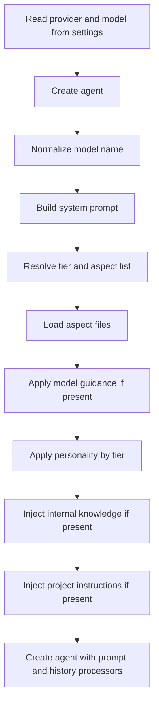
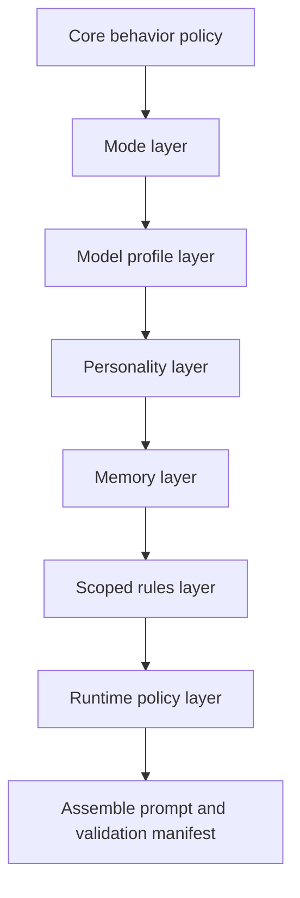

# REVIEW: co-cli Prompt Construction and Prompt Crafting (Redesign Audit)

**Date:** 2026-02-11  
**Repo scope:** current `co_cli/prompts/*`, prompt wiring in `co_cli/agent.py`, runtime mutation in `co_cli/_commands.py`, context compaction in `co_cli/_history.py`, and orchestration behavior in `co_cli/_orchestrate.py`.  
**Comparison scope:** peer CLI systems and similar online systems with published prompt/memory design docs.

## Executive Verdict

co-cli's current prompt implementation is cleanly modular and significantly leaner than the previous monolithic system, but it is under-instrumented for a redesign phase: prompt-specific pytest coverage was removed, validation scripts are stale against the new prompt shape, and several design contracts are implicit rather than enforceable.

The architecture is a strong MVP base. The main gap is not raw prompt quality now, but **prompt governance discipline** while redesigning.

## Current Implementation (What Exists Today)

### Prompt assembly pipeline



Primary code paths:
- `co_cli/prompts/__init__.py:73`
- `co_cli/prompts/model_quirks.py:193`
- `co_cli/agent.py:94`
- `co_cli/_commands.py:151`

### Runtime prompt mutation

- Startup prompt build: `co_cli/agent.py:94`
- Ollama `/model` switch rebuilds `agent.system_prompt`: `co_cli/_commands.py:151`
- Context compaction summary insertion changes future prompt context window: `co_cli/_history.py:210`

### Context governance and summarization

- Tool output truncation processor: `co_cli/_history.py:83`
- Sliding window + summary marker: `co_cli/_history.py:168`
- Anti-injection language exists in summarizer prompt and summarizer system prompt:
  - `co_cli/_history.py:124`
  - `co_cli/_history.py:150`

### Measured prompt size (current code)

Measured from `get_system_prompt(...)` on current repo state:

| Provider | Model | Tier | Personality | Chars | Rough tokens (`chars/4`) |
|---|---|---:|---|---:|---:|
| gemini | gemini-2.0-flash | 3 | none | 1919 | 479 |
| gemini | gemini-2.0-flash | 3 | finch | 3329 | 832 |
| ollama | glm-4.7-flash | 1 | none | 1417 | 354 |
| ollama | glm-4.7-flash | 1 | finch | 1417 | 354 |
| ollama | llama3.1 | 2 | none | 1544 | 386 |
| ollama | llama3.1 | 2 | finch | 2029 | 507 |
| ollama | qwen3 | 3 | none | 1919 | 479 |

## Comparison Baseline (Peer + Online Similar Systems)

## 1. Codex CLI (OpenAI)

Relevant published behavior:
- Permission and sandbox modes are explicit first-class runtime controls (`auto`, `readonly`, `fullAuto`) and can be changed per session.
- `AGENTS.md` is supported with directory-scoped instruction layering.
- Multiple instruction files can be loaded via `--rules`.

Source:
- https://developers.openai.com/codex/cli

Observed docs excerpts:
- Approval/sandbox modes and defaults: `turn9view0` lines 588-690
- AGENTS.md support and precedence: `turn9view3` lines 621-631
- Additional rules file loading and directory traversal behavior: `turn9view4` lines 617-629

## 2. Claude Code (Anthropic)

Relevant published behavior:
- Explicit memory hierarchy (`~/.claude/CLAUDE.md`, project `CLAUDE.md`, local `CLAUDE.local.md`).
- Settings precedence model (`enterprise policy > command line > local project > shared project > user`).

Sources:
- https://docs.anthropic.com/en/docs/claude-code/memory
- https://docs.anthropic.com/en/docs/claude-code/settings

Observed docs excerpts:
- Memory hierarchy and imports: `turn13view0` lines 603-623
- Settings precedence: `turn13view1` lines 934-947

## 3. Gemini CLI (Google)

Relevant published behavior:
- Built-in support for `GEMINI.md` as project/user instruction context.
- Documented hierarchical context-file discovery and import semantics.
- Supports sandboxing and approval modes as runtime controls.

Sources:
- https://github.com/google-gemini/gemini-cli/blob/main/README.md
- https://github.com/google-gemini/gemini-cli/blob/main/docs/core/context.md

Observed docs excerpts:
- README mentions customizable prompts via `GEMINI.md`: `turn20view0` lines 326-333
- Context hierarchy and folder-level layering: `turn22view0` lines 77-96

## 4. Aider

Relevant published behavior:
- Prompt/input caching as a first-class strategy to reduce repeated token cost.
- Explicit “chat history + repo map” prompt composition optimization guidance.

Source:
- https://aider.chat/docs/usage/caching.html

Observed docs excerpts:
- Cache architecture and incremental prompt updates: `turn25view0` lines 11-30

## 5. Similar memory systems beyond coding CLIs

### Letta
- Memory blocks are first-class structured entities (not just appended narrative context).
- Source: https://docs.letta.com/concepts/memory

### Mem0
- Memory represented as explicit objects across categories (user preference, personal profile, etc.).
- Source: https://github.com/mem0ai/mem0/blob/main/README.md
- Observed excerpt: `turn16view0` lines 54-67 and 197-209

## Gap Analysis (co-cli vs peers/similar systems)

### P0: Prompt governance and validation is currently weak during redesign

1. Prompt-specific pytest coverage was removed.
- `tests/test_prompts.py` and `tests/test_prompts_phase1d.py` are deleted.
- Redesign now lacks fast deterministic guardrails for prompt regressions.

2. Existing validation scripts still assert obsolete prompt sections.
- They check for legacy markers like `## Critical Rules` and old contrast strings that are no longer part of the new aspect-driven prompt.
- Evidence:
  - `tests/validate_phase1d.py:244-247`
  - `tests/validate_phase1d_live.py:275-278`
  - `tests/validate_phase1d_behavioral.py:349-353`

Why this is P0:
- In redesign mode, “no tests” is survivable; “wrong tests” is worse because it gives false confidence or false failures.

### P1: Instruction layering is less expressive than peers

Current:
- co-cli appends one project-level file (`.co-cli/instructions.md`) plus optional knowledge context.
- No directory-scoped layered rules mechanism akin to Codex `AGENTS.md` traversal or Gemini folder-level `GEMINI.md` merging.

Evidence:
- `co_cli/prompts/__init__.py:133-137`
- Codex rules layering docs (`turn9view3`, `turn9view4`)
- Gemini context hierarchy docs (`turn22view0`)

Risk:
- Coarse-grained instruction overrides and weaker locality for multi-module repos.

### P1: Prompt policy text and runtime policy are slightly divergent

Current prompt text:
- `co_cli/prompts/aspects/approval.md:1` says side-effectful tools require approval.

Runtime behavior:
- Safe shell commands are auto-approved when sandbox isolation exists (`co_cli/_orchestrate.py:355-363`).

Risk:
- User mental model drift (“why was shell action approved without prompt?”).

### P1: Static tier registry with default tier-3 fallback can overfit unknown models

Current:
- Unknown models default to full tier (`DEFAULT_TIER = 3`).
- Evidence: `co_cli/prompts/model_quirks.py:199`, `co_cli/prompts/model_quirks.py:220`

Risk:
- New local models can receive heavier prompt bundles than optimal before being explicitly profiled.

### P1: No prompt caching strategy for iterative sessions

Current:
- co-cli has history processors and truncation, but no explicit prompt caching optimization layer comparable to Aider’s cache-first model.

Risk:
- Repeated context token cost in long sessions, especially with richer personalities + knowledge + instructions.

### P2: Memory context in prompt is narrative, not structured memory objects

Current:
- Memory injection is assembled markdown in `<system-reminder>`.
- Evidence: `co_cli/prompts/__init__.py:128-130`, `co_cli/knowledge.py:97`

Compared with Letta/Mem0:
- Structured memory objects/blocks enable stricter memory contracts and selective retrieval.

Risk:
- Harder to evolve toward typed memory semantics and memory confidence scoring.

## Redesign Direction (Recommended)

### Target architecture



Design goals:
1. Keep core behavior compact and invariant.
2. Make everything else explicit overlays with deterministic precedence.
3. Treat prompt assembly as a typed contract, not plain concatenation only.

## Pseudo Logic (Current vs Target)

### Current (simplified)

```text
build_prompt(provider, personality, model):
  tier = get_model_tier(provider, model)
  prompt = join(aspects[tier])
  prompt += optional(model_counter_steering)
  prompt += optional(personality_by_tier)
  prompt += optional(knowledge_markdown)
  prompt += optional(project_instructions)
  return prompt
```

### Target redesign

```text
build_prompt(ctx):
  layers = [
    core_policy(),
    mode_overlay(ctx.mode),
    model_overlay(ctx.provider, ctx.model_profile),
    bounded_personality(ctx.personality),
    structured_memory_overlay(ctx.memory_snapshot),
    scoped_rules_overlay(ctx.rules.global, ctx.rules.project, ctx.rules.folder),
    runtime_policy_overlay(ctx.approval_policy, ctx.sandbox_policy),
  ]

  prompt = compose_with_manifest(layers)
  validate(prompt, invariants=[
    max_chars_by_model,
    no_conflicting_policy_phrases,
    tool_contract_terms_match_runtime,
    required_sections_present,
  ])
  return prompt
```

## Concrete Redesign Worklist

1. Reintroduce a prompt contract test suite (new tests, not legacy phase1d checks).
2. Replace legacy `validate_phase1d*` checks with current-aspect invariants.
3. Add a scoped rules system (`global -> project -> folder`) similar to GEMINI/AGENTS style layering.
4. Split runtime policy text into explicit overlay generated from actual runtime settings.
5. Add prompt manifest emission for debugging (`tier`, active aspects, quirks, personality mode, rule files loaded).
6. Add optional heuristic tier fallback for unknown models.
7. Add prompt cache strategy for repeated static layers.

## Suggested First 3 Steps (Lowest Risk)

1. **Governance first**
- Build `tests/test_prompt_contracts_v2.py` with 10-15 deterministic invariants.

2. **Validation cleanup**
- Delete or rewrite `tests/validate_phase1d.py`, `tests/validate_phase1d_live.py`, `tests/validate_phase1d_behavioral.py` so they target current aspects.

3. **Layering extension**
- Implement scoped rules loading (`.co-cli/instructions.md` + folder-level rules) without changing tool APIs.

## Appendix A: Key Internal Evidence Files

- `co_cli/prompts/__init__.py`
- `co_cli/prompts/model_quirks.py`
- `co_cli/prompts/aspects/*.md`
- `co_cli/agent.py`
- `co_cli/_commands.py`
- `co_cli/_history.py`
- `co_cli/_orchestrate.py`
- `tests/validate_phase1d.py`
- `tests/validate_phase1d_live.py`
- `tests/validate_phase1d_behavioral.py`

## Appendix B: External Sources (Online)

- OpenAI Codex CLI docs: https://developers.openai.com/codex/cli
- Anthropic Claude Code memory: https://docs.anthropic.com/en/docs/claude-code/memory
- Anthropic Claude Code settings: https://docs.anthropic.com/en/docs/claude-code/settings
- Gemini CLI README: https://github.com/google-gemini/gemini-cli/blob/main/README.md
- Gemini CLI context hierarchy: https://github.com/google-gemini/gemini-cli/blob/main/docs/core/context.md
- Aider caching architecture: https://aider.chat/docs/usage/caching.html
- Letta memory concepts: https://docs.letta.com/concepts/memory
- Mem0 README: https://github.com/mem0ai/mem0/blob/main/README.md
