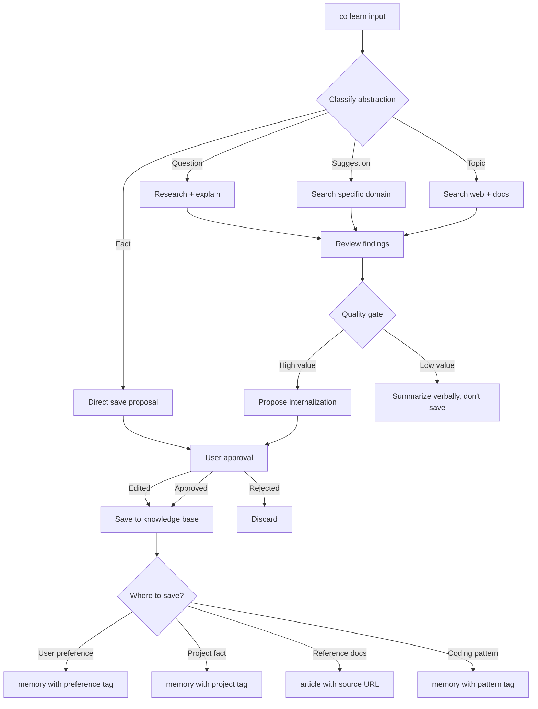

# Design: Learn Agent (Knowledge Curation)

## 1. What & How

A specialized goal-directed agent for knowledge acquisition and curation. Handles inputs at multiple abstraction levels (topics, suggestions, facts), autonomously researches using available tools, reviews findings, and selectively internalizes to the internal knowledge base with user approval.

**Command:**
```bash
co learn <input>                    # Single-shot with various abstraction levels
co learn --interactive              # Multi-turn knowledge session
```

**Input abstraction levels:**

| Level | Example | Agent Behavior |
|-------|---------|----------------|
| **Topic** | `co learn "Python async patterns"` | Search → Fetch → Review → Propose articles to save |
| **Suggestion** | `co learn "how to optimize SQLAlchemy"` | Search docs → Summarize → Propose memories for key techniques |
| **Specific Fact** | `co learn "I prefer pytest"` | Recognize preference → Propose memory with tags |
| **Question** | `co learn "What is Reciprocal Rank Fusion?"` | Search → Read → Summarize → Propose memory + article |

**Design principle:** `co learn` is a **curator**, not just a recorder. It reasons about what's worth keeping, where it should go (context vs. memory vs. article), and proposes structured knowledge with proper tags and categorization.



## 2. Core Logic

### Learn Agent Architecture

**Agent Type:** Goal-directed, single-purpose agent (not the main chat agent)

**Goal:** Acquire and curate knowledge for the internal knowledge base

**Tools Available:**
- `web_search` — Search for relevant content
- `web_fetch` — Fetch and convert HTML to markdown
- `read_file` — Read local documentation
- `list_memories` — Check what's already known
- `recall_memory` — Search existing knowledge
- `save_memory` — Save curated memory
- `save_article` — Save web-fetched article (new tool)
- `update_context` — Propose context.md updates (new tool)

**Exit Conditions:**
- Knowledge internalized (success)
- User rejects all proposals (abort)
- Cannot find relevant information (inform user, no save)
- Max turns reached (10 turns)

### Processing Flow

```python
async def learn_agent_loop(input: str, deps: CoDeps) -> LearnResult:
    """
    Main learn agent loop.

    1. Classify input abstraction level
    2. Execute research strategy
    3. Review findings
    4. Propose internalization
    5. Get user approval
    6. Save to knowledge base
    """

    # Create learn agent with specialized prompt
    agent = Agent(
        model=deps.model,
        deps_type=CoDeps,
        system_prompt=LEARN_AGENT_PROMPT,
        result_type=LearnResult,
    )

    # Run agent loop
    result = await agent.run(
        f"Learn about: {input}",
        deps=deps,
        max_turns=10,
    )

    return result
```

### Input Classification

**Learn agent's first step:** Understand what kind of input it received.

```markdown
## Input Classification

You received: "{input}"

Classify this input into one of these categories:

1. **Topic** — Broad subject to research
   - Examples: "Python async patterns", "FastAPI best practices"
   - Strategy: Search web + docs, review multiple sources, propose articles

2. **Suggestion** — Specific technique or approach to learn
   - Examples: "how to optimize SQLAlchemy queries", "using pytest fixtures"
   - Strategy: Search docs, extract key techniques, propose memories

3. **Fact** — Specific piece of information to remember
   - Examples: "I prefer pytest", "This project uses PostgreSQL"
   - Strategy: Direct save with proper categorization

4. **Question** — Something to research and explain
   - Examples: "What is Reciprocal Rank Fusion?", "How does asyncio work?"
   - Strategy: Research, explain to user, offer to save summary

5. **Instruction** — Meta-command about knowledge management
   - Examples: "forget all testing memories", "export memories to JSON"
   - Strategy: Execute command, no research needed

Based on the input, what category is this?
```

### Research Strategies

#### Strategy: Topic Research

**Goal:** Build broad understanding, find authoritative sources

```python
async def research_topic(topic: str, ctx: RunContext[CoDeps]) -> ResearchResult:
    """
    Research a broad topic.

    1. Web search for overview articles
    2. Web search for official documentation
    3. Fetch top 3-5 sources
    4. Review for quality and relevance
    5. Propose best sources as articles
    """

    # Search for overview
    overview_results = await web_search(
        ctx,
        f"{topic} overview tutorial 2025"
    )

    # Search for official docs
    docs_results = await web_search(
        ctx,
        f"{topic} official documentation"
    )

    # Fetch top sources
    articles = []
    for result in overview_results[:3]:
        content = await web_fetch(ctx, result.url, "Extract key concepts")
        articles.append({
            "url": result.url,
            "title": result.title,
            "content": content,
            "quality_score": _assess_quality(content),
        })

    # Filter high quality
    valuable = [a for a in articles if a["quality_score"] > 0.7]

    return ResearchResult(
        topic=topic,
        sources=valuable,
        proposal=_propose_article_saves(valuable),
    )
```

#### Strategy: Suggestion Research

**Goal:** Extract actionable techniques, create practical memories

```python
async def research_suggestion(suggestion: str, ctx: RunContext[CoDeps]) -> ResearchResult:
    """
    Research a specific technique or approach.

    1. Search for technique documentation
    2. Extract key patterns and best practices
    3. Propose multiple focused memories (not monolithic article)
    """

    # Search for technique
    results = await web_search(
        ctx,
        f"{suggestion} best practices examples"
    )

    # Fetch top source
    content = await web_fetch(ctx, results[0].url, "Extract techniques and patterns")

    # LLM: Extract discrete techniques
    techniques = await _extract_techniques(content)

    # Propose separate memories for each technique
    proposals = []
    for tech in techniques:
        proposals.append({
            "content": tech.description,
            "tags": [tech.category, tech.domain, "technique"],
            "source": "detected",
        })

    return ResearchResult(
        suggestion=suggestion,
        techniques=techniques,
        proposal=proposals,
    )
```

#### Strategy: Fact Recording

**Goal:** Directly save with proper categorization and tags

```python
async def record_fact(fact: str, ctx: RunContext[CoDeps]) -> RecordResult:
    """
    Record a specific fact.

    1. Classify signal type (preference, correction, decision, constraint)
    2. Infer domain tags
    3. Determine scope (user, project, language)
    4. Propose memory save
    """

    # LLM: Analyze fact
    analysis = await _analyze_fact(fact)

    # Check for existing similar memory
    existing = await recall_memory(ctx, fact, max_results=3)

    if existing and _is_duplicate(fact, existing):
        return RecordResult(
            action="skip",
            reason="Already known",
            existing_memory=existing[0],
        )

    # Propose save
    return RecordResult(
        action="save",
        content=fact,
        tags=[analysis.signal_type, analysis.domain, analysis.scope],
        source="user-told",
    )
```

### Quality Assessment

**Learn agent evaluates sources before proposing internalization:**

```python
def _assess_quality(content: str) -> float:
    """
    Assess quality of fetched content.

    Criteria:
    - Length: 500-5000 words (0-1 normalized)
    - Code examples: Present? (0.2 bonus)
    - Structure: Headers, lists? (0.2 bonus)
    - Recency: Copyright/updated year (0.2 bonus)
    - Authority: Official docs, known site (0.3 bonus)

    Returns:
        Quality score 0.0-1.0
    """
    score = 0.0

    # Length score (bell curve around 2000 words)
    word_count = len(content.split())
    if 500 <= word_count <= 5000:
        score += min(word_count / 2000, 1.0) * 0.3

    # Code examples
    if "```" in content or "<code>" in content:
        score += 0.2

    # Structure (markdown headers)
    if content.count("#") >= 3:
        score += 0.2

    # Recency (2024-2026)
    import re
    years = re.findall(r'\b(202[4-6])\b', content)
    if years:
        score += 0.2

    # Authority (heuristic: official domains)
    # (In practice, check source URL from ResearchResult)

    return min(score, 1.0)
```

### Internalization Proposals

**Learn agent proposes structured saves with explanations:**

```markdown
## Proposal Format

I researched "{input}" and found the following:

### Summary
[2-3 paragraph summary of findings]

### Proposed Knowledge Saves

**1. Article: "Python Async/Await Patterns"**
- Source: https://realpython.com/async-io-python/
- Quality: High (recent, comprehensive, code examples)
- Why: Authoritative tutorial covering async fundamentals
- Save to: `.co-cli/knowledge/articles/python-async-patterns.md`
- Tags: [python, async, tutorial, reference]

**2. Memory: "async/await vs threading choice"**
- Content: "Use async/await for I/O-bound tasks (network, files). Use threading for CPU-bound tasks with GIL workarounds."
- Why: Practical decision heuristic for choosing concurrency model
- Save to: `.co-cli/knowledge/memories/`
- Tags: [python, async, decision-pattern, concurrency]

**3. Memory: "Common async pitfalls"**
- Content: "Avoid: blocking calls in async functions, forgetting await, mixing sync/async code. Use asyncio.run() as entry point."
- Why: Actionable anti-patterns to remember
- Tags: [python, async, anti-pattern]

---

**Recommendation:** Save all 3 (1 article + 2 memories)

Would you like to:
1. **Approve all** — Save as proposed
2. **Approve selected** — Choose which to save (respond with numbers: 1,2,3)
3. **Edit** — Modify content or tags before saving
4. **Reject all** — Don't save anything
```

### Approval Flow

**User can approve, edit, or reject proposals:**

```python
async def get_approval(proposals: list[SaveProposal]) -> list[ApprovedSave]:
    """
    Get user approval for knowledge saves.

    Displays proposals in rich table format with quality indicators.
    Prompts for approval decision.

    Returns:
        List of approved saves (possibly edited)
    """

    # Display proposals table
    console.print("\n[bold]Knowledge Save Proposals[/bold]\n")

    table = Table()
    table.add_column("#", style="cyan")
    table.add_column("Type", style="yellow")
    table.add_column("Title/Content Preview", style="white")
    table.add_column("Tags", style="dim")
    table.add_column("Quality", style="green")

    for i, prop in enumerate(proposals, 1):
        preview = prop.content[:60] + "..." if len(prop.content) > 60 else prop.content
        quality_bar = "●" * int(prop.quality_score * 5)

        table.add_row(
            str(i),
            prop.type,  # "article" or "memory"
            preview,
            ", ".join(prop.tags[:3]),
            quality_bar,
        )

    console.print(table)

    # Prompt for decision
    console.print("\n[bold]Options:[/bold]")
    console.print("  [cyan]all[/cyan]      — Approve all proposals")
    console.print("  [cyan]1,2,3[/cyan]    — Approve selected numbers")
    console.print("  [cyan]edit N[/cyan]   — Edit proposal N before saving")
    console.print("  [cyan]none[/cyan]     — Reject all")

    choice = console.input("\n[bold]Your choice:[/bold] ").strip().lower()

    if choice == "all":
        return proposals
    elif choice == "none":
        return []
    elif choice.startswith("edit"):
        # Interactive edit flow
        num = int(choice.split()[1])
        edited = await _edit_proposal(proposals[num - 1])
        return [edited]
    else:
        # Selected numbers
        selected = [int(n.strip()) for n in choice.split(",")]
        return [proposals[i - 1] for i in selected]
```

### Saving to Knowledge Base

**After approval, save to appropriate locations:**

```python
async def save_approved(approved: list[ApprovedSave], ctx: RunContext[CoDeps]):
    """
    Save approved knowledge to appropriate locations.

    Routing:
    - Type "memory" → save_memory tool
    - Type "article" → save_article tool (new)
    - Type "context-update" → update_context tool (new)
    """

    results = []

    for save in approved:
        if save.type == "memory":
            result = await save_memory(
                ctx,
                content=save.content,
                tags=save.tags,
            )
            results.append(result)

        elif save.type == "article":
            result = await save_article(
                ctx,
                content=save.content,
                source_url=save.source_url,
                title=save.title,
                tags=save.tags,
            )
            results.append(result)

        elif save.type == "context-update":
            result = await update_context(
                ctx,
                section=save.section,  # "User" or "Project"
                content=save.content,
                global_scope=save.global_scope,
            )
            results.append(result)

    return results
```

## 3. New Tools

### Tool: `save_article`

**Purpose:** Save web-fetched content as article in `articles/` directory.

```python
@agent.tool(requires_approval=True)
async def save_article(
    ctx: RunContext[CoDeps],
    content: str,
    source_url: str,
    title: str,
    tags: list[str] | None = None,
) -> dict[str, Any]:
    """Save web-fetched article to knowledge/articles/.

    Creates markdown file with YAML frontmatter containing article
    metadata and source URL for provenance.

    Args:
        ctx: Agent runtime context
        content: Article content (markdown)
        source_url: Original URL
        title: Article title
        tags: Optional tags for categorization

    Returns:
        dict with keys:
            - display: Confirmation message
            - path: File path where article was saved
            - article_id: Generated article ID (slug)
    """
    article_dir = Path.cwd() / ".co-cli/knowledge/articles"
    article_dir.mkdir(parents=True, exist_ok=True)

    # Generate slug from title
    slug = _slugify(title)
    filename = f"{slug}.md"

    # Build frontmatter
    frontmatter = {
        "source": source_url,
        "title": title,
        "fetched": datetime.now(timezone.utc).isoformat(),
        "tags": tags or [],
    }

    # Build markdown
    md_content = f"---\n{yaml.dump(frontmatter, default_flow_style=False)}---\n\n{content}\n"

    # Write file
    file_path = article_dir / filename
    file_path.write_text(md_content, encoding="utf-8")

    logger.info(f"Saved article: {filename}")

    return {
        "display": f"Saved article: {title}\nLocation: {file_path}\nSource: {source_url}",
        "path": str(file_path),
        "article_id": slug,
    }
```

### Tool: `update_context`

**Purpose:** Propose updates to context.md (always-loaded knowledge).

```python
@agent.tool(requires_approval=True)
async def update_context(
    ctx: RunContext[CoDeps],
    section: str,
    content: str,
    global_scope: bool = False,
) -> dict[str, Any]:
    """Update context.md with new information.

    Used when learned knowledge should be always-loaded rather than
    on-demand (e.g., fundamental user preferences, core project facts).

    Args:
        ctx: Agent runtime context
        section: Section name ("User", "Project", "Learned", or custom)
        content: Content to append to section
        global_scope: If True, update global context; else project context

    Returns:
        dict with keys:
            - display: Confirmation message
            - path: File path updated
            - section: Section updated
    """
    if global_scope:
        context_path = Path.home() / ".config/co-cli/knowledge/context.md"
    else:
        context_path = Path.cwd() / ".co-cli/knowledge/context.md"

    # Read existing context or create template
    if context_path.exists():
        existing = context_path.read_text(encoding="utf-8")
        fm, body = parse_frontmatter(existing)
    else:
        context_path.parent.mkdir(parents=True, exist_ok=True)
        fm = {"version": 1, "updated": datetime.now(timezone.utc).isoformat()}
        body = ""

    # Append to section (or create section)
    if f"# {section}" in body:
        # Section exists, append
        parts = body.split(f"# {section}")
        before = parts[0]
        after_parts = parts[1].split("\n#", 1)
        section_content = after_parts[0]
        rest = "\n#" + after_parts[1] if len(after_parts) > 1 else ""

        new_section = section_content.rstrip() + f"\n{content}\n"
        body = before + f"# {section}" + new_section + rest
    else:
        # Section doesn't exist, create
        body += f"\n\n# {section}\n\n{content}\n"

    # Update timestamp
    fm["updated"] = datetime.now(timezone.utc).isoformat()

    # Write back
    new_content = f"---\n{yaml.dump(fm, default_flow_style=False)}---\n{body}"
    context_path.write_text(new_content, encoding="utf-8")

    logger.info(f"Updated context: {context_path} section '{section}'")

    return {
        "display": f"Updated context.md section '{section}'\nLocation: {context_path}",
        "path": str(context_path),
        "section": section,
    }
```

## 4. Interactive Mode

**`co learn --interactive`** starts a multi-turn knowledge curation session.

```python
@app.command()
def learn(
    input: str = typer.Argument(None, help="What to learn (topic, question, fact)"),
    interactive: bool = typer.Option(False, "--interactive", "-i", help="Interactive mode"),
):
    """Learn and curate knowledge for the internal knowledge base.

    Modes:
    - Single-shot: co learn "Python async patterns"
    - Interactive: co learn --interactive

    The learn agent researches the topic using available tools,
    reviews findings, and proposes structured knowledge saves.
    """

    if interactive:
        asyncio.run(_interactive_learn_session())
    elif input:
        asyncio.run(_single_shot_learn(input))
    else:
        console.print("[red]Error: Provide input or use --interactive[/red]")
        raise typer.Exit(1)


async def _interactive_learn_session():
    """Interactive multi-turn knowledge curation."""
    console.print("[bold cyan]Learn Agent — Interactive Mode[/bold cyan]")
    console.print("Enter topics, questions, or facts to learn. Type 'done' to exit.\n")

    deps = create_deps()

    while True:
        user_input = console.input("[bold]What should I learn?[/bold] ").strip()

        if user_input.lower() in ("done", "exit", "quit"):
            break

        if not user_input:
            continue

        # Run learn agent
        try:
            result = await learn_agent_loop(user_input, deps)

            # Display result
            if result.saved:
                console.print(f"\n[green]✓[/green] Saved {len(result.saved)} knowledge item(s)")
                for item in result.saved:
                    console.print(f"  - {item.type}: {item.title or item.content[:50]}")
            else:
                console.print(f"\n[yellow]No knowledge saved[/yellow]")
                if result.reason:
                    console.print(f"[dim]Reason: {result.reason}[/dim]")

            console.print()

        except Exception as e:
            console.print(f"[red]Error:[/red] {e}")
            logger.exception("Learn agent error")

    console.print("[dim]Learn session ended[/dim]")


async def _single_shot_learn(input: str):
    """Single-shot knowledge acquisition."""
    deps = create_deps()

    console.print(f"[bold cyan]Learning about:[/bold cyan] {input}\n")

    result = await learn_agent_loop(input, deps)

    # Display result
    if result.saved:
        console.print(f"\n[green]✓[/green] Saved {len(result.saved)} knowledge item(s):")
        for item in result.saved:
            console.print(f"  - {item.display}")
    else:
        console.print(f"\n[yellow]No knowledge saved[/yellow]")
        if result.reason:
            console.print(f"Reason: {result.reason}")
```

## 5. Learn Agent Prompt

```markdown
# Learn Agent System Prompt

You are a knowledge curation agent. Your goal is to research topics,
extract valuable information, and propose structured knowledge saves
for the internal knowledge base.

## Your Capabilities

You have access to these tools:
- web_search: Search the web for information
- web_fetch: Fetch and convert web pages to markdown
- read_file: Read local documentation files
- list_memories: See what's already known
- recall_memory: Search existing knowledge
- save_memory: Save curated memories
- save_article: Save web-fetched articles
- update_context: Update always-loaded context

## Your Process

1. **Classify Input**: Understand what kind of input you received
   - Topic (broad research needed)
   - Suggestion (specific technique)
   - Fact (direct save)
   - Question (research + explain)

2. **Research Strategy**: Execute appropriate research
   - Topics: Search multiple sources, assess quality
   - Suggestions: Find best practices and patterns
   - Facts: Check for duplicates, categorize
   - Questions: Research and explain, offer to save

3. **Quality Gate**: Evaluate findings
   - Is this valuable enough to save?
   - Is it authoritative and recent?
   - Does it have practical utility?
   - Is it already known?

4. **Propose Saves**: Structure knowledge appropriately
   - Articles: Reference documentation, tutorials
   - Memories: Facts, patterns, preferences, decisions
   - Context updates: Fundamental preferences

5. **Get Approval**: Present proposals clearly
   - Show what you found and why it's valuable
   - Explain your categorization and tagging
   - Let user approve, edit, or reject

## Output Format

Always end with a structured proposal:

### Summary
[Brief summary of what you found]

### Proposed Saves

**1. [Type]: "[Title/Preview]"**
- [Metadata: source, tags, quality]
- Why: [Explanation]

**2. [Type]: "[Title/Preview]"**
...

### Recommendation
[Your recommendation: save all, save selected, or don't save]

## Quality Standards

Only propose saves that are:
- ✓ Valuable: Practical utility or reference value
- ✓ Authoritative: From reliable sources (official docs, known sites)
- ✓ Recent: Current information (2024-2026 preferred)
- ✓ Novel: Not already in knowledge base
- ✓ Clear: Well-written, has examples

Don't save:
- ✗ Outdated information (pre-2023 unless fundamental)
- ✗ Low-quality sources (ad-heavy, thin content)
- ✗ Duplicates of existing knowledge
- ✗ Overly specific or niche without broad applicability
- ✗ Speculation or unverified claims
```

## 6. Config

| Setting | Env Var | Default | Description |
|---------|---------|---------|-------------|
| `learn_agent_model` | `CO_CLI_LEARN_AGENT_MODEL` | (inherits main) | Model for learn agent |
| `learn_max_turns` | `CO_CLI_LEARN_MAX_TURNS` | `10` | Max research turns |
| `learn_quality_threshold` | `CO_CLI_LEARN_QUALITY_THRESHOLD` | `0.7` | Min quality score to propose |
| `learn_max_sources` | `CO_CLI_LEARN_MAX_SOURCES` | `5` | Max sources to fetch |

## 7. Files

| File | Purpose |
|------|---------|
| `co_cli/learn_agent.py` | Learn agent implementation (loop, classification, research strategies) |
| `co_cli/tools/article.py` | `save_article` and `update_context` tools |
| `co_cli/prompts/learn_agent.md` | Learn agent system prompt |
| `tests/test_learn_agent.py` | Learn agent tests (15 tests) |

## 8. Usage Examples

### Example 1: Topic Research

```bash
$ co learn "Python async patterns"

Learning about: Python async patterns

Searching for: "Python async patterns tutorial 2025"
Found 8 results...

Fetching: https://realpython.com/async-io-python/
Fetching: https://docs.python.org/3/library/asyncio.html
Fetching: https://superfastpython.com/python-asyncio/

Reviewing sources...
- realpython.com: High quality (0.9) — comprehensive tutorial with examples
- docs.python.org: High quality (0.95) — official documentation
- superfastpython.com: Medium quality (0.7) — practical examples

━━━━━━━━━━━━━━━━━━━━━━━━━━━━━━━━━━━━━━━━━━━━━━━━━━━━━━━━━━━━

Summary:
Found comprehensive coverage of Python async/await patterns. Official docs
provide API reference, while Real Python offers practical tutorial with
examples. Key concepts: event loop, coroutines, tasks, asyncio patterns.

Proposed Saves:

1. Article: "Python Async I/O Tutorial"
   Source: https://realpython.com/async-io-python/
   Tags: [python, async, tutorial, reference]
   Quality: ●●●●● (0.9)
   Why: Comprehensive tutorial covering async fundamentals with examples

2. Article: "Python asyncio — Official Docs"
   Source: https://docs.python.org/3/library/asyncio.html
   Tags: [python, async, reference, official]
   Quality: ●●●●● (0.95)
   Why: Authoritative API reference

3. Memory: "async/await vs threading choice"
   Content: "Use async/await for I/O-bound (network, files). Use threading..."
   Tags: [python, async, decision-pattern]
   Why: Practical decision heuristic

4. Memory: "asyncio entry point pattern"
   Content: "Use asyncio.run() as entry point for async programs..."
   Tags: [python, async, pattern]
   Why: Standard idiom for running async code

━━━━━━━━━━━━━━━━━━━━━━━━━━━━━━━━━━━━━━━━━━━━━━━━━━━━━━━━━━━━

Recommendation: Save all (2 articles + 2 memories)

Your choice: all

✓ Saved 4 knowledge items:
  - article: Python Async I/O Tutorial
  - article: Python asyncio — Official Docs
  - memory: async/await vs threading choice
  - memory: asyncio entry point pattern
```

### Example 2: Specific Fact

```bash
$ co learn "I prefer pytest over unittest"

Learning about: I prefer pytest over unittest

Classifying as: User Preference

Checking for existing memories...
No similar memory found.

━━━━━━━━━━━━━━━━━━━━━━━━━━━━━━━━━━━━━━━━━━━━━━━━━━━━━━━━━━━━

Proposed Save:

1. Memory: "User prefers pytest over unittest"
   Content: "User prefers pytest over unittest for testing"
   Tags: [preference, testing, python]
   Source: user-told
   Why: User preference to remember across sessions

━━━━━━━━━━━━━━━━━━━━━━━━━━━━━━━━━━━━━━━━━━━━━━━━━━━━━━━━━━━━

Your choice: all

✓ Saved 1 memory: User prefers pytest over unittest
```

### Example 3: Interactive Mode

```bash
$ co learn --interactive

Learn Agent — Interactive Mode
Enter topics, questions, or facts to learn. Type 'done' to exit.

What should I learn? FastAPI dependency injection

[... agent researches ...]

✓ Saved 3 knowledge items

What should I learn? I prefer SQLAlchemy over raw SQL

✓ Saved 1 memory

What should I learn? done

Learn session ended
```

## 9. Future Enhancements

### Phase 2: Smart Deduplication

- Before saving article, check if URL already fetched
- If article exists but outdated (>1 year), propose update
- Merge overlapping articles from same domain

### Phase 3: Learning Plans

```bash
co learn --plan "Master Python async"

Creating learning plan...

Plan: Master Python async (5 topics)
1. Async fundamentals (coroutines, event loop)
2. asyncio patterns (tasks, gather, wait)
3. Async I/O (aiohttp, aiofiles)
4. Error handling in async code
5. Testing async code

Start learning? [y/n]: y

[Agent works through plan, presents findings after each topic]
```

### Phase 4: Spaced Repetition

- Track when articles were saved
- Suggest review after 1 week, 1 month, 3 months
- `co knowledge review` — quiz on saved knowledge

### Phase 5: Knowledge Graph

- Link related memories and articles
- `co knowledge graph` — visualize connections
- Auto-suggest related knowledge when saving
