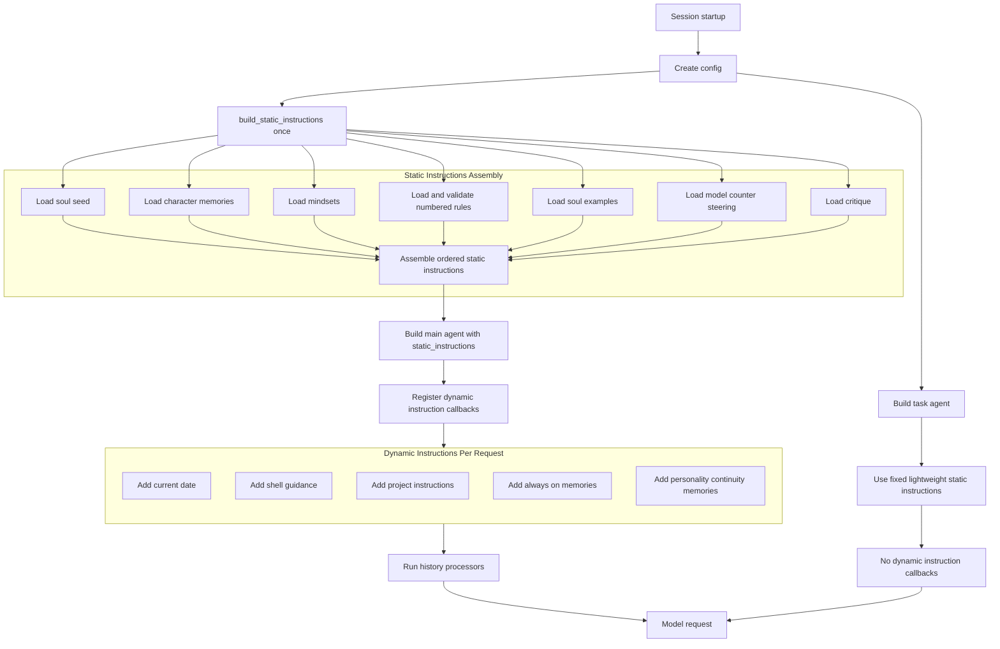

# TODO: Prompt Assembly Simplification

**Slug:** `prompt-assembly-simplification`
**Status:** Draft — awaiting Gate 1
**Task type:** `refactor` — code reorganization without behavior change

---

## Context

Deep scan of the current prompt construction path found that the implementation is
functionally correct but harder to reason about than it needs to be.

Current path:

- `create_deps()` builds `config.system_prompt` once at startup
- `_build_system_prompt()` loads personality assets, pre-combines some of them, and
  then delegates to `assemble_prompt()`
- `assemble_prompt()` appends static scaffold parts in order
- `_build_system_prompt()` appends critique afterward as a separate final step
- `build_agent()` passes the resulting string via `instructions=config.system_prompt`
- `build_agent()` then registers five dynamic `@agent.instructions` callbacks

Key findings from inline current-state validation:

- All 5 tasks are unshipped — `CoConfig.system_prompt`, `_build_system_prompt()`, and
  the split assembly pattern are still active in `deps.py:168`, `_assembly.py:141`, and
  `_bootstrap.py:135–141`
- `_loader.py:18` docstring says callers are in `agent.py`; they are in `_assembly.py` —
  stale, must be updated in TASK-3 or TASK-5
- `co_cli/prompts/__init__.py` docstring says "Personality is injected per turn via
  @agent.instructions, not here" — incorrect; personality IS loaded at static assembly
  time. Update in TASK-5 sweep
- `evals/eval_conversation_history.py:362` does `from co_cli.prompts import assemble_prompt`,
  but `__init__.py` is docstring-only — this import is **already broken** regardless of any
  rename. TASK-5 must unconditionally fix the import path. Line 374 sets
  `agent.system_prompt = new_prompt` directly on the pydantic-ai Agent — this is not a
  documented public setter and may be silently broken; must be verified in TASK-5

**Regression surface (refactor check):**
- `CoConfig.system_prompt` rename touches `deps.py:168`, `_bootstrap.py:141`,
  `agent.py:222`; no test constructs `CoConfig(system_prompt=...)` directly so
  the rename is test-safe
- `assemble_prompt()` rename/signature change touches: `_assembly.py`,
  `_bootstrap.py` (via `_build_system_prompt`), and `evals/eval_conversation_history.py`
- Static section order must be verified unchanged through TASK-2 and TASK-3;
  any drift here silently changes model behavior

**Workflow hygiene:** No stale TODO files with all-done tasks found.

---

## Problem & Outcome

**Problem:** Static prompt assembly is spread across `_build_system_prompt()` and
`assemble_prompt()`, with partially pre-combined personality content and a critique
append step outside the main ordered assembly. Names such as `system_prompt` and
`_build_system_prompt()` imply a pydantic-ai `system_prompt` path, but the main agent
actually uses `instructions=...`.

**Failure cost:** Developers reading `agent.py` or `create_deps()` cannot determine
the actual static assembly order without mentally merging two functions plus an
out-of-band critique append. Misleading names create a subtle API confusion between
pydantic-ai's `system_prompt=` and `instructions=` concepts, increasing the risk of
future prompt-layer bugs.

**Outcome:** One linear, explicit static-instructions assembly path with accurate naming,
single-point ordering, and a clearer static-vs-dynamic boundary. Dynamic
`@agent.instructions` remain intact and clearly separated from the static scaffold.

---

## Scope

### In scope

- Rename `_build_system_prompt()` → `build_static_instructions()` and
  `CoConfig.system_prompt` → `CoConfig.static_instructions`
- Flatten static assembly so the full section order is visible from one function
- Separate per-section content loading from the ordered assembly step
- Tighten comments on the static-vs-dynamic boundary in `agent.py`
- Sweep all stale references and update `_loader.py` and `__init__.py` docstrings
- Fix `evals/eval_conversation_history.py:362` import unconditionally (already broken —
  `from co_cli.prompts import assemble_prompt` fails at runtime today)
- Verify and fix `evals/eval_conversation_history.py:374` `agent.system_prompt = new_prompt`
  assignment (not a documented pydantic-ai public setter)

### Out of scope

- Changing history processors, memory recall, or tool wiring
- Replacing dynamic `@agent.instructions` with a different framework pattern
- Changing agent behavior, personality content, or prompt semantics beyond assembly cleanup
- Changing personality asset storage, file layout, or selection semantics
- Moving project instructions, always-on memories, or personality-continuity memories
  into the static prompt

---

## Behavioral Constraints

- Keep pydantic-ai usage idiomatic: static `instructions=...` plus dynamic `@agent.instructions`
- Preserve effective prompt content order: the assembled static string must contain soul
  seed text before any rule file content, rules before soul examples, soul examples before
  counter-steering, and counter-steering before critique — verified by the section-order
  test added in TASK-2
- Avoid speculative abstractions; prefer a flatter assembly path over new indirection
- Task agent must use the `_TASK_AGENT_SYSTEM_PROMPT` constant (unchanged string) and
  must not receive any output of `build_static_instructions()`
- Preserve existing optional-file and missing-file degradation behavior for personality
  assets (absent files silently omitted, not raised)

---

## High-Level Design

The post-refactor flow collapses the two-stage static build into one function that:
1. Loads each personality asset as a distinct named value
2. Assembles them in explicit order alongside rules, counter-steering, and critique



---

## Implementation Plan

### ✓ DONE — TASK-1: Rename static prompt terminology to match actual SDK usage

**prerequisites:** none

The main agent uses `instructions=...`, not `system_prompt=...`. Rename the static prompt
builder and config field so the code reflects what pydantic-ai is actually doing.

**What to do:**
- Rename `_build_system_prompt()` to `build_static_instructions()` in `_assembly.py`
- Rename `CoConfig.system_prompt` to `CoConfig.static_instructions` in `deps.py`
- Update `_bootstrap.py` `dataclasses.replace(config, system_prompt=...)` call to
  `static_instructions=`
- Update `agent.py:222` `instructions=config.system_prompt` to `config.static_instructions`
- Do not widen this task into a broader settings/config rename beyond the main-agent
  static instructions field and builder path
- Keep the task agent's `_TASK_AGENT_SYSTEM_PROMPT` constant naming unchanged (it is
  a plain string constant, not the same concept)

**files:**
- `co_cli/prompts/_assembly.py`
- `co_cli/bootstrap/_bootstrap.py`
- `co_cli/deps.py`
- `co_cli/agent.py`

**done_when:** `grep -n "config\.system_prompt\|system_prompt=" co_cli/deps.py co_cli/bootstrap/_bootstrap.py co_cli/agent.py co_cli/prompts/_assembly.py`
returns zero results. `grep -n "static_instructions\|build_static_instructions" co_cli/deps.py co_cli/bootstrap/_bootstrap.py co_cli/agent.py co_cli/prompts/_assembly.py`
shows the new names at all expected call sites. `uv run pytest tests/test_agent.py` passes.

**success_signal:** N/A (refactor — no user-visible behavior change)

---

### ✓ DONE — TASK-2: Flatten static assembly into one explicit ordered path

**prerequisites:** [TASK-1]

Today the final order is split across `_build_system_prompt()` (now
`build_static_instructions()`) and `assemble_prompt()`. Move to one obvious ordered
function so readers can see the complete static scaffold in one place.

**What to do:**
- Choose one function in `co_cli/prompts/_assembly.py` as the single owner of static
  ordering — `build_static_instructions()` is the natural top-level owner
- Fold critique into that same ordered assembly path instead of appending it afterward
  in a second function step
- Keep the effective section order unchanged:
  1. soul seed (identity anchor)
  2. character memories
  3. mindsets
  4. behavioral rules (numbered, strict order)
  5. soul examples
  6. counter-steering
  7. critique
- `assemble_prompt()` may be folded into `build_static_instructions()` or retained as a
  pure ordered-join helper — whichever is flatter
- Keep rule validation (`_collect_rule_files()`) as a tightly scoped helper; do not
  merge it into the top-level ordering function
- `create_deps()` (bootstrap) should only call the final top-level builder, not
  participate in ordering

**files:**
- `co_cli/prompts/_assembly.py`
- `tests/test_prompt_assembly.py` (new — section-order gate)

**done_when:** A reader can determine the full static instruction order — all seven
sections listed above — from one function in `co_cli/prompts/_assembly.py` without
reading any other assembly function. `grep -n "critique\|soul_seed\|mindset\|rules\|examples\|counter_steering" co_cli/prompts/_assembly.py`
shows all section labels in a single contiguous block. `uv run pytest tests/test_prompt_assembly.py tests/test_agent.py` passes,
including a section-order test that calls `build_static_instructions()` with
`personality="finch"` and asserts 5 critical anchor points in order:
`prompt.index(seed_text) < prompt.index(first_rule_text) < prompt.index(examples_text) < prompt.index(counter_steering_text) < prompt.index(critique_text)`.

**success_signal:** N/A (refactor — no user-visible behavior change)

---

### ✓ DONE — TASK-3: Separate content loading from ordered assembly

**prerequisites:** [TASK-2]

Loading personality assets and ordering them are different concerns. Currently
`_build_system_prompt()` pre-combines soul_seed + character memories + mindsets
into a single `soul_seed` string before passing it to `assemble_prompt()`.
Each section should be a distinct named input at assembly time.

**What to do:**
- Stop pre-combining multiple static sections into `soul_seed` where practical
- Pass named sections (seed, character_memories, mindsets, examples, critique) into
  the final assembler as distinct parameters or local variables rather than folding
  them together early
- Preserve existing file sources and fallback behavior — no change to what files are
  read or what happens when they are absent
- Prefer keeping `co_cli/prompts/personalities/_loader.py` API-stable; only edit the
  loader module to fix its stale docstring (says `agent.py`; should say `_assembly.py`)
- Do not change how personality assets are discovered on disk

**files:**
- `co_cli/prompts/_assembly.py`
- `co_cli/prompts/personalities/_loader.py` (docstring fix only, unless API change needed)

**done_when:** Each of seed, character_memories, mindsets, rules, examples,
counter-steering, and critique appears as a distinct named parameter or local variable
at the point of final assembly in `build_static_instructions()` — none are pre-combined
before reaching the assembly function. `_loader.py` docstring no longer references
`agent.py`. `uv run pytest tests/test_prompt_assembly.py tests/test_agent.py` passes.

**success_signal:** N/A (refactor — no user-visible behavior change)

---

### ✓ DONE — TASK-4: Preserve dynamic instruction layering as-is, but document the split cleanly

**prerequisites:** [TASK-1]

The dynamic instruction callbacks are the idiomatic pydantic-ai part of the design and
should stay. The refactor should make the boundary between static and dynamic layers
explicit.

**What to do:**
- Leave the five `@agent.instructions` callbacks in place unless a change is strictly
  needed
- Add a brief comment block above `Agent(instructions=config.static_instructions, ...)`
  labeling it as the static layer (set once at startup)
- Add a brief comment block above the first `@agent.instructions` decorator labeling
  the section as the dynamic layer (re-evaluated per request)
- Ensure task agent comments still accurately describe what it omits (no dynamic layers,
  no history processors)

**files:**
- `co_cli/agent.py`

**done_when:** `co_cli/agent.py` contains two explicit comment labels — one marking the
static instructions assignment and one marking the dynamic instruction callbacks section.
`uv run pytest tests/test_agent.py` passes.

**success_signal:** N/A (refactor — no user-visible behavior change)

---

### ✓ DONE — TASK-5: Update tests and references after rename/refactor

**prerequisites:** [TASK-1, TASK-2, TASK-3, TASK-4]

This refactor touches naming and prompt construction. Any stale references will create
silent confusion even if runtime behavior still works.

**What to do:**
- Grep repo-wide for old names: `_build_system_prompt`, `assemble_prompt` (if renamed),
  `system_prompt` (check for stale vs legitimate remaining uses)
- Update `co_cli/prompts/__init__.py` docstring: remove "Personality is injected per turn
  via @agent.instructions, not here" — personality IS loaded at static assembly time
- **Unconditionally** fix `evals/eval_conversation_history.py:362`: change
  `from co_cli.prompts import assemble_prompt` to import from `co_cli.prompts._assembly`
  (or the new name) — this import is already broken today and must be fixed regardless
  of any rename
- **Unconditionally** verify and fix `evals/eval_conversation_history.py:374`:
  `agent.system_prompt = new_prompt` sets an attribute that is not a documented
  pydantic-ai public setter; confirm the correct API and update accordingly
- Update any remaining test or doc files referencing superseded names
- Run scoped tests first, then full suite before shipping

**files:**
- `co_cli/prompts/__init__.py`
- `evals/eval_conversation_history.py` (unconditional — already broken)
- any remaining repo files referencing old naming

**done_when:** `grep -r "_build_system_prompt\|\.system_prompt" co_cli/ tests/ --include="*.py"`
returns zero results. `grep -r "from co_cli.prompts import" evals/ --include="*.py"` shows
no bare package-namespace imports for symbols that live in submodules. `grep -n "agent\.system_prompt" evals/eval_conversation_history.py`
returns zero results (assignment removed or replaced with documented API). Full pytest
suite passes with output piped to timestamped log.

**success_signal:** N/A (refactor — no user-visible behavior change)

---

## Dependency Order

```text
TASK-1 rename terminology
  -> TASK-4 tighten static vs dynamic boundary comments  (parallel with TASK-2/3)
  -> TASK-2 flatten static ordering
  -> TASK-3 separate loading from ordering
  -> TASK-5 sweep references and validate
```

Conservative serial order: TASK-1 -> TASK-4 -> TASK-2 -> TASK-3 -> TASK-5

Note: TASK-4 depends only on TASK-1 and touches only `agent.py`. It can run in parallel
with TASK-2 and TASK-3 after TASK-1 completes if a parallel dev session is used.

---

## Testing

Implementation-phase testing:

- Run `uv run pytest tests/test_agent.py` after each task (fast, covers construction path)
- Run `uv run pytest tests/test_bootstrap.py tests/test_config.py` after TASK-1 (rename
  touches CoConfig and bootstrap wiring)

Ship-phase testing (TASK-5):

- Run full pytest suite with mandatory timestamped log capture per repo policy

Verification focus:

- Static instructions are assembled once at startup via `build_static_instructions()`
- Dynamic `@agent.instructions` still run per request (five callbacks present)
- Main agent still uses one static-instructions string plus five dynamic callbacks
- Task agent still omits dynamic layers and history processors
- Personality asset loading still uses the same files and fallback behavior for:
  `personality="finch"` and `personality=None`
- The final static section order is easy to read from one function and is explicitly
  reviewed against the seven-section list in TASK-2

---

## Open Questions

None — all questions answerable by inspection were resolved during current-state validation.


## Final — Team Lead

Plan approved.

> Gate 1 — PO review required before proceeding.
> Review this plan: right problem? correct scope?
> Once approved, run: `/orchestrate-dev prompt-assembly-simplification`

## Independent Review

| File | Finding | Severity | Task |
|------|---------|----------|------|
| `co_cli/prompts/_manifest.py` | `PromptManifest` is now unreferenced — the only importer (`_assembly.py`) dropped it in this diff. The file is dead code. Engineering rules require dead code to be removed during implementation, not deferred. | blocking | TASK-2 / TASK-5 |
| `co_cli/agent.py:205` | Docstring still reads `config: Session config — system prompt, tool policy, MCP servers.` — "system prompt" is a stale reference after the TASK-1 rename to `static_instructions`. | minor | TASK-1 / TASK-5 |

**Overall: 1 blocking, 1 minor**

*Both findings fixed post-review: `_manifest.py` deleted; `agent.py:205` docstring updated.*

## Delivery Summary — 2026-03-31

| Task | done_when | Status |
|------|-----------|--------|
| TASK-1 | zero stale `config.system_prompt` references; new names at all expected call sites; `test_agent.py` passes | ✓ pass |
| TASK-2 | full static order readable from `build_static_instructions()` without reading other assembly functions; section-order test passes | ✓ pass |
| TASK-3 | seven distinct named variables at point of final assembly; `_loader.py` docstring updated | ✓ pass |
| TASK-4 | two explicit comment labels in `agent.py` (static layer + dynamic layer) | ✓ pass |
| TASK-5 | zero stale `_build_system_prompt`/`assemble_prompt`/`.system_prompt` refs in `co_cli/`+`tests/`; eval import fixed; `agent.system_prompt` assignment removed | ✓ pass |

**Tests:** full suite — 259 passed, 0 failed (1:51)
**Independent Review:** 1 blocking (orphaned `_manifest.py`), 1 minor (stale docstring) — both fixed
**Doc Sync:** fixed (DESIGN-bootstrap.md, DESIGN-context.md, DESIGN-system.md — 3 docs updated; 5 clean)

**Overall: DELIVERED**
All five tasks shipped. One blocking finding from review (dead `_manifest.py`) and one minor finding (stale docstring) resolved before delivery summary. Static assembly is now a single linear function with explicit 7-section ordering; names match pydantic-ai SDK usage throughout.

## Implementation Review — 2026-03-31

### Evidence
| Task | done_when | Spec Fidelity | Key Evidence |
|------|-----------|---------------|-------------|
| TASK-1 | zero stale `config.system_prompt`; new names at all call sites | ✓ pass | `deps.py:168` — `static_instructions: str = ""`; `_assembly.py:67` — `def build_static_instructions(`; `_bootstrap.py:141` — `static_instructions=build_static_instructions(...)`; `agent.py:223` — `instructions=config.static_instructions`; grep zero for old names |
| TASK-2 | full static order from one function; section-order test passes | ✓ pass | `_assembly.py:85–140` — all 7 sections in one contiguous block with labeled comments; `test_prompt_assembly.py` passes |
| TASK-3 | seven distinct named vars at assembly; `_loader.py` docstring updated | ✓ pass | `_assembly.py:87–105` — `seed`, `character_memories`, `mindsets`, `examples`, `critique` as distinct locals; rules via `_collect_rule_files()` (separate helper); `_loader.py:16–18` — callers line references `_assembly.py` |
| TASK-4 | two comment labels in `agent.py` | ✓ pass | `agent.py:219` — "Static layer — set once at agent construction"; `agent.py:236` — "Conditional prompt layers — runtime-gated via @agent.instructions" |
| TASK-5 | zero stale refs in `co_cli/`+`tests/`; eval import fixed; `agent.system_prompt` removed | ✓ pass | grep returns zero for `_build_system_prompt`, `assemble_prompt`, `.system_prompt` in co_cli/+tests/; `evals/eval_conversation_history.py` has no bare `from co_cli.prompts import` or `agent.system_prompt`; `_manifest.py` deleted (Glob returns nothing) |

### Issues Found & Fixed
No issues found. The two findings from the delivery-phase review (`_manifest.py` dead code, stale docstring in `agent.py:205`) were both fixed before the delivery summary was written; they do not reappear in this independent pass.

The single remaining `system_prompt` token in the codebase (`_history.py:269`) is an intentional SDK-terminology comment ("Use instructions (not system_prompt) so…"), not a stale reference.

### Tests
- Command: `uv run pytest -v`
- Result: 259 passed, 0 failed
- Log: `.pytest-logs/<timestamp>-review-impl-full.log`

### Doc Sync
- Scope: narrow — refactor is self-contained to prompts/assembly path and config field rename; no public API added, no schema changed beyond the rename already captured in DESIGN docs during delivery.
- Result: clean — 3 DESIGN docs were updated during delivery; re-scan finds no residual inaccuracies.

### Behavioral Verification
- `uv run co config`: ✓ healthy — LLM Online, Shell Active, MCP 2 ready, Knowledge synced; all integrations report expected status. System starts cleanly; `static_instructions` assembly path runs at startup without error.

### Overall: PASS
Refactor is clean, complete, and correct. All five tasks meet their `done_when` criteria with file:line evidence, full test suite is green at 259/259, and the running system is healthy.
