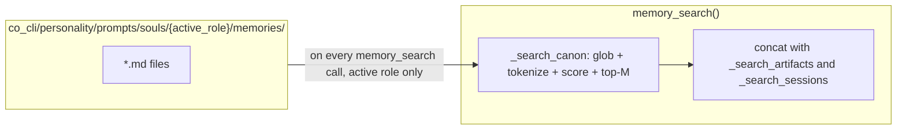

# Plan: Character Memory to Search Channel

Task type: code-feature

## Context

Today, character memories live as a static block in the system prompt. `build_static_instructions()` (`co_cli/context/assembly.py:120,130`) calls `load_character_memories(role)` and concatenates `co_cli/personality/prompts/souls/{role}/memories/*.md` as a `## Character` section between the soul seed and mindsets. Raw `wc -l` over those files gives TARS 110 lines, Finch 107, Jeff 77; rendered (post-frontmatter-strip with separators) the blocks weigh ~5K, ~4K, ~2K chars respectively. Every turn pays this token cost regardless of whether the model needs canon to answer.

The change is in how that content is consumed, not where it lives: scanned on demand by a search channel, not concatenated into the static system prompt. The two-leg personality architecture this plan completes:
- **Static priming**: seed (identity contract + Never list — already 18 lines for TARS, voice-dense) + 6 task-typed mindsets + personality-context artifacts + examples + critique. Always-on, task-conditioned behavior coverage.
- **Dynamic recall** (this work): canon scenes recalled on demand via `memory_search`.

Per `docs/specs/personality.md` §2 "Asset Taxonomy: Canon vs Distillation": canon (memories) is observational and discrete by nature — a scene either matches the moment or doesn't. Distilled assets (mindsets, seed, examples, critique) prime behavior on every turn and stay static; canon moves to a searchable channel.

Peer survey results (`docs/reference/RESEARCH-prompt-gaps-co-vs-hermes.md` and follow-up research): no peer co-indexes canon with user knowledge under a "gentle BM25 boost" — they either pin (Letta), use binary always-fire flags (SillyTavern `constant`), reserve token budget tiers, or use ≥10× multipliers for tier dominance. The peer-aligned solution within our unified `memory_search` surface is a **separate channel with its own budget**, not score boosting.

**Doc accuracy:** `docs/specs/personality.md` §1 step `[2] character memories` and `docs/specs/prompt-assembly.md` §2.1 step `2. Character memories` describe the static-injection model and will need a post-delivery `sync-doc` pass to reframe `souls/{role}/memories/*.md` as a search-channel source rather than a static prompt input. The Asset Taxonomy table in §2 of `personality.md` already aligns with the new model.

**Workflow artifact hygiene:** No stale exec-plans for this scope. No prior plan with this slug.

## Problem & Outcome

**Problem:** Character memories are statically injected into the system prompt every turn, paying ~77–110 lines of token cost per role today (≈2K–5K chars rendered) regardless of relevance, while providing diffuse texture rather than task-precise behavior. The static block also breaks down at scale — a character with 50+ memory files would bloat the prompt unboundedly.

**Failure cost:** Token tax on every turn for content the model usually doesn't need, no path to scale character lore beyond the per-prompt token ceiling, and the model has no way to *search* canon when it would actually help (e.g. user references a specific scene).

**Outcome:** `memory_search` gains a third channel — `_search_canon` — that scans `co_cli/personality/prompts/souls/{role}/memories/*.md` for the active role on each non-empty query, scores by token overlap (title 2× weight), and returns up to M=3 hits merged with T2/T1 results. The static prompt drops the `## Character` block; the static layer carries voice via seed + mindsets + personality-context. The LLM sees one merged result list — no `kind=character-memory` exposed in tool surfaces.

**Success signal (user-observable):** With `personality=tars`, asking "what's TARS's deal with humor?" surfaces canon hits from `tars-humor-is-tactical-front-loaded-delivered-flat.md` via `memory_search`; the system prompt no longer contains a `## Character` block; voice cadence on coding/exploration/debugging tasks remains consistent vs. baseline.

## Scope

**In scope:**
- New `search_canon(query, role, limit)` function in `co_cli/tools/memory/_canon_recall.py` — globs `souls/{role}/memories/*.md`, tokenizes with shared `STOPWORDS`, scores by token overlap (title 2× weight), returns top-M dicts with `tier="canon"`
- Third channel in `memory_search` (`co_cli/tools/memory/recall.py`) — parallel to `_search_artifacts` / `_search_sessions`, role pulled from `config.personality`, cap M from `config.knowledge.character_recall_limit`
- New config field `character_recall_limit: int = 3` on `KnowledgeSettings` (env `CO_CHARACTER_RECALL_LIMIT`)
- Removal of `## Character` block from `build_static_instructions` (`co_cli/context/assembly.py`)
- Unit tests + voice baseline + eval gate

**Out of scope (flagged as follow-ups):**
- Directory restructuring of `personality/` — elevating `souls/` out of `prompts/`, consolidating `profiles/{role}.md` into `souls/{role}/profile.md`. Worth doing if the misnomer becomes load-bearing for new work; not warranted today.
- Removal of `load_character_memories` from `loader.py` — becomes dead code after TASK-4 but still resolves correctly; prune in a `/sync-doc` pass.
- Agent-writable canon (would require a fourth channel or a T2 subtype with canon priority — not needed; T2 with `role` tag already serves agent-learned character context)
- Per-user character memory augmentation (override or extension of shipped canon)
- Score boost / multiplier (rejected by peer research — gentle boosts have no precedent; channel separation is the peer-aligned answer)
- Hybrid (vector) search over canon — current scale doesn't warrant it; token overlap is sufficient
- Minimum-score floor on the canon channel (deferred — start with no explicit floor, rely on top-M ranking; add if eval shows noise)
- Spec doc updates (`docs/specs/personality.md`, `memory.md`, `prompt-assembly.md`) — handled post-delivery by `sync-doc`, not part of plan tasks

## Behavioral Constraints

- **No LLM-visible distinction between canon and other memory results.** The `memory_search` tool description, return schema, and result formatting must keep canon results merged into the same list as T2/T1. Adding a `kind=character-memory` or a separate tool would re-introduce the surface complexity we're avoiding.
- **Static prompt cache stability preserved.** The canon scan runs only when `memory_search` is invoked, never in `@agent.instructions`. The static prompt becomes shorter and stable across sessions for a given personality — prefix cache improves, never degrades.
- **Read-only at runtime.** Canon is package data; no agent tool writes to `souls/{role}/memories/`. Agent-learned character context (e.g. "Finch's terse tone confirmed by user") flows through T2 with a `role` tag, not into canon.
- **Active-role filter is strict — role comes from config, not from caller.** `_search_canon` reads `role = ctx.deps.config.personality` and only opens `_SOULS_DIR / role / "memories"`. Roles are validated upstream by `co_cli.personality.prompts.validator.VALID_PERSONALITIES` at config-parse time, so untrusted role names cannot reach the path. Defense-in-depth: the resolved memories path must be `is_relative_to(_SOULS_DIR)` before any `glob`. A user running TARS cannot see Finch canon, and the LLM has no parameter to override the active role.
- **Cap M on canon channel, default 3, configurable.** `_search_canon` reads `config.knowledge.character_recall_limit` (env var `CO_CHARACTER_RECALL_LIMIT`, default 3). Caller's `limit` argument does not override this — canon channel has its own budget independent of the caller's general-search budget.
- **Stateless.** `_search_canon` is a pure function over package data — no persistent state, no init step, no deps field. Files added or edited in `souls/{role}/memories/` are picked up on the next call.

### Verification convention for Gate 2

Spec doc updates (`docs/specs/personality.md` §1, `prompt-assembly.md` §2.1, `memory.md`) are deferred to post-delivery `sync-doc` per skill rules. **Gate 2 review must verify against this plan's body** — specifically the "In scope" list, the "Modified files" table in High-Level Design, and each task's `done_when`. Do not use `docs/specs/` as the verification target until `sync-doc` has run; until then, the specs still describe the pre-change static-injection model and would falsely flag the implementation as wrong.

## Failure Modes

Code-grounded reasoning (cannot run live model in plan phase; eval gate validates empirically):

1. **Voice cadence regression after static block removal.** Risk: low. Static layer retains seed (18 lines, identity declaration + 11 Never rules — voice-dense) + 6 mindsets (~57 lines, task-prescriptive) + personality-context + examples + critique. Mindsets are pre-extrapolated for task type; canon is diffuse texture. Mitigation: voice eval test (`eval_character_memory_recall.py` voice subcase) compares cadence on representative tasks.

2. **Canon recall doesn't trigger.** Risk: medium. The model must call `memory_search` to surface canon. For pure character-voice queries the model may not search. Mitigation:
   - Tool description already coaches proactive recall ("the user references a project, person, decision, or concept that seems familiar"). Canon will be reached via the same proactive-recall path that already serves T2 user notes.
   - Eval validates canon-invoking queries surface canon hits.
   - Long-tail mitigation (out of scope): add a per-turn hint when user message contains role-canonical entities. Deferred unless eval shows persistent miss.

3. **Canon noise on non-character queries.** Risk: medium. Weak token-overlap matches may surface on unrelated queries (e.g. a deploy-command question scores >0 against a scene mentioning "deploy"). Mitigation:
   - Stopword filter (shared `STOPWORDS` from `co_cli/memory/_stopwords.py`) strips "the/and/a/is/of/..." before scoring, so empty/stopword-only queries return `[]` naturally.
   - Top-M=3 caps the bleed even when scores are low. The eval's "no bleed" subcase (TASK-5) gates this empirically; failure → add a minimum score floor (e.g. require ≥1 title-token match or ≥2 body-token matches) in a follow-up.

4. **Synonym/stemming blindness in token overlap.** Risk: medium. Token overlap with no stemmer treats "humor"/"humorous" and "calm"/"composed" as unrelated. A query like "is TARS funny?" scores 0 against `tars-humor-is-tactical-...md` despite being topically perfect. Mitigation:
   - TASK-5 canon-recall subcase splits queries into canonical-vocabulary and paraphrase/synonym subgroups; paraphrase hit-rate is recorded as a calibration warning. If <2/3, the follow-up is an algorithm upgrade (light suffix-stripping, in-memory FTS5, or embeddings) — not a static-canon fallback.
   - At 18 files / 10KB the noise floor is naturally low; the upgrade is justified only if the warning fires.

5. **Role mismatch / path traversal.** Risk: low. `config.personality` is validated at config-parse time, and `_search_canon` checks `role_dir.resolve().is_relative_to(_SOULS_DIR.resolve())` before reading. A malicious or buggy role string (e.g. `"../etc"`) returns `[]` cleanly. Tested in `tests/tools/test_memory_search_canon.py`.

6. **Stale file race between glob and read.** Risk: very low. If a `.md` is deleted between `glob` and `read_text` (e.g. dev edit mid-query), the read raises and the entry is skipped silently. Other entries continue to score normally.

## High-Level Design



Each `memory_search` call with a non-empty query reads the active role's `memories/*.md` from package data and scores by token overlap.

### Module layout

| New file / location | Purpose |
|---|---|
| `co_cli/tools/memory/_canon_recall.py` | Module-private helper. Exports `search_canon(query, role, limit) -> list[dict]` and the path constant `_SOULS_DIR = Path(co_cli.personality.__file__).parent / "prompts" / "souls"`. Pure function: glob → tokenize → score → top-M. No I/O outside `_SOULS_DIR / role / "memories"`. |
| `evals/eval_character_voice_baseline.py` | Pre-change baseline capture script (TASK-7), runs against `main` HEAD before TASK-4 |
| `evals/_baselines/character-voice-{tars,finch,jeff}.json` | Captured voice baselines (produced output, checked in) |
| `evals/eval_character_memory_recall.py` | Real-data UAT: voice delta gate, canon recall, no-bleed, M sweep |
| `tests/tools/test_canon_recall.py` | Unit: `search_canon` — token-overlap scoring, title 2× weight, top-M cap, role isolation (TARS query never returns Finch/Jeff hits), missing role dir → `[]`, missing `memories/` subdir → `[]`, stopword-only query → `[]`, path-traversal defense (`role="../etc"` → `[]`), stale-file race (file deleted between glob and read → entry skipped, others continue). |
| `tests/tools/test_memory_search_canon.py` | Unit: `memory_search` canon channel — cap respects `config.knowledge.character_recall_limit`, role pulled from `config.personality` (not from caller arg), empty-query bypass via existing `_browse_recent` early return, tool-description bullet present, render header `**Character canon:**` appears when canon hits present. |
| `tests/context/test_static_instructions_no_character.py` | Unit: static instructions contain no `## Character` block. |

### Modified files

| File | Change |
|---|---|
| `co_cli/context/assembly.py` | Remove `character_memories` import, variable, and the `if character_memories: parts.append(...)` block. Drop the `# 2. Character memories` section from the comment header. |
| `co_cli/personality/prompts/loader.py` | No change. (`load_character_memories` becomes dead code — Out of scope.) |
| `co_cli/personality/prompts/validator.py` | No change. |
| `co_cli/tools/memory/recall.py` | Add `_search_canon(ctx, query)` async wrapper that calls `search_canon(query, role=ctx.deps.config.personality, limit=ctx.deps.config.knowledge.character_recall_limit)` from `_canon_recall.py`. Two guards: (a) `config.personality is None` → `[]`; (b) tokenized query empty (handled inside `search_canon`) → `[]`. Add to `asyncio.gather` in `memory_search`. Concat results into `all_results` with `tier="canon"`. Update result formatting (rendering header `**Character canon:**` + items, parallel to `**Saved artifacts:**` / `**Past sessions:**`). Add one bullet to the tool description's `USE THIS PROACTIVELY when:` list — verbatim text: `"the user asks about your character, your background, how you typically handle a situation, or references your source material."` Empty-query path (`_browse_recent` at `:287-288`) must continue to bypass `_search_canon`. |
| `co_cli/config/knowledge.py` | Add `character_recall_limit: int = Field(default=3, ge=1)` to `KnowledgeSettings` (`knowledge.py:55`, has `extra="forbid"` so the field must be declared explicitly), and add `"character_recall_limit": "CO_CHARACTER_RECALL_LIMIT"` to `KNOWLEDGE_ENV_MAP` (`knowledge.py:18`). The settings are mounted on `Settings.knowledge` in `co_cli/config/core.py:85` — no edit to `core.py` needed. |

No edits to `co_cli/deps.py`, `co_cli/bootstrap/core.py`, or `co_cli/main.py` — `_search_canon` is invoked from `recall.py` and reads package data directly, so it needs no bootstrap step and no deps field.

### Search algorithm

```python
# co_cli/tools/memory/_canon_recall.py
from __future__ import annotations

import re
from pathlib import Path

import co_cli.personality
from co_cli.memory._stopwords import STOPWORDS

_SOULS_DIR = (Path(co_cli.personality.__file__).parent / "prompts" / "souls").resolve()

_TOKEN_RE = re.compile(r"[a-z0-9]+")


def _tokenize(text: str) -> set[str]:
    return {t for t in _TOKEN_RE.findall(text.lower()) if t not in STOPWORDS and len(t) > 1}


def search_canon(query: str, *, role: str, limit: int) -> list[dict]:
    """Glob the active role's memories and return up to `limit` hits, ranked by token overlap.

    Title (filename stem) matches count 2× — filenames are curated descriptors.
    Returns [] if the query has no non-stopword tokens, the role has no memories
    directory, or the resolved path escapes _SOULS_DIR (defense-in-depth).
    """
    q = _tokenize(query)
    if not q or not role:
        return []

    role_dir = (_SOULS_DIR / role / "memories").resolve()
    # Path-traversal defense: role like "../etc" cannot escape souls/
    try:
        role_dir.relative_to(_SOULS_DIR)
    except ValueError:
        return []
    if not role_dir.is_dir():
        return []

    hits: list[dict] = []
    for path in sorted(role_dir.glob("*.md")):
        try:
            body = path.read_text(encoding="utf-8")
        except OSError:
            continue  # file deleted between glob and read — skip
        title_tokens = _tokenize(path.stem)
        body_tokens = _tokenize(body)
        score = 2 * len(q & title_tokens) + len(q & body_tokens)
        if score == 0:
            continue
        hits.append({
            "tier": "canon",
            "role": role,
            "title": path.stem,
            "snippet": _snippet(body, q),
            "score": score,
            "path": str(path),
            "slug": path.stem,
        })

    hits.sort(key=lambda h: h["score"], reverse=True)
    return hits[:limit]


def _snippet(body: str, q: set[str], width: int = 200) -> str:
    """Return up to `width` chars around the first paragraph that contains a query token,
    or the file head if no paragraph hits. Cheap heuristic — not BM25 snippet quality."""
    for para in body.split("\n\n"):
        if _tokenize(para) & q:
            return para.strip()[:width]
    return body.strip()[:width]
```

The whole module is ~50 lines including the snippet helper.

### memory_search wiring

In `_search_canon`, the role comes from `ctx.deps.config.personality`. Result dicts use `tier="canon"`. The `memory_search` rendering loop adds a `**Character canon:**` section when canon hits are present, parallel to `**Saved artifacts:**` and `**Past sessions:**`. The dict shape:

```python
{"tier": "canon", "role": role, "title": title, "snippet": snippet, "score": score, "path": path, "slug": Path(path).stem}
```

### Decisions and rationale

| Decision | Rationale | Alternatives considered |
|---|---|---|
| Direct file scan, pure function, no persistent state | Corpus is 18 files / ~10KB across all roles. Per-query cost of glob + read + tokenize is sub-millisecond. Each channel of `memory_search` is independent — canon picks the implementation that fits its scale and read pattern. Scale gate: revisit if any role grows past ~50 files. | (a) Pre-loaded inverted index in process memory — rejected: caching adds complexity without measurable benefit at this size. (b) BM25 ranking — rejected: at 18 files, token-overlap with title 2× weight is statistically indistinguishable from BM25. |
| Channel separation, not score boost | Peer research: no peer uses gentle BM25 boosts. SillyTavern uses binary always-fire (`constant`) or ×10000 multipliers; Letta pins canon as static block. Channel separation is the peer-aligned mechanism within our unified `memory_search` surface. | (a) ×1.3 BM25 boost — rejected: too small per peer practice. (b) Reserved top-K slot — rejected: edge-case gymnastics; channel-separate is cleaner. |
| Cap M=3 on canon channel, configurable | Small enough to avoid voice noise, large enough to surface multiple relevant scenes when they exist. Exposed via `CO_CHARACTER_RECALL_LIMIT` so a TASK-5 sweep over {1,2,3,5} produces calibration data without changing the default. | M=2 (more conservative, single-best); hard-coded M=3 (no calibration path). |
| Title (filename stem) weighted 2× over body | Memory filenames are curated, single-claim descriptors (`tars-humor-is-tactical-front-loaded-delivered-flat.md`). A query token landing on the title is a much stronger signal than landing in body prose. 2× is the smallest weighting that meaningfully reorders results in practice; not exposed as config. | (a) Title-only scoring — rejected: misses queries that match body anchors. (b) BM25-style IDF — rejected: not justified at 18-file corpus. |
| Role from `config.personality`, not from caller arg | Active-role isolation is a security property, not a tool surface. The LLM cannot pass `role="finch"` while the user is running TARS — the role is fixed by the session. Caller's `query` is the only LLM-controlled input to `_search_canon`. | Tool argument `role: str | None` — rejected: surface complexity + cross-role leakage risk for zero benefit. |
| Path-traversal defense via `relative_to(_SOULS_DIR)` | `config.personality` is validated upstream by `VALID_PERSONALITIES`, but defense-in-depth: untrusted role strings (config corruption, future extension) cannot escape the souls tree. Three-line check in `search_canon`. | Trust upstream validation only — rejected: cheap insurance; failure mode is silent data leak. |
| **Hybrid intermediate (trimmed static + searchable canon) — REJECTED** | Re-introduces the very pattern we deliberately moved away from. Trimming to "1–2 highest-signal canon excerpts, ~30 lines" is still static-canon under another name and still pays per-turn cost for content that may not match the moment. Voice signal does not need canon excerpts: seed (18 lines, identity + 11 Never rules — voice-dense) + 6 task-typed mindsets + personality-context already carry voice on every turn. The eval gate (TASK-5) is the empirical test for whether this is true; if voice regresses against baseline, *that* failure tells us we need more priming, but the answer would still not be "static canon" — it would be sharper seed/mindset content. | Considered as v1-safer middle ground. Rejected because it muddles the architectural commitment and the eval is designed to catch the exact regression a hybrid would mitigate. |

## Implementation Plan

### TASK-1 — Add `search_canon` function in `_canon_recall.py`

`files:`
- `co_cli/tools/memory/_canon_recall.py` (new)

`prerequisites: []`

`done_when:` `uv run pytest tests/tools/test_canon_recall.py -x` passes — exercises:
- (a) Active-role search returns hits scored by token overlap (title 2× weight); top-M ordering correct.
- (b) **Role isolation:** `search_canon("preparation", role="finch", limit=3)` returns at least one hit; `search_canon("preparation", role="tars", limit=3)` returns no hit referencing the finch file (path under `_SOULS_DIR/finch/memories/` must not appear in tars results). Cross-checked using a real soul that is known to have role-distinctive content.
- (c) **Path-traversal defense:** `search_canon("anything", role="../etc", limit=3) == []` and `search_canon("anything", role="..", limit=3) == []` — the `relative_to(_SOULS_DIR)` check rejects the resolved path before any glob.
- (d) **Missing role memories dir:** synthetic role with no `memories/` subdir → `[]` cleanly, no exception.
- (e) **Stopword-only query:** `search_canon("the and a", role="tars", limit=3) == []` (tokenize returns empty set).
- (f) **Empty role:** `search_canon("humor", role="", limit=3) == []` and `search_canon("humor", role=None, limit=3) == []`.
- (g) **Stale-file race:** monkeypatched `Path.read_text` raises `FileNotFoundError` for one entry → that entry is skipped, others continue and are returned.
- (h) **Snippet quality:** snippet contains at least one query token when the body has one.

`success_signal:` N/A (internal module — exercised by TASK-2 onward).

```python
# Test sketch (concrete behavioral spec):
def test_search_canon_role_isolation():
    # Real package data — finch has "preparation" canon, tars does not.
    finch_hits = search_canon("preparation", role="finch", limit=3)
    tars_hits = search_canon("preparation", role="tars", limit=3)
    assert finch_hits and all("/finch/memories/" in h["path"] for h in finch_hits)
    assert all("/finch/memories/" not in h["path"] for h in tars_hits)

def test_search_canon_path_traversal_rejected():
    assert search_canon("humor", role="../etc", limit=3) == []
    assert search_canon("humor", role="..", limit=3) == []
    assert search_canon("humor", role="tars/../finch", limit=3) == []

def test_search_canon_stopword_only_returns_empty():
    assert search_canon("the and a is of", role="tars", limit=3) == []

def test_search_canon_empty_role_returns_empty():
    assert search_canon("humor", role="", limit=3) == []
    assert search_canon("humor", role=None, limit=3) == []  # type: ignore[arg-type]

def test_search_canon_title_weight():
    # Filename "tars-humor-is-tactical-...md" should outrank a body-only mention.
    hits = search_canon("humor tactical", role="tars", limit=5)
    assert hits[0]["title"].startswith("tars-humor-is-tactical")
```

### TASK-2 — Add canon channel to `memory_search` + config field

`files:`
- `co_cli/tools/memory/recall.py`
- `co_cli/config/knowledge.py`

`prerequisites: [TASK-1]`

`done_when:` `uv run pytest tests/tools/test_memory_search_canon.py -x` passes — exercises:
- (a) Canon-invoking query returns up to `config.knowledge.character_recall_limit` canon hits with `tier="canon"` merged into `all_results` alongside T2/T1.
- (b) **Role from config, not from caller:** `memory_search(ctx, query="humor", role="finch")` is rejected by signature — the tool exposes no `role` argument; role is read inside `_search_canon` from `ctx.deps.config.personality`.
- (c) Result rendering includes a `**Character canon:**` section header when canon hits are present, parallel to `**Saved artifacts:**` and `**Past sessions:**`.
- (d) Empty query (`""`) bypasses `_search_canon` entirely via the existing `_browse_recent` early-return at `recall.py:287-288`.
- (e) Two guards exercised: (i) `config.personality = None` → no canon results, no exception; (ii) stopword-only query (e.g. `"the and a"`) → no canon results, no exception.
- (f) Tool description gains one bullet under `USE THIS PROACTIVELY when:` — verbatim text: `"the user asks about your character, your background, how you typically handle a situation, or references your source material."` Test imports the tool and asserts the substring is present in `memory_search.__doc__`.
- (g) Config field `character_recall_limit` defaults to 3, accepts override via `CO_CHARACTER_RECALL_LIMIT` env var, rejects values < 1 (`Field(ge=1)`).

`success_signal:` In a live `co chat` session running TARS, asking "what's TARS's deal with humor?" produces a `memory_search` invocation whose results include canon hits surfaced under a "Character canon" header.

```python
# Test sketch:
async def test_memory_search_includes_canon_channel(deps_with_personality_tars):
    ctx = make_run_context(deps_with_personality_tars)
    out = await memory_search(ctx, query="humor tactical")
    canon = [r for r in out.metadata["results"] if r["tier"] == "canon"]
    assert 1 <= len(canon) <= 3
    assert all(r["role"] == "tars" for r in canon)
    assert "Character canon:" in out.text

async def test_memory_search_canon_capped_at_recall_limit(deps_with_personality_tars):
    deps_with_personality_tars.config.knowledge.character_recall_limit = 2
    ctx = make_run_context(deps_with_personality_tars)
    out = await memory_search(ctx, query="tars humor mission directive loyalty")
    canon = [r for r in out.metadata["results"] if r["tier"] == "canon"]
    assert len(canon) <= 2

async def test_memory_search_no_personality_skips_canon(deps_no_personality):
    ctx = make_run_context(deps_no_personality)
    out = await memory_search(ctx, query="humor tactical")
    assert not any(r["tier"] == "canon" for r in out.metadata["results"])
```

### TASK-7 — Capture pre-change voice baseline (must complete before TASK-4)

`files:`
- `evals/eval_character_voice_baseline.py` (new — capture-only script; produces baseline files)
- `evals/_baselines/character-voice-tars.json` (new — produced output, checked in)
- `evals/_baselines/character-voice-finch.json` (new — produced output, checked in)
- `evals/_baselines/character-voice-jeff.json` (new — produced output, checked in)

`prerequisites: []`

`done_when:` `uv run python evals/eval_character_voice_baseline.py` runs against the **pre-TASK-4 codebase** (static `## Character` block still present), generates per-role JSON baselines containing for each of the 3 voice tasks per role (technical question, debugging step, exploration query): the assistant response text, sentence-length distribution (mean, p25, p75, p95), Never-list violation count (string-match against the role's seed Never bullets), and a vocabulary signature (top-20 content tokens). All three baseline files exist on disk and are non-empty. **Critical ordering:** TASK-7 must complete and the baseline files must be committed before TASK-4 begins; TASK-4 must verify the baselines exist as a precondition.

`success_signal:` Three JSON files in `evals/_baselines/` with timestamps from before TASK-4's static-block removal commit. Verifiable: `jq '.tasks[].sentence_length_mean' evals/_baselines/character-voice-tars.json` returns three numbers.

```python
# Test sketch (capture script outline):
def capture_baseline(role: str, tasks: list[str]) -> dict:
    """Run each task through the live agent (with static character block intact),
    record response + cadence metrics. Real LLM, real package data."""
    results = []
    for task in tasks:
        resp = run_agent(role=role, prompt=task)
        results.append({
            "task": task,
            "response": resp.text,
            "sentence_length_mean": _sentence_lengths_mean(resp.text),
            "never_violations": _count_never_violations(resp.text, role),
            "top_tokens": _top_n_content_tokens(resp.text, 20),
        })
    return {"role": role, "captured_at": datetime.now(UTC).isoformat(), "tasks": results}
```

### TASK-4 — Remove static character-memory injection from `build_static_instructions`

`files:`
- `co_cli/context/assembly.py`

`prerequisites: [TASK-2, TASK-7]`

`done_when:` `uv run pytest tests/context/test_static_instructions_no_character.py -x` passes — asserts that for each of `tars`, `finch`, `jeff` personalities the assembled static instructions do not contain `"## Character\n"` and do not contain a sample sentence drawn from any memory file (e.g. for tars, the string "Humor is tactical" or another anchor token from `tars-humor-is-tactical-front-loaded-delivered-flat.md`). The test reads a real memory file and asserts its body is absent from the output.

`success_signal:` `co chat` shows shorter static system prompt; running the agent with `personality=tars` no longer prefixes the conversation with the `## Character` block.

```python
# Test sketch:
def test_no_character_block_in_static_instructions(settings_factory):
    from co_cli.tools.memory._canon_recall import _SOULS_DIR
    for role in ("tars", "finch", "jeff"):
        cfg = settings_factory(personality=role)
        prompt = build_static_instructions(cfg)
        assert "## Character\n" not in prompt
        memories_dir = _SOULS_DIR / role / "memories"
        sample = next(memories_dir.glob("*.md"))
        body = sample.read_text(encoding="utf-8").split("---\n", 2)[-1].strip().split("\n")[0]
        assert body not in prompt
```

### TASK-5 — Eval gate: voice + canon recall + no-bleed

`files:`
- `evals/eval_character_memory_recall.py` (new)

`prerequisites: [TASK-4]`

`done_when:` `uv run python evals/eval_character_memory_recall.py` runs end-to-end against real LLM and real `souls/` content (per project eval policy: no mocks, real data) and prints a pass verdict for three subcases plus a recorded sweep:
- **Voice cadence (hard delta gate vs. baseline)**: For each of `tars`, `finch`, `jeff`, re-run the 3 voice tasks captured in TASK-7. Compare against `evals/_baselines/character-voice-{role}.json`. Pass criteria: (i) sentence-length-mean within ±15% of baseline, (ii) zero new Never-list violations vs. baseline, (iii) Jaccard similarity of top-20 content tokens ≥ 0.4. Fail any criterion → fail this subcase. The eval reads the baseline file at startup; if missing, fails fast with "TASK-7 baseline not found — capture before running."
- **Canon recall**: 6 character-invoking queries per role, split into two subgroups to stress vocabulary variation (token-overlap scoring is synonym-blind and unstemmed; if recall only works for queries that echo canon vocabulary, the algorithm is hiding behind the eval):
  - **Canonical-vocabulary queries (3)**: use the same words that appear in the target canon file's title or body. E.g. for TARS: "explain TARS's stance on humor", "what's TARS's loyalty rule", "how does TARS show warmth".
  - **Paraphrase / synonym queries (3)**: deliberately avoid the canon's own vocabulary. E.g. for TARS targeting `tars-humor-is-tactical-...md`: "is TARS funny?" / "does TARS joke around?" / "how does TARS handle pressure" (where canon uses "stress" or "composed"). Each paraphrase must target a known canon file but use at least one substitute term not present in that file's title.
  - Pass criterion (both subgroups): assistant must invoke `memory_search` and the result must include at least one canon hit per query. Canonical-vocabulary subgroup: hard pass required (≥3/3). Paraphrase subgroup: report hit-rate; <2/3 is a calibration warning that surfaces in the eval output but does not fail the gate (it triggers the algorithm-upgrade discussion — stemming, FTS5/BM25, or vector — as a follow-up).
- **No bleed**: 3 technical queries with no character-canonical content (e.g. "show me how to write a pytest fixture", "how do I parse JSON in Python", "how do I read a file"). Assistant should either not invoke `memory_search` or, if it does, the canon channel returns nothing or content unrelated to the query (fail criterion: canon hits clearly poisoning the response).
- **M sweep (calibration recording, not a gate)**: Sweep `CO_CHARACTER_RECALL_LIMIT ∈ {1, 2, 3, 5}` over the canon-recall + no-bleed query sets and persist a per-M scorecard (`canon-recall pass rate`, `no-bleed false-positive count`) to `evals/_outputs/character-recall-m-sweep-<timestamp>.json`. The default M=3 does not change as a result of this sweep; the data is for the next maintainer.

`success_signal:` Eval prints `PASS — voice / canon-recall (canonical 3/3, paraphrase X/3) / no-bleed all green; M sweep recorded → evals/_outputs/...json` and exits 0. A paraphrase hit-rate below 2/3 prints `WARN — paraphrase recall X/3, consider algorithm upgrade` but does not fail the gate.

## Testing

| Layer | What | Where |
|---|---|---|
| Unit | `search_canon` token-overlap scoring, role isolation, path-traversal defense, missing-dir, stopword-only, stale-file race | `tests/tools/test_canon_recall.py` (TASK-1) |
| Unit | `memory_search` canon channel: cap, role from config, render header, two guards, empty-query bypass, tool-description bullet, config field | `tests/tools/test_memory_search_canon.py` (TASK-2) |
| Unit | static instructions contain no `## Character` block | `tests/context/test_static_instructions_no_character.py` (TASK-4) |
| Eval (capture) | Pre-change voice baseline JSON for tars/finch/jeff | `evals/_baselines/character-voice-{role}.json` via `evals/eval_character_voice_baseline.py` (TASK-7) |
| Eval (UAT) | Voice delta vs. baseline / canon recall / no-bleed / M sweep against real LLM | `evals/eval_character_memory_recall.py` (TASK-5) |

Pytest commands must pipe to `.pytest-logs/$(date +%Y%m%d-%H%M%S)-<scope>.log` per project convention. Run individual files with `-x` for fail-fast.

## Open Questions

1. **`canon` tier rendering header label.** Plan uses `**Character canon:**`. Alternative phrasings: `**Persona context:**`, `**Source-material recall:**`. The header is shown to the model in the merged result list. Recommendation: `**Character canon:**` — short, clear, matches the term used in the spec's Asset Taxonomy table.

## Final — Team Lead

Plan approved.

> Gate 1 — PO review required before proceeding.
> Review this plan: right problem? correct scope?
> Once approved, run: `/orchestrate-dev character-memory-to-search-channel`
